# Technical Report: Experimentation and Results

## 1. Context and scope

This document is the long-form technical companion to Chapter 4 (_Experimentation and Results_)
of the thesis. It preserves the full experimental methodology, per-version GPU metric analysis,
and extended out-of-core figure sets that are abbreviated or omitted from the thesis PDF.

- **Thesis chapter** (fourth chapter, results section): representative
  Sphere-only results and summary comparisons.
- **This report**: complete results for all pipeline stages (including cylinders), all metrics,
  And extended OOC plots.
- **Hosted copy (read-only)**: [https://seamira.github.io/tesis-technical-report-site/](https://seamira.github.io/tesis-technical-report-site/)

---

## 2. Experimental methodology

All tests were executed on a machine with a RTX 2070 graphics card, Turing architecture with compute capability of 7.5 (which enables advanced features for CUDA kernels) with the following specifications:

- **Architecture / GPU:** TU106 (12 nm manufacturing process, 445 mm^2 die size, ≈ 10.8 billion transistors)

- **CUDA Cores:** 2304

- **RT Cores:** Integrated for real-time ray tracing

- **Tensor Cores:** Dedicated to AI operations and matrix computations

- **Base / Boost Clock:** 1410 MHz / up to 1620 MHz (Gaming Mode), 1650 MHz (OC Mode)

- **Memory:** 8 GB GDDR6, 256-bit bus interface, 14 Gbps memory speed

- **Memory Bandwidth:** 448 GB/s

- **Power Consumption:** ≈ 175 W (Recommended system power supply: 550 W)

- **Bus Interface:** PCI Express 3.0

- **Display Outputs:** HDMI 2.0b, DisplayPort 1.4, DVI-D

- **Maximum Digital Resolution:** 7680 × 4320 (8K)

- **API Support:** OpenGL 4.6 and DirectX 12 Ultimate

During testing it was always used a resolution of 1024 × 1024 with OpenGL version 4.6. As expressed in the previous chapter in Section _About Extracting Detailed Metrics_, the tests were executed using a configuration similar to the one used in [@trabajo_titulo], with a dynamic camera position, varying distance from the centre of the scene, and a variable number of entities. The camera position was varied in a way that it was close to the entities at some moments and far from them at others, in order to test the behaviour of the different versions of the software in both situations. For analyzing the hybrid implementations and the out-of-core implementation, the spirit of the tests was similar, yet different scenes were used and different metrics were the focus of the analysis, as it will be explained in the next sections.

### Experimentation of Hybrid Version

For testing the hybrid version, two different kinds of scenes were used: compact and sparse scenes. The compact scenes were designed to have a high density of entities in a large area, while the sparse scenes, represented by real molecular datasets, had a low density of entities spread across a larger area. The goal was to analyze how the hybrid version performed in both scenarios and compare it with the rest of implementations. In both cases, four scenes were used, with a variable number of entities: 268 (126 atoms and 142 bonds), 13 034 (8 968 atoms and 4 066 bonds), 86 760 (83 100 atoms and 3 660 bonds) and 1 069 995 (552 008 atoms and 519 767 bonds). Compact scenes are synthetic (grid shaped scenes, [Fig. 1](#fig-1)–[Fig. 4](#fig-4)), while sparse scenes are real molecular datasets obtained from the Protein Data Bank [@berman2000protein] and are called, from smallest to biggest, 1AGA, 1C0O, 2MJQ and 8WQL ([Fig. 5](#fig-5)–[Fig. 8](#fig-8)).

<!-- 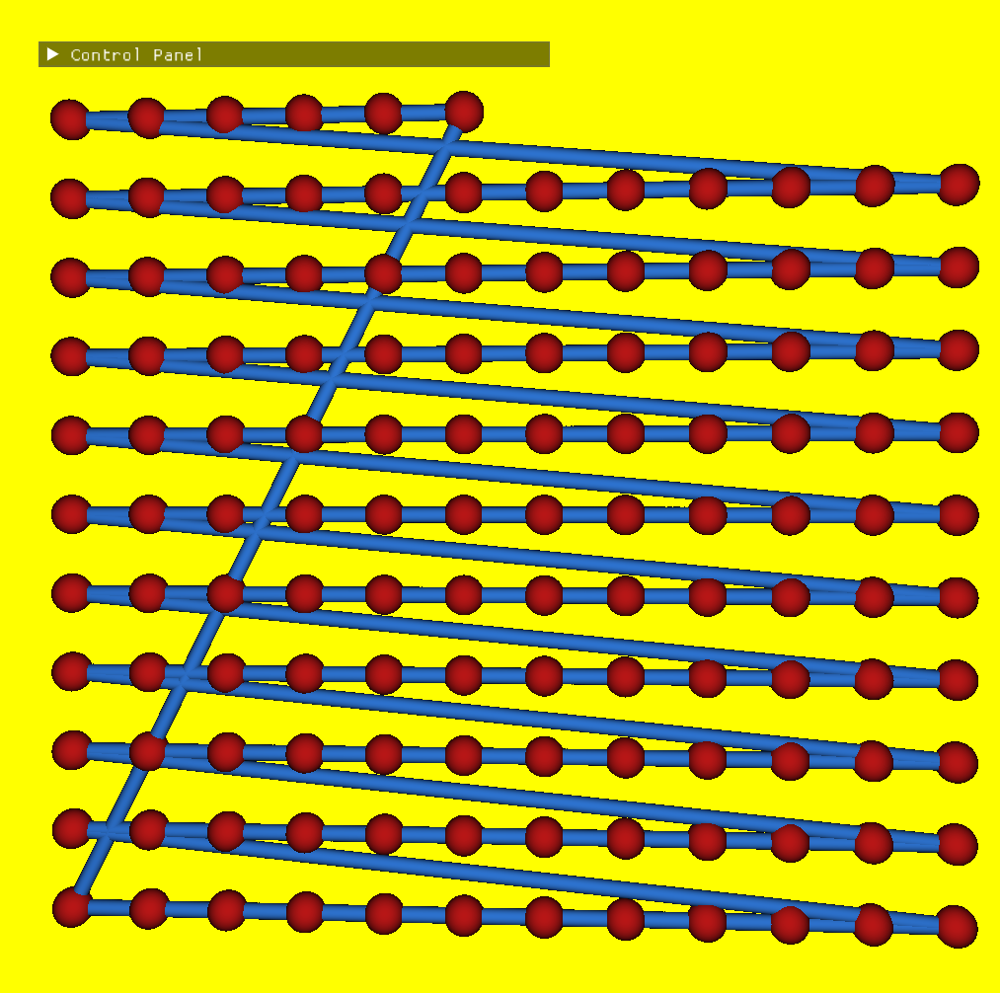 -->

**Fig. 1**

_Caption (Fig. 1): 268 entities_

<!--  -->

**Fig. 2**

_Caption (Fig. 2): 13,034 entities_

<!-- 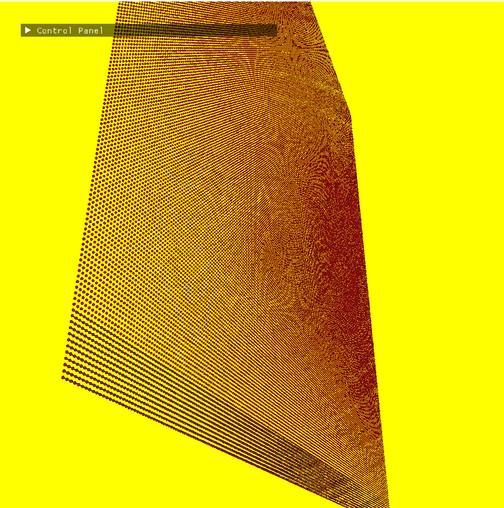 -->

**Fig. 3**

_Caption (Fig. 3): 86,760 entities_

<!-- 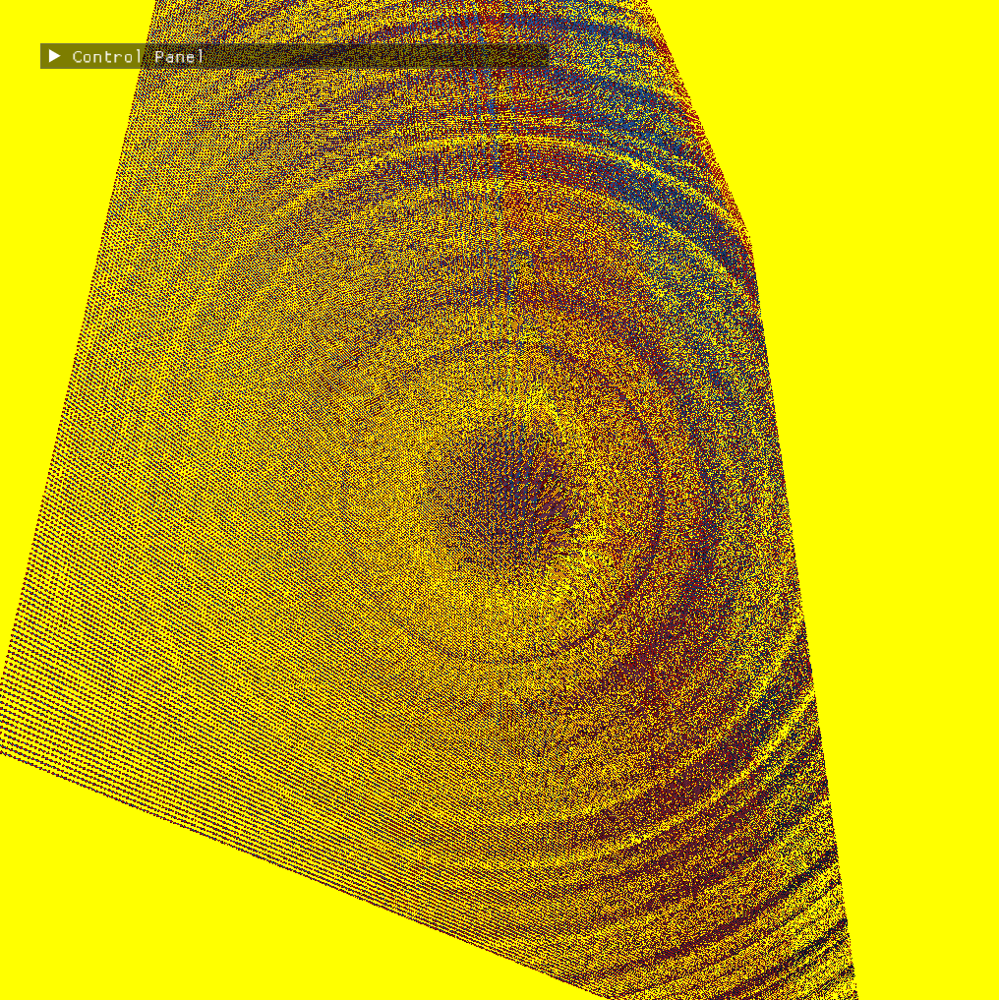 -->

**Fig. 4**

_Caption (Fig. 4): 1,069,995 entities_

<!-- 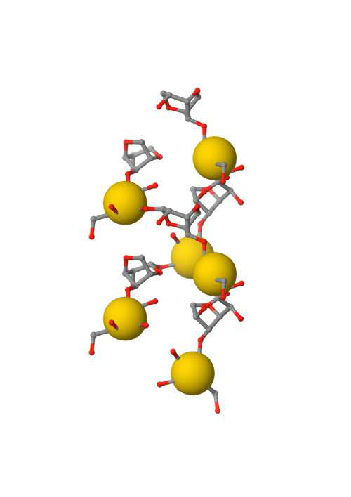 -->

**Fig. 5**

_Caption (Fig. 5): 1AGA_

<!-- 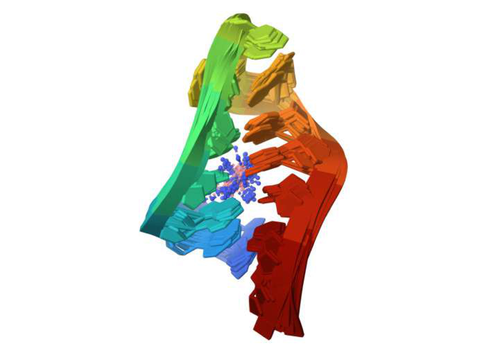 -->

**Fig. 6**

_Caption (Fig. 6): 1C0O_

<!-- 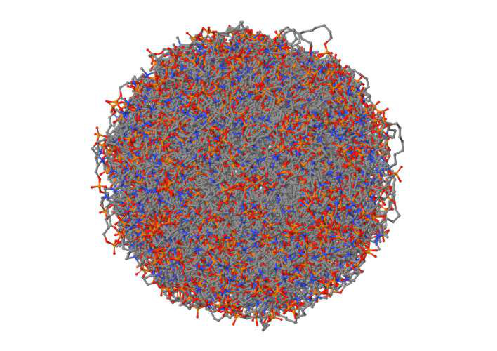 -->

**Fig. 7**

_Caption (Fig. 7): 2MJQ_

<!-- 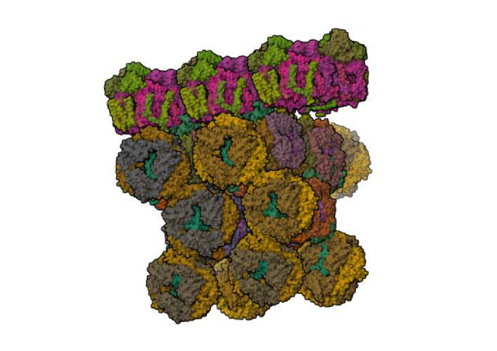 -->

**Fig. 8**

_Caption (Fig. 8): 8WQL_

In every scene, five different camera distances from the center were used, and for each distance the Nsight Graphics profiler captured 45 frames, from which all metrics available were extracted and analyzed (yet not every one of them was useful). For processing the captured data the metrics had to be exported. Nsight Graphics has a feature called ``trace analysis'' ([Fig. 9](#fig-9)) that allows selecting a frame range (or user‑defined debug ranges) and automatically aggregates performance data over that interval. The metrics reported are hardware counters: numeric values exposed by the GPU such as cycles, instructions, occupancy, cache hit rates, and memory throughput. Trace Analysis also breaks results down by pipeline/engine stages (e.g., graphics vs compute, and stages like vertex, raster, fragment), so it is possible to see where time and bandwidth are spent within the selected range. If glPushDebugGroup/glPopDebugGroup are used, Nsight shows those ranges in the timeline and can aggregate counters per range, but the ranges are not the stages themselves.

**Fig. 9**
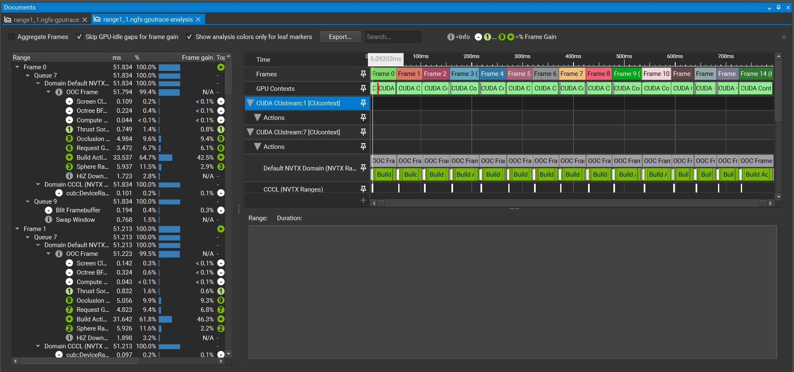

_Caption (Fig. 9): NSight Graphics Trace Analysis of some captured frames._

OpenGL glPushDebugGroup/glPopDebugGroup (KHR\*debug) defines local stream ranges; Nsight Graphics displays those ranges as user groups and aggregates timing and counters within them. NVTX nvtxRangePushA/nvtxRangePop defines CPU-side ranges in CUDA code that Nsight can correlate with GPU kernels, allowing per‑range attribution without changing program behavior ([Fig. 10](#fig-10)). For example, the different versions of the software use these features as follows:

##### `fst_parallel` (OpenGL debug groups)

Uses debug groups to separate sphere and cylinder phases, enabling attribution of cost by primitive type and by stage. For each frame, ranges mark “Sphere Frustum Culling”, “Sphere Rasterization”, “Cylinder Frustum Culling”, and “Cylinder Rasterization”.

##### `snd_parallel` (OpenGL debug groups)

Isolates bounding‑box construction from screen‑space intersection to understand where compute time is spent. The stages are labeled “Sphere Bbox Extraction Shader”, “Sphere Bbox Intersection Shader”, “Cylinder Bbox Extraction Shader”, and “Cylinder Bbox Intersection Shader”.

##### `standard_version` (OpenGL debug groups)

Separates culling (compute) from rasterization (draw) to compare their relative costs. The stages are “Sphere Culling Shader”, “Draw Spheres”, “Cylinder Culling Shader”, and “Draw Cylinders”.

##### `cuda_hybrid_binning` (NVTX ranges)

NVTX is used to segment the CUDA pipeline at both frame and sub‑pipeline granularity. Frame‑level stages are “Hybrid Binning Frame”, “Upload Constants”, “Reset Counters”, “Screen Clear”, “Sphere Pipeline Binning”, and “Cylinder Pipeline Binning”. Each pipeline is further subdivided into algorithmic stages—classification, sort/RLE and offsets, workgroup expansion, and raster for large/small entities—so the cost of each substep can be reported explicitly.

**Fig. 10**
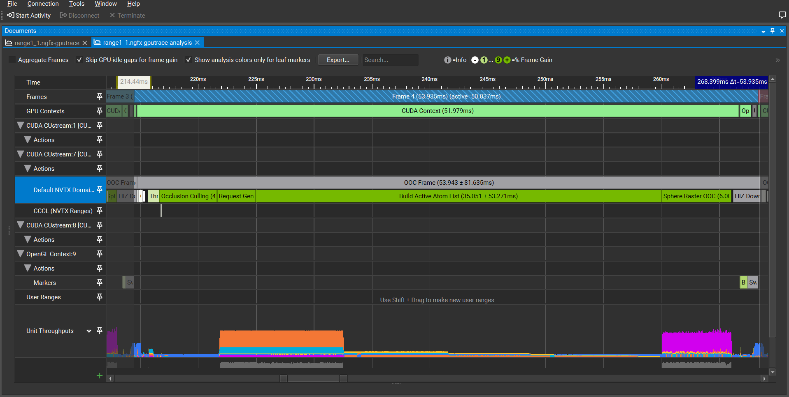

_Caption (Fig. 10): NSight Graphics Trace Analysis showing NVTX ranges for the CUDA hybrid binning implementation._

Trace analysis allows metrics per range to be exported in a file (e.g., .yaml) for offline processing, which was used in this work to run scripts, filter out irrelevant counters, and compare configurations across distances ([Fig. 11](#fig-11)).

**Fig. 11**
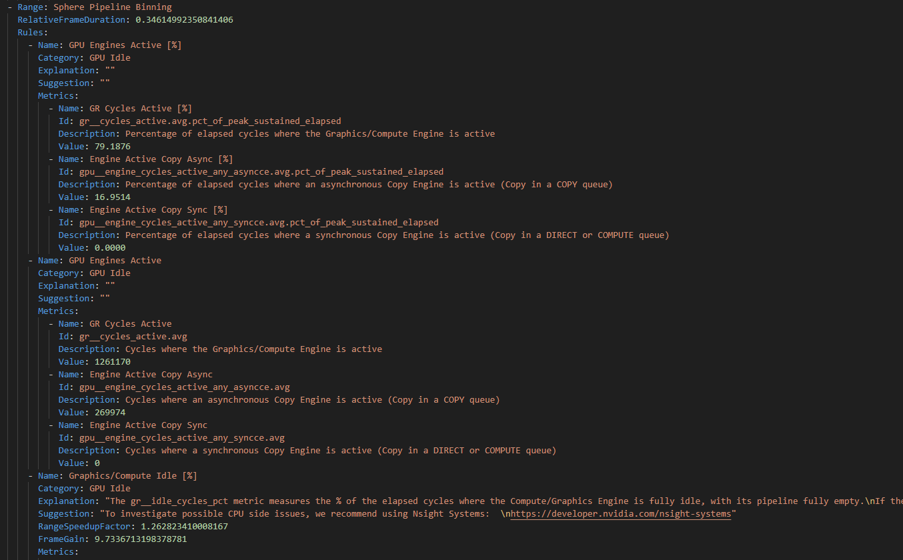

_Caption (Fig. 11): A sample of the .yaml export of the trace analysis, showing aggregated metrics for the “Sphere Pipeline Binning” NVTX range.._

Finally, the exported .yaml traces were parsed and aggregated with Jupyter notebooks (Python) to turn raw GPU counters into comparable results. The notebooks implement a repeatable pipeline: (i) load the YAML exports for each scene, distance, and repetition; (ii) group entries by Range (shader or NVTX range) and compute average/min/max values; (iii) when frame time logs are available, combine them with RelativeFrameDuration to estimate real milliseconds per range; (iv) assemble a unified table with metadata (version, scene, range) for cross-scene comparisons; and (v) filter the counter set to the metrics described in Appendix _Nsight Graphics Profiling Metrics_, prioritizing utilization and stall signals such as GR Cycles Active, GPU Idle, L1TEX/L2 hit rates, VRAM throughput, SM occupancy, and warp stall categories. For visualization, the notebooks pivot the data into Pandas DataFrames and produce (a) bar plots of average range cost per distance, (b) heatmaps to compare shader costs across scenes, (c) boxplots to show variability and stability across repetitions, and (d) line charts to show trends as the camera moves away from the scene. This workflow provides both a per-range view (where time and bandwidth are spent) and an aggregate view (how overall GPU behavior changes with scale).

### Experimentation of Out-of-Core Version

The out-of-core tests reused the same camera interleave strategy described in Section _Experimentation_, but the scene set was redesigned to stress streaming and memory management rather than only rasterization. The selected scenes were:

##### One molecular scene

**8WQL** as a realistic baseline.

##### Four synthetic three-dimensional grids

**G10M**, **G50M**, **G100M**, and **G500M**, configured to contain 10, 50, 100, and 500 million atoms.

These grids amplify the number of blocks and streaming requests while keeping a regular spatial distribution, which isolates the behaviour of the out-of-core pipeline under massive working sets. Besides Nsight Graphics traces, the out-of-core executable records additional profiling data that is not visible in GPU counters alone (using CPU-side timers and counters):

- **Batch CSV statistics** controlled by `stats_accumulate_frames` and `stats_csv_path`, aggregating `numVisible`, `numFiltered`, `numRequests`, `activeCount`, and frame time into mean/min/max per batch.

- **Preprocess and VRAM snapshot** written to `preprocess_stats_csv_path`, including Morton sort time, block file build time, octree build time, host structure sizes, block file size, and an estimated VRAM footprint (plus `cudaMemGetInfo` free/total).

- **NVTX ranges** for phase attribution in the GPU trace (frustum culling, occlusion, requests, streaming, active list build, raster).

As with the hybrid tests, the exported .yaml traces were analyzed in Jupyter notebooks; additionally, the batch CSV logs were joined with the YAML metrics to correlate GPU counters with logical streaming pressure across the five scenes.

---

## 3. Results

This section presents the full experimental results for the hybrid pipeline versions and the out-of-core implementation, as each targets different aspects of the software and therefore emphasizes different metrics. Unlike the thesis chapter—which abbreviates results to representative sphere-only plots—this report documents spheres and cylinders across molecular (sparse) and compact (synthetic) scenes, with per-metric breakdowns for every pipeline stage.

### 3.1 Hybrid pipeline versions

As stated at the beginning of this document, for analyzing the new hybrid version of the software it was required to analyze the results of the previous versions of the software, in order to understand the changes introduced in the hybrid version. Due to this, the analyzed stages of each pipeline are mentioned since metrics were extracted for each of them separately.

- For first GPGPU version (`fst_parallel`), the stages analyzed were:

##### Sphere Shader

One thread to one sphere, responsible for culling and rasterizing spheres.

##### Cylinder Shader

One thread to one cylinder, responsible for culling and rasterizing cylinders.

- For second GPGPU version (`snd_parallel`), the stages analyzed were:

##### Sphere Bbox Extraction Shader

One thread to one sphere, responsible for applying frustum culling and extracting (and storing) the bounding boxes of the spheres.

##### Sphere Bbox Intersection Shader

One thread per pixel, each workgroup (representing a tile) responsible for testing the intersection of the bounding boxes of the spheres with their pixels, and rasterizing the visible spheres.

##### Cylinder Bbox Extraction Shader

One thread to one cylinder, responsible for applying frustum culling and extracting (and storing) the bounding boxes of the cylinders.

##### Cylinder Bbox Intersection Shader

One thread per pixel, each workgroup (representing a tile) responsible for testing the intersection of the bounding boxes of the cylinders with their pixels and rasterizing the visible cylinders.

- For the standard version (`standard_version`), the stages analyzed were:

##### Sphere Culling Shader

One thread to one sphere, responsible for applying frustum culling to the spheres.

##### Draw Spheres

Rendering stage of visible spheres, uses 3 shaders: vertex, geometry and fragment shader. The vertex shader is responsible for transforming the vertices of the spheres, the geometry shader is responsible for generating the quads of the spheres and the fragment shader is responsible for rasterizing the visible spheres on the quads.

##### Cylinder Culling Shader

One thread to one cylinder, responsible for applying frustum culling to the cylinders.

##### Draw Cylinders

Rendering stage of visible cylinders, uses 3 shaders: vertex, geometry and fragment shader. The vertex shader is responsible for transforming the vertices of the cylinders, the geometry shader is responsible for generating the quads of the cylinders and the fragment shader is responsible for rasterizing the visible cylinders

On the aforementioned tests, these versions showed the next results for each metric on molecules:

#### 3.1.1 First GPGPU (`fst_parallel`)

##### Molecular (sparse) scenes

##### GPU Engines Active [\%]

##### Sphere Shader

The GR Engine[^1] activity decreased as the range increased (the camera moved away from the molecule). In this version, as the camera moved away the frame time became shorter, so CPU command submission and uniform uploads represented a larger fraction of the frame and this was reflected in the lower percentage. Moving uniforms to constant GPU memory, clearing internal buffers, and managing the Command Buffer (the list of commands the CPU sends to the GPU) consumed a larger share of the frame. The same pattern appeared in Copy Async: the asynchronous data-copy queue became more relevant as the frame became shorter. The synchronous copy engine stayed below 5%, so it was not a bottleneck.

**Fig. 12**
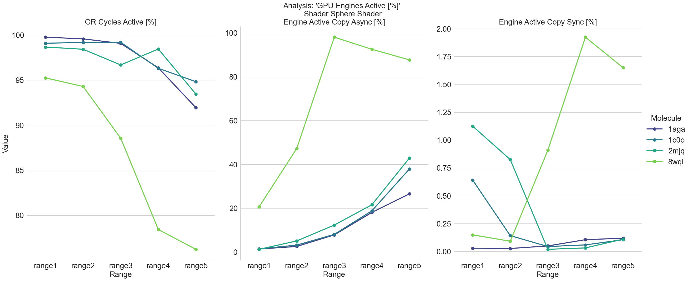

_Caption (Fig. 12): Charts showing GPU Engines Active (%) through different metrics for the Sphere Shader across different scenes and camera ranges. The x-axis represents the camera range (distance from the molecule), and the y-axis represents the value. Each chart has its own scale (mentioned in the title). Each line corresponds to a different scene._

##### Cylinder Shader

Behavior was similar to the Sphere Shader, but with a higher GPU Engines Active percentage, an increase in copy async with range, and low copy sync values.

**Fig. 13**
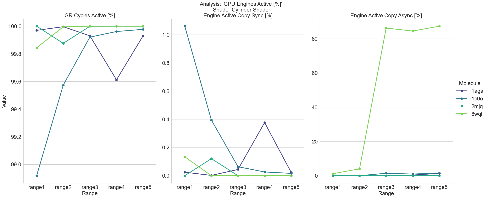

_Caption (Fig. 13): Charts showing GPU Engines Active (%) through different metrics for the Cylinder Shader across different scenes and camera ranges. The x-axis represents the camera range (distance from the molecule), and the y-axis represents the value. Each chart has its own scale (mentioned in the title). Each line corresponds to a different scene._

---

[^1]: In Nsight Graphics, the GR Engine metric represents the graphics/compute engine activity, i.e., the fraction of time the graphics or compute engine executed work.

##### GR Cycles Active

##### Sphere Shader

It was analogous to the previous metric, but it counted active GPU work cycles (idle cycles could still exist). Therefore, counterintuitively, as the molecule became larger the average cycles per range were lower. A small molecule had more data cached, so it worked continuously within a given time window, accumulating more active cycles than a large molecule that waited for more workgroups to launch, resulting in fewer active cycles and more waiting.

**Fig. 14**
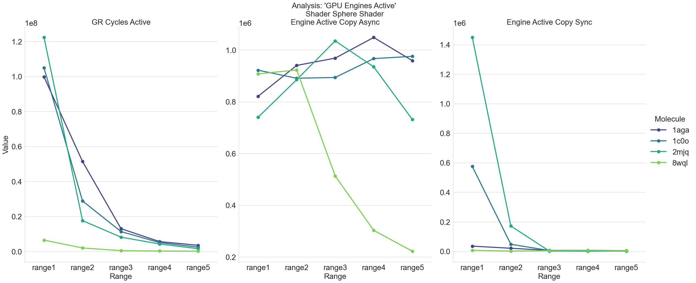

_Caption (Fig. 14): Charts showing GR Cycles Active through different metrics for the Sphere Shader across different scenes and camera ranges. The x-axis represents the camera range (distance from the molecule), and the y-axis represents the value. Each chart has its own scale (mentioned in the title). Each line corresponds to a different scene._

##### Cylinder Shader

Behavior was similar to the Sphere Shader.

**Fig. 15**
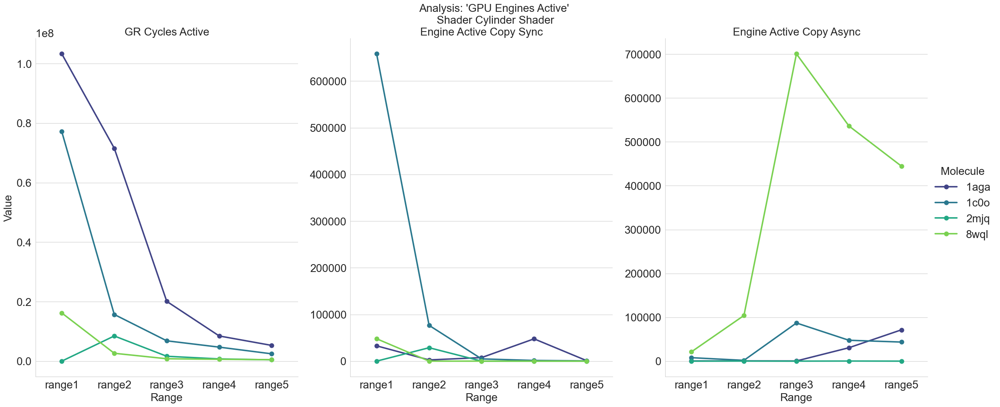

_Caption (Fig. 15): Charts showing GR Cycles Active through different metrics for the Cylinder Shader across different scenes and camera ranges. The x-axis represents the camera range (distance from the molecule), and the y-axis represents the value. Each chart has its own scale (mentioned in the title). Each line corresponds to a different scene._

##### Graphics/Compute Idle [\%]

##### Sphere Shader

This was the complement of the previous section. A high percentage of idle cycles was observed and could be due to several causes: the CPU took longer to prepare the draw call than the GPU took to execute it; the workload was small (not enough pixels to occupy all cores); or the per-entity workload varied substantially so some cores finished earlier than others (performance bubbles).

**Fig. 16**
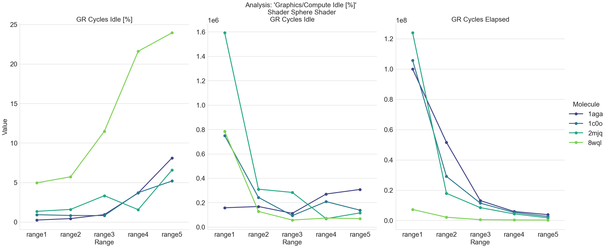

_Caption (Fig. 16): Charts showing Graphics/Compute Idle (%) through different metrics for the Sphere Shader across different scenes and camera ranges. The x-axis represents the camera range (distance from the molecule), and the y-axis represents the value. Each chart has its own scale (mentioned in the title). Each line corresponds to a different scene._

##### Cylinder Shader

Behavior was similar, although the magnitudes differed due to the different number of spheres and cylinders per scene. This was also visible in the plots.

**Fig. 17**
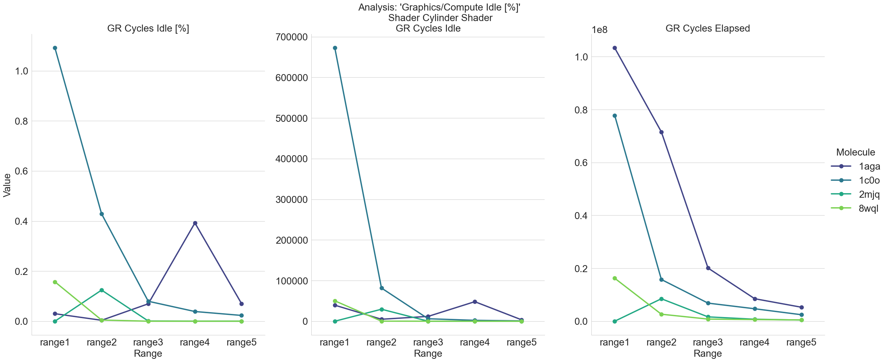

_Caption (Fig. 17): Charts showing Graphics/Compute Idle (%) through different metrics for the Cylinder Shader across different scenes and camera ranges. The x-axis represents the camera range (distance from the molecule), and the y-axis represents the value. Each chart has its own scale (mentioned in the title). Each line corresponds to a different scene._

##### L1TEX L2 Hit Rates

##### Sphere Shader

Only the smallest molecule reached around 35% hit rate (a cacheable molecule); the others did not exceed 20% and the hit rate decreased with range. In this shader most reads came from the depth buffer (depth comparison), while the other read fetched entity data (sphere or cylinder centers). The results were expected because entities were dispersed, so each thread read depth values at distant positions in the depth buffer, reducing coherence. As the camera moved farther away, atoms appeared closer together on screen; drawing different atoms in a few pixels further polluted the cache with new data.

**Fig. 18**
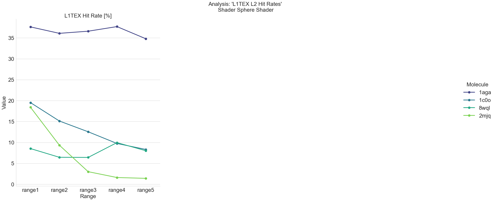

_Caption (Fig. 18): Charts showing L2 Hit Rates (%) through different metrics for the Sphere Shader across different scenes and camera ranges. The x-axis represents the camera range (distance from the molecule), and the y-axis represents the value. Each chart has its own scale (mentioned in the title). Each line corresponds to a different scene._

##### Cylinder Shader

Similar issues were observed, but the number of entities was much smaller in the two intermediate-size scenes.

**Fig. 19**
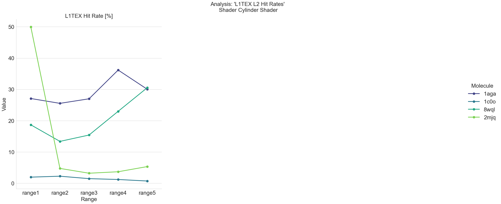

_Caption (Fig. 19): Charts showing L2 Hit Rates (%) through different metrics for the Cylinder Shader across different scenes and camera ranges. The x-axis represents the camera range (distance from the molecule), and the y-axis represents the value. Each chart has its own scale (mentioned in the title). Each line corresponds to a different scene._

##### L1Tex Miss Sectors

##### Sphere Shader

There were no texture reads, so the values for that category were low (and could not be recorded for all molecules). Atomic reduction operations (``fire and forget'')[^1] also showed very low miss values (good performance). For global buffer reads, miss rates increased in the largest molecule; this was attributed to entity fetches (only one read per thread). Interesting results appeared: surface writes (the framebuffer texture) showed that as range increased in the three smaller molecules the miss rate increased, which was logical because more atoms were written to dispersed screen areas, but the largest molecule behaved oppositely, showing fewer misses. This was attributed to the smaller molecules having more empty screen regions, so there was less pixel neighborhood locality. A similar pattern occurred for atomic operations: miss percentages were generally high, but for the largest molecule they decreased as range increased. These miss rates suggested that atomics could still become a bottleneck despite their efficiency at medium and long ranges.

**Fig. 20**
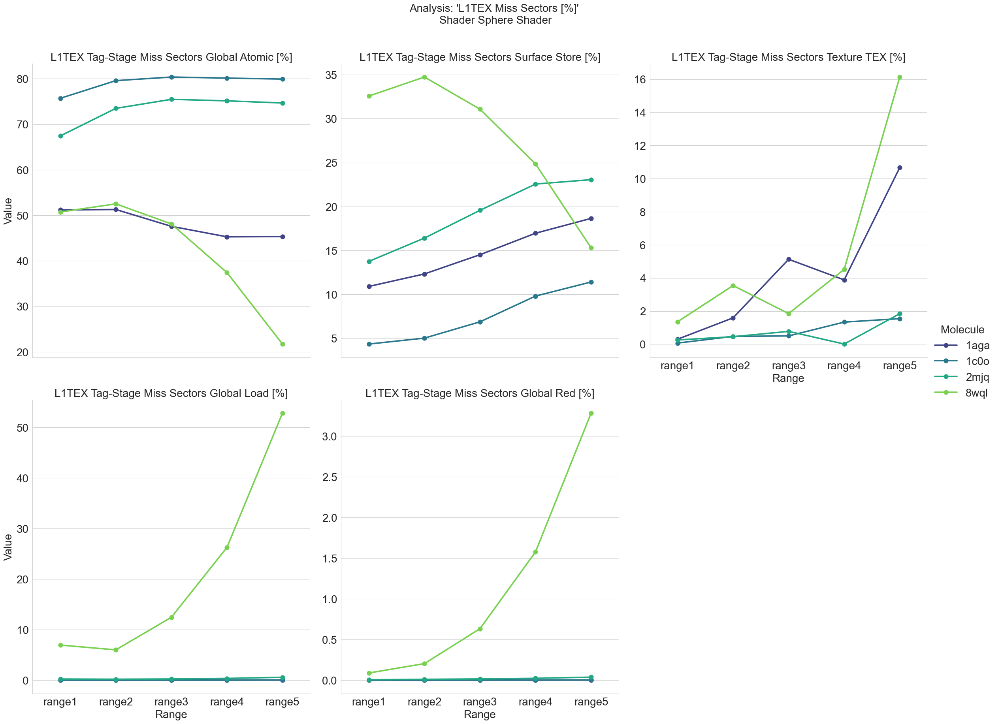

_Caption (Fig. 20): Charts showing L1 Miss Sectors through different metrics for the Sphere Shader across different scenes and camera ranges. The x-axis represents the camera range (distance from the molecule), and the y-axis represents the value. Each chart has its own scale (mentioned in the title). Each line corresponds to a different scene._

##### Cylinder Shader

The same pattern occurred as in the previous shader, although the texture/surface write percentages[^2] were lower on average.

**Fig. 21**
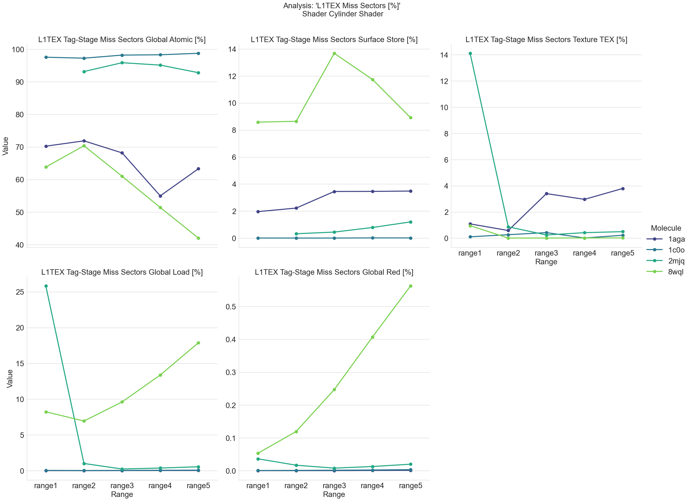

_Caption (Fig. 21): Charts showing L1 Miss Sectors through different metrics for the Cylinder Shader across different scenes and camera ranges. The x-axis represents the camera range (distance from the molecule), and the y-axis represents the value. Each chart has its own scale (mentioned in the title). Each line corresponds to a different scene._

---

[^1]: Here ``fire and forget'' referred to atomic updates where threads issued a write-only reduction (for example min/max) without consuming the result in the same stage.

[^2]: Surface stores refer to writes into 2D/3D image memory (framebuffer or texture surfaces) rather than linear buffers.

##### L1TEX Sectors [\%]

##### Sphere Shader

As expected, the percentages were mostly in L1 atomic operations, followed by surface stores and global buffer reads. Again, as molecule size and range increased, atomics used less L1 while global buffer reads became more important. This matched the earlier explanation: farther away -> fewer, more compact pixels -> fewer atomics and more organized access.

**Fig. 22**
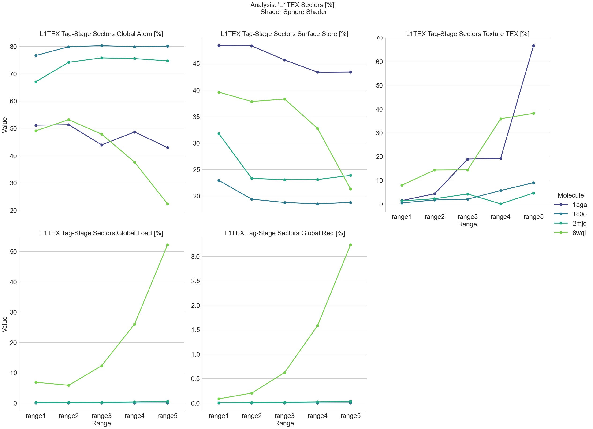

_Caption (Fig. 22): Charts showing L1TEX Sectors (%) through different metrics for the Sphere Shader across different scenes and camera ranges. The x-axis represents the camera range (distance from the molecule), and the y-axis represents the value. Each chart has its own scale (mentioned in the title). Each line corresponds to a different scene._

##### Cylinder Shader

Behavior was similar to the sphere shader.

**Fig. 23**
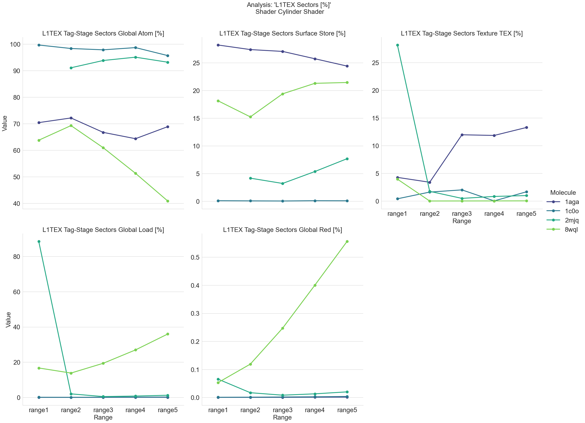

_Caption (Fig. 23): Charts showing L1TEX Sectors (%) through different metrics for the Cylinder Shader across different scenes and camera ranges. The x-axis represents the camera range (distance from the molecule), and the y-axis represents the value. Each chart has its own scale (mentioned in the title). Each line corresponds to a different scene._

##### Unit Throughputs

##### Sphere Shader

Larger molecules showed higher PCIe, VRAM, and compute unit usage, which was expected. PCIe usage increased with molecule size, likely due to command management for launching all threads, possibly because they did not fit in cache and required moving memory pages, which increased CPU-GPU traffic. It also increased with range because performance was better and the same transfers became more visible (in terms of CPU-GPU transfer work). VRAM throughput also increased as larger buffers were handled, but it did not reach concerning values (> 60%). SM Pipe FMA Active increased with range, which was expected because fewer spheres were removed by frustum culling and all expensive operations (bbox computation and ray casting) had to be applied. However, for the same reason, operation usage was not homogeneous across interaction within a molecule, and it could be better to separate culling from the full shader. At the largest range and the largest molecule a peak of 35% throughput was reached, so the shader was not compute bound (not by floating-point ops). SM Issue Active showed similar behavior, so there were no bottlenecks from the instruction issue rate. It did not exceed 30%.

**Fig. 24**
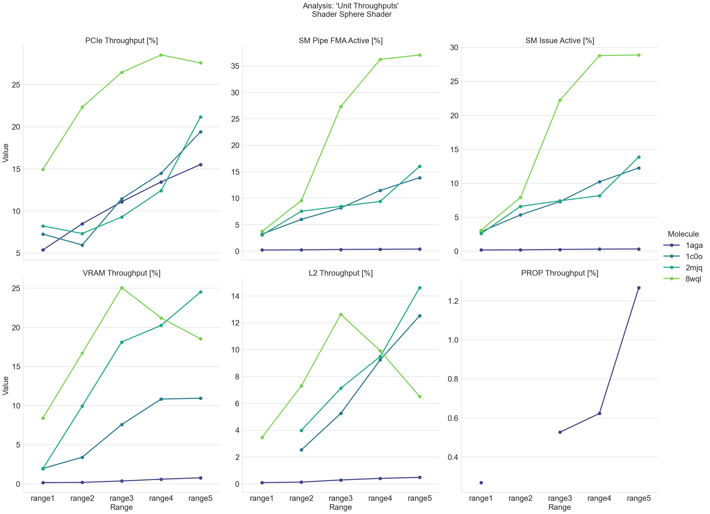

_Caption (Fig. 24): Charts showing Unit Throughputs (%) through different metrics for the Sphere Shader across different scenes and camera ranges. The x-axis represents the camera range (distance from the molecule), and the y-axis represents the value. Each chart has its own scale (mentioned in the title). Each line corresponds to a different scene._

##### Cylinder Shader

This case differed from the sphere shader. This shader was more intensive in complex computation and floating-point operations (finding the rotated cylinder edges, the 3D bounding box for frustum culling, ray-cylinder intersection), so more compute units were used. SM Pipe FMA Active was similar in shape to the sphere shader, but it reached around 65% utilization. Likewise, SM Issue Active reached around 70% utilization, likely due to the number of operations it had to handle. SM Pipe ALU Active reached around 45% (integer ops, indexing, for loops) and SM Pipe SFU Active around 35%. To save operations, another way to compute the 2D bbox was needed and the scanline algorithm should have been optimized. Cylinder processing also should have been separated from frustum culling.

**Fig. 25**
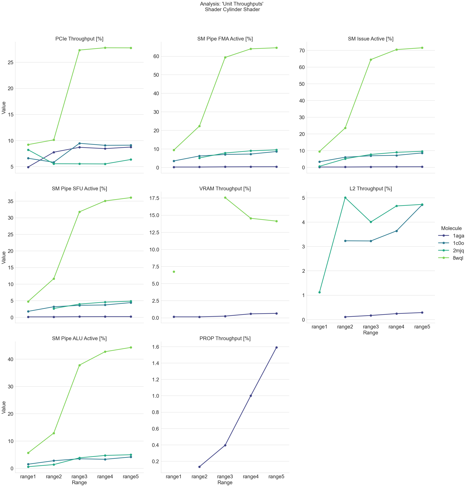

_Caption (Fig. 25): Charts showing Unit Throughputs (%) through different metrics for the Cylinder Shader across different scenes and camera ranges. The x-axis represents the camera range (distance from the molecule), and the y-axis represents the value. Each chart has its own scale (mentioned in the title). Each line corresponds to a different scene._

##### SM Warp Occupancy [Warps Per Cycle]

##### Sphere Shader

The small molecules had low occupancy because few threads were launched. For the second largest molecule, occupancy increased with range, but it dropped from the penultimate range to the last one. For the largest molecule the drop started at range 3. This was attributed to the fact that as the camera moved away fewer spheres were removed, so the workload was larger and more even across warps, but at very large distances the work per warp simply decreased. The two largest molecules showed good occupancy, but the variation was very high. VTG and PS warps[^1] were omitted.

**Fig. 26**
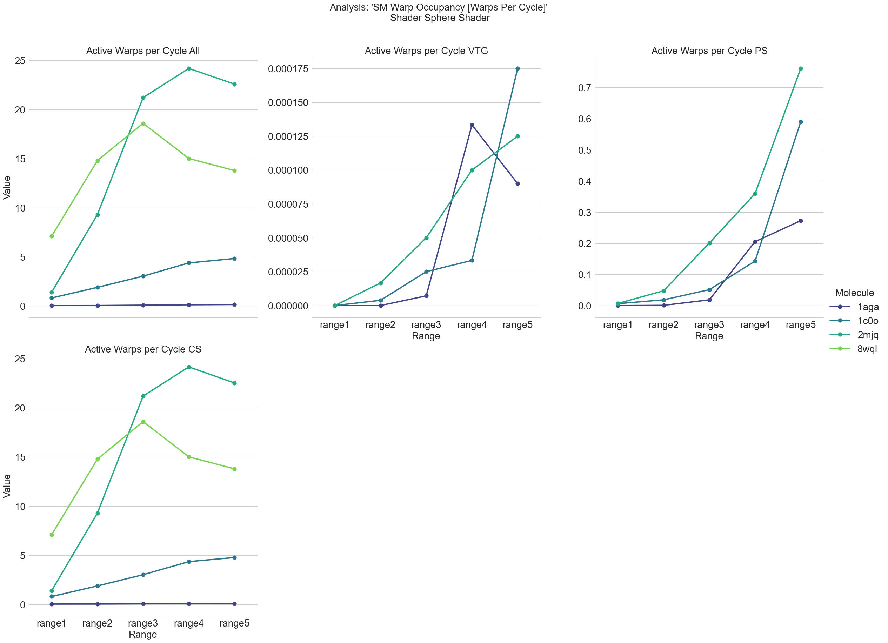

_Caption (Fig. 26): Charts showing SM Warp Occupancy (Warps Per Cycle) through different metrics for the Sphere Shader across different scenes and camera ranges. The x-axis represents the camera range (distance from the molecule), and the y-axis represents the value. Each chart has its own scale (mentioned in the title). Each line corresponds to a different scene._

##### Cylinder Shader

In this case only the largest molecule showed high occupancy, and it increased steadily with range (substantial work and low divergence). There was little variation, likely because the number of entities varied little among the three smaller molecules.

**Fig. 27**
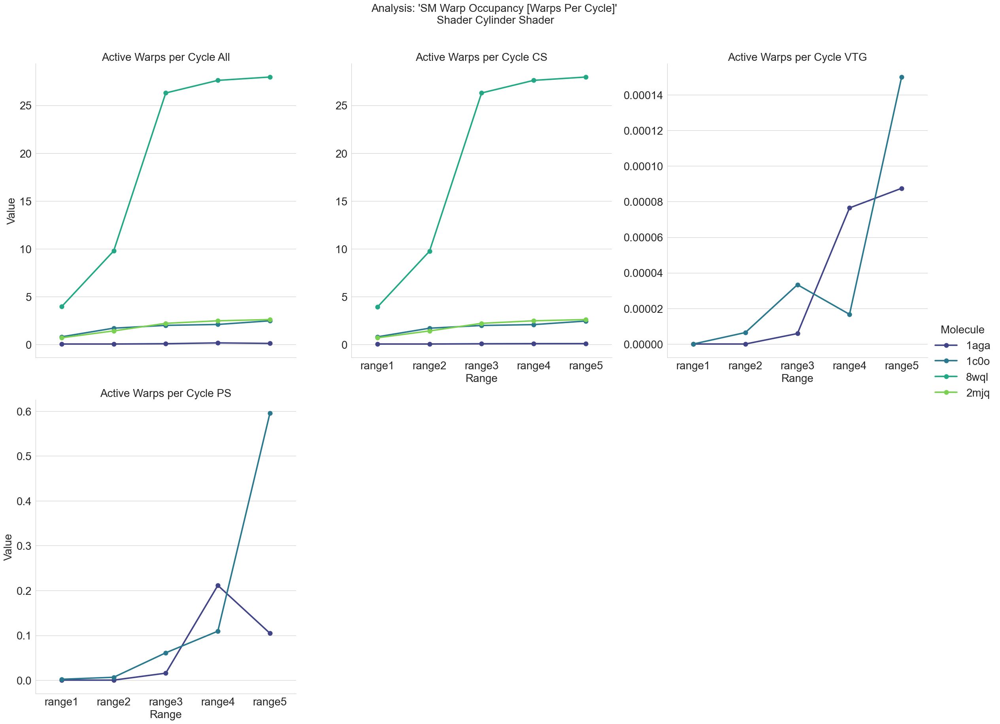

_Caption (Fig. 27): Charts showing SM Warp Occupancy (Warps Per Cycle) through different metrics for the Cylinder Shader across different scenes and camera ranges. The x-axis represents the camera range (distance from the molecule), and the y-axis represents the value. Each chart has its own scale (mentioned in the title). Each line corresponds to a different scene._

---

[^1]: VTG refers to vertex/tessellation/geometry stages and PS to pixel/fragment shader warps; these were not applicable because the pipeline was compute-only.

##### SM Warp Occupancy [\%]

##### Sphere Shader

For the smallest molecule there were few entities, so few SMs were used, but the ones used were well utilized. For the other molecules, at short ranges there were more idle warps (unused warp slots in idle SMs was high) but this decreased with range. This was due to load imbalance (a large sphere kept an SM busy even after other warps finished); as the camera moved farther away there was less idle time. For that reason the percentage of unused warp slots in active SMs also decreased.

**Fig. 28**
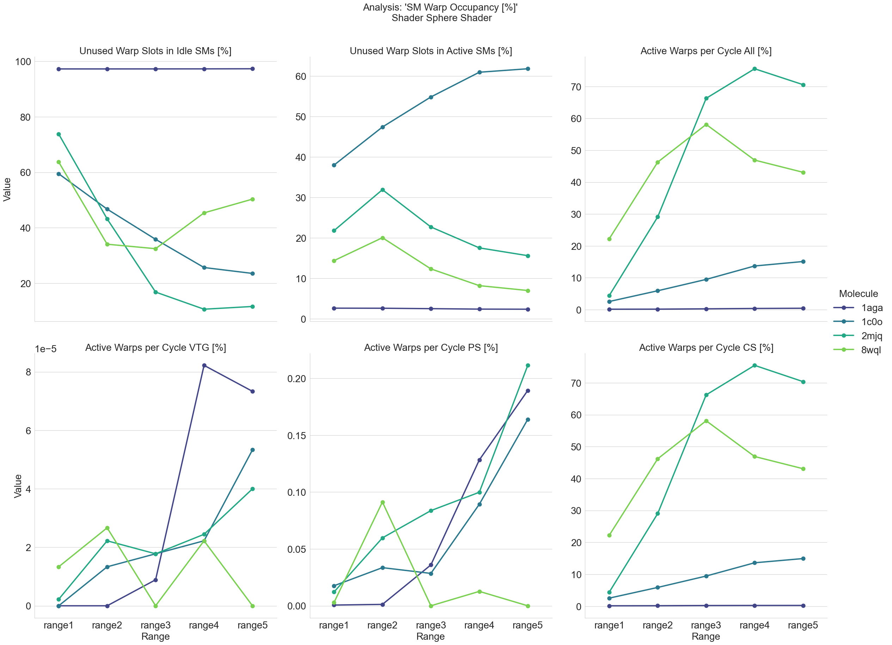

_Caption (Fig. 28): Charts showing SM Warp Occupancy (%) through different metrics for the Sphere Shader across different scenes and camera ranges. The x-axis represents the camera range (distance from the molecule), and the y-axis represents the value. Each chart has its own scale (mentioned in the title). Each line corresponds to a different scene._

##### Cylinder Shader

Similar to the previous shader, but the load distribution appeared even more unbalanced.

**Fig. 29**
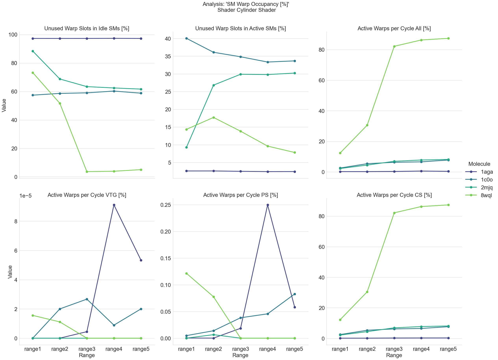

_Caption (Fig. 29): Charts showing SM Warp Occupancy (%) through different metrics for the Cylinder Shader across different scenes and camera ranges. The x-axis represents the camera range (distance from the molecule), and the y-axis represents the value. Each chart has its own scale (mentioned in the title). Each line corresponds to a different scene._

##### SM Warp Issue Stalls

##### Sphere Shader

For `No Instruction'' and `Short Scoreboard'' the values were consistently very low, so there were no stalls from those causes. For `Not Selected'' the values were low but a slight increase appeared with range and molecule size, which made sense because more warps were launched and fewer spheres were removed. For `Stalled Wall'' there was an increase with molecule size, but at some point a decrease appeared. This was attributed to the fact that at sufficiently large distances all entities occupied only a few pixels, so divergence resolved quickly. ``Long Scoreboard'' showed the highest percentages; they decreased with range, but at no point did they represent a bottleneck. It could be projected that at short ranges and for larger molecules it could become one. Coalescing should have been improved, shared memory should have been attempted, or atomic operations should have been reduced.

**Fig. 30**
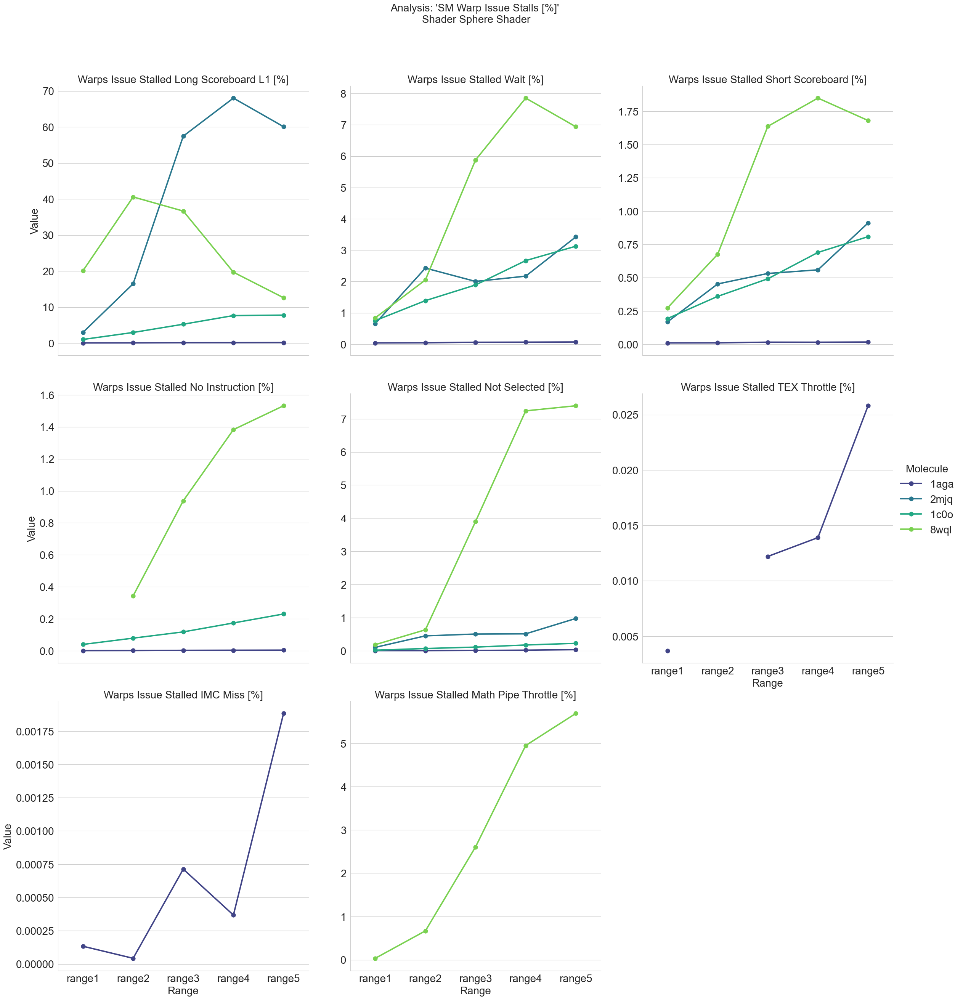

_Caption (Fig. 30): Charts showing SM Warp Issue Stalls for the Sphere Shader across different scenes and camera ranges. The x-axis represents the camera range (distance from the molecule), and the y-axis represents the value. Each chart has its own scale (mentioned in the title). Each line corresponds to a different scene._

##### Cylinder Shader

In this case, unlike the previous shader, `Stalled Wall'' increased steadily, as did `Not Selected''. This was attributed to the same reason that this shader was more compute intensive and divergent (for loops and conditionals), so the GPU tended not to select warps from entities that required more work.

**Fig. 31**
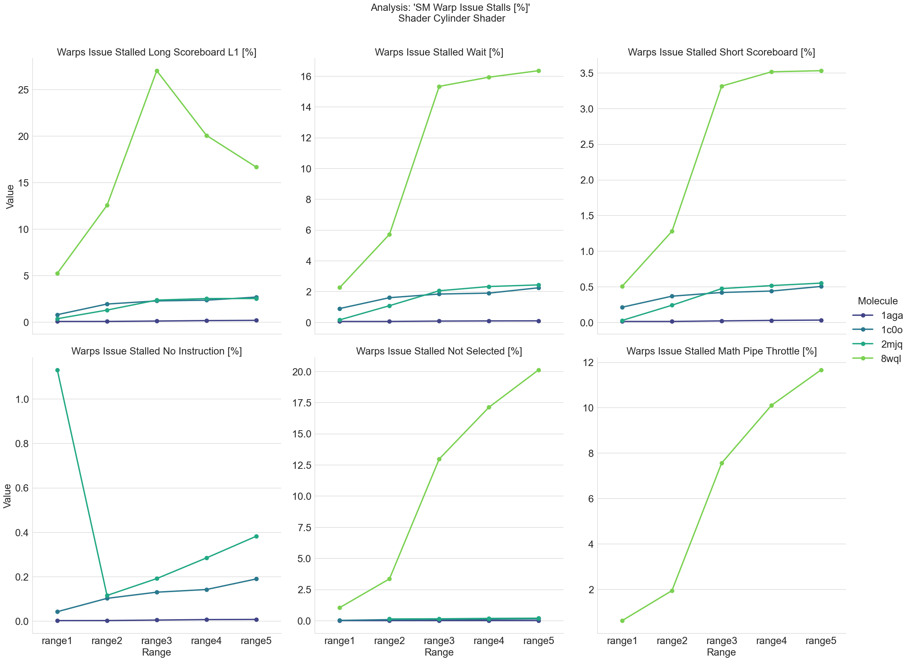

_Caption (Fig. 31): Charts showing SM Warp Issue Stalls for the Cylinder Shader across different scenes and camera ranges. The x-axis represents the camera range (distance from the molecule), and the y-axis represents the value. Each chart has its own scale (mentioned in the title). Each line corresponds to a different scene._

##### Cumulative Warp Latencies [\%]

##### Sphere Shader

No notable or useful results were obtained.

**Fig. 32**
![Charts showing Cumulative Warp Latencies [%] for the Sphere Shader across different scenes and camera ranges. The x-a...](img/chapter3/results/fst_gpu/cumulative_warp_lat_pcnt/sphere_shader.png)

_Caption (Fig. 32): Charts showing Cumulative Warp Latencies [%] for the Sphere Shader across different scenes and camera ranges. The x-axis represents the camera range (distance from the molecule), and the y-axis represents the value. Each chart has its own scale (mentioned in the title). Each line corresponds to a different scene._

##### Cylinder Shader

No notable or useful results were obtained.

**Fig. 33**
![Charts showing Cumulative Warp Latencies [%] for the Cylinder Shader across different scenes and camera ranges. The x...](img/chapter3/results/fst_gpu/cumulative_warp_lat_pcnt/cylinder_shader.png)

_Caption (Fig. 33): Charts showing Cumulative Warp Latencies [%] for the Cylinder Shader across different scenes and camera ranges. The x-axis represents the camera range (distance from the molecule), and the y-axis represents the value. Each chart has its own scale (mentioned in the title). Each line corresponds to a different scene._

##### Cumulative Warp Latencies [Cycles]

##### Sphere Shader

In this case the latency cycles of compute shader warps decreased as range increased, although not necessarily with molecule changes.

**Fig. 34**
![Charts showing Cumulative Warp Latencies [Cycles] for the Sphere Shader across different scenes and camera ranges. Th...](img/chapter3/results/fst_gpu/cumulative_warp_lat/sphere_shader.png)

_Caption (Fig. 34): Charts showing Cumulative Warp Latencies [Cycles] for the Sphere Shader across different scenes and camera ranges. The x-axis represents the camera range (distance from the molecule), and the y-axis represents the value. Each chart has its own scale (mentioned in the title). Each line corresponds to a different scene._

##### Cylinder Shader

Behavior was similar to the previous shader.

**Fig. 35**
![Charts showing Cumulative Warp Latencies [Cycles] for the Cylinder Shader across different scenes and camera ranges. ...](img/chapter3/results/fst_gpu/cumulative_warp_lat/cylinder_shader.png)

_Caption (Fig. 35): Charts showing Cumulative Warp Latencies [Cycles] for the Cylinder Shader across different scenes and camera ranges. The x-axis represents the camera range (distance from the molecule), and the y-axis represents the value. Each chart has its own scale (mentioned in the title). Each line corresponds to a different scene._

##### Active Threads Per Warp

##### Sphere Shader

For each counter:

- `Thread Inst Executed Pred On per Inst Executed [%]` increased with range. At the closest ranges the worst percentage was a bit over 10%, and in the best cases at higher ranges it reached a bit over 60%.

- `SM Thread Executed Pred On` decreased with range, reaching the lowest values for the smallest molecule (around 130 spheres) and for the largest molecule (just over 500k spheres).

- `SM Inst Executed` behaved similarly to the previous metric.

At close ranges there were 32 spheres/threads in a warp. One of them was very close to the camera (1 000 000 pixels) and the rest were not (less than 50% of the pixels of the near sphere). Each pixel was an iteration of the for loop, so the threads with few pixels finished quickly. However, they could not exit; they had to wait for the large thread to finish its remaining iterations (hundreds or thousands of iterations). During those iterations the low-pixel threads were ``predicated off''[^1] and their potential was wasted. The reason the smallest and the largest molecules showed the best efficiency could be that the small molecule launched very few threads, so the total instruction count was low. The large molecule launched more warps, which even at close ranges had far spheres that executed fewer instructions than the near ones.

**Fig. 36**
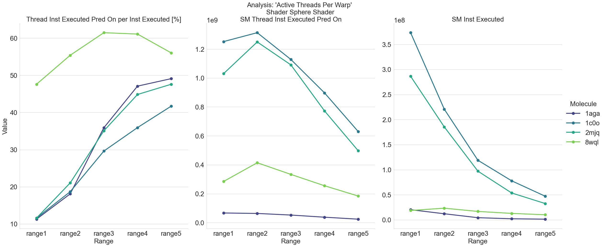

_Caption (Fig. 36): Charts showing Active Threads per Warp for the Sphere Shader across different scenes and camera ranges. The x-axis represents the camera range (distance from the molecule), and the y-axis represents the value. Each chart has its own scale (mentioned in the title). Each line corresponds to a different scene._

##### Cylinder Shader

Efficiency behaved similarly to the spheres, but with a maximum of around 45%. The 2MJQ molecule in the first range reported 70% efficiency, but it seemed to be an outlier. A lower total instruction count also appeared, but the number of cylinders in 2MJQ was notably smaller than the number of spheres, so the results were expected. 8WQL, on the other hand, showed more instructions and more instructions executed with predicates on.

**Fig. 37**
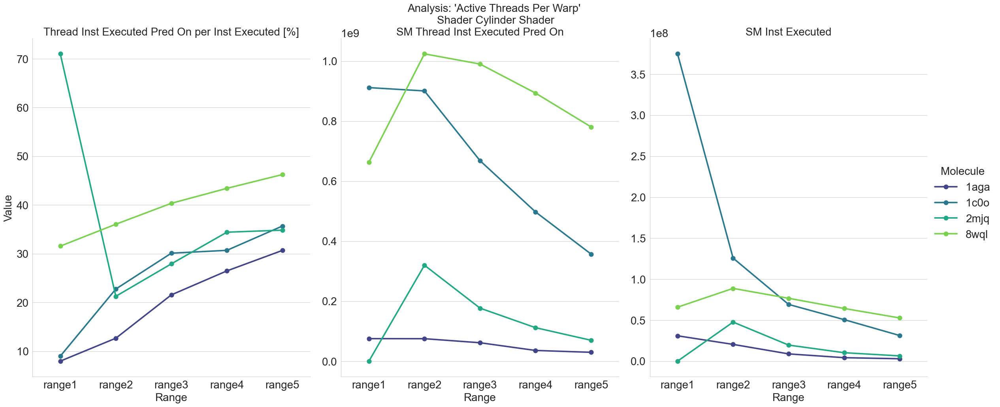

_Caption (Fig. 37): Charts showing Active Threads per Warp for the Cylinder Shader across different scenes and camera ranges. The x-axis represents the camera range (distance from the molecule), and the y-axis represents the value. Each chart has its own scale (mentioned in the title). Each line corresponds to a different scene._

---

[^1]: Predicated-off threads are inactive within a warp when their predicate evaluates false; they do not execute instructions until reconvergence, effectively idling.

##### Warp Launch Stalled by Reasons [\%]

##### Sphere Shader

Only CS Warp Launch Stalled Warp Slot Allocation [%] measurements were available for the largest molecules, where intermediate ranges reached around 30%, because few or no spheres were removed while the camera was still close enough to imply a high workload. This meant the GPU was well occupied but inefficient (thread utilization discussed earlier).

**Fig. 38**
![Charts showing Warp Launch Stalled by Reasons [%] for the Sphere Shader across different scenes and camera ranges. Th...](img/chapter3/results/fst_gpu/launch_stalled_reasons/sphere_shader.png)

_Caption (Fig. 38): Charts showing Warp Launch Stalled by Reasons [%] for the Sphere Shader across different scenes and camera ranges. The x-axis represents the camera range (distance from the molecule), and the y-axis represents the value. Each chart has its own scale (mentioned in the title). Each line corresponds to a different scene._

##### Cylinder Shader

Results were similar to the Sphere Shader, but only for the largest molecule 8WQL.

**Fig. 39**
![Charts showing Warp Launch Stalled by Reasons [%] for the Cylinder Shader across different scenes and camera ranges. ...](img/chapter3/results/fst_gpu/launch_stalled_reasons/cylinder_shader.png)

_Caption (Fig. 39): Charts showing Warp Launch Stalled by Reasons [%] for the Cylinder Shader across different scenes and camera ranges. The x-axis represents the camera range (distance from the molecule), and the y-axis represents the value. Each chart has its own scale (mentioned in the title). Each line corresponds to a different scene._

##### SM Throughputs

##### Sphere Shader

The percentages increased with range (fewer entities removed -> more to process). In the largest molecule the highest percentages were 35% in FMA Active and 30% in Issue Active.

**Fig. 40**
![Charts showing SM Throughputs [%] for the Sphere Shader across different scenes and camera ranges. The x-axis represe...](img/chapter3/results/fst_gpu/sm_throughput/sphere_shader.png)

_Caption (Fig. 40): Charts showing SM Throughputs [%] for the Sphere Shader across different scenes and camera ranges. The x-axis represents the camera range (distance from the molecule), and the y-axis represents the value. Each chart has its own scale (mentioned in the title). Each line corresponds to a different scene._

##### Cylinder Shader

The percentages also increased with range, but in this case all units showed very high percentages.

**Fig. 41**
![Charts showing SM Throughputs [%] for the Cylinder Shader across different scenes and camera ranges. The x-axis repre...](img/chapter3/results/fst_gpu/sm_throughput/cylinder_shader.png)

_Caption (Fig. 41): Charts showing SM Throughputs [%] for the Cylinder Shader across different scenes and camera ranges. The x-axis represents the camera range (distance from the molecule), and the y-axis represents the value. Each chart has its own scale (mentioned in the title). Each line corresponds to a different scene._

##### Performance Per Marked Range

**Fig. 42**
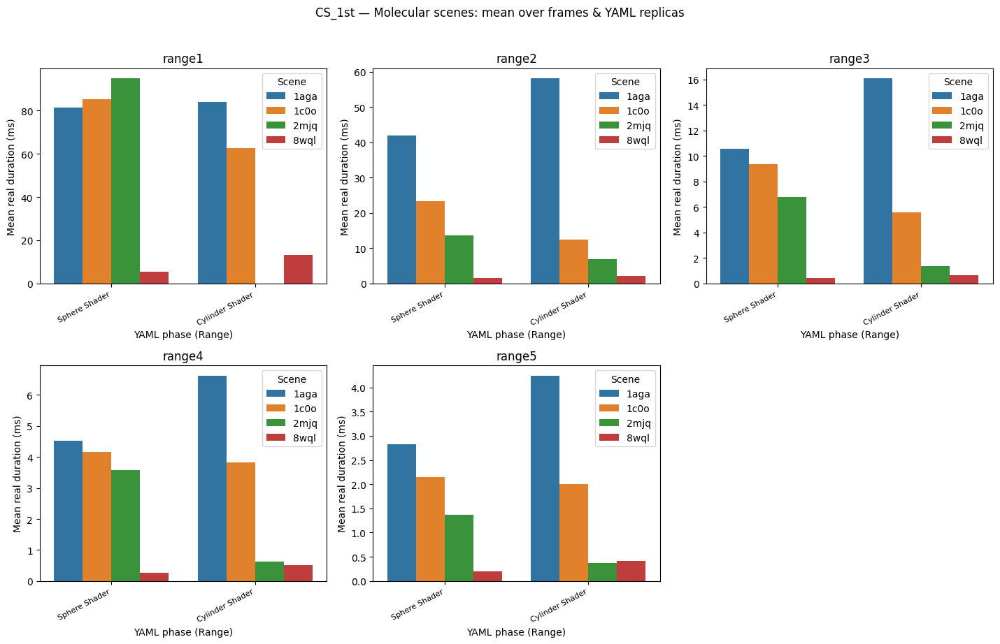

_Caption (Fig. 42): Charts showing frame time per marked range for the first GPGPU version across different scenes and camera ranges. The x-axis represents the camera range (distance from the molecule), and the y-axis represents the value. Each chart has its own scale (mentioned in the title). Each line corresponds to a different scene._

In [Fig. 42](#fig-42) it can be observed that 1AGA presented one of the worst performances for this version since its ranges were closer to the camera, since it was smaller. Other than that, is direct how scale of values decrease across ranges, having values around 80ms for shaders on range 1, but less than 4ms for range 5. Also 8WQL had the best performance, since its ranges were farther from the camera.

##### Compact (synthetic) scenes

##### GPU Engines Active [\%]

##### Sphere Shader

**Fig. 43**
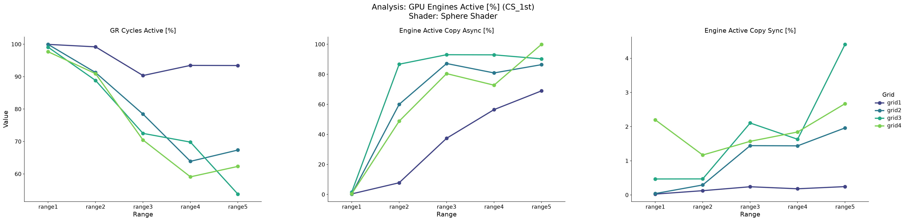

_Caption (Fig. 43): Charts showing GPU Engines Active (%) through different metrics for the Sphere Shader across compact grid scenes grid1–grid4 The x-axis represents the camera range (distance from the scene), and the y-axis represents the value. Each chart has its own scale (mentioned in the title). Each line corresponds to a different grid (grid1, grid2, …)._

In [Fig. 43](#fig-43) GR Cycles Active show almost equal behaviour for every grid, decreasing percentage across ranges, which is expected since for tinier spheres there will be better performance. Also with ranges it can be seen how Copy Async [%] increases with range. This could be because with less overall work it becomes relevant. Copy Sync [%] is lower than 5 anytime, meaning that there is no synchronous data transfer.

##### Cylinder Shader

**Fig. 44**
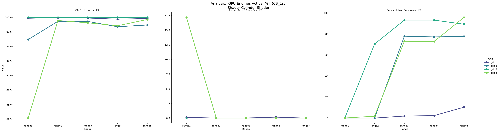

_Caption (Fig. 44): Charts showing GPU Engines Active (%) through different metrics for the Cylinder Shader across compact grid scenes grid1–grid4 The x-axis represents the camera range (distance from the scene), and the y-axis represents the value. Each chart has its own scale (mentioned in the title). Each line corresponds to a different grid (grid1, grid2, …)._

In [Fig. 44](#fig-44), similar as spheres, GR Cycles Active show almost equal behaviour for every grid, decreasing percentage across ranges, which is expected since for tinier cylinders there will be better performance. Also with ranges it can be seen how Copy Async [%] increases with range. This could be because with less overall work it becomes relevant. Copy Sync [%] is lower than 5 anytime, meaning that there is no synchronous data transfer.

##### GR Cycles Active

##### Sphere Shader

**Fig. 45**
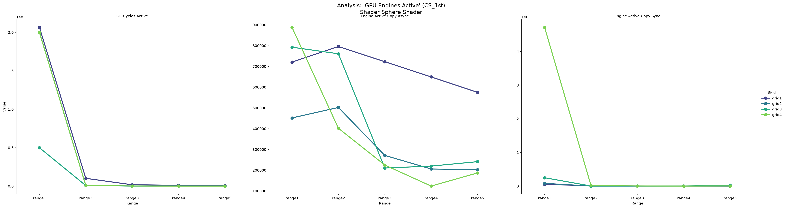

_Caption (Fig. 45): Charts showing GR Cycles Active through different metrics for the Sphere Shader across compact grid scenes grid1–grid4 The x-axis represents the camera range (distance from the scene), and the y-axis represents the value. Each chart has its own scale (mentioned in the title). Each line corresponds to a different grid (grid1, grid2, …)._

Different as in the las metric, [Fig. 45](#fig-45) shows the information but with cycles, and it is possible to see that low ranges consume the largest amount of cycles, and yet still just a few for Copy Sync. GR Cycles Active reaches a peak in range1 with around 2 times 10^8 cycles, and from range2 onwards it is close to 0, demonstrating the difference in work.

##### Cylinder Shader

**Fig. 46**
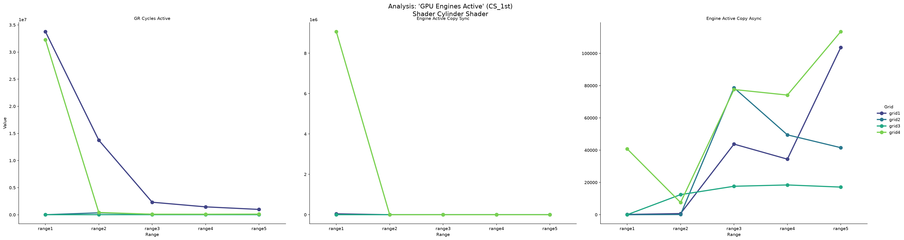

_Caption (Fig. 46): Charts showing GR Cycles Active through different metrics for the Cylinder Shader across compact grid scenes grid1–grid4 The x-axis represents the camera range (distance from the scene), and the y-axis represents the value. Each chart has its own scale (mentioned in the title). Each line corresponds to a different grid (grid1, grid2, …)._

Same as with spheres in this metric, cylinders show a very similar behaviour in [Fig. 46](#fig-46).

##### Graphics/Compute Idle [\%]

##### Sphere Shader

**Fig. 47**
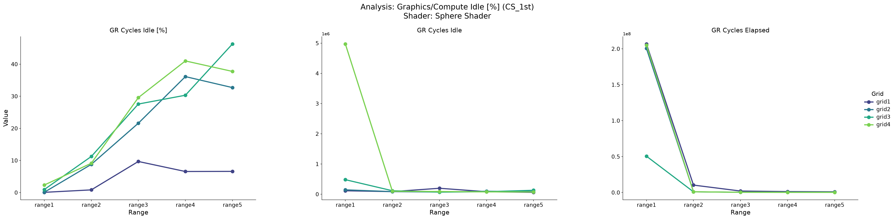

_Caption (Fig. 47): Charts showing Graphics/Compute Idle (%) through different metrics for the Sphere Shader across compact grid scenes grid1–grid4 The x-axis represents the camera range (distance from the scene), and the y-axis represents the value. Each chart has its own scale (mentioned in the title). Each line corresponds to a different grid (grid1, grid2, …)._

Contrary to the last metric (since they are complementary), it seems to be a tendency to rise the percentage of Idle Cycles across ranges, going from almost 0% for every grid to reaching around 45% as a maximum. With GR Cycles Idle it can be seen that, since they don't increase, then the GR Cycles Idle [%] growing is due to the decreasing of GR Active Cycles. See [Fig. 47](#fig-47)

##### Cylinder Shader

**Fig. 48**
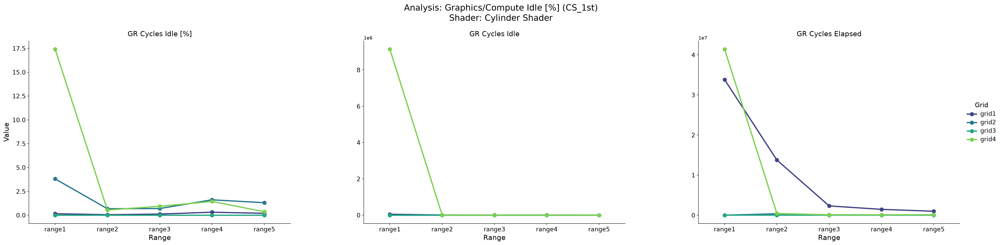

_Caption (Fig. 48): Charts showing Graphics/Compute Idle (%) through different metrics for the Cylinder Shader across compact grid scenes grid1–grid4 The x-axis represents the camera range (distance from the scene), and the y-axis represents the value. Each chart has its own scale (mentioned in the title). Each line corresponds to a different grid (grid1, grid2, …)._

Cylinders have a different tendency. [Fig. 48](#fig-48) shows how GR Cycles Idle [%] get lower from range1 to range2 and then they keep an almost steady line. GR Cycles Idle (cycles) don't grow either.

##### L1TEX L2 Hit Rates

##### Sphere Shader

**Fig. 49**
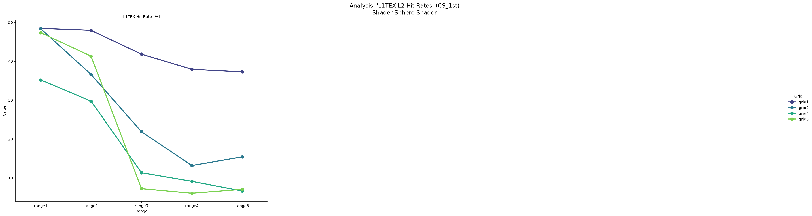

_Caption (Fig. 49): Charts showing L2 Hit Rates (%) through different metrics for the Sphere Shader across compact grid scenes grid1–grid4 The x-axis represents the camera range (distance from the scene), and the y-axis represents the value. Each chart has its own scale (mentioned in the title). Each line corresponds to a different grid (grid1, grid2, …)._

From [Fig. 49](#fig-49) it is possible to see that for spheres cache hit rate starts with great values in range1 (values over 30%, lower than 50%), but then it drops dramatically until range3 and continues as a steady line. This confirms bad use of cache when threads may paint random pixels.

##### Cylinder Shader

**Fig. 50**
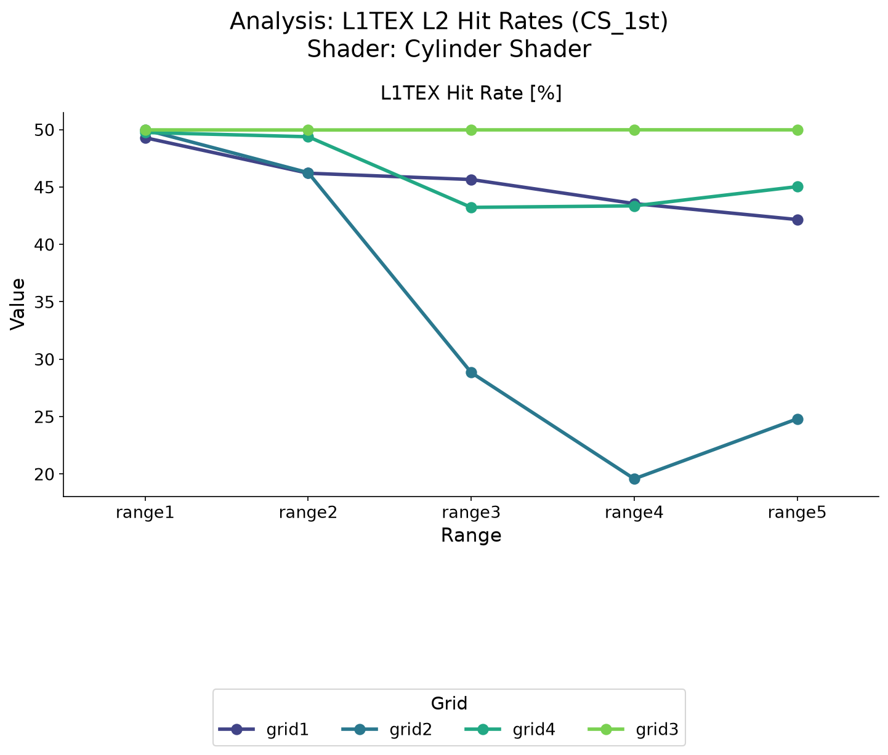

_Caption (Fig. 50): Charts showing L2 Hit Rates (%) through different metrics for the Cylinder Shader across compact grid scenes grid1–grid4 The x-axis represents the camera range (distance from the scene), and the y-axis represents the value. Each chart has its own scale (mentioned in the title). Each line corresponds to a different grid (grid1, grid2, …)._

Cylinders could seem similar as spheres, but the drop in hit rate is not as notorious, yet there is decline (see [Fig. 50](#fig-50)). There is no particular response between different grids.

##### L1Tex Miss Sectors

##### Sphere Shader

**Fig. 51**
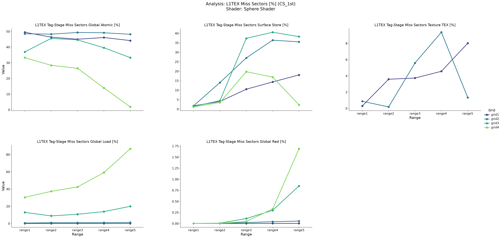

_Caption (Fig. 51): Charts showing L1 Miss Sectors through different metrics for the Sphere Shader across compact grid scenes grid1–grid4 The x-axis represents the camera range (distance from the scene), and the y-axis represents the value. Each chart has its own scale (mentioned in the title). Each line corresponds to a different grid (grid1, grid2, …)._

For L1TEX Tag-Stage Miss Sectors Global Atomic [%] the percentage of miss is higher for smaller grids (almost 50%), and decreases with range in most cases, with higher decline for grid4. This could be contraintuitive since a bigger grid means more entities and more random atomic accesses. For L1TEX Tag-Stage Miss Sectors Surface Store [%] it is possible to see an increase with range, reaching a maximum of around 40%. This could mean that the lowering of the percentage of misses in global atomic is not necessarily a decrease in the amount of misses, but just an increase in the cache misses while writing on the image final texture (Surface Store). Global Red [%] and Sectors Texture TEX [%] don't have meaningful results, but Global Load [%] does show important values for bigger grids, since for grid3 it keeps values around 20% and for grid4 it goes from around 30% in range1 to over 80% in range5. See [Fig. 51](#fig-51).

##### Cylinder Shader

**Fig. 52**
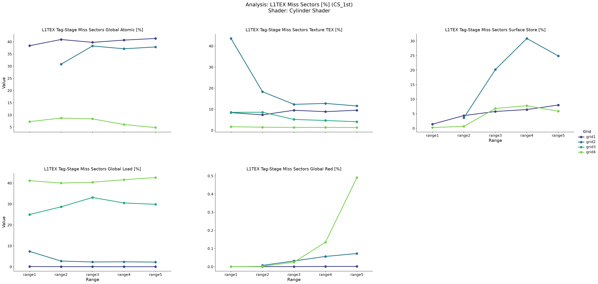

_Caption (Fig. 52): Charts showing L1 Miss Sectors through different metrics for the Cylinder Shader across compact grid scenes grid1–grid4 The x-axis represents the camera range (distance from the scene), and the y-axis represents the value. Each chart has its own scale (mentioned in the title). Each line corresponds to a different grid (grid1, grid2, …)._

For L1TEX Tag-Stage Miss Sectors Global Atomic [%] the percentages are constant across ranges, and decrease for bigger grids, so only grid1 and grid2 have over 30% of Global Atomic [%] misses, but for grid4 is less than 10%. The same can be said for L1TEX Tag-Stage Miss Sectors Texture TEX [%], having low percentage values in general (lower than 15% in most cases). Global Red [%] doesn't have meaningful results, but Global Load [%] does show important values for bigger grids and steady lines across ranges, with around 0% for grid1, around 5% for grid2, around 30% for grid% and 40% for grid4. L1TEX Tag-Stage Miss Sectors Surface Store [%] only shows big values for range4 in grid2, but it is exceptional so conclusions can not be extracted. See [Fig. 52](#fig-52).

##### L1TEX Sectors [\%]

##### Sphere Shader

**Fig. 53**
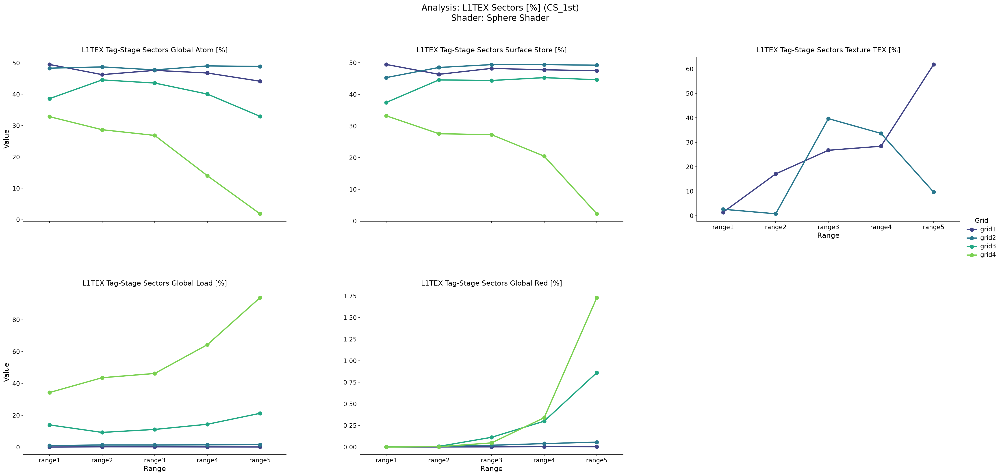

_Caption (Fig. 53): Charts showing L1TEX Sectors (%) through different metrics for the Sphere Shader across compact grid scenes grid1–grid4 The x-axis represents the camera range (distance from the scene), and the y-axis represents the value. Each chart has its own scale (mentioned in the title). Each line corresponds to a different grid (grid1, grid2, …)._

L1TEX Tag-Stage Sectors Global Atomic [%] shows high values in most cases. Each grid shows a constant line, with higher value the smaller the grid is, and only grid4 shows a decline from range3 onwards. L1TEX Tag-Stage Sectors Surface Store [%] almost identical behaviour. L1TEX Tag-Stage Sectors Global Load [%] on the other hand has a contrary tendency and the percentages are bigger with the grid, with around 0% for grid1 and grid2, over 10% for grid3 and grid4 goes from 37% to over 80% across ranges. This could mean that cache is efficient only for reading from global buffers. See [Fig. 53](#fig-53).

##### Cylinder Shader

**Fig. 54**
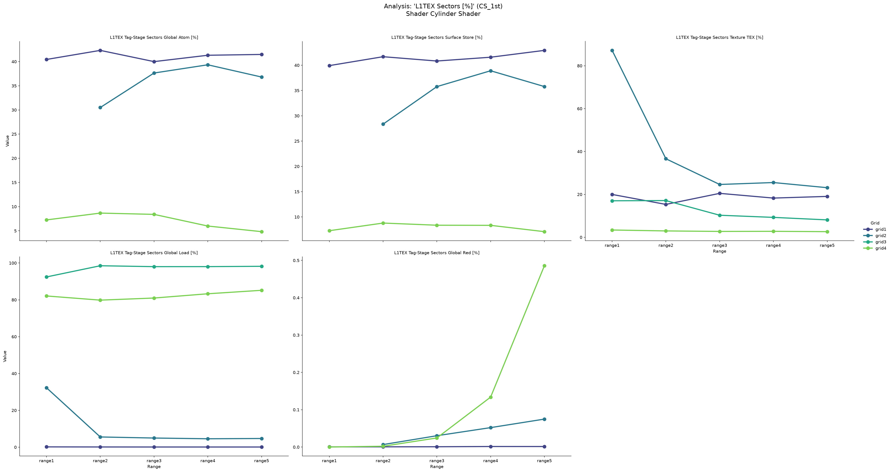

_Caption (Fig. 54): Charts showing L1TEX Sectors (%) through different metrics for the Cylinder Shader across compact grid scenes grid1–grid4 The x-axis represents the camera range (distance from the scene), and the y-axis represents the value. Each chart has its own scale (mentioned in the title). Each line corresponds to a different grid (grid1, grid2, …)._

Similar as with spheres, but lower values in Global Atomic [%] and Surface Store [%], but higher in Global Load [%]. See [Fig. 54](#fig-54).

##### Unit Throughputs

##### Sphere Shader

**Fig. 55**
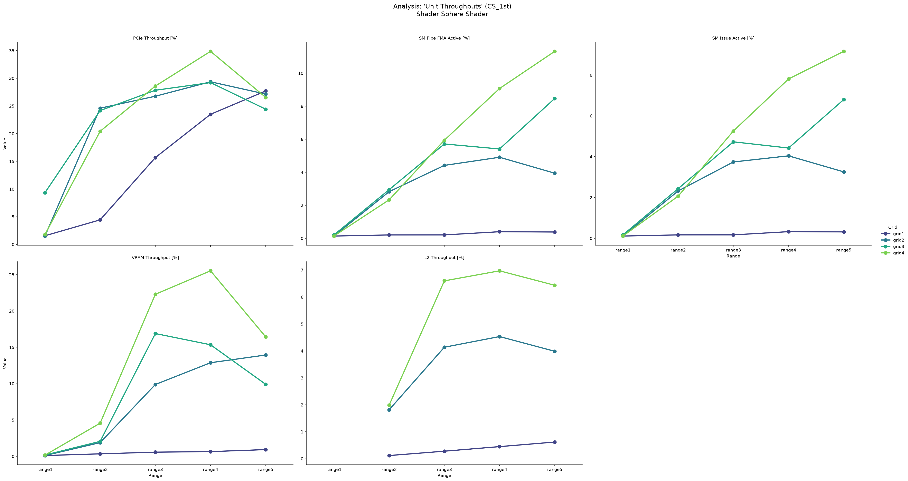

_Caption (Fig. 55): Charts showing Unit Throughputs (%) through different metrics for the Sphere Shader across compact grid scenes grid1–grid4 The x-axis represents the camera range (distance from the scene), and the y-axis represents the value. Each chart has its own scale (mentioned in the title). Each line corresponds to a different grid (grid1, grid2, …)._

Every chart in [Fig. 55](#fig-55) rises with range, with no apparent difference between grids. Higher values are seen for PCIe Throughput [%] and VRAM Trhoughput [%] for ranges 3-4-5. It is a bit surprising that FMA or Issue Active do not have leading values, but it is understandable since with range it means that less entities are culled.

##### Cylinder Shader

**Fig. 56**
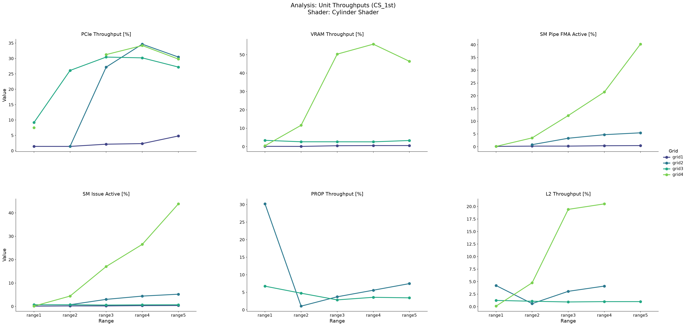

_Caption (Fig. 56): Charts showing Unit Throughputs (%) through different metrics for the Cylinder Shader across compact grid scenes grid1–grid4 The x-axis represents the camera range (distance from the scene), and the y-axis represents the value. Each chart has its own scale (mentioned in the title). Each line corresponds to a different grid (grid1, grid2, …)._

Similar as for spheres, with the difference that grid4 does show notably higher values in Issue Active [%], Pipe FMA Active [%] and L2 Throughput [%]. This could be due to the total amount of entities. See [Fig. 56](#fig-56).

##### SM Warp Occupancy [Warps Per Cycle]

##### Sphere Shader

**Fig. 57**
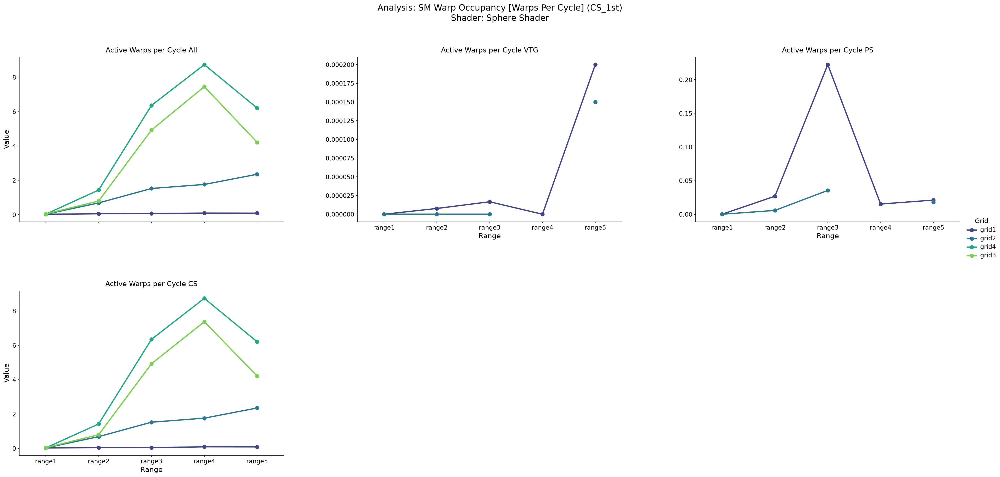

_Caption (Fig. 57): Charts showing SM Warp Occupancy (Warps Per Cycle) through different metrics for the Sphere Shader across compact grid scenes grid1–grid4 The x-axis represents the camera range (distance from the scene), and the y-axis represents the value. Each chart has its own scale (mentioned in the title). Each line corresponds to a different grid (grid1, grid2, …)._

Not much results from here, Active Warps per Cycle CS has mostly all results from this metric, since only Compute Shaders were used. It can be seen that there is a peak of active warps at range4 that starts at range3, ths could be the spot where spheres are big enough and there are a good amount of spheres. See [Fig 49](#fig-49).

##### Cylinder Shader

**Fig. 58**
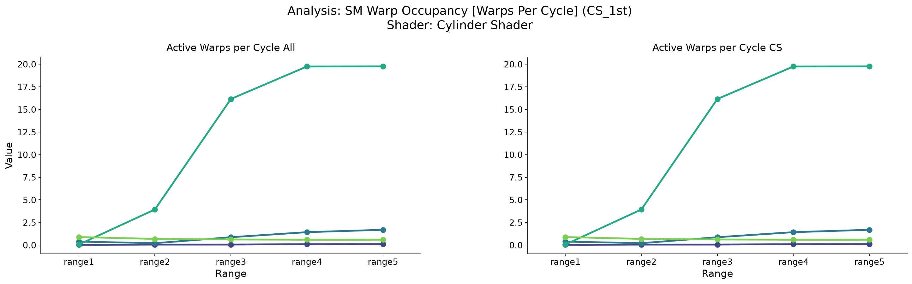

_Caption (Fig. 58): Charts showing SM Warp Occupancy (Warps Per Cycle) through different metrics for the Cylinder Shader across compact grid scenes grid1–grid4 The x-axis represents the camera range (distance from the scene), and the y-axis represents the value. Each chart has its own scale (mentioned in the title). Each line corresponds to a different grid (grid1, grid2, …)._

Similar as with spheres, but only grid4 reaches a maximum value of 20 active warps for ranges 4 and 5. This could be due to the difference in the work for rasterizing a cylinder and a sphere. See [Fig. 58](#fig-58).

##### SM Warp Occupancy [\%]

##### Sphere Shader

**Fig. 59**
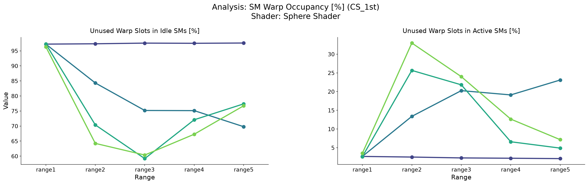

_Caption (Fig. 59): Charts showing SM Warp Occupancy (%) through different metrics for the Sphere Shader across compact grid scenes grid1–grid4 The x-axis represents the camera range (distance from the scene), and the y-axis represents the value. Each chart has its own scale (mentioned in the title). Each line corresponds to a different grid (grid1, grid2, …)._

In [Fig. 59](#fig-59) Unused Warp Slots in Idle SMs [%] seems to lower across ranges, going from 95% in range1 for most grids to a minimum in range3 with 60% and then it goes up again to a second max of around 75%. Unused Warp Slots in Active SMs [%] is high only in range2, and then it decreases. This all could be aligned with the information obtained from the SM Warp Occupancy, since ranges with most usage are around range3.

##### Cylinder Shader

**Fig. 60**
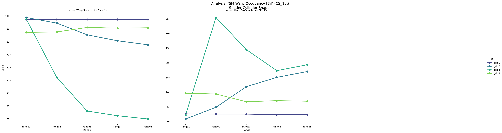

_Caption (Fig. 60): Charts showing SM Warp Occupancy (%) through different metrics for the Cylinder Shader across compact grid scenes grid1–grid4 The x-axis represents the camera range (distance from the scene), and the y-axis represents the value. Each chart has its own scale (mentioned in the title). Each line corresponds to a different grid (grid1, grid2, …)._

This case is different, since for most grids the percentages of Unused Warp Slots in Idel SMs [%] are constant (over 80% below 100%) except for grid4, where it drops from almost 100% in range1 to around 20% in range5. Unused Warp Slots in Active SMs [%] is also different to the one for spheres, showing a peak in range2 only for grid4, the rest has a low but steady increase across ranges (max value for grid2 is a bit over 15%). See [Fig. 60](#fig-60).

##### SM Warp Issue Stalls

##### Sphere Shader

**Fig. 61**
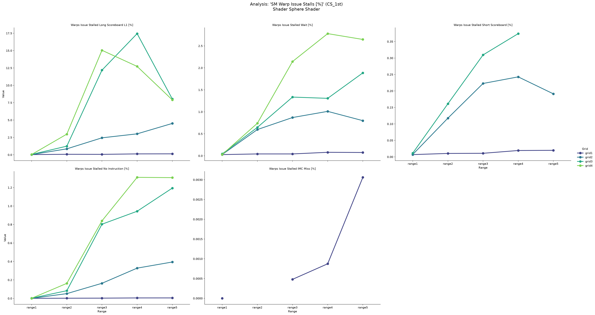

_Caption (Fig. 61): Charts showing SM Warp Issue Stalls for the Sphere Shader across compact grid scenes grid1–grid4 The x-axis represents the camera range (distance from the scene), and the y-axis represents the value. Each chart has its own scale (mentioned in the title). Each line corresponds to a different grid (grid1, grid2, …)._

In the charts of Figura [Fig. 61](#fig-61) only Warps Issue Stalled Long Scorebard L1 [%] has some significant values in any grid, with values around 15% for the biggest grids in range3 and range4. Seems that there is no clear stalls for spheres rasterization.

##### Cylinder Shader

**Fig. 62**
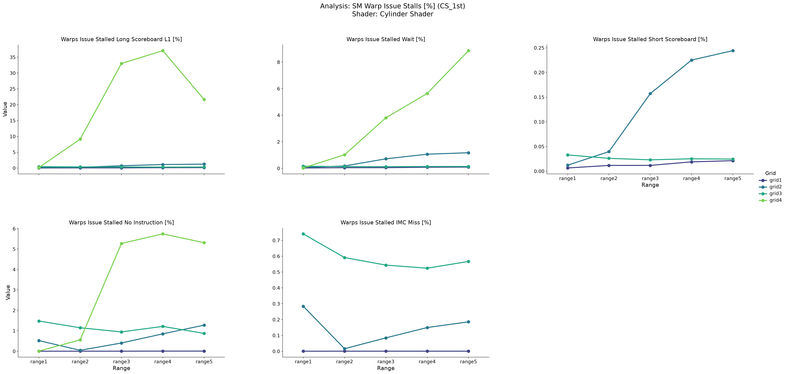

_Caption (Fig. 62): Charts showing SM Warp Issue Stalls for the Cylinder Shader across compact grid scenes grid1–grid4 The x-axis represents the camera range (distance from the scene), and the y-axis represents the value. Each chart has its own scale (mentioned in the title). Each line corresponds to a different grid (grid1, grid2, …)._

Similar to the spheres, only Long Scorebard L1 [%] has big values, and only for grid4 at ranges 3 and 4 with values around 35%, meaning that this scene could be suffering some stalls due to cache misses. See Figure [Fig. 62](#fig-62).

##### Cumulative Warp Latencies [\%]

##### Sphere Shader

**Fig. 63**
![Charts showing Cumulative Warp Latencies [%] for the Sphere Shader across different scenes and camera ranges. The x-a...](img/chapter3/results/compact/fst_gpu/cumulative_warp_lat_pcnt/sphere_shader.png)

_Caption (Fig. 63): Charts showing Cumulative Warp Latencies [%] for the Sphere Shader across compact grid scenes grid1–grid4 The x-axis represents the camera range (distance from the scene), and the y-axis represents the value. Each chart has its own scale (mentioned in the title). Each line corresponds to a different grid (grid1, grid2, …)._

As expected, most of the latency generated by warps comes from Compute Shaders, the rest may be noise. See Figure [Fig. 63](#fig-63)

##### Cylinder Shader

**Fig. 64**
![Charts showing Cumulative Warp Latencies [%] for the Cylinder Shader across different scenes and camera ranges. The x...](img/chapter3/results/compact/fst_gpu/cumulative_warp_lat_pcnt/cylinder_shader.png)

_Caption (Fig. 64): Charts showing Cumulative Warp Latencies [%] for the Cylinder Shader across compact grid scenes grid1–grid4 The x-axis represents the camera range (distance from the scene), and the y-axis represents the value. Each chart has its own scale (mentioned in the title). Each line corresponds to a different grid (grid1, grid2, …)._

Same as with spheres, warp latency comes only from Compute Shaders. See Figure [Fig. 64](#fig-64)

##### Cumulative Warp Latencies [Cycles]

##### Sphere Shader

**Fig. 65**
![Charts showing Cumulative Warp Latencies [Cycles] for the Sphere Shader across different scenes and camera ranges. Th...](img/chapter3/results/compact/fst_gpu/cumulative_warp_lat/sphere_shader.png)

_Caption (Fig. 65): Charts showing Cumulative Warp Latencies [Cycles] for the Sphere Shader across compact grid scenes grid1–grid4 The x-axis represents the camera range (distance from the scene), and the y-axis represents the value. Each chart has its own scale (mentioned in the title). Each line corresponds to a different grid (grid1, grid2, …)._

Same as last metric, latency only comes from Compute Shaders so there is not much to see. see Figure [Fig. 65](#fig-65).

##### Cylinder Shader

**Fig. 66**
![Charts showing Cumulative Warp Latencies [Cycles] for the Cylinder Shader across different scenes and camera ranges. ...](img/chapter3/results/compact/fst_gpu/cumulative_warp_lat/cylinder_shader.png)

_Caption (Fig. 66): Charts showing Cumulative Warp Latencies [Cycles] for the Cylinder Shader across compact grid scenes grid1–grid4 The x-axis represents the camera range (distance from the scene), and the y-axis represents the value. Each chart has its own scale (mentioned in the title). Each line corresponds to a different grid (grid1, grid2, …)._

Same as last metric, latency only comes from Compute Shaders so there is not much to see. see Figure [Fig. 66](#fig-66).

##### Active Threads Per Warp

##### Sphere Shader

**Fig. 67**
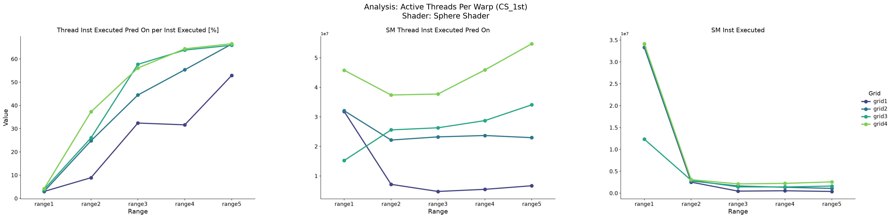

_Caption (Fig. 67): Charts showing Active Threads per Warp for the Sphere Shader across compact grid scenes grid1–grid4 The x-axis represents the camera range (distance from the scene), and the y-axis represents the value. Each chart has its own scale (mentioned in the title). Each line corresponds to a different grid (grid1, grid2, …)._

The chart of Thread Inst Executed Pred On per Inst Executed [%] shows that across ranges the percentage is higher, meaning that when entities are smaller it leads to less divergence. This could be due to less pixels overlapping and less culling. SM Thread Inst Executed Pred On demonstrate how (logically) for bigger scenes there are more instructions executed, but SM Inst Executed shows a similar amount of instructions for each scene every time, yet bigger scenes still have greater amount of instructions. This chart of Figure [Fig. 67](#fig-67) may be using magnitudes so big that it is not possible to appreciate the breach between lines in each range.

##### Cylinder Shader

**Fig. 68**
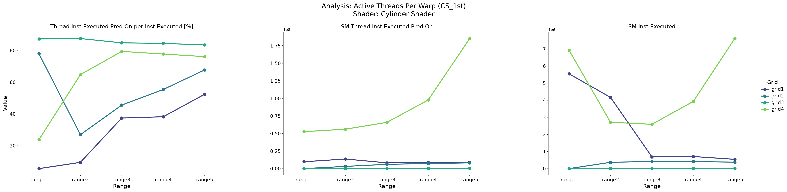

_Caption (Fig. 68): Charts showing Active Threads per Warp for the Cylinder Shader across compact grid scenes grid1–grid4 The x-axis represents the camera range (distance from the scene), and the y-axis represents the value. Each chart has its own scale (mentioned in the title). Each line corresponds to a different grid (grid1, grid2, …)._

For cylinders, Thread Inst Executed Pred On per Inst Executed [%] also show that ranges increase percentage of instructions executed with predicate on over all instructions, yet is grid3 the scene with highest percentages. Then in SM Thread Inst Executed Pred On it is clear that grid4 is the one with most instructions executed with predicate on, similar to what happens with SM Inst Executed. See [Fig. 68](#fig-68).

##### Warp Launch Stalled by Reasons [\%]

##### Sphere Shader

**Fig. 69**
![Charts showing Warp Launch Stalled by Reasons [%] for the Sphere Shader across different scenes and camera ranges. Th...](img/chapter3/results/compact/fst_gpu/launch_stalled_reasons/sphere_shader.png)

_Caption (Fig. 69): Charts showing Warp Launch Stalled by Reasons [%] for the Sphere Shader across compact grid scenes grid1–grid4 The x-axis represents the camera range (distance from the scene), and the y-axis represents the value. Each chart has its own scale (mentioned in the title). Each line corresponds to a different grid (grid1, grid2, …)._

[Figure 69](#fig-69) shows that there is no latency due to any reason, percentages are really low.

##### Cylinder Shader

**Fig. 70**
![Charts showing Warp Launch Stalled by Reasons [%] for the Cylinder Shader across different scenes and camera ranges. ...](img/chapter3/results/compact/fst_gpu/launch_stalled_reasons/cylinder_shader.png)

_Caption (Fig. 70): Charts showing Warp Launch Stalled by Reasons [%] for the Cylinder Shader across compact grid scenes grid1–grid4 The x-axis represents the camera range (distance from the scene), and the y-axis represents the value. Each chart has its own scale (mentioned in the title). Each line corresponds to a different grid (grid1, grid2, …)._

In this case, as a difference from spheres it is possible to see in [Figure 70](#fig-70) that Warp Slot Allocation [%] and Register Allocation [%] are reasons for stalling in cylinders. That could be because cylinder rasterization is much heavier than spheres rasterization.

##### SM Throughputs

##### Sphere Shader

**Fig. 71**
![Charts showing SM Throughputs [%] for the Sphere Shader across different scenes and camera ranges. The x-axis represe...](img/chapter3/results/compact/fst_gpu/sm_throughput/sphere_shader.png)

_Caption (Fig. 71): Charts showing SM Throughputs [%] for the Sphere Shader across compact grid scenes grid1–grid4 The x-axis represents the camera range (distance from the scene), and the y-axis represents the value. Each chart has its own scale (mentioned in the title). Each line corresponds to a different grid (grid1, grid2, …)._

In the charts of [Fig. 71](#fig-71) results captured were for SM Pipe FMA Active [%], SM Issue Active [%], SM Pipe SFU Active [%] and SM Pipe ALU Active [%], all from integer and float arithmetic. All of their percentages grow with range, but still every one of them has low maximum values. This could be due to the increase of the amount of entities but the decrease of the work to do on each entity.

##### Cylinder Shader

**Fig. 72**
![Charts showing SM Throughputs [%] for the Cylinder Shader across different scenes and camera ranges. The x-axis repre...](img/chapter3/results/compact/fst_gpu/sm_throughput/cylinder_shader.png)

_Caption (Fig. 72): Charts showing SM Throughputs [%] for the Cylinder Shader across compact grid scenes grid1–grid4 The x-axis represents the camera range (distance from the scene), and the y-axis represents the value. Each chart has its own scale (mentioned in the title). Each line corresponds to a different grid (grid1, grid2, …)._

Results in [Fig. 72](#fig-72) were similar to those of spheres, with a difference for grid4: in every chart it reached a notably higher maximum value (around 40% for SM Pipe FMA Active [%] and SM Issue Active [%], and around 25% for SM Pipe SFU Active [%] and SM Pipe ALU Active [%]). This could be that even if the amount of work per entity diminishes it is still heavy work, having a high throughput in SM units.

##### Performance Per Marked Range

**Fig. 73**
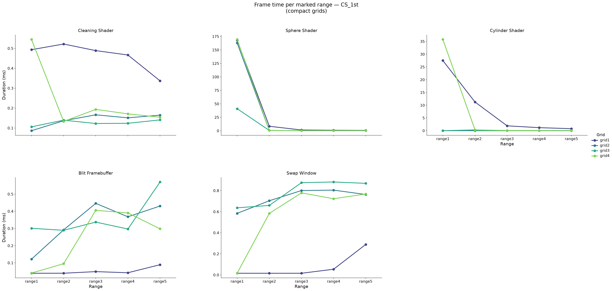

_Caption (Fig. 73): Charts showing frame time per marked range for the first GPGPU across compact grid scenes grid1–grid4 The x-axis represents the camera range (distance from the scene), and the y-axis represents the value. Each chart has its own scale (mentioned in the title). Each line corresponds to a different grid (grid1, grid2, …)._

It is clear to see, for spheres and cylinders, that problems are found only at close ranges, since for range2 onwards both shaders have a frame time close to 0 ms. It is consistent with the theory, and still shows great performance on medium/far camera distances.

#### 3.1.2 Second GPGPU (`snd_parallel`)

##### Molecular (sparse) scenes

##### GPU Engines Active [\%]

##### Sphere Bbox Extraction Shader

This shader showed a high percentage of GR Cycles Active [%] at all times, which meant the shader engines stayed active. Engine Active Copy Async [%] was similarly high, suggesting that VRAM transfers did not stall activity. No Engine Active Copy Sync [%] was observed. See [Figure 74](#fig-74).

**Fig. 74**
![Charts showing GPU Engines Active [%] for the Sphere Bbox Extraction Shader across different scenes and camera ranges...](img/chapter3/results/scnd_gpu/gpu_engines_active_pcnt/sphere_extr.png)

_Caption (Fig. 74): Charts showing GPU Engines Active [%] for the Sphere Bbox Extraction Shader across different scenes and camera ranges. The x-axis represents the camera range (distance from the molecule), and the y-axis represents the value. Each chart has its own scale (mentioned in the title). Each line corresponds to a different scene._

##### Sphere Bbox Intersection Shader

Engine Active Copy Async [%] was high only for the smallest molecule, likely because SSBO writes occurred only at the end of the shader and only once. For the small molecule, with few bboxes to analyze, the write happened earlier than in larger molecules, so the copy async engine did more work and therefore decreased with range. GR Cycles Active [%] increased with range because fewer entities were removed in the previous shader, implying more work in this shader. Engine Active Copy Sync [%] was negligible (below 3.5%). See [Figure 75](#fig-75).

**Fig. 75**
![Charts showing GPU Engines Active [%] for the Sphere Bbox Intersection Shader across different scenes and camera rang...](img/chapter3/results/scnd_gpu/gpu_engines_active_pcnt/sphere_intr.png)

_Caption (Fig. 75): Charts showing GPU Engines Active [%] for the Sphere Bbox Intersection Shader across different scenes and camera ranges. The x-axis represents the camera range (distance from the molecule), and the y-axis represents the value. Each chart has its own scale (mentioned in the title). Each line corresponds to a different scene._

##### Cylinder Bbox Extraction Shader

Unlike spheres, this case did not show a high Engine Active Copy Async [%], probably due to the low cylinder count in the largest tested molecule and the different culling method (more calculations -> more latency -> less impact from memory stores). GR Cycles Active [%] was high, but it decreased with range in the largest molecule. This could be because more cylinders were not removed, increasing latency when extracting and storing the bbox and leaving more idle threads. No Engine Active Copy Sync [%] was observed. See [Figure 76](#fig-76).

**Fig. 76**
![Charts showing GPU Engines Active [%] for the Cylinder Bbox Extraction Shader across different scenes and camera rang...](img/chapter3/results/scnd_gpu/gpu_engines_active_pcnt/cylinder_extr.png)

_Caption (Fig. 76): Charts showing GPU Engines Active [%] for the Cylinder Bbox Extraction Shader across different scenes and camera ranges. The x-axis represents the camera range (distance from the molecule), and the y-axis represents the value. Each chart has its own scale (mentioned in the title). Each line corresponds to a different scene._

##### Cylinder Bbox Intersection Shader

Engine Active Copy Async [%] was low and decreased with range. Writing data to SSBOs became negligible during execution. GR Cycles Active [%] remained above 95% throughout. See [Figure 77](#fig-77).

**Fig. 77**
![Charts showing GPU Engines Active [%] for the Cylinder Bbox Intersection Shader across different scenes and camera ra...](img/chapter3/results/scnd_gpu/gpu_engines_active_pcnt/cylinder_intr.png)

_Caption (Fig. 77): Charts showing GPU Engines Active [%] for the Cylinder Bbox Intersection Shader across different scenes and camera ranges. The x-axis represents the camera range (distance from the molecule), and the y-axis represents the value. Each chart has its own scale (mentioned in the title). Each line corresponds to a different scene._

##### GR Cycles Active

##### Sphere Bbox Extraction Shader

No relevant or useful results were obtained. See [Figure 78](#fig-78).

**Fig. 78**
![Charts showing GPU Engines Active [%] for the Sphere Bbox Extraction Shader across different scenes and camera ranges...](img/chapter3/results/scnd_gpu/gpu_engines_active/sphere_extr.png)

_Caption (Fig. 78): Charts showing GPU Engines Active [%] for the Sphere Bbox Extraction Shader across different scenes and camera ranges. The x-axis represents the camera range (distance from the molecule), and the y-axis represents the value. Each chart has its own scale (mentioned in the title). Each line corresponds to a different scene._

##### Sphere Bbox Intersection Shader

No relevant or useful results were obtained. See [Figure 79](#fig-79).

**Fig. 79**
![Charts showing GPU Engines Active [%] for the Sphere Bbox Intersection Shader across different scenes and camera rang...](img/chapter3/results/scnd_gpu/gpu_engines_active/sphere_intr.png)

_Caption (Fig. 79): Charts showing GPU Engines Active [%] for the Sphere Bbox Intersection Shader across different scenes and camera ranges. The x-axis represents the camera range (distance from the molecule), and the y-axis represents the value. Each chart has its own scale (mentioned in the title). Each line corresponds to a different scene._

##### Cylinder Bbox Extraction Shader

No relevant or useful results were obtained. See [Figure 80](#fig-80).

**Fig. 80**
![Charts showing GPU Engines Active [%] for the Cylinder Bbox Extraction Shader across different scenes and camera rang...](img/chapter3/results/scnd_gpu/gpu_engines_active/cylinder_extr.png)

_Caption (Fig. 80): Charts showing GPU Engines Active [%] for the Cylinder Bbox Extraction Shader across different scenes and camera ranges. The x-axis represents the camera range (distance from the molecule), and the y-axis represents the value. Each chart has its own scale (mentioned in the title). Each line corresponds to a different scene._

##### Cylinder Bbox Intersection Shader

No relevant or useful results were obtained. See [Figure 81](#fig-81).

**Fig. 81**
![Charts showing GPU Engines Active [%] for the Cylinder Bbox Intersection Shader across different scenes and camera ra...](img/chapter3/results/scnd_gpu/gpu_engines_active/cylinder_intr.png)

_Caption (Fig. 81): Charts showing GPU Engines Active [%] for the Cylinder Bbox Intersection Shader across different scenes and camera ranges. The x-axis represents the camera range (distance from the molecule), and the y-axis represents the value. Each chart has its own scale (mentioned in the title). Each line corresponds to a different scene._

##### Graphics/Compute Idle [\%]

##### Sphere Bbox Extraction Shader

Idle cycle counts were minimal in all cases. Work was constant, so the architecture was well utilized in this shader. See [Figure 82](#fig-82).

**Fig. 82**
![Charts showing Graphics/Compute Idle [%] for the Sphere Bbox Extraction Shader across different scenes and camera ran...](img/chapter3/results/scnd_gpu/graphics_compute_idle/sphere_extr.png)

_Caption (Fig. 82): Charts showing Graphics/Compute Idle [%] for the Sphere Bbox Extraction Shader across different scenes and camera ranges. The x-axis represents the camera range (distance from the molecule), and the y-axis represents the value. Each chart has its own scale (mentioned in the title). Each line corresponds to a different scene._

##### Sphere Bbox Intersection Shader

At short ranges there were more idle cycles for small molecules. This was expected because more entities were removed, so the architecture was not fully used. However, in the largest molecule the number of idle cycles increased with range. With larger sphere counts this could become a problem, but this version did not support larger molecules, so it could not be verified. See [Figure 83](#fig-83).

**Fig. 83**
![Charts showing Graphics/Compute Idle [%] for the Sphere Bbox Intersection Shader across different scenes and camera r...](img/chapter3/results/scnd_gpu/graphics_compute_idle/sphere_intr.png)

_Caption (Fig. 83): Charts showing Graphics/Compute Idle [%] for the Sphere Bbox Intersection Shader across different scenes and camera ranges. The x-axis represents the camera range (distance from the molecule), and the y-axis represents the value. Each chart has its own scale (mentioned in the title). Each line corresponds to a different scene._

##### Cylinder Bbox Extraction Shader

The idle cycle percentage was low; however, in the largest molecule this percentage increased with range. If fewer entities were removed, bbox processing introduced more latency and therefore more idle periods. See [Figure 84](#fig-84).

**Fig. 84**
![Charts showing Graphics/Compute Idle [%] for the Cylinder Bbox Extraction Shader across different scenes and camera r...](img/chapter3/results/scnd_gpu/graphics_compute_idle/cylinder_extr.png)

_Caption (Fig. 84): Charts showing Graphics/Compute Idle [%] for the Cylinder Bbox Extraction Shader across different scenes and camera ranges. The x-axis represents the camera range (distance from the molecule), and the y-axis represents the value. Each chart has its own scale (mentioned in the title). Each line corresponds to a different scene._

##### Cylinder Bbox Intersection Shader

Similar to the sphere intersection shader, but the percentages were even lower. This shader was the most compute intensive, so fewer idle cycles were expected. See [Figure 85](#fig-85).

**Fig. 85**
![Charts showing Graphics/Compute Idle [%] for the Cylinder Bbox Intersection Shader across different scenes and camera...](img/chapter3/results/scnd_gpu/graphics_compute_idle/cylinder_intr.png)

_Caption (Fig. 85): Charts showing Graphics/Compute Idle [%] for the Cylinder Bbox Intersection Shader across different scenes and camera ranges. The x-axis represents the camera range (distance from the molecule), and the y-axis represents the value. Each chart has its own scale (mentioned in the title). Each line corresponds to a different scene._

##### L1TEX L2 Hit Rates

##### Sphere Bbox Extraction Shader

In all molecules the hit rate increased with range, reaching around 80% (high percentages). See [Figure 86](#fig-86).

**Fig. 86**
![Charts showing L2 Cache Hit Rates [%] for the Sphere Bbox Extraction Shader across different scenes and camera ranges...](img/chapter3/results/scnd_gpu/l2_hit_rates/sphere_extr.png)

_Caption (Fig. 86): Charts showing L2 Cache Hit Rates [%] for the Sphere Bbox Extraction Shader across different scenes and camera ranges. The x-axis represents the camera range (distance from the molecule), and the y-axis represents the value. Each chart has its own scale (mentioned in the title). Each line corresponds to a different scene._

##### Sphere Bbox Intersection Shader

Similar to the previous case, high cache hit rates were observed, with values close to 80%. See [Figure 87](#fig-87).

**Fig. 87**
![Charts showing L2 Cache Hit Rates [%] for the Sphere Bbox Intersection Shader across different scenes and camera rang...](img/chapter3/results/scnd_gpu/l2_hit_rates/sphere_intr.png)

_Caption (Fig. 87): Charts showing L2 Cache Hit Rates [%] for the Sphere Bbox Intersection Shader across different scenes and camera ranges. The x-axis represents the camera range (distance from the molecule), and the y-axis represents the value. Each chart has its own scale (mentioned in the title). Each line corresponds to a different scene._

##### Cylinder Bbox Extraction Shader

In all molecules the hit rate increased with range, reaching values above 80% (high percentages). See [Figure 88](#fig-88).

**Fig. 88**
![Charts showing L2 Cache Hit Rates [%] for the Cylinder Bbox Extraction Shader across different scenes and camera rang...](img/chapter3/results/scnd_gpu/l2_hit_rates/cylinder_extr.png)

_Caption (Fig. 88): Charts showing L2 Cache Hit Rates [%] for the Cylinder Bbox Extraction Shader across different scenes and camera ranges. The x-axis represents the camera range (distance from the molecule), and the y-axis represents the value. Each chart has its own scale (mentioned in the title). Each line corresponds to a different scene._

##### Cylinder Bbox Intersection Shader

Similar to the sphere intersection shader, with hit rates above 75% of the time. See [Figure 89](#fig-89).

**Fig. 89**
![Charts showing L2 Cache Hit Rates [%] for the Cylinder Bbox Intersection Shader across different scenes and camera ra...](img/chapter3/results/scnd_gpu/l2_hit_rates/cylinder_intr.png)

_Caption (Fig. 89): Charts showing L2 Cache Hit Rates [%] for the Cylinder Bbox Intersection Shader across different scenes and camera ranges. The x-axis represents the camera range (distance from the molecule), and the y-axis represents the value. Each chart has its own scale (mentioned in the title). Each line corresponds to a different scene._

##### L1Tex Miss Sectors

##### Sphere Bbox Extraction Shader

L1Tex Tag-Stage Miss Sectors Global Load [%] decreased with range in all molecules, likely because the storage pattern for non-removed entities became more regular. L1Tex Tag-Stage Miss Sectors Global Store [%] increased with range because more boxes had to be stored when entities were not removed, but it always remained below 15% (few misses). L1Tex Tag-Stage Miss Sectors Global Atomic [%] decreased for a different reason: the atomic bbox counter was accessed more often, so with more accesses it was more likely to be resident in cache. Its values were near 0%. See [Figure 90](#fig-90).

**Fig. 90**
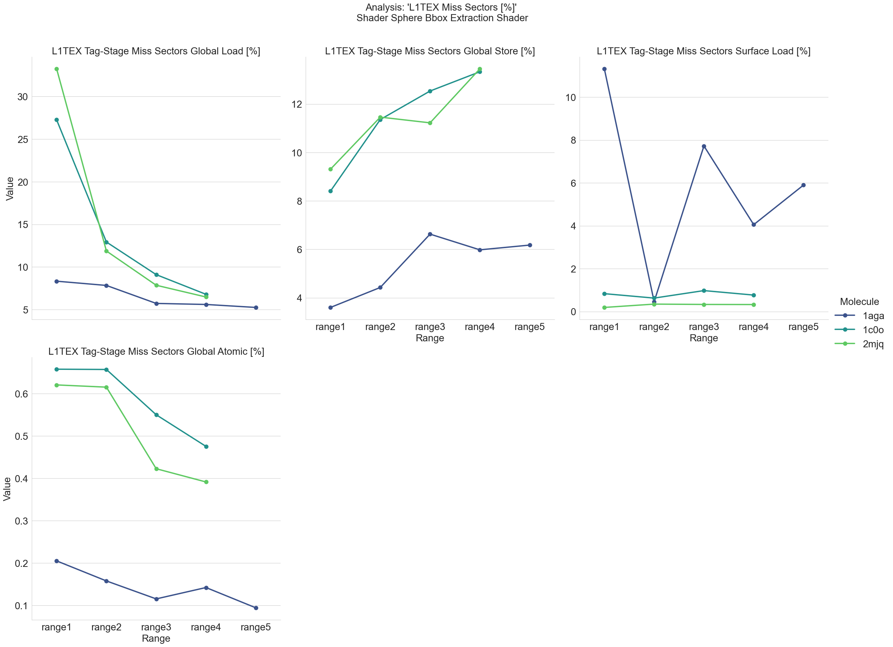

_Caption (Fig. 90): Charts showing L1Tex Miss Sectors for the Sphere Bbox Extraction Shader across different scenes and camera ranges. The x-axis represents the camera range (distance from the molecule), and the y-axis represents the value. Each chart has its own scale (mentioned in the title). Each line corresponds to a different scene._

##### Sphere Bbox Intersection Shader

L1Tex Tag-Stage Miss Sectors Global Load [%] was the only metric worth monitoring. It stayed around 20% cache misses across all ranges, which was not high. See [Figure 91](#fig-91).

**Fig. 91**
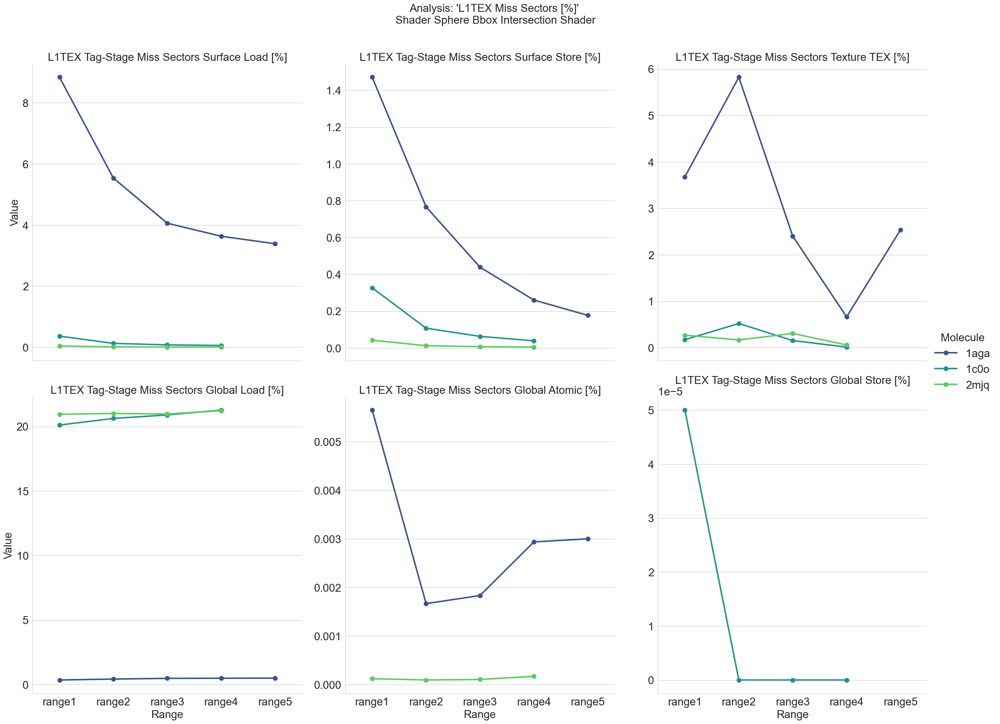

_Caption (Fig. 91): Charts showing L1Tex Miss Sectors for the Sphere Bbox Intersection Shader across different scenes and camera ranges. The x-axis represents the camera range (distance from the molecule), and the y-axis represents the value. Each chart has its own scale (mentioned in the title). Each line corresponds to a different scene._

##### Cylinder Bbox Extraction Shader

Similar to spheres, L1Tex Tag-Stage Miss Sectors Global Load [%] decreased with range, dropping below 10% at medium/far ranges for all molecules. L1Tex Tag-Stage Miss Sectors Global Store [%] increased with range but stayed at small percentages (below 9%), and L1Tex Tag-Stage Miss Sectors Global Atomic [%] decreased as range increased. Overall cache usage was good. See [Figure 92](#fig-92).

**Fig. 92**
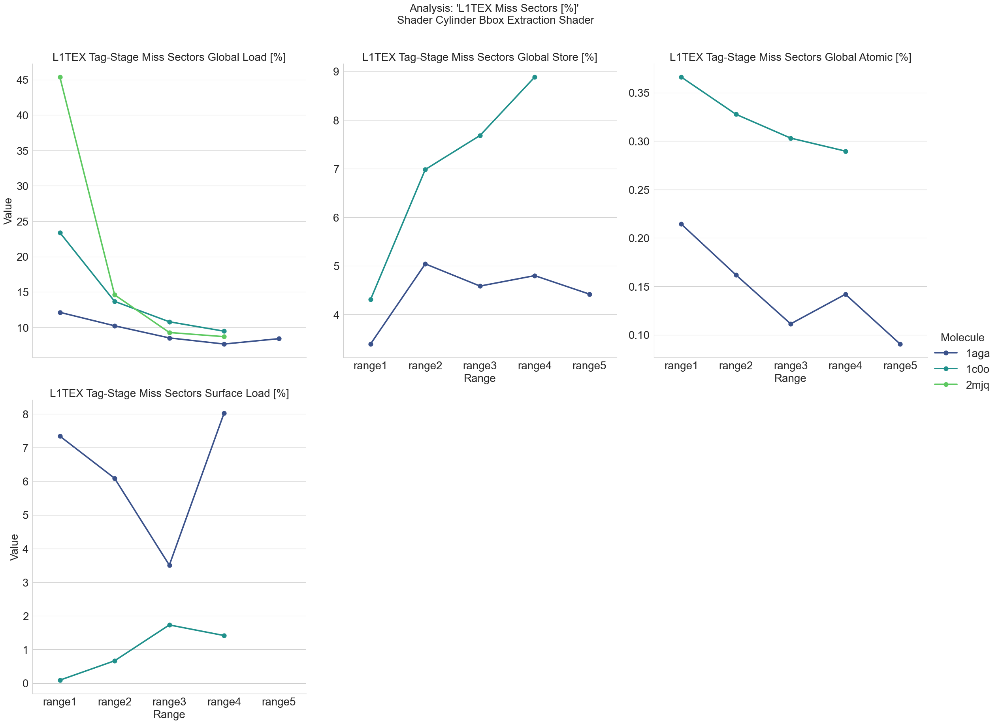

_Caption (Fig. 92): Charts showing L1Tex Miss Sectors for the Cylinder Bbox Extraction Shader across different scenes and camera ranges. The x-axis represents the camera range (distance from the molecule), and the y-axis represents the value. Each chart has its own scale (mentioned in the title). Each line corresponds to a different scene._

##### Cylinder Bbox Intersection Shader

Similar to the sphere intersection shader; the only notable percentage was L1Tex Tag-Stage Miss Sectors Global Load [%], peaking at 25% in medium/far ranges, which was not high. See [Figure 93](#fig-93).

**Fig. 93**
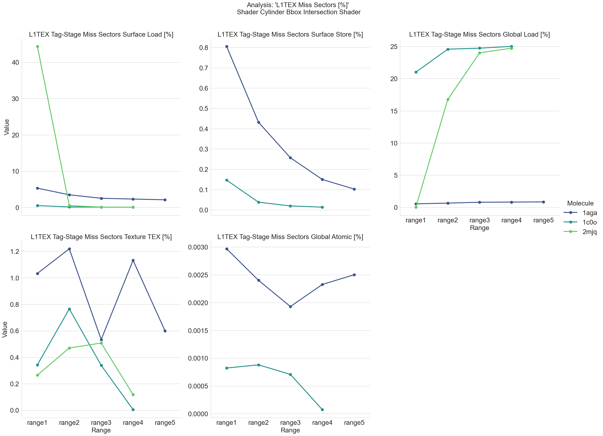

_Caption (Fig. 93): Charts showing L1Tex Miss Sectors for the Cylinder Bbox Intersection Shader across different scenes and camera ranges. The x-axis represents the camera range (distance from the molecule), and the y-axis represents the value. Each chart has its own scale (mentioned in the title). Each line corresponds to a different scene._

##### L1TEX Sectors [\%]

##### Sphere Bbox Extraction Shader

L1Tex Tag-Stage Sectors Global Store [%] increased with range, more noticeably in medium and large molecules. This made sense because fewer entities were removed and more boxes were stored in an SSBO. On the other hand, L1Tex Tag-Stage Sectors Global Load [%] decreased. This was expected because each thread read a specific entity from a buffer without needing cache-assisted fast access. Interestingly, L1Tex Tag-Stage Sectors Global Atom [%] also decreased with range and molecule size. Since the atomic operation targeted a single address, it likely did not need cache-assisted resolution. See [Figure 94](#fig-94).

**Fig. 94**
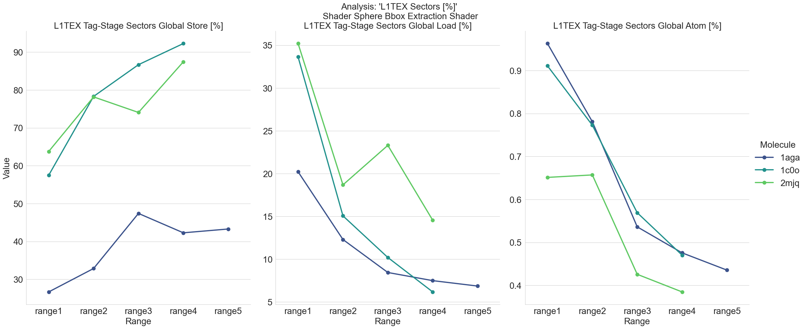

_Caption (Fig. 94): Charts showing L1Tex Sectors for the Sphere Bbox Extraction Shader across different scenes and camera ranges. The x-axis represents the camera range (distance from the molecule), and the y-axis represents the value. Each chart has its own scale (mentioned in the title). Each line corresponds to a different scene._

##### Sphere Bbox Intersection Shader

In medium/large molecules L1Tex Tag-Stage Sectors Global Load [%] accounted for almost 100% of L1 cache usage, showing that L1Tex Tag-Stage Sectors Surface Load [%], L1Tex Tag-Stage Sectors Surface Store [%], L1Tex Tag-Stage Sectors Textures TEX [%], and L1Tex Tag-Stage Sectors Global Atom [%] were near 0% in those cases. This was due to multiple reads from the bbox buffer and the lack of texture reads/writes or atomic operations. See [Figure 95](#fig-95).

**Fig. 95**
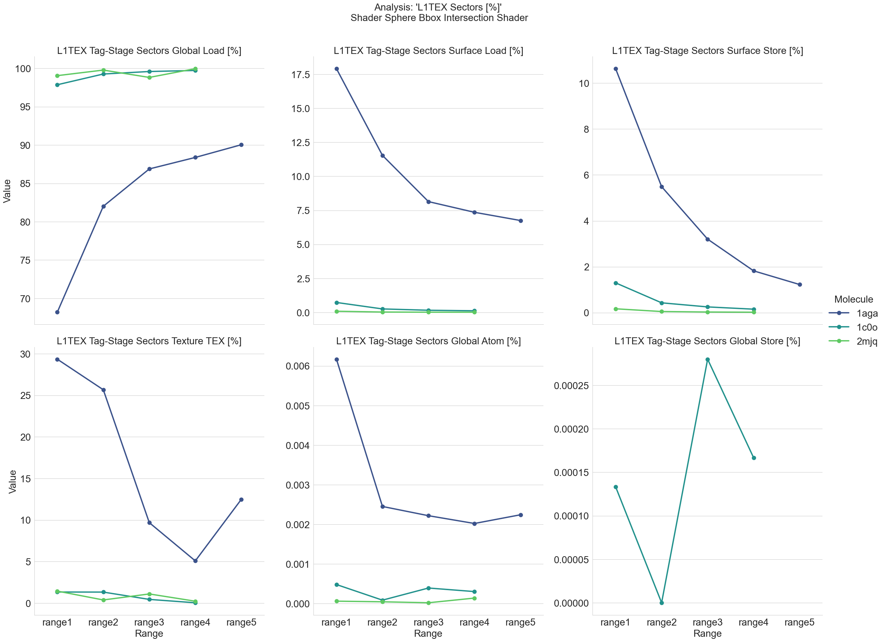

_Caption (Fig. 95): Charts showing L1Tex Sectors for the Sphere Bbox Intersection Shader across different scenes and camera ranges. The x-axis represents the camera range (distance from the molecule), and the y-axis represents the value. Each chart has its own scale (mentioned in the title). Each line corresponds to a different scene._

##### Cylinder Bbox Extraction Shader

Similar to the sphere extraction shader. See [Figure 96](#fig-96).

**Fig. 96**
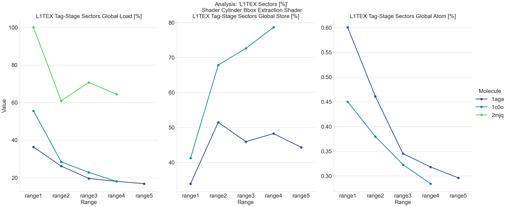

_Caption (Fig. 96): Charts showing L1Tex Sectors for the Cylinder Bbox Extraction Shader across different scenes and camera ranges. The x-axis represents the camera range (distance from the molecule), and the y-axis represents the value. Each chart has its own scale (mentioned in the title). Each line corresponds to a different scene._

##### Cylinder Bbox Intersection Shader

Similar to the sphere intersection shader. See [Figure 97](#fig-97).

**Fig. 97**
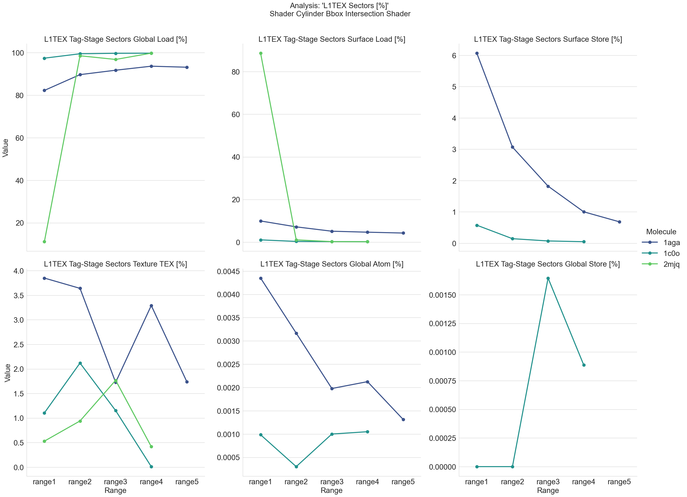

_Caption (Fig. 97): Charts showing L1Tex Sectors for the Cylinder Bbox Intersection Shader across different scenes and camera ranges. The x-axis represents the camera range (distance from the molecule), and the y-axis represents the value. Each chart has its own scale (mentioned in the title). Each line corresponds to a different scene._

##### Unit Throughputs

##### Sphere Bbox Extraction Shader

VRAM Throughput increased linearly only with molecule size, which made sense because it was used mainly to read spheres and write their boxes. L2 Throughput increased with range and was more noticeable in larger molecules, but it did not reach notable values (best case 25% in the largest tested molecule). SM Issue Active [%] indicated SM utilization; values stayed below 15% in all cases. This could mean latency and the scheduler could not issue the full workload, but the PCIe Throughput [%] metric was relatively high (30-50%), so the workload itself was small and the frame was very short, making CPU-GPU transfers significant (uniforms and instructions). SM Pipe FMA Active [%] was relatively low, indicating that this shader was not compute heavy. See [Figure 98](#fig-98).

**Fig. 98**
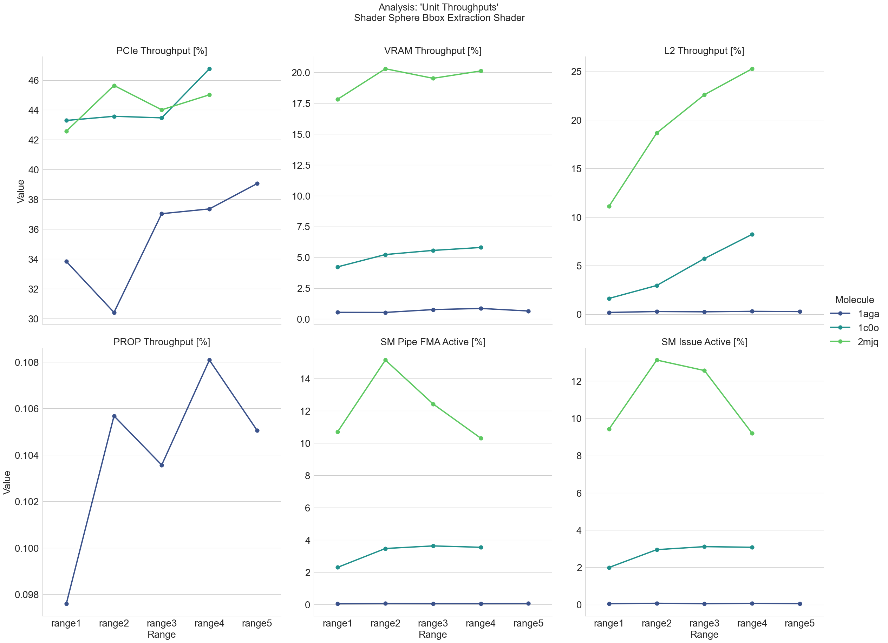

_Caption (Fig. 98): Charts showing Unit Throughputs for the Sphere Bbox Extraction Shader across different scenes and camera ranges. The x-axis represents the camera range (distance from the molecule), and the y-axis represents the value. Each chart has its own scale (mentioned in the title). Each line corresponds to a different scene._

##### Sphere Bbox Intersection Shader

SM Pipe SFU Active [%] was very high (around 90%), indicating latency from the computations involved in per-pixel processing for each sphere. SM Pipe ALU Active [%] followed with values around 40%, so there were many integer operations (calculations, sums, indexing, index creation). SM Issue Active also showed moderately high values (45-70%), indicating a high instruction load on the GPU. L1TEX LSU Data Wavefronts [%] was also measured; this reflects how cache coalesces memory requests, and values were moderate (15-30%), so access was reasonably well organized even if there were many accesses. PCIe Throughput [%] was between 30-37%, which was high, but it only appeared in the first molecule. This was likely because the small molecule produced frames so short that instruction/uniform movement became noticeable. See [Figure 99](#fig-99).

**Fig. 99**
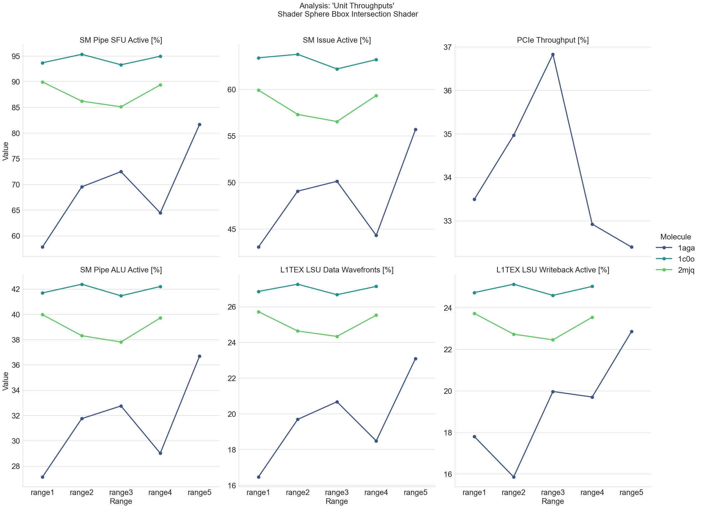

_Caption (Fig. 99): Charts showing Unit Throughputs for the Sphere Bbox Intersection Shader across different scenes and camera ranges. The x-axis represents the camera range (distance from the molecule), and the y-axis represents the value. Each chart has its own scale (mentioned in the title). Each line corresponds to a different scene._

##### Cylinder Bbox Extraction Shader

The case was similar to spheres. The workload was not heavy. See [Figure 100](#fig-100).

**Fig. 100**
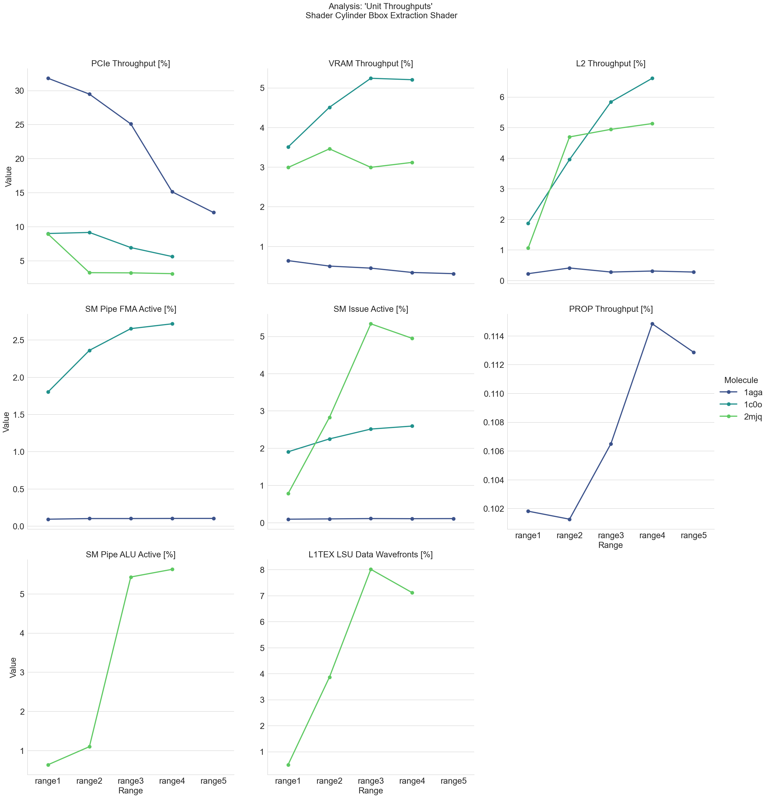

_Caption (Fig. 100): Charts showing Unit Throughputs for the Cylinder Bbox Extraction Shader across different scenes and camera ranges. The x-axis represents the camera range (distance from the molecule), and the y-axis represents the value. Each chart has its own scale (mentioned in the title). Each line corresponds to a different scene._

##### Cylinder Bbox Intersection Shader

Similar to spheres but with more extreme results. The SFU reached values close to 100%. This could be due to the heavy calculations, especially when many bboxes were eventually discarded. SM Issue Active was close to 40% in most cases, indicating possible latency from instruction execution. ALU occupancy was also around 30%. See [Figure 101](#fig-101).

**Fig. 101**
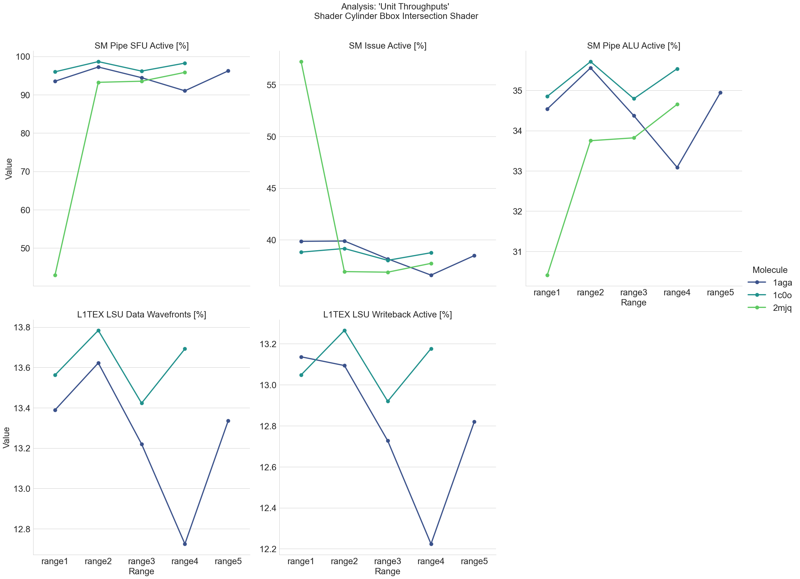

_Caption (Fig. 101): Charts showing Unit Throughputs for the Cylinder Bbox Intersection Shader across different scenes and camera ranges. The x-axis represents the camera range (distance from the molecule), and the y-axis represents the value. Each chart has its own scale (mentioned in the title). Each line corresponds to a different scene._

##### SM Warp Occupancy [Warps Per Cycle]

##### Sphere Bbox Extraction Shader

As range increased, the average number of active warps per cycle also increased, reaching almost 20 warps for the largest range in the largest tested molecule. The light workload could explain why the average did not rise further. See [Figure 102](#fig-102).

**Fig. 102**
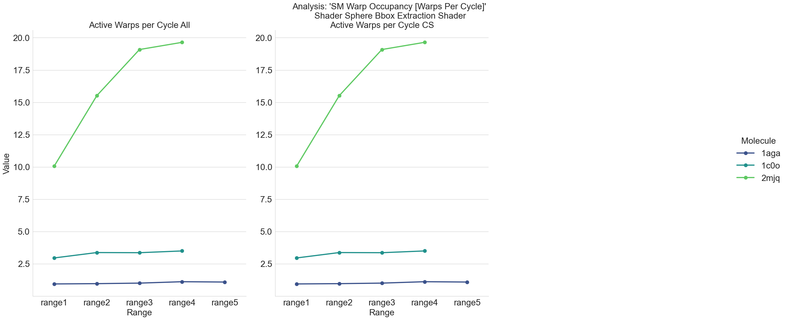

_Caption (Fig. 102): Charts showing SM Warp Occupancy for the Sphere Bbox Extraction Shader across different scenes and camera ranges. The x-axis represents the camera range (distance from the molecule), and the y-axis represents the value. Each chart has its own scale (mentioned in the title). Each line corresponds to a different scene._

##### Sphere Bbox Intersection Shader

High numbers of active warps per cycle were observed due to the heavy workload. In the largest molecule the average decreased, likely due to the number of registers[^1] required by each thread (more entities -> more compute). See [Figure 103](#fig-103).

**Fig. 103**
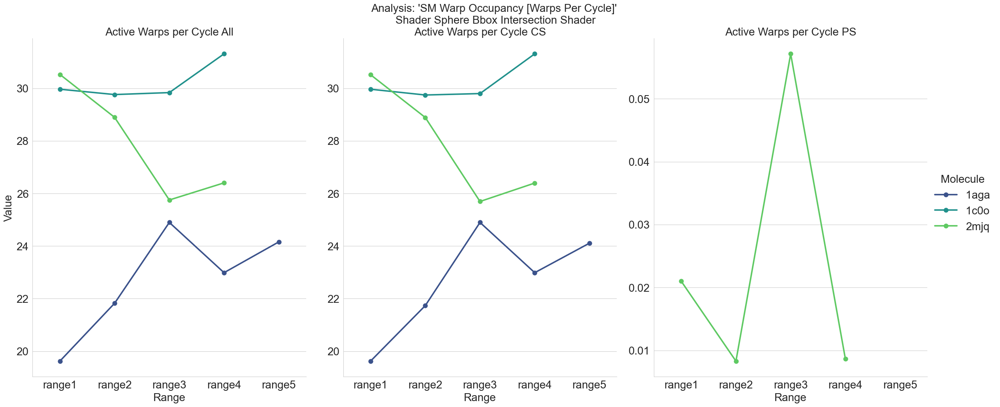

_Caption (Fig. 103): Charts showing SM Warp Occupancy for the Sphere Bbox Intersection Shader across different scenes and camera ranges. The x-axis represents the camera range (distance from the molecule), and the y-axis represents the value. Each chart has its own scale (mentioned in the title). Each line corresponds to a different scene._

##### Cylinder Bbox Extraction Shader

Only a minimal number of warps were used (approximately 6 at most), due to the light workload. See [Figure 104](#fig-104).

**Fig. 104**
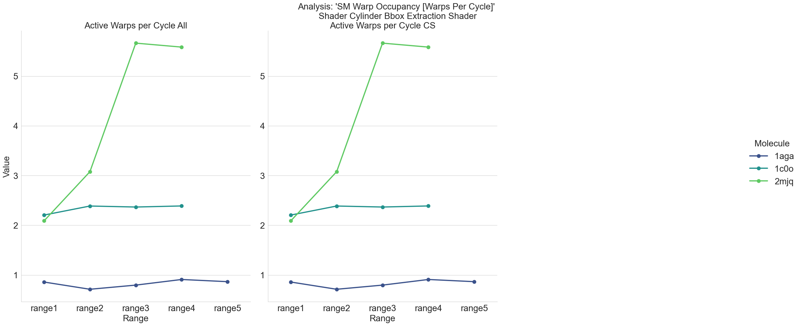

_Caption (Fig. 104): Charts showing SM Warp Occupancy for the Cylinder Bbox Extraction Shader across different scenes and camera ranges. The x-axis represents the camera range (distance from the molecule), and the y-axis represents the value. Each chart has its own scale (mentioned in the title). Each line corresponds to a different scene._

##### Cylinder Bbox Intersection Shader

Similar to spheres, with around 23 active warps, but for large molecules it decreased with range. See [Figure 105](#fig-105).

**Fig. 105**
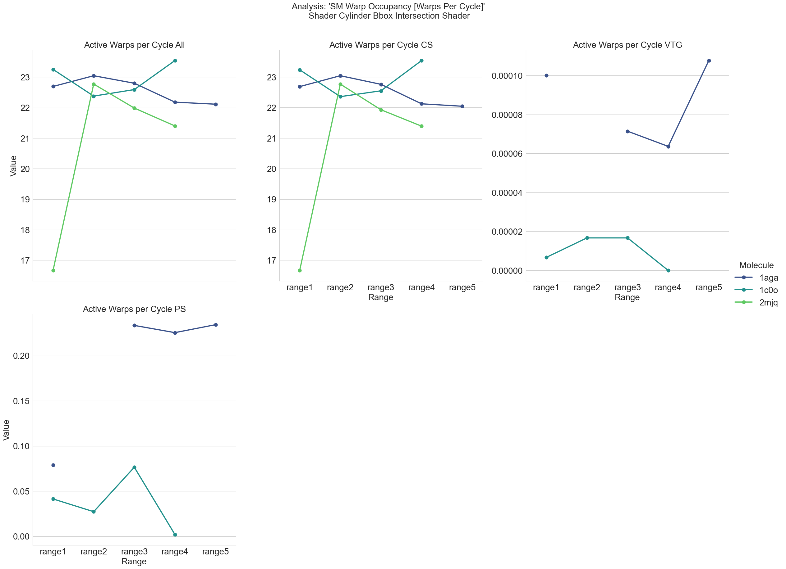

_Caption (Fig. 105): Charts showing SM Warp Occupancy for the Cylinder Bbox Intersection Shader across different scenes and camera ranges. The x-axis represents the camera range (distance from the molecule), and the y-axis represents the value. Each chart has its own scale (mentioned in the title). Each line corresponds to a different scene._

---

[^1]: Higher register pressure reduces occupancy because fewer warps can be resident per SM.

##### SM Warp Occupancy [\%]

##### Sphere Bbox Extraction Shader

Unused Warp Slots in Idle SMs [%] decreased with molecule size because the workload increased (fewer idle warps and fewer idle SMs). Unused Warp Slots in Active SMs [%] decreased for the same reason. See [Figure 106](#fig-106).

**Fig. 106**
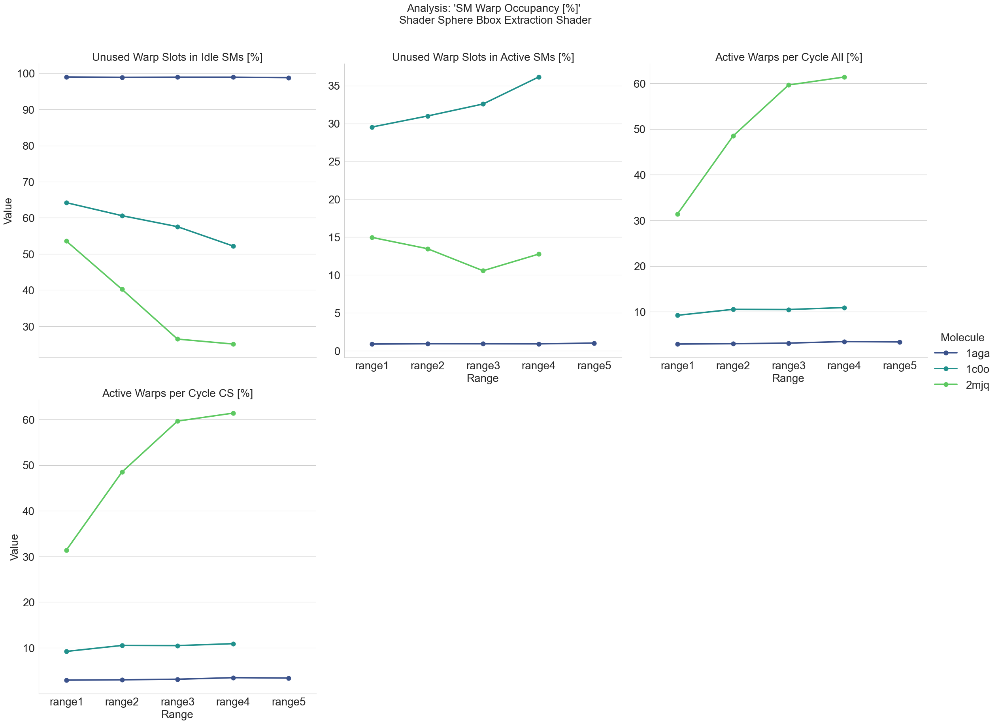

_Caption (Fig. 106): Charts showing SM Warp Occupancy (%) for the Sphere Bbox Extraction Shader across different scenes and camera ranges. The x-axis represents the camera range (distance from the molecule), and the y-axis represents the value. Each chart has its own scale (mentioned in the title). Each line corresponds to a different scene._

##### Sphere Bbox Intersection Shader

Similar to the previous case, Unused Warp Slots in Idle SMs [%] decreased with range (fewer entities removed, more to process), but in some cases Unused Warp Slots in Active SMs [%] appeared to increase with range, probably because the boxes were smaller and some warps finished early (those boxes did not contain the corresponding pixels), reaching high values of idle warps (10-13). See [Figure 107](#fig-107).

**Fig. 107**
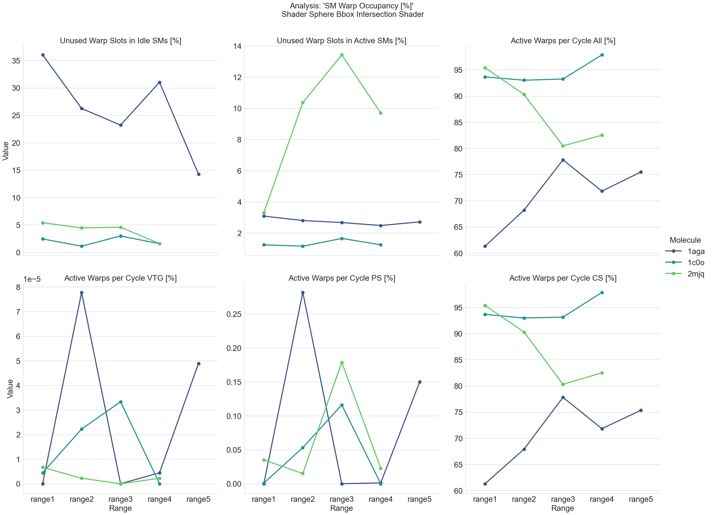

_Caption (Fig. 107): Charts showing SM Warp Occupancy (%) for the Sphere Bbox Intersection Shader across different scenes and camera ranges. The x-axis represents the camera range (distance from the molecule), and the y-axis represents the value. Each chart has its own scale (mentioned in the title). Each line corresponds to a different scene._

##### Cylinder Bbox Extraction Shader

Similar to spheres. See [Figure 108](#fig-108).

**Fig. 108**
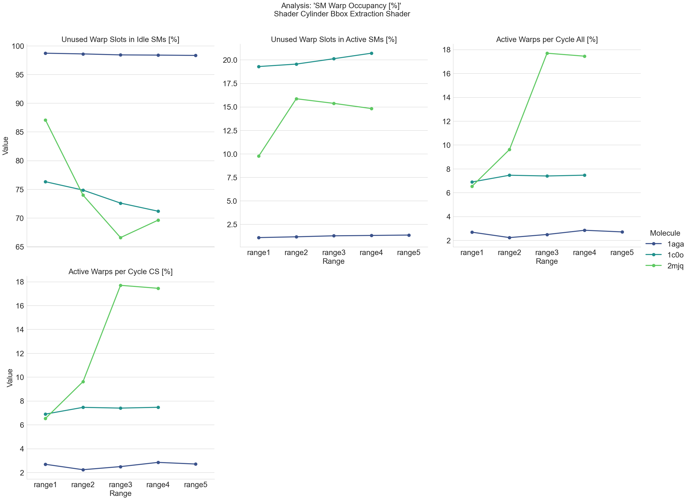

_Caption (Fig. 108): Charts showing SM Warp Occupancy (%) for the Cylinder Bbox Extraction Shader across different scenes and camera ranges. The x-axis represents the camera range (distance from the molecule), and the y-axis represents the value. Each chart has its own scale (mentioned in the title). Each line corresponds to a different scene._

##### Cylinder Bbox Intersection Shader

Unused Warp Slots in Active SMs [%] showed high percentages in all cases (25% or more) despite the heavy compute load. This could be because more warps could not be launched: so many registers were needed that the SMs could not launch additional warps, leaving slots inactive. That also explained why Unused Warp Slots in Idle SMs [%] was low; there were likely few idle SMs. One possible improvement would be to control the per-thread workload so threads finish sooner, use fewer registers, and allow more warps to launch. See [Figure 109](#fig-109).

**Fig. 109**
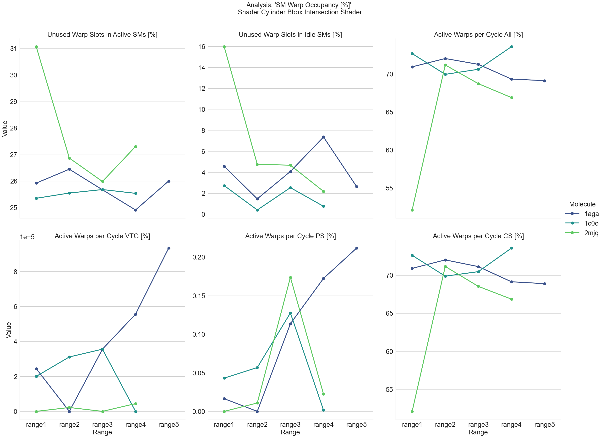

_Caption (Fig. 109): Charts showing SM Warp Occupancy (%) for the Cylinder Bbox Intersection Shader across different scenes and camera ranges. The x-axis represents the camera range (distance from the molecule), and the y-axis represents the value. Each chart has its own scale (mentioned in the title). Each line corresponds to a different scene._

##### SM Warp Issue Stalls [\%]

##### Sphere Bbox Extraction Shader

Warps Issue Stalled Long Scoreboard [%] decreased with range and stayed below 12%, so waiting on VRAM data was not a problem. Warps Issue Stalled No Instruction [%] showed nothing notable; the shader was small enough to fit in the instruction cache (around 3% or less). Warp Issue Stalled IMC Miss [%] was below 2% in all cases, indicating few immediate constants and efficient parameter access. Warp Issue Stalled Wait [%] was negligible because the pipeline had no fixed-latency instruction bottlenecks. Finally, Warp Issue Stalled LG Throttle [%] referred to latency from VRAM traffic; as range increased this percentage also increased, indicating the shader could suffer latency because more data had to be stored when less geometry was removed. See [Figure 110](#fig-110).

**Fig. 110**
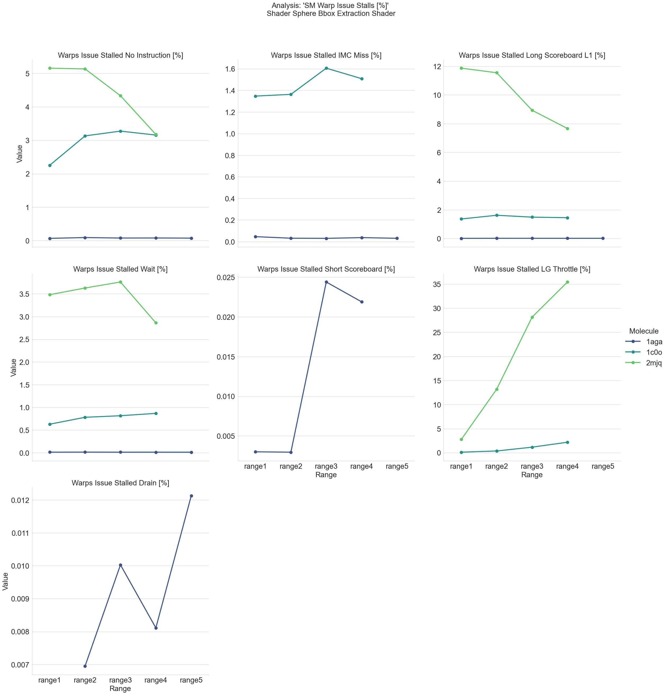

_Caption (Fig. 110): Charts showing SM Warp Issue Stalls for the Sphere Bbox Extraction Shader across different scenes and camera ranges. The x-axis represents the camera range (distance from the molecule), and the y-axis represents the value. Each chart has its own scale (mentioned in the title). Each line corresponds to a different scene._

##### Sphere Bbox Intersection Shader

Warp Issue Stalled Wait [%] was higher (20-30%) with no range-related pattern, likely due to the number of loops and heavy computations, plus the coordination required within each workgroup. Warp Issue Short Scoreboard [%] varied between 10-15% despite the amount of compute required per entity (spheres are not heavy compute; higher values would be expected for cylinders). Warp Issue Stalled Not Selected [%] was between 7.5-11%, did not necessarily increase with range, and was not influential, suggesting no warps were deprioritized due to workload differences. Warp Issue Stalled Barrier [%] decreased with range and stayed below 4% throughout, similar to Warp Issue Stalled No Instruction [%]. See [Figure 111](#fig-111).

**Fig. 111**
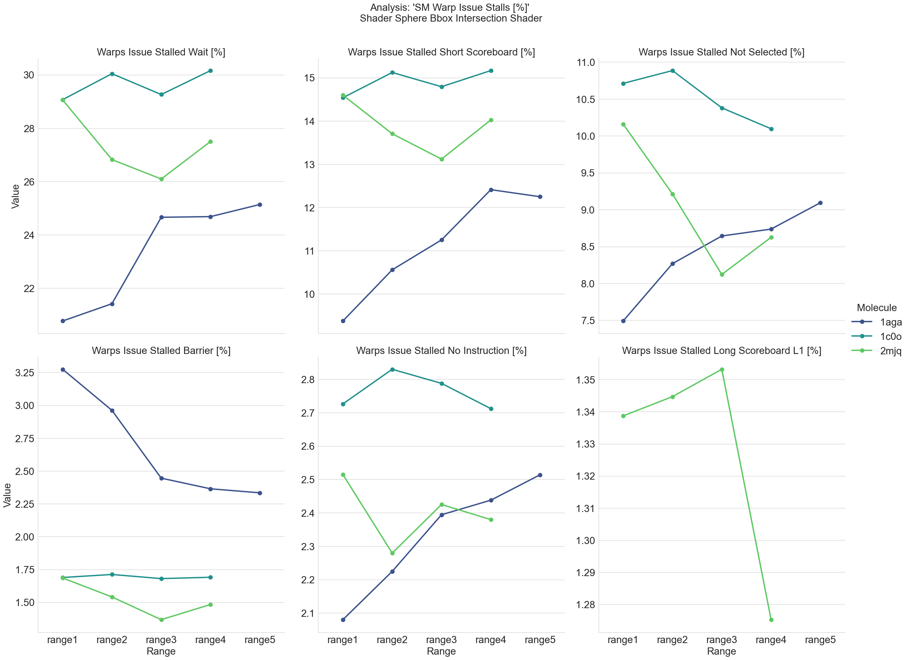

_Caption (Fig. 111): Charts showing SM Warp Issue Stalls for the Sphere Bbox Intersection Shader across different scenes and camera ranges. The x-axis represents the camera range (distance from the molecule), and the y-axis represents the value. Each chart has its own scale (mentioned in the title). Each line corresponds to a different scene._

##### Cylinder Bbox Extraction Shader

No notable values were observed. See [Figure 112](#fig-112).

**Fig. 112**
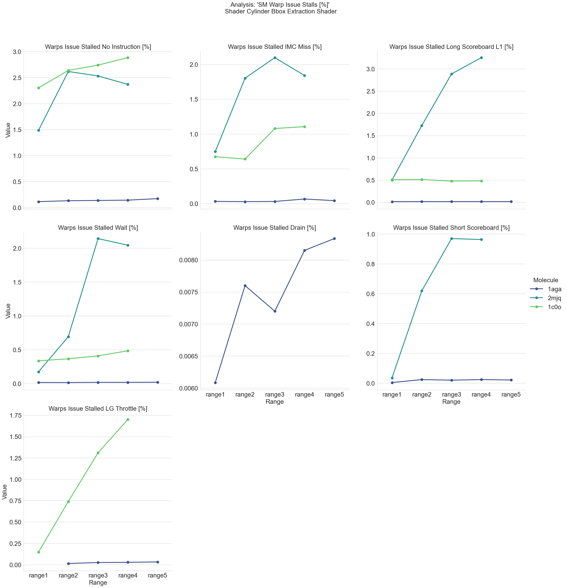

_Caption (Fig. 112): Charts showing SM Warp Issue Stalls for the Cylinder Bbox Extraction Shader across different scenes and camera ranges. The x-axis represents the camera range (distance from the molecule), and the y-axis represents the value. Each chart has its own scale (mentioned in the title). Each line corresponds to a different scene._

##### Cylinder Bbox Intersection Shader

Warp Issue Stalled Wait [%] was between 15-16%, which was not very high, and likely came from the number of loops and their divergence. No other notable percentages appeared, probably because there were not as many cylinders as spheres in the largest tested molecules. See [Figure 113](#fig-113).

**Fig. 113**
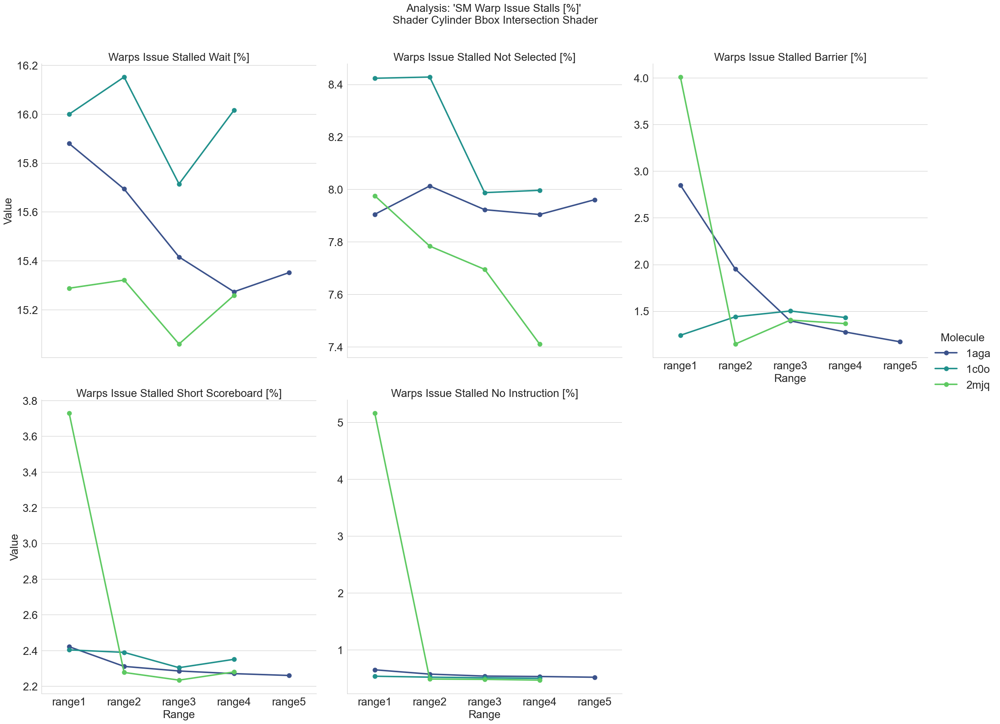

_Caption (Fig. 113): Charts showing SM Warp Issue Stalls for the Cylinder Bbox Intersection Shader across different scenes and camera ranges. The x-axis represents the camera range (distance from the molecule), and the y-axis represents the value. Each chart has its own scale (mentioned in the title). Each line corresponds to a different scene._

##### Cumulative Warp Latencies [\%]

##### Sphere Bbox Extraction Shader

All molecules at all ranges showed 100% in Cumulative Warp Latency CS [%], i.e., CS warps generated the latency. See [Figure 114](#fig-114).

**Fig. 114**
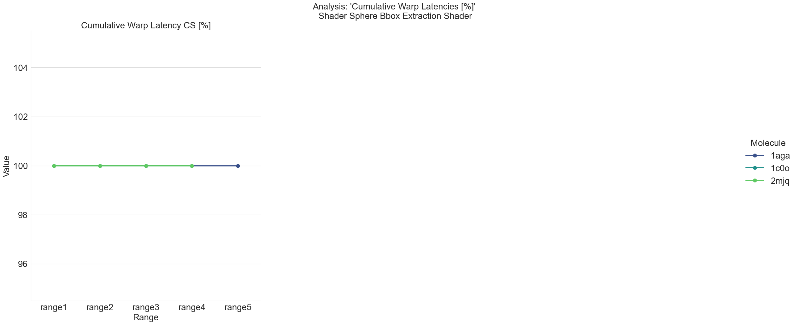

_Caption (Fig. 114): Charts showing Cumulative Warp Latency (%) for the Sphere Bbox Extraction Shader across different scenes and camera ranges. The x-axis represents the camera range (distance from the molecule), and the y-axis represents the value. Each chart has its own scale (mentioned in the title). Each line corresponds to a different scene._

##### Sphere Bbox Intersection Shader

All molecules at all ranges showed 100% in Cumulative Warp Latency CS [%], i.e., CS warps generated the latency. See [Figure 115](#fig-115).

**Fig. 115**
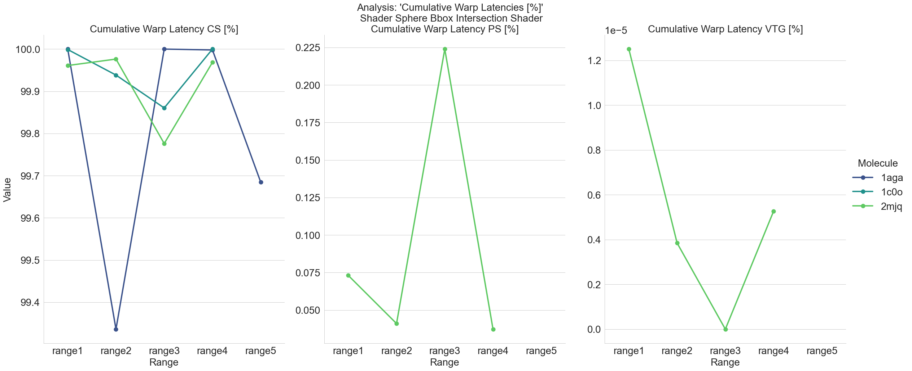

_Caption (Fig. 115): Charts showing Cumulative Warp Latency (%) for the Sphere Bbox Intersection Shader across different scenes and camera ranges. The x-axis represents the camera range (distance from the molecule), and the y-axis represents the value. Each chart has its own scale (mentioned in the title). Each line corresponds to a different scene._

##### Cylinder Bbox Extraction Shader

All molecules at all ranges showed 100% in Cumulative Warp Latency CS [%], i.e., CS warps generated the latency. See [Figure 116](#fig-116).

**Fig. 116**

_Caption (Fig. 116): Charts showing Cumulative Warp Latency (%) for the Cylinder Bbox Extraction Shader across different scenes and camera ranges. The x-axis represents the camera range (distance from the molecule), and the y-axis represents the value. Each chart has its own scale (mentioned in the title). Each line corresponds to a different scene._

##### Cylinder Bbox Intersection Shader

All molecules at all ranges showed 100% in Cumulative Warp Latency CS [%], i.e., CS warps generated the latency. See [Figure 117](#fig-117).

**Fig. 117**
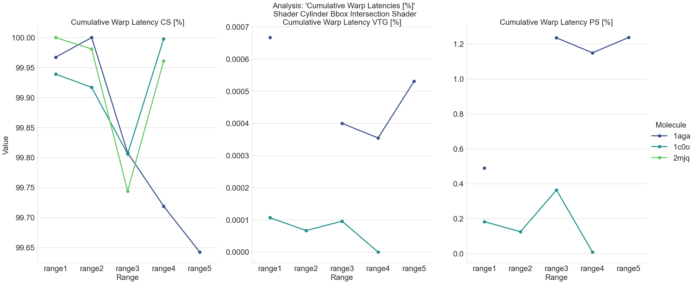

_Caption (Fig. 117): Charts showing Cumulative Warp Latency (%) for the Cylinder Bbox Intersection Shader across different scenes and camera ranges. The x-axis represents the camera range (distance from the molecule), and the y-axis represents the value. Each chart has its own scale (mentioned in the title). Each line corresponds to a different scene._

##### Cumulative Warp Latencies [Cycles]

##### Sphere Bbox Extraction Shader

All latency came from CS warps, and cycles increased with range (more compute). See [Figure 118](#fig-118).

**Fig. 118**
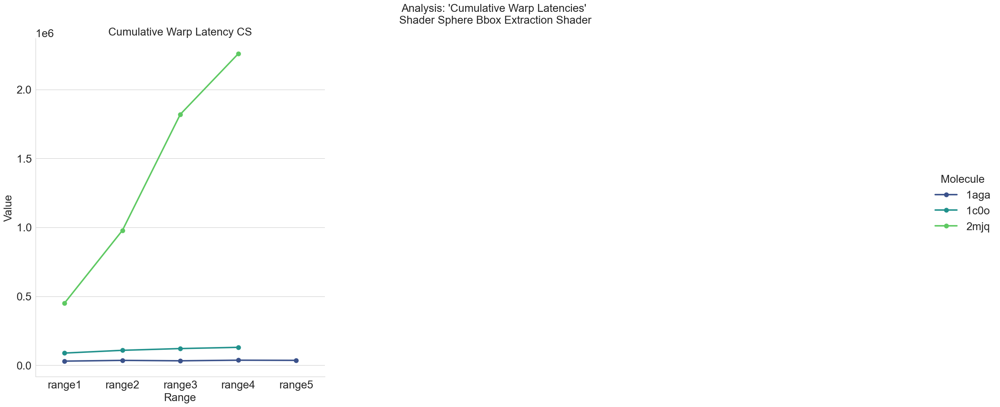

_Caption (Fig. 118): Charts showing Cumulative Warp Latency (cycles) for the Sphere Bbox Extraction Shader across different scenes and camera ranges. The x-axis represents the camera range (distance from the molecule), and the y-axis represents the value. Each chart has its own scale (mentioned in the title). Each line corresponds to a different scene._

##### Sphere Bbox Intersection Shader

All latency came from CS warps, and cycles increased with range (more compute). See [Figure 119](#fig-119).

**Fig. 119**
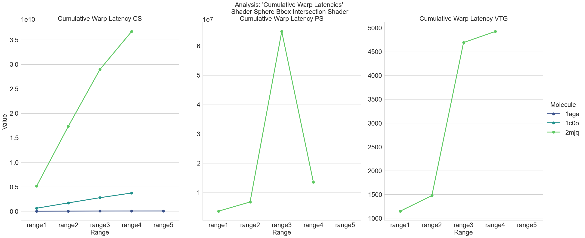

_Caption (Fig. 119): Charts showing Cumulative Warp Latency (cycles) for the Sphere Bbox Intersection Shader across different scenes and camera ranges. The x-axis represents the camera range (distance from the molecule), and the y-axis represents the value. Each chart has its own scale (mentioned in the title). Each line corresponds to a different scene._

##### Cylinder Bbox Extraction Shader

All latency came from CS warps, and cycles increased with range (more compute). See [Figure 120](#fig-120).

**Fig. 120**
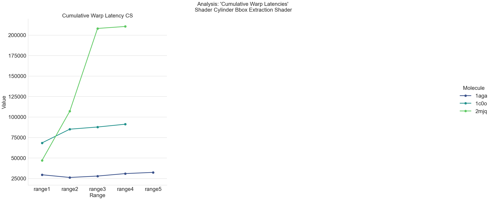

_Caption (Fig. 120): Charts showing Cumulative Warp Latency (cycles) for the Cylinder Bbox Extraction Shader across different scenes and camera ranges. The x-axis represents the camera range (distance from the molecule), and the y-axis represents the value. Each chart has its own scale (mentioned in the title). Each line corresponds to a different scene._

##### Cylinder Bbox Intersection Shader

All latency came from CS warps, and cycles increased with range (more compute). See [Figure 121](#fig-121).

**Fig. 121**
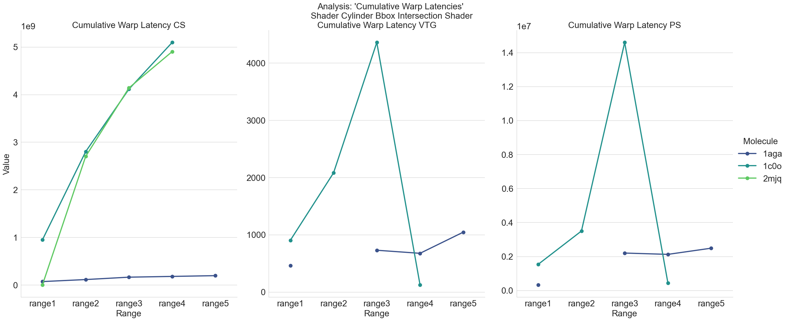

_Caption (Fig. 121): Charts showing Cumulative Warp Latency (cycles) for the Cylinder Bbox Intersection Shader across different scenes and camera ranges. The x-axis represents the camera range (distance from the molecule), and the y-axis represents the value. Each chart has its own scale (mentioned in the title). Each line corresponds to a different scene._

##### Active Threads Per Warp

##### Sphere Bbox Extraction Shader

The percentage of Pred On per Inst Executed [%] increased with range, which was logical because at short ranges more than half of the entities could be removed, causing half the threads to take one path and the other half a different one (returning or storing the bbox). SM Thread Inst Executed Pred On also increased with range because fewer removals meant more instructions executed inside conditionals. See [Figure 122](#fig-122).

**Fig. 122**
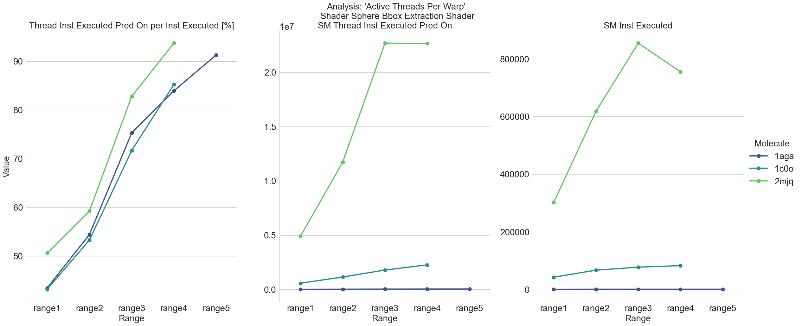

_Caption (Fig. 122): Charts showing Active Threads Per Warp for the Sphere Bbox Extraction Shader across different scenes and camera ranges. The x-axis represents the camera range (distance from the molecule), and the y-axis represents the value. Each chart has its own scale (mentioned in the title). Each line corresponds to a different scene._

##### Sphere Bbox Intersection Shader

Unlike the previous case, all threads performed the same work, so the percentages were above 98% and increased with range. See [Figure 123](#fig-123).

**Fig. 123**
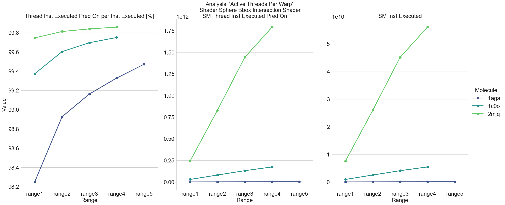

_Caption (Fig. 123): Charts showing Active Threads Per Warp for the Sphere Bbox Intersection Shader across different scenes and camera ranges. The x-axis represents the camera range (distance from the molecule), and the y-axis represents the value. Each chart has its own scale (mentioned in the title). Each line corresponds to a different scene._

##### Cylinder Bbox Extraction Shader

Similar to the sphere extraction shader. See [Figure 124](#fig-124).

**Fig. 124**
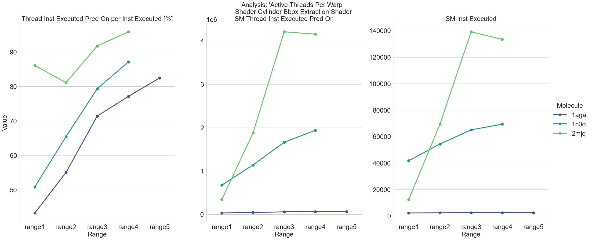

_Caption (Fig. 124): Charts showing Active Threads Per Warp for the Cylinder Bbox Extraction Shader across different scenes and camera ranges. The x-axis represents the camera range (distance from the molecule), and the y-axis represents the value. Each chart has its own scale (mentioned in the title). Each line corresponds to a different scene._

##### Cylinder Bbox Intersection Shader

Similar to the sphere extraction shader. See [Figure 125](#fig-125).

**Fig. 125**
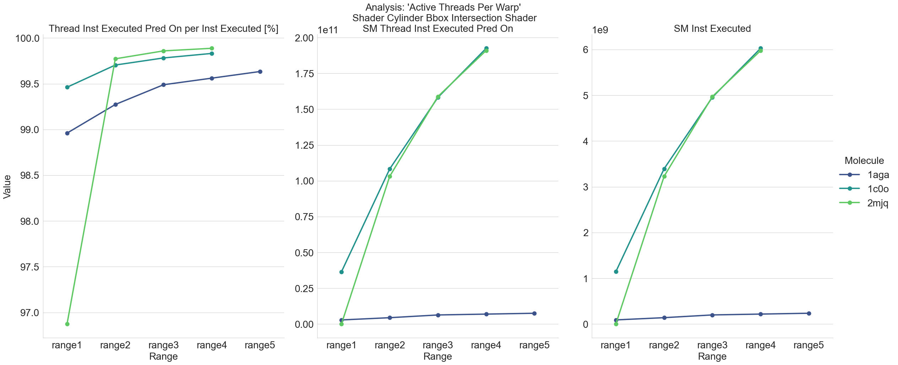

_Caption (Fig. 125): Charts showing Active Threads Per Warp for the Cylinder Bbox Intersection Shader across different scenes and camera ranges. The x-axis represents the camera range (distance from the molecule), and the y-axis represents the value. Each chart has its own scale (mentioned in the title). Each line corresponds to a different scene._

##### Warp Launch Stalled by Reasons [\%]

##### Sphere Bbox Extraction Shader See [Figure 126](#fig-126).

CS Warp Launch Stalled Warp Slot Allocation [%] increased with molecule size and range, since both implied more work. Range made warp completion slower because more bboxes had to be extracted, so the percentage increased. Even so, the tested molecules showed low values (maximum 18% at the largest range).

**Fig. 126**
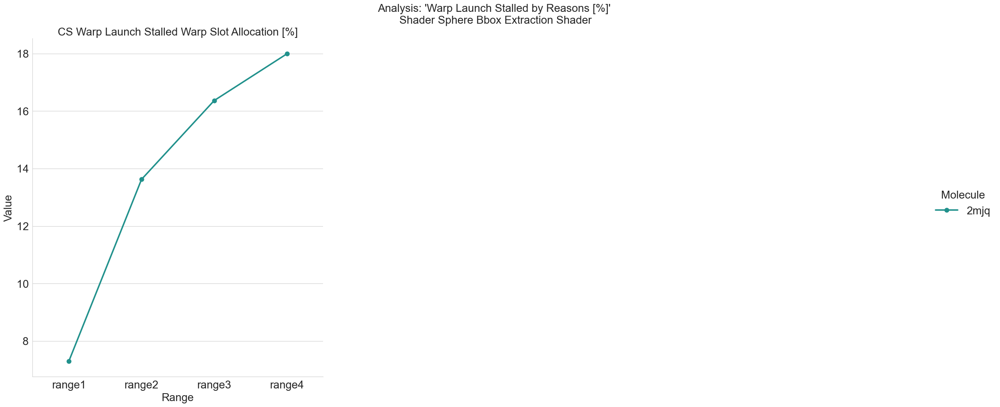

_Caption (Fig. 126): Charts showing Warp Launch Stalled by Reasons for the Sphere Bbox Extraction Shader across different scenes and camera ranges. The x-axis represents the camera range (distance from the molecule), and the y-axis represents the value. Each chart has its own scale (mentioned in the title). Each line corresponds to a different scene._

##### Sphere Bbox Intersection Shader

CS Warp Launch Stalled Warp Slot Allocation [%] appeared to increase with molecule size but decrease with range, likely because while per-thread work increased, more SMs were occupied. Larger molecules could not be tested because this version could not support them. CS Warp Launch Stalled Shared Memory Allocation [%] also showed considerable percentages; it increased with molecule size but decreased with range. This was expected because more entities meant more bbox packets were extracted into shared memory. However, the decrease with range was notable and could be attributed to the fact that as per-thread work increased, shared-memory lookup became less dominant among stall reasons. See [Figure 127](#fig-127).

**Fig. 127**
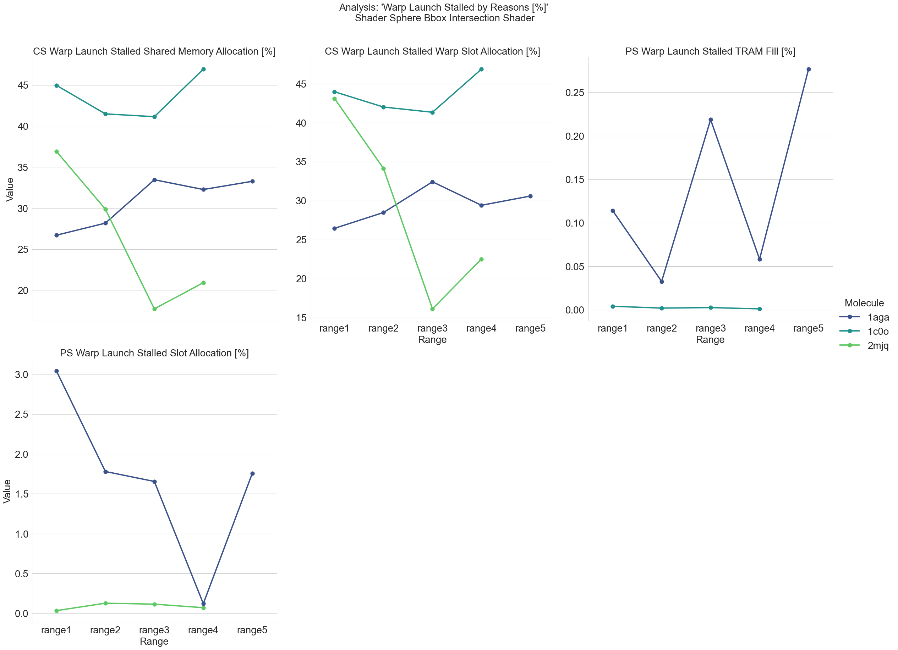

_Caption (Fig. 127): Charts showing Warp Launch Stalled by Reasons for the Sphere Bbox Intersection Shader across different scenes and camera ranges. The x-axis represents the camera range (distance from the molecule), and the y-axis represents the value. Each chart has its own scale (mentioned in the title). Each line corresponds to a different scene._

##### Cylinder Bbox Extraction Shader

Similar to the sphere extraction shader. See [Figure 128](#fig-128).

**Fig. 128**
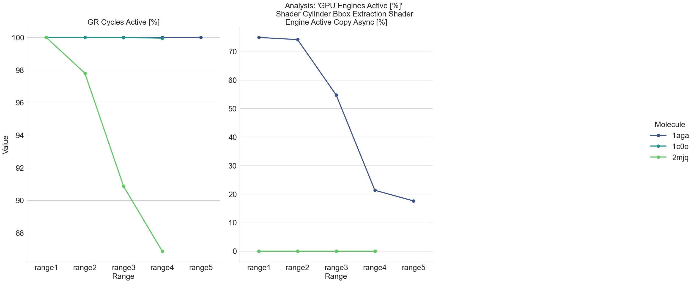

_Caption (Fig. 128): Charts showing Warp Launch Stalled by Reasons for the Cylinder Bbox Extraction Shader across different scenes and camera ranges. The x-axis represents the camera range (distance from the molecule), and the y-axis represents the value. Each chart has its own scale (mentioned in the title). Each line corresponds to a different scene._

##### Cylinder Bbox Intersection Shader

In this case CS Warp Launch Stalled Shared Memory Allocation [%] represented the largest percentage. This could be because there were fewer cylinders than spheres and because the structure required to hold cylinder bboxes was heavier than the one used for sphere bboxes. See [Figure 129](#fig-129).

**Fig. 129**
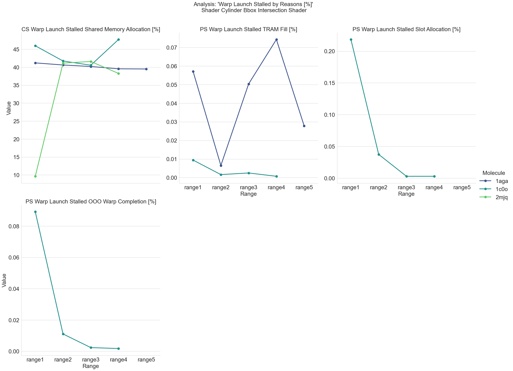

_Caption (Fig. 129): Charts showing Warp Launch Stalled by Reasons for the Cylinder Bbox Intersection Shader across different scenes and camera ranges. The x-axis represents the camera range (distance from the molecule), and the y-axis represents the value. Each chart has its own scale (mentioned in the title). Each line corresponds to a different scene._

##### SM Throughputs

##### Sphere Bbox Extraction Shader

SM Pipe FMA Active [%], SM Issue Active [%], SM Pipe SFU Active [%], and SM Pipe ALU Active [%] increased with molecule scale. In the largest molecule the highest ranges appeared to show a decrease in percentage (possibly because work became more uniform across threads), but values stayed between 10-14%. See [Figure 130](#fig-130).

**Fig. 130**
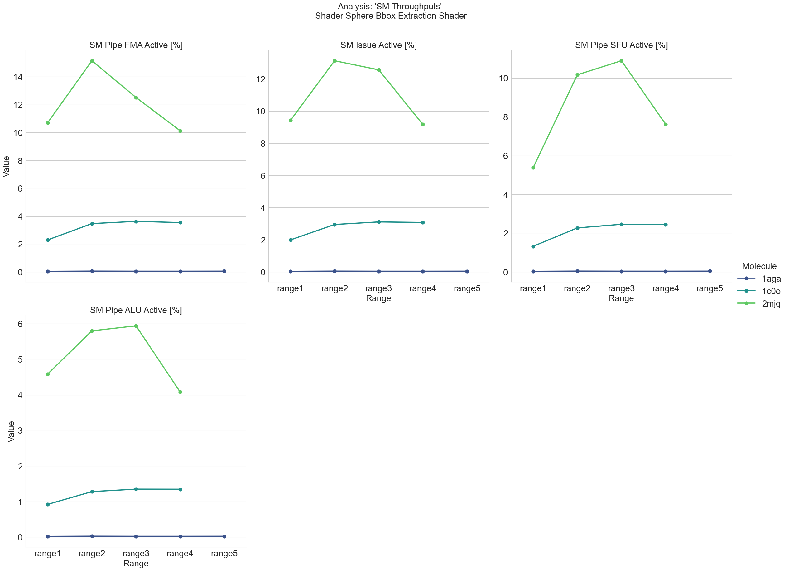

_Caption (Fig. 130): Charts showing SM Throughputs for the Sphere Bbox Extraction Shader across different scenes and camera ranges. The x-axis represents the camera range (distance from the molecule), and the y-axis represents the value. Each chart has its own scale (mentioned in the title). Each line corresponds to a different scene._

##### Sphere Bbox Intersection Shader

SM Pipe SFU Active [%] showed a high percentage in all cases; even the smallest molecule at the smallest range had around 60% throughput, and in the largest range it reached 80%. Other molecules were above 85% throughput at all ranges. This meant the shader was limited by heavy computations (roots, sines, cosines, etc.). SM Issue Active [%] showed similar behavior, indicating many instructions were executed (45-65%). SM Pipe ALU Active [%] was similar, with values between 25-42%, indicating that integer calculations carried weight and were frequent (there are more ALUs than SFUs). SM Pipe FMA Active [%] did not appear to have much impact; the percentages decreased with molecule size and range, which suggested the relative weight of this unit was low (below 10% in all cases). SM Pipe Shared Active [%] (casts or low-frequency special operations) showed similar trends but low percentages (around 10%), so it did not become relevant. See [Figure 131](#fig-131).

**Fig. 131**
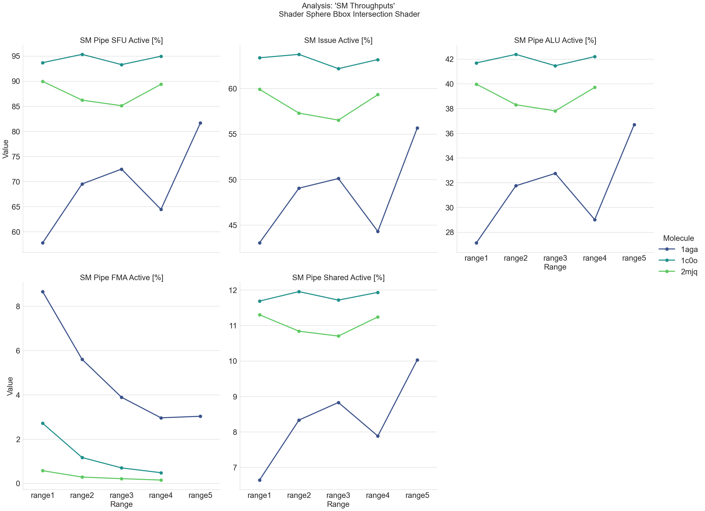

_Caption (Fig. 131): Charts showing SM Throughputs for the Sphere Bbox Intersection Shader across different scenes and camera ranges. The x-axis represents the camera range (distance from the molecule), and the y-axis represents the value. Each chart has its own scale (mentioned in the title). Each line corresponds to a different scene._

##### Cylinder Bbox Extraction Shader

Similar to the sphere extraction shader, with lower values due to the smaller number of cylinders. See [Figure 132](#fig-132).

**Fig. 132**
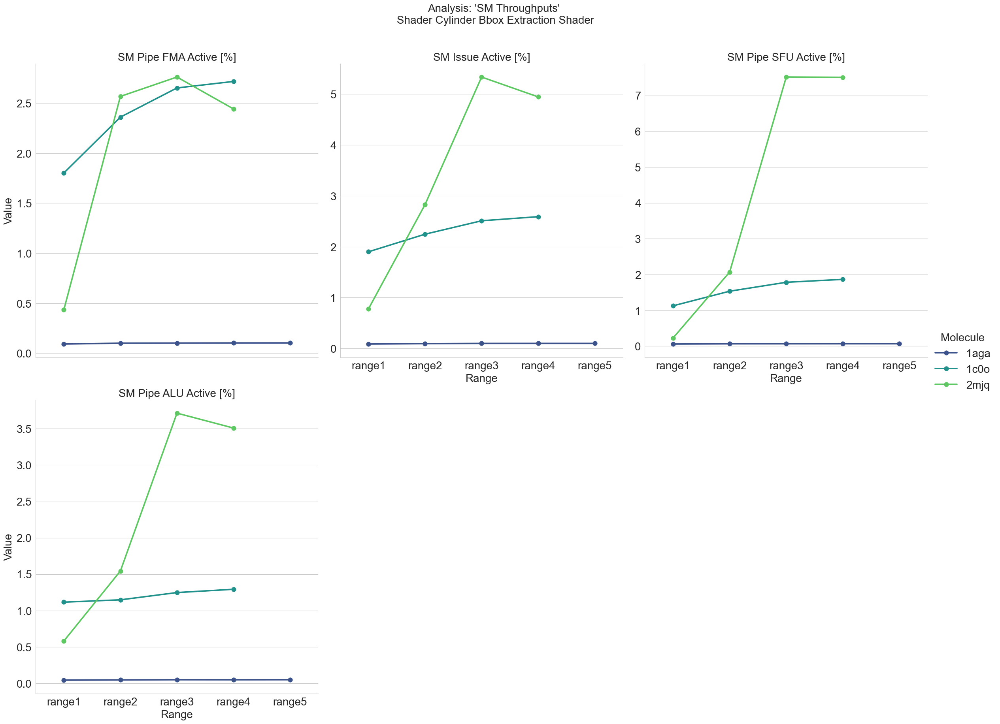

_Caption (Fig. 132): Charts showing SM Throughputs for the Cylinder Bbox Extraction Shader across different scenes and camera ranges. The x-axis represents the camera range (distance from the molecule), and the y-axis represents the value. Each chart has its own scale (mentioned in the title). Each line corresponds to a different scene._

##### Cylinder Bbox Intersection Shader

Similar to the sphere intersection shader. These shaders had heavy compute load: expensive operations, integer calculations, and (to a lesser extent) floating-point operations, plus many instructions for the same reason (SM Issue Active). SM Pipe Shared Active [%] decreased compared to spheres (around 3%). See [Figure 133](#fig-133).

**Fig. 133**
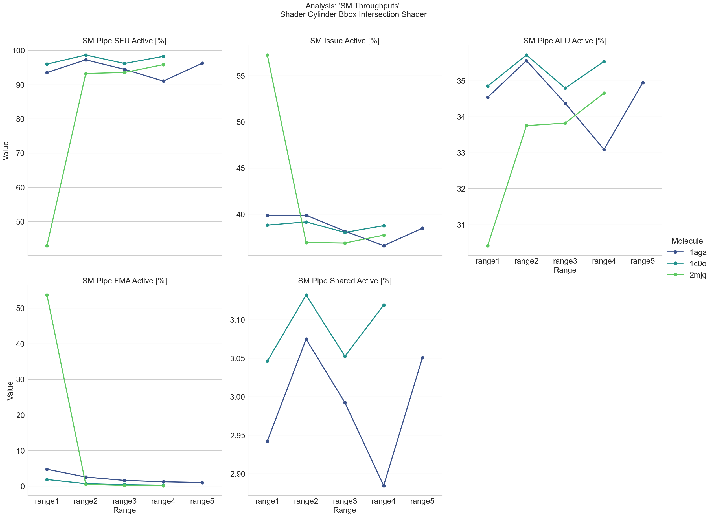

_Caption (Fig. 133): Charts showing SM Throughputs for the Cylinder Bbox Intersection Shader across different scenes and camera ranges. The x-axis represents the camera range (distance from the molecule), and the y-axis represents the value. Each chart has its own scale (mentioned in the title). Each line corresponds to a different scene._

##### Performance Per Marked Range

**Fig. 134**
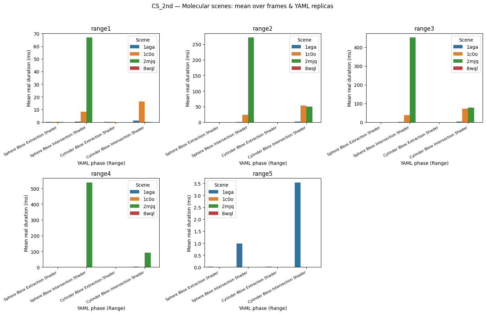

_Caption (Fig. 134): Charts showing frame time per marked range for the second GPGPU version across different scenes and camera ranges. The x-axis represents the camera range (distance from the molecule), and the y-axis represents the value. Each chart has its own scale (mentioned in the title). Each line corresponds to a different scene._

In [Fig. 134](#fig-134) it is easy to see the exponential jump in the time of each frame only by increasing the size of the molecule, the range doesn't really matter. It is also possible to note that the extraction shaders are much faster than the intersection ones, which is expected because they perform a much lighter workload by applying only frustum culling.

##### Compact (synthetic) scenes

##### GPU Engines Active [\%]

##### Sphere Bbox Extraction Shader

**Fig. 135**
![Charts showing GPU Engines Active [%] for the Sphere Bbox Extraction Shader across different scenes and camera ranges...](img/chapter3/results/compact/scnd_gpu/gpu_engines_active_pcnt/sphere_extr.png)

_Caption (Fig. 135): Charts showing GPU Engines Active [%] for the Sphere Bbox Extraction Shader across compact grid scenes grid1–grid3 The x-axis represents the camera range (distance from the scene), and the y-axis represents the value. Each chart has its own scale (mentioned in the title). Each line corresponds to a different grid (grid1, grid2, …)._

In [Figure 135](#fig-135) GR Cycles Active [%] show around 100% most of the time for every grid, except for grid3 in range5 where it drops to 86%. Engine Active Copy Async [%] also has high percentages over 90% most of the time except for range1, maybe because during testing it was seen that range1 had the best performance so it meant less (or more efficient) data movement. Copy Sync [%] is close to 0% all the time in any case.

##### Sphere Bbox Intersection Shader

**Fig. 136**
![Charts showing GPU Engines Active [%] for the Sphere Bbox Intersection Shader across different scenes and camera rang...](img/chapter3/results/compact/scnd_gpu/gpu_engines_active_pcnt/sphere_intr.png)

_Caption (Fig. 136): Charts showing GPU Engines Active [%] for the Sphere Bbox Intersection Shader across compact grid scenes grid1–grid3 The x-axis represents the camera range (distance from the scene), and the y-axis represents the value. Each chart has its own scale (mentioned in the title). Each line corresponds to a different grid (grid1, grid2, …)._

Engine Active Copy Async [%] shows an important decline from range1 to range3, where it reaches almost 0 for the rest of the ranges for grid2 and 3, and Copy Sync [%] is close to 0% in most cases, so this could mean that from range3 to range5 not much data was moved. See [Figure 136](#fig-136).

##### Cylinder Bbox Extraction Shader

**Fig. 137**
![Charts showing GPU Engines Active [%] for the Cylinder Bbox Extraction Shader across different scenes and camera rang...](img/chapter3/results/compact/scnd_gpu/gpu_engines_active_pcnt/cylinder_extr.png)

_Caption (Fig. 137): Charts showing GPU Engines Active [%] for the Cylinder Bbox Extraction Shader across compact grid scenes grid1–grid3 The x-axis represents the camera range (distance from the scene), and the y-axis represents the value. Each chart has its own scale (mentioned in the title). Each line corresponds to a different grid (grid1, grid2, …)._

Results shown in [Figure 137](#fig-137) are similar to those in Sphere Bbox Extraction Shader.

##### Cylinder Bbox Intersection Shader

**Fig. 138**
![Charts showing GPU Engines Active [%] for the Cylinder Bbox Intersection Shader across different scenes and camera ra...](img/chapter3/results/compact/scnd_gpu/gpu_engines_active_pcnt/cylinder_intr.png)

_Caption (Fig. 138): Charts showing GPU Engines Active [%] for the Cylinder Bbox Intersection Shader across compact grid scenes grid1–grid3 The x-axis represents the camera range (distance from the scene), and the y-axis represents the value. Each chart has its own scale (mentioned in the title). Each line corresponds to a different grid (grid1, grid2, …)._

[Figure 138](#fig-138) is also similar to spheres, with the difference that Copy Async meant dropping to almost zero for every grid.

##### GR Cycles Active

##### Sphere Bbox Extraction Shader

**Fig. 139**
![Charts showing GPU Engines Active [%] for the Sphere Bbox Extraction Shader across different scenes and camera ranges...](img/chapter3/results/compact/scnd_gpu/gpu_engines_active/sphere_extr.png)

_Caption (Fig. 139): Charts showing GPU Engines Active [%] for the Sphere Bbox Extraction Shader across compact grid scenes grid1–grid3 The x-axis represents the camera range (distance from the scene), and the y-axis represents the value. Each chart has its own scale (mentioned in the title). Each line corresponds to a different grid (grid1, grid2, …)._

GR Cycles Active stay more or less constant across ranges for grid1 and grid2, but for grid3 there is an increase across ranges that goes from around 19k cycles for in range1 to around 32.5k cycles in range5. This could be due to the growth of the work with less culled entities. Similar behaviour is sin in Engine Active Copy Async, where cycles dedicated to aynchronous data movement increase along ranges only for grid3. Copy Sync has close to 0 cycles in all cases. See [Figure 139](#fig-139).

##### Sphere Bbox Intersection Shader

**Fig. 140**
![Charts showing GPU Engines Active [%] for the Sphere Bbox Intersection Shader across different scenes and camera rang...](img/chapter3/results/compact/scnd_gpu/gpu_engines_active/sphere_intr.png)

_Caption (Fig. 140): Charts showing GPU Engines Active [%] for the Sphere Bbox Intersection Shader across compact grid scenes grid1–grid3 The x-axis represents the camera range (distance from the scene), and the y-axis represents the value. Each chart has its own scale (mentioned in the title). Each line corresponds to a different grid (grid1, grid2, …)._

In [Figure 140](#fig-140) Engine Active Copy Async shows how for grid2 and grid3 cycles spike from range1 to 2, but then there is a slight decline until range5. For grid1 cycles just grow across ranges. For GR Cycles Active all grids show the same behaviour: growth across ranges, but still grid3 is the one with highest maximum value in range5. For grid3 it is even possible to see an exponential growth in cycles. This means that with range there is an increase in the cycles dedicated to parallel computations, which is congruent with the performance seen during testing.

##### Cylinder Bbox Extraction Shader

**Fig. 141**
![Charts showing GPU Engines Active [%] for the Cylinder Bbox Extraction Shader across different scenes and camera rang...](img/chapter3/results/compact/scnd_gpu/gpu_engines_active/cylinder_extr.png)

_Caption (Fig. 141): Charts showing GPU Engines Active [%] for the Cylinder Bbox Extraction Shader across compact grid scenes grid1–grid3 The x-axis represents the camera range (distance from the scene), and the y-axis represents the value. Each chart has its own scale (mentioned in the title). Each line corresponds to a different grid (grid1, grid2, …)._

In [Figure 141](#fig-141) it is possible to see that for bigger scenes there is a lower amount of average cycles per range in GR Cycles Active, and for Engince Active Copy Async it is close to 0 cycles in most cases. This puts in evidence that this shader is light in comparison to others studied during testing.

##### Cylinder Bbox Intersection Shader

**Fig. 142**
![Charts showing GPU Engines Active [%] for the Cylinder Bbox Intersection Shader across different scenes and camera ra...](img/chapter3/results/compact/scnd_gpu/gpu_engines_active/cylinder_intr.png)

_Caption (Fig. 142): Charts showing GPU Engines Active [%] for the Cylinder Bbox Intersection Shader across compact grid scenes grid1–grid3 The x-axis represents the camera range (distance from the scene), and the y-axis represents the value. Each chart has its own scale (mentioned in the title). Each line corresponds to a different grid (grid1, grid2, …)._

In [Figure 142](#fig-142) cylinders show similar results as spheres.

##### Graphics/Compute Idle [\%]

##### Sphere Bbox Extraction Shader

**Fig. 143**
![Charts showing Graphics/Compute Idle [%] for the Sphere Bbox Extraction Shader across different scenes and camera ran...](img/chapter3/results/compact/scnd_gpu/graphics_compute_idle/sphere_extr.png)

_Caption (Fig. 143): Charts showing Graphics/Compute Idle [%] for the Sphere Bbox Extraction Shader across compact grid scenes grid1–grid3 The x-axis represents the camera range (distance from the scene), and the y-axis represents the value. Each chart has its own scale (mentioned in the title). Each line corresponds to a different grid (grid1, grid2, …)._

This metric can be seen as a complement of the last one.b GR Cycles Idle [%] and GR Cycles Idle show both low values most of the time, meaning that it was possible to have efficient work done by the SMs and/or that it was full of work at every moment. See [Figure 143](#fig-143).

##### Sphere Bbox Intersection Shader

**Fig. 144**
![Charts showing Graphics/Compute Idle [%] for the Sphere Bbox Intersection Shader across different scenes and camera r...](img/chapter3/results/compact/scnd_gpu/graphics_compute_idle/sphere_intr.png)

_Caption (Fig. 144): Charts showing Graphics/Compute Idle [%] for the Sphere Bbox Intersection Shader across compact grid scenes grid1–grid3 The x-axis represents the camera range (distance from the scene), and the y-axis represents the value. Each chart has its own scale (mentioned in the title). Each line corresponds to a different grid (grid1, grid2, …)._

For charts in [Figure 144](#fig-144) GR Cycles Idle [%] show that at close ranges there is a high percentage of idle cycles, around 40%, and then it lowers close to 0 at farther ranges. GR Cycles Idle on the other hand keeps constant amount of cycles at every range, meaning that what is changing is the amount of active cycles (confirmed with GR Cycles Elapsed). This could mean that the work achieved in farther ranges occupies most of the working time of the engines.

##### Cylinder Bbox Extraction Shader

**Fig. 145**
![Charts showing Graphics/Compute Idle [%] for the Cylinder Bbox Extraction Shader across different scenes and camera r...](img/chapter3/results/compact/scnd_gpu/graphics_compute_idle/cylinder_extr.png)

_Caption (Fig. 145): Charts showing Graphics/Compute Idle [%] for the Cylinder Bbox Extraction Shader across compact grid scenes grid1–grid3 The x-axis represents the camera range (distance from the scene), and the y-axis represents the value. Each chart has its own scale (mentioned in the title). Each line corresponds to a different grid (grid1, grid2, …)._

In [Figure 145](#fig-145) results are similar to the ones of spheres.

##### Cylinder Bbox Intersection Shader

**Fig. 146**
![Charts showing Graphics/Compute Idle [%] for the Cylinder Bbox Intersection Shader across different scenes and camera...](img/chapter3/results/compact/scnd_gpu/graphics_compute_idle/cylinder_intr.png)

_Caption (Fig. 146): Charts showing Graphics/Compute Idle [%] for the Cylinder Bbox Intersection Shader across compact grid scenes grid1–grid3 The x-axis represents the camera range (distance from the scene), and the y-axis represents the value. Each chart has its own scale (mentioned in the title). Each line corresponds to a different grid (grid1, grid2, …)._

Results in [Figure 146](#fig-146) are similar as in the Extraction Shader, which means that there may not be idle moments and it is heavy work at every moment but efficient (low latencies).

##### L1TEX L2 Hit Rates

##### Sphere Bbox Extraction Shader

**Fig. 147**
![Charts showing L2 Cache Hit Rates [%] for the Sphere Bbox Extraction Shader across different scenes and camera ranges...](img/chapter3/results/compact/scnd_gpu/l2_hit_rates/sphere_extr.png)

_Caption (Fig. 147): Charts showing L2 Cache Hit Rates [%] for the Sphere Bbox Extraction Shader across compact grid scenes grid1–grid3 The x-axis represents the camera range (distance from the scene), and the y-axis represents the value. Each chart has its own scale (mentioned in the title). Each line corresponds to a different grid (grid1, grid2, …)._

For every grid the cache hit rate grows with range, reaching high values for medium/far ranges. This could mean that working with more and smaller entities favors the cache efficiency. This could be because each thread accesses only one entity and only one space to save the bounding box, everything in an ordered manner. See [Figure 147](#fig-147).

##### Sphere Bbox Intersection Shader

**Fig. 148**
![Charts showing L2 Cache Hit Rates [%] for the Sphere Bbox Intersection Shader across different scenes and camera rang...](img/chapter3/results/compact/scnd_gpu/l2_hit_rates/sphere_intr.png)

_Caption (Fig. 148): Charts showing L2 Cache Hit Rates [%] for the Sphere Bbox Intersection Shader across compact grid scenes grid1–grid3 The x-axis represents the camera range (distance from the scene), and the y-axis represents the value. Each chart has its own scale (mentioned in the title). Each line corresponds to a different grid (grid1, grid2, …)._

For every grid the cache hit rate reached is a really high value, even better in for medium/far ranges. This could mean that the shader is built in a way that cache is efficient, maybe due to ordered and regular accesses to the different memory spaces (each thread reads and writes only one position in every buffer). See [Figure 148](#fig-148).

##### Cylinder Bbox Extraction Shader

**Fig. 149**
![Charts showing L2 Cache Hit Rates [%] for the Cylinder Bbox Extraction Shader across different scenes and camera rang...](img/chapter3/results/compact/scnd_gpu/l2_hit_rates/cylinder_extr.png)

_Caption (Fig. 149): Charts showing L2 Cache Hit Rates [%] for the Cylinder Bbox Extraction Shader across compact grid scenes grid1–grid3 The x-axis represents the camera range (distance from the scene), and the y-axis represents the value. Each chart has its own scale (mentioned in the title). Each line corresponds to a different grid (grid1, grid2, …)._

Results are similar as in spheres, but with even better cache hit rates for grid1 and grid2. [Figure 149](#fig-149).

##### Cylinder Bbox Intersection Shader

**Fig. 150**
![Charts showing L2 Cache Hit Rates [%] for the Cylinder Bbox Intersection Shader across different scenes and camera ra...](img/chapter3/results/compact/scnd_gpu/l2_hit_rates/cylinder_intr.png)

_Caption (Fig. 150): Charts showing L2 Cache Hit Rates [%] for the Cylinder Bbox Intersection Shader across compact grid scenes grid1–grid3 The x-axis represents the camera range (distance from the scene), and the y-axis represents the value. Each chart has its own scale (mentioned in the title). Each line corresponds to a different grid (grid1, grid2, …)._

[Figure 150](#fig-150) shows a chart with similar results as spheres but for grid3 it has lower average cache hit. This could show be explained by the complexity and erratic shape of projected cylinders, which implies more analysis, stored data and functions applied.

##### L1Tex Miss Sectors

##### Sphere Bbox Extraction Shader

**Fig. 151**
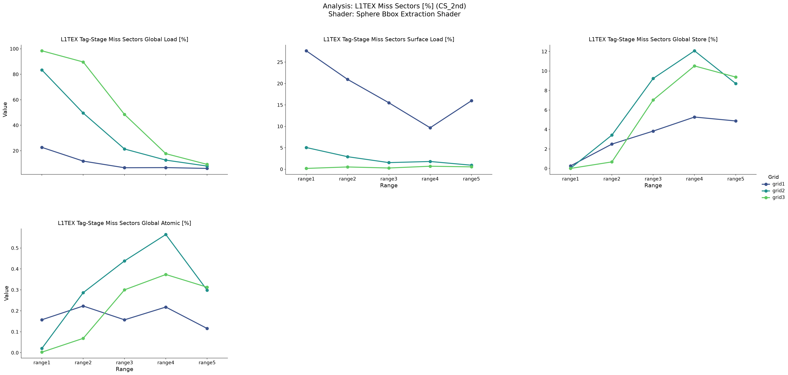

_Caption (Fig. 151): Charts showing L1Tex Miss Sectors for the Sphere Bbox Extraction Shader across compact grid scenes grid1–grid3 The x-axis represents the camera range (distance from the scene), and the y-axis represents the value. Each chart has its own scale (mentioned in the title). Each line corresponds to a different grid (grid1, grid2, …)._

L1TEX Tag-Stage Miss Sectors Global Load [%] show that every grid starts with high cache misses in global buffers reads, with higher initial percentage for bigger scenes (grid1 over 20%, grid2 over 80% and grid3 close to 100%), but they all drop down to around 10%. L1TEX Tag-Stage Miss Sectors Surface Load [%] shows constant values of around 0% for grid3, below 5% for grid2 and between 10-25%. L1TEX Tag-Stage Miss Sectors Global Store [%] has lower increase from 0% at range1 to around 10% at range5. This comes from the fact that in this shader most memory reading comes from the entities buffers, which at higher ranges has more accesses but always regular and ordered. See [Figure 151](#fig-151).

##### Sphere Bbox Intersection Shader

**Fig. 152**
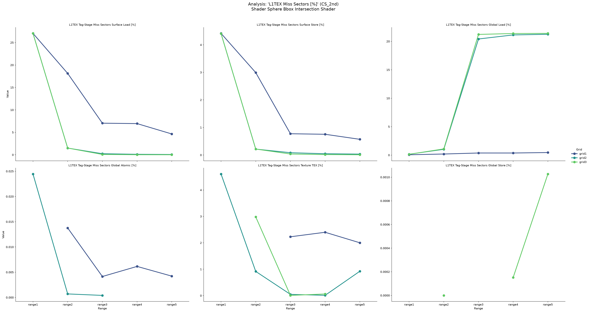

_Caption (Fig. 152): Charts showing L1Tex Miss Sectors for the Sphere Bbox Intersection Shader across compact grid scenes grid1–grid3 The x-axis represents the camera range (distance from the scene), and the y-axis represents the value. Each chart has its own scale (mentioned in the title). Each line corresponds to a different grid (grid1, grid2, …)._

Charts in [Figure 152](#fig-152) show low cache misses in every kind of cache usage, meaning that this shader makes efficient and ordered memory accesses, which is appropiate since each thread accesses one fixated position in shared memory, global memory, depth buffer and the final image buffer.

##### Cylinder Bbox Extraction Shader

**Fig. 153**
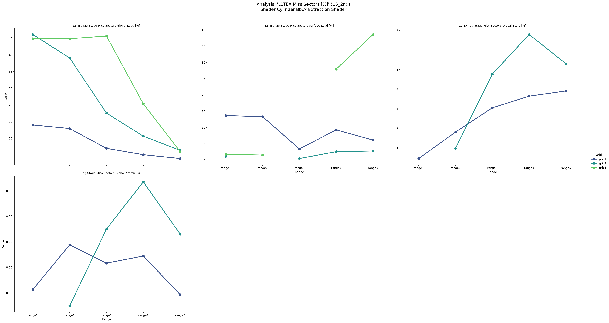

_Caption (Fig. 153): Charts showing L1Tex Miss Sectors for the Cylinder Bbox Extraction Shader across compact grid scenes grid1–grid3 The x-axis represents the camera range (distance from the scene), and the y-axis represents the value. Each chart has its own scale (mentioned in the title). Each line corresponds to a different grid (grid1, grid2, …)._

Results similar to Extraction Shader of spheres. See [Figure 153](#fig-153).

##### Cylinder Bbox Intersection Shader

**Fig. 154**
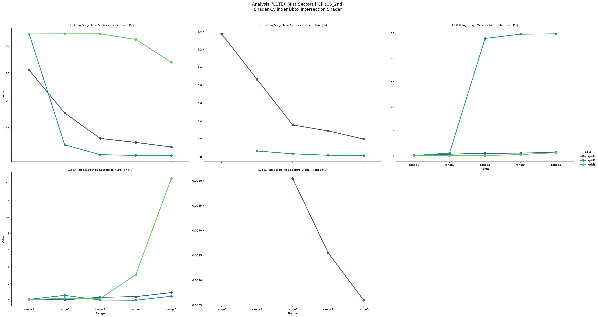

_Caption (Fig. 154): Charts showing L1Tex Miss Sectors for the Cylinder Bbox Intersection Shader across compact grid scenes grid1–grid3 The x-axis represents the camera range (distance from the scene), and the y-axis represents the value. Each chart has its own scale (mentioned in the title). Each line corresponds to a different grid (grid1, grid2, …)._

Results similar to Intersection Shader of spheres. See [Figure 154](#fig-154).

##### L1TEX Sectors [\%]

##### Sphere Bbox Extraction Shader

**Fig. 155**
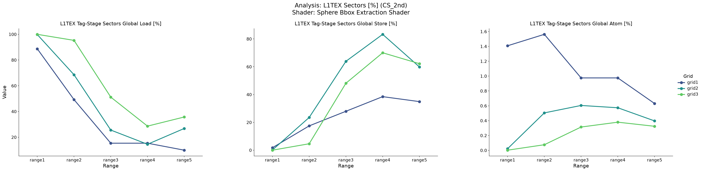

_Caption (Fig. 155): Charts showing L1Tex Sectors for the Sphere Bbox Extraction Shader across compact grid scenes grid1–grid3 The x-axis represents the camera range (distance from the scene), and the y-axis represents the value. Each chart has its own scale (mentioned in the title). Each line corresponds to a different grid (grid1, grid2, …)._

The chart of L1TEX Tag-Stage Sectors Global Load [%] show that cache hit rate diminishes with range, but for L1TEX Tag-Stage Sectors Global Store [%] it increases in a similar way. This could be because that storing in global buffers the data of visible bounding boxes achieves more importance when less emtities are culled. It is unexpected that Global Load [%] reaches such low values, since at farther ranges the global buffers reading is more or less the same as the writing. L1TEX Tag-Stage Sectors Global Atom [%] has values close to zero so there are no useful results. See [Figure 155](#fig-155).

##### Sphere Bbox Intersection Shader

**Fig. 156**
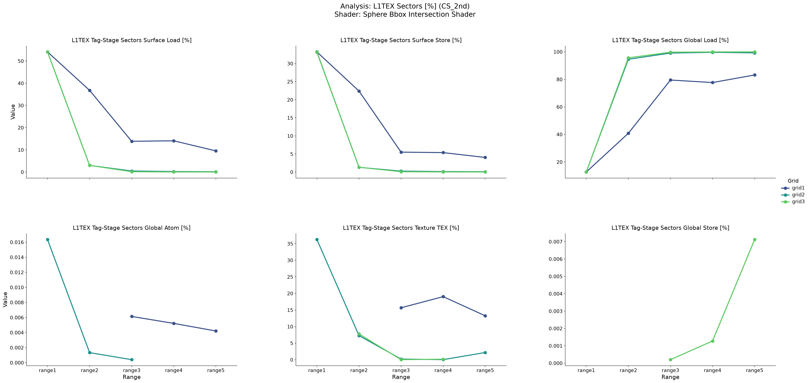

_Caption (Fig. 156): Charts showing L1Tex Sectors for the Sphere Bbox Intersection Shader across compact grid scenes grid1–grid3 The x-axis represents the camera range (distance from the scene), and the y-axis represents the value. Each chart has its own scale (mentioned in the title). Each line corresponds to a different grid (grid1, grid2, …)._

It is possible to see more charts than for the Extraction Shader in [Figure 156](#fig-156). L1TEX Tag-Stage Sectors Surface Load [%] has values due to reading the initial value of the depth for each pixel from the depth buffer's assoiciated texture, so at the beggining of the shader, each thread makes exactly one load from this texture. L1TEX Tag-Stage Sectors Surface Store [%] was sure to have results since this shader has to write over the framebuffer's associated texture, and it was also expected the shown behaviour, since this shader always makes the same amount of accesses to the texture: once per pixel, but not always the same amount of global reads, and that is why L1TEX Tag-Stage Sectors Global Load [%] increases with range, since more entities are being read so cache becomes more efficient for this kind of memory access. L1TEX Tag-Stage Sectors Texture TEX [%] is linked to Surface Store and Load, reason to its values.

##### Cylinder Bbox Extraction Shader

**Fig. 157**
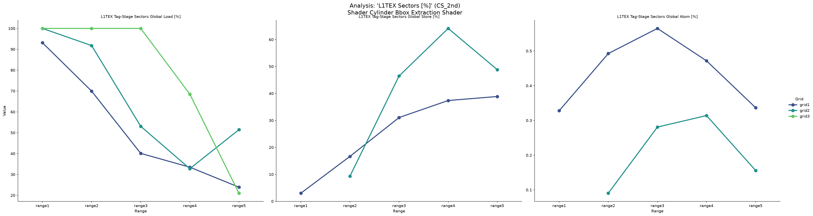

_Caption (Fig. 157): Charts showing L1Tex Sectors for the Cylinder Bbox Extraction Shader across compact grid scenes grid1–grid3 The x-axis represents the camera range (distance from the scene), and the y-axis represents the value. Each chart has its own scale (mentioned in the title). Each line corresponds to a different grid (grid1, grid2, …)._

Results are similar to those of spheres, but with a more pronounced persistence in the values of Global Load, maybe due to lower values of cylinders for grid2 and 3. See [Figure 157](#fig-157).

##### Cylinder Bbox Intersection Shader

**Fig. 158**
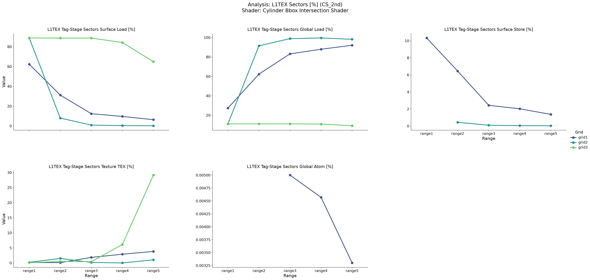

_Caption (Fig. 158): Charts showing L1Tex Sectors for the Cylinder Bbox Intersection Shader across compact grid scenes grid1–grid3 The x-axis represents the camera range (distance from the scene), and the y-axis represents the value. Each chart has its own scale (mentioned in the title). Each line corresponds to a different grid (grid1, grid2, …)._

In this case L1TEX Tag-Stage Sectors Surface Load [%] also shows some important values, specifically for grid3. This is because of the same reason as spheres but maybe the distribution of cylinders in the scene makes them hard to be projected on pixels of the screen, and that's why L1TEX Tag-Stage Sectors Global Load [%] are higher in farther ranges, similar to L1TEX Tag-Stage Sectors Texture TEX [%] related to writing in the frambuffer's texture. See [Figure 158](#fig-158).

##### Unit Throughputs

##### Sphere Bbox Extraction Shader

**Fig. 159**
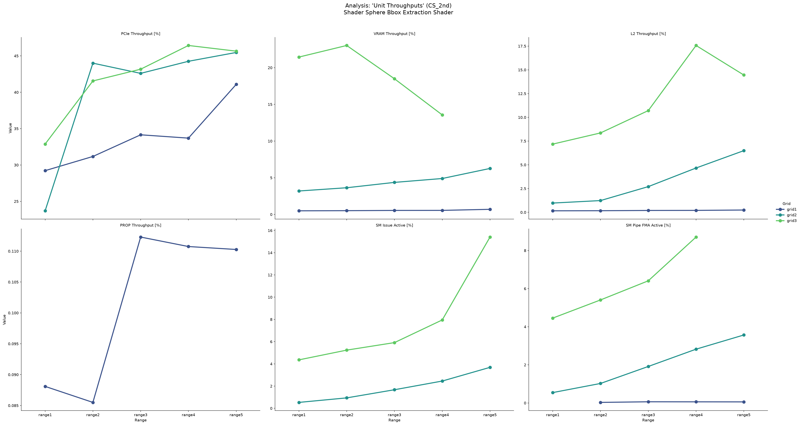

_Caption (Fig. 159): Charts showing Unit Throughputs for the Sphere Bbox Extraction Shader across compact grid scenes grid1–grid3 The x-axis represents the camera range (distance from the scene), and the y-axis represents the value. Each chart has its own scale (mentioned in the title). Each line corresponds to a different grid (grid1, grid2, …)._

SM Issue Active seem to grow over ranges, and it is expected since less entities are culled, so more of them are processed and that requires more instructions. Same reason to why L2 Throughput [%] also grow; less entities to cull means less divergence and more ordered memory accesses. VRAM Throughput [%] should be more or less constant, as seen for grid1 and grid2, but grid3 had a small drop from range2 to range 4. PCIe Throughput [%] is high maybe due to asynchronous data movement from last frame. See [Figure 159](#fig-159).

##### Sphere Bbox Intersection Shader

**Fig. 160**
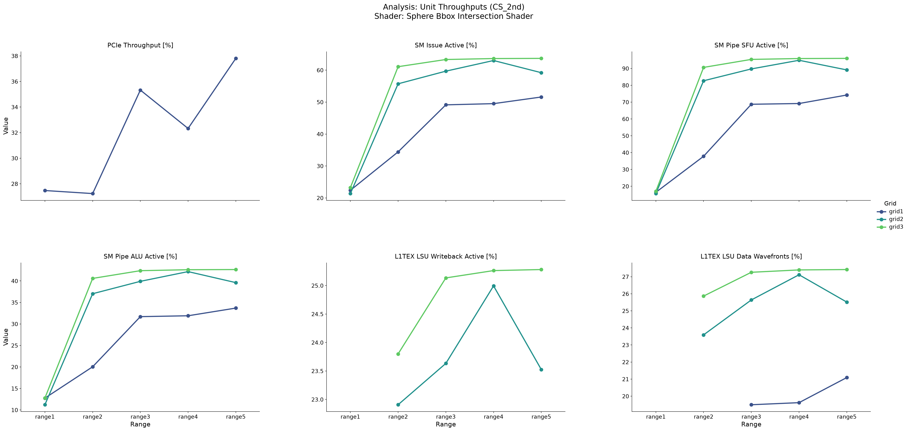

_Caption (Fig. 160): Charts showing Unit Throughputs for the Sphere Bbox Intersection Shader across compact grid scenes grid1–grid3 The x-axis represents the camera range (distance from the scene), and the y-axis represents the value. Each chart has its own scale (mentioned in the title). Each line corresponds to a different grid (grid1, grid2, …)._

SM Issue Active [%], SM Pipe SFU Active [%] and SM Pipe ALU Active [%] have really high percentages in most cases, and L1TEX LSU Writeback Active [%] and L1TEX LSU Data Wavefront [%] still reach over 20%. All of those are excesive value, in part due to heavy work related to sphere rasterization and the other part because of excesive amount of work in farther ranges. SFU Active means that too many heavy float functions are used, and that is aligned to operations related to getting the bounding box and ray casting of spheres, similar to ALU Active. High percentage of Issue Active only reinforces the idea of too many instructions issued. It is necessary to simplify the sphere related operations and the amount of work per thread. See [Figure 160](#fig-160).

##### Cylinder Bbox Extraction Shader

**Fig. 161**
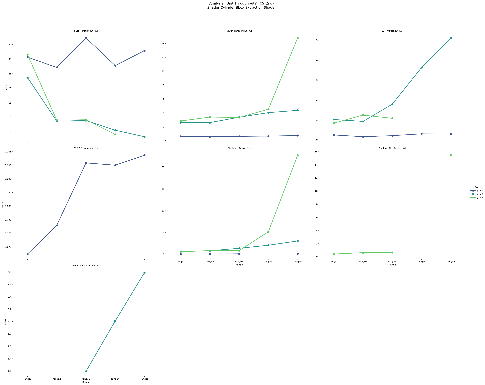

_Caption (Fig. 161): Charts showing Unit Throughputs for the Cylinder Bbox Extraction Shader across compact grid scenes grid1–grid3 The x-axis represents the camera range (distance from the scene), and the y-axis represents the value. Each chart has its own scale (mentioned in the title). Each line corresponds to a different grid (grid1, grid2, …)._

Charts show similar results to spheres except for PCIe Throughput [%], but still with high values (no data movement from previous data movements). See [Figure 161](#fig-161).

##### Cylinder Bbox Intersection Shader

**Fig. 162**
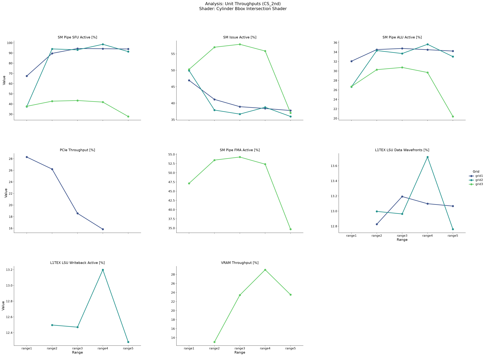

_Caption (Fig. 162): Charts showing Unit Throughputs for the Cylinder Bbox Intersection Shader across compact grid scenes grid1–grid3 The x-axis represents the camera range (distance from the scene), and the y-axis represents the value. Each chart has its own scale (mentioned in the title). Each line corresponds to a different grid (grid1, grid2, …)._

SM Pipe SFU Active [%] has even higher values than for spheres, stangely except in grid3, where it goes to around 40%. SM Issue Active [%] takes values around 40%. SM Pipe ALU Active [%] also has lower values for grid3 than the other grids, but over 26% in almost every case. Grid3 also is the only one that shows high values in SM Pipe FMA Active [%] and VRAM Throughput [%]. Surprising enough, values weren't much higher than for spheres, but it can be seen that more units were needed in this shader, and some of them with excesive throughput. Just as with spheres Intersection Shader, work must be reduced for every thread, and if possible optimize cylinder's rasterization related operations. See [Figure 162](#fig-162).

##### SM Warp Occupancy [Warps Per Cycle]

##### Sphere Bbox Extraction Shader

**Fig. 163**
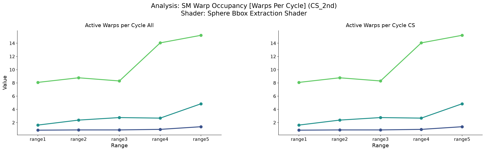

_Caption (Fig. 163): Charts showing SM Warp Occupancy (Warps per cycle) for the Sphere Bbox Extraction Shader across compact grid scenes grid1–grid3 The x-axis represents the camera range (distance from the scene), and the y-axis represents the value. Each chart has its own scale (mentioned in the title). Each line corresponds to a different grid (grid1, grid2, …)._

Not much results but the expected: more warps are used for bigger scenes, and all of the used for Compute Shaders. See [Figure 163](#fig-163).

##### Sphere Bbox Intersection Shader

**Fig. 164**
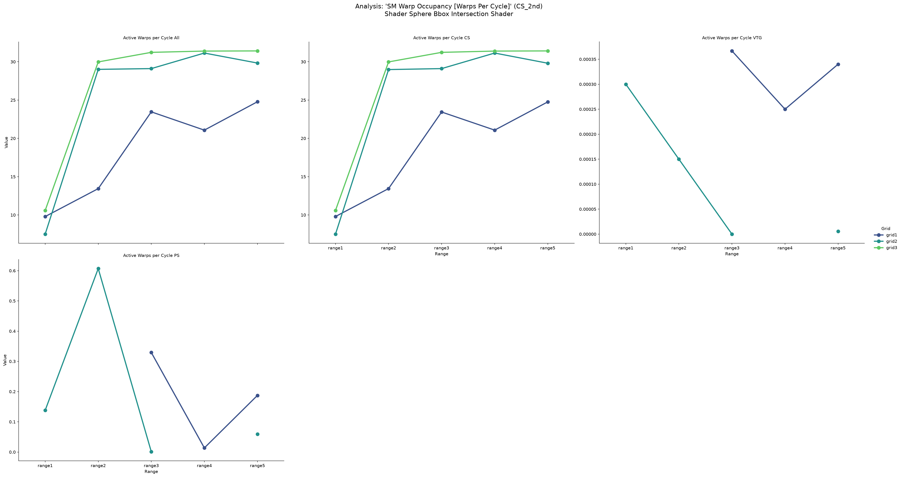

_Caption (Fig. 164): Charts showing SM Warp Occupancy (Warps per cycle) for the Sphere Bbox Intersection Shader across compact grid scenes grid1–grid3 The x-axis represents the camera range (distance from the scene), and the y-axis represents the value. Each chart has its own scale (mentioned in the title). Each line corresponds to a different grid (grid1, grid2, …)._

Similar results as the Extraction Shader can be obtained, but it is worth noting that grid2 needs almost the same amount of warps (32 is the total amount of the machine) than grid3, meaning that some kind of exceding work quota is achieved between grid1 and grid2, for it to require almost every available warp. See [Figure 164](#fig-164).

##### Cylinder Bbox Extraction Shader

**Fig. 165**
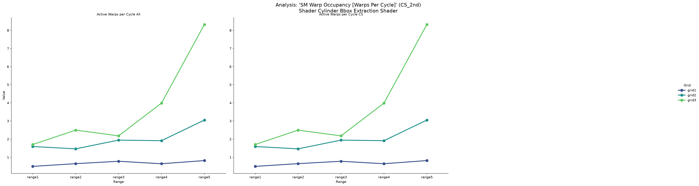

_Caption (Fig. 165): Charts showing SM Warp Occupancy (Warps per cycle) for the Cylinder Bbox Extraction Shader across compact grid scenes grid1–grid3 The x-axis represents the camera range (distance from the scene), and the y-axis represents the value. Each chart has its own scale (mentioned in the title). Each line corresponds to a different grid (grid1, grid2, …)._

Same as Extraction Shader of spheres, see [Figure 165](#fig-165).

##### Cylinder Bbox Intersection Shader

**Fig. 166**
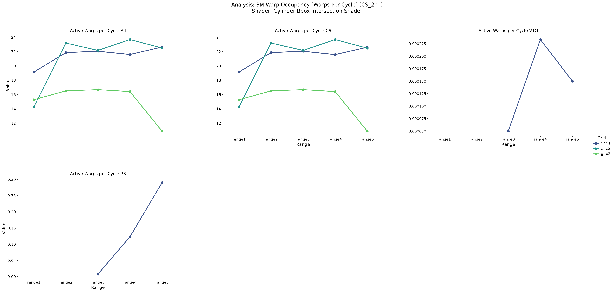

_Caption (Fig. 166): Charts showing SM Warp Occupancy (Warps per cycle) for the Cylinder Bbox Intersection Shader across compact grid scenes grid1–grid3 The x-axis represents the camera range (distance from the scene), and the y-axis represents the value. Each chart has its own scale (mentioned in the title). Each line corresponds to a different grid (grid1, grid2, …)._

In this case a lot of the available warps are used, but not as much as in the Spheres Intersection Shader. This may be due to the reduced amount of entities in comparison to spheres. See [Figure 166](#fig-166).

##### SM Warp Occupancy [\%]

##### Sphere Bbox Extraction Shader

**Fig. 167**
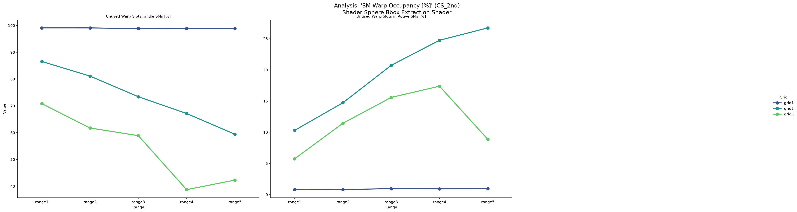

_Caption (Fig. 167): Charts showing SM Warp Occupancy (%) for the Sphere Bbox Extraction Shader across compact grid scenes grid1–grid3 The x-axis represents the camera range (distance from the scene), and the y-axis represents the value. Each chart has its own scale (mentioned in the title). Each line corresponds to a different grid (grid1, grid2, …)._

The charts in [Figure 167](#fig-167) have some interesting behaviour. Unused Warp Slots in Active SMs [%] show that across range, when work increases, unused warps in active SMs also increase, maybe due to shared resources between warps. Unused Warp Slots in Idle SMs has expected results and even if it has high values it shows decreasing percentages across ranges, and even lower values for bigger scenes; it is logical since bigger scenes mean that it needs more resources.

##### Sphere Bbox Intersection Shader

**Fig. 168**
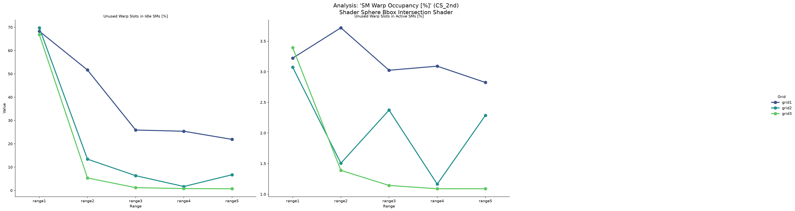

_Caption (Fig. 168): Charts showing SM Warp Occupancy (%) for the Sphere Bbox Intersection Shader across compact grid scenes grid1–grid3 The x-axis represents the camera range (distance from the scene), and the y-axis represents the value. Each chart has its own scale (mentioned in the title). Each line corresponds to a different grid (grid1, grid2, …)._

There is a big difference between this and the last shader, since Unused Warp Slots in Active SMs [%] is almost zero in every case. Unused Warp Slots in Idle SMs [%] has high values only in range1, but it quickly lowers in range2, going from almost 70% for grid2 to a bit over 10% for grid2. This demonstrates the necessity of available resources to execute the shader. See [Figure 168](#fig-168).

##### Cylinder Bbox Extraction Shader

**Fig. 169**
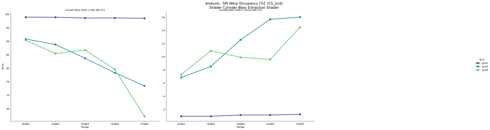

_Caption (Fig. 169): Charts showing SM Warp Occupancy (%) for the Cylinder Bbox Extraction Shader across compact grid scenes grid1–grid3 The x-axis represents the camera range (distance from the scene), and the y-axis represents the value. Each chart has its own scale (mentioned in the title). Each line corresponds to a different grid (grid1, grid2, …)._

Results are similar to Sphere Extraction Shader. See [Figure 169](#fig-169).

##### Cylinder Bbox Intersection Shader

**Fig. 170**
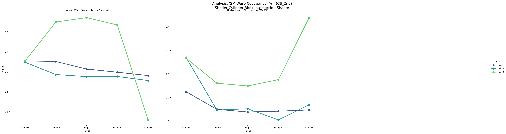

_Caption (Fig. 170): Charts showing SM Warp Occupancy (%) for the Cylinder Bbox Intersection Shader across compact grid scenes grid1–grid3 The x-axis represents the camera range (distance from the scene), and the y-axis represents the value. Each chart has its own scale (mentioned in the title). Each line corresponds to a different grid (grid1, grid2, …)._

For these results it is possible to extract that Unused Warp Slots in Active SMs [%] show mostly constant values with a slight decline around 26%, but grid3 with the highest values around 30%. Unused Warp Slots in Idle SMs [%] show more or less the same, but grid3 rises from 20% in range4 to over 40% in range5. This all could be due to the reduced amount of entities in comparison to spheres, since results are similar but with lower values. See [Figure 170](#fig-170).

##### SM Warp Issue Stalls [\%]

##### Sphere Bbox Extraction Shader

**Fig. 171**
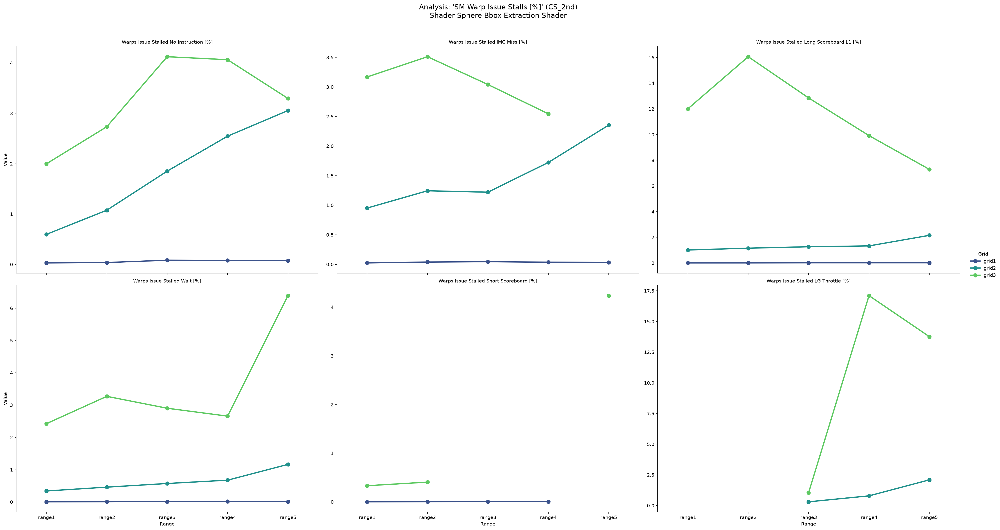

_Caption (Fig. 171): Charts showing SM Warp Issue Stalls for the Sphere Bbox Extraction Shader across compact grid scenes grid1–grid3 The x-axis represents the camera range (distance from the scene), and the y-axis represents the value. Each chart has its own scale (mentioned in the title). Each line corresponds to a different grid (grid1, grid2, …)._

The charts in [Figure 171](#fig-171) have low results all the time, and it is consistent that for any kind of stall the values are higher for bigger scenes.

##### Sphere Bbox Intersection Shader

**Fig. 172**
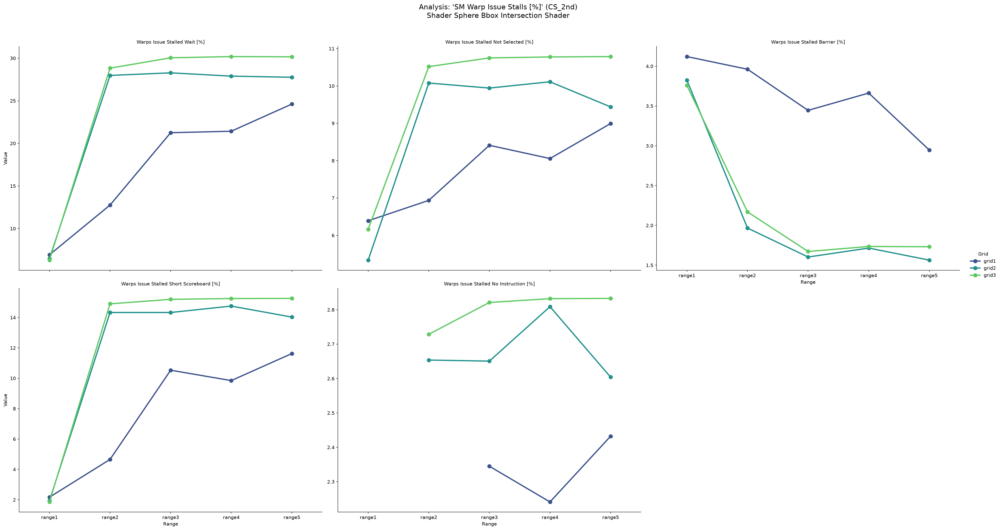

_Caption (Fig. 172): Charts showing SM Warp Issue Stalls for the Sphere Bbox Intersection Shader across compact grid scenes grid1–grid3 The x-axis represents the camera range (distance from the scene), and the y-axis represents the value. Each chart has its own scale (mentioned in the title). Each line corresponds to a different grid (grid1, grid2, …)._

Results of this shader were expected. Warps Issue Stalled Wait [%] has values that reach around 30% for the biggest scene, even if for the other grids it also increases with range. This waiting stalls come from the fact that this shader uses synchronization operations inside a work group for strategically filling a shared memory buffer, and it happens for every batch of spheres that the total of them allows. Warps Issue Stalled Not Selected [%] is a stall produced by the necessity of resources that could be launched, and it also has a slight increase with range, reaching a maximum value of 11% for grid3. Last is Warps Issue Stalled Short Scoreboard [%], which is a stall produced for waiting the special functions unit to process the operations of a group, so there is latency because a group of threads is waiting for the units to be released. The rest of the charts display trivial values. See [Figure 172](#fig-172).

##### Cylinder Bbox Extraction Shader

**Fig. 173**
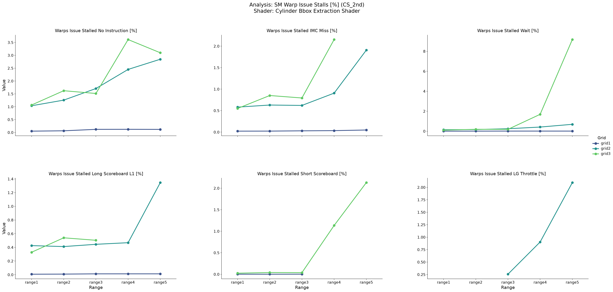

_Caption (Fig. 173): Charts showing SM Warp Issue Stalls for the Cylinder Bbox Extraction Shader across compact grid scenes grid1–grid3 The x-axis represents the camera range (distance from the scene), and the y-axis represents the value. Each chart has its own scale (mentioned in the title). Each line corresponds to a different grid (grid1, grid2, …)._

Similar results as Sphere Extraction Shader. See [Figure 173](#fig-173).

##### Cylinder Bbox Intersection Shader

**Fig. 174**
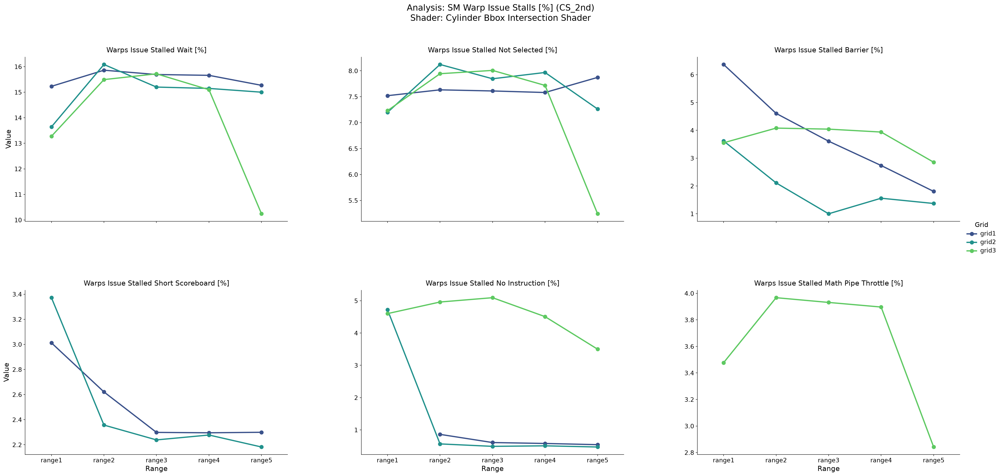

_Caption (Fig. 174): Charts showing SM Warp Issue Stalls for the Cylinder Bbox Intersection Shader across compact grid scenes grid1–grid3 The x-axis represents the camera range (distance from the scene), and the y-axis represents the value. Each chart has its own scale (mentioned in the title). Each line corresponds to a different grid (grid1, grid2, …)._

It is similar to spheres Intersection Shader, but in less charts, maybe due to a less total of entities in each grid. See [Figure 174](#fig-174).

##### Cumulative Warp Latencies [\%]

##### Sphere Bbox Extraction Shader

**Fig. 175**
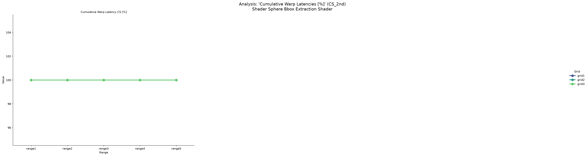

_Caption (Fig. 175): Charts showing Cumulative Warp Latency (%) for the Sphere Bbox Extraction Shader across compact grid scenes grid1–grid3 The x-axis represents the camera range (distance from the scene), and the y-axis represents the value. Each chart has its own scale (mentioned in the title). Each line corresponds to a different grid (grid1, grid2, …)._

No relevant results in [Figure 175](#fig-175).

##### Sphere Bbox Intersection Shader

**Fig. 176**
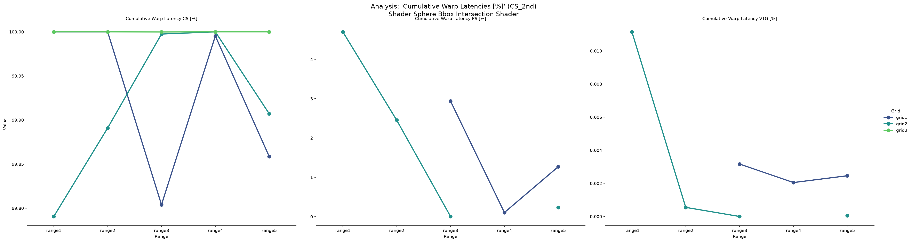

_Caption (Fig. 176): Charts showing Cumulative Warp Latency (%) for the Sphere Bbox Intersection Shader across compact grid scenes grid1–grid3 The x-axis represents the camera range (distance from the scene), and the y-axis represents the value. Each chart has its own scale (mentioned in the title). Each line corresponds to a different grid (grid1, grid2, …)._

No relevant results in [Figure 176](#fig-176).

##### Cylinder Bbox Extraction Shader

**Fig. 177**
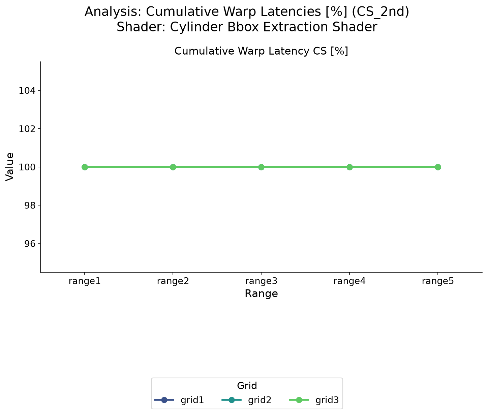

_Caption (Fig. 177): Charts showing Cumulative Warp Latency (%) for the Cylinder Bbox Extraction Shader across compact grid scenes grid1–grid3 The x-axis represents the camera range (distance from the scene), and the y-axis represents the value. Each chart has its own scale (mentioned in the title). Each line corresponds to a different grid (grid1, grid2, …)._

No relevant results in [Figure 177](#fig-177).

##### Cylinder Bbox Intersection Shader

**Fig. 178**
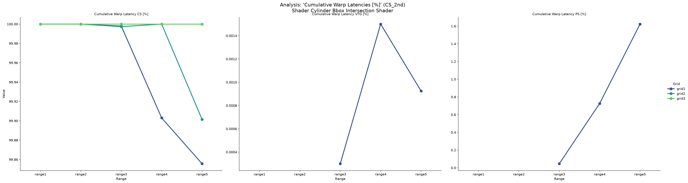

_Caption (Fig. 178): Charts showing Cumulative Warp Latency (%) for the Cylinder Bbox Intersection Shader across compact grid scenes grid1–grid3 The x-axis represents the camera range (distance from the scene), and the y-axis represents the value. Each chart has its own scale (mentioned in the title). Each line corresponds to a different grid (grid1, grid2, …)._

No relevant results in [Figure 178](#fig-178).

##### Cumulative Warp Latencies [Cycles]

##### Sphere Bbox Extraction Shader

**Fig. 179**
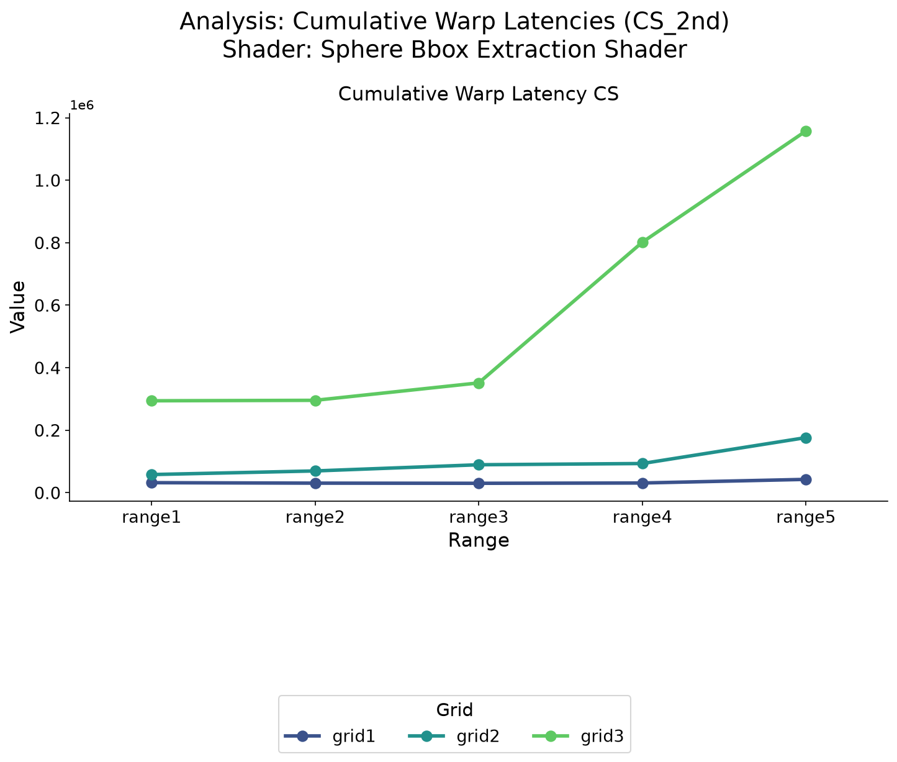

_Caption (Fig. 179): Charts showing Cumulative Warp Latency (cycles) for the Sphere Bbox Extraction Shader across compact grid scenes grid1–grid3 The x-axis represents the camera range (distance from the scene), and the y-axis represents the value. Each chart has its own scale (mentioned in the title). Each line corresponds to a different grid (grid1, grid2, …)._

Results in [Figure 179](#fig-179) show increasing latency cycles across ranges, and even more for bigger grids.

##### Sphere Bbox Intersection Shader

**Fig. 180**
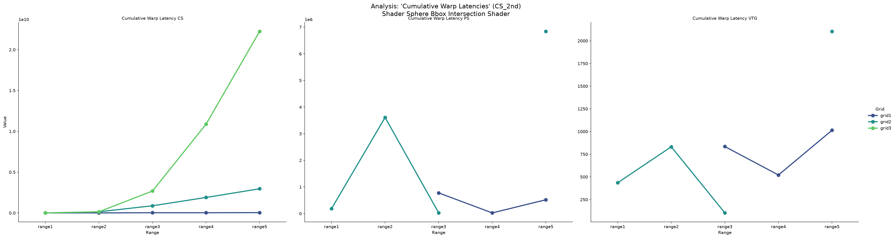

_Caption (Fig. 180): Charts showing Cumulative Warp Latency (cycles) for the Sphere Bbox Intersection Shader across compact grid scenes grid1–grid3 The x-axis represents the camera range (distance from the scene), and the y-axis represents the value. Each chart has its own scale (mentioned in the title). Each line corresponds to a different grid (grid1, grid2, …)._

Results in [Figure 180](#fig-180) have meaning by comparing to the Extraction Shader: this shader shows 4 magnitudes of cycles more, putting in evidence a fight for resources between warps that want to be launched and an excesive amount of work.

##### Cylinder Bbox Extraction Shader

**Fig. 181**
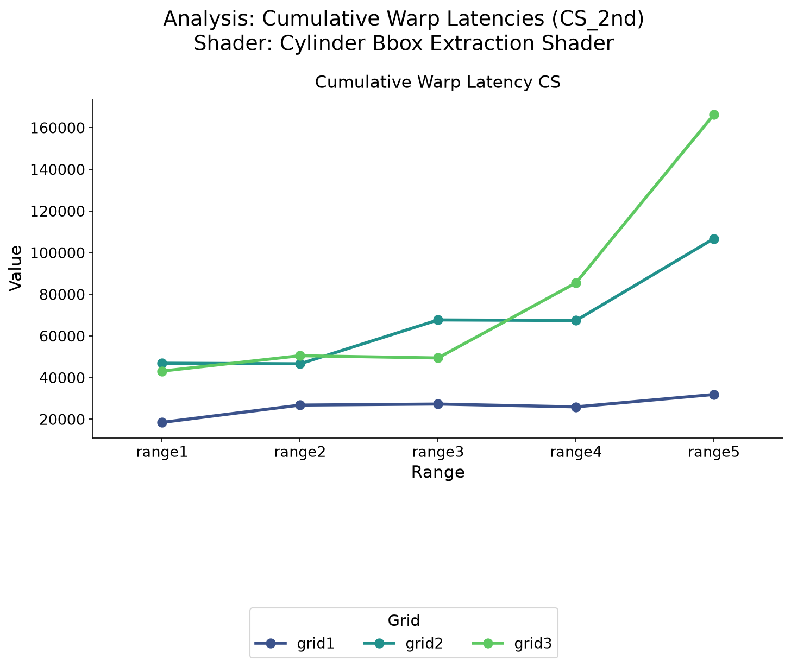

_Caption (Fig. 181): Charts showing Cumulative Warp Latency (cycles) for the Cylinder Bbox Extraction Shader across compact grid scenes grid1–grid3 The x-axis represents the camera range (distance from the scene), and the y-axis represents the value. Each chart has its own scale (mentioned in the title). Each line corresponds to a different grid (grid1, grid2, …)._

Results in [Figure 181](#fig-181) show increasing latency cycles across ranges, and even more for bigger grids.

##### Cylinder Bbox Intersection Shader

**Fig. 182**
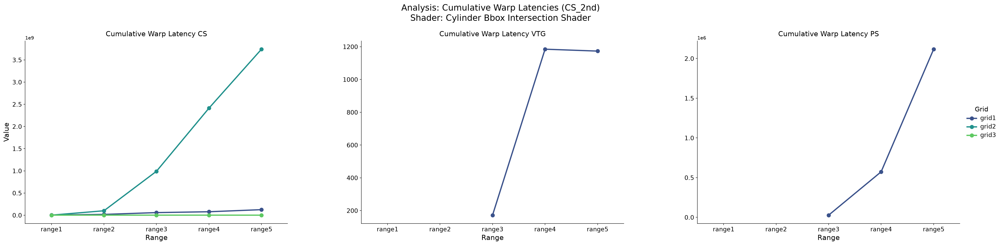

_Caption (Fig. 182): Charts showing Cumulative Warp Latency (cycles) for the Cylinder Bbox Intersection Shader across compact grid scenes grid1–grid3 The x-axis represents the camera range (distance from the scene), and the y-axis represents the value. Each chart has its own scale (mentioned in the title). Each line corresponds to a different grid (grid1, grid2, …)._

Same analysis can be made as for spheres between the Extraction Shader and this shader, see [Figure 182](#fig-182)

##### Active Threads Per Warp

##### Sphere Bbox Extraction Shader

**Fig. 183**
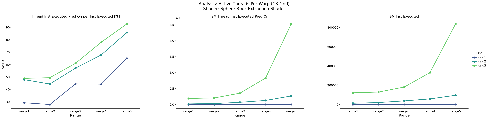

_Caption (Fig. 183): Charts showing Active Threads Per Warp for the Sphere Bbox Extraction Shader across compact grid scenes grid1–grid3 The x-axis represents the camera range (distance from the scene), and the y-axis represents the value. Each chart has its own scale (mentioned in the title). Each line corresponds to a different grid (grid1, grid2, …)._

For this metric in this shader it is possible to see that Thread Inst Executed Pred On per Inst Executed [%] show greater percentages for bigger grids and farther ranges, and that SM Thread Inst Executed Pred On and SM Inst Executed both grow in a similar manner. All of it means that in farther ranges the percentage of per thread instructions executed with pred ON is greater the less entities are culled, confirming that if no entity is discarded every thread does the same. See [Figure 183](#fig-183)

##### Sphere Bbox Intersection Shader

**Fig. 184**
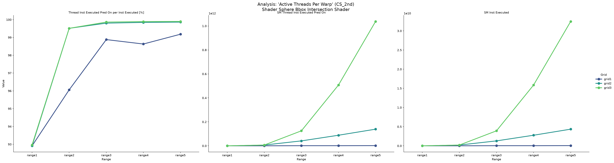

_Caption (Fig. 184): Charts showing Active Threads Per Warp for the Sphere Bbox Intersection Shader across compact grid scenes grid1–grid3 The x-axis represents the camera range (distance from the scene), and the y-axis represents the value. Each chart has its own scale (mentioned in the title). Each line corresponds to a different grid (grid1, grid2, …)._

SM Thread Inst Executed Pred On and SM Inst Executed both demostrate a similar growth just as in the Extraction Shader, but Thread Inst Executed Pred On per Inst Executed [%] shows values close 100%, meaning that instructions in this shader are greatly parallelized. See [Figure 184](#fig-184).

##### Cylinder Bbox Extraction Shader

**Fig. 185**
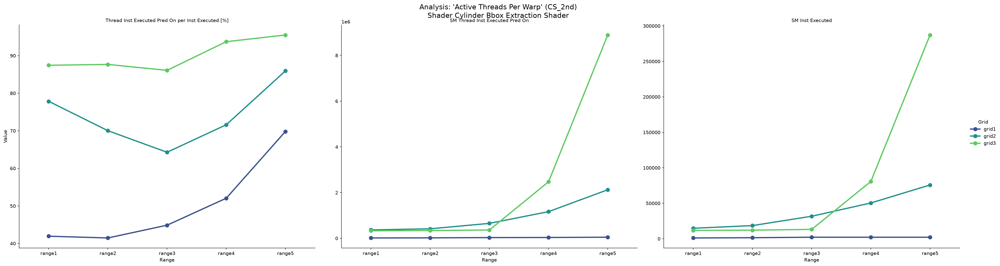

_Caption (Fig. 185): Charts showing Active Threads Per Warp for the Cylinder Bbox Extraction Shader across compact grid scenes grid1–grid3 The x-axis represents the camera range (distance from the scene), and the y-axis represents the value. Each chart has its own scale (mentioned in the title). Each line corresponds to a different grid (grid1, grid2, …)._

Results similar to those in the Extraction Shader of spheres. See [Figure 185](#fig-185).

##### Cylinder Bbox Intersection Shader

**Fig. 186**
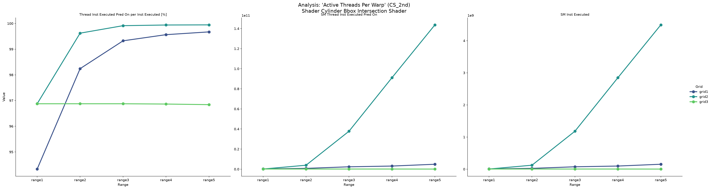

_Caption (Fig. 186): Charts showing Active Threads Per Warp for the Cylinder Bbox Intersection Shader across compact grid scenes grid1–grid3 The x-axis represents the camera range (distance from the scene), and the y-axis represents the value. Each chart has its own scale (mentioned in the title). Each line corresponds to a different grid (grid1, grid2, …)._
Results similar to those in the Intersection Shader of spheres. See [Figure 186](#fig-186).

##### Warp Launch Stalled by Reasons [\%]

##### Sphere Bbox Extraction Shader

**Fig. 187**
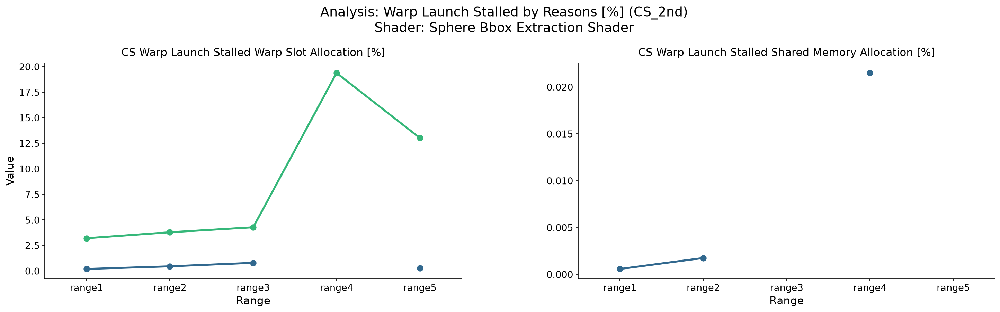

_Caption (Fig. 187): Charts showing Warp Launch Stalled by Reasons for the Sphere Bbox Extraction Shader across compact grid scenes grid1–grid3 The x-axis represents the camera range (distance from the scene), and the y-axis represents the value. Each chart has its own scale (mentioned in the title). Each line corresponds to a different grid (grid1, grid2, …)._

No relevant results in [Figure 187](#fig-187).

##### Sphere Bbox Intersection Shader

**Fig. 188**
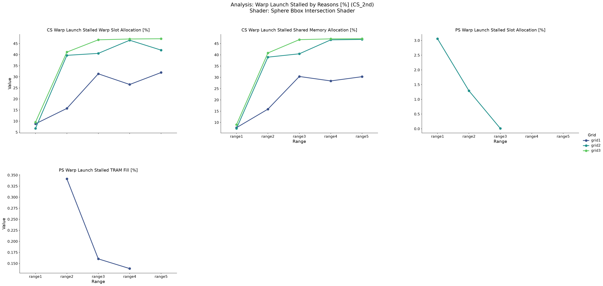

_Caption (Fig. 188): Charts showing Warp Launch Stalled by Reasons for the Sphere Bbox Intersection Shader across compact grid scenes grid1–grid3 The x-axis represents the camera range (distance from the scene), and the y-axis represents the value. Each chart has its own scale (mentioned in the title). Each line corresponds to a different grid (grid1, grid2, …)._

CS Warp Launch Stalled Warp Slot Allocation [%] and CS Warp Launch Stalled Shared Memory Allocation [%] have similar pattern: higher percentages across ranges and for bigger grids. It is expected since this shader needs a lot of resources and takes a lot of time for each work group, so they need to wait to be launched. Same with shared memory; for each batch of spheres to process they need to fill a shared memory buffer, so the more batches there is more it is going to take for shared memory to be released. See [Figure 188](#fig-188).

##### Cylinder Bbox Extraction Shader

**Fig. 189**
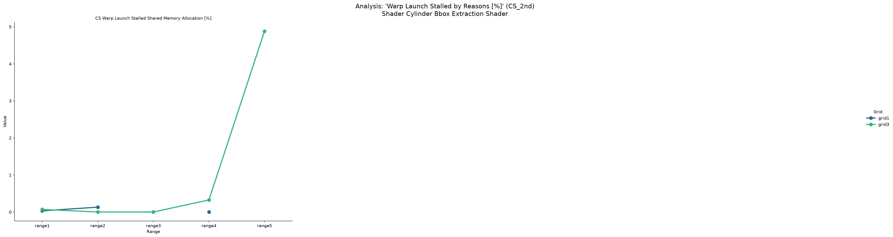

_Caption (Fig. 189): Charts showing Warp Launch Stalled by Reasons for the Cylinder Bbox Extraction Shader across compact grid scenes grid1–grid3 The x-axis represents the camera range (distance from the scene), and the y-axis represents the value. Each chart has its own scale (mentioned in the title). Each line corresponds to a different grid (grid1, grid2, …)._

No relevant results in [Figure 189](#fig-189).

##### Cylinder Bbox Intersection Shader

**Fig. 190**
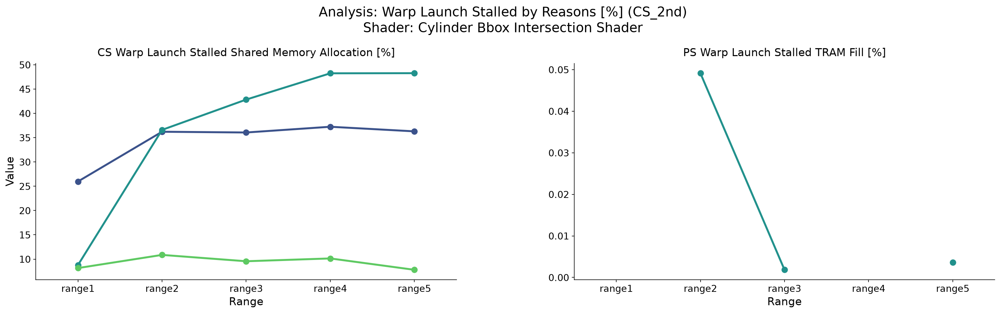

_Caption (Fig. 190): Charts showing Warp Launch Stalled by Reasons for the Cylinder Bbox Intersection Shader across compact grid scenes grid1–grid3 The x-axis represents the camera range (distance from the scene), and the y-axis represents the value. Each chart has its own scale (mentioned in the title). Each line corresponds to a different grid (grid1, grid2, …)._

As a difference to the Intersection Shader of spheres, [Figure 190](#fig-190) only shows relevant values for CS Warp Launch Stalled Shared Memory Allocation [%], for the same reason as for spheres but with less entities.

##### SM Throughputs

##### Sphere Bbox Extraction Shader

**Fig. 191**
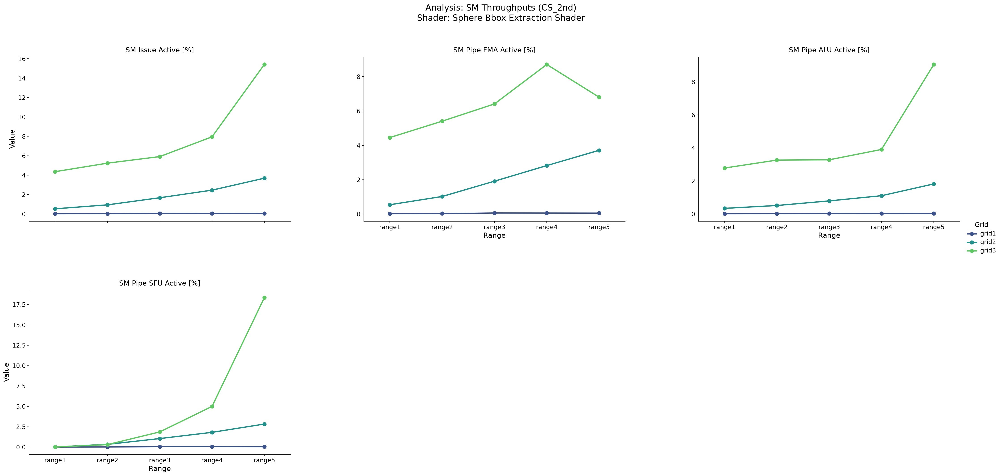

_Caption (Fig. 191): Charts showing SM Throughputs for the Sphere Bbox Extraction Shader across compact grid scenes grid1–grid3 The x-axis represents the camera range (distance from the scene), and the y-axis represents the value. Each chart has its own scale (mentioned in the title). Each line corresponds to a different grid (grid1, grid2, …)._

Charts in [Figure 191](#fig-191) show growth across ranges and with grid size, which is to be expected, particularly for SM Issue Active [%] reflecting the instructions emmited, and for SM Pipe SFU Active [%]

##### Sphere Bbox Intersection Shader

**Fig. 192**
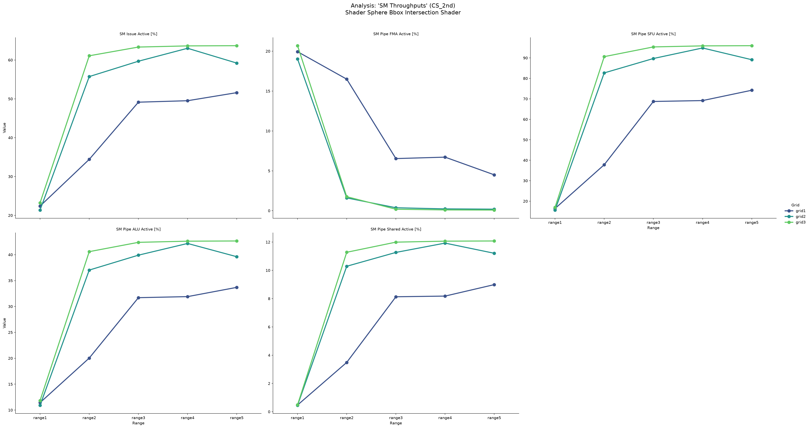

_Caption (Fig. 192): Charts showing SM Throughputs for the Sphere Bbox Intersection Shader across compact grid scenes grid1–grid3 The x-axis represents the camera range (distance from the scene), and the y-axis represents the value. Each chart has its own scale (mentioned in the title). Each line corresponds to a different grid (grid1, grid2, …)._

SM Issue Active [%], SM Pipe ALU Active [%], SM Pipe Shared Active [%] and SM Pipe SFU Active [%], all of those charts have the same kind of growth, Issue Active reaching a maximum of a bit over 60% due to a lot of instructions, SFU Active a bit over 90% due to many heavy repetitive special functions, ALU Active a bit over 40% (same reason as SFU) and shared around 12%. SM Pipe FMA Active [%] starts in range1 with around 20% but then drastically drops to around 0%. See [Figure 192](#fig-192).

##### Cylinder Bbox Extraction Shader

**Fig. 193**
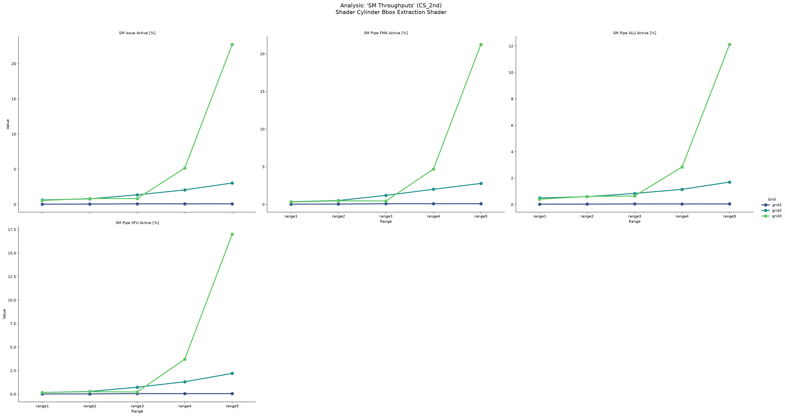

_Caption (Fig. 193): Charts showing SM Throughputs for the Cylinder Bbox Extraction Shader across compact grid scenes grid1–grid3 The x-axis represents the camera range (distance from the scene), and the y-axis represents the value. Each chart has its own scale (mentioned in the title). Each line corresponds to a different grid (grid1, grid2, …)._

Similar results as in the Extraction Shader of sphers, but with lower values in general. See [Figure 193](#fig-193).

##### Cylinder Bbox Intersection Shader

**Fig. 194**
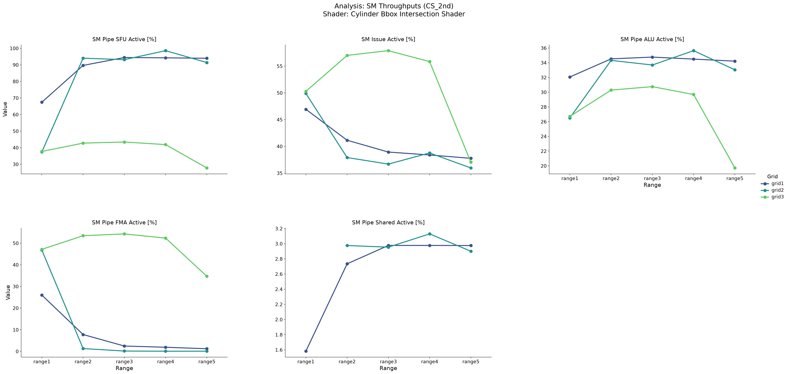

_Caption (Fig. 194): Charts showing SM Throughputs for the Cylinder Bbox Intersection Shader across compact grid scenes grid1–grid3 The x-axis represents the camera range (distance from the scene), and the y-axis represents the value. Each chart has its own scale (mentioned in the title). Each line corresponds to a different grid (grid1, grid2, …)._

SM Pipe SFU Active [%] goes over 90% for grid1 and grid2 in most cases, but only over 30% for grid3, maybe because i proportion less cylinders were actually on screen. Still those values were due to using special float functions (sin, cos, tan atan2, etc). SM Issue Active is between 40-58% in all cases due to emmited instructions. SM Pipe ALU Active [%] and SM Pipe FMA Active [%] have simlar shapes and reasons as SM Pipe SFU Active [%]. See [Figure 193](#fig-193).

##### Performance Per Marked Range

**Fig. 195**
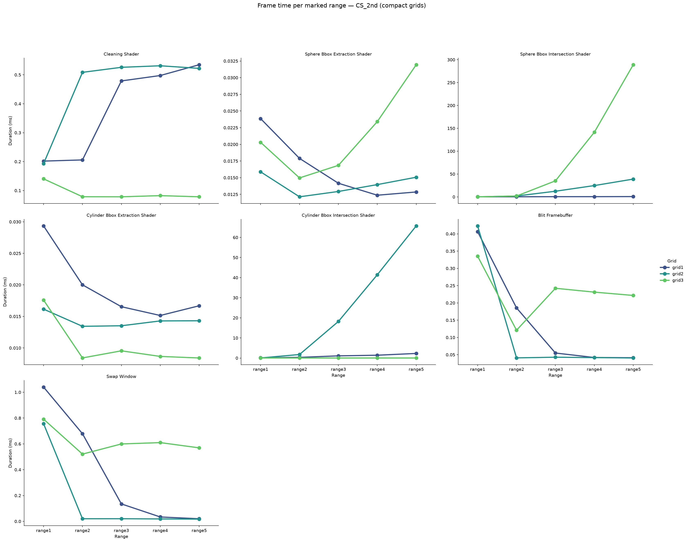

_Caption (Fig. 195): Charts showing frame time per marked range for the second GPGPU version across compact grid scenes grid1–grid3 The x-axis represents the camera range (distance from the scene), and the y-axis represents the value. Each chart has its own scale (mentioned in the title). Each line corresponds to a different grid (grid1, grid2, …)._

There is an enormous difference in performance between the Intersection shaders and the Extraction shader, for both of the geometrical bodies. Extraction shaders are both super efficient, and take only a fraction of a milisecond to complete. Shperes Intersection Shader has an exponential growth over ranges that takes all the possible visual fluidity (300 ms is more or less 3 fps, and a minimum could be of 25 fps). On the other hand the cylinder intersection shader is different in a sense that the maximum is achieved bhy grid2 with 60 ms in range5, and not grid3. This could be because there are much less cylinders than spheres in grid3, so the spatial arrangement made it imposible for it to really project every cylinder on screen even in the farthest range, and it wasn´t as notorious in grid2. But still 60 ms means around 16 fps, which is still a low quantity. See [Figure 195](#fig-195)

#### 3.1.3 Standard pipeline (`standard_version`)

##### Molecular (sparse) scenes

##### GPU Engines Active [\%]

##### Sphere Culling Shader

Engine Active Copy Async [%] showed no clear pattern for molecule size or range, but values stayed between 70-100%. This suggested constant CPU-GPU data movement without interrupting the compute shader. GR Cycles Active [%] appeared to increase with molecule size and range, but it stayed between 40-65%, meaning there was still idle time, probably waiting for data or CPU instruction completion. The load of this shader was very light and its time was negligible. Engine Active Copy Sync [%] was below 1.4%, so sequential copies were not performed.

##### Draw Spheres

GR Cycles Active [%] stayed near 100% at all times, with Engine Active Copy Async [%] also high. This meant the GPU was occupied near its maximum capacity, and any instruction/data movement happened asynchronously without interrupting sphere rendering. Engine Active Copy Sync [%] was below 1.4%, so sequential copies were not performed. See [Fig. 196](#fig-196).

**Fig. 196**
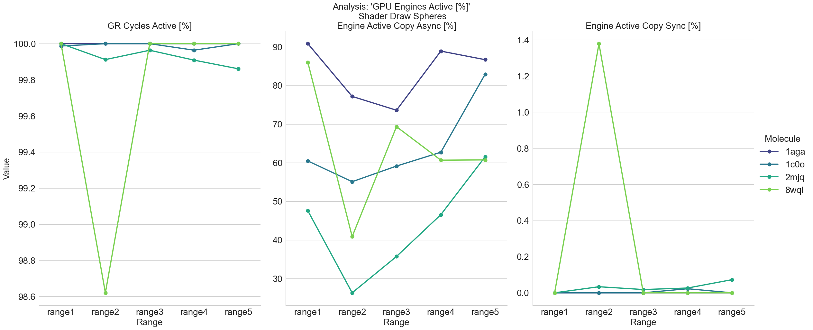

_Caption (Fig. 196): Charts showing GPU Engines Active (%) through different metrics for Draw Spheres across different scenes and camera ranges. The x-axis represents the camera range (distance from the molecule), and the y-axis represents the value. Each chart has its own scale (mentioned in the title). Each line corresponds to a different scene._

##### Cylinder Culling Shader

Engine Active Copy Async [%] varied widely; the smallest molecule showed percentages between 70 and 90%, but the larger molecules were below 20%. GR Cycles Active [%] increased with molecule size and slightly with range, probably because fewer cylinders were removed and divergence decreased. Engine Active Copy Sync [%] was below 2.75%.

##### Draw Cylinders

GR Cycles Active stayed near 100% in all cases, so the GPU handled nearly all of the work. Engine Active Copy Async [%] showed high percentages for the smallest molecules; for the second smallest it was high only at range 5, exceeding 80%, but the larger molecules reached 0% in several cases. Engine Active Copy Sync [%] remained low (below 1%). See [Fig. 197](#fig-197).

**Fig. 197**
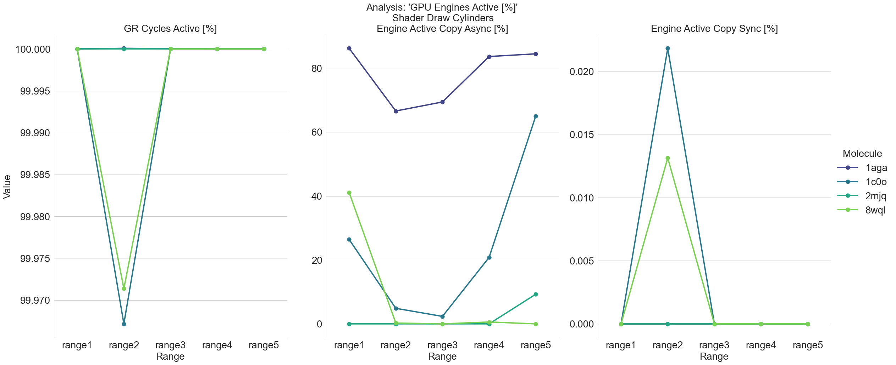

_Caption (Fig. 197): Charts showing GPU Engines Active (%) through different metrics for Draw Cylinders across different scenes and camera ranges. The x-axis represents the camera range (distance from the molecule), and the y-axis represents the value. Each chart has its own scale (mentioned in the title). Each line corresponds to a different scene._

##### GR Cycles Active

- Sphere Culling Shader:

##### Draw Spheres

In [Fig. 198](#fig-198), for GR Cycles Active [cycles] it seems that values increase with molecuyle size, but across ranges it may seem pretty stable. Only 2MJQ presents a steady decline from range 2 to 5. Most of cycles only Engine Active Copy Async has high values, and Engine Active Copy Sync is negligible.

**Fig. 198**
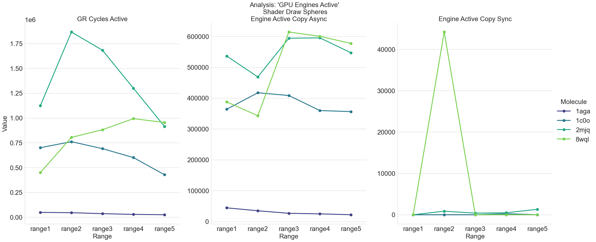

_Caption (Fig. 198): Charts showing GR Cycles Active through different metrics for Draw Spheres across different scenes and camera ranges. The x-axis represents the camera range (distance from the molecule), and the y-axis represents the value. Each chart has its own scale (mentioned in the title). Each line corresponds to a different scene._

- Cylinder Culling Shader:

##### Draw Cylinders

In [Fig. 199](#fig-199) it shows similar results as spheres but with lower values in Engine Active Copy Async.

**Fig. 199**
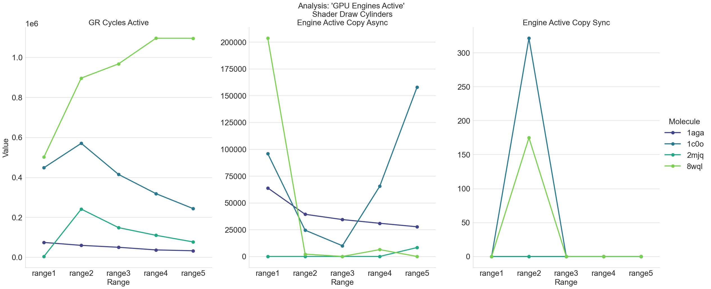

_Caption (Fig. 199): Charts showing GR Cycles Active through different metrics for Draw Cylinders across different scenes and camera ranges. The x-axis represents the camera range (distance from the molecule), and the y-axis represents the value. Each chart has its own scale (mentioned in the title). Each line corresponds to a different scene._

##### Graphics/Compute Idle [\%]

##### Sphere Culling Shader

With each molecule, GR Cycles Idle [%] seemed to decrease, so the work appeared well distributed (no idle parts while others finished). A similar trend appeared as range increased, but it was less noticeable because the work of a non-removed entity was not much larger than that of a removed one.

##### Draw Spheres

The GR Cycles Idle [%] percentage was below 2%, so the GPU worked constantly and the architecture was used to its maximum. See [Fig. 200](#fig-200).

**Fig. 200**
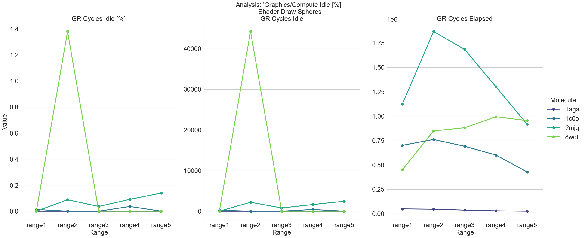

_Caption (Fig. 200): Charts showing Graphics/Compute Idle (%) for Draw Spheres across different scenes and camera ranges. The x-axis represents the camera range (distance from the molecule), and the y-axis represents the value. Each chart has its own scale (mentioned in the title). Each line corresponds to a different scene._

##### Cylinder Culling Shader

It did not appear to depend on molecule size, but the GR Cycles Idle [%] percentage decreased with range. Even so, the percentages were quite high (above 40%) in all cases, likely because the workload was light.

##### Draw Cylinders

Similar to spheres, the GR Cycles Idle [%] percentage was below 1%. GPU occupancy was maximized. See [Fig. 201](#fig-201).

**Fig. 201**
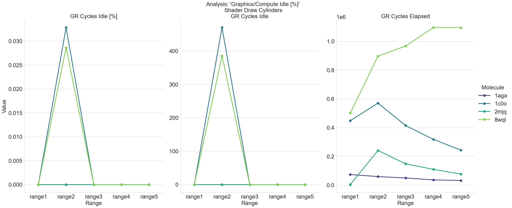

_Caption (Fig. 201): Charts showing Graphics/Compute Idle (%) for Draw Cylinders across different scenes and camera ranges. The x-axis represents the camera range (distance from the molecule), and the y-axis represents the value. Each chart has its own scale (mentioned in the title). Each line corresponds to a different scene._

##### L1TEX L2 Hit Rates

##### Sphere Culling Shader

L1TEX Hit Rate [%] was high, between 40-55% at all times for all molecules and ranges, because access to entities was ordered: thread 0 -> sphere 0, thread 1 -> sphere 1.

##### Draw Spheres

In this case L1TEX Hit Rate [%] values were also high (40-55%). This was likely because the GPU internally and efficiently managed shared variables and primitives between shaders, and the only buffer access was in the vertex shader, similar to the culling shader. See [Fig. 202](#fig-202).

**Fig. 202**
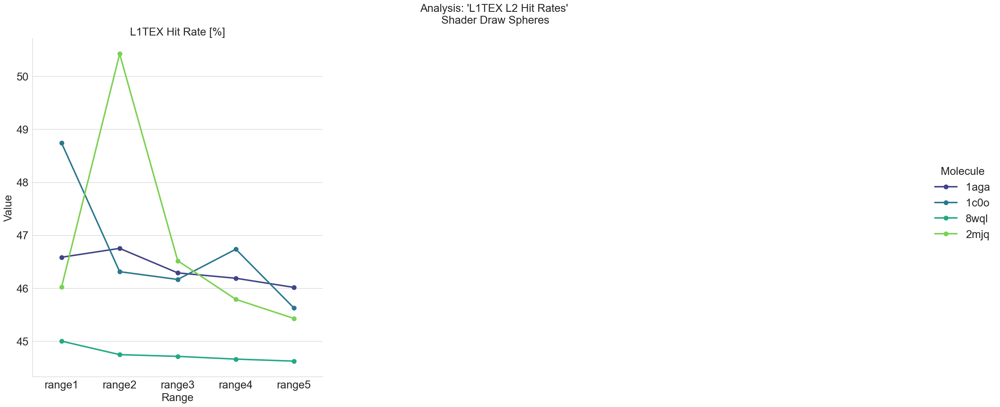

_Caption (Fig. 202): Charts showing L2 Hit Rates (%) for Draw Spheres across different scenes and camera ranges. The x-axis represents the camera range (distance from the molecule), and the y-axis represents the value. Each chart has its own scale (mentioned in the title). Each line corresponds to a different scene._

##### Cylinder Culling Shader

Similar to the spheres.

##### Draw Cylinders

Similar to the spheres. See [Fig. 203](#fig-203).

**Fig. 203**
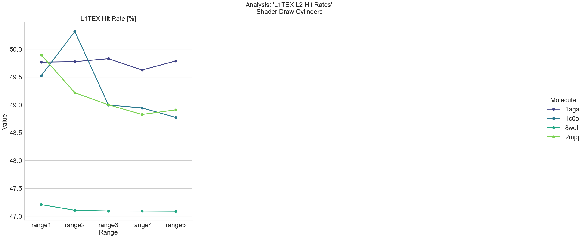

_Caption (Fig. 203): Charts showing L2 Hit Rates (%) for Draw Cylinders across different scenes and camera ranges. The x-axis represents the camera range (distance from the molecule), and the y-axis represents the value. Each chart has its own scale (mentioned in the title). Each line corresponds to a different scene._

##### L1Tex Miss Sectors

##### Sphere Culling Shader

Range and molecule size improved L1TEX Tag-Stage Miss Sectors Global Load [%], since the percentage decreased as they grew. The largest molecule reached around 33% at the largest range, while all molecules at the smallest range were around 46%. L1TEX Tag-Stage Miss Sectors Global Atomic [%] was low (below 5% in all cases), but it increased with range because fewer spheres were removed and the counter increased through atomic operations. L1TEX Tag-Stage Miss Sectors Global Loadstore [%] also increased with range, although not necessarily with molecule size. This was expected because at larger ranges fewer spheres were removed, so more visible-sphere indices had to be stored.

##### Draw Spheres

Unlike before, range negatively affected L1TEX Tag-Stage Miss Sectors Global Load [%]. This was due to random access patterns when reading a sphere index from one buffer and then fetching the sphere from another buffer. Values were between 50-56%; however, there were few accesses, so performance was not significantly affected. See [Fig. 204](#fig-204).

**Fig. 204**
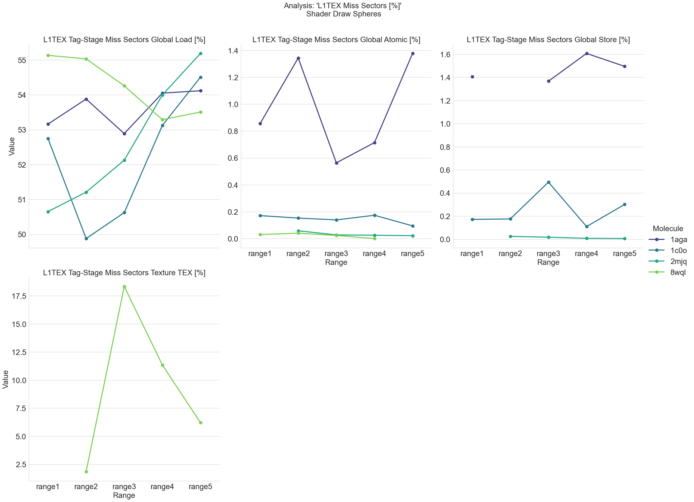

_Caption (Fig. 204): Charts showing L1 Miss Sectors for Draw Spheres across different scenes and camera ranges. The x-axis represents the camera range (distance from the molecule), and the y-axis represents the value. Each chart has its own scale (mentioned in the title). Each line corresponds to a different scene._

##### Cylinder Culling Shader

Similar behavior to spheres.

##### Draw Cylinders

Similar to spheres, but the miss percentage increased with molecule size, reaching just over 50% in the largest molecules. See [Fig. 205](#fig-205).

**Fig. 205**
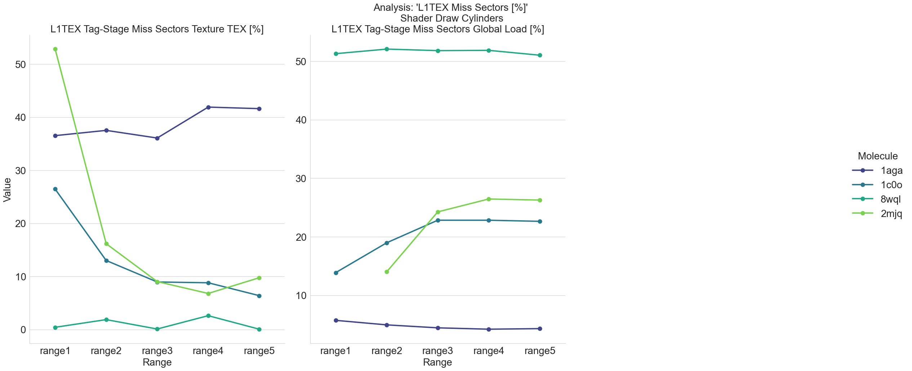

_Caption (Fig. 205): Charts showing L1 Miss Sectors for Draw Cylinders across different scenes and camera ranges. The x-axis represents the camera range (distance from the molecule), and the y-axis represents the value. Each chart has its own scale (mentioned in the title). Each line corresponds to a different scene._

##### L1TEX Sectors [\%]

##### Sphere Culling Shader

L1TEX Tag-Stage Sectors Global Load [%] had a high percentage because this shader was dominated by reads (always performed) of the entity corresponding to each thread, whereas atomic operations (L1TEX Tag-Stage Sectors Global Atomic [%]) and buffer stores (L1TEX Tag-Stage Sectors Global Store [%]) occurred only when the entity was not removed, i.e., when range increased (which is why those increased with range and Global Load decreased).

##### Draw Spheres

Since no atomic operations were used in the sphere drawing pipeline and no direct global-buffer stores were performed, L1TEX Tag-Stage Sectors Global Load [%] in the vertex shader dominated for fetching the sphere. Depth and framebuffer writes were handled by the blending units of the graphics hardware, and atomic operations were replaced by depth tests in the ROP (Raster Operations) unit, which had dedicated hardware and cache (Z-Cull, Z-Compression). See [Fig. 206](#fig-206).

**Fig. 206**
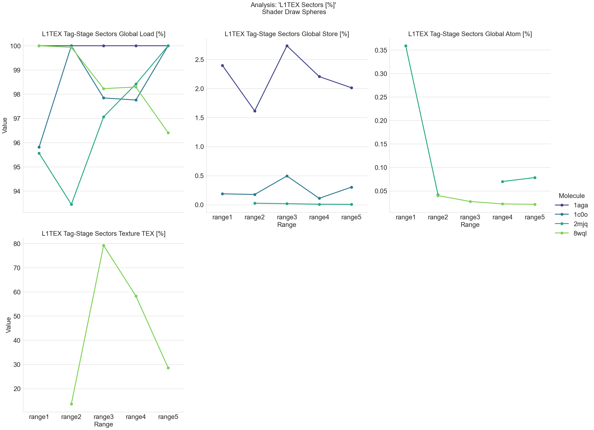

_Caption (Fig. 206): Charts showing L1TEX Sectors (%) for Draw Spheres across different scenes and camera ranges. The x-axis represents the camera range (distance from the molecule), and the y-axis represents the value. Each chart has its own scale (mentioned in the title). Each line corresponds to a different scene._

##### Cylinder Culling Shader

Similar to spheres.

##### Draw Cylinders

Similar to spheres. See [Fig. 207](#fig-207).

**Fig. 207**
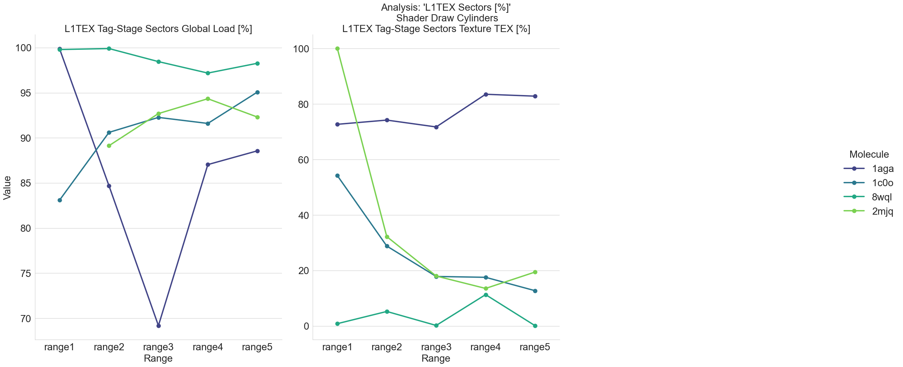

_Caption (Fig. 207): Charts showing L1TEX Sectors (%) for Draw Cylinders across different scenes and camera ranges. The x-axis represents the camera range (distance from the molecule), and the y-axis represents the value. Each chart has its own scale (mentioned in the title). Each line corresponds to a different scene._

##### Unit Throughputs

##### Sphere Culling Shader

PCIe Throughput [%] had high percentages between 26-43%, although it did not appear related to range or molecule size. VRAM Throughput [%] increased with molecule size, which made sense because larger buffers meant more entities to read (around 1% for the smallest molecule, up to 22% for the largest at the largest range). L2 Throughput [%] was always below 2%, similar to SM Issue Active [%], L1TEX LSU Data Wavefronts [%], and PROP Throughput [%].

##### Draw Spheres

PROP Throughput [%] appeared to decrease with range, with values around 50% at close ranges and about 25% at far ranges. This could be because closer ranges had more bodies near edges and larger bodies that needed clipping, creating new primitives. The geometry shader is also known to be a bottleneck. At far ranges all primitives were small and fit on screen without clipping. ZROP appeared to increase with molecule size, likely due to the number of entities requiring depth tests and overlapping sphere fragments. Values reached 28% in the largest molecule. RASTER Throughput produced results only for the largest molecule, with values between 30-40%, higher at intermediate ranges; this could be because there was a middle point where molecules were large enough to generate many pixels and enough of them to load the rasterizer. PCIe Throughput [%] also had values above 20% in general, which suggested instruction/data exchange between CPU and GPU that should be monitored. SM Issue Active [%] showed results for two molecules, at around 20% usage, indicating the GPU was underutilized, probably waiting for other units to finish. In summary, the pipeline could have been limited by geometry creation/clipping and data transfer. See [Fig. 208](#fig-208).

##### Cylinder Culling Shader

Similar to spheres.

**Fig. 208**
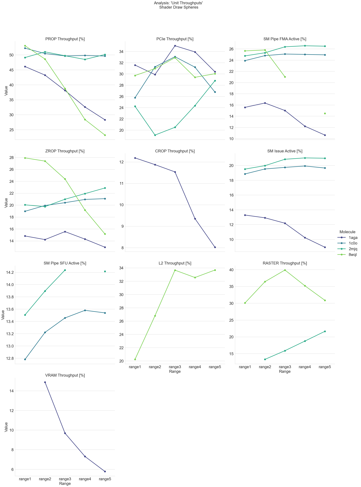

_Caption (Fig. 208): Charts showing Unit Throughputs (%) for Draw Spheres across different scenes and camera ranges. The x-axis represents the camera range (distance from the molecule), and the y-axis represents the value. Each chart has its own scale (mentioned in the title). Each line corresponds to a different scene._

##### Draw Cylinders

PROP Throughput [%] showed the same behavior as spheres, and more efficiently. SM Pipe FMA Active [%] was also high because cylinders required more work than spheres, but it decreased with range (fewer fragments to analyze). The same happened with SM Pipe SFU Active [%]. L2 Throughput [%] appeared for the largest molecule; this was because cylinders were heavier than spheres (roughly double the byte size), so cache capacity started to be exceeded and L2 had to fetch new data. Random access in the vertex shader also disordered accesses and polluted the cache. For ZROP Throughput and RASTER Throughput [%], the behavior was the same as with spheres. See [Fig. 209](#fig-209).

**Fig. 209**
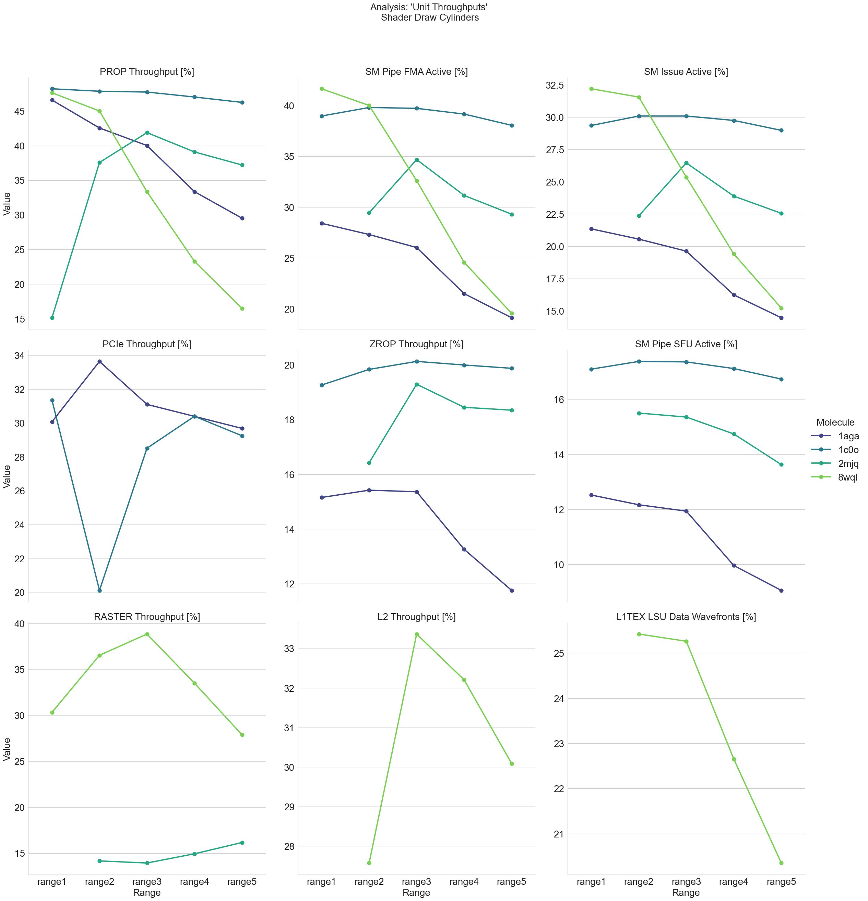

_Caption (Fig. 209): Charts showing Unit Throughputs (%) for Draw Cylinders across different scenes and camera ranges. The x-axis represents the camera range (distance from the molecule), and the y-axis represents the value. Each chart has its own scale (mentioned in the title). Each line corresponds to a different scene._

##### SM Warp Occupancy [Warps Per Cycle]

##### Sphere Culling Shader

Active Warps per Cycle All increased with molecule size, but not with camera range, indicating efficient load balancing in the core. However, the values showed fewer than 7 active warps in all cases, meaning the GPU could accept more work but it was not arriving. Active Warps per Cycle VTG and Active Warps per Cycle PS were low because only compute shaders were used.

##### Draw Spheres

Active Warps per Cycle All increased with molecule size. Range did not appear to affect the number of warps. However, fewer than 5 active warps were observed in all cases, meaning the GPU could accept more work but it was not arriving. Active Warps per Cycle VTG were under 1 in most cases, but increased with both range and molecule size, which was expected because there was more work. Active Warps per Cycle PS showed constant work despite range, with the largest molecules having around 3.5 to 4 active warps in general. See [Fig. 210](#fig-210).

**Fig. 210**
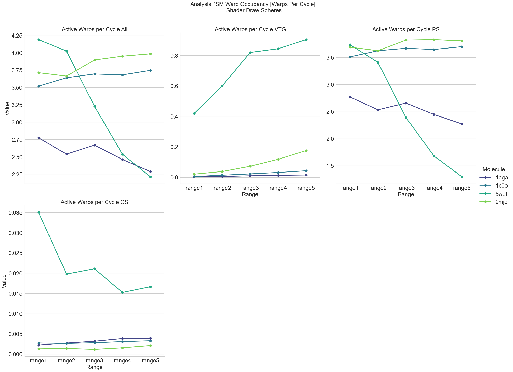

_Caption (Fig. 210): Charts showing SM Warp Occupancy (Warps Per Cycle) for Draw Spheres across different scenes and camera ranges. The x-axis represents the camera range (distance from the molecule), and the y-axis represents the value. Each chart has its own scale (mentioned in the title). Each line corresponds to a different scene._

##### Cylinder Culling Shader

Similar to spheres, but required more warps (up to 10 for the largest molecule).

##### Draw Cylinders

Similar to spheres but with more warps overall, reaching up to 6. If VTG increased with range (in large molecules) and PS decreased, the geometry shader might have been slowing the quad preparation. See [Fig. 211](#fig-211).

**Fig. 211**
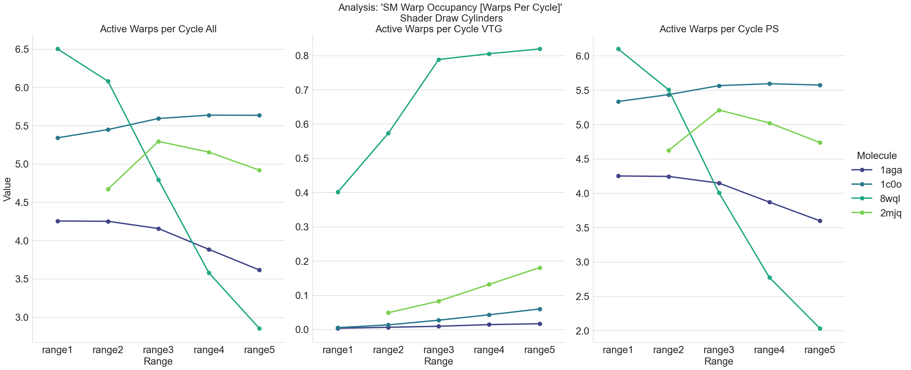

_Caption (Fig. 211): Charts showing SM Warp Occupancy (Warps Per Cycle) for Draw Cylinders across different scenes and camera ranges. The x-axis represents the camera range (distance from the molecule), and the y-axis represents the value. Each chart has its own scale (mentioned in the title). Each line corresponds to a different scene._

##### SM Warp Occupancy [\%]

##### Sphere Culling Shader

Unused Warp Slots in Idle SMs [%] decreased with molecule size but stayed constant across ranges. The smallest molecule was near 99%, the second smallest 97%, the third 92%, and the fourth between 75-87%. Unused Warp Slots in Active SMs [%] increased with molecule size. This could mean the number of active SMs increased before the number of warps within those SMs did.

##### Draw Spheres

Unused Warp Slots in Idle SMs [%] was not strongly affected by range or molecule size; the three largest molecules were between 20 and 30%, similar to Unused Warp Slots in Active SMs [%], where percentages were between 60-70%. This could be because work was not arriving in time, likely due to CPU submission delays (leaving warps and SMs unused), and the unused slots in active SMs could be due to register pressure. The fragment shader remained heavy in registers and computations. See [Fig. 212](#fig-212).

**Fig. 212**
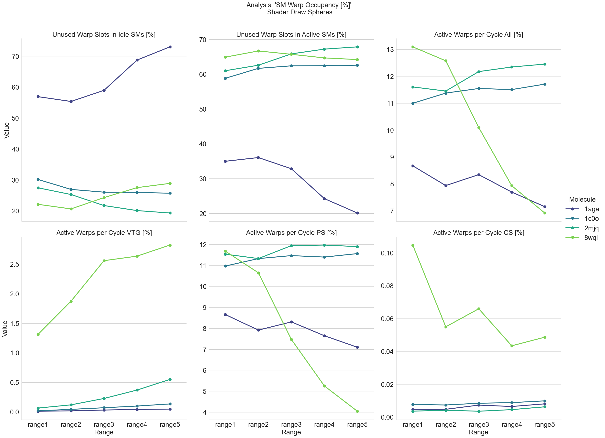

_Caption (Fig. 212): Charts showing SM Warp Occupancy (%) for Draw Spheres across different scenes and camera ranges. The x-axis represents the camera range (distance from the molecule), and the y-axis represents the value. Each chart has its own scale (mentioned in the title). Each line corresponds to a different scene._

##### Cylinder Culling Shader

Similar to spheres.

##### Draw Cylinders

Similar to spheres. See [Fig. 213](#fig-213).

**Fig. 213**
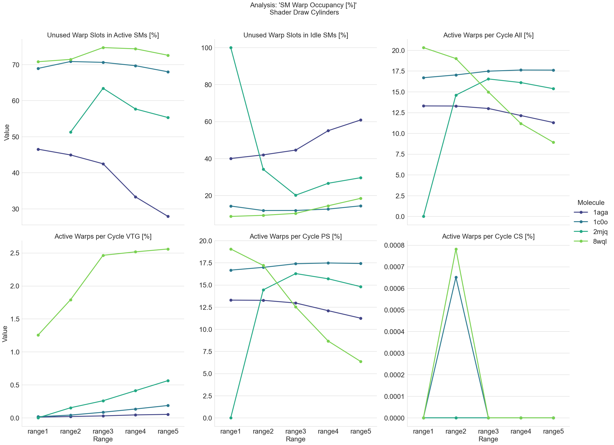

_Caption (Fig. 213): Charts showing SM Warp Occupancy (%) for Draw Cylinders across different scenes and camera ranges. The x-axis represents the camera range (distance from the molecule), and the y-axis represents the value. Each chart has its own scale (mentioned in the title). Each line corresponds to a different scene._

##### SM Warp Issue Stalls [\%]

##### Sphere Culling Shader

This shader was light; for that reason the only unit with a considerable percentage was Warp Issue Stalled Long Scoreboard L1 [%], with values between 10-16% for the largest molecule. As expected, all units increased with molecule size (Warp Issue Stalled No Instruction [%], Warp Issue Stalled IMC Miss [%], Warp Issue Stalled Wait [%], and Warp Issue Stalled Short Scoreboard [%]).

##### Draw Spheres

No notable percentages appeared in any unit; however, the percentages seemed to increase with molecule size and decrease with range. See [Fig. 214](#fig-214).

**Fig. 214**
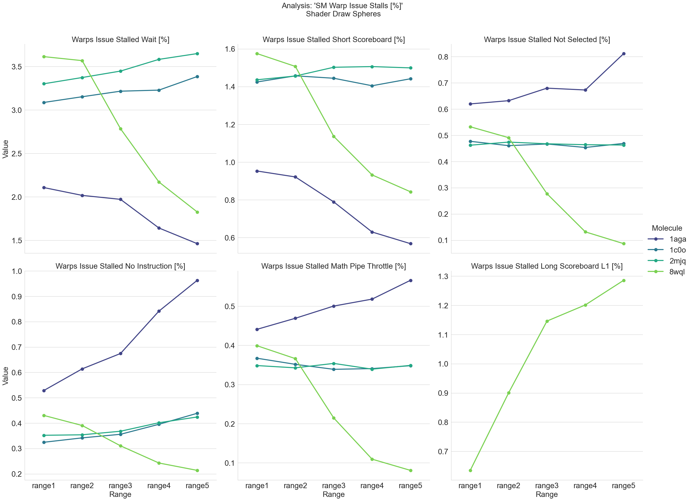

_Caption (Fig. 214): Charts showing SM Warp Issue Stalls (%) for Draw Spheres across different scenes and camera ranges. The x-axis represents the camera range (distance from the molecule), and the y-axis represents the value. Each chart has its own scale (mentioned in the title). Each line corresponds to a different scene._

##### Cylinder Culling Shader

Similar to spheres.

##### Draw Cylinders

Similar to spheres, with values below 5%. See [Fig. 215](#fig-215).

**Fig. 215**
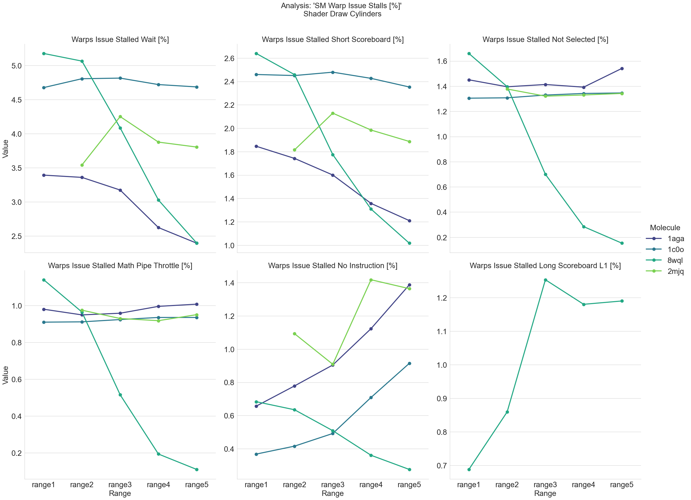

_Caption (Fig. 215): Charts showing SM Warp Issue Stalls (%) for Draw Cylinders across different scenes and camera ranges. The x-axis represents the camera range (distance from the molecule), and the y-axis represents the value. Each chart has its own scale (mentioned in the title). Each line corresponds to a different scene._

##### Cumulative Warp Latencies [\%]

##### Sphere Culling Shader

As a compute shader, the percentages were mainly in Cumulative Warp Latency CS [%].

##### Draw Spheres

Cumulative Warp Latency VTG [%] showed considerable percentages as molecule size increased, and it also increased with range. Cumulative Warp Latency PS [%] showed the highest percentages, reaching close to 100% for smaller molecules, but for the largest molecule it went from 90% at the closest range to 60% at the farthest (and VTG from 10% to 40%). As the camera moved away, the vertex and geometry shaders began to dominate performance because there were more entities and more geometry to generate. See [Fig. 216](#fig-216).

**Fig. 216**
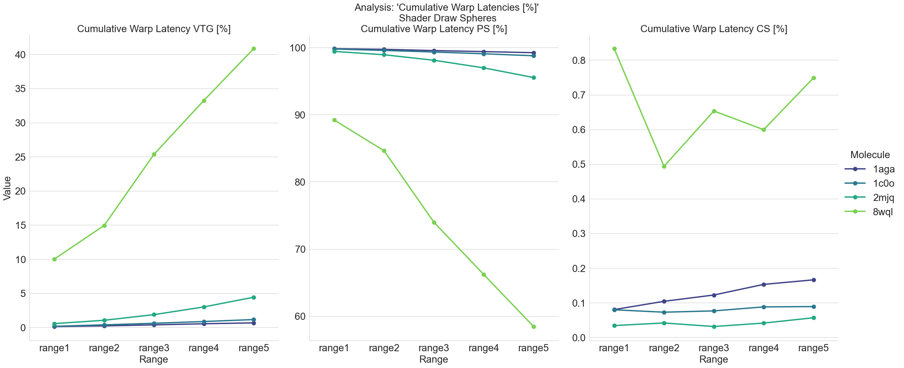

_Caption (Fig. 216): Charts showing Cumulative Warp Latencies (%) for Draw Spheres across different scenes and camera ranges. The x-axis represents the camera range (distance from the molecule), and the y-axis represents the value. Each chart has its own scale (mentioned in the title). Each line corresponds to a different scene._

##### Cylinder Culling Shader

Similar to spheres, although the VTG percentage increased with range for some reason. Even so, CS still dominated.

##### Draw Cylinders

Similar to the sphere behavior. See [Fig. 217](#fig-217).

**Fig. 217**
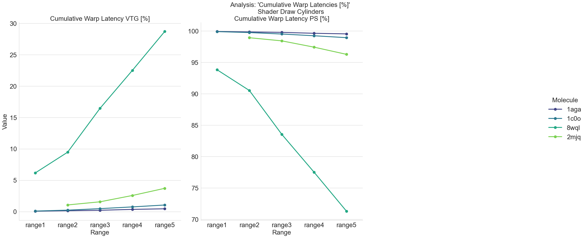

_Caption (Fig. 217): Charts showing Cumulative Warp Latencies (%) for Draw Cylinders across different scenes and camera ranges. The x-axis represents the camera range (distance from the molecule), and the y-axis represents the value. Each chart has its own scale (mentioned in the title). Each line corresponds to a different scene._

##### Cumulative Warp Latencies [Cycles]

##### Sphere Culling Shader

Highest in Cumulative Warp Latency CS, with 2,000,000 cycles in the largest molecule across all ranges. With range, only the VTG cycles increased.

##### Draw Spheres

As in the previous section, VTG increased with molecule size and range. PS did not necessarily behave the same. For example, the largest molecule had fewer PS cycles than the second largest, which suggested spatial arrangement could matter (more spheres close together and overlapping implied more depth discards). See [Fig. 218](#fig-218).

**Fig. 218**
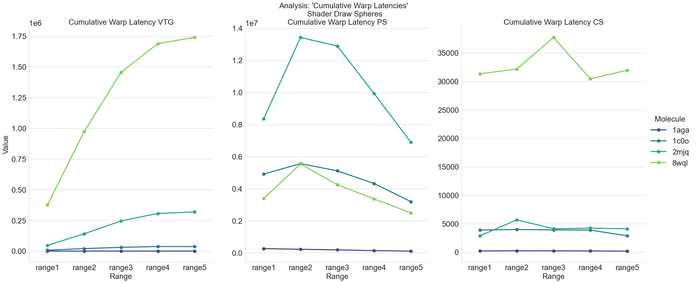

_Caption (Fig. 218): Charts showing Cumulative Warp Latencies (Cycles) for Draw Spheres across different scenes and camera ranges. The x-axis represents the camera range (distance from the molecule), and the y-axis represents the value. Each chart has its own scale (mentioned in the title). Each line corresponds to a different scene._

##### Cylinder Culling Shader

Similar to spheres.

##### Draw Cylinders

Unlike spheres, there was a clear behavior of cycles increasing with molecule size and decreasing with range. See [Fig. 219](#fig-219).

**Fig. 219**
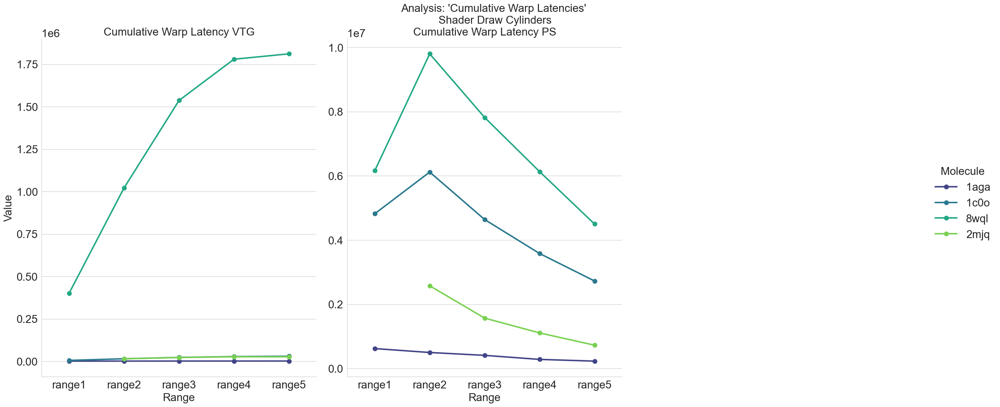

_Caption (Fig. 219): Charts showing Cumulative Warp Latencies (Cycles) for Draw Cylinders across different scenes and camera ranges. The x-axis represents the camera range (distance from the molecule), and the y-axis represents the value. Each chart has its own scale (mentioned in the title). Each line corresponds to a different scene._

##### Active Threads Per Warp

##### Sphere Culling Shader

Thread Inst Executed Pred On per Inst Executed [%] essentially reflected divergence efficiency. In this case, as range increased the percentage increased because fewer entities were removed and more threads entered the conditional path that did not remove spheres (so the percentage was similar across molecules).

##### Draw Spheres

For Thread Inst Executed Pred On per Inst Executed [%], the percentage decreased with molecule size, i.e., divergence increased. The percentage was higher for smaller molecules (95-82%) and lower for the largest molecule (70-64%). The number of cycles to execute this was also very high (SM Thread Inst Executed Pred On was high). See [Fig. 220](#fig-220).

**Fig. 220**
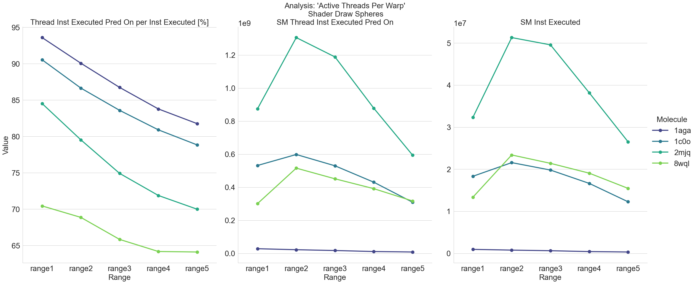

_Caption (Fig. 220): Charts showing Active Threads per Warp for Draw Spheres across different scenes and camera ranges. The x-axis represents the camera range (distance from the molecule), and the y-axis represents the value. Each chart has its own scale (mentioned in the title). Each line corresponds to a different scene._

##### Cylinder Culling Shader

Similar to spheres, but with larger differences between molecules, likely due to the lower number of cylinders compared to spheres.

##### Draw Cylinders

Similar to spheres. See [Fig. 221](#fig-221).

**Fig. 221**
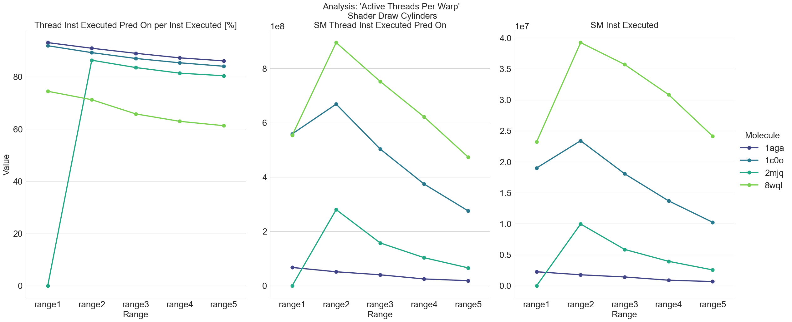

_Caption (Fig. 221): Charts showing Active Threads per Warp for Draw Cylinders across different scenes and camera ranges. The x-axis represents the camera range (distance from the molecule), and the y-axis represents the value. Each chart has its own scale (mentioned in the title). Each line corresponds to a different scene._

##### Shader Pixels Coverage Kill

##### Sphere Culling Shader

Omitted.

##### Draw Spheres

This counted the number of pixels discarded by the fragment shader. Because impostors were used, Early-Z could not be applied, since only the points representing each entity were tested rather than the full body. This forced testing of empty corners of sphere impostor quads and therefore accumulated more discarded pixels. It increased with molecule size and range (more entities in the scene -> more pixels processed by the fragment shader). See [Fig. 222](#fig-222).

**Fig. 222**
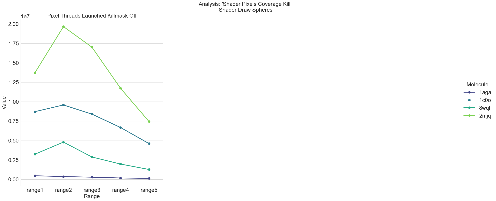

_Caption (Fig. 222): Charts showing Shader Pixels Coverage Kill for Draw Spheres across different scenes and camera ranges. The x-axis represents the camera range (distance from the molecule), and the y-axis represents the value. Each chart has its own scale (mentioned in the title). Each line corresponds to a different scene._

##### Cylinder Culling Shader

Omitted.

##### Draw Cylinders

Similar to spheres, but the quad area for cylinders was tighter, so fewer pixels were discarded. See [Fig. 223](#fig-223).

**Fig. 223**
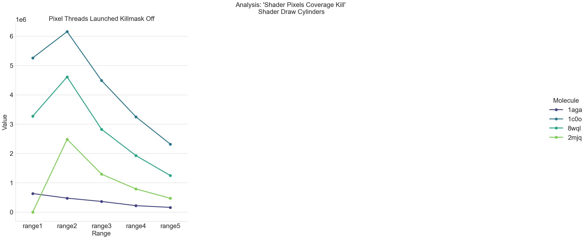

_Caption (Fig. 223): Charts showing Shader Pixels Coverage Kill for Draw Cylinders across different scenes and camera ranges. The x-axis represents the camera range (distance from the molecule), and the y-axis represents the value. Each chart has its own scale (mentioned in the title). Each line corresponds to a different scene._

##### Warp Launch Stalled by Reasons [\%]

##### Sphere Culling Shader

In this case the only stall reason would be finding slots for CS warps; however, CS Warp Launch Stalled Warp Slot Allocation showed low cycle values and decreased as range increased.

##### Draw Spheres

PS Warp Launch Stalled TRAM Fill increased only for the largest molecule, and it did so dramatically between ranges 1 and 4, reaching values above 70%. TRAM is the triangle RAM, the queue between the rasterizer and the pixel shader. The pixel shader (which runs the fragment shader) could not drain TRAM. It increased with range because the number of spheres increased. This showed that the shader was limited by the pixel shader: triangles accumulated and could not be drained in time. VTG Warp Launch Stalled ISBE Allocation (ISBE = Index Stream Buffer Engine, the queue between the geometry shader and the rasterizer) filled for large molecules, and the rasterizer could not keep up with geometry shader vertex generation. It reached about 70%, indicating that 70% of the GPU stall time was due to this, which could be another limiter. PS Warp Launch Stalled OOO Warp Completion appeared when framebuffer writes completed out of order and the GPU had to reorder to decide what to discard and produce a final result. High percentages appeared as molecule size increased (more fragments). PS Warp Launch Stalled Slot Allocation had few cycles, so it was not a limiter. The limiting factors could be geometry overload and overlap; the latter generated many out-of-order framebuffer writes. See [Fig. 224](#fig-224).

**Fig. 224**
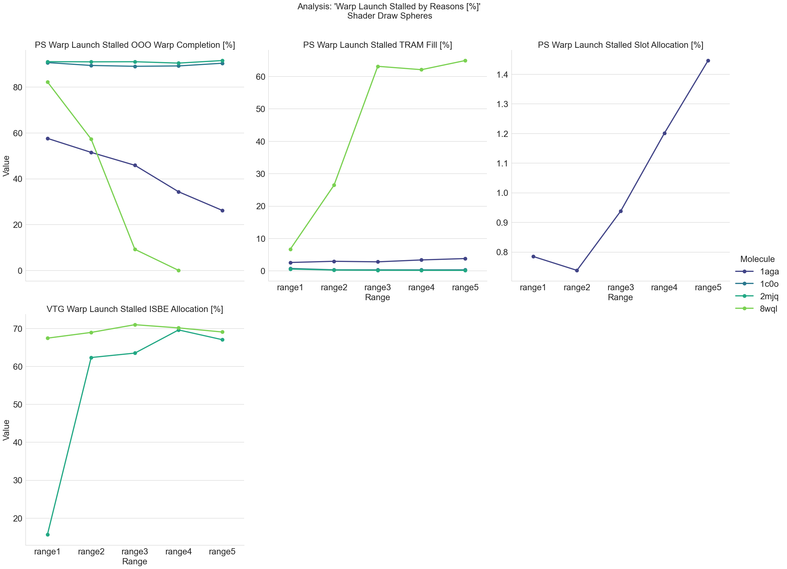

_Caption (Fig. 224): Charts showing Warp Launch Stalled by Reasons (%) for Draw Spheres across different scenes and camera ranges. The x-axis represents the camera range (distance from the molecule), and the y-axis represents the value. Each chart has its own scale (mentioned in the title). Each line corresponds to a different scene._

##### Cylinder Culling Shader

Similar to spheres.

##### Draw Cylinders

Similar to spheres. See [Fig. 225](#fig-225).

**Fig. 225**
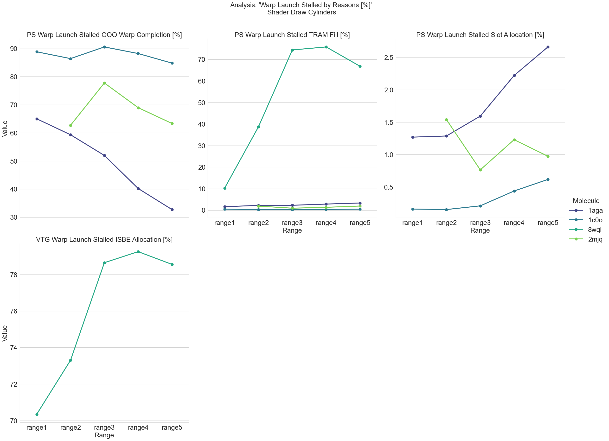

_Caption (Fig. 225): Charts showing Warp Launch Stalled by Reasons (%) for Draw Cylinders across different scenes and camera ranges. The x-axis represents the camera range (distance from the molecule), and the y-axis represents the value. Each chart has its own scale (mentioned in the title). Each line corresponds to a different scene._

##### SM Throughputs

##### Sphere Culling Shader

All units stayed below 6% at any range.

##### Draw Spheres

SM Pipe FMA Active [%] increased with molecule size and range, as did SM Pipe SFU Active [%] and SM Pipe ALU Active [%], but FMA and SFU were the most influential, reaching 26% and 14% respectively, while ALU reached 3%. SM Issue Active [%] reached 20% with the same pattern. This meant the GPU was not saturated by instructions or compute work, indicating effective workload division in entity processing. See [Fig. 226](#fig-226).

**Fig. 226**
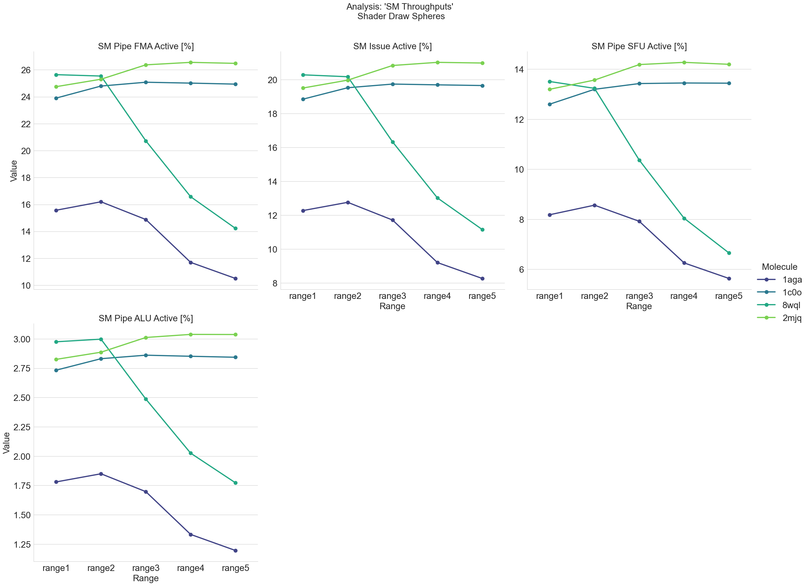

_Caption (Fig. 226): Charts showing SM Throughputs (%) for Draw Spheres across different scenes and camera ranges. The x-axis represents the camera range (distance from the molecule), and the y-axis represents the value. Each chart has its own scale (mentioned in the title). Each line corresponds to a different scene._

##### Cylinder Culling Shader

Similar to spheres, but reaching 12% in Issue Active [%] (more computation instructions).

##### Draw Cylinders

In this case FMA also had high percentages, reaching 40%. SFU reached 18% and ALU 4%. Issue Active reached 30%. This was expected because cylinders required more complex math than spheres. See [Fig. 227](#fig-227).

**Fig. 227**
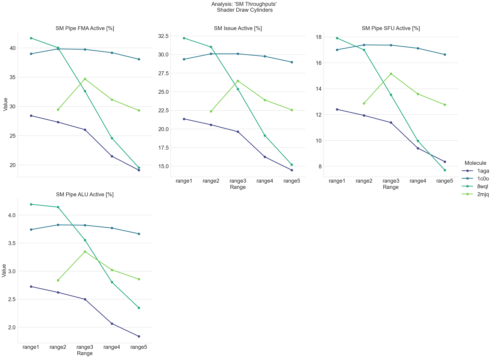

_Caption (Fig. 227): Charts showing SM Throughputs (%) for Draw Cylinders across different scenes and camera ranges. The x-axis represents the camera range (distance from the molecule), and the y-axis represents the value. Each chart has its own scale (mentioned in the title). Each line corresponds to a different scene._

##### Performance Per Marked Range

**Fig. 228**
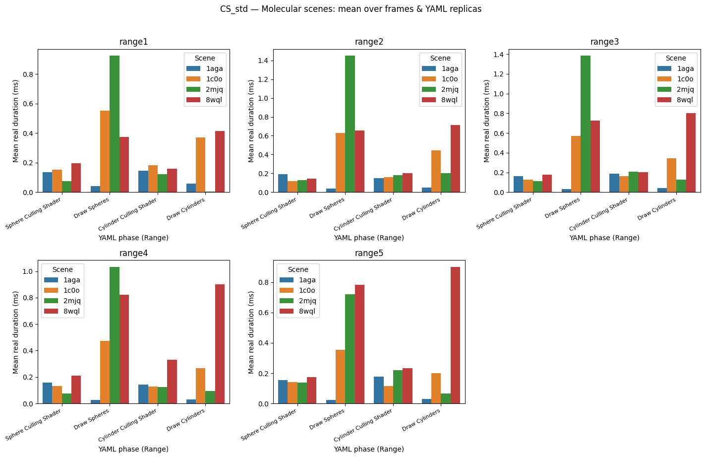

_Caption (Fig. 228): Charts showing frame time per marked range for the standard pipeline across different scenes and camera ranges. The x-axis represents the camera range (distance from the molecule), and the y-axis represents the value. Each chart has its own scale (mentioned in the title). Each line corresponds to a different scene._

In [Fig. 228](#fig-228) it is confirmed that the frustum culling shaders are very light, most of the work comes from the drawing shaders. It is put in evidence how well sophisticated hardware-accelerated rendering methods perform, with frame times in the order of less than two milliseconds even for the largest molecule. It is also interesting to see how 2MJQ is the molecule with worst performance in this version, still with great performance.

##### Compact (synthetic) scenes

##### GPU Engines Active [\%]

##### Sphere Culling Shader

##### Draw Spheres

**Fig. 229**
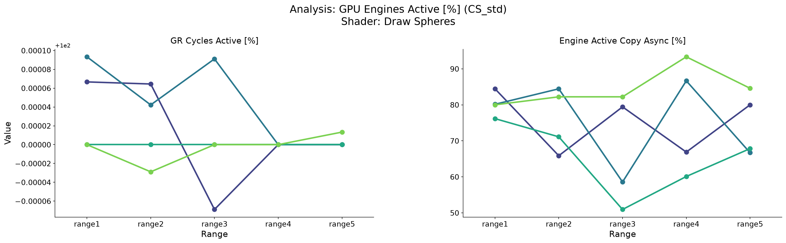

_Caption (Fig. 229): Charts showing GPU Engines Active (%) through different metrics for Draw Spheres across compact grid scenes grid1–grid4 The x-axis represents the camera range (distance from the scene), and the y-axis represents the value. Each chart has its own scale (mentioned in the title). Each line corresponds to a different grid (grid1, grid2, …)._

No relevant results to analyze in [Figure 229](#fig-229), only that most of data transfer was asynchronous.

##### Cylinder Culling Shader

##### Draw Cylinders

**Fig. 230**
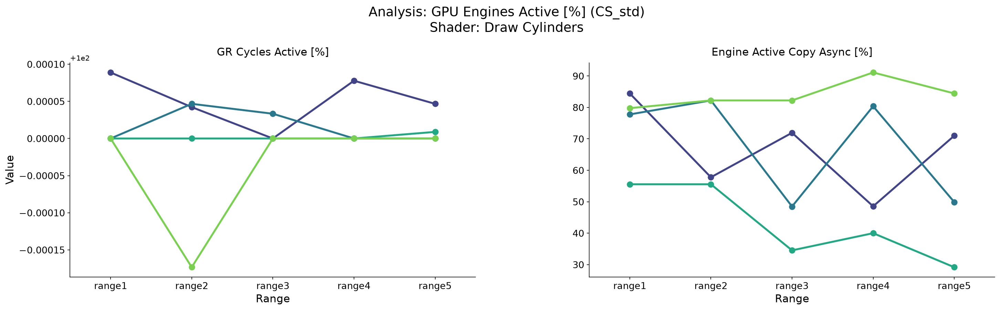

_Caption (Fig. 230): Charts showing GPU Engines Active (%) through different metrics for Draw Cylinders across compact grid scenes grid1–grid4 The x-axis represents the camera range (distance from the scene), and the y-axis represents the value. Each chart has its own scale (mentioned in the title). Each line corresponds to a different grid (grid1, grid2, …)._

No relevant results to analyze in [Figure 230](#fig-230), only that most of data transfer was asynchronous.

##### GR Cycles Active

##### Draw Spheres

**Fig. 231**
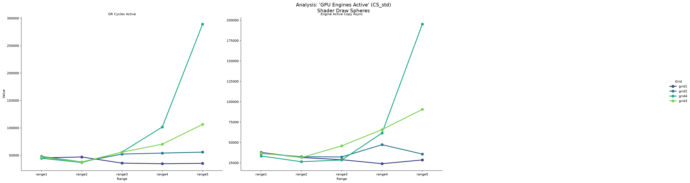

_Caption (Fig. 231): Charts showing GR Cycles Active through different metrics for Draw Spheres across compact grid scenes grid1–grid4 The x-axis represents the camera range (distance from the scene), and the y-axis represents the value. Each chart has its own scale (mentioned in the title). Each line corresponds to a different grid (grid1, grid2, …)._

[Figure 231](#fig-231) shows that this shader needs much less active cycles (GR Cycles Active) than the other versions, logically same with the Copy Async cycles, demonstrating how well adjusted is the standard pipeline.

##### Draw Cylinders

**Fig. 232**
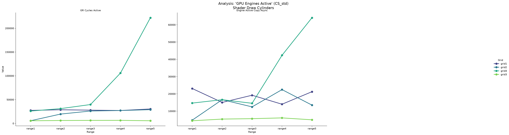

_Caption (Fig. 232): Charts showing GR Cycles Active through different metrics for Draw Cylinders across compact grid scenes grid1–grid4 The x-axis represents the camera range (distance from the scene), and the y-axis represents the value. Each chart has its own scale (mentioned in the title). Each line corresponds to a different grid (grid1, grid2, …)._

[Figure 232](#fig-232) shows the same results as in Draw Spheres, with even lower values of cycles.

##### Graphics/Compute Idle [\%]

##### Sphere Culling Shader

##### Draw Spheres

**Fig. 233**
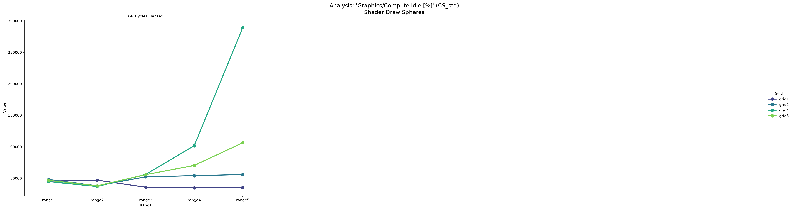

_Caption (Fig. 233): Charts showing Graphics/Compute Idle (%) for Draw Spheres across compact grid scenes grid1–grid4 The x-axis represents the camera range (distance from the scene), and the y-axis represents the value. Each chart has its own scale (mentioned in the title). Each line corresponds to a different grid (grid1, grid2, …)._

It can be seen that the amount of cycles elapsed grow exponentially with range, yet it seems there were no relevant amounts of idle cycles in charts of [Figure 233](#fig-233).

##### Cylinder Culling Shader

##### Draw Cylinders

**Fig. 234**
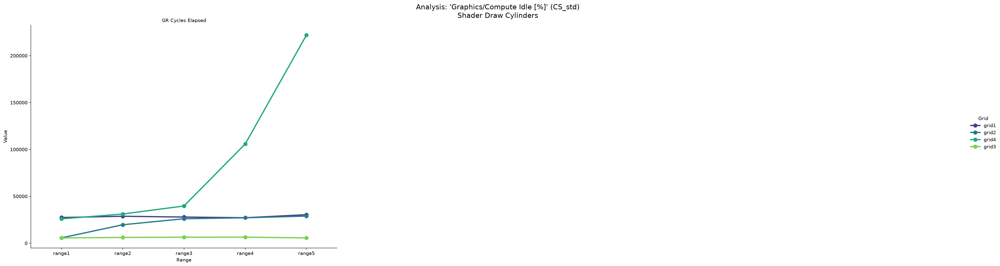

_Caption (Fig. 234): Charts showing Graphics/Compute Idle (%) for Draw Cylinders across compact grid scenes grid1–grid4 The x-axis represents the camera range (distance from the scene), and the y-axis represents the value. Each chart has its own scale (mentioned in the title). Each line corresponds to a different grid (grid1, grid2, …)._

It can be seen that the amount of cycles elapsed grow exponentially with range, yet it seems there were no relevant amounts of idle cycles in charts of [Figure 234](#fig-234).

##### L1TEX L2 Hit Rates

##### Sphere Culling Shader

##### Draw Spheres

**Fig. 235**
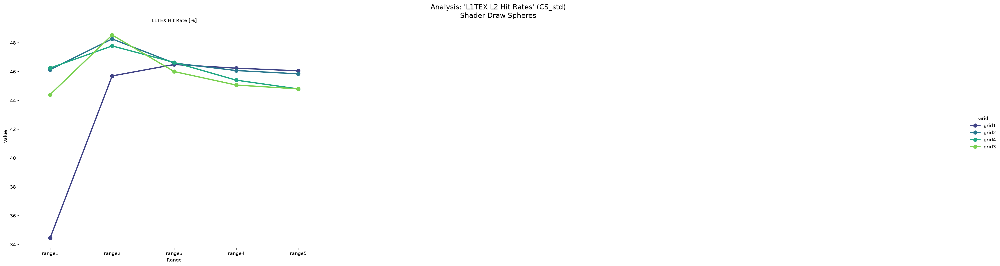

_Caption (Fig. 235): Charts showing L2 Hit Rates (%) for Draw Spheres across compact grid scenes grid1–grid4 The x-axis represents the camera range (distance from the scene), and the y-axis represents the value. Each chart has its own scale (mentioned in the title). Each line corresponds to a different grid (grid1, grid2, …)._

Cache hit rates show some constant values for every grid in any range, around 44 and 50%. See [Figure 235](#fig-235).

##### Cylinder Culling Shader

##### Draw Cylinders

**Fig. 236**
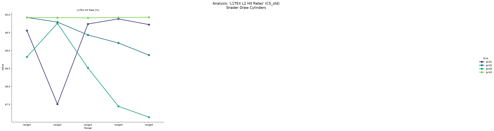

_Caption (Fig. 236): Charts showing L2 Hit Rates (%) for Draw Cylinders across compact grid scenes grid1–grid4 The x-axis represents the camera range (distance from the scene), and the y-axis represents the value. Each chart has its own scale (mentioned in the title). Each line corresponds to a different grid (grid1, grid2, …)._

Similar results as in Draw Spheres shader. See [Figure 236](#fig-236).

##### L1Tex Miss Sectors

##### Sphere Culling Shader

##### Draw Spheres

**Fig. 237**
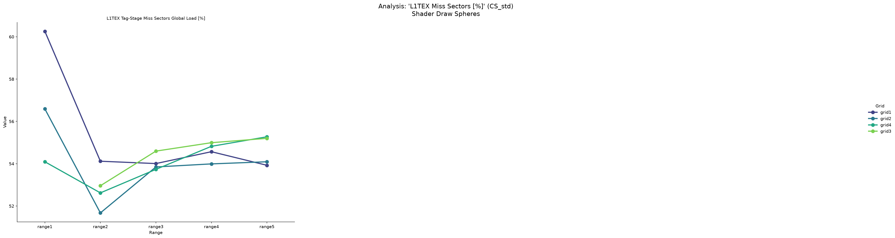

_Caption (Fig. 237): Charts showing L1 Miss Sectors for Draw Spheres across compact grid scenes grid1–grid4 The x-axis represents the camera range (distance from the scene), and the y-axis represents the value. Each chart has its own scale (mentioned in the title). Each line corresponds to a different grid (grid1, grid2, …)._

In [Figure 237](#fig-237) it can be seen that cache misses come from global buffers readings, and that it has high values: over 50% in every case. This could be due to the separation of processes between culling and rendering, making it having to access a buffer with not-culled spheres ids and then the spheres buffer.

##### Cylinder Culling Shader

##### Draw Cylinders

**Fig. 238**
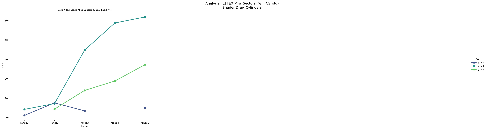

_Caption (Fig. 238): Charts showing L1 Miss Sectors for Draw Cylinders across compact grid scenes grid1–grid4 The x-axis represents the camera range (distance from the scene), and the y-axis represents the value. Each chart has its own scale (mentioned in the title). Each line corresponds to a different grid (grid1, grid2, …)._

Seeing spheres it is strangely different for cylinders, since there is another pattern in which cache misses grow with range, and only for grids 2 and 4, grid1 doesn't have results for range4 and there are no results for grid3. See [Figure 238](#fig-238).

##### L1TEX Sectors [\%]

##### Sphere Culling Shader

##### Draw Spheres

**Fig. 239**
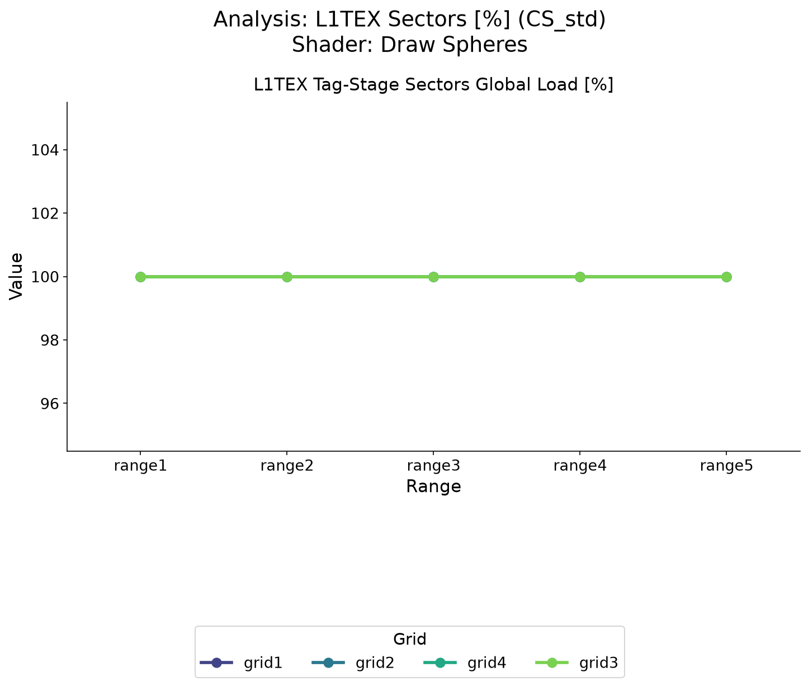

_Caption (Fig. 239): Charts showing L1TEX Sectors (%) for Draw Spheres across compact grid scenes grid1–grid4 The x-axis represents the camera range (distance from the scene), and the y-axis represents the value. Each chart has its own scale (mentioned in the title). Each line corresponds to a different grid (grid1, grid2, …)._

L1TEX Tag-Stage Sectors Global Load [%] was the only rule captures, showing all cache traffic comes from global buffers. See [Figure 239](#fig-239).

##### Cylinder Culling Shader

##### Draw Cylinders

**Fig. 240**
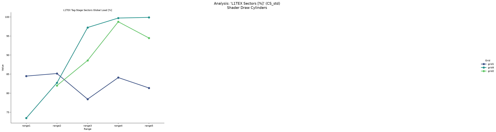

_Caption (Fig. 240): Charts showing L1TEX Sectors (%) for Draw Cylinders across compact grid scenes grid1–grid4 The x-axis represents the camera range (distance from the scene), and the y-axis represents the value. Each chart has its own scale (mentioned in the title). Each line corresponds to a different grid (grid1, grid2, …)._

Results are more or less the same as for Draw Spheres shader, but with some variations, maybe due to minimal usage of cache in other sectors. See [Figure 240](#fig-240).

##### Unit Throughputs

##### Sphere Culling Shader

##### Draw Spheres

##### Cylinder Culling Shader

**Fig. 241**
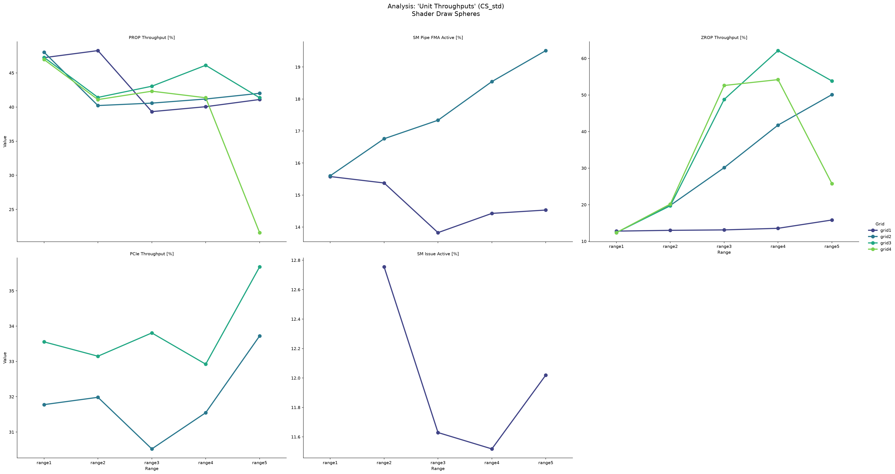

_Caption (Fig. 241): Charts showing Unit Throughputs (%) for Draw Spheres across compact grid scenes grid1–grid4 The x-axis represents the camera range (distance from the scene), and the y-axis represents the value. Each chart has its own scale (mentioned in the title). Each line corresponds to a different grid (grid1, grid2, …)._

PROP Throughput has more or less constant values across ranges and grids, between 35 and 50% of throughput. It is strange that it is not a pregressive increase across ranges, since it should change with the amount of spheres. Still it is expected to have a relatively high value since Pre Raster Operations are a strong part of this pipeline when passing through the geometry shader; preparing triangles and creating geometry. It is clear though for ZROP Throughput [%] since in this part fragments of each created triangle are analyzed and enqueued for each pixel. PCLe Throughpput is high sometimes but doesn't have a clear response to anything in particular, same as with SM Pipe FMA Active [%]. See [Figure 241](#fig-241).

##### Draw Cylinders

**Fig. 242**
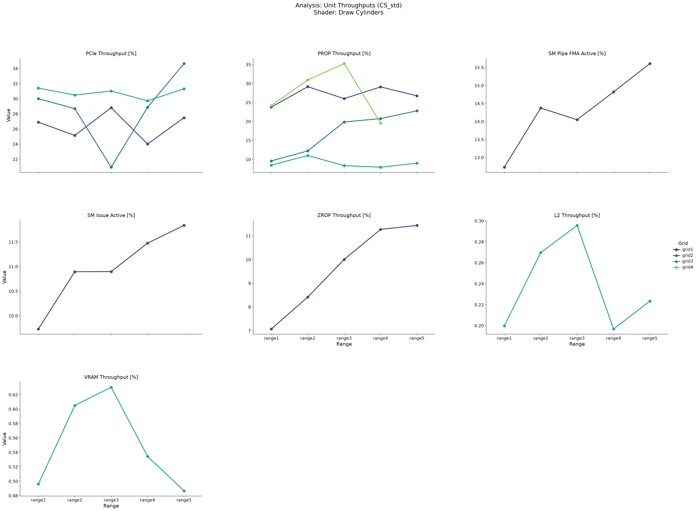

_Caption (Fig. 242): Charts showing Unit Throughputs (%) for Draw Cylinders across compact grid scenes grid1–grid4 The x-axis represents the camera range (distance from the scene), and the y-axis represents the value. Each chart has its own scale (mentioned in the title). Each line corresponds to a different grid (grid1, grid2, …)._

In this case the charts don't show much information, but still PROP Throughput [%] has steady values for each grid, showing some general pattern of higher percentage for bigger scenes. Same happens with PCIe Throughput [%]. The other charts don't have enough information for an analysis. See [Figure 242](#fig-242).

##### SM Warp Occupancy [Warps Per Cycle]

##### Sphere Culling Shader

##### Draw Spheres

**Fig. 243**
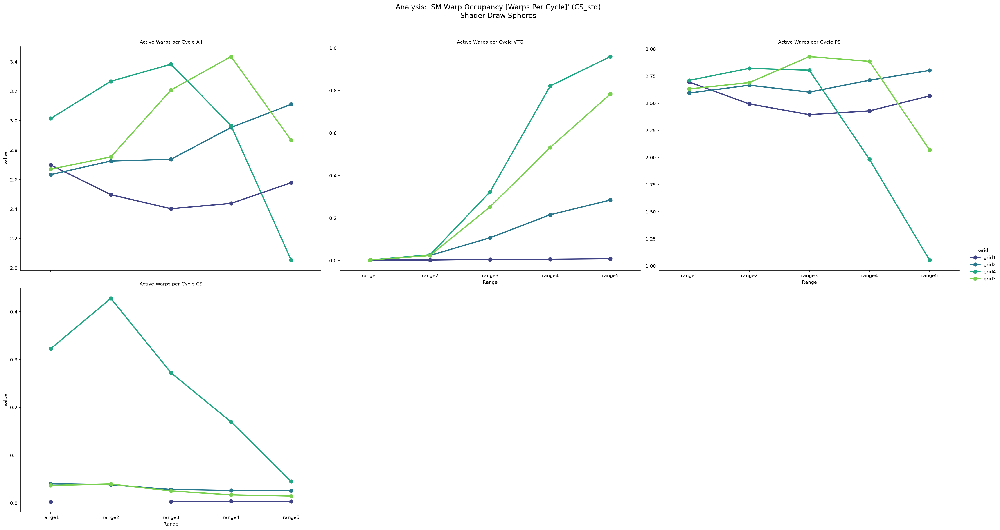

_Caption (Fig. 243): Charts showing SM Warp Occupancy (Warps Per Cycle) for Draw Spheres across compact grid scenes grid1–grid4 The x-axis represents the camera range (distance from the scene), and the y-axis represents the value. Each chart has its own scale (mentioned in the title). Each line corresponds to a different grid (grid1, grid2, …)._

Warps per cycle usage show really low values in any case: for VTG (Vertex, Tesellation and Geometry shaders), for PS (Pixel Shader) and CS (Compute Shader). It was expected to be higher but it may be due to still not having a load of work big enough. See [Figure 243](#fig-243).

##### Cylinder Culling Shader

##### Draw Cylinders

**Fig. 244**
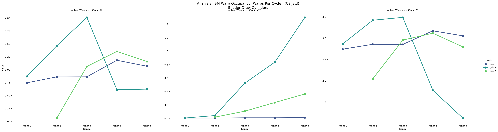

_Caption (Fig. 244): Charts showing SM Warp Occupancy (Warps Per Cycle) for Draw Cylinders across compact grid scenes grid1–grid4 The x-axis represents the camera range (distance from the scene), and the y-axis represents the value. Each chart has its own scale (mentioned in the title). Each line corresponds to a different grid (grid1, grid2, …)._

Results are similar as those for Draw Spheres shader. See [Figure 244](#fig-244).

##### SM Warp Occupancy [\%]

##### Sphere Culling Shader

##### Draw Spheres

**Fig. 245**
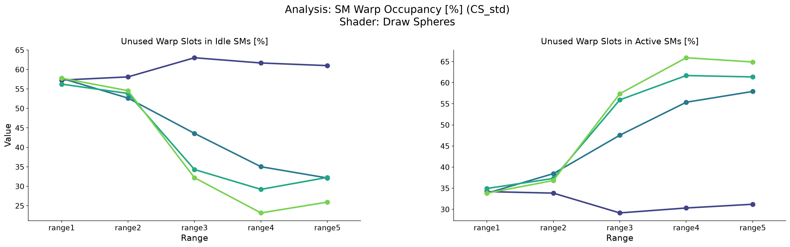

_Caption (Fig. 245): Charts showing SM Warp Occupancy (%) for Draw Spheres across compact grid scenes grid1–grid4 The x-axis represents the camera range (distance from the scene), and the y-axis represents the value. Each chart has its own scale (mentioned in the title). Each line corresponds to a different grid (grid1, grid2, …)._

Unused Warp Slots in Idle SMs [%] lower with range but Unused Warp Slots in Active SMs [%] increases with range. This could be because there are more entities with range, so more warps are used, but there are less fragments per entitiy (smaller projections) so there is less work per warp. See [Figure 245](#fig-245).

##### Cylinder Culling Shader

##### Draw Cylinders

**Fig. 246**
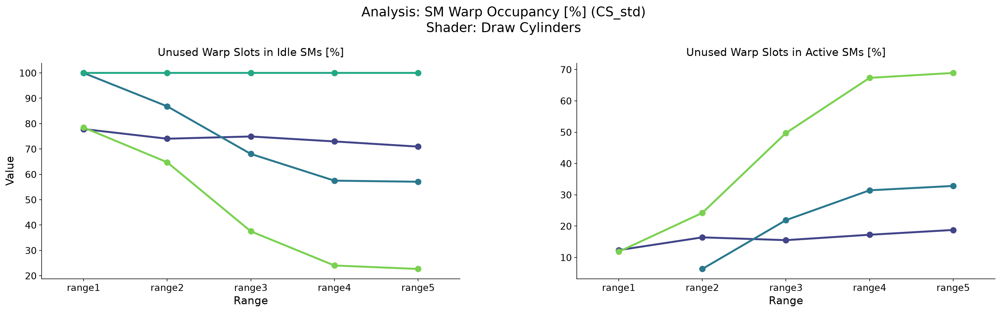

_Caption (Fig. 246): Charts showing SM Warp Occupancy (%) for Draw Cylinders across compact grid scenes grid1–grid4 The x-axis represents the camera range (distance from the scene), and the y-axis represents the value. Each chart has its own scale (mentioned in the title). Each line corresponds to a different grid (grid1, grid2, …)._

There are similar results to the Draw Spheres shader, but grid2 and grid3 have considerably less cylinders than spheres in those scenes, so that's why there are not that pronounced patterns. See [Figure 246](#fig-246).

##### SM Warp Issue Stalls [\%]

##### Sphere Culling Shader

##### Draw Spheres

**Fig. 247**
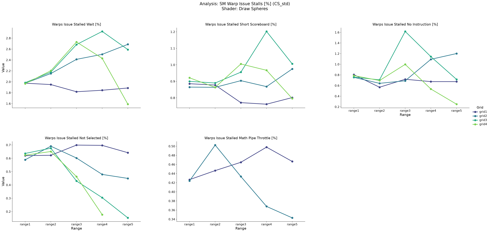

_Caption (Fig. 247): Charts showing SM Warp Issue Stalls (%) for Draw Spheres across compact grid scenes grid1–grid4 The x-axis represents the camera range (distance from the scene), and the y-axis represents the value. Each chart has its own scale (mentioned in the title). Each line corresponds to a different grid (grid1, grid2, …)._

Percentages are really low in every chart putting in evidence efficiency and fluidity between processes. See [Figure 247](#fig-247).

##### Cylinder Culling Shader

##### Draw Cylinders

**Fig. 248**
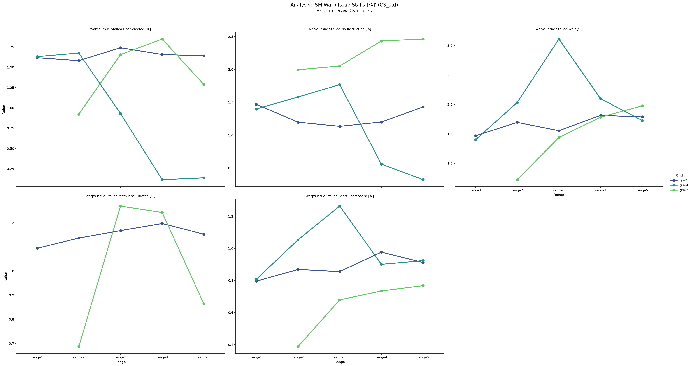

_Caption (Fig. 248): Charts showing SM Warp Issue Stalls (%) for Draw Cylinders across compact grid scenes grid1–grid4 The x-axis represents the camera range (distance from the scene), and the y-axis represents the value. Each chart has its own scale (mentioned in the title). Each line corresponds to a different grid (grid1, grid2, …)._

Percentages are really low in every chart putting in evidence efficiency and fluidity between processes. See [Figure 248](#fig-248).

##### Cumulative Warp Latencies [\%]

##### Sphere Culling Shader

##### Draw Spheres

**Fig. 249**
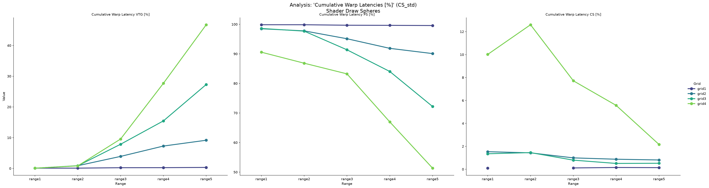

_Caption (Fig. 249): Charts showing Cumulative Warp Latencies (%) for Draw Spheres across compact grid scenes grid1–grid4 The x-axis represents the camera range (distance from the scene), and the y-axis represents the value. Each chart has its own scale (mentioned in the title). Each line corresponds to a different grid (grid1, grid2, …)._

[Figure 249](#fig-249) shows a different kind of stalls, the roots of it. It can be seen that at close ranges it is the Pixel Shader the one that causes the total of latencies, but across ranges it is the VTG (Vertex, Tessellation, Geometry) the one doing the heavy work. It is consistent with what was said before: close ranges mean more pixels per sphere but less spheres, but farther ranges mean more spheres and less pixels per sphere. For some reaon there are percentages of CS latency, but it must be noise.

##### Cylinder Culling Shader

##### Draw Cylinders

**Fig. 250**
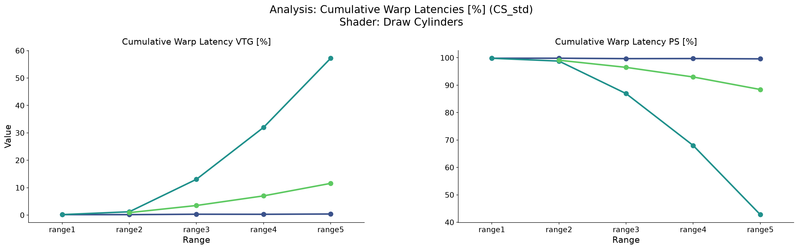

_Caption (Fig. 250): Charts showing Cumulative Warp Latencies (%) for Draw Cylinders across compact grid scenes grid1–grid4 The x-axis represents the camera range (distance from the scene), and the y-axis represents the value. Each chart has its own scale (mentioned in the title). Each line corresponds to a different grid (grid1, grid2, …)._

[Figure 250](#fig-250) shows a different kind of stalls, the roots of it. It can be seen that at close ranges it is the Pixel Shader the one that causes the total of latencies, but across ranges it is the VTG (Vertex, Tessellation, Geometry) the one doing the heavy work. It is consistent with what was said before: close ranges mean more pixels per cylinder but less cylinders, but farther ranges mean more cylinders and less pixels per cylinder.

##### Cumulative Warp Latencies [Cycles]

##### Sphere Culling Shader

##### Draw Spheres

**Fig. 251**
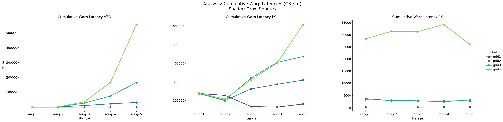

_Caption (Fig. 251): Charts showing Cumulative Warp Latencies (Cycles) for Draw Spheres across compact grid scenes grid1–grid4 The x-axis represents the camera range (distance from the scene), and the y-axis represents the value. Each chart has its own scale (mentioned in the title). Each line corresponds to a different grid (grid1, grid2, …)._

The growth in Cumulative Warp Latency VTG cycles and Cumulative Warp Latency PS cycles is consistent with what was said in the last metric, both of them grow but VTG growth is more violent. See [Figure 251](#fig-251).

##### Cylinder Culling Shader

##### Draw Cylinders

**Fig. 252**
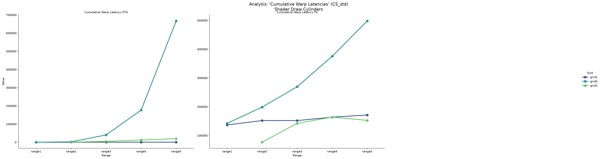

_Caption (Fig. 252): Charts showing Cumulative Warp Latencies (Cycles) for Draw Cylinders across compact grid scenes grid1–grid4 The x-axis represents the camera range (distance from the scene), and the y-axis represents the value. Each chart has its own scale (mentioned in the title). Each line corresponds to a different grid (grid1, grid2, …)._

Similar results and behaviour as for Draw Spheres. See [Figure 252](#fig-252).

##### Active Threads Per Warp

##### Sphere Culling Shader

##### Draw Spheres

**Fig. 253**
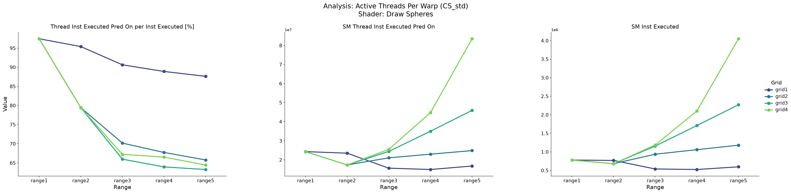

_Caption (Fig. 253): Charts showing Active Threads per Warp for Draw Spheres across compact grid scenes grid1–grid4 The x-axis represents the camera range (distance from the scene), and the y-axis represents the value. Each chart has its own scale (mentioned in the title). Each line corresponds to a different grid (grid1, grid2, …)._

Thread Inst Executed Pred On per Inst Executed [%] show that even if it starts with a high percentage at range1 (over 95%) there is an important decline to around 65% for most grids. Also SM Thread Inst Executed Pred On rise with ranges but the emmited instructions simply grow faster. This is a sign of divergences at far distances, maybe due to decisions to take when discarding some pixels and painting others. See [Figure 253](#fig-253).

##### Cylinder Culling Shader

##### Draw Cylinders

**Fig. 254**
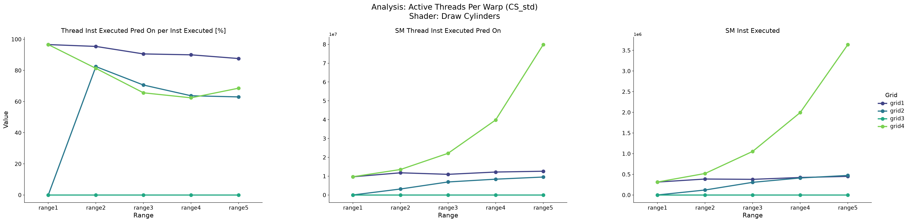

_Caption (Fig. 254): Charts showing Active Threads per Warp for Draw Cylinders across compact grid scenes grid1–grid4 The x-axis represents the camera range (distance from the scene), and the y-axis represents the value. Each chart has its own scale (mentioned in the title). Each line corresponds to a different grid (grid1, grid2, …)._

For grid1, grid2 and grid4 results are more or less the same as for spheres, but recollection of results for grid3 are useless since they are clearly wrong (all zeros) or simply every cylinder was culled. See [Figure 254](#fig-254).

##### Shader Pixels Coverage Kill

##### Sphere Culling Shader

##### Draw Spheres

**Fig. 255**
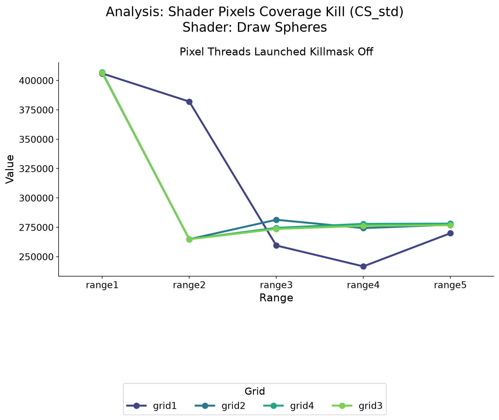

_Caption (Fig. 255): Charts showing Shader Pixels Coverage Kill for Draw Spheres across compact grid scenes grid1–grid4 The x-axis represents the camera range (distance from the scene), and the y-axis represents the value. Each chart has its own scale (mentioned in the title). Each line corresponds to a different grid (grid1, grid2, …)._

The amount of discarded pixels is high in any case, but clearley higher at closer ranges since spheres are too big and most parts of them are outside of the screen. See [Figure 255](#fig-255).

##### Cylinder Culling Shader

##### Draw Cylinders

**Fig. 256**
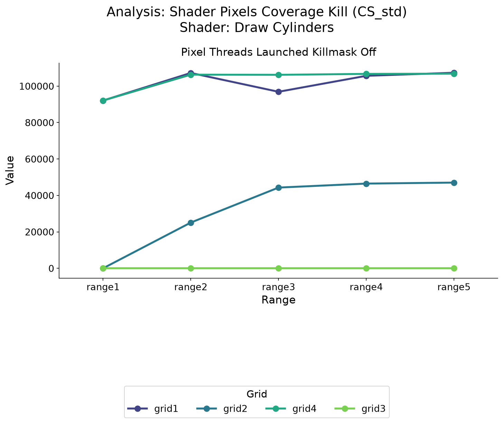

_Caption (Fig. 256): Charts showing Shader Pixels Coverage Kill for Draw Cylinders across compact grid scenes grid1–grid4 The x-axis represents the camera range (distance from the scene), and the y-axis represents the value. Each chart has its own scale (mentioned in the title). Each line corresponds to a different grid (grid1, grid2, …)._

For cylinders it seems that for grids 1, 2 and 4 the amount of discarded fragments is constant, but for grid3 (added to last metric results) it is possible to conclude that all cylinders are culled. See [Figure 256](#fig-256).

##### Warp Launch Stalled by Reasons [\%]

##### Sphere Culling Shader

##### Draw Spheres

**Fig. 257**
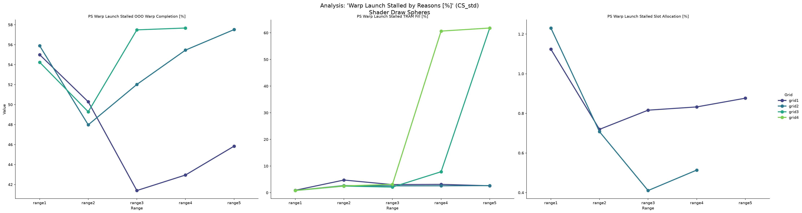

_Caption (Fig. 257): Charts showing Warp Launch Stalled by Reasons (%) for Draw Spheres across compact grid scenes grid1–grid4 The x-axis represents the camera range (distance from the scene), and the y-axis represents the value. Each chart has its own scale (mentioned in the title). Each line corresponds to a different grid (grid1, grid2, …)._

PS Warp Launch Stalled OOO Warp Completion [%] is high for most grids since fragments extracted for the pixel shader must be delivered in warp launch order, so they must wait for warps to finish and then to rearrange. PS Warp Launch Stalled TRAM Fill [%] is close to zero in most cases, but for grid3 and grid4 it has a spike reaching 60% in ranges 4 and 5, meaning that a lot of created triangles have to be stored at some point. See [Figure 257](#fig-257).

##### Cylinder Culling Shader

##### Draw Cylinders

**Fig. 258**
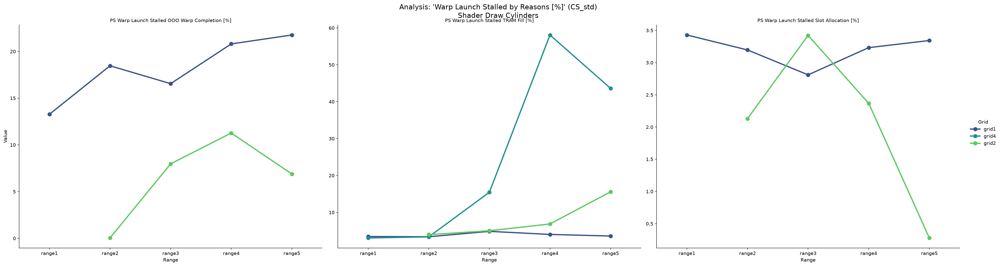

_Caption (Fig. 258): Charts showing Warp Launch Stalled by Reasons (%) for Draw Cylinders across compact grid scenes grid1–grid4 The x-axis represents the camera range (distance from the scene), and the y-axis represents the value. Each chart has its own scale (mentioned in the title). Each line corresponds to a different grid (grid1, grid2, …)._

Results are similar as for the Draw Spheres shader, see [Figure 258](#fig-258).

##### SM Throughputs

##### Sphere Culling Shader

##### Draw Spheres

**Fig. 259**
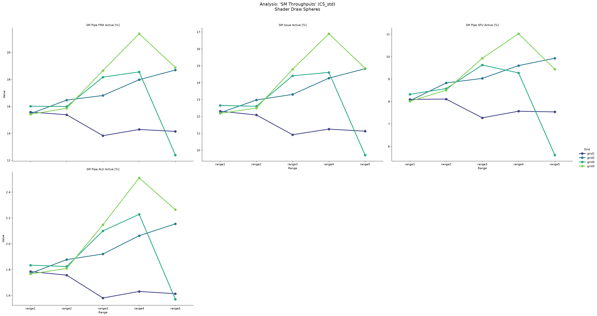

_Caption (Fig. 259): Charts showing SM Throughputs (%) for Draw Spheres across compact grid scenes grid1–grid4 The x-axis represents the camera range (distance from the scene), and the y-axis represents the value. Each chart has its own scale (mentioned in the title). Each line corresponds to a different grid (grid1, grid2, …)._

Charts in [Figure 259](#fig-259) show the same pattern, where percentages grow with range and with scene size, yet all of them show low values. SM Pipe FMA Active [%] has the highest percentages with a maximum of a bit over 20% in grid3.

##### Cylinder Culling Shader

##### Draw Cylinders

**Fig. 260**
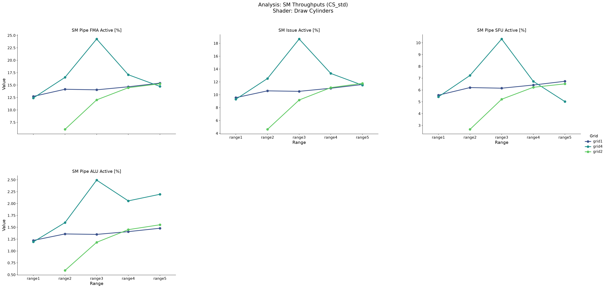

_Caption (Fig. 260): Charts showing SM Throughputs (%) for Draw Cylinders across compact grid scenes grid1–grid4 The x-axis represents the camera range (distance from the scene), and the y-axis represents the value. Each chart has its own scale (mentioned in the title). Each line corresponds to a different grid (grid1, grid2, …)._

Results are similar to those for Draw Spheres shader, but with percentages just a bit higher: Sm Pipe FMA Active [%] reaches a maximum of 25%. [Figure 260](#fig-260).

##### Performance Per Marked Range

**Fig. 261**
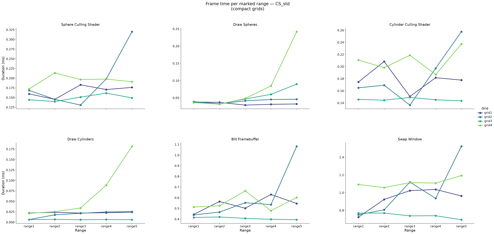

_Caption (Fig. 261): Charts showing frame time per marked range for the standard pipeline across compact grid scenes grid1–grid4 The x-axis represents the camera range (distance from the scene), and the y-axis represents the value. Each chart has its own scale (mentioned in the title). Each line corresponds to a different grid (grid1, grid2, …)._

Performance of every shader involved in this pipeline allows impressive visual fluidity; Draw Spheres and Draw Cylinders reach even lower values than the culling shaders, which are already light and fast. The maximum shader time for spheres is 0.25 ms in range5 for grid4, and if it were the only step of a frame that would be 4000 fps. See [Figure 261](#fig-261).

#### 3.1.4 Hybrid binning CUDA (`cuda_hybrid_binning`)

##### Molecular (sparse) scenes

As explained in the implementation section, the hybrid version is composed by multiple stages some of them completed by more than one kernel. Therefore the marked parts for extracting metrics are:

##### `Sphere: Classify`: the kernel in charge of applying frustum culling to spheres, and then into classifying them into small entities (uses first GPGPU rendering method) and large entities (use tiling binning method). When classifying into large entities, the kernel creates the pairs of sphere indices and tile indices, and stores them in a buffer for the next stage.

##### `Sphere: Sort+RLE+TileOffsets`: this stage takes into account three vital parts of the process, the sorting of the pairs of indices created in the previous stage, the run-length encoding of the sorted pairs to create the tile packets, and the creation of an offset buffer to know where each tile packet starts in the next stage.

##### `Sphere: Expand WorkGroups`: this is a small kernel that takes the tile packets created in the previous stage and expands them to create a workgroup for each tile, with the corresponding sphere indices to process.

##### `Sphere: Tiled Raster WG`: this is the kernel that takes the workgroups created in the previous stage and processes them to rasterize the spheres one thread per pixel.

##### `Sphere: Small Raster`: this is the kernel that takes the small entities (those that do not require tiling) and rasterizes them one thread per entity.

##### `Cylinder: Classify`: the kernel in charge of applying frustum culling to cylinders, and then into classifying them into small entities (uses first GPGPU rendering method) and large entities (use tiling binning method). When classifying into large entities, the kernel creates the pairs of cylinder indices and tile indices, and stores them in a buffer for the next stage.

##### `Cylinder: Sort+RLE+TileOffsets`: this stage takes into account three vital parts of the process, the sorting of the pairs of indices created in the previous stage, the run-length encoding of the sorted pairs to create the tile packets, and the creation of an offset buffer to know where each tile packet starts in the next stage.

##### `Cylinder: Expand WorkGroups`: this is a small kernel that takes the tile packets created in the previous stage and expands them to create a workgroup for each tile, with the corresponding cylinder indices to process.

##### `Cylinder: Tiled Raster WG`: this is the kernel that takes the workgroups created in the previous stage and processes them to rasterize the cylinders one thread per pixel.

##### `Cylinder: Small Raster`: this is the kernel that takes the small entities (those that do not require tiling) and rasterizes them one thread per entity.

This is a dynamic method that varies the workload of each frame depending on the camera position. Adding this to the fact that the tests try different distances in an effort to have really close takes of the scene and really far ones (as to capture the whole scene on the screen), the results show sometimes zero values for some ranges in some scenes because they were simply not used. For example, in the `Sphere: Tiled Raster WG` stage, the largest molecule at the closest range had no work because all spheres were small enough to be processed by the small raster kernel. On the other hand, the smallest molecule at the closest range had no work in the small raster kernel because all spheres were large enough to require tiling. In particular it was detected that for ranges 3, 4 and 5 for the molecule 8wql there was no work with large entities method. Another detected, important fact was that for Cylinder: Small Raster stage, metrics were not possible to be extracted for any molecule, due to driver's scheduling decisions. GPU overlaps small cylinders rasterization with processes of blitting the final image to the screen and swapping buffers, so CUDA Context (used for raster kernel) has to leave resources mid-frame to the Graphics Context (used for blitting and swapping), which causes the raster kernel to be preempted and finished when graphics context finishes, so the metrics are not captured. More details are given in the analysis Section _Analysis_.

##### GPU Engines Active [\%]

##### Sphere: Classify:

GR Cycles Active [%] showed no clear pattern, staying between 40-70%, which tells that the GPU is greatly active yet not fully occupied, likely due to the light workload of this stage: frustum culling and classification are not very heavy tasks. Engine Active Copy Async [%] was high, between 60-100%, which suggested that data transfer was happening asynchronously without interrupting the kernel. Engine Active Copy Sync [%] was below 1.4%, so sequential copies were not performed. See [Fig. 262](#fig-262).

**Fig. 262**
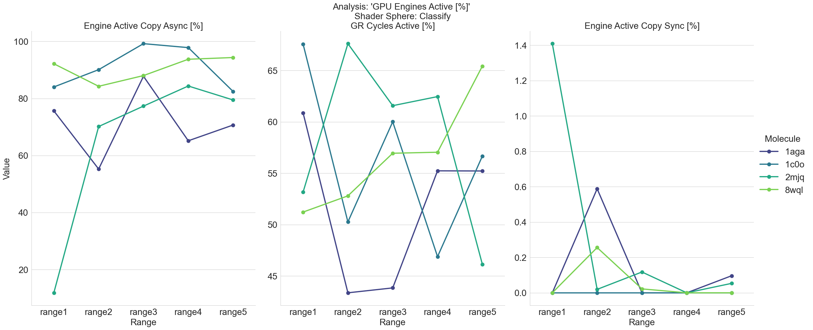

_Caption (Fig. 262): Charts showing GPU Engines Active (%) through different metrics for Sphere: Classify across different scenes and camera ranges. The x-axis represents the camera range (distance from the molecule), and the y-axis represents the value. Each chart has its own scale (mentioned in the title). Each line corresponds to a different scene._

##### Sphere: Sort+RLE+TileOffsets:

it can be seen that GR Cycles Active [%] lower with range, due to the reduced workload for large entities and increase of small entities work. It was curious that peak values were reached at range 3, which could be because of the particular distribution of entities in the scene at that range (not much entities culled and still pretty close). Maximum value was of 70% with 2MJQ, and lowest was around 35% for the smallest molecule. Engine Active Copy Async [%] was high, between 60-80%, showing decline at last ranges. Engine Active Copy Sync [%] was below 3.0%, so sequential copies were not performed. See [Fig. 263](#fig-263).

**Fig. 263**
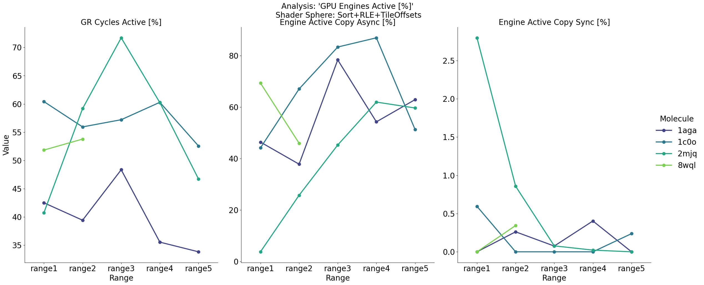

_Caption (Fig. 263): Charts showing GPU Engines Active (%) through different metrics for Sphere: Sort+RLE+TileOffsets across different scenes and camera ranges. The x-axis represents the camera range (distance from the molecule), and the y-axis represents the value. Each chart has its own scale (mentioned in the title). Each line corresponds to a different scene._

##### Sphere: Expand WorkGroups:

similar behaviour than the previous stage. See [Fig. 264](#fig-264).

**Fig. 264**
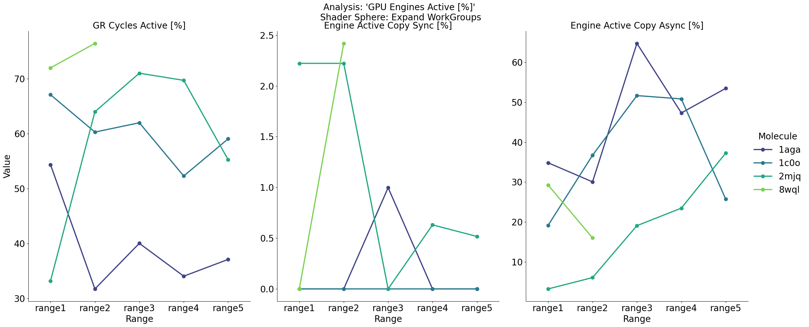

_Caption (Fig. 264): Charts showing GPU Engines Active (%) through different metrics for Sphere: Expand WorkGroups across different scenes and camera ranges. The x-axis represents the camera range (distance from the molecule), and the y-axis represents the value. Each chart has its own scale (mentioned in the title). Each line corresponds to a different scene._

##### Sphere: Tiled Raster WG:

expectedly, similar behaviour than the Sort+RLE+TileOffsets stage, with similar values in GR Cycles Active [%] but with even less percentages in Engine Active Copy Async [%] (between 0-50%). See [Fig. 265](#fig-265).

**Fig. 265**
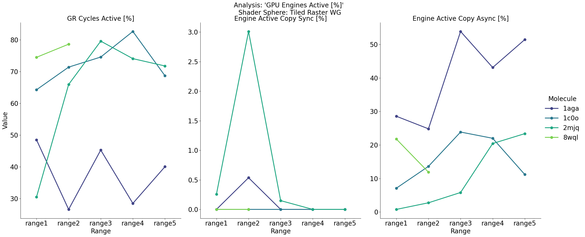

_Caption (Fig. 265): Charts showing GPU Engines Active (%) through different metrics for Sphere: Tiled Raster WG across different scenes and camera ranges. The x-axis represents the camera range (distance from the molecule), and the y-axis represents the value. Each chart has its own scale (mentioned in the title). Each line corresponds to a different scene._

##### Sphere: Small Raster:

for GR Cycles Active [%], values fluctuate between 30-80% increasing with range, been constant in greater molecules like 8WQL (meaning that from a certain entities amount the GPU may reach a certain cap). Engine Active Copy Sync [%] was below 2%, and Engine Active Copy Async [%] showed below 10% values in most cases except for the farthest ranges in the smallest and biggest molecules, where it reached around 70%. This could be, for the smallest molecule, because the frame time is very low and the data transfer time becomes significant, and for the biggest molecule because of the large amount of entities to process at those ranges. See [Fig. 266](#fig-266).

**Fig. 266**
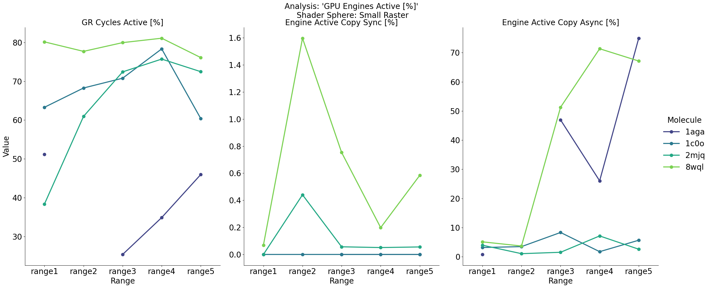

_Caption (Fig. 266): Charts showing GPU Engines Active (%) through different metrics for Sphere: Small Raster across different scenes and camera ranges. The x-axis represents the camera range (distance from the molecule), and the y-axis represents the value. Each chart has its own scale (mentioned in the title). Each line corresponds to a different scene._

##### Cylinder: Classify:

behaviour is similar to the sphere classify stage, but with lower values in GR Cycles Active [%] (between 40-75%) and lower values in Engine Active Copy Async [%] (between 0-40%). Both metrics grow with range. See [Fig. 267](#fig-267).

**Fig. 267**
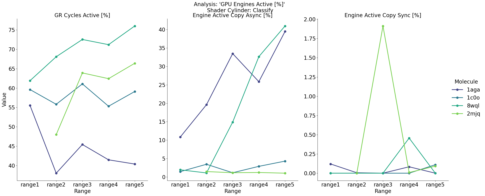

_Caption (Fig. 267): Charts showing GPU Engines Active (%) through different metrics for Cylinder: Classify across different scenes and camera ranges. The x-axis represents the camera range (distance from the molecule), and the y-axis represents the value. Each chart has its own scale (mentioned in the title). Each line corresponds to a different scene._

##### Cylinder: Sort+RLE+TileOffsets:

same as before, lower values in GR Cycles Active [%] (between 35-65%) and lower values in Engine Active Copy Async [%] (between 0-17.5%). Lack of patterns with ranges may be due to the amount of cylinders. See [Fig. 268](#fig-268).

**Fig. 268**
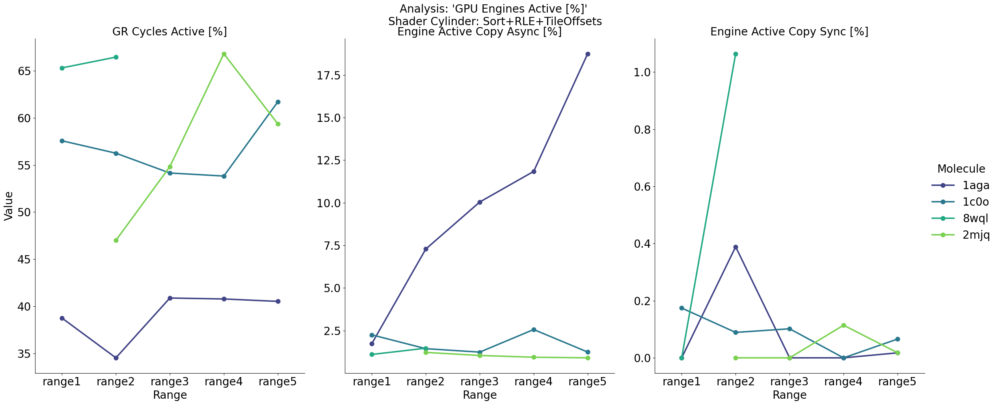

_Caption (Fig. 268): Charts showing GPU Engines Active (%) through different metrics for Cylinder: Sort+RLE+TileOffsets across different scenes and camera ranges. The x-axis represents the camera range (distance from the molecule), and the y-axis represents the value. Each chart has its own scale (mentioned in the title). Each line corresponds to a different scene._

##### Cylinder: Expand WorkGroups:

similar as the previous stage, with values between 30-70% for GR Cycles Active [%] and between 0-12% for Engine Active Copy Async [%]. See [Fig. 269](#fig-269).

**Fig. 269**
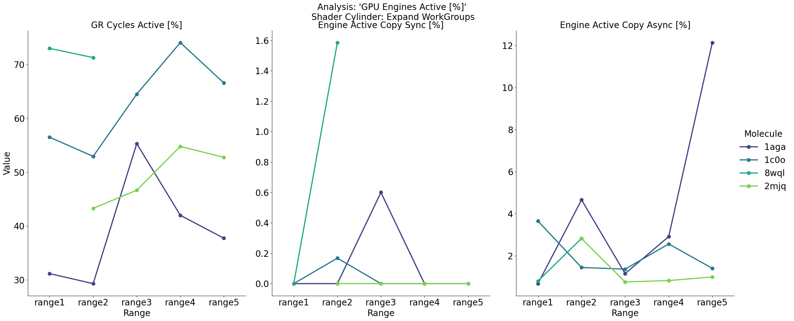

_Caption (Fig. 269): Charts showing GPU Engines Active (%) through different metrics for Cylinder: Expand WorkGroups across different scenes and camera ranges. The x-axis represents the camera range (distance from the molecule), and the y-axis represents the value. Each chart has its own scale (mentioned in the title). Each line corresponds to a different scene._

##### Cylinder: Tiled Raster WG:

not much information can be seen from [Fig. 270](#fig-270), but a certain tendency to drop in GR Cycles Active [%] with range can be seen. Engine Active Copy Async [%] show low values (less than 3%) maybe because the workload is not very heavy, so data transfer is not significant. See [Fig. 270](#fig-270).

**Fig. 270**

_Caption (Fig. 270): Charts showing GPU Engines Active (%) through different metrics for Cylinder: Tiled Raster WG across different scenes and camera ranges. The x-axis represents the camera range (distance from the molecule), and the y-axis represents the value. Each chart has its own scale (mentioned in the title). Each line corresponds to a different scene._

##### GPU Engines Active

##### Sphere: Classify:

similar as the previous metric, but in this case only cycles are shown. Every Figure shows a pattern: decreasing with range. GR Cycles Active shows its highest value in 2MJQ at range1 with over 800 000 cycles, but all the other molecules and ranges are below 300 000 cycles keeping it steady. Engine Active Copy Async shows in every molecule a decreasing tendency with range, with highest value around 300 000 (1C0O) and lowest below 50 000 (1AGA). Engine Active Copy Sync shows values close to zero in all cases. See [Fig. 271](#fig-271).

**Fig. 271**
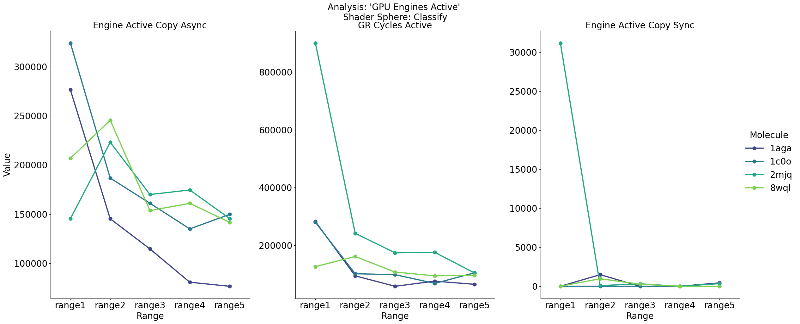

_Caption (Fig. 271): Charts showing GR Cycles Active through different metrics for Sphere: Classify across different scenes and camera ranges. The x-axis represents the camera range (distance from the molecule), and the y-axis represents the value. Each chart has its own scale (mentioned in the title). Each line corresponds to a different scene._

##### Sphere: Sort+RLE+TileOffsets:

in this case GR Cycles Active shows a more constant value across ranges but it is possible to see an increase with each molecule size: 1AGA between 100 000-175 000, 1C0O between 225 000-275 000, 2MJQ between 425 000-475 000. 8WQL has no results from range 3 to 5 because of the lack of work with large entities method. Engine Active Copy Async shows an increase from range 1 to 3, and then a decrease from range 3 to 5, also having higher values for bigger molecules. See [Fig. 272](#fig-272).

**Fig. 272**
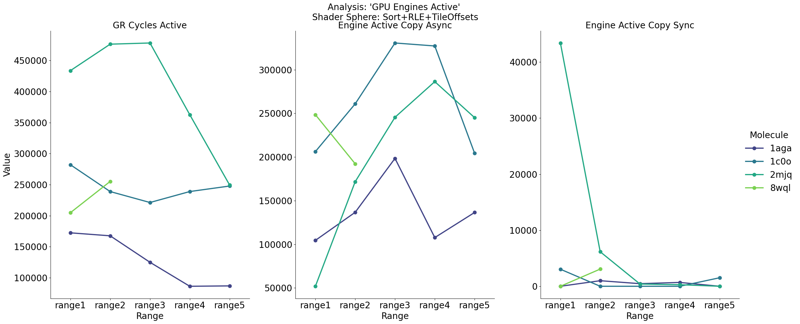

_Caption (Fig. 272): Charts showing GR Cycles Active through different metrics for Sphere: Sort+RLE+TileOffsets across different scenes and camera ranges. The x-axis represents the camera range (distance from the molecule), and the y-axis represents the value. Each chart has its own scale (mentioned in the title). Each line corresponds to a different scene._

##### Sphere: Expand WorkGroups:

this stage shows no clear pattern since its deviation is small, between 25 000 and 38 000 cycles in all cases. See [Fig. 273](#fig-273).

**Fig. 273**
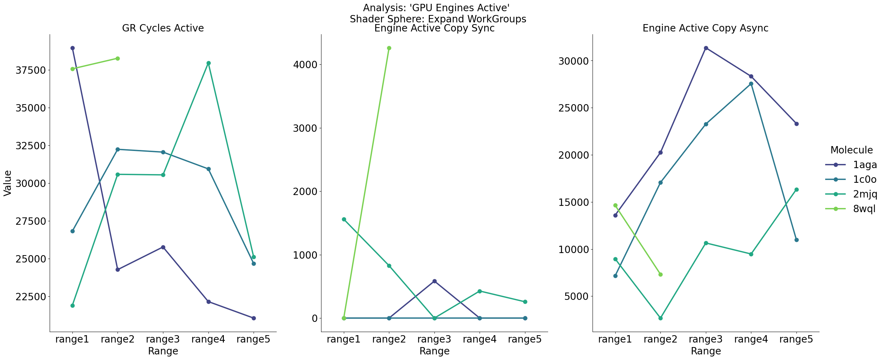

_Caption (Fig. 273): Charts showing GR Cycles Active through different metrics for Sphere: Expand WorkGroups across different scenes and camera ranges. The x-axis represents the camera range (distance from the molecule), and the y-axis represents the value. Each chart has its own scale (mentioned in the title). Each line corresponds to a different scene._

##### Sphere: Tiled Raster WG: shows similar behavior to the Sort+RLE+TileOffsets stage, with an increase with molecule size but constant across ranges. See [Fig. 274](#fig-274).

**Fig. 274**
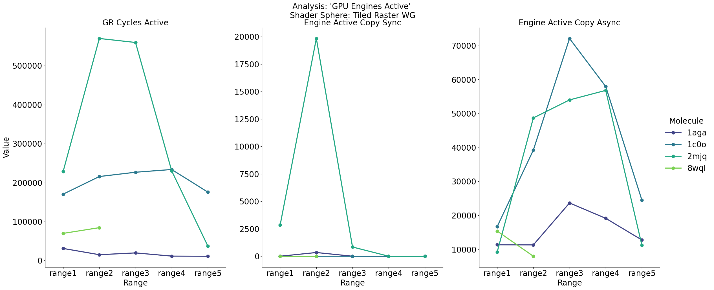

_Caption (Fig. 274): Charts showing GR Cycles Active through different metrics for Sphere: Tiled Raster WG across different scenes and camera ranges. The x-axis represents the camera range (distance from the molecule), and the y-axis represents the value. Each chart has its own scale (mentioned in the title). Each line corresponds to a different scene._

##### Sphere: Small Raster:

GR Cycles Active shows an increase with range in 2MJQ (max value a bit less than 1 000 000), but it is not clear in the other molecules. 8WQL decreases with range since with range each sphere becomes smaller and more of them finishes instantly, max value less than 800 000. 1AGA and 1C0O has values lower than 200 000 cycles in all cases. Engine Active Copy Async shows a noticeable increase for 8WQL, reaching highest value of around 275 000 cycles at range 3, and then decreasing with range. See [Fig. 275](#fig-275).

**Fig. 275**
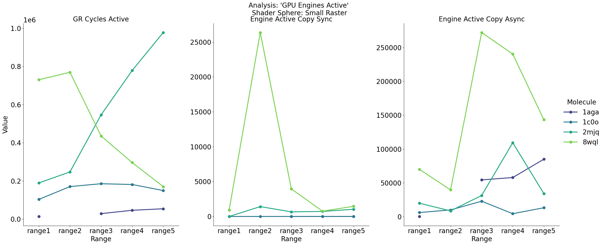

_Caption (Fig. 275): Charts showing GR Cycles Active through different metrics for Sphere: Small Raster across different scenes and camera ranges. The x-axis represents the camera range (distance from the molecule), and the y-axis represents the value. Each chart has its own scale (mentioned in the title). Each line corresponds to a different scene._

##### Cylinder: Classify:

similar to the sphere classify stage. See [Fig. 276](#fig-276).

**Fig. 276**

_Caption (Fig. 276): Charts showing GR Cycles Active through different metrics for Cylinder: Classify across different scenes and camera ranges. The x-axis represents the camera range (distance from the molecule), and the y-axis represents the value. Each chart has its own scale (mentioned in the title). Each line corresponds to a different scene._

##### Cylinder: Sort+RLE+TileOffsets:

similar to the sphere sort+RLE+tileOffsets stage, but with less noticeable pattern. See [Fig. 277](#fig-277).

**Fig. 277**

_Caption (Fig. 277): Charts showing GR Cycles Active through different metrics for Cylinder: Sort+RLE+TileOffsets across different scenes and camera ranges. The x-axis represents the camera range (distance from the molecule), and the y-axis represents the value. Each chart has its own scale (mentioned in the title). Each line corresponds to a different scene._

##### Cylinder Expand WorkGroups:

similar to the sphere expand workgroups stage. See [Fig. 278](#fig-278).

**Fig. 278**

_Caption (Fig. 278): Charts showing GR Cycles Active through different metrics for Cylinder: Expand WorkGroups across different scenes and camera ranges. The x-axis represents the camera range (distance from the molecule), and the y-axis represents the value. Each chart has its own scale (mentioned in the title). Each line corresponds to a different scene._

##### Cylinder Tiled Raster WG:

not much information can be seen from the [Fig. 279](#fig-279), only lower values than the Sphere Tiled Raster WG. See [Fig. 279](#fig-279).

**Fig. 279**
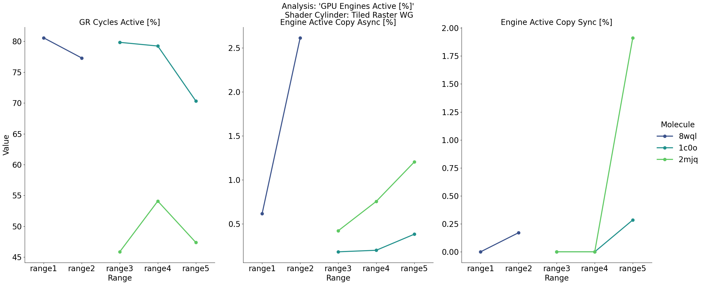

_Caption (Fig. 279): Charts showing GR Cycles Active through different metrics for Cylinder: Tiled Raster WG across different scenes and camera ranges. The x-axis represents the camera range (distance from the molecule), and the y-axis represents the value. Each chart has its own scale (mentioned in the title). Each line corresponds to a different scene._

##### Graphics/Compute Idle [\%]

##### Sphere

Classify: about GR Cycles Idle, it shows, in general, less than 250 000 for every molecule in any range, except for range 1 on 2MJQ, where it reaches around 750 000 cycles for some reason. Since during testing range 1 was always the first to be tested, it could be that the GPU was not fully warmed up yet. Not clear pattern can be seen. GR Cycles Idle [%] also shows no clear pattern, with values between 30-60% in all cases. What may seem counterintuitive is that GR Cyles Elapsed is not higher for bigger molecules, but similar in every case. See [Fig. 280](#fig-280).

**Fig. 280**
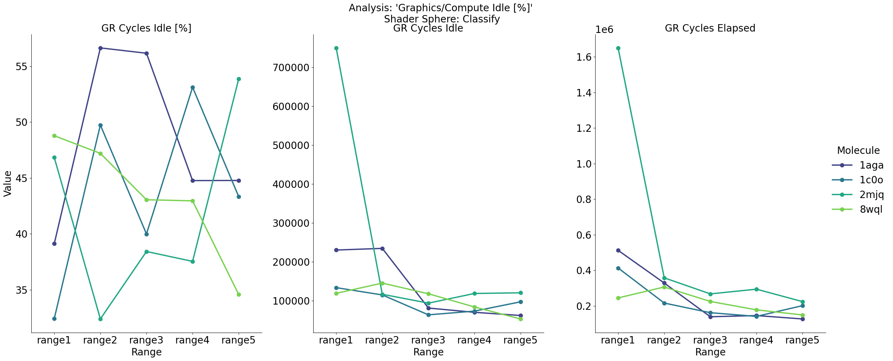

_Caption (Fig. 280): Charts showing Graphics/Compute Idle (%) for Sphere: Classify across different scenes and camera ranges. The x-axis represents the camera range (distance from the molecule), and the y-axis represents the value. Each chart has its own scale (mentioned in the title). Each line corresponds to a different scene._

##### Sphere: Sort+RLE+TileOffsets:

similar to the previous stage, but GR Cycles Elapsed shows increase across molecules and decrease with range, which is expected since the workload increases with molecule size and decreases with range. See [Fig. 281](#fig-281).

**Fig. 281**
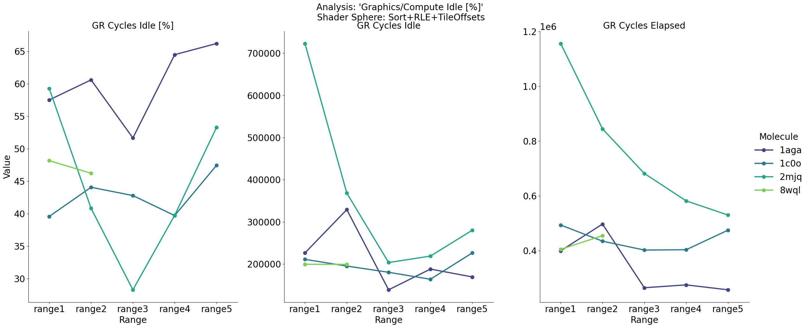

_Caption (Fig. 281): Charts showing Graphics/Compute Idle (%) for Sphere: Sort+RLE+TileOffsets across different scenes and camera ranges. The x-axis represents the camera range (distance from the molecule), and the y-axis represents the value. Each chart has its own scale (mentioned in the title). Each line corresponds to a different scene._

##### Sphere Expand WorkGroups:

similar to Classify stage, but with lower values in every metric. See [Fig. 282](#fig-282).

**Fig. 282**
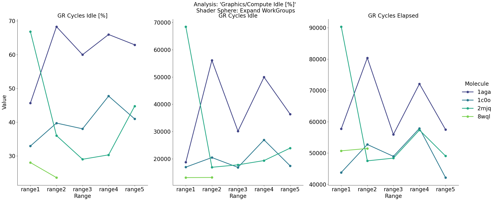

_Caption (Fig. 282): Charts showing Graphics/Compute Idle (%) for Sphere: Expand WorkGroups across different scenes and camera ranges. The x-axis represents the camera range (distance from the molecule), and the y-axis represents the value. Each chart has its own scale (mentioned in the title). Each line corresponds to a different scene._

##### Sphere Tiled Raster WG:

similar to the Sort+RLE+TileOffsets stage, with GR Cycles Idle and GR Cycles Elapsed showing decrease with range and increase with molecule size. GR Cycles Idle also shows less cycles in general, withg values lower than 150 000 cycles in most cases. Similar with GR Cycles Elapsed, showing values lower than 1 000 000 cycles in all cases but less than 400 000 in most cases. See [Fig. 283](#fig-283).

**Fig. 283**
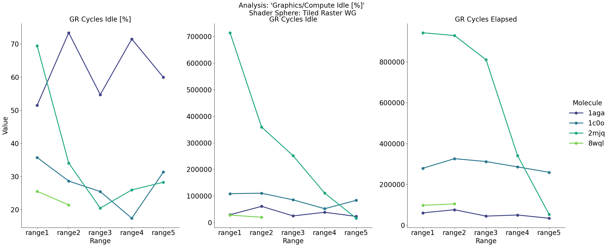

_Caption (Fig. 283): Charts showing Graphics/Compute Idle (%) for Sphere: Tiled Raster WG across different scenes and camera ranges. The x-axis represents the camera range (distance from the molecule), and the y-axis represents the value. Each chart has its own scale (mentioned in the title). Each line corresponds to a different scene._

##### Sphere Small Raster:

GR Cycles Idle [%] shows a decrease with range, with lower values for bigger molecules (1AGA between 65-75%, 8WQL around 20%). GR Cycles Elapsed shows an increase with molecule size and range, but strangely the biggest molecule shows decrease with range, which may be due to the permanent presence of small entities in the scene at any range, so it is noticed the decrease of pixels per small entity. See [Fig. 284](#fig-284).

**Fig. 284**
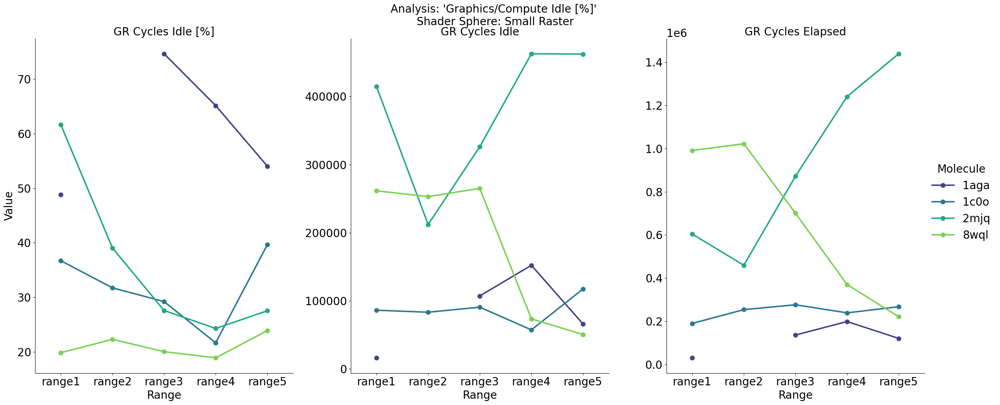

_Caption (Fig. 284): Charts showing Graphics/Compute Idle (%) for Sphere: Small Raster across different scenes and camera ranges. The x-axis represents the camera range (distance from the molecule), and the y-axis represents the value. Each chart has its own scale (mentioned in the title). Each line corresponds to a different scene._

##### Cylinder

Classify: in this case it is possible to see a pattern. For GR Cycles Idle [%] values decrease for bigger molecules, but across ranges there's no clear behaviour. It has values between 45-60% for 1AGA, and between 15-40% for 8WQL. For GR Cycles Elapsed, values decrease with range, starting in 1 000 000 cycles in the highest point and decreasing to around 200 000 cycles in the lowest point. See [Fig. 285](#fig-285).

**Fig. 285**
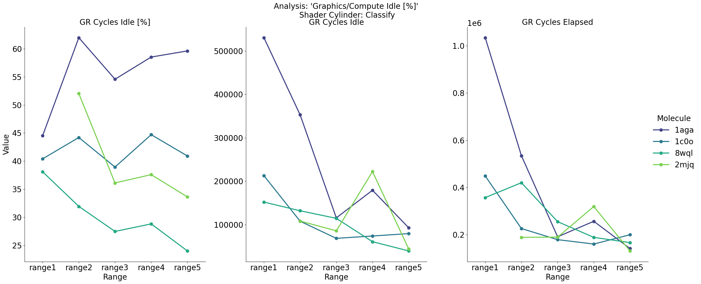

_Caption (Fig. 285): Charts showing Graphics/Compute Idle (%) for Cylinder: Classify across different scenes and camera ranges. The x-axis represents the camera range (distance from the molecule), and the y-axis represents the value. Each chart has its own scale (mentioned in the title). Each line corresponds to a different scene._

##### Cylinder: Sort+RLE+TileOffsets:

no clear pattern can be found in any metric. See [Fig. 286](#fig-286).

**Fig. 286**
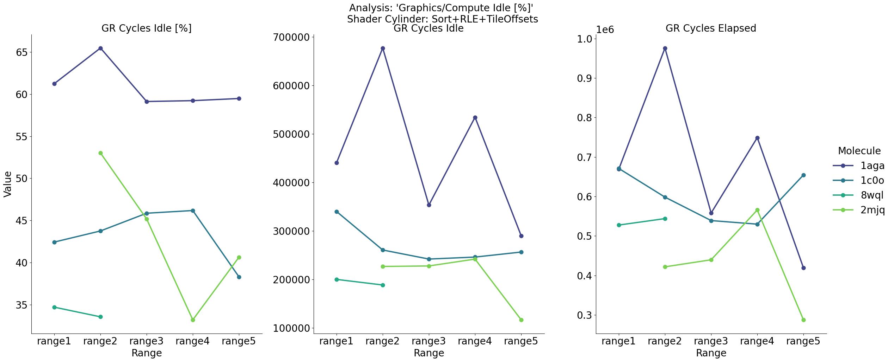

_Caption (Fig. 286): Charts showing Graphics/Compute Idle (%) for Cylinder: Sort+RLE+TileOffsets across different scenes and camera ranges. The x-axis represents the camera range (distance from the molecule), and the y-axis represents the value. Each chart has its own scale (mentioned in the title). Each line corresponds to a different scene._

##### Cylinder Expand WorkGroups:

no clear pattern can be found in any metric. It would seem as if values decreased with increasing the size of the molecule, but is not consistent across ranges. See [Fig. 287](#fig-287).

**Fig. 287**
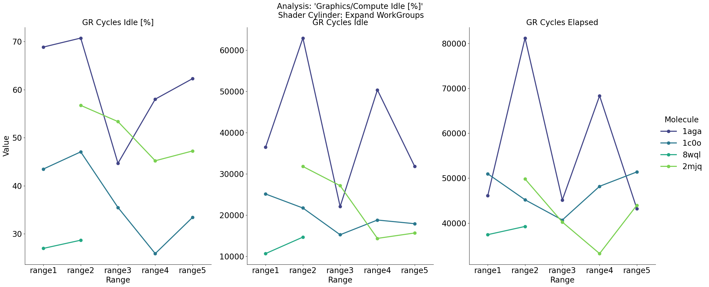

_Caption (Fig. 287): Charts showing Graphics/Compute Idle (%) for Cylinder: Expand WorkGroups across different scenes and camera ranges. The x-axis represents the camera range (distance from the molecule), and the y-axis represents the value. Each chart has its own scale (mentioned in the title). Each line corresponds to a different scene._

##### Cylinder Tiled Raster WG:

no clear pattern can be found in any metric. See [Fig. 288](#fig-288).

**Fig. 288**
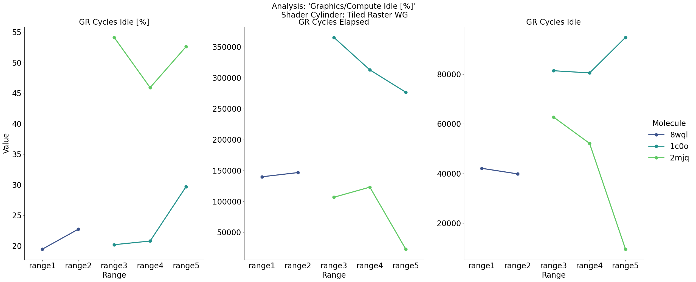

_Caption (Fig. 288): Charts showing Graphics/Compute Idle (%) for Cylinder: Tiled Raster WG across different scenes and camera ranges. The x-axis represents the camera range (distance from the molecule), and the y-axis represents the value. Each chart has its own scale (mentioned in the title). Each line corresponds to a different scene._

##### L1TEX L2 Hit Rates

##### Sphere

Classify: there is a pattern in each molecule, which shows that from range 1 to 2 (or 3) the values decrease, but from that point they increase with range. Also, it may seem that cache hit rates are higher for bigger molecules, with values between 35-50% for 1AGA, 15-25% for 1C0O, 20-30% for 2MJQ and 35-60% for 8WQL. This may be because at close ranges more tile data must be created, so more random access to memory is needed (threads doing atomic operations to create tile-entity pairs), but as range increases, more small entities appear which means just one store operation per entity, so more spatial locality and better cache hit rates. Also, bigger molecules may have better hit rates because of the larger amount of entities to process, which means more spatial locality and better cache performance. See [Fig. 289](#fig-289).

**Fig. 289**
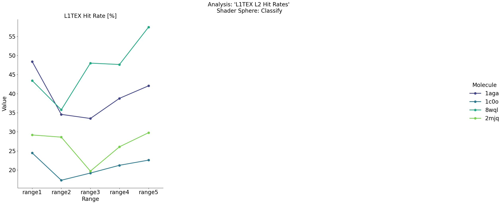

_Caption (Fig. 289): Charts showing L2 Hit Rates (%) for Sphere: Classify across different scenes and camera ranges. The x-axis represents the camera range (distance from the molecule), and the y-axis represents the value. Each chart has its own scale (mentioned in the title). Each line corresponds to a different scene._

##### Sphere: Sort+RLE+TileOffsets:

contrary to the previous stage, it may seem that there is no pattern related to the change of the size of the molecule, yet there may be a pattern related to the range, with values decreasing with it. This may be because of the same reason as before. This stage exists only when there are large entities, so with range it will diminish and less entities will be sorted/encoded, showing less memory accesses and less cache hits. Values go between 20% in lowest points and 45% in the highest points. See [Fig. 290](#fig-290).

**Fig. 290**
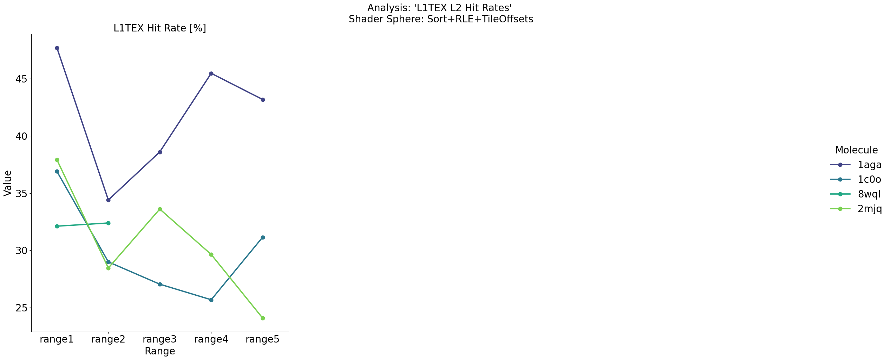

_Caption (Fig. 290): Charts showing L2 Hit Rates (%) for Sphere: Sort+RLE+TileOffsets across different scenes and camera ranges. The x-axis represents the camera range (distance from the molecule), and the y-axis represents the value. Each chart has its own scale (mentioned in the title). Each line corresponds to a different scene._

##### Sphere Expand WorkGroups:

no behaviour can be captured in this stage, having fluctuating values between 5-35%. It may seem as low cache hit rates, yet this stage is light and its purpose doesn't reside on memory accesses, so it may be that the GPU is not fully utilizing the cache for this stage. See [Fig. 291](#fig-291).

**Fig. 291**
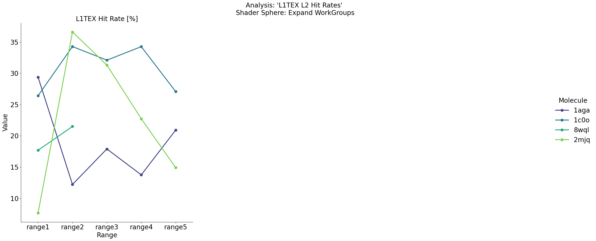

_Caption (Fig. 291): Charts showing L2 Hit Rates (%) for Sphere: Expand WorkGroups across different scenes and camera ranges. The x-axis represents the camera range (distance from the molecule), and the y-axis represents the value. Each chart has its own scale (mentioned in the title). Each line corresponds to a different scene._

##### Sphere Tiled Raster WG:

it can be seen how values decrease with range, which is expected since this stage is meant only for large entities. Close ranges must show high hit rates: close to 40% for 2MJQ, over 35% in most cases for 1C0O, but only a bit over 20% for 1AGA and 8WQL. See [Fig. 292](#fig-292).

**Fig. 292**
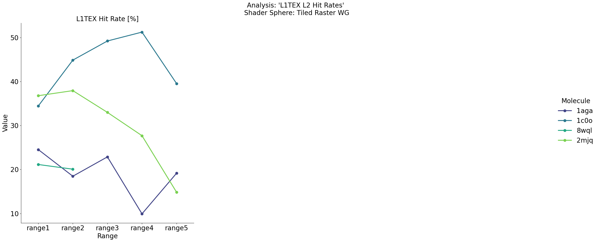

_Caption (Fig. 292): Charts showing L2 Hit Rates (%) for Sphere: Tiled Raster WG across different scenes and camera ranges. The x-axis represents the camera range (distance from the molecule), and the y-axis represents the value. Each chart has its own scale (mentioned in the title). Each line corresponds to a different scene._

##### Sphere Small Raster:

values increase with range in most cases, reaching values over 40% in some cases (8WQL). A strange behaviour can be seen for 2MJQ, which shows a decreaso across ranges, dropping from around 45% in range 1 to around 10% in range 5. This may be because of the particular distribution of entities in the scene at each range, but it is not clear. See [Fig. 293](#fig-293).

**Fig. 293**
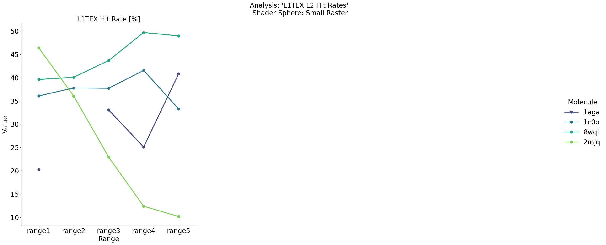

_Caption (Fig. 293): Charts showing L2 Hit Rates (%) for Sphere: Small Raster across different scenes and camera ranges. The x-axis represents the camera range (distance from the molecule), and the y-axis represents the value. Each chart has its own scale (mentioned in the title). Each line corresponds to a different scene._

##### Cylinder

Classify: show a simliar behaviour to the sphere classify stage, but showing a drastic rise in hit rates for the biggest molecule, reaching values over 50% and close to 60%in some cases. See [Fig. 294](#fig-294).

**Fig. 294**
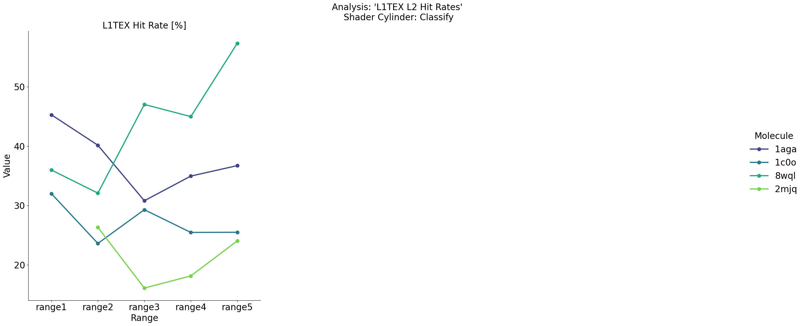

_Caption (Fig. 294): Charts showing L2 Hit Rates (%) for Cylinder: Classify across different scenes and camera ranges. The x-axis represents the camera range (distance from the molecule), and the y-axis represents the value. Each chart has its own scale (mentioned in the title). Each line corresponds to a different scene._

##### Cylinder: Sort+RLE+TileOffsets:

no clear pattern can be seen in this stage, with values fluctuating between 20-45% in most cases. See [Fig. 295](#fig-295).

**Fig. 295**
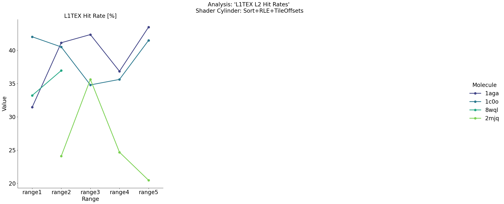

_Caption (Fig. 295): Charts showing L2 Hit Rates (%) for Cylinder: Sort+RLE+TileOffsets across different scenes and camera ranges. The x-axis represents the camera range (distance from the molecule), and the y-axis represents the value. Each chart has its own scale (mentioned in the title). Each line corresponds to a different scene._

##### Cylinder Expand WorkGroups:

same as the Sphere Expand WorkGroups stage, with no clear pattern and values. See [Fig. 296](#fig-296).

**Fig. 296**
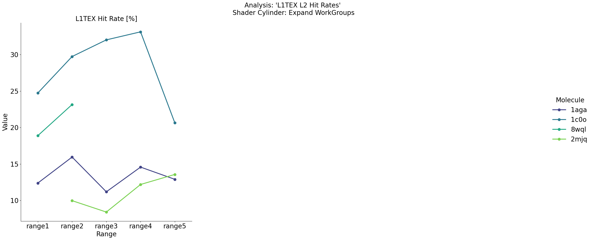

_Caption (Fig. 296): Charts showing L2 Hit Rates (%) for Cylinder: Expand WorkGroups across different scenes and camera ranges. The x-axis represents the camera range (distance from the molecule), and the y-axis represents the value. Each chart has its own scale (mentioned in the title). Each line corresponds to a different scene._

##### Cylinder Tiled Raster WG:

not enough data can be extracted from the [Fig. 297](#fig-297) to find a pattern. See [Fig. 297](#fig-297).

**Fig. 297**
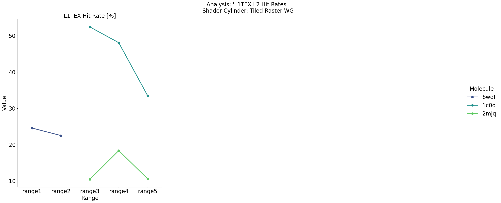

_Caption (Fig. 297): Charts showing L2 Hit Rates (%) for Cylinder: Tiled Raster WG across different scenes and camera ranges. The x-axis represents the camera range (distance from the molecule), and the y-axis represents the value. Each chart has its own scale (mentioned in the title). Each line corresponds to a different scene._

##### L1Tex Miss Sectors

##### Sphere

Classify: in [Fig. 298](#fig-298) there are interesting results. L1TEX Tag-Stage Miss Sectors Surface Store [%] tells the percentage of failures in the L1TEX cache that were caused by store operations to surfaces, which are the type of memory structure used for storing the texture of the framebuffer. Since this stage doesn't even touch the framebuffer, it was expected to have very low values (below 16%). L1TEX Tag-Stage Miss Sectors Global Atomic [%] also has low percentage of failures, since there are a lot of atomic operations but only on very few memory addresses, so the cache can easily store them and have a high hit rate, with values below 18%. L1TEX Tag-Stage Miss Sectors Global Load [%] show higher values, yet still low, with values around 15-35%, which may be because of the reading of the entities buffer, which is a global memory structure, but since it is read sequentially and with good spatial locality, the cache hit rate is not penalized much. See [Fig. 298](#fig-298).

**Fig. 298**
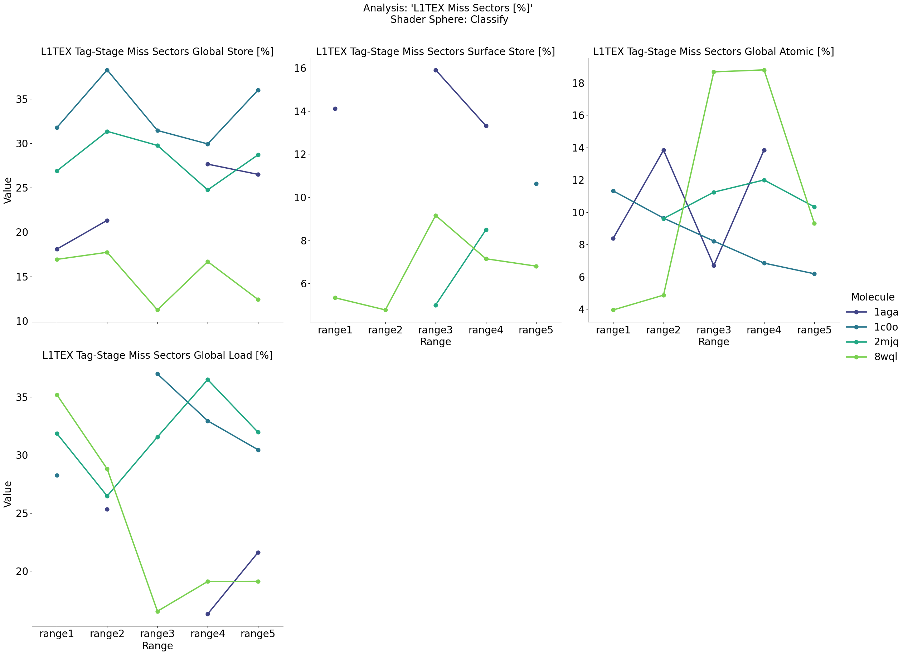

_Caption (Fig. 298): Charts showing L1 Miss Sectors for Sphere: Classify across different scenes and camera ranges. The x-axis represents the camera range (distance from the molecule), and the y-axis represents the value. Each chart has its own scale (mentioned in the title). Each line corresponds to a different scene._

##### Sphere: Sort+RLE+TileOffsets:

in this stage, L1TEX Tag-Stage Miss Sectors Surface Store [%] shows almost null values, which is expected since this stage doesn't write to the framebuffer. L1TEX Tag-Stage Miss Sectors Global Atomic [%] shows values between 0-20%, which may be expected since it is most probable that operations like Radix Sort and RLE from the CUB library are implemented with a lot of atomic operations to global memory in a sophisticated way to maximize memory and cache performance. L1TEX Tag-Stage Miss Sectors Global Store [%] shows values between 15-28%, which may be because of the writing needed for the sorting and encoding of the entities (yet still good percentages). Last is L1TEX Tag-Stage Miss Sectors Global Load [%] with higher values, between 25-45%, which may be because of the tile-entity buffer accesses, which are global memory accesses with low spatial locality and may completely change from one frame to another, so cache may not be very effective. See [Fig. 299](#fig-299).

**Fig. 299**
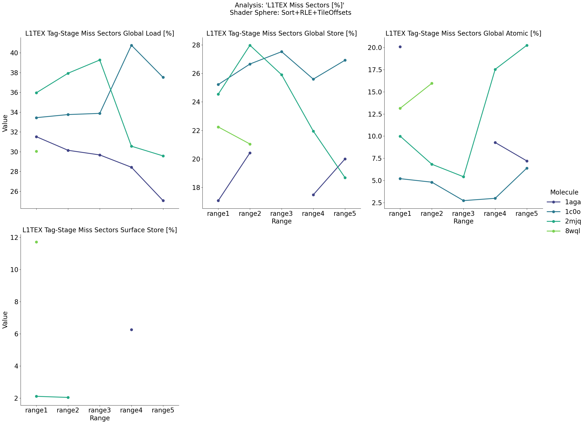

_Caption (Fig. 299): Charts showing L1 Miss Sectors for Sphere: Sort+RLE+TileOffsets across different scenes and camera ranges. The x-axis represents the camera range (distance from the molecule), and the y-axis represents the value. Each chart has its own scale (mentioned in the title). Each line corresponds to a different scene._

##### Sphere Expand WorkGroups:

not enough information can be extracted from the [Fig. 300](#fig-300). See [Fig. 300](#fig-300).

**Fig. 300**
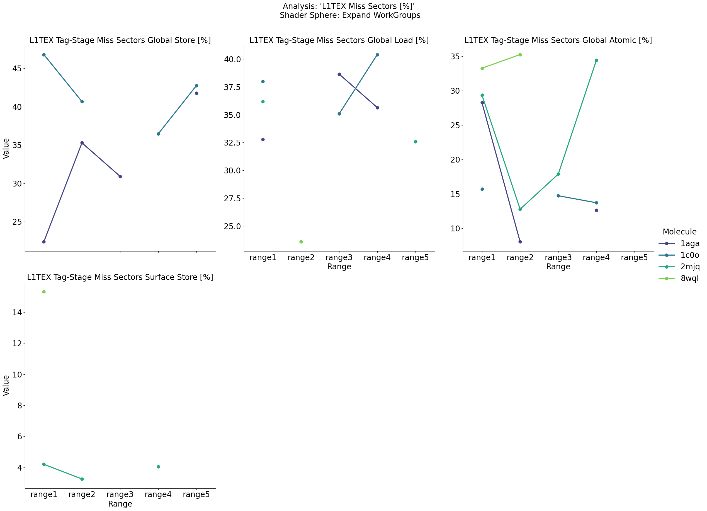

_Caption (Fig. 300): Charts showing L1 Miss Sectors for Sphere: Expand WorkGroups across different scenes and camera ranges. The x-axis represents the camera range (distance from the molecule), and the y-axis represents the value. Each chart has its own scale (mentioned in the title). Each line corresponds to a different scene._

##### Sphere Tiled Raster WG:

L1TEX Tag-Stage Miss Sectors Global Atomic [%] reaches high percentages, high as 50% for 2MJQ, around 40% for 8WQL, 15-25% for 1AGA and between 10-20% for 1C0O, which may be because all workgroups are in charge of a package of large entities of a certain tile, and each thread/pixel does exactly one atomic operation to global memory (depth buffer), so there are not repeated, coalesced nor optimized accesses and the cache is not effective (neither necessary in this case). See [Fig. 301](#fig-301).

**Fig. 301**
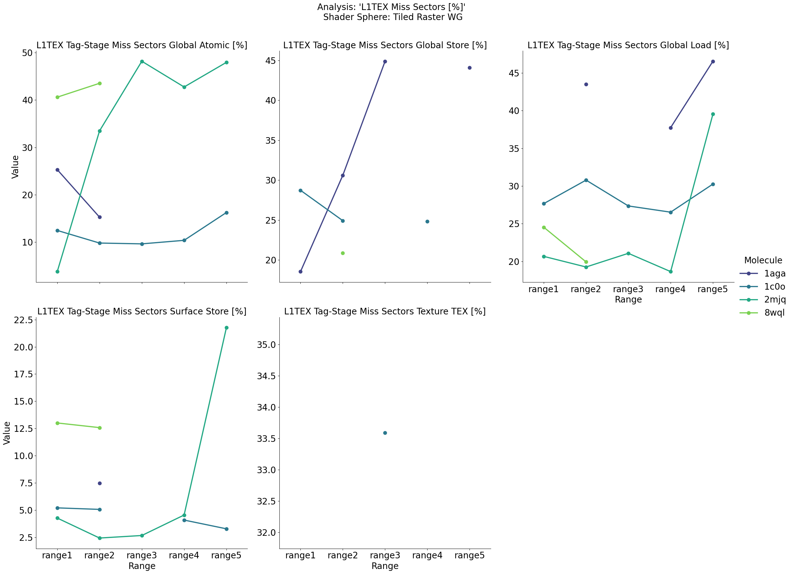

_Caption (Fig. 301): Charts showing L1 Miss Sectors for Sphere: Tiled Raster WG across different scenes and camera ranges. The x-axis represents the camera range (distance from the molecule), and the y-axis represents the value. Each chart has its own scale (mentioned in the title). Each line corresponds to a different scene._

##### Sphere Small Raster:

L1TEX Tag-Stage Miss Sectors Global Atomic [%] shows surprisingly low values for most molecules (lower than 40%), except for 2MJQ, whos values rise with range reachinng a bit over 70% at range 4, and then decreases to 70% at range 5. This may be because oof a particular distribution of the molecule, since its a molecule that, even if not compact it is still a round molecule, so each distance increases molecules at some kind of steady rate until no more spheres are culled (range 4), and then it's only a matter of pixels per sphere, reason to why there is a decrease between range 4 and 5 (less pixels imply less atomic operations). L1TEX Tag-Stage Miss Sectors Global Load [%] may be showing that misses diminish with bigger molecules, and that could be because it means more coalesced loading data of the spheres buffer so better cache performance. L1TEX Tag-Stage Miss Sectors Global Store [%] shows not enough values to see a pattern. L1TEX Tag-Stage Miss Sectors Surface Store [%] unexpectedly shows low values (lower to 14% in any case) even if the screen's texture (framebuffer) may be written at a similar rate than the depth buffer and that would mean similar behaviour to the Global Atomic sector. See [Fig. 302](#fig-302).

**Fig. 302**
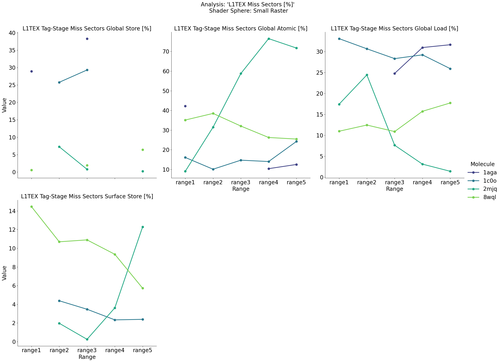

_Caption (Fig. 302): Charts showing L1 Miss Sectors for Sphere: Small Raster across different scenes and camera ranges. The x-axis represents the camera range (distance from the molecule), and the y-axis represents the value. Each chart has its own scale (mentioned in the title). Each line corresponds to a different scene._

##### Cylinder

Classify: L1TEX Tag-Stage Miss Sectors Global Store [%] (1AGA around 10-25%, 1C0O around 25-35%, 2MJQ around 15-25%, 8WQL perhaps around 10-20%) and L1TEX Tag-Stage Miss Sectors Global Load [%] (1AGA and 1C0O around 25-40%, 2MJQ and 8WQL around 15-25%) show similar behaviour, a small rise with range until range 3, then there's a drop until range 5. For Global Store may be because there are less cylinders to cull and at the same time less assignments of cylinders to tiles, and therefore less writes for large entities. But for Global Load it should be a steady line for each molecule, since all entities are read once each frame. Global Atomic slowly rises across ranges (lower than 30% in most cases) except for 8WQL, that shows a rise until range 3 and then a drop, which may be because of the same reason as before. 2MJQ doesn't show many results but it has the highest two values, with 50% at range 3 and 60% at range 4, which once again could be due to its distribution of entities. See [Fig. 303](#fig-303).

**Fig. 303**
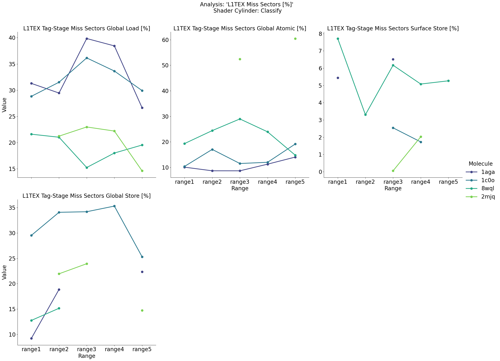

_Caption (Fig. 303): Charts showing L1 Miss Sectors for Cylinder: Classify across different scenes and camera ranges. The x-axis represents the camera range (distance from the molecule), and the y-axis represents the value. Each chart has its own scale (mentioned in the title). Each line corresponds to a different scene._

##### Cylinder: Sort+RLE+TileOffsets:

L1TEX Tag-Stage Miss Sectors Global Store [%] shows no clear pattern, with values fluctuating between 13-26% in general, so there are no alarming values. L1TEX Tag-Stage Miss Sectors Global Load [%] has steady lines for 1AGA and 1C0O, around 30% and 32 5% respectively, but 2MJQ there area lower, declining values, and 8WQL has not enough data to see a pattern (but shows lower values too). L1TEX Tag-Stage Miss Sectors Global Atomic [%] has similar behaviour: 1AGA and 1C0O show steady lines around 5% respectively, but 2MJQ and 8WQL have no pattern (but higher values). See [Fig. 304](#fig-304).

**Fig. 304**
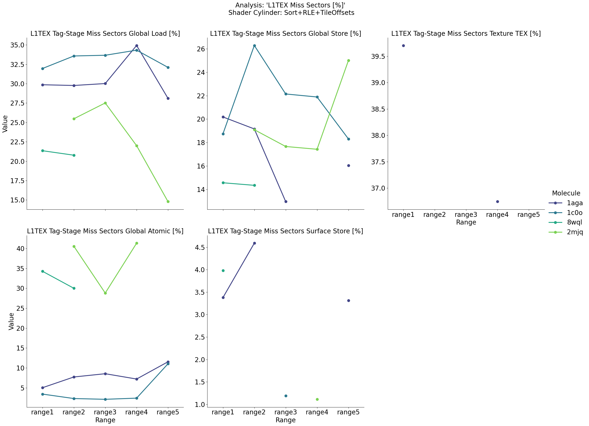

_Caption (Fig. 304): Charts showing L1 Miss Sectors for Cylinder: Sort+RLE+TileOffsets across different scenes and camera ranges. The x-axis represents the camera range (distance from the molecule), and the y-axis represents the value. Each chart has its own scale (mentioned in the title). Each line corresponds to a different scene._

##### Cylinder Expand WorkGroups:

doesn't have enough data in any case for any metric. See [Fig. 305](#fig-305).

**Fig. 305**
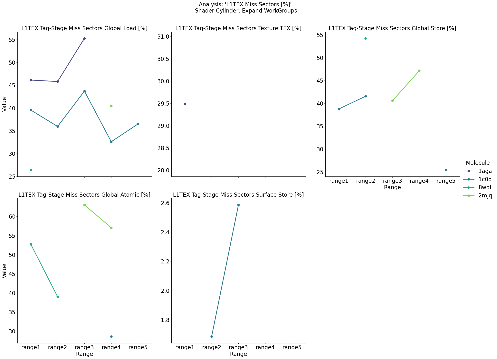

_Caption (Fig. 305): Charts showing L1 Miss Sectors for Cylinder: Expand WorkGroups across different scenes and camera ranges. The x-axis represents the camera range (distance from the molecule), and the y-axis represents the value. Each chart has its own scale (mentioned in the title). Each line corresponds to a different scene._

##### Cylinder Tiled Raster WG:

same as the previous stage. See [Fig. 306](#fig-306).

**Fig. 306**
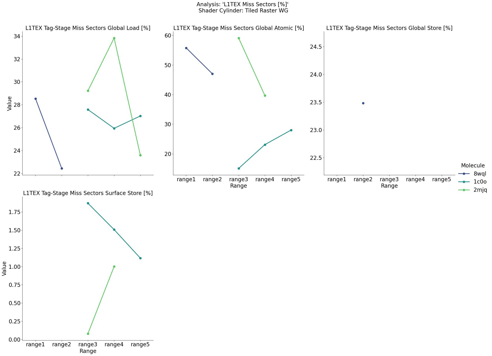

_Caption (Fig. 306): Charts showing L1 Miss Sectors for Cylinder: Tiled Raster WG across different scenes and camera ranges. The x-axis represents the camera range (distance from the molecule), and the y-axis represents the value. Each chart has its own scale (mentioned in the title). Each line corresponds to a different scene._

##### L1TEX Sectors [\%]

##### Sphere

Classify: For a certain range and a specific molecule, the sum of all sectors is close to 100% due to the nature of this metric counters. L1TEX Tag-Stage Sectors Surface Store [%] shows higher values across ranges and for smaller molecules (1AGA 55-65%, 1C0O 45-55%, 2MJQ 25-40% and 8WQL 15-25%), that may be because other memory accesses have worse cache performance in those cases, for example Global Store (1AGA 30-35%, 1C0O 35-45%, 2MJQ 25-35% and 8WQL 10-20%) may be showing lowering values across ranges, but Global Load (1AGA 20-30%, 1C0O 30-40%, 2MJQ 40-50% and 8WQL 55-65%) shows higher values across ranges and for bigger molecules, which may be because for small spheres predominates the writing of the tile-entity pairs, which can be seen as Global/Surface Stores, while for bigger scenes predominates the reading of the entities buffer. See [Fig. 307](#fig-307).

**Fig. 307**
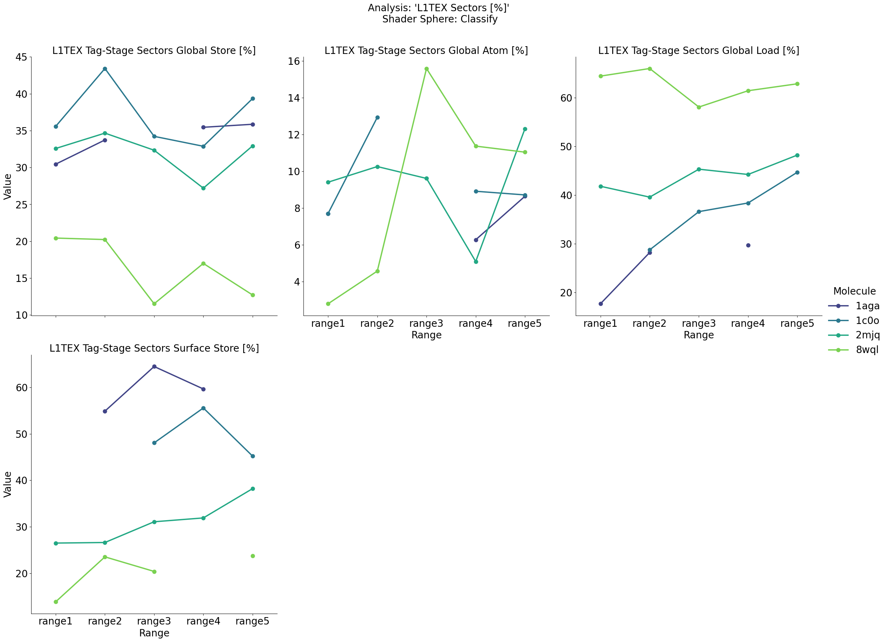

_Caption (Fig. 307): Charts showing L1TEX Sectors (%) for Sphere: Classify across different scenes and camera ranges. The x-axis represents the camera range (distance from the molecule), and the y-axis represents the value. Each chart has its own scale (mentioned in the title). Each line corresponds to a different scene._

##### Sphere: Sort+RLE+TileOffsets:

there is no clear pattern, yet by looking at the values of each Figure it can be seen that Global Load predominates on the use of the cache over all metrics, followed by Global Store and then by Global Atomic. See [Fig. 308](#fig-308).

**Fig. 308**
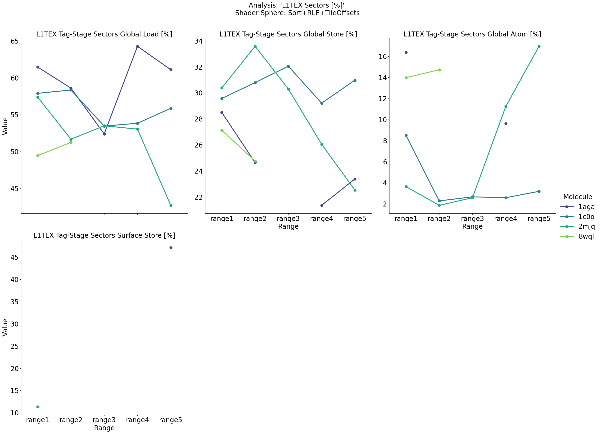

_Caption (Fig. 308): Charts showing L1TEX Sectors (%) for Sphere: Sort+RLE+TileOffsets across different scenes and camera ranges. The x-axis represents the camera range (distance from the molecule), and the y-axis represents the value. Each chart has its own scale (mentioned in the title). Each line corresponds to a different scene._

##### Sphere Expand WorkGroups:

same as the previous stage. See [Fig. 309](#fig-309).

**Fig. 309**
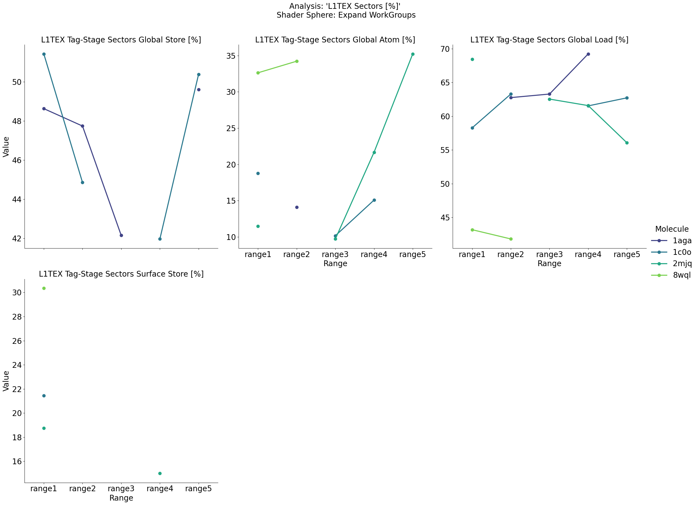

_Caption (Fig. 309): Charts showing L1TEX Sectors (%) for Sphere: Expand WorkGroups across different scenes and camera ranges. The x-axis represents the camera range (distance from the molecule), and the y-axis represents the value. Each chart has its own scale (mentioned in the title). Each line corresponds to a different scene._

##### Sphere Tiled Raster WG:

shows similar behaviour as before, but with some variations. Global Load shows decline across ranges, with values around 60-65% in close ranges, dropping to values around 50-60% for farther ranges (except 8WQL, without enough data). Global Store has not enough results, only certain values. Surface Store also shows decline with range, 8WQL going from 27 5% to 25% from range 1 to 2, 1C0O going from 23% to 15% and 2MJQ going from 17 5% to 13%. Finally, Global Atomic has no real pattern; 1AGA has only values on two points, with 16% at range 2 and 18% at range 4, 1C0O has almost steady values around 10% and 2MJQ goes from 10% at range 1 to over 40% at range 5. It can be concluded that reading operations are predominant in the use of the cache since they make good use of shared memory and spheres have good space locality, then atomic operations are in command of triggering a buffer storing operation. See [Fig. 310](#fig-310).

**Fig. 310**
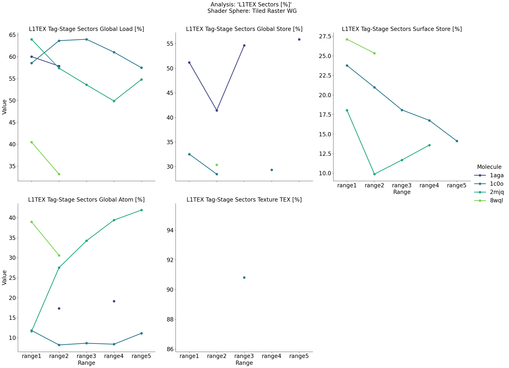

_Caption (Fig. 310): Charts showing L1TEX Sectors (%) for Sphere: Tiled Raster WG across different scenes and camera ranges. The x-axis represents the camera range (distance from the molecule), and the y-axis represents the value. Each chart has its own scale (mentioned in the title). Each line corresponds to a different scene._

##### Sphere Small Raster:

this stage shows a similar behaviour to the last stage, with the difference that for Global Atomic 2MJQ has a explosive increase with range, showing 80% for range 3 and 4. See [Fig. 311](#fig-311).

**Fig. 311**
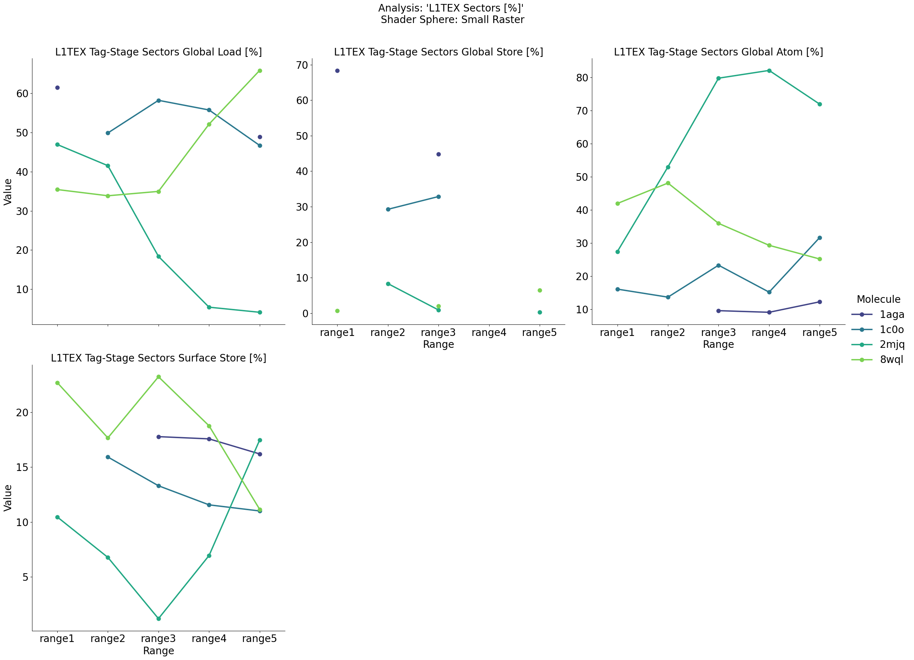

_Caption (Fig. 311): Charts showing L1TEX Sectors (%) for Sphere: Small Raster across different scenes and camera ranges. The x-axis represents the camera range (distance from the molecule), and the y-axis represents the value. Each chart has its own scale (mentioned in the title). Each line corresponds to a different scene._

##### Cylinder

Classify: similar to the Sphere Classify stage. See [Fig. 312](#fig-312).

**Fig. 312**
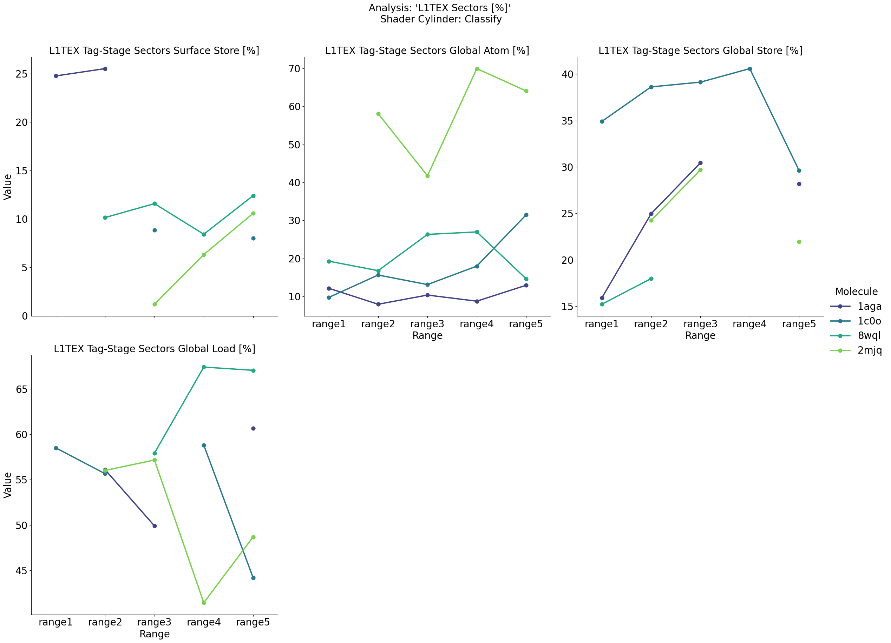

_Caption (Fig. 312): Charts showing L1TEX Sectors (%) for Cylinder: Classify across different scenes and camera ranges. The x-axis represents the camera range (distance from the molecule), and the y-axis represents the value. Each chart has its own scale (mentioned in the title). Each line corresponds to a different scene._

##### Cylinder: Sort+RLE+TileOffsets:

in this case it is possible to see some patterns for Global Load, showing little variation across ranges; 1AGA 45-55%, 1C0O 60-65%, 2MJQ 38-43% and 8WQL 55-60%. Global Store has no clear pattern, but values are between 20-32% in most cases. Global Atomic shows lower values for smaller molecules, with values between 5-10% for 1AGA and 1C0O, but around 35% for 2MJQ and around 20% for 8WQL. Small molecules do not have many memory accesses so it is expected to have lower values for Global Atomic. See [Fig. 313](#fig-313).

**Fig. 313**
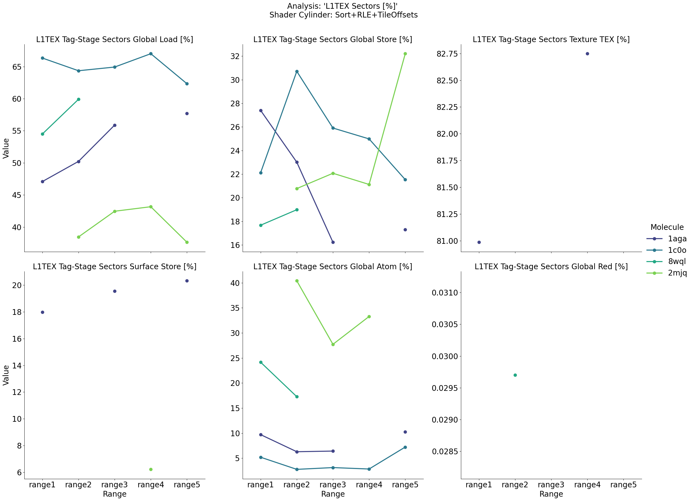

_Caption (Fig. 313): Charts showing L1TEX Sectors (%) for Cylinder: Sort+RLE+TileOffsets across different scenes and camera ranges. The x-axis represents the camera range (distance from the molecule), and the y-axis represents the value. Each chart has its own scale (mentioned in the title). Each line corresponds to a different scene._

##### Cylinder Expand WorkGroups:

not enough data can be extracted from the [Fig. 314](#fig-314). See [Fig. 314](#fig-314).

**Fig. 314**
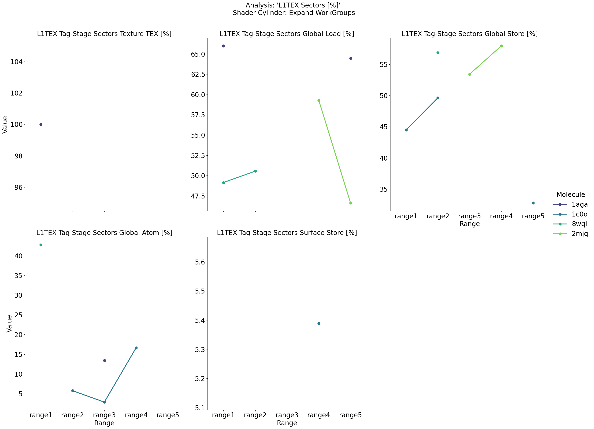

_Caption (Fig. 314): Charts showing L1TEX Sectors (%) for Cylinder: Expand WorkGroups across different scenes and camera ranges. The x-axis represents the camera range (distance from the molecule), and the y-axis represents the value. Each chart has its own scale (mentioned in the title). Each line corresponds to a different scene._

##### Cylinder Tiled Raster WG:

not enough data can be extracted from the [Fig. 315](#fig-315). See [Fig. 315](#fig-315).

**Fig. 315**
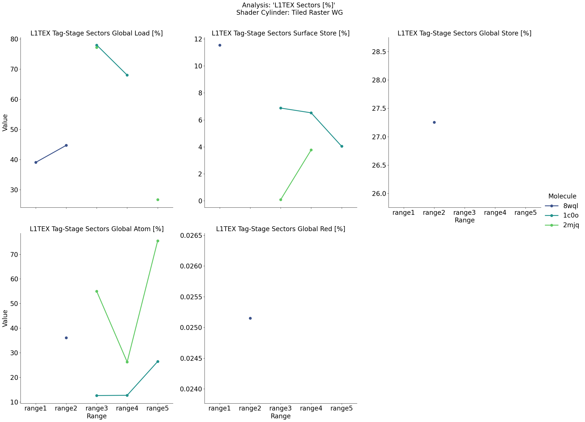

_Caption (Fig. 315): Charts showing L1TEX Sectors (%) for Cylinder: Tiled Raster WG across different scenes and camera ranges. The x-axis represents the camera range (distance from the molecule), and the y-axis represents the value. Each chart has its own scale (mentioned in the title). Each line corresponds to a different scene._

##### Unit Throughputs

##### Sphere

Classify: it is possible to see the main metric on the Figure. PCle Throughput has no growth over ranges nor molecule sizes, with values between 20-35%, which means that the GPU is not waiting for data from the CPU in a harmful way to performance. Same with SM Issue Active, that shows low values in all cases, reaching 25% at range 4 of 8WQL, so instructions are not flooding the GPU. The last metric worth mentioning is the SM Pipe FMA Active, which shows a growth with range only for 8WQL, which may due to having more entities to process and therefore more culling operations. See [Fig. 316](#fig-316).

**Fig. 316**
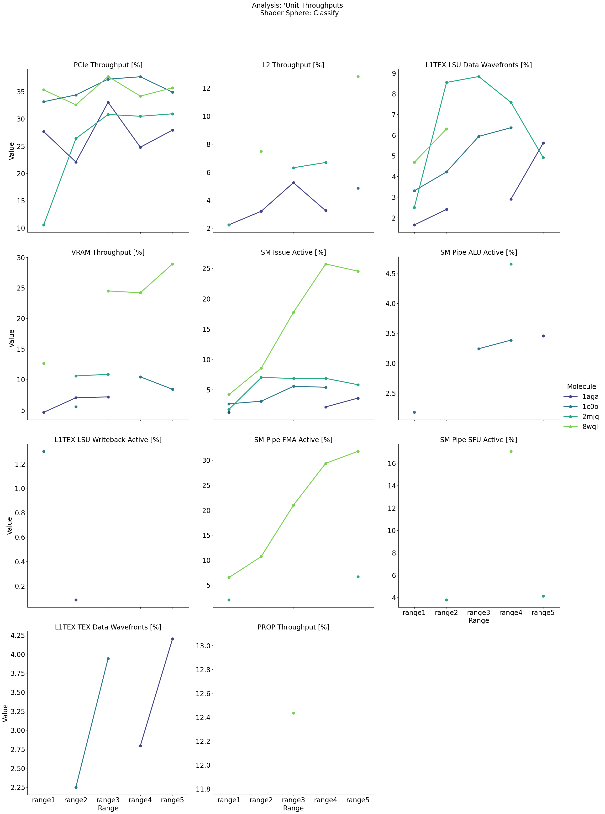

_Caption (Fig. 316): Charts showing Unit Throughputs (%) for Sphere: Classify across different scenes and camera ranges. The x-axis represents the camera range (distance from the molecule), and the y-axis represents the value. Each chart has its own scale (mentioned in the title). Each line corresponds to a different scene._

##### Sphere: Sort+RLE+TileOffsets:

only PCle Throughput is worth mentioning, and also expected, strangely noting that values increase with range in all molecules except for 8WQL. One could think that across ranges it would only decrease since entities take less space in the screen and therefore less data should be sorted and encoded, but it may be that this stage takes little time so PCle Throughput becomes predominant in unit's activivty. See [Fig. 317](#fig-317).

**Fig. 317**
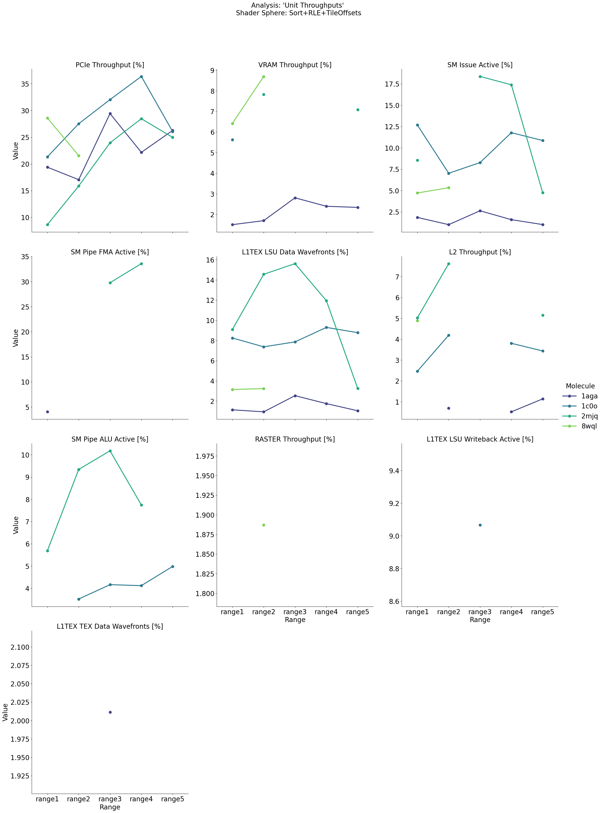

_Caption (Fig. 317): Charts showing Unit Throughputs (%) for Sphere: Sort+RLE+TileOffsets across different scenes and camera ranges. The x-axis represents the camera range (distance from the molecule), and the y-axis represents the value. Each chart has its own scale (mentioned in the title). Each line corresponds to a different scene._

##### Sphere Expand WorkGroups:

[Fig. 318](#fig-318) shows many metrics, yet most of them don't have enough results to analyze. PCle Throughput has values lower to 27 5% in all cases, so it doesn't represent a bottleneck for performance. SM Issue Active showed a high value only for range 3 of 2MJQ, with 40%, but in general it is low. Al the other metrics have low values, with no clear pattern, maybe because this stage is light and doesn't have a clear bottleneck operation. See [Fig. 318](#fig-318).

**Fig. 318**
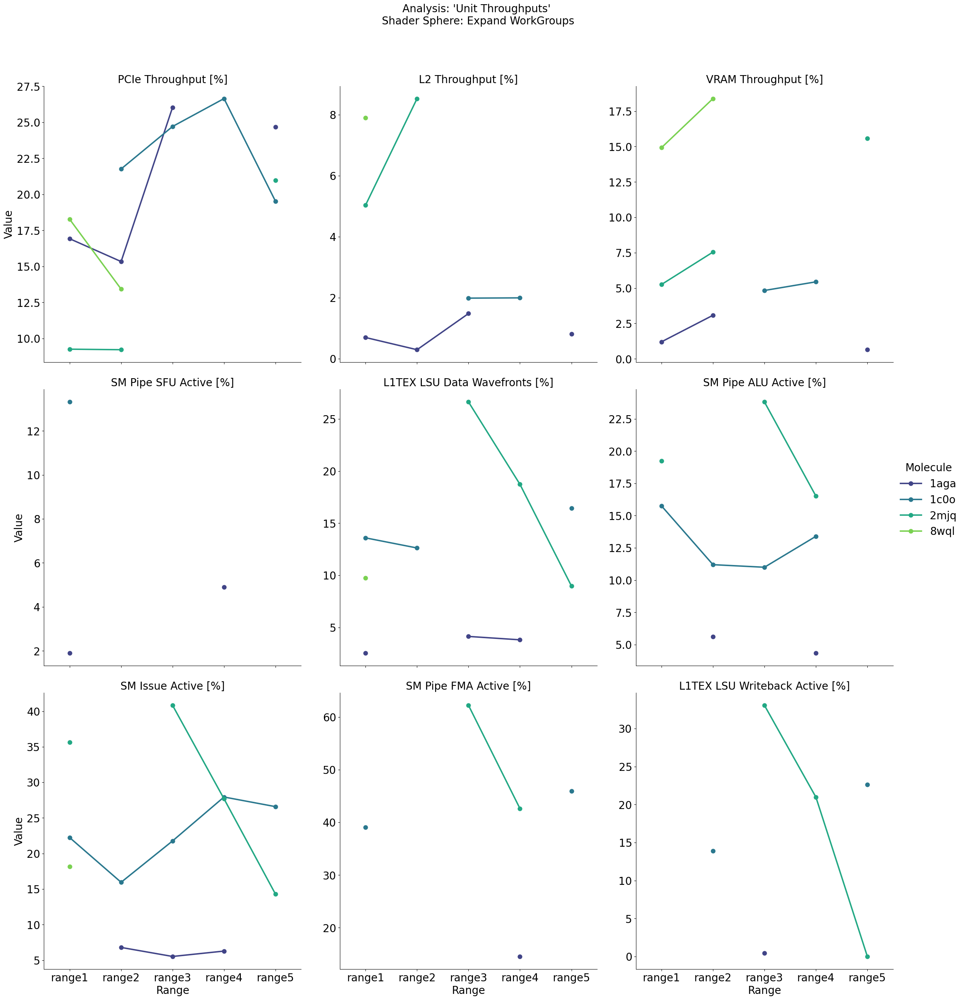

_Caption (Fig. 318): Charts showing Unit Throughputs (%) for Sphere: Expand WorkGroups across different scenes and camera ranges. The x-axis represents the camera range (distance from the molecule), and the y-axis represents the value. Each chart has its own scale (mentioned in the title). Each line corresponds to a different scene._

##### Sphere Tiled Raster WG:

similar as before, [Fig. 319](#fig-319) has not enough data to analyze, but SM Issue Active showed a spike at range 3 of 2MJQ, with 50%, meaning that this stage could manifest a bottleneck, maybe because of large amounts of entities that are really close to each other in some cases so a lot of instructions are issued, same with SM Pipe FMA Active. Yet the duration of this frame may discard this as a bottleneck. See [Fig. 319](#fig-319).

**Fig. 319**
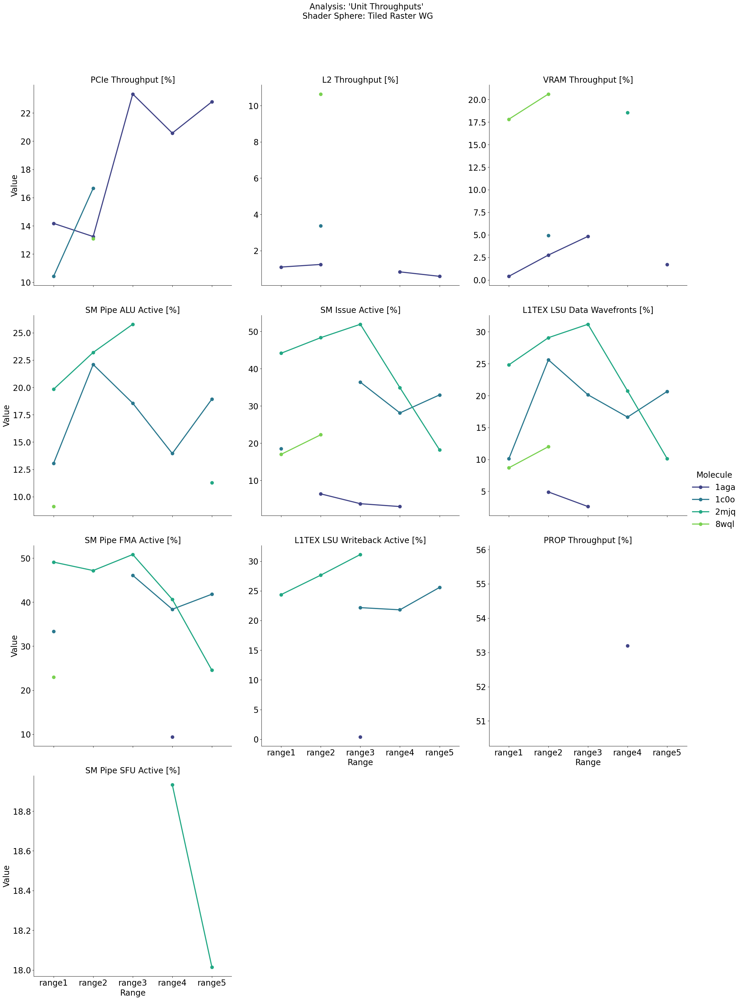

_Caption (Fig. 319): Charts showing Unit Throughputs (%) for Sphere: Tiled Raster WG across different scenes and camera ranges. The x-axis represents the camera range (distance from the molecule), and the y-axis represents the value. Each chart has its own scale (mentioned in the title). Each line corresponds to a different scene._

##### Sphere Small Raster:

it shows similar behaviour as the previous stage, but it must be added that 8WQL (the biggest molecule) is the one that shows the highest values for SM Pipe SFU Active, SM Pipe FMA Active and SM Issue Active, which may be because of the large amount of entities to process. It is also noted that this stage takes little time to finish. See [Fig. 320](#fig-320).

**Fig. 320**
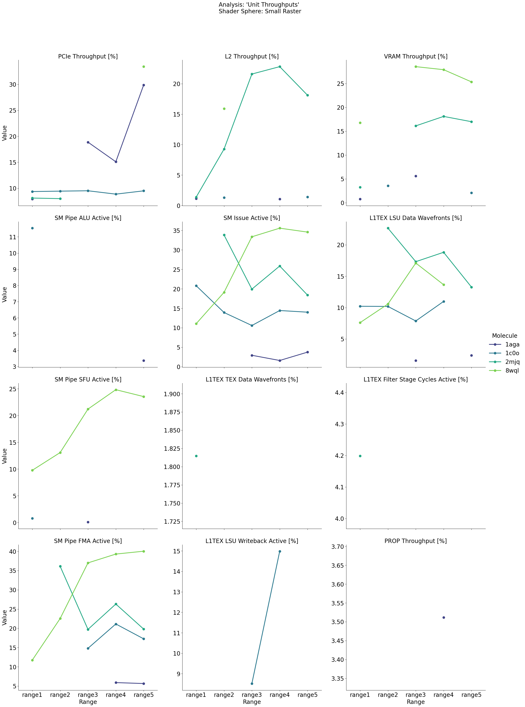

_Caption (Fig. 320): Charts showing Unit Throughputs (%) for Sphere: Small Raster across different scenes and camera ranges. The x-axis represents the camera range (distance from the molecule), and the y-axis represents the value. Each chart has its own scale (mentioned in the title). Each line corresponds to a different scene._

##### Cylinder

Classify: similar to the Sphere Classify stage. See [Fig. 321](#fig-321).

**Fig. 321**
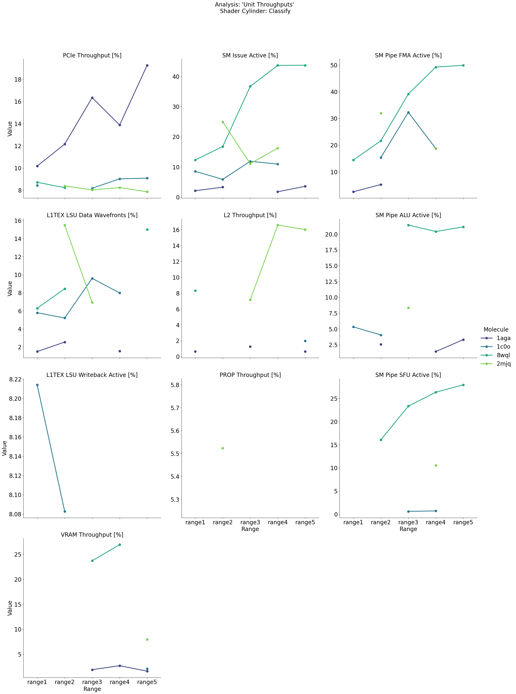

_Caption (Fig. 321): Charts showing Unit Throughputs (%) for Cylinder: Classify across different scenes and camera ranges. The x-axis represents the camera range (distance from the molecule), and the y-axis represents the value. Each chart has its own scale (mentioned in the title). Each line corresponds to a different scene._

##### Cylinder: Sort+RLE+TileOffsets:

all metrics show usages lower than 20%, so no bottleneck can be identified in this stage. See [Fig. 322](#fig-322).

**Fig. 322**
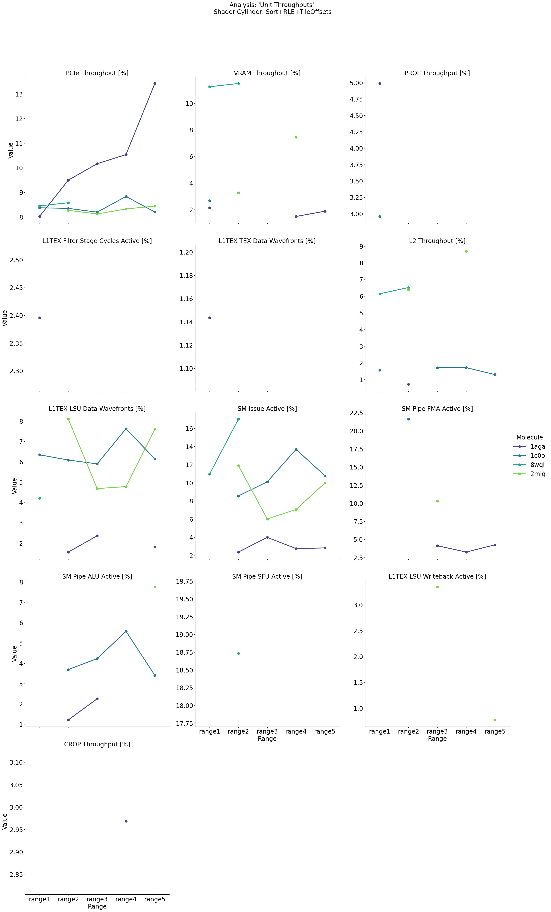

_Caption (Fig. 322): Charts showing Unit Throughputs (%) for Cylinder: Sort+RLE+TileOffsets across different scenes and camera ranges. The x-axis represents the camera range (distance from the molecule), and the y-axis represents the value. Each chart has its own scale (mentioned in the title). Each line corresponds to a different scene._

##### Cylinder Expand WorkGroups:

not enough results, only some points for SM Issue Active have high values, around 40-50% for 1C0O in range 2 and 3. See [Fig. 323](#fig-323).

**Fig. 323**
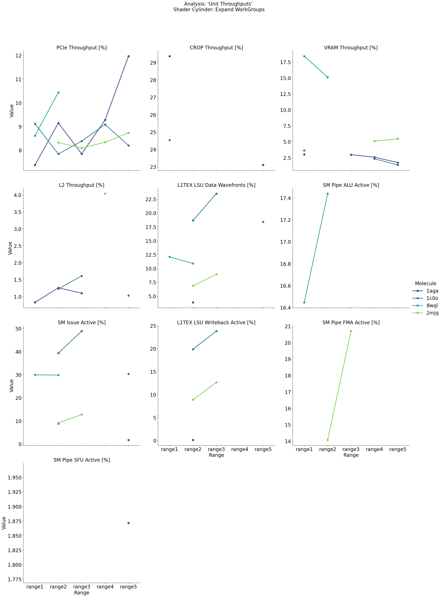

_Caption (Fig. 323): Charts showing Unit Throughputs (%) for Cylinder: Expand WorkGroups across different scenes and camera ranges. The x-axis represents the camera range (distance from the molecule), and the y-axis represents the value. Each chart has its own scale (mentioned in the title). Each line corresponds to a different scene._

##### Cylinder Tiled Raster WG:

1AGA doesn't even have data for Unit Throughput, and 1C0O and 2MJQ have not enough data to see a pattern. SM Issue Active and SM Pipe FMA Active show high values for 1C0O at range 3, maybe because a balance of enough entities and bigger enough to occupie the GPU with instructions. See [Fig. 324](#fig-324).

**Fig. 324**
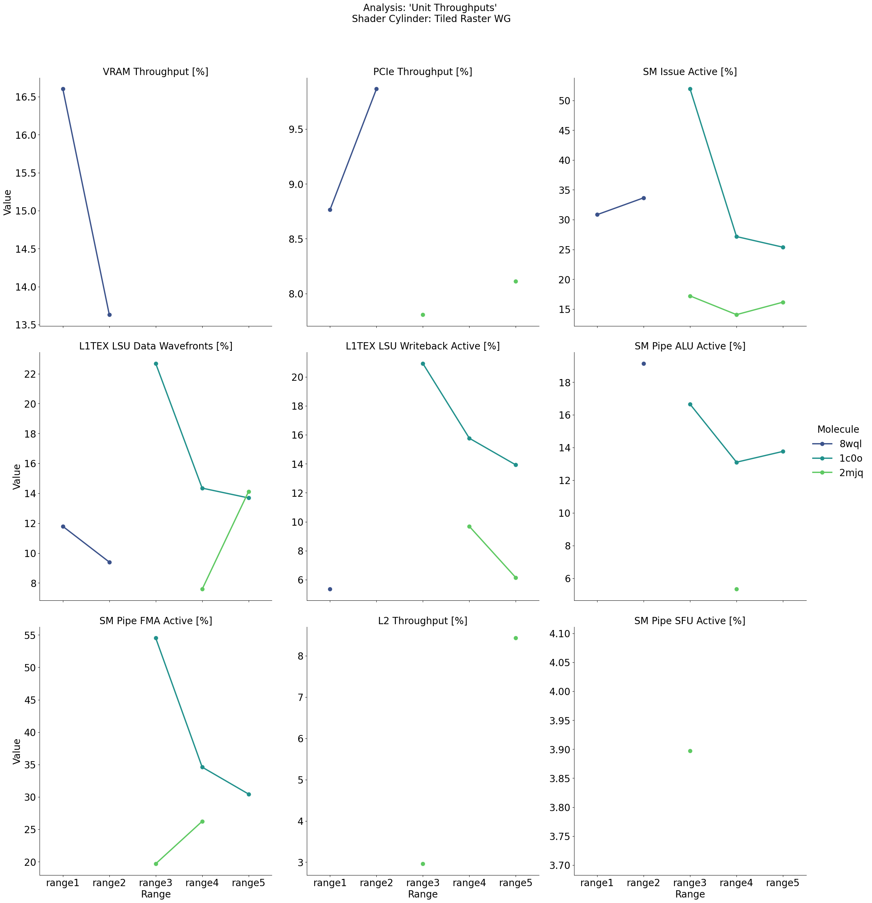

_Caption (Fig. 324): Charts showing Unit Throughputs (%) for Cylinder: Tiled Raster WG across different scenes and camera ranges. The x-axis represents the camera range (distance from the molecule), and the y-axis represents the value. Each chart has its own scale (mentioned in the title). Each line corresponds to a different scene._

##### SM Warp Occupancy [Warps Per Cycle] \& [\%]

##### Sphere

Classify: in most cases it can be seen that the amount of warps per cycle grows with range, mabye because this stage is embarrassingly parallel, but large entities take more time to process than small ones, so close ranges could be taking more time to process than farther ranges, without handing over the resources. A spike in warps used is seen for 8WQL in [Fig. 325](#fig-325). See [Fig. 325](#fig-325) and [Fig. 326](#fig-326).

**Fig. 325**
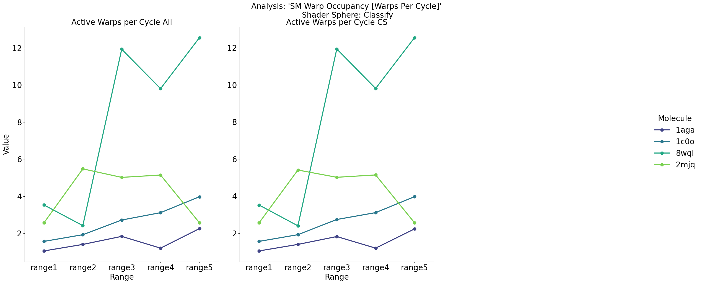

_Caption (Fig. 325): Charts showing SM Warp Occupancy (Warps Per Cycle) for Sphere: Classify across different scenes and camera ranges. The x-axis represents the camera range (distance from the molecule), and the y-axis represents the value. Each chart has its own scale (mentioned in the title). Each line corresponds to a different scene._

**Fig. 326**
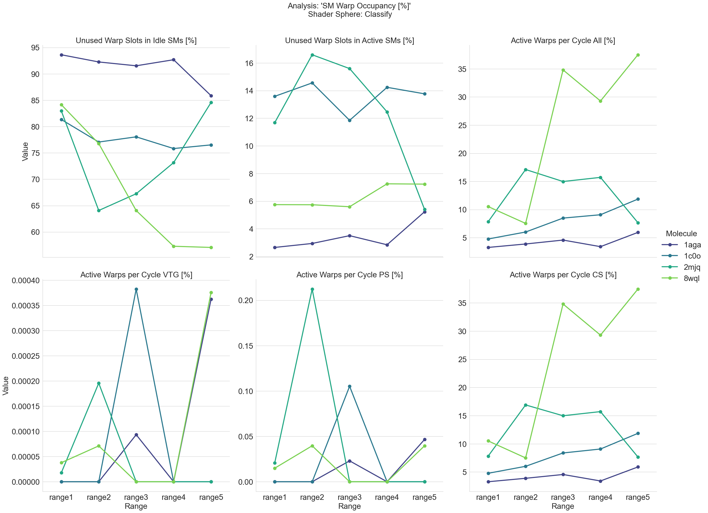

_Caption (Fig. 326): Charts showing SM Warp Occupancy (%) for Sphere: Classify across different scenes and camera ranges. The x-axis represents the camera range (distance from the molecule), and the y-axis represents the value. Each chart has its own scale (mentioned in the title). Each line corresponds to a different scene._

##### Sphere: Sort+RLE+TileOffsets:

just as in previous sections, this stage expectedly shows how Active Warps increase over closer ranges ([Fig. 327](#fig-327)), but then there is a decline. Also it can be seent that more warps are used for bigger molecules. This may be because of the amount of entities on each scene, and the increase\-decrease comes from the drop of the amount of large entities to sort/encode. In [Fig. 328](#fig-328) it can be seen that Unused Warp Slots in Idle SMs [%] is high in all cases, but Unused Warp Slots in Active SMs [%] is low, which means that the GPU is not fully occupied but the warps that are active are doing useful work and resources are efficiently utilized. See [Fig. 327](#fig-327) and [Fig. 328](#fig-328).

**Fig. 327**
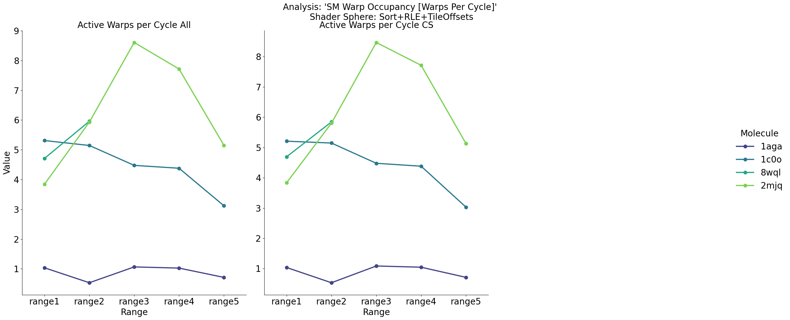

_Caption (Fig. 327): Charts showing SM Warp Occupancy (Warps Per Cycle) for Sphere: Sort+RLE+TileOffsets across different scenes and camera ranges. The x-axis represents the camera range (distance from the molecule), and the y-axis represents the value. Each chart has its own scale (mentioned in the title). Each line corresponds to a different scene._

**Fig. 328**
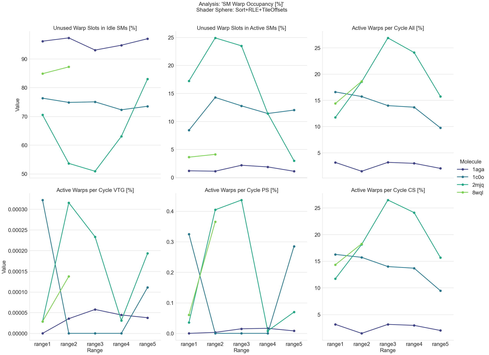

_Caption (Fig. 328): Charts showing SM Warp Occupancy (%) for Sphere: Sort+RLE+TileOffsets across different scenes and camera ranges. The x-axis represents the camera range (distance from the molecule), and the y-axis represents the value. Each chart has its own scale (mentioned in the title). Each line corresponds to a different scene._

##### Sphere Expand WorkGroups:

in [Fig. 329](#fig-329) it can be seen that the amount of warps may greatly vary across molecules, reaching high values for 2MJQ and 8WQL, with 20 warps per cycle in range 3 for 2MJQ (limit of 32 on Turing architecture). In [Fig. 330](#fig-330) it can be seen that Unused Warp Slots in Idle SMs [%] is high in all cases, but Unused Warp Slots, same as before, is low, meaning that GPU is working effectively with the active warps. See [Fig. 329](#fig-329) and [Fig. 330](#fig-330).

**Fig. 329**
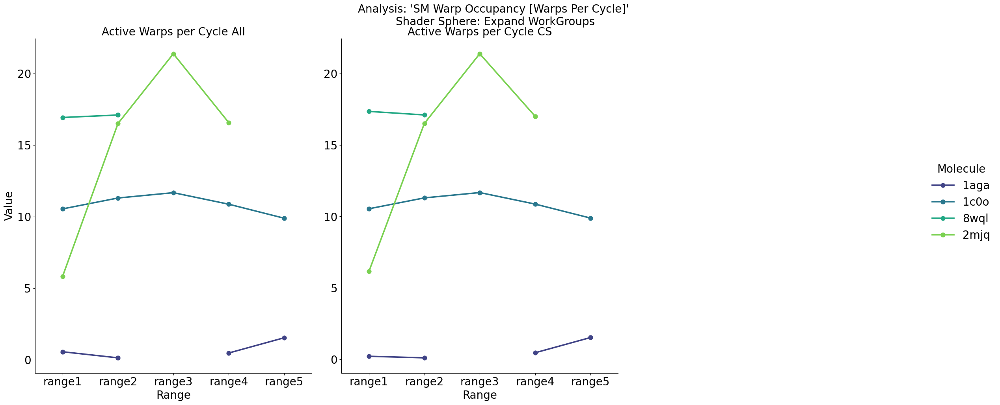

_Caption (Fig. 329): Charts showing SM Warp Occupancy (Warps Per Cycle) for Sphere: Expand WorkGroups across different scenes and camera ranges. The x-axis represents the camera range (distance from the molecule), and the y-axis represents the value. Each chart has its own scale (mentioned in the title). Each line corresponds to a different scene._

**Fig. 330**
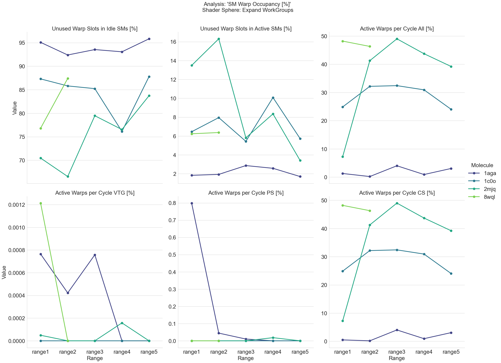

_Caption (Fig. 330): Charts showing SM Warp Occupancy (%) for Sphere: Expand WorkGroups across different scenes and camera ranges. The x-axis represents the camera range (distance from the molecule), and the y-axis represents the value. Each chart has its own scale (mentioned in the title). Each line corresponds to a different scene._

##### Sphere Tiled Raster WG:

Active Warps per Cycle All/CS show that active warps increase with range until range 3, then it declines, as expected of the kernel for large entities. [Fig. 331](#fig-331) shows high values on max points (20 Active Warps for 2MJQ and 17 5 for 8WQL). In [Fig. 332](#fig-332) Unused Warp Slots in Idle SMs [%] and Unused Warp Slots in Active SMs [%] show similar behaviour as before. See [Fig. 331](#fig-331) and [Fig. 332](#fig-332).

**Fig. 331**
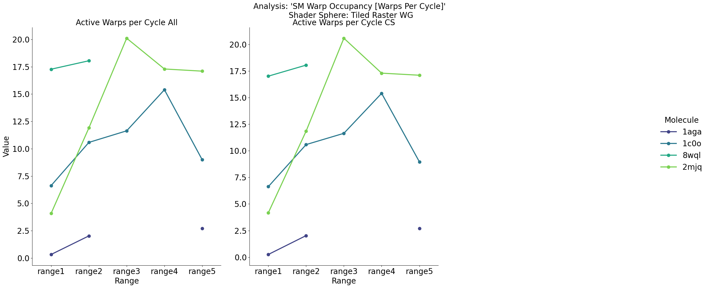

_Caption (Fig. 331): Charts showing SM Warp Occupancy (Warps Per Cycle) for Sphere: Tiled Raster WG across different scenes and camera ranges. The x-axis represents the camera range (distance from the molecule), and the y-axis represents the value. Each chart has its own scale (mentioned in the title). Each line corresponds to a different scene._

**Fig. 332**
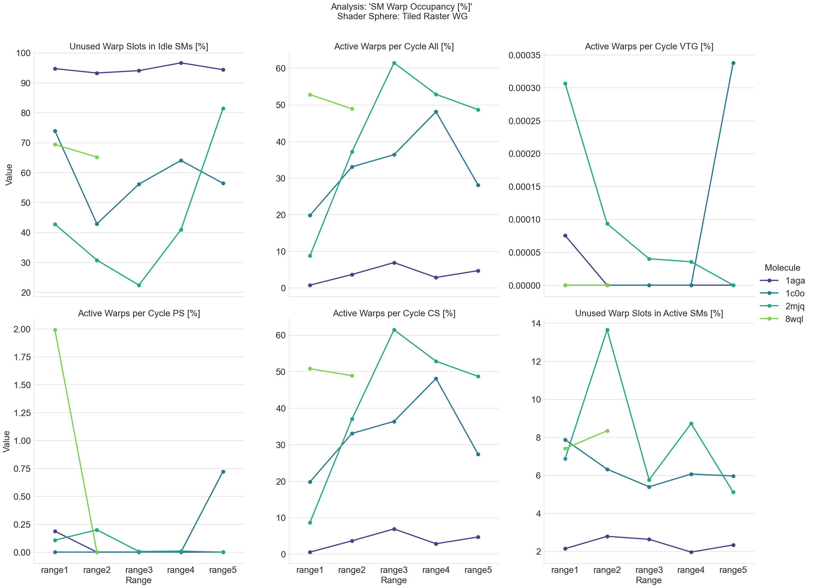

_Caption (Fig. 332): Charts showing SM Warp Occupancy (%) for Sphere: Tiled Raster WG across different scenes and camera ranges. The x-axis represents the camera range (distance from the molecule), and the y-axis represents the value. Each chart has its own scale (mentioned in the title). Each line corresponds to a different scene._

##### Sphere Small Raster:

in [Fig. 333](#fig-333) there is a similar behaviour as before, but because once there is no more spheres to cull, the difference is made by the amount of pixels to process. [Fig. 334](#fig-334) Unused Warp Slots in Active SMs [%] is also similar, but there are values a bit bigger, meaning that this stage may not be as efficient (or heavy) as the Tiled Raster. Unused Warp Slots in Idle SMs [%] is different since it can be seen that for bigger molecules the percentage is lower, meaning that the GPU is occupied but not with active warps, maybe waiting for instructions or registers. See [Fig. 333](#fig-333) and [Fig. 334](#fig-334).

**Fig. 333**
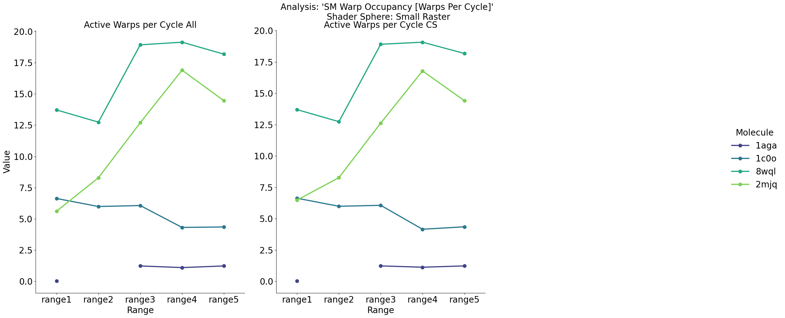

_Caption (Fig. 333): Charts showing SM Warp Occupancy (Warps Per Cycle) for Sphere: Small Raster across different scenes and camera ranges. The x-axis represents the camera range (distance from the molecule), and the y-axis represents the value. Each chart has its own scale (mentioned in the title). Each line corresponds to a different scene._

**Fig. 334**
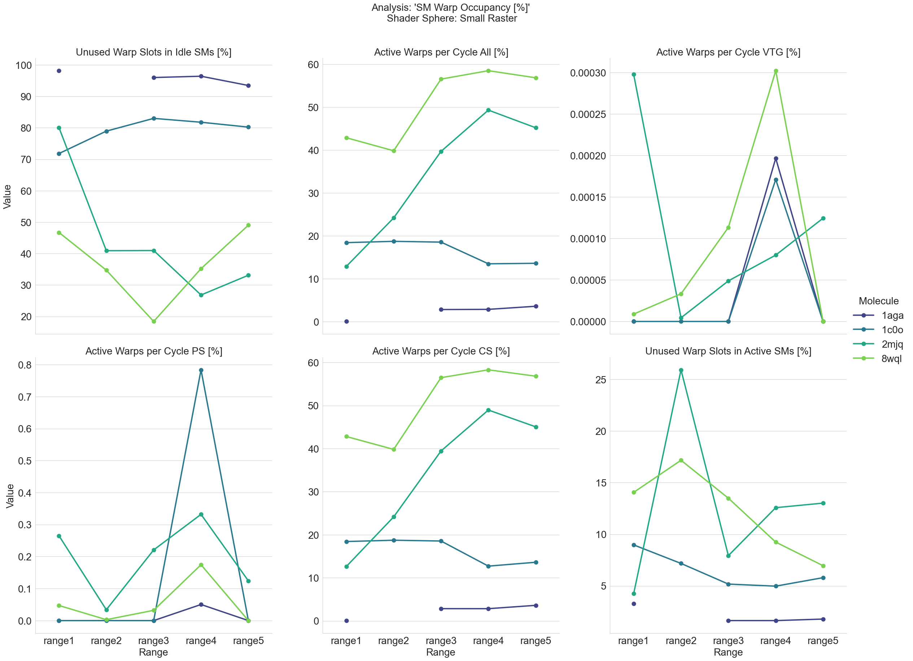

_Caption (Fig. 334): Charts showing SM Warp Occupancy (%) for Sphere: Small Raster across different scenes and camera ranges. The x-axis represents the camera range (distance from the molecule), and the y-axis represents the value. Each chart has its own scale (mentioned in the title). Each line corresponds to a different scene._

##### Cylinder

Classify: [Fig. 335](#fig-335) shows use of even less warps than the Sphere Classify stage. On the other hand, [Fig. 336](#fig-336) is similar. See [Fig. 335](#fig-335) and [Fig. 336](#fig-336).

**Fig. 335**
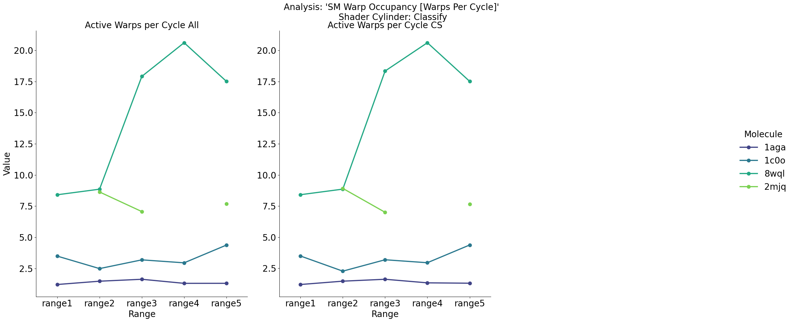

_Caption (Fig. 335): Charts showing SM Warp Occupancy (Warps Per Cycle) for Cylinder: Classify across different scenes and camera ranges. The x-axis represents the camera range (distance from the molecule), and the y-axis represents the value. Each chart has its own scale (mentioned in the title). Each line corresponds to a different scene._

**Fig. 336**
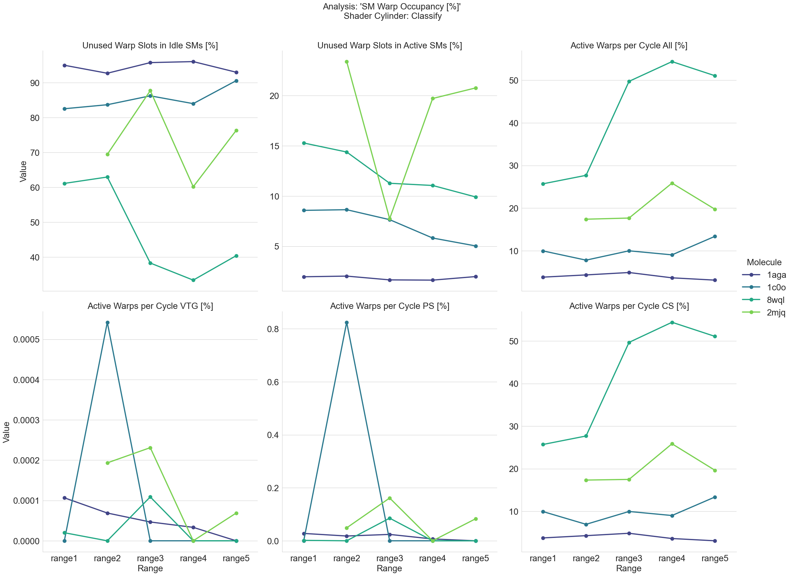

_Caption (Fig. 336): Charts showing SM Warp Occupancy (%) for Cylinder: Classify across different scenes and camera ranges. The x-axis represents the camera range (distance from the molecule), and the y-axis represents the value. Each chart has its own scale (mentioned in the title). Each line corresponds to a different scene._

##### Cylinder: Sort+RLE+TileOffsets:

[Fig. 337](#fig-337) shows low usage of active warps with no clear pattern, same as in [Fig. 338](#fig-338), where Unused Warp Slots in Idle SMs [%] is high and Unused Warp Slots in Active SMs [%] is low. That could mean that this stage is not heavy enough to fully occupy the GPU, but the warps that are active are doing useful work and resources are efficiently utilized. See [Fig. 337](#fig-337) and [Fig. 338](#fig-338).

**Fig. 337**
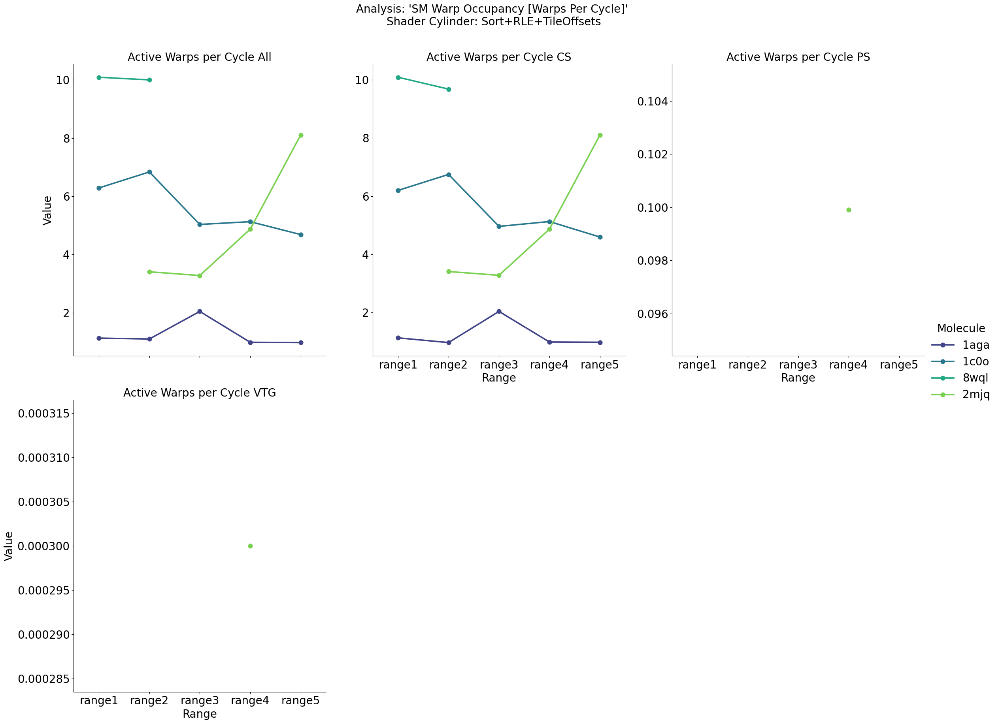

_Caption (Fig. 337): Charts showing SM Warp Occupancy (Warps Per Cycle) for Cylinder: Sort+RLE+TileOffsets across different scenes and camera ranges. The x-axis represents the camera range (distance from the molecule), and the y-axis represents the value. Each chart has its own scale (mentioned in the title). Each line corresponds to a different scene._

**Fig. 338**
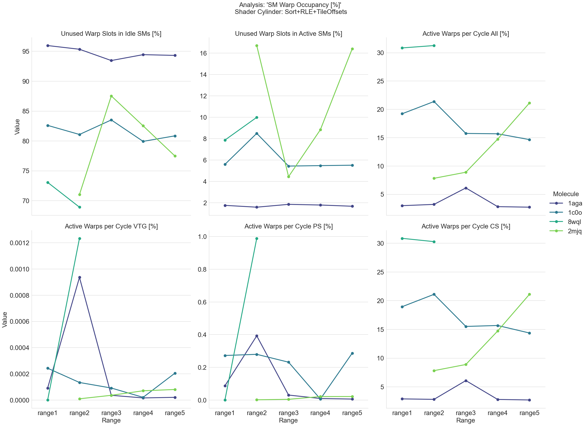

_Caption (Fig. 338): Charts showing SM Warp Occupancy (%) for Cylinder: Sort+RLE+TileOffsets across different scenes and camera ranges. The x-axis represents the camera range (distance from the molecule), and the y-axis represents the value. Each chart has its own scale (mentioned in the title). Each line corresponds to a different scene._

##### Cylinder Expand WorkGroups:

similar as previous stages, there is not enough data to see a clear pattern. See [Fig. 339](#fig-339) and [Fig. 340](#fig-340).

**Fig. 339**
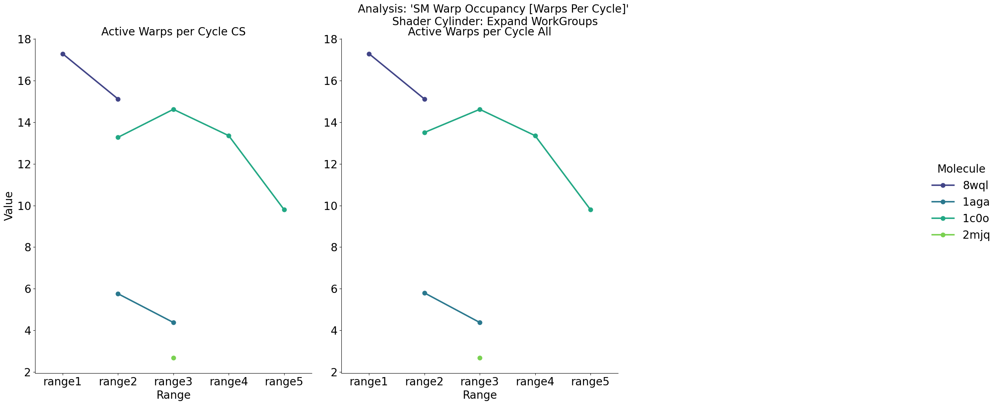

_Caption (Fig. 339): Charts showing SM Warp Occupancy (Warps Per Cycle) for Cylinder: Expand WorkGroups across different scenes and camera ranges. The x-axis represents the camera range (distance from the molecule), and the y-axis represents the value. Each chart has its own scale (mentioned in the title). Each line corresponds to a different scene._

**Fig. 340**
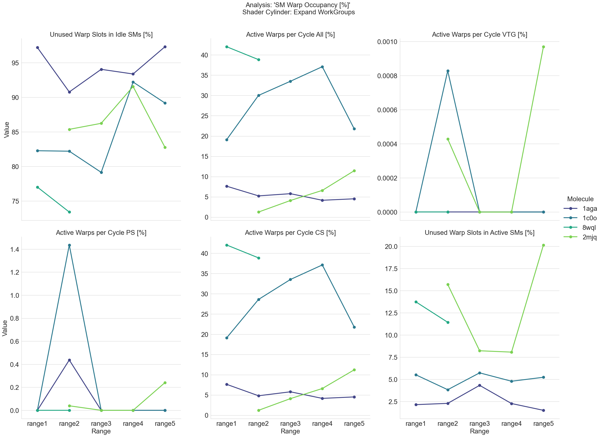

_Caption (Fig. 340): Charts showing SM Warp Occupancy (%) for Cylinder: Expand WorkGroups across different scenes and camera ranges. The x-axis represents the camera range (distance from the molecule), and the y-axis represents the value. Each chart has its own scale (mentioned in the title). Each line corresponds to a different scene._

##### Cylinder Tiled Raster WG:

not enough data to analyze. See [Fig. 341](#fig-341) and [Fig. 342](#fig-342).

**Fig. 341**
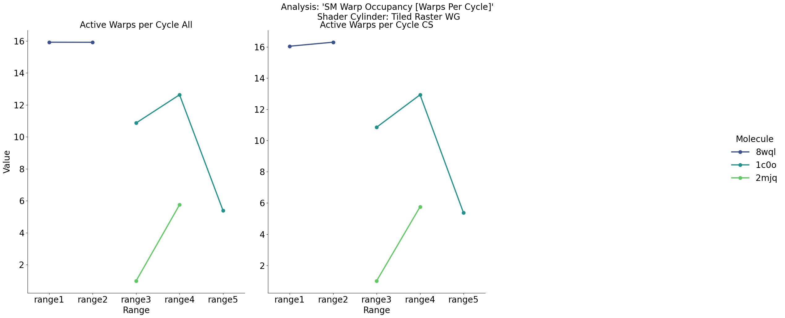

_Caption (Fig. 341): Charts showing SM Warp Occupancy (Warps Per Cycle) for Cylinder: Tiled Raster WG across different scenes and camera ranges. The x-axis represents the camera range (distance from the molecule), and the y-axis represents the value. Each chart has its own scale (mentioned in the title). Each line corresponds to a different scene._

**Fig. 342**
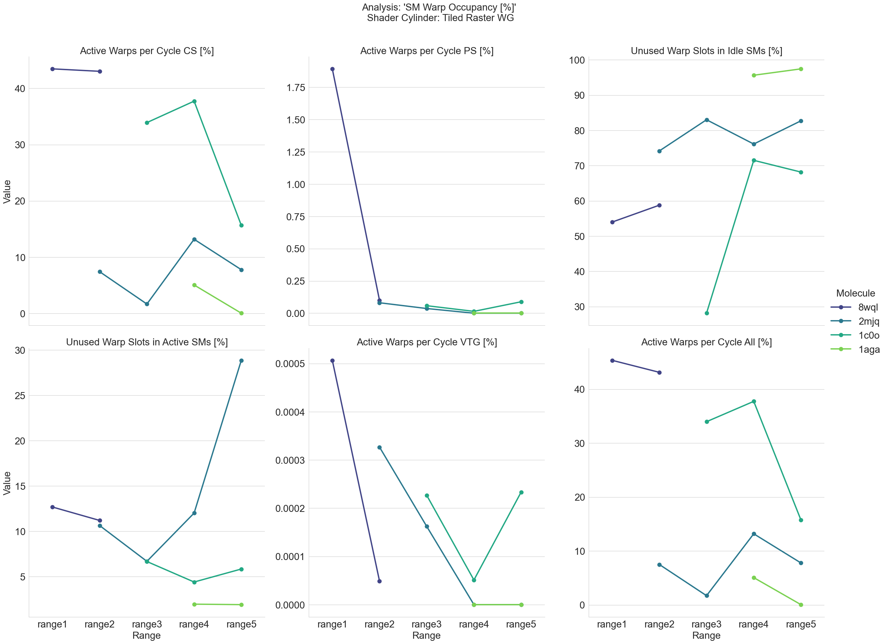

_Caption (Fig. 342): Charts showing SM Warp Occupancy (%) for Cylinder: Tiled Raster WG across different scenes and camera ranges. The x-axis represents the camera range (distance from the molecule), and the y-axis represents the value. Each chart has its own scale (mentioned in the title). Each line corresponds to a different scene._

##### Cumulative Warp Latencies [\%] \& [Cycles]

##### Sphere

Classify: Logically all Warp Latencies come from "Compute" Shaders (kernels may be looked as the same) so from here on the percentages don't really say much. [Fig. 344](#fig-344), [Fig. 346](#fig-346), [Fig. 348](#fig-348), [Fig. 350](#fig-350), [Fig. 352](#fig-352), [Fig. 354](#fig-354), [Fig. 356](#fig-356), [Fig. 358](#fig-358) and [Fig. 360](#fig-360) may show latencies from PS (Pixel Shader) warps, but that is just noise coming of shared hardware resources. As for cycles, it can be seen that [Fig. 343](#fig-343) shows a growth with range, with values of less than a million for 1AGA, around 1 and 2 million for 1C0O, around 2 and 4 million for 8WQL and more or less the same for 2MJQ, but with a spike at range 1 reaching 10 million cycles. See [Fig. 343](#fig-343) and [Fig. 344](#fig-344).

**Fig. 343**
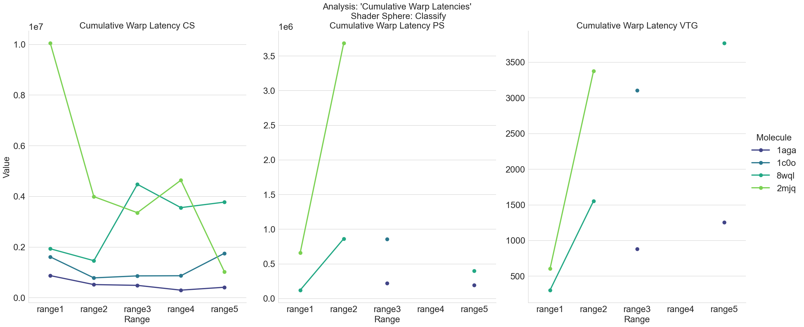

_Caption (Fig. 343): Charts showing Cumulative Warp Latencies (Cycles) for Sphere: Classify across different scenes and camera ranges. The x-axis represents the camera range (distance from the molecule), and the y-axis represents the value. Each chart has its own scale (mentioned in the title). Each line corresponds to a different scene._

**Fig. 344**
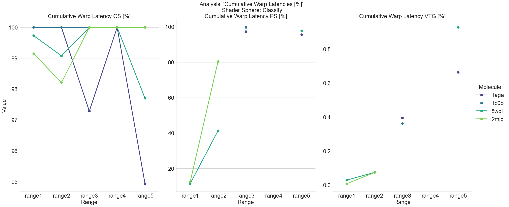

_Caption (Fig. 344): Charts showing Cumulative Warp Latencies (%) for Sphere: Classify across different scenes and camera ranges. The x-axis represents the camera range (distance from the molecule), and the y-axis represents the value. Each chart has its own scale (mentioned in the title). Each line corresponds to a different scene._

##### Sphere: Sort+RLE+TileOffsets:

similar to the previous stage. See [Fig. 345](#fig-345) and [Fig. 346](#fig-346).

**Fig. 345**
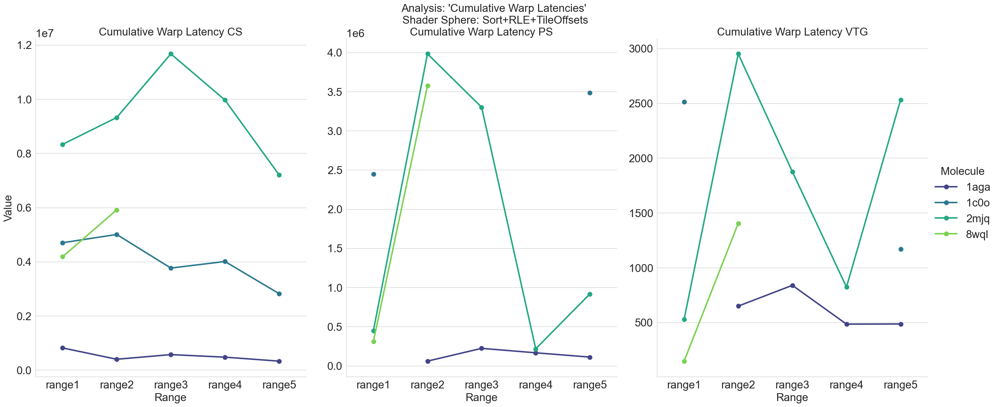

_Caption (Fig. 345): Charts showing Cumulative Warp Latencies (Cycles) for Sphere: Sort+RLE+TileOffsets across different scenes and camera ranges. The x-axis represents the camera range (distance from the molecule), and the y-axis represents the value. Each chart has its own scale (mentioned in the title). Each line corresponds to a different scene._

**Fig. 346**
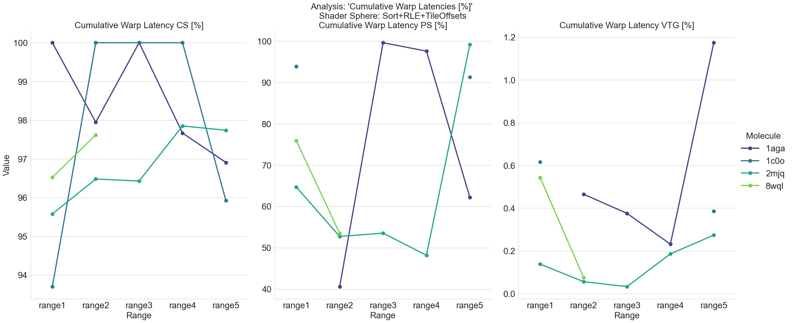

_Caption (Fig. 346): Charts showing Cumulative Warp Latencies (%) for Sphere: Sort+RLE+TileOffsets across different scenes and camera ranges. The x-axis represents the camera range (distance from the molecule), and the y-axis represents the value. Each chart has its own scale (mentioned in the title). Each line corresponds to a different scene._

##### Sphere Expand WorkGroups:

similar to the previous stage. See [Fig. 347](#fig-347) and [Fig. 348](#fig-348).

**Fig. 347**
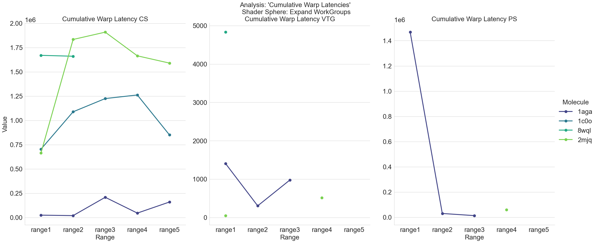

_Caption (Fig. 347): Charts showing Cumulative Warp Latencies (Cycles) for Sphere: Expand WorkGroups across different scenes and camera ranges. The x-axis represents the camera range (distance from the molecule), and the y-axis represents the value. Each chart has its own scale (mentioned in the title). Each line corresponds to a different scene._

**Fig. 348**
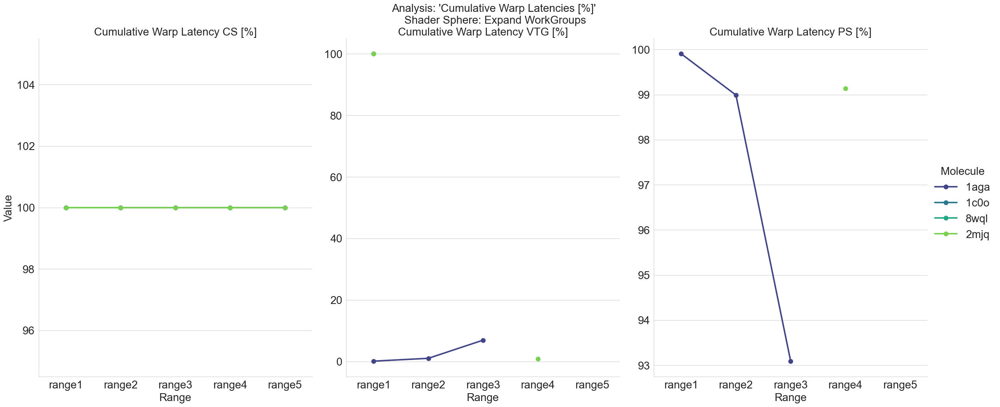

_Caption (Fig. 348): Charts showing Cumulative Warp Latencies (%) for Sphere: Expand WorkGroups across different scenes and camera ranges. The x-axis represents the camera range (distance from the molecule), and the y-axis represents the value. Each chart has its own scale (mentioned in the title). Each line corresponds to a different scene._

##### Sphere Tiled Raster WG:

similar to the previous stage with the difference that 2MJQ and 8WQL show a decline from medium ranges to farther ranges, once again may be because of the decrease of large entities. See [Fig. 349](#fig-349) and [Fig. 350](#fig-350).

**Fig. 349**
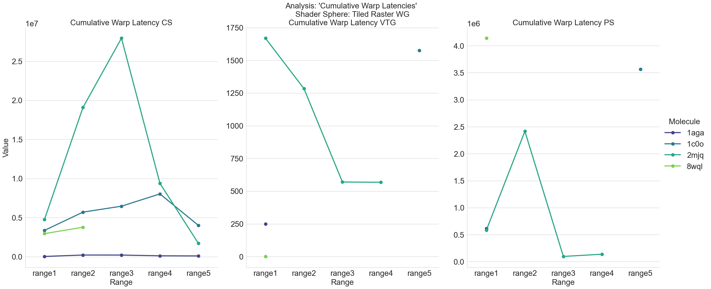

_Caption (Fig. 349): Charts showing Cumulative Warp Latencies (Cycles) for Sphere: Tiled Raster WG across different scenes and camera ranges. The x-axis represents the camera range (distance from the molecule), and the y-axis represents the value. Each chart has its own scale (mentioned in the title). Each line corresponds to a different scene._

**Fig. 350**
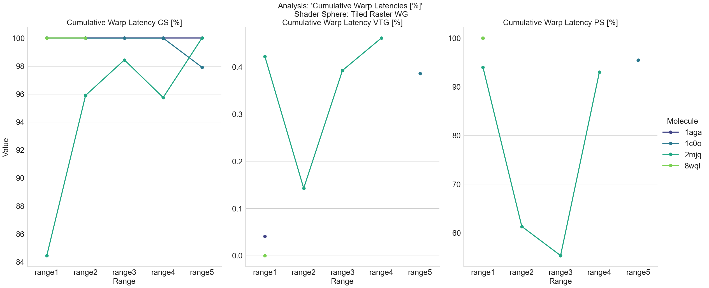

_Caption (Fig. 350): Charts showing Cumulative Warp Latencies (%) for Sphere: Tiled Raster WG across different scenes and camera ranges. The x-axis represents the camera range (distance from the molecule), and the y-axis represents the value. Each chart has its own scale (mentioned in the title). Each line corresponds to a different scene._

##### Sphere Small Raster:

similar as previous stages. See [Fig. 351](#fig-351) and [Fig. 352](#fig-352).

**Fig. 351**
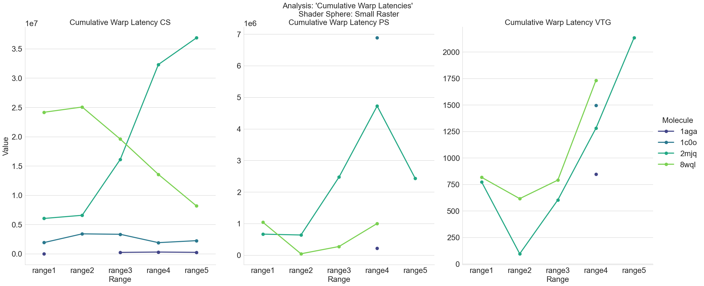

_Caption (Fig. 351): Charts showing Cumulative Warp Latencies (Cycles) for Sphere: Small Raster across different scenes and camera ranges. The x-axis represents the camera range (distance from the molecule), and the y-axis represents the value. Each chart has its own scale (mentioned in the title). Each line corresponds to a different scene._

**Fig. 352**
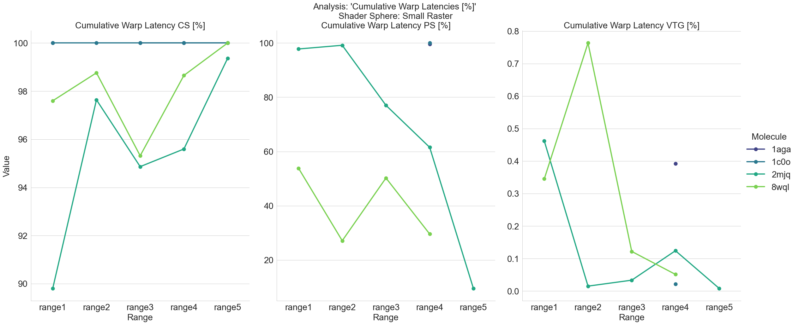

_Caption (Fig. 352): Charts showing Cumulative Warp Latencies (%) for Sphere: Small Raster across different scenes and camera ranges. The x-axis represents the camera range (distance from the molecule), and the y-axis represents the value. Each chart has its own scale (mentioned in the title). Each line corresponds to a different scene._

##### Cylinder

Classify: similar to the Sphere Classify stage. See [Fig. 353](#fig-353) and [Fig. 354](#fig-354).

**Fig. 353**
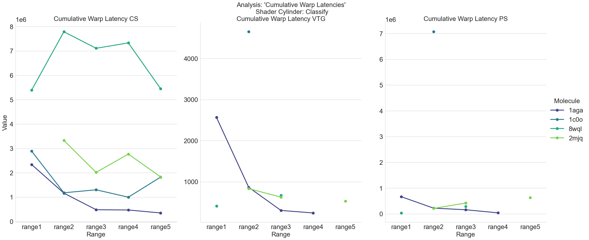

_Caption (Fig. 353): Charts showing Cumulative Warp Latencies (Cycles) for Cylinder: Classify across different scenes and camera ranges. The x-axis represents the camera range (distance from the molecule), and the y-axis represents the value. Each chart has its own scale (mentioned in the title). Each line corresponds to a different scene._

**Fig. 354**
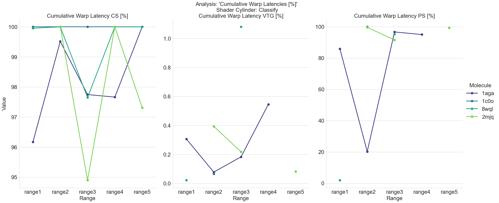

_Caption (Fig. 354): Charts showing Cumulative Warp Latencies (%) for Cylinder: Classify across different scenes and camera ranges. The x-axis represents the camera range (distance from the molecule), and the y-axis represents the value. Each chart has its own scale (mentioned in the title). Each line corresponds to a different scene._

##### Cylinder: Sort+RLE+TileOffsets:

similar to the Sphere Sort+RLE+TileOffsets stage. See [Fig. 355](#fig-355) and [Fig. 356](#fig-356).

**Fig. 355**
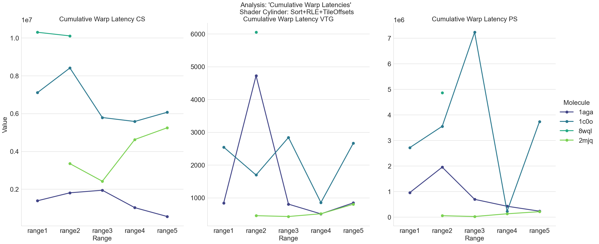

_Caption (Fig. 355): Charts showing Cumulative Warp Latencies (Cycles) for Cylinder: Sort+RLE+TileOffsets across different scenes and camera ranges. The x-axis represents the camera range (distance from the molecule), and the y-axis represents the value. Each chart has its own scale (mentioned in the title). Each line corresponds to a different scene._

**Fig. 356**
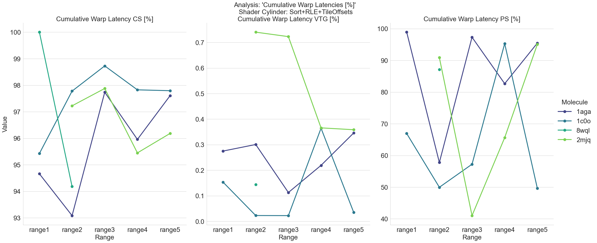

_Caption (Fig. 356): Charts showing Cumulative Warp Latencies (%) for Cylinder: Sort+RLE+TileOffsets across different scenes and camera ranges. The x-axis represents the camera range (distance from the molecule), and the y-axis represents the value. Each chart has its own scale (mentioned in the title). Each line corresponds to a different scene._

##### Cylinder Expand WorkGroups:

similar to the Sphere Expand WorkGroups stage, but no clear pattern. See [Fig. 357](#fig-357) and [Fig. 358](#fig-358).

**Fig. 357**
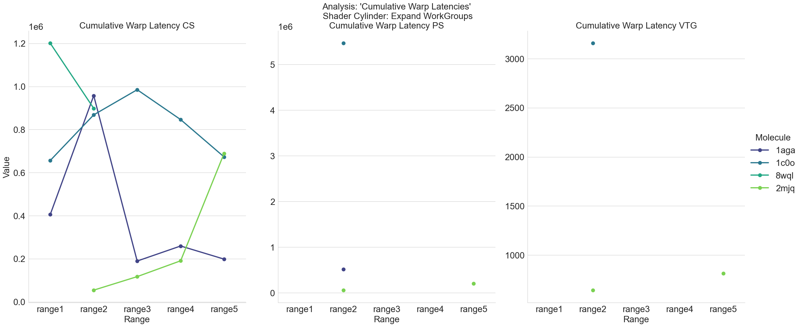

_Caption (Fig. 357): Charts showing Cumulative Warp Latencies (Cycles) for Cylinder: Expand WorkGroups across different scenes and camera ranges. The x-axis represents the camera range (distance from the molecule), and the y-axis represents the value. Each chart has its own scale (mentioned in the title). Each line corresponds to a different scene._

**Fig. 358**
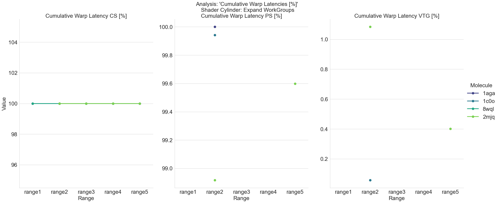

_Caption (Fig. 358): Charts showing Cumulative Warp Latencies (%) for Cylinder: Expand WorkGroups across different scenes and camera ranges. The x-axis represents the camera range (distance from the molecule), and the y-axis represents the value. Each chart has its own scale (mentioned in the title). Each line corresponds to a different scene._

##### Cylinder Tiled Raster WG:

not enough data to analyze. See [Fig. 349](#fig-349) and [Fig. 360](#fig-360).

**Fig. 359**
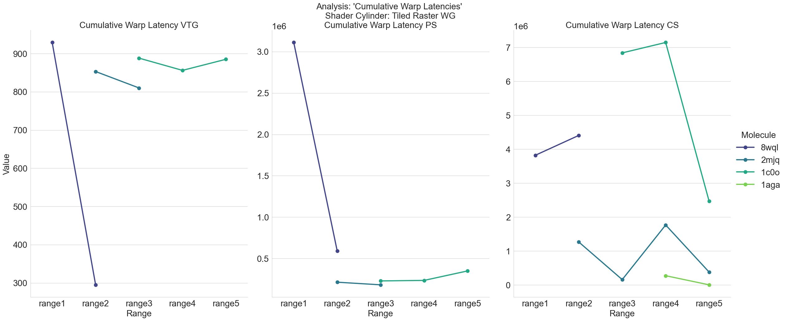

_Caption (Fig. 359): Charts showing Cumulative Warp Latencies (Cycles) for Cylinder: Tiled Raster WG across different scenes and camera ranges. The x-axis represents the camera range (distance from the molecule), and the y-axis represents the value. Each chart has its own scale (mentioned in the title). Each line corresponds to a different scene._

**Fig. 360**
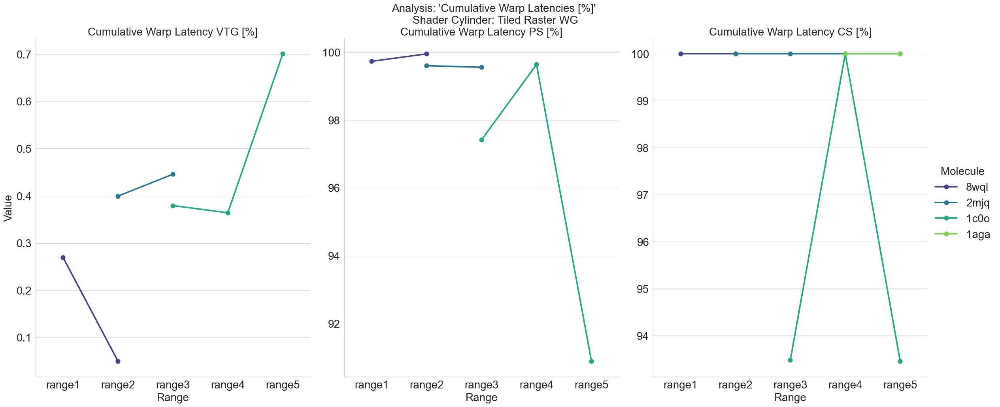

_Caption (Fig. 360): Charts showing Cumulative Warp Latencies (%) for Cylinder: Tiled Raster WG across different scenes and camera ranges. The x-axis represents the camera range (distance from the molecule), and the y-axis represents the value. Each chart has its own scale (mentioned in the title). Each line corresponds to a different scene._

##### Active Threads Per Warp

##### Sphere

Classify: it can be seen in [Fig. 361](#fig-361) that for Thread Inst Executed Pred On per Inst Executed [%] the values increase across molecules, starting from 55% for 2MJQ (and growing across ranges), which means that more than half of the threads are executing an instruction at a time, which indicates low divergence and good performance. Added to the fact that it grows with molecules and that variation across ranges is not a problem, it can be said that this stage has a good balance of work. SM Inst Executed shows values that grow with molecule, and for really knowing if it has a heavy workload, it should be compared with other versiones and analyzed together with the duration of the stage. The SM Thread Inst Executed Pred On, even if it should be analyazed with the duration and in comparison to other versions, it is worth mentioning that it has high values, meaning that there are many threads executing instructions at a time, which is good for performance. See [Fig. 361](#fig-361).

**Fig. 361**
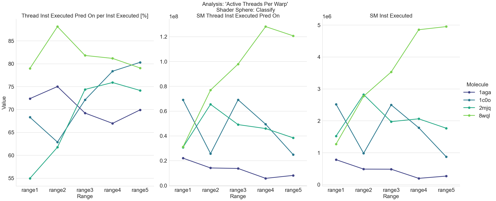

_Caption (Fig. 361): Charts showing Active Threads per Warp for Sphere: Classify across different scenes and camera ranges. The x-axis represents the camera range (distance from the molecule), and the y-axis represents the value. Each chart has its own scale (mentioned in the title). Each line corresponds to a different scene._

##### Sphere: Sort+RLE+TileOffsets:

similar as previous stage, with even higher values for Thread Inst Executed Pred On per Inst Executed [%], with values of 80% and even 90%, with more instructions emitted (SM Inst Executed), which means that this stage has a good balance of work and low divergence, as expected of a well-optimized library function. See [Fig. 362](#fig-362).

**Fig. 362**
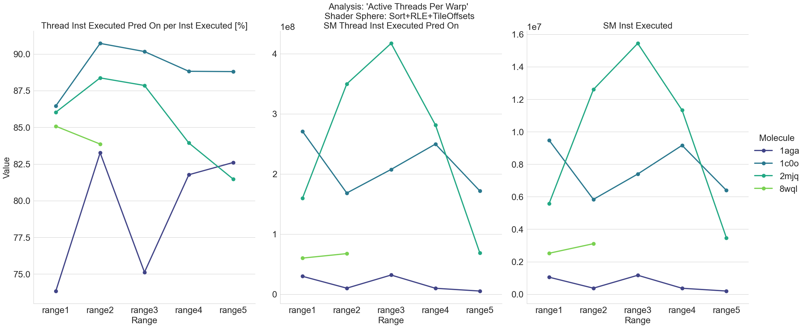

_Caption (Fig. 362): Charts showing Active Threads per Warp for Sphere: Sort+RLE+TileOffsets across different scenes and camera ranges. The x-axis represents the camera range (distance from the molecule), and the y-axis represents the value. Each chart has its own scale (mentioned in the title). Each line corresponds to a different scene._

##### Sphere Expand WorkGroups:

this stage shows lower values for Thread Inst Executed Pred On per Inst Executed [%], with values over 50% for most cases except 1AGA (around 46% in most cases). Added to the lower values for SM Thread Inst Executed Pred On and SM Inst Executed, it is demonstrated that this stage is light yet not so well parallelized, but that is expected taking into account that it is a preprocessing stage for the Tiled Raster stage. See [Fig. 363](#fig-363).

**Fig. 363**
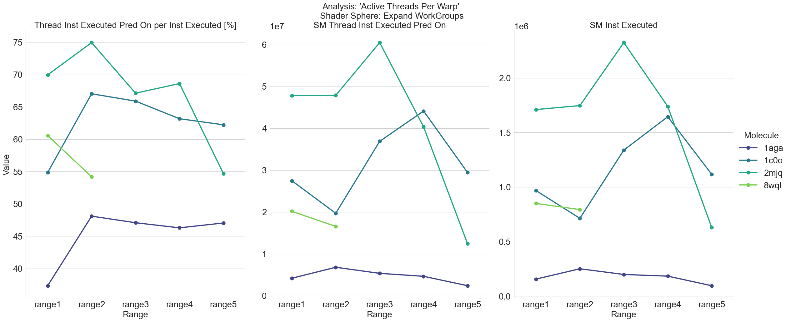

_Caption (Fig. 363): Charts showing Active Threads per Warp for Sphere: Expand WorkGroups across different scenes and camera ranges. The x-axis represents the camera range (distance from the molecule), and the y-axis represents the value. Each chart has its own scale (mentioned in the title). Each line corresponds to a different scene._

##### Sphere Tiled Raster WG:

this stage shows high values for Thread Inst Executed Pred On and SM Thread Inst Executed Pred On, which is expected since this is well parallelized and optimized stage, yet still heavy and with a lot of instructions emitted. Thread Inst Executed Pred On per Inst Executed [%] allows to see that there is a good balance of work and low divergence since values are high in most cases (1AGA lowest, still over 35%). 2MJQ declines across ranges, but it is no problem since it also means less work to do. See [Fig. 364](#fig-364).

**Fig. 364**
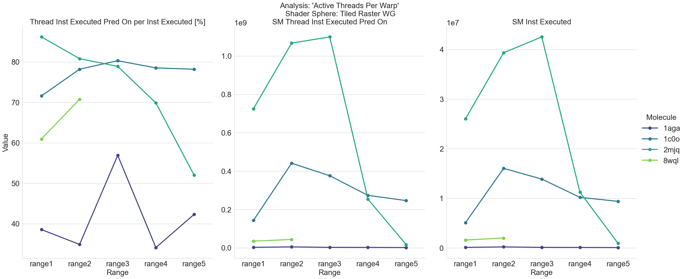

_Caption (Fig. 364): Charts showing Active Threads per Warp for Sphere: Tiled Raster WG across different scenes and camera ranges. The x-axis represents the camera range (distance from the molecule), and the y-axis represents the value. Each chart has its own scale (mentioned in the title). Each line corresponds to a different scene._

##### Sphere Small Raster:

Thread Inst Executed Pred On per Inst Executed [%] shows high values, all of them over 60% (except 2MJQ, just as before). SM Thread Inst Executed Pred On is also high and each molecule's values are proportional to the amount of instructions emitted, meaning that the more work there is, the more threads are executing instructions and preserving results, which is good for performance. This stage is also expected to be heavy and well optimized. See [Fig. 365](#fig-365).

**Fig. 365**
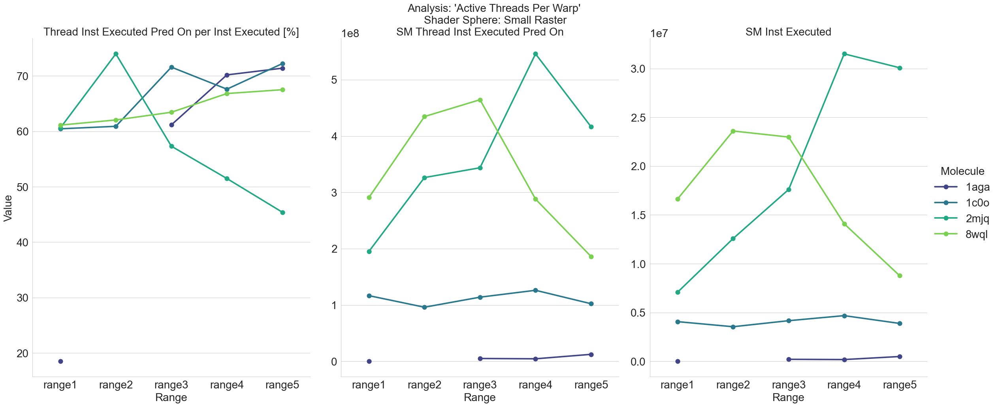

_Caption (Fig. 365): Charts showing Active Threads per Warp for Sphere: Small Raster across different scenes and camera ranges. The x-axis represents the camera range (distance from the molecule), and the y-axis represents the value. Each chart has its own scale (mentioned in the title). Each line corresponds to a different scene._

##### Cylinder

Classify: similar to the Sphere Classify stage. See [Fig. 366](#fig-366).

**Fig. 366**
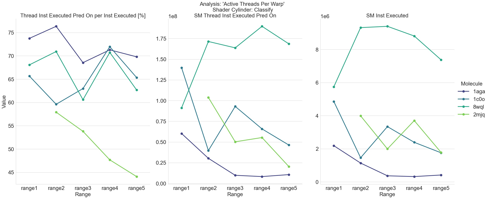

_Caption (Fig. 366): Charts showing Active Threads per Warp for Cylinder: Classify across different scenes and camera ranges. The x-axis represents the camera range (distance from the molecule), and the y-axis represents the value. Each chart has its own scale (mentioned in the title). Each line corresponds to a different scene._

##### Cylinder: Sort+RLE+TileOffsets:

similar to the Sphere Sort+RLE+TileOffsets stage (since its equal). See [Fig. 367](#fig-367).

**Fig. 367**
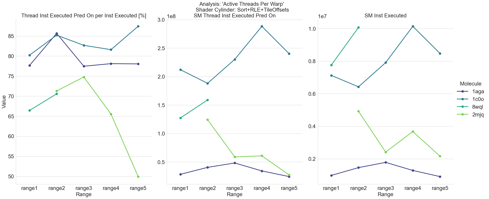

_Caption (Fig. 367): Charts showing Active Threads per Warp for Cylinder: Sort+RLE+TileOffsets across different scenes and camera ranges. The x-axis represents the camera range (distance from the molecule), and the y-axis represents the value. Each chart has its own scale (mentioned in the title). Each line corresponds to a different scene._

##### Cylinder Expand WorkGroups:

this stage is equal to the Sphere Expand WorkGroups stage, so it is normal that it shows similar values. See [Fig. 368](#fig-368).

**Fig. 368**
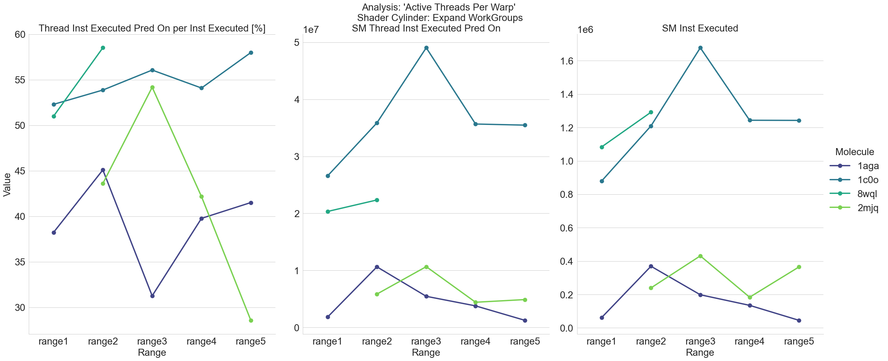

_Caption (Fig. 368): Charts showing Active Threads per Warp for Cylinder: Expand WorkGroups across different scenes and camera ranges. The x-axis represents the camera range (distance from the molecule), and the y-axis represents the value. Each chart has its own scale (mentioned in the title). Each line corresponds to a different scene._

##### Cylinder Tiled Raster WG:

behaviour is similar to the sphere tiled raster stage, but with lower values for Thread Inst Executed Pred On per Inst Executed [%], which may be because of the different geometry and how it affects the rasterization process. Directly rasterizing the cylinder is much costly than a sphere, therefore more divergence is expected. See [Fig. 369](#fig-369).

**Fig. 369**
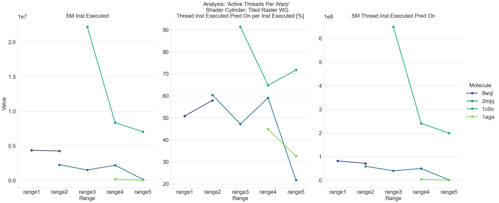

_Caption (Fig. 369): Charts showing Active Threads per Warp for Cylinder: Tiled Raster WG across different scenes and camera ranges. The x-axis represents the camera range (distance from the molecule), and the y-axis represents the value. Each chart has its own scale (mentioned in the title). Each line corresponds to a different scene._

##### Warp Launch Stalled by Reasons [\%]

##### Sphere

Classify: in [Fig. 370](#fig-370) there are many charts with PS metrics, but it's just noise since the pixel shader is not used (only kernels, not standard hraphics pipeline). The only relevant metrics are CS Warp Launch Stalled Warp Slot Allocation [%] and CS Warp Launch Stalled Shared Memory Allocations [%]. The first one shows low values in all cases (lower than 16%), with a low increase with molecule size, which could mean that the GPU is not assigning warps efficiently, that there are not enough resources to launch new warps, that there is too much work and older warps are not handing over the resources or simply that work is simple and doesn't need many warps. Since the amount of unused warps was seen before to be low, the last option seems most likely. The second one shows even lower values, but since in this kernel shares memory is not used, it will be interpreted as noise. See [Fig. 370](#fig-370).

**Fig. 370**
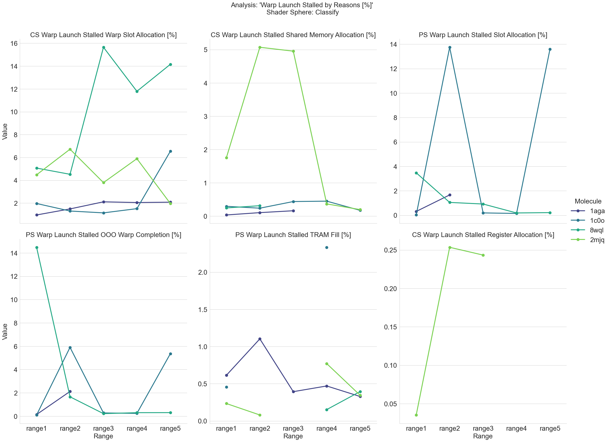

_Caption (Fig. 370): Charts showing Warp Launch Stalled by Reasons (%) for Sphere: Classify across different scenes and camera ranges. The x-axis represents the camera range (distance from the molecule), and the y-axis represents the value. Each chart has its own scale (mentioned in the title). Each line corresponds to a different scene._

##### Sphere: Sort+RLE+TileOffsets:

similar as previous stage, but there seems to be no response to the molecule size. See [Fig. 371](#fig-371).

**Fig. 371**
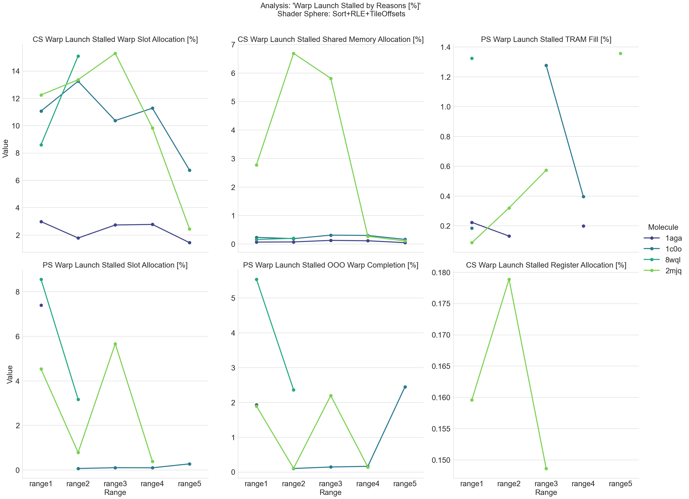

_Caption (Fig. 371): Charts showing Warp Launch Stalled by Reasons (%) for Sphere: Sort+RLE+TileOffsets across different scenes and camera ranges. The x-axis represents the camera range (distance from the molecule), and the y-axis represents the value. Each chart has its own scale (mentioned in the title). Each line corresponds to a different scene._

##### Sphere Expand WorkGroups:

in case of [Fig. 372](#fig-372) CS Warp Launch Stalled Warp Slot Allocation [%] shows higher values, which may increase to a certain extent with molecule size, and a decrease across ranges. 1AGA takes values from around 14% to 10%, 1C0O from 49% to 39%, 2MJQ goes from 47% to 37% from range 1 to 4, and 8% in range 5, and 8WQL stays between 26-38%. This could be due to a bad parallelization of this stage, but since the percentages are not alarming it means that the work is done at a good pace. See [Fig. 372](#fig-372).

**Fig. 372**
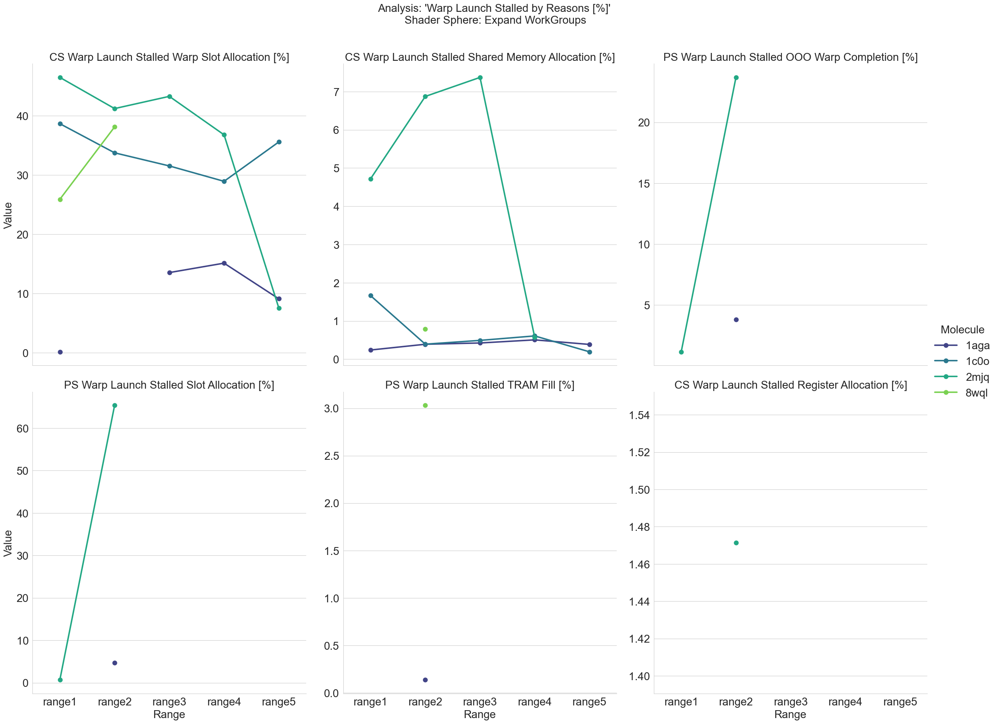

_Caption (Fig. 372): Charts showing Warp Launch Stalled by Reasons (%) for Sphere: Expand WorkGroups across different scenes and camera ranges. The x-axis represents the camera range (distance from the molecule), and the y-axis represents the value. Each chart has its own scale (mentioned in the title). Each line corresponds to a different scene._

##### Sphere Tiled Raster WG:

for [Fig. 373](#fig-373) CS Warp Launch Stalled Warp Slot Allocation [%] has a clear pattern, with values that grow with molecule size and across ranges. This increase with ranges is lower by the last 2/3 ranges, becoming an almost steady value. 1AGA goes from around 3% to 17%, 1C0O from 17% to 30%, 2MJQ from 15% to 30% and 8WQL from 27% to 40%. Values are not a cause of concern, but they do reflect that this stage is heavy. See [Fig. 373](#fig-373).

**Fig. 373**
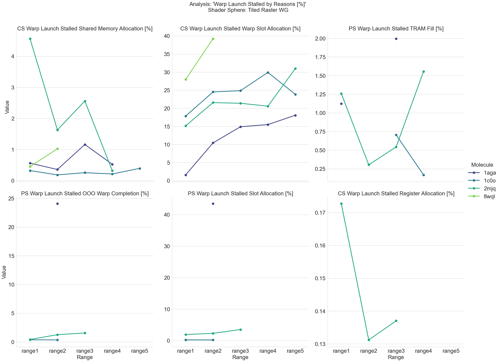

_Caption (Fig. 373): Charts showing Warp Launch Stalled by Reasons (%) for Sphere: Tiled Raster WG across different scenes and camera ranges. The x-axis represents the camera range (distance from the molecule), and the y-axis represents the value. Each chart has its own scale (mentioned in the title). Each line corresponds to a different scene._

##### Sphere Small Raster:

from [Fig. 374](#fig-374) CS Warp Launch Stalled Warp Slot Allocation [%] shows values similar to the previous stage, but with no pattern. See [Fig. 374](#fig-374).

**Fig. 374**
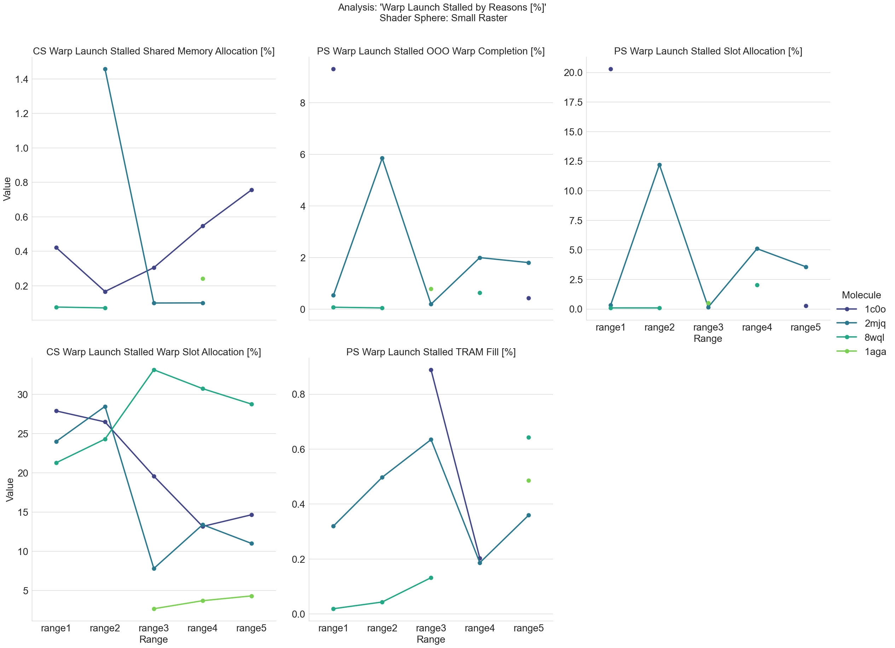

_Caption (Fig. 374): Charts showing Warp Launch Stalled by Reasons (%) for Sphere: Small Raster across different scenes and camera ranges. The x-axis represents the camera range (distance from the molecule), and the y-axis represents the value. Each chart has its own scale (mentioned in the title). Each line corresponds to a different scene._

##### Cylinder

Classify: [Fig. 375](#fig-375) shows a similar pattern, growing values with molecule size and across ranges, declining in the last ranges. Values don't demonstrate a problem, but that this stage is well optimized. See [Fig. 375](#fig-375).

**Fig. 375**
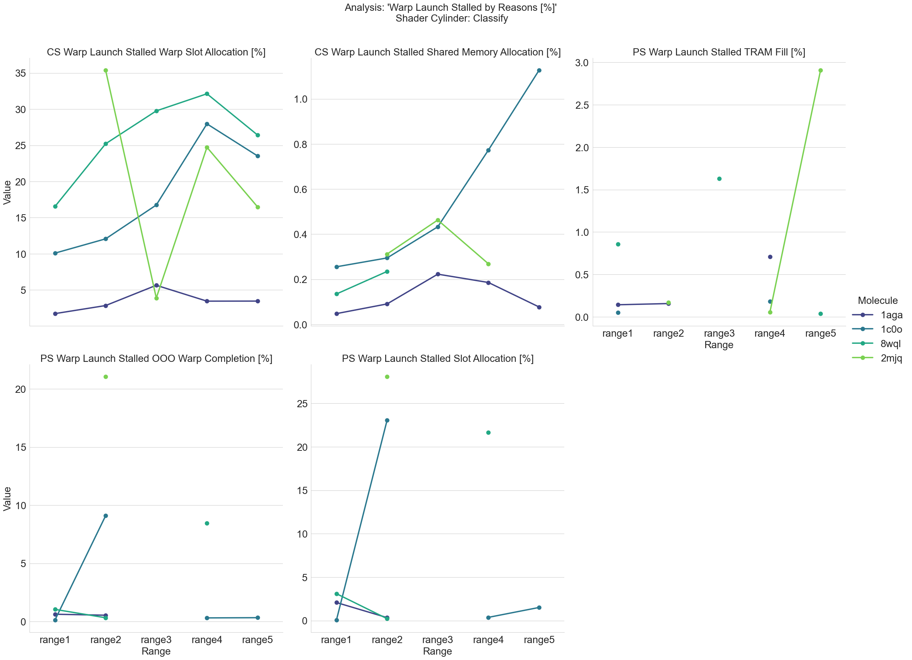

_Caption (Fig. 375): Charts showing Warp Launch Stalled by Reasons (%) for Cylinder: Classify across different scenes and camera ranges. The x-axis represents the camera range (distance from the molecule), and the y-axis represents the value. Each chart has its own scale (mentioned in the title). Each line corresponds to a different scene._

##### Cylinder: Sort+RLE+TileOffsets:

not clear pattern to conclude anything based on CS Warp Launch Stalled Warp Slot Allocation [%] of [Fig. 376](#fig-376). See [Fig. 376](#fig-376).

**Fig. 376**
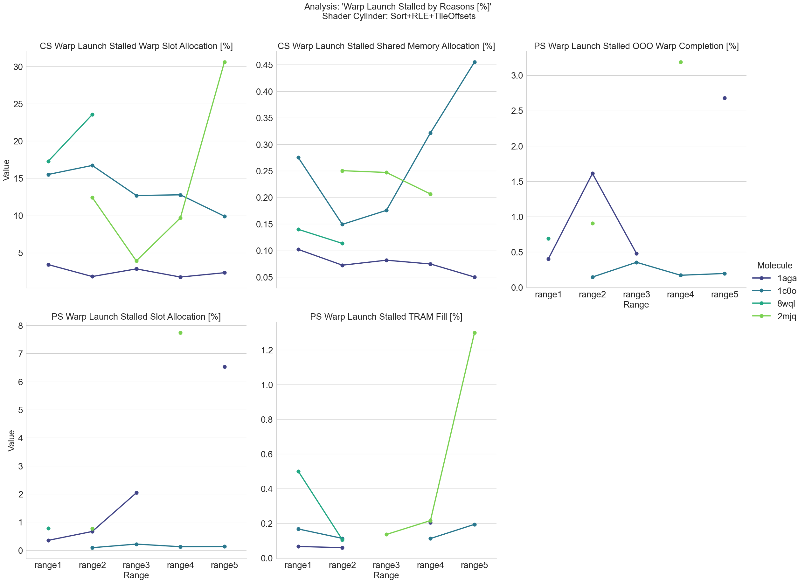

_Caption (Fig. 376): Charts showing Warp Launch Stalled by Reasons (%) for Cylinder: Sort+RLE+TileOffsets across different scenes and camera ranges. The x-axis represents the camera range (distance from the molecule), and the y-axis represents the value. Each chart has its own scale (mentioned in the title). Each line corresponds to a different scene._

##### Cylinder Expand WorkGroups:

chart of CS Warp Launch Stalled Warp Slot Allocation [%] in [Fig. 377](#fig-377) shows similar values as the Sphere Expand WorkGroups stage, but a pattern is not clear. See [Fig. 377](#fig-377).

**Fig. 377**
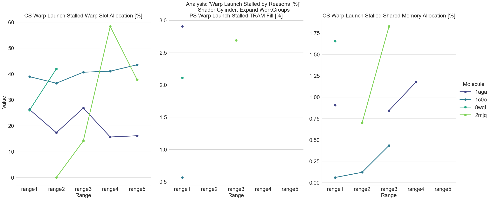

_Caption (Fig. 377): Charts showing Warp Launch Stalled by Reasons (%) for Cylinder: Expand WorkGroups across different scenes and camera ranges. The x-axis represents the camera range (distance from the molecule), and the y-axis represents the value. Each chart has its own scale (mentioned in the title). Each line corresponds to a different scene._

##### Cylinder Tiled Raster WG:

not enough data to analyze. See [Fig. 378](#fig-378).

**Fig. 378**
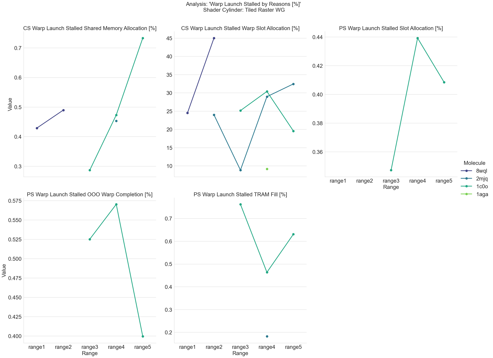

_Caption (Fig. 378): Charts showing Warp Launch Stalled by Reasons (%) for Cylinder: Tiled Raster WG across different scenes and camera ranges. The x-axis represents the camera range (distance from the molecule), and the y-axis represents the value. Each chart has its own scale (mentioned in the title). Each line corresponds to a different scene._

##### SM Throughputs

##### Sphere

Classify: in [Fig. 379](#fig-379) every chart presents the same pattern, with percentages growing across ranges and with molecule size,. 8WQL shows a higher increase across ranges, but in all cases the values are low, discarding a possible bottleneck in the SMs and signaling that this stage is light and well optimized. See [Fig. 379](#fig-379).

**Fig. 379**
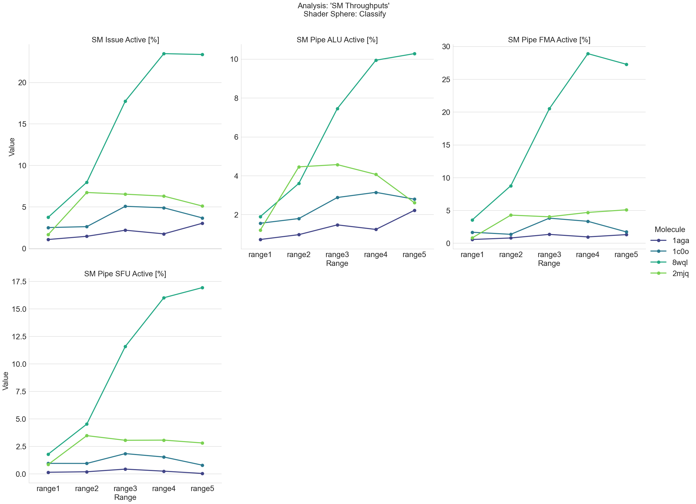

_Caption (Fig. 379): Charts showing SM Throughputs (%) for Sphere: Classify across different scenes and camera ranges. The x-axis represents the camera range (distance from the molecule), and the y-axis represents the value. Each chart has its own scale (mentioned in the title). Each line corresponds to a different scene._

##### Sphere: Sort+RLE+TileOffsets:

all charts in [Fig. 380](#fig-380) show a similar pattern among themselves, with values that grow with molecule size but only grow until second/third range, and then they decline or become steady. This is expected since should only be for large entities. See [Fig. 380](#fig-380).

**Fig. 380**
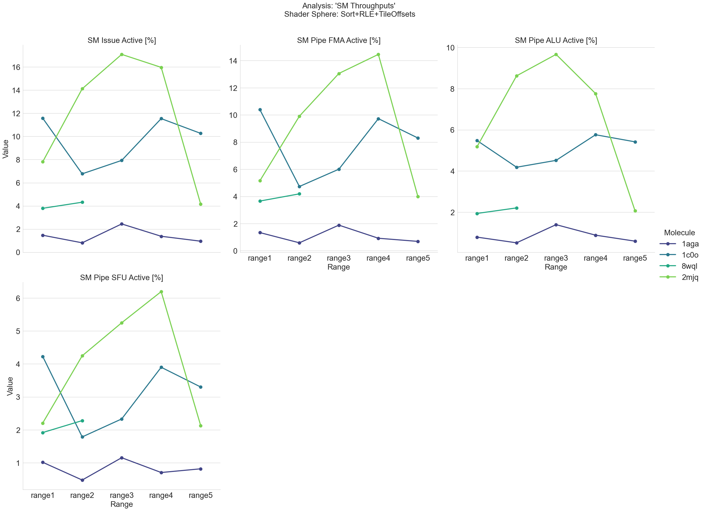

_Caption (Fig. 380): Charts showing SM Throughputs (%) for Sphere: Sort+RLE+TileOffsets across different scenes and camera ranges. The x-axis represents the camera range (distance from the molecule), and the y-axis represents the value. Each chart has its own scale (mentioned in the title). Each line corresponds to a different scene._

##### Sphere Expand WorkGroups:

[Fig. 381](#fig-381) allows to see a decline across ranges, which is expected since this stage is for preprocessing and should be only for large entities. SM Issue Active [%] shows the higher values for this stage, maybe because a lot of instructions are emitted and must be processed. SM Pipe FMA Active [%] follows with similar values, which could mean that many of those instructions could be the FMA ones. Lastly SM Pipe SFU Active [%] and SM Pipe ALU Active [%] tell a low usage of special operations and simple integer operations. See [Fig. 381](#fig-381).

**Fig. 381**
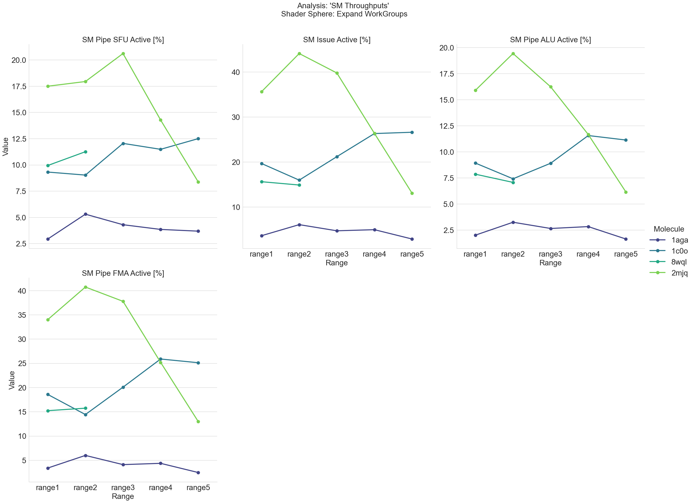

_Caption (Fig. 381): Charts showing SM Throughputs (%) for Sphere: Expand WorkGroups across different scenes and camera ranges. The x-axis represents the camera range (distance from the molecule), and the y-axis represents the value. Each chart has its own scale (mentioned in the title). Each line corresponds to a different scene._

##### Sphere Tiled Raster WG:

similar to previous stage, [Fig. 382](#fig-382) shows higher values in closer ranges, and SM Issue Active [%] along SM Pipe FMA Active [%] are the highest, reaching the highest value of 50% in range 3 for 2MJQ. Even with these values it can not be said that there is a bottleneck in the SMs, but it could be in special scenesa, and also is put in evidence that this stage is heavy and with many instructions emitted. See [Fig. 382](#fig-382).

**Fig. 382**
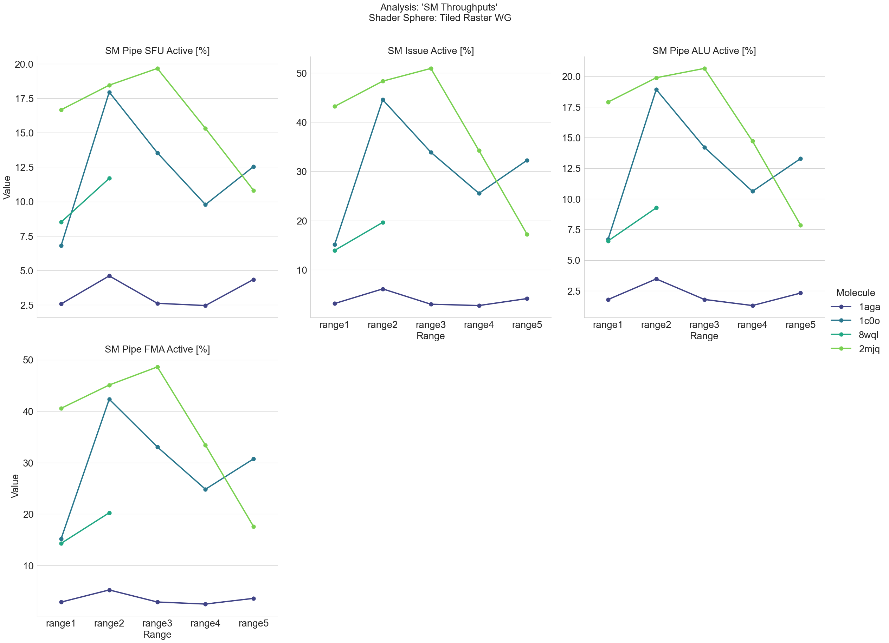

_Caption (Fig. 382): Charts showing SM Throughputs (%) for Sphere: Tiled Raster WG across different scenes and camera ranges. The x-axis represents the camera range (distance from the molecule), and the y-axis represents the value. Each chart has its own scale (mentioned in the title). Each line corresponds to a different scene._

##### Sphere Small Raster:

[Fig. 383](#fig-383) shows more erratic behaviours on each molecule, yet it could be said that values grow with molecule size, and that SM Issue Active [%] and SM Pipe FMA Active [%] are the highest, which is expected since this stage is heavy and with many instructions emitted, yet still lighter and faster. See [Fig. 383](#fig-383).

**Fig. 383**
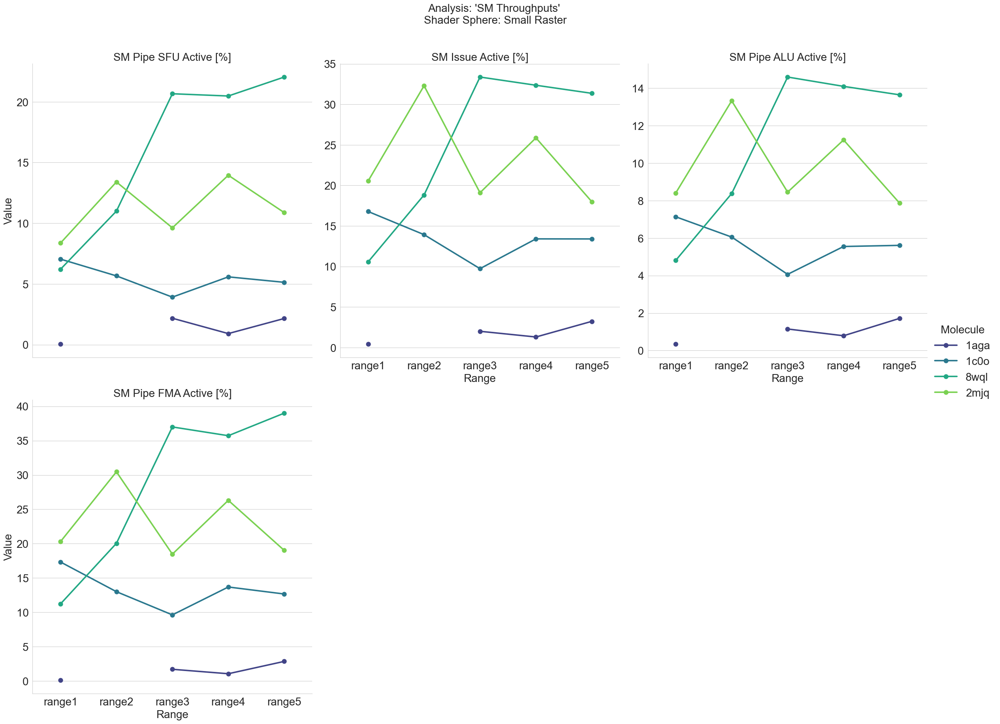

_Caption (Fig. 383): Charts showing SM Throughputs (%) for Sphere: Small Raster across different scenes and camera ranges. The x-axis represents the camera range (distance from the molecule), and the y-axis represents the value. Each chart has its own scale (mentioned in the title). Each line corresponds to a different scene._

##### Cylinder

Classify: similar to the Sphere Classify stage, with values that grow with molecule size and across ranges, but higher values for SM Pipe FMA Active [%]. It was expected since the culling of cylinders and tile assignement is more costly than for shperes. See [Fig. 384](#fig-384).

**Fig. 384**
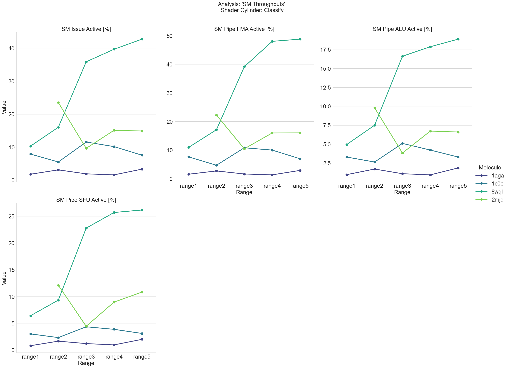

_Caption (Fig. 384): Charts showing SM Throughputs (%) for Cylinder: Classify across different scenes and camera ranges. The x-axis represents the camera range (distance from the molecule), and the y-axis represents the value. Each chart has its own scale (mentioned in the title). Each line corresponds to a different scene._

##### Cylinder: Sort+RLE+TileOffsets:

[Fig. 385](#fig-385) could be similar to Sphere Sort+RLE+TileOffsets stage, but with a more complex pattern (or no pattern at all) and with lower values. This could be because there are less entities. See [Fig. 385](#fig-385).

**Fig. 385**
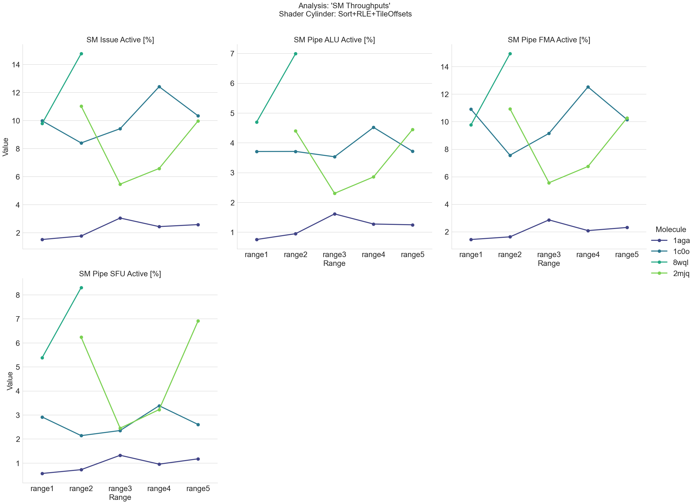

_Caption (Fig. 385): Charts showing SM Throughputs (%) for Cylinder: Sort+RLE+TileOffsets across different scenes and camera ranges. The x-axis represents the camera range (distance from the molecule), and the y-axis represents the value. Each chart has its own scale (mentioned in the title). Each line corresponds to a different scene._

##### Cylinder Expand WorkGroups:

similar to the Sphere Expand WorkGroups stage, with a more marked inflection point at middle ranges in most cases. [Fig. 386](#fig-386) shows slightly lower values than the Sphere's stage, but that could be because of having less entities and therefore less work to do. See [Fig. 386](#fig-386).

**Fig. 386**
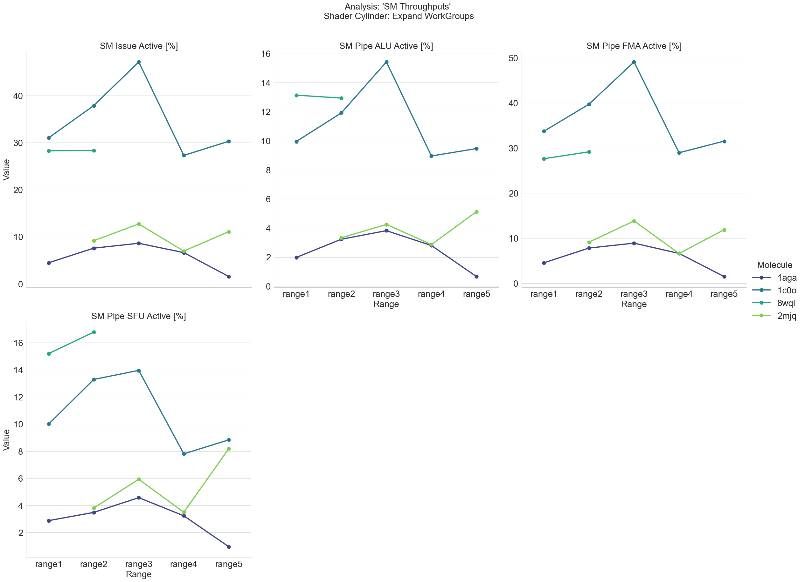

_Caption (Fig. 386): Charts showing SM Throughputs (%) for Cylinder: Expand WorkGroups across different scenes and camera ranges. The x-axis represents the camera range (distance from the molecule), and the y-axis represents the value. Each chart has its own scale (mentioned in the title). Each line corresponds to a different scene._

##### Cylinder Tiled Raster WG:

[Fig. 387](#fig-387) shows not enough data to analyze, but it seems to still have high values on SM Issue Active [%] and SM Pipe FMA Active [%]. See [Fig. 387](#fig-387).

**Fig. 387**
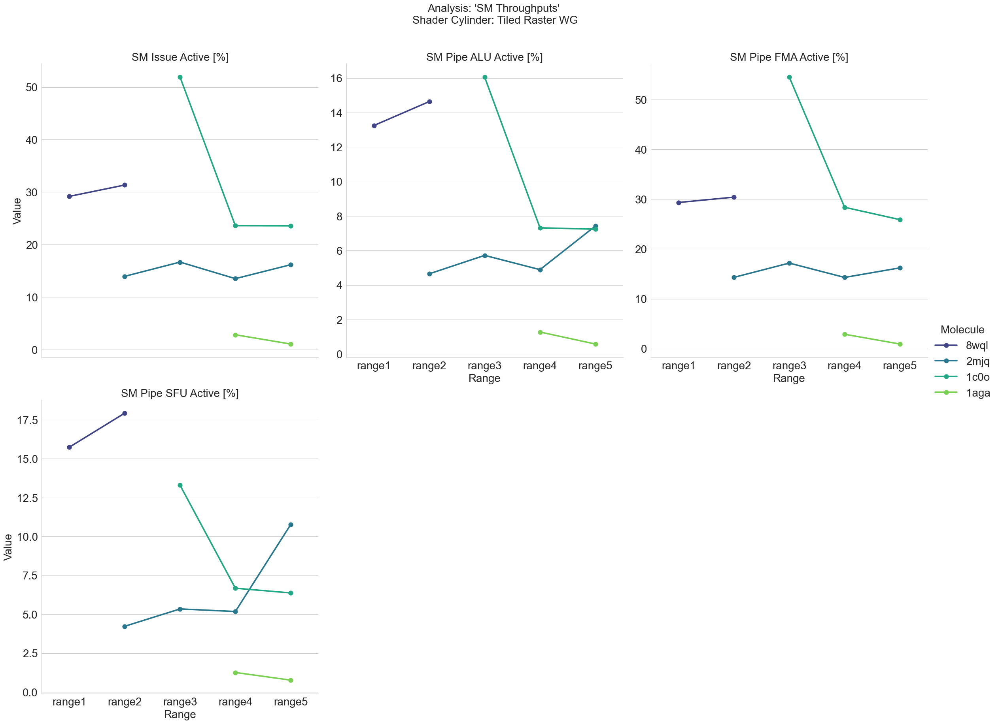

_Caption (Fig. 387): Charts showing SM Throughputs (%) for Cylinder: Tiled Raster WG across different scenes and camera ranges. The x-axis represents the camera range (distance from the molecule), and the y-axis represents the value. Each chart has its own scale (mentioned in the title). Each line corresponds to a different scene._

##### Performance Per Marked Range

**Fig. 388**
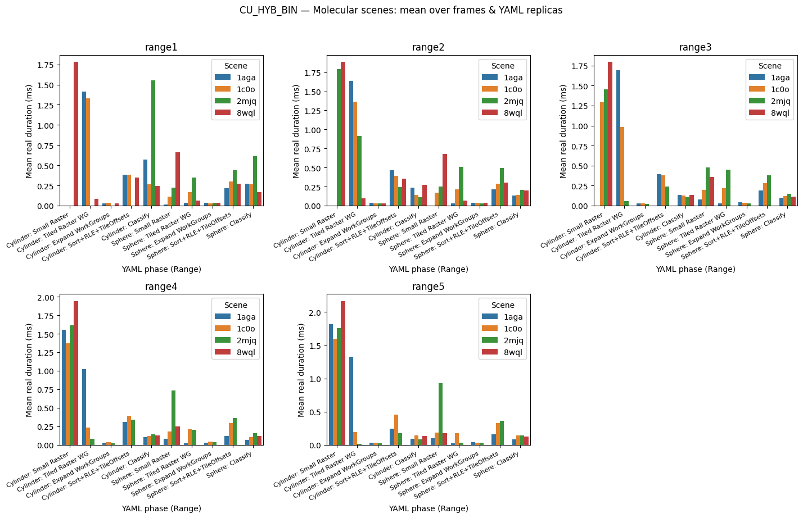

_Caption (Fig. 388): Charts showing frame time per marked range for the CUDA hybrid binning pipeline across different scenes and camera ranges. The x-axis represents the camera range (distance from the molecule), and the y-axis represents the value. Each chart has its own scale (mentioned in the title). Each line corresponds to a different scene._

In [Fig. 388](#fig-388) it can be seen that, apart from the obvious frame time excess in the Cylinder: Small Raster stage, the most costly stages per entity are the ones related to sorting and encoding (Sort+RLE+TileOffsets), followed by the classification stage, and then the tile rasterization stages. As said before, the Expand WorkGroups stage is a preprocessing stage for the Tiled Raster stage that requires the least amount of work, and therefore the lowest frame time. The Cylinder: Small Raster stage is the most costly one since the GPU context switch occurs during its execution, which is a very heavy operation and cannot be controlled through the CUDA API.

##### Compact (synthetic) scenes

##### GPU Engines Active [\%]

##### Sphere: Classify

**Fig. 389**
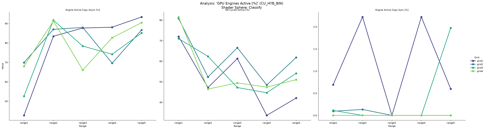

_Caption (Fig. 389): Charts showing GPU Engines Active (%) through different metrics for Sphere: Classify across compact grid scenes grid1–grid4 The x-axis represents the camera range (distance from the scene), and the y-axis represents the value. Each chart has its own scale (mentioned in the title). Each line corresponds to a different grid (grid1, grid2, …)._

In [Fig. 389](#fig-389) GR Cycles Active [%] decreases with camera range for all grids, from roughly 71–82% at range 1 down to about 34–60% at range 5; grid1 shows the steepest decline (~34% at range 4). Engine Active Copy Async [%] rises with range in every grid, reaching 85–95% at range 5, which suggests that as classification work lightens with distance, asynchronous transfers account for a larger share of engine time—consistent with the molecular behaviour in [Fig. 262](#fig-262). Engine Active Copy Sync [%] stays below ~2.5% in almost all cases, with brief spikes for grid1 at ranges 2 and 4 and grid3 at range 5, so synchronous copies are not a bottleneck.

##### Sphere: Sort+RLE+TileOffsets

**Fig. 390**
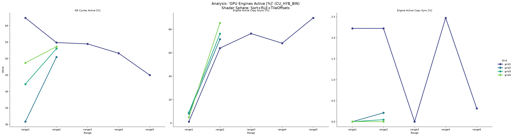

_Caption (Fig. 390): Charts showing GPU Engines Active (%) through different metrics for Sphere: Sort+RLE+TileOffsets across compact grid scenes grid1–grid4 The x-axis represents the camera range (distance from the scene), and the y-axis represents the value. Each chart has its own scale (mentioned in the title). Each line corresponds to a different grid (grid1, grid2, …)._

In [Fig. 390](#fig-390) GR Cycles Active [%] is highest for grid1 at range 1 (~62%) and declines with range to ~45% at range 5; grid2–grid4 only report ranges 1–2, jumping from ~31–48% to ~50–55% at range 2. Engine Active Copy Async [%] shows a sharp rise between range 1 and 2 for all grids (from below 10% to 64–85%), then grid1 continues climbing to ~89% at range 5 while the compute share falls—similar to the molecular trend in [Fig. 263](#fig-263) but with a more pronounced async-dominated profile at far ranges on dense grids. Engine Active Copy Sync [%] remains negligible.

##### Sphere: Expand WorkGroups

**Fig. 391**
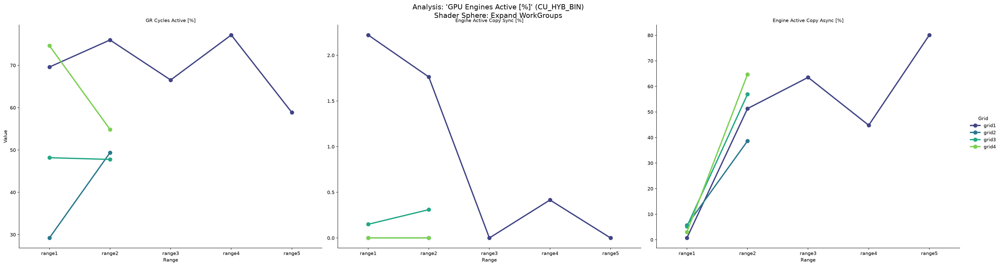

_Caption (Fig. 391): Charts showing GPU Engines Active (%) through different metrics for Sphere: Expand WorkGroups across compact grid scenes grid1–grid4 The x-axis represents the camera range (distance from the scene), and the y-axis represents the value. Each chart has its own scale (mentioned in the title). Each line corresponds to a different grid (grid1, grid2, …)._

In [Fig. 391](#fig-391) GR Cycles Active [%] for grid1 fluctuates between ~59% and ~78% across ranges without a clear monotonic trend; grid2–grid4 rise from ~29–75% at range 1 to ~47–55% at range 2. Engine Active Copy Async [%] for grid1 climbs from ~1% at range 1 to ~80% at range 5, with intermediate peaks at range 3 (~64%) and a dip at range 4 (~45%), matching the molecular pattern in [Fig. 264](#fig-264) where this lightweight preprocessing stage still incurs growing transfer overhead at distance. Engine Active Copy Sync [%] stays near zero after range 2.

##### Sphere: Tiled Raster WG

**Fig. 392**
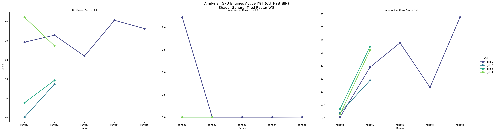

_Caption (Fig. 392): Charts showing GPU Engines Active (%) through different metrics for Sphere: Tiled Raster WG across compact grid scenes grid1–grid4 The x-axis represents the camera range (distance from the scene), and the y-axis represents the value. Each chart has its own scale (mentioned in the title). Each line corresponds to a different grid (grid1, grid2, …)._

In [Fig. 392](#fig-392) GR Cycles Active [%] for grid1 peaks at range 4 (~81%) with a dip at range 3 (~62%). Engine Active Copy Async [%] for grid1 is near zero at range 1, rises to ~58% at range 3, drops to ~23% at range 4, then surges to ~78% at range 5—an inverse relationship at range 4 between compute and async activity, unlike the molecular case in [Fig. 265](#fig-265) where async copy percentages were generally lower. Engine Active Copy Sync [%] is limited to ~2.2% at range 1 for grid1.

##### Sphere: Small Raster

**Fig. 393**
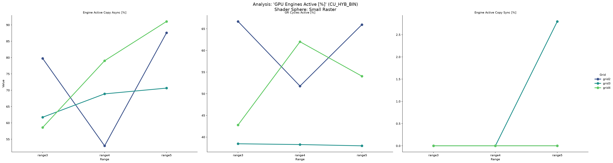

_Caption (Fig. 393): Charts showing GPU Engines Active (%) through different metrics for Sphere: Small Raster across compact grid scenes grid1–grid4 The x-axis represents the camera range (distance from the scene), and the y-axis represents the value. Each chart has its own scale (mentioned in the title). Each line corresponds to a different grid (grid1, grid2, …)._

In [Fig. 393](#fig-393) only grid2–grid4 appear from range 3 onward. GR Cycles Active [%]: grid3 stays flat near ~38%; grid2 shows a V-shape (67% → 52% → 66%); grid4 peaks at range 4 (~62%) then drops. Engine Active Copy Async [%]: grid4 rises steadily to ~91% at range 5; grid2 dips at range 4 then recovers to ~88%. Engine Active Copy Sync [%] is zero except a ~2.8% spike for grid3 at range 5. This matches the molecular behaviour in [Fig. 266](#fig-266), where far ranges favour transfer overhead on small-entity raster work.

##### Cylinder: Classify

**Fig. 394**
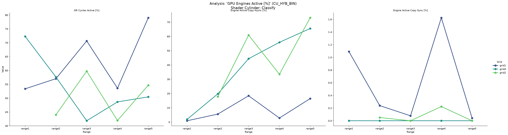

_Caption (Fig. 394): Charts showing GPU Engines Active (%) through different metrics for Cylinder: Classify across compact grid scenes grid1–grid4 The x-axis represents the camera range (distance from the scene), and the y-axis represents the value. Each chart has its own scale (mentioned in the title). Each line corresponds to a different grid (grid1, grid2, …)._

In [Fig. 394](#fig-394) GR Cycles Active [%] for grid1 rises to ~79% at range 5, while grid4 falls from ~72% at range 1 to ~42% at range 3 then recovers to ~51%. Engine Active Copy Async [%] for grid4 grows linearly to ~65% at range 5; grid2 is volatile (peak ~73% at range 5) while grid1 stays below ~18%. Both GR and async metrics grow with range for grid4 and grid2, as in molecular [Fig. 267](#fig-267). Engine Active Copy Sync [%] remains below ~1.6%.

##### Cylinder: Sort+RLE+TileOffsets

**Fig. 395**
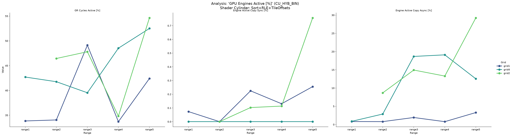

_Caption (Fig. 395): Charts showing GPU Engines Active (%) through different metrics for Cylinder: Sort+RLE+TileOffsets across compact grid scenes grid1–grid4 The x-axis represents the camera range (distance from the scene), and the y-axis represents the value. Each chart has its own scale (mentioned in the title). Each line corresponds to a different grid (grid1, grid2, …)._

In [Fig. 395](#fig-395) GR Cycles Active [%] stays between ~34% and 54%; grid2 spikes to ~54% at range 5 and grid1 peaks at range 3 (~49%). Engine Active Copy Async [%] remains low for grid1 (below ~3%) but reaches ~29% for grid2 and ~19% for grid4 at their respective peaks—lower than the molecular percentages in [Fig. 268](#fig-268) but showing the same pattern of cylinder sort being less transfer-heavy than the sphere stages.

##### Cylinder: Expand WorkGroups

**Fig. 396**
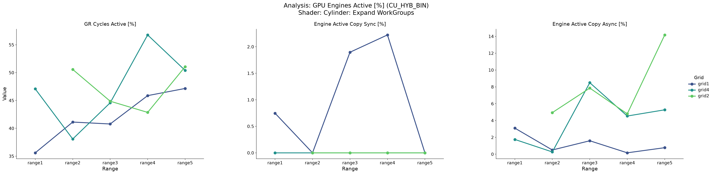

_Caption (Fig. 396): Charts showing GPU Engines Active (%) through different metrics for Cylinder: Expand WorkGroups across compact grid scenes grid1–grid4 The x-axis represents the camera range (distance from the scene), and the y-axis represents the value. Each chart has its own scale (mentioned in the title). Each line corresponds to a different grid (grid1, grid2, …)._

In [Fig. 396](#fig-396) GR Cycles Active [%] for grid1 climbs steadily from ~35% to ~47%; grid4 peaks at ~57% at range 4. Engine Active Copy Async [%] for grid2 reaches ~14% at range 5 and grid4 ~8.5% at range 3. Engine Active Copy Sync [%] is active only on grid1, peaking at ~2.2% at range 4—consistent with [Fig. 269](#fig-269), where cylinder expand stages use less async bandwidth than their sphere counterparts.

##### Cylinder: Tiled Raster WG

**Fig. 397**
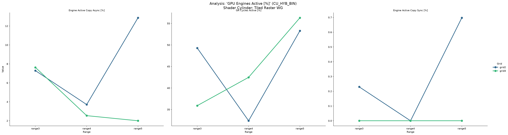

_Caption (Fig. 397): Charts showing GPU Engines Active (%) through different metrics for Cylinder: Tiled Raster WG across compact grid scenes grid1–grid4 The x-axis represents the camera range (distance from the scene), and the y-axis represents the value. Each chart has its own scale (mentioned in the title). Each line corresponds to a different grid (grid1, grid2, …)._

In [Fig. 397](#fig-397) only grid2 and grid4 are present from range 3. GR Cycles Active [%] for grid4 rises to ~56.5% at range 5 while grid2 follows a V-shape ending near ~53%. Engine Active Copy Async [%] for grid2 spikes to ~13% at range 5 whereas grid4 declines to ~2%. Engine Active Copy Sync [%] for grid2 peaks at ~0.7% at range 5; grid4 remains at zero.

##### GPU Engines Active

##### Sphere: Classify

**Fig. 398**
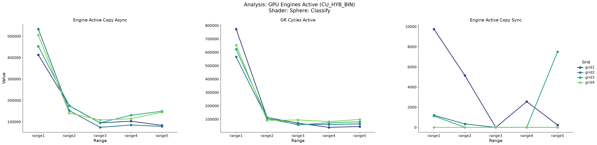

_Caption (Fig. 398): Charts showing GR Cycles Active through different metrics for Sphere: Classify across compact grid scenes grid1–grid4 The x-axis represents the camera range (distance from the scene), and the y-axis represents the value. Each chart has its own scale (mentioned in the title). Each line corresponds to a different grid (grid1, grid2, …)._

In [Fig. 398](#fig-398) all grids show a steep drop in GR Cycles Active and Engine Active Copy Async between range 1 and range 2 (GR from ~570k–780k down to ~100k; async from ~410k–540k down to ~140k–180k), then values stay below ~150k through range 5. Range 1 dominates cost on compact grids because the camera is closest and has much more tile-assigning to do. Engine Active Copy Sync stays an order of magnitude lower [Fig. 271](#fig-271).

##### Sphere: Sort+RLE+TileOffsets

**Fig. 399**
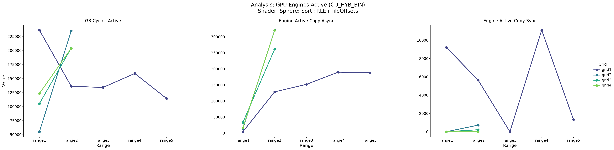

_Caption (Fig. 399): Charts showing GR Cycles Active through different metrics for Sphere: Sort+RLE+TileOffsets across compact grid scenes grid1–grid4 The x-axis represents the camera range (distance from the scene), and the y-axis represents the value. Each chart has its own scale (mentioned in the title). Each line corresponds to a different grid (grid1, grid2, …)._

In [Fig. 399](#fig-399) GR Cycles Active for grid1 falls from ~235k at range 1 to ~115k at range 5; grid2–grid4 only span ranges 1–2, rising sharply to ~205k–235k at range 2. Engine Active Copy Async for grid2–grid4 jumps to ~260k–320k at range 2, exceeding grid1 (~130k), indicating that mid-sized compact grids hit a memory-bound sorting phase at close-intermediate distances, as in [Fig. 272](#fig-272). Engine Active Copy Sync for grid1 spikes to ~11k at range 4 after zero at range 3. Not enough results from most grids in the charts.

##### Sphere: Expand WorkGroups

**Fig. 400**
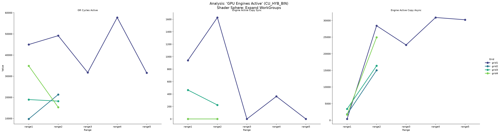

_Caption (Fig. 400): Charts showing GR Cycles Active through different metrics for Sphere: Expand WorkGroups across compact grid scenes grid1–grid4 The x-axis represents the camera range (distance from the scene), and the y-axis represents the value. Each chart has its own scale (mentioned in the title). Each line corresponds to a different grid (grid1, grid2, …)._

In [Fig. 400](#fig-400) GR Cycles Active for grid1 stays in a narrow band (~32k–58k cycles), consistent with the light preprocessing role described in [Fig. 273](#fig-273). Engine Active Copy Async rises sharply at range 2 (~28.5k) and remains high through range 5 (~30.5k), with a peak at range 4 (~31k). Engine Active Copy Sync is negligible after range 2.

##### Sphere: Tiled Raster WG

**Fig. 401**
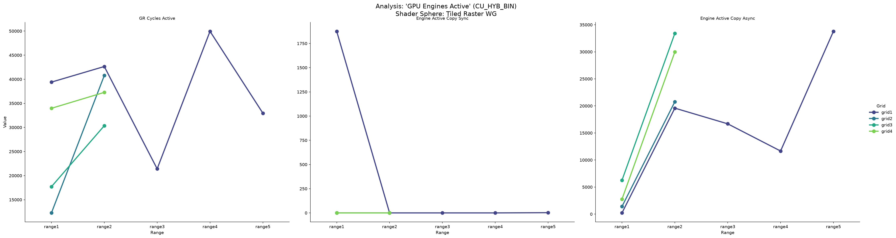

_Caption (Fig. 401): Charts showing GR Cycles Active through different metrics for Sphere: Tiled Raster WG across compact grid scenes grid1–grid4 The x-axis represents the camera range (distance from the scene), and the y-axis represents the value. Each chart has its own scale (mentioned in the title). Each line corresponds to a different grid (grid1, grid2, …)._

In [Fig. 401](#fig-401) GR Cycles Active for grid1 peaks at range 4 (~50k cycles) after a dip at range 3 (~21k), mirroring the percentage behaviour in [Fig. 392](#fig-392). Engine Active Copy Async climbs from near zero at range 1 to ~33.5k at range 5. Engine Active Copy Sync is confined to range 1 (~1,850 cycles) for grid1.

##### Sphere: Small Raster

**Fig. 402**
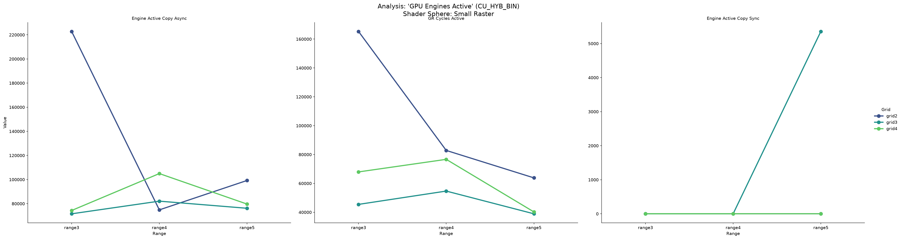

_Caption (Fig. 402): Charts showing GR Cycles Active through different metrics for Sphere: Small Raster across compact grid scenes grid1–grid4 The x-axis represents the camera range (distance from the scene), and the y-axis represents the value. Each chart has its own scale (mentioned in the title). Each line corresponds to a different grid (grid1, grid2, …)._

In [Fig. 402](#fig-402) only grid2–grid4 appear from range 3. GR Cycles Active for grid2 decreases from ~165k at range 3 to ~64k at range 5; grid3 stays lowest (~39k–55k) and grid4 peaks at range 4 (~77k) before dropping to ~40k. Engine Active Copy Async for grid2 spikes at range 3 (~222k) then falls; grid3 and grid4 stay near ~72k–105k. Engine Active Copy Sync is zero except a ~5.4k spike for grid3 at range 5, echoing the molecular small-raster transfer anomalies in [Fig. 275](#fig-275).

##### Cylinder: Classify

**Fig. 403**
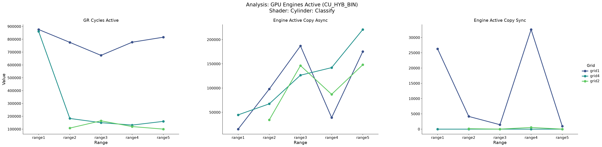

_Caption (Fig. 403): Charts showing GR Cycles Active through different metrics for Cylinder: Classify across compact grid scenes grid1–grid4 The x-axis represents the camera range (distance from the scene), and the y-axis represents the value. Each chart has its own scale (mentioned in the title). Each line corresponds to a different grid (grid1, grid2, …)._

In [Fig. 403](#fig-403) grid1 sustains the highest GR Cycles Active (~680k–880k across ranges), while grid4 collapses after range 1 (~860k to ~160k). Engine Active Copy Async grows steadily for grid4 to ~220k at range 5, whereas grid1 shows a volatile pattern peaking at ranges 3 and 5 (~185k). Engine Active Copy Sync is dominated by grid1 (spike ~33k at range 4). The split between compute-heavy grid1 and transfer-heavy grid4 parallels the molecular classify discussion in [Fig. 271](#fig-271).

##### Cylinder: Sort+RLE+TileOffsets

**Fig. 404**
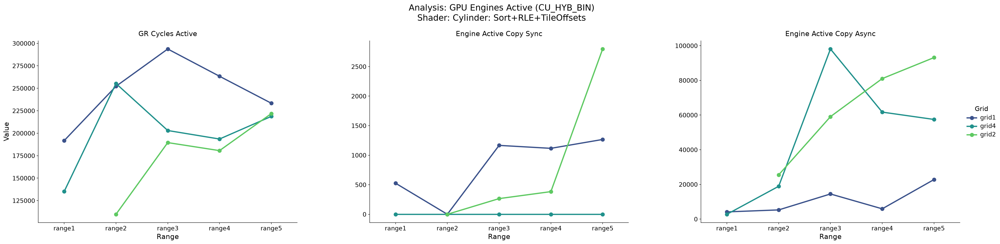

_Caption (Fig. 404): Charts showing GR Cycles Active through different metrics for Cylinder: Sort+RLE+TileOffsets across compact grid scenes grid1–grid4 The x-axis represents the camera range (distance from the scene), and the y-axis represents the value. Each chart has its own scale (mentioned in the title). Each line corresponds to a different grid (grid1, grid2, …)._

In [Fig. 404](#fig-404) GR Cycles Active for grid1 peaks at range 3 (~300k) then declines to ~235k at range 5; grid4 spikes async copy to ~98k at range 3 while GR cycles fall after range 2. Engine Active Copy Async for grid2 climbs to ~92k at range 5. Engine Active Copy Sync for grid2 surges to ~2.8k at range 5 after staying near zero—similar to the cylinder sort patterns in [Fig. 272](#fig-272) but with lower overall cycle counts on compact grids.

##### Cylinder: Expand WorkGroups

**Fig. 405**
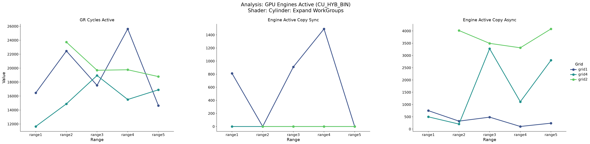

_Caption (Fig. 405): Charts showing GR Cycles Active through different metrics for Cylinder: Expand WorkGroups across compact grid scenes grid1–grid4 The x-axis represents the camera range (distance from the scene), and the y-axis represents the value. Each chart has its own scale (mentioned in the title). Each line corresponds to a different grid (grid1, grid2, …)._

In [Fig. 405](#fig-405) GR Cycles Active for grid1 peaks at range 4 (~25.5k cycles) coinciding with a synchronous-copy spike (~1.5k); grid2 relies on async copy instead, reaching ~4.1k at range 5. Engine Active Copy Async for grid4 spikes at range 3 (~3.3k) aligned with its GR peak (~19k). Absolute values remain small, as in [Fig. 273](#fig-273), confirming expand workgroups as a lightweight stage.

##### Cylinder: Tiled Raster WG

**Fig. 406**
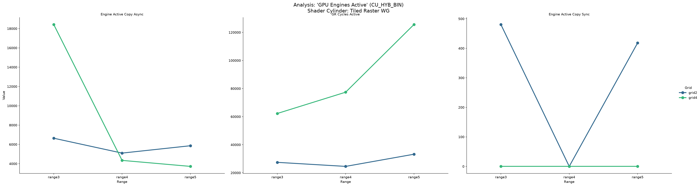

_Caption (Fig. 406): Charts showing GR Cycles Active through different metrics for Cylinder: Tiled Raster WG across compact grid scenes grid1–grid4 The x-axis represents the camera range (distance from the scene), and the y-axis represents the value. Each chart has its own scale (mentioned in the title). Each line corresponds to a different grid (grid1, grid2, …)._

In [Fig. 406](#fig-406) only grid2 and grid4 appear from range 3. GR Cycles Active for grid4 rises sharply to ~125k at range 5 while grid2 stays near ~24k–33k. Engine Active Copy Async for grid4 starts high at range 3 (~18.4k) then falls below grid2; grid4 avoids sync copies entirely whereas grid2 shows brief sync activity at ranges 3 and 5 (~480 and ~420 cycles). No more relevant results. See also the percentage view in [Fig. 397](#fig-397).

##### Graphics/Compute Idle [\%]

##### Sphere: Classify

**Fig. 407**
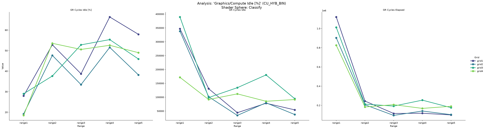

_Caption (Fig. 407): Charts showing Graphics/Compute Idle (%) for Sphere: Classify across compact grid scenes grid1–grid4 The x-axis represents the camera range (distance from the scene), and the y-axis represents the value. Each chart has its own scale (mentioned in the title). Each line corresponds to a different grid (grid1, grid2, …)._

In [Fig. 407](#fig-407) GR Cycles Elapsed peaks at range 1 for every grid (~820k–1.15M cycles) then collapses to ~200k at range 2 and stays flat through range 5, which reflects the classify kernel scanning the full regular lattice at closest camera distance but processing far fewer visible tile–entity pairs once the view pulls back. GR Cycles Idle [%] is low at range 1 (~18–30%) then rises sharply at range 2 (~38–54%) and peaks for grid1 at range 4 (~67%); this inverse trend is expected because shorter stages make pipeline bubbles represent a larger share of elapsed time. The range-4 grid1 spike may indicate uneven atomic contention when emitting (tile, sphere) pairs on the densest compact grid—consistent with molecular classify in [Fig. 280](#fig-280), where range 1 was also suspected of GPU warm-up effects.

##### Sphere: Sort+RLE+TileOffsets

**Fig. 408**
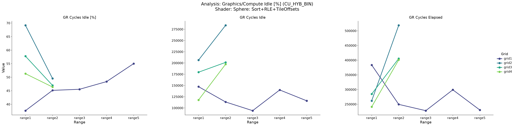

_Caption (Fig. 408): Charts showing Graphics/Compute Idle (%) for Sphere: Sort+RLE+TileOffsets across compact grid scenes grid1–grid4 The x-axis represents the camera range (distance from the scene), and the y-axis represents the value. Each chart has its own scale (mentioned in the title). Each line corresponds to a different grid (grid1, grid2, …)._

In [Fig. 408](#fig-408) similar to the previous stage, but GR Cycles Elapsed shows increase across grids and decrease with range, which is expected since the workload increases with grid size and decreases with range, as in molecular [Fig. 281](#fig-281), but still there are not much results; see the cycle view in [Fig. 407](#fig-407).

##### Sphere: Expand WorkGroups

**Fig. 409**
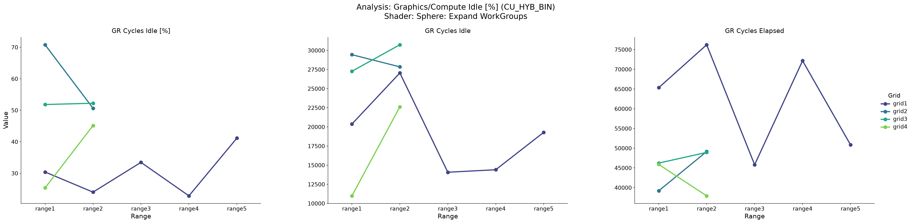

_Caption (Fig. 409): Charts showing Graphics/Compute Idle (%) for Sphere: Expand WorkGroups across compact grid scenes grid1–grid4 The x-axis represents the camera range (distance from the scene), and the y-axis represents the value. Each chart has its own scale (mentioned in the title). Each line corresponds to a different grid (grid1, grid2, …)._

In [Fig. 409](#fig-409) there are not enough nor relevant results.

##### Sphere: Tiled Raster WG

**Fig. 410**
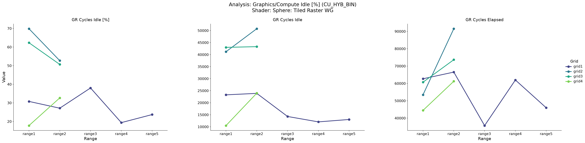

_Caption (Fig. 410): Charts showing Graphics/Compute Idle (%) for Sphere: Tiled Raster WG across compact grid scenes grid1–grid4 The x-axis represents the camera range (distance from the scene), and the y-axis represents the value. Each chart has its own scale (mentioned in the title). Each line corresponds to a different grid (grid1, grid2, …)._

In [Fig. 410](#fig-410) there are few and diverse results to extract something from it.

##### Sphere: Small Raster

**Fig. 411**
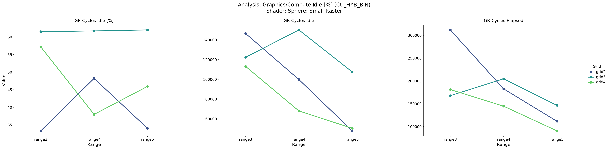

_Caption (Fig. 411): Charts showing Graphics/Compute Idle (%) for Sphere: Small Raster across compact grid scenes grid1–grid4 The x-axis represents the camera range (distance from the scene), and the y-axis represents the value. Each chart has its own scale (mentioned in the title). Each line corresponds to a different grid (grid1, grid2, …)._

In [Fig. 411](#fig-411) there is also few results, but it would seem that GR Cycles Idle reduce across ranges, same as GR Cycles Elapsed. It is unexpected since at farther ranges there should be more work for small raster, but it also means lighter work for it and more resources.

##### Cylinder: Classify

**Fig. 412**
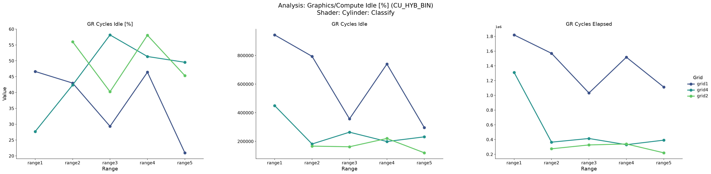

_Caption (Fig. 412): Charts showing Graphics/Compute Idle (%) for Cylinder: Classify across compact grid scenes grid1–grid4 The x-axis represents the camera range (distance from the scene), and the y-axis represents the value. Each chart has its own scale (mentioned in the title). Each line corresponds to a different grid (grid1, grid2, …)._

In [Fig. 412](#fig-412) in this case it is possible to see a pattern. For GR Cycles Idle [%] values decrease for bigger grids, but across ranges there's no clear behaviour. It has values between 45-60% for grid1, and between 15-40% for grid4. For GR Cycles Elapsed, values decrease with range, starting in 1 000 000 cycles in the highest point and decreasing to around 200 000 cycles in the lowest point, as in molecular [Fig. 285](#fig-285). On compact regular grids the small/large entity split shifts more predictably with camera range than in sparse molecular scenes; see the cycle view in [Fig. 411](#fig-411).

##### Cylinder: Sort+RLE+TileOffsets

**Fig. 413**
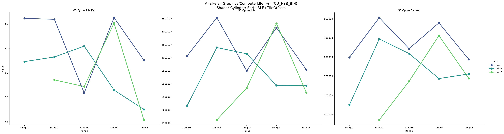

_Caption (Fig. 413): Charts showing Graphics/Compute Idle (%) for Cylinder: Sort+RLE+TileOffsets across compact grid scenes grid1–grid4 The x-axis represents the camera range (distance from the scene), and the y-axis represents the value. Each chart has its own scale (mentioned in the title). Each line corresponds to a different grid (grid1, grid2, …)._

In [Fig. 413](#fig-413) no clear pattern can be found in any metric, as in molecular [Fig. 286](#fig-286), but the percentages of GR Cycles Idle [%] are high in any case; see the cycle view in [Fig. 412](#fig-412).

##### Cylinder: Expand WorkGroups

**Fig. 414**
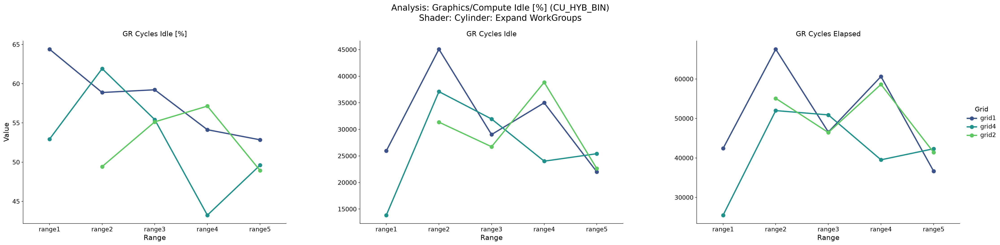

_Caption (Fig. 414): Charts showing Graphics/Compute Idle (%) for Cylinder: Expand WorkGroups across compact grid scenes grid1–grid4 The x-axis represents the camera range (distance from the scene), and the y-axis represents the value. Each chart has its own scale (mentioned in the title). Each line corresponds to a different grid (grid1, grid2, …)._

In [Fig. 414](#fig-414) no clear pattern can be found in any metric and the percentages of GR Cycles Idle [%] are high in any case. It would seem as if values decreased with increasing the size of the grids, but is not consistent across ranges, as in molecular [Fig. 287](#fig-287); see the cycle view in [Fig. 413](#fig-413).

##### Cylinder: Tiled Raster WG

**Fig. 415**
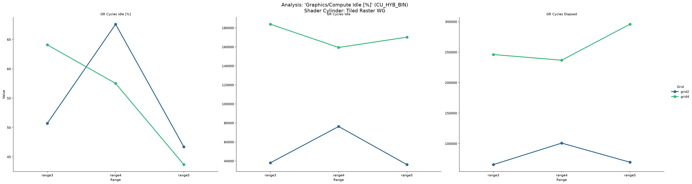

_Caption (Fig. 415): Charts showing Graphics/Compute Idle (%) for Cylinder: Tiled Raster WG across compact grid scenes grid1–grid4 The x-axis represents the camera range (distance from the scene), and the y-axis represents the value. Each chart has its own scale (mentioned in the title). Each line corresponds to a different grid (grid1, grid2, …)._

In [Fig. 415](#fig-415) no clear pattern can be found in any metric, as in molecular [Fig. 288](#fig-288); see the cycle view in [Fig. 414](#fig-414).

##### L1TEX L2 Hit Rates

##### Sphere: Classify

**Fig. 416**
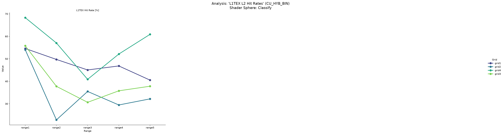

_Caption (Fig. 416): Charts showing L2 Hit Rates (%) for Sphere: Classify across compact grid scenes grid1–grid4 The x-axis represents the camera range (distance from the scene), and the y-axis represents the value. Each chart has its own scale (mentioned in the title). Each line corresponds to a different grid (grid1, grid2, …)._

In [Fig. 416](#fig-416) there is a pattern in each grids, which shows that from range 1 to 2 (or 3) the values decrease, but from that point they increase with range. Also, it may seem that cache hit rates are higher for bigger grids, with values between 35-50% for grid1, 15-25% for grid2, 20-30% for grid3 and 35-60% for grid4. This may be because at close ranges more tile data must be created, so more random access to memory is needed (threads doing atomic operations to create tile-entity pairs), but as range increases, more small entities appear which means just one store operation per entity, so more spatial locality and better cache hit rates. Also, bigger grids may have better hit rates because of the larger amount of entities to process, which means more spatial locality and better cache performance, as in molecular [Fig. 289](#fig-289). On compact regular grids the small/large entity split shifts more predictably with camera range than in sparse molecular scenes; see the cycle view in [Fig. 415](#fig-415).

##### Sphere: Sort+RLE+TileOffsets

**Fig. 417**
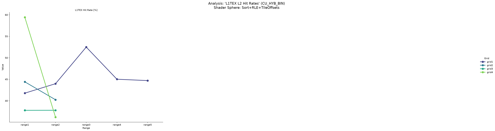

_Caption (Fig. 417): Charts showing L2 Hit Rates (%) for Sphere: Sort+RLE+TileOffsets across compact grid scenes grid1–grid4 The x-axis represents the camera range (distance from the scene), and the y-axis represents the value. Each chart has its own scale (mentioned in the title). Each line corresponds to a different grid (grid1, grid2, …)._

In [Fig. 417](#fig-417) are not much results, but even so grids have high cache hit percentages, meaning efficient memory accesses from CUDA functions.

##### Sphere: Expand WorkGroups

**Fig. 418**
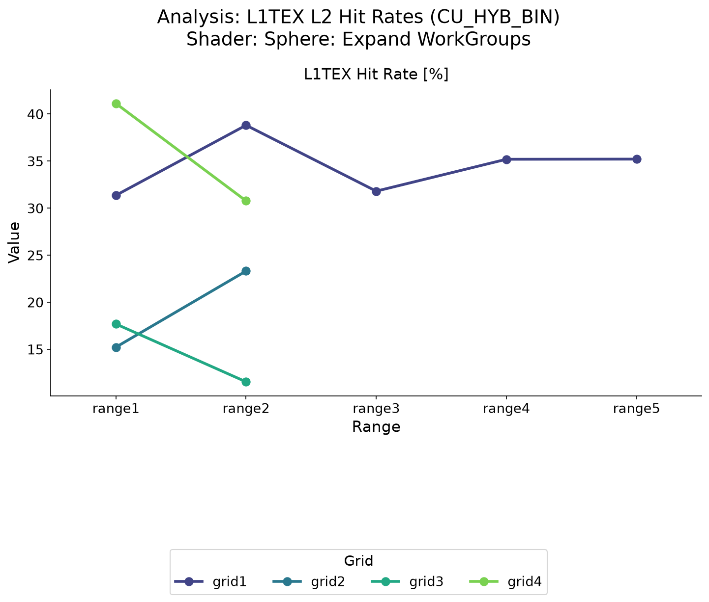

_Caption (Fig. 418): Charts showing L2 Hit Rates (%) for Sphere: Expand WorkGroups across compact grid scenes grid1–grid4 The x-axis represents the camera range (distance from the scene), and the y-axis represents the value. Each chart has its own scale (mentioned in the title). Each line corresponds to a different grid (grid1, grid2, …)._

In [Fig. 418](#fig-418) no behaviour can be captured in this stage, having fluctuating values between 5-35%. It may seem as low cache hit rates, yet this stage is light and its purpose doesn't reside on memory accesses, so it may be that the GPU is not fully utilizing the cache for this stage, as in molecular [Fig. 291](#fig-291); see the cycle view in [Fig. 417](#fig-417).

##### Sphere: Tiled Raster WG

**Fig. 419**
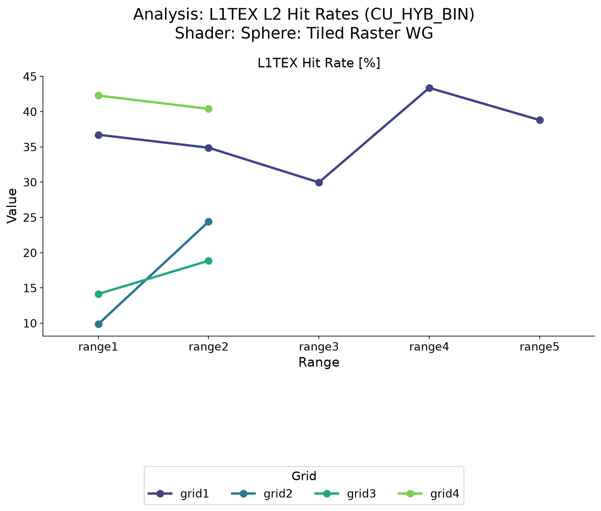

_Caption (Fig. 419): Charts showing L2 Hit Rates (%) for Sphere: Tiled Raster WG across compact grid scenes grid1–grid4 The x-axis represents the camera range (distance from the scene), and the y-axis represents the value. Each chart has its own scale (mentioned in the title). Each line corresponds to a different grid (grid1, grid2, …)._

In [Fig. 419](#fig-419) it can be seen how values decrease with range and there are few results, which is expected since this stage is meant only for large entities. Close ranges must show high hit rates: close to 40% for grid3, over 35% in most cases for grid2, but only a bit over 20% for grid1 and grid4, as in molecular [Fig. 292](#fig-292); see the cycle view in [Fig. 418](#fig-418).

##### Sphere: Small Raster

**Fig. 420**
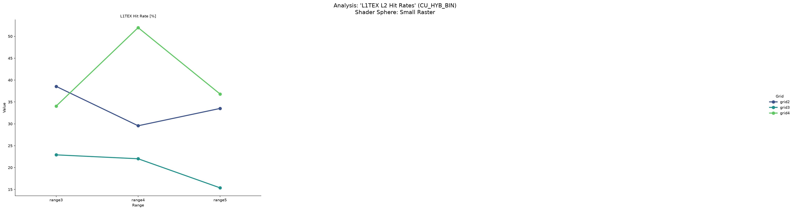

_Caption (Fig. 420): Charts showing L2 Hit Rates (%) for Sphere: Small Raster across compact grid scenes grid1–grid4 The x-axis represents the camera range (distance from the scene), and the y-axis represents the value. Each chart has its own scale (mentioned in the title). Each line corresponds to a different grid (grid1, grid2, …)._

In [Fig. 420](#fig-420) values increase with range in most cases, reaching values over 40% in some cases (grid4). A strange behaviour can be seen for grid3, which shows a decrease across ranges, dropping from around 23% in range 3 to around 10% in range 5. This may be because of the particular distribution of entities in the grids at each range, but it is not clear.

##### Cylinder: Classify

**Fig. 421**
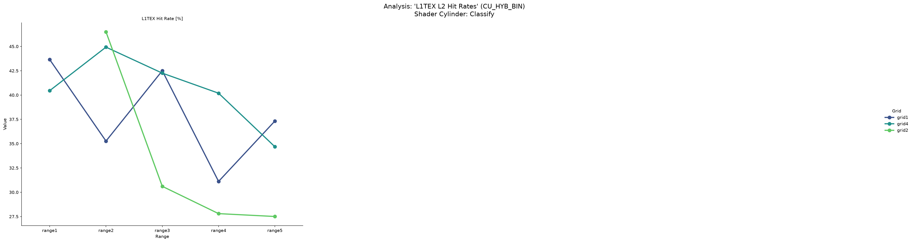

_Caption (Fig. 421): Charts showing L2 Hit Rates (%) for Cylinder: Classify across compact grid scenes grid1–grid4 The x-axis represents the camera range (distance from the scene), and the y-axis represents the value. Each chart has its own scale (mentioned in the title). Each line corresponds to a different grid (grid1, grid2, …)._

In [Fig. 421](#fig-421) show a similar behaviour to the sphere classify stage, but showing a drastic rise in hit rates for the biggest grids, reaching values over 50% and close to 60%in some cases, as in molecular [Fig. 294](#fig-294). On compact regular grids the small/large entity split shifts more predictably with camera range than in sparse molecular scenes; see the cycle view in [Fig. 420](#fig-420).

##### Cylinder: Sort+RLE+TileOffsets

**Fig. 422**
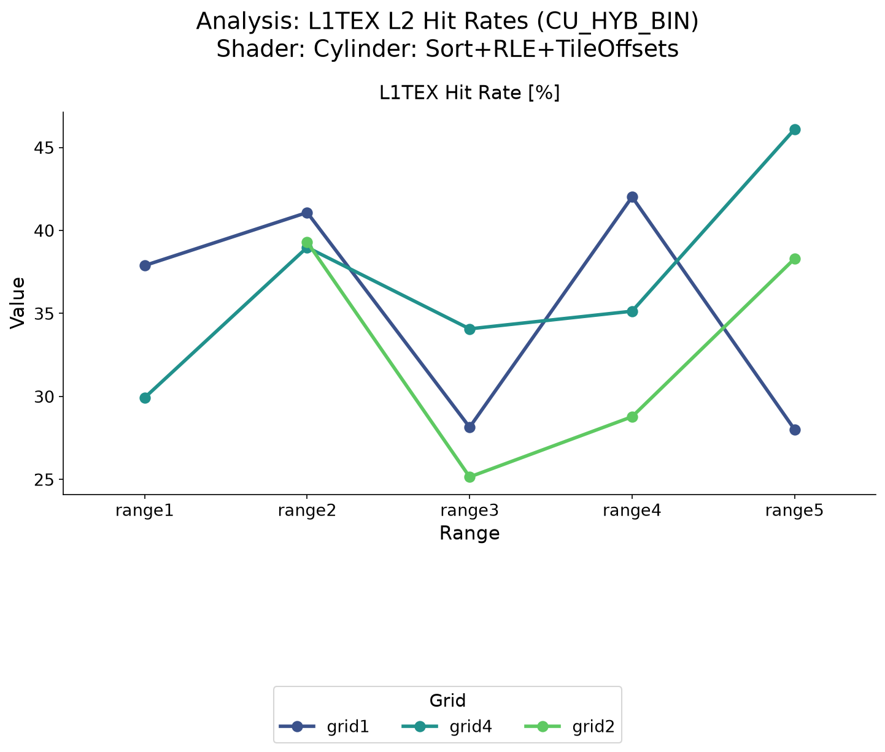

_Caption (Fig. 422): Charts showing L2 Hit Rates (%) for Cylinder: Sort+RLE+TileOffsets across compact grid scenes grid1–grid4 The x-axis represents the camera range (distance from the scene), and the y-axis represents the value. Each chart has its own scale (mentioned in the title). Each line corresponds to a different grid (grid1, grid2, …)._

In [Fig. 422](#fig-422) no clear pattern can be seen in this stage, with values fluctuating between 20-45% in most cases, as in molecular [Fig. 295](#fig-295); see the cycle view in [Fig. 421](#fig-421).

##### Cylinder: Expand WorkGroups

**Fig. 423**
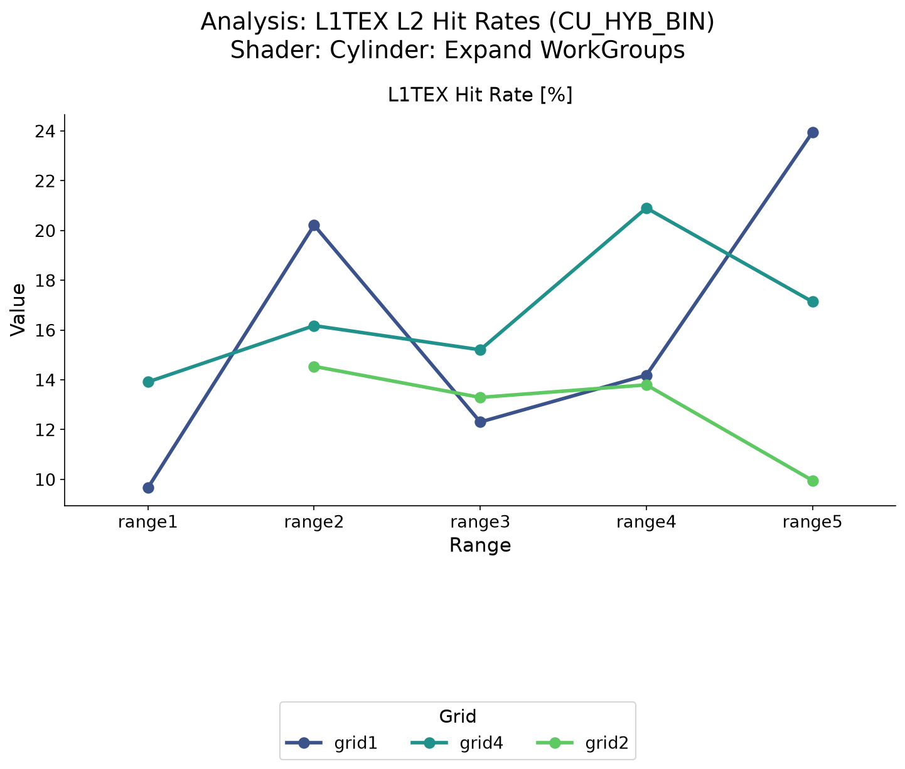

_Caption (Fig. 423): Charts showing L2 Hit Rates (%) for Cylinder: Expand WorkGroups across compact grid scenes grid1–grid4 The x-axis represents the camera range (distance from the scene), and the y-axis represents the value. Each chart has its own scale (mentioned in the title). Each line corresponds to a different grid (grid1, grid2, …)._

In [Fig. 423](#fig-423) same as the Sphere Expand WorkGroups stage, with no clear pattern and values, as in molecular [Fig. 296](#fig-296); see the cycle view in [Fig. 422](#fig-422).

##### Cylinder: Tiled Raster WG

**Fig. 424**
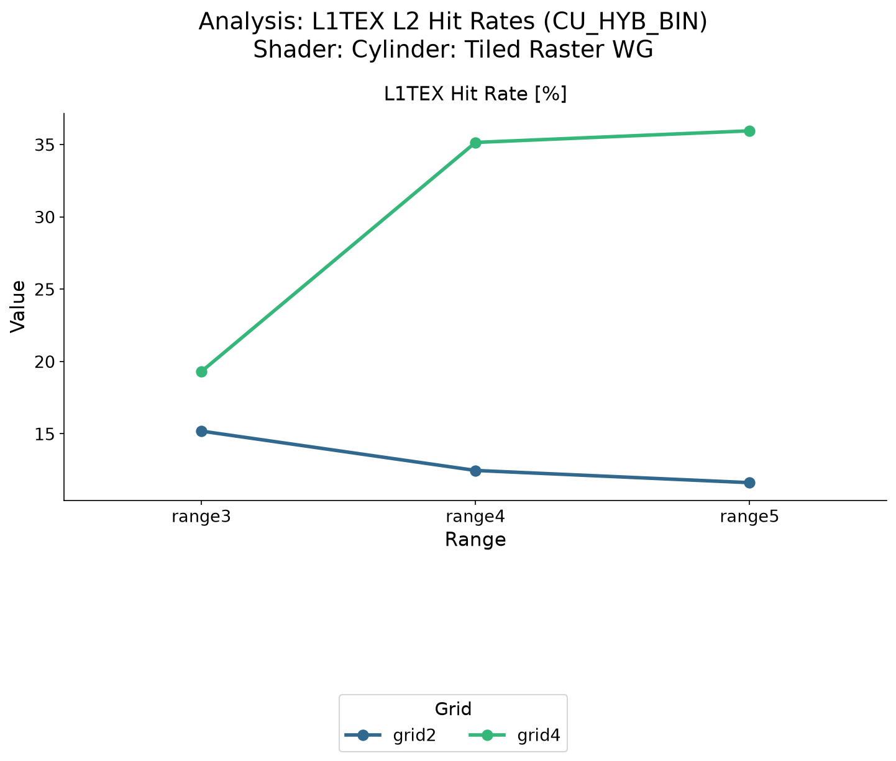

_Caption (Fig. 424): Charts showing L2 Hit Rates (%) for Cylinder: Tiled Raster WG across compact grid scenes grid1–grid4 The x-axis represents the camera range (distance from the scene), and the y-axis represents the value. Each chart has its own scale (mentioned in the title). Each line corresponds to a different grid (grid1, grid2, …)._

In [Fig. 424](#fig-424) not enough data can be extracted to find a pattern.

##### L1Tex Miss Sectors

##### Sphere: Classify

**Fig. 425**
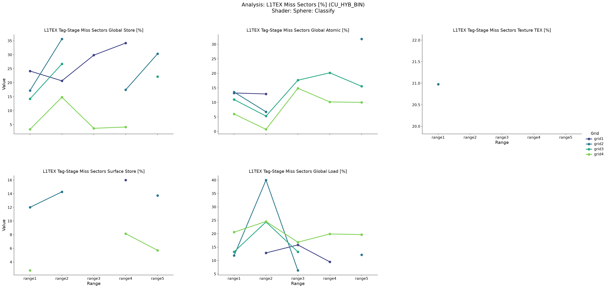

_Caption (Fig. 425): Charts showing L1 Miss Sectors for Sphere: Classify across compact grid scenes grid1–grid4 The x-axis represents the camera range (distance from the scene), and the y-axis represents the value. Each chart has its own scale (mentioned in the title). Each line corresponds to a different grid (grid1, grid2, …)._

In [Fig. 425](#fig-425) there are interesting results. L1TEX Tag-Stage Miss Sectors Surface Store [%] tells the percentage of failures in the L1TEX cache that were caused by store operations to surfaces, which are the type of memory structure used for storing the texture of the framebuffer. Since this stage doesn't even touch the framebuffer, it was expected to have very low values (below 16%), but even so there aren't many results to analyze. L1TEX Tag-Stage Miss Sectors Global Atomic [%] also has low percentage of failures, since there are a lot of atomic operations but only on very few memory addresses, so the cache can easily store them and have a high hit rate, with values below 18%. L1TEX Tag-Stage Miss Sectors Global Load [%] show higher values, yet still low, with values around 15-35%, which may be because of the reading of the entities buffer, which is a global memory structure, but since it is read sequentially and with good spatial locality, the cache hit rate is not penalized much. Global Store show erratic behaviour.

##### Sphere: Sort+RLE+TileOffsets

**Fig. 426**
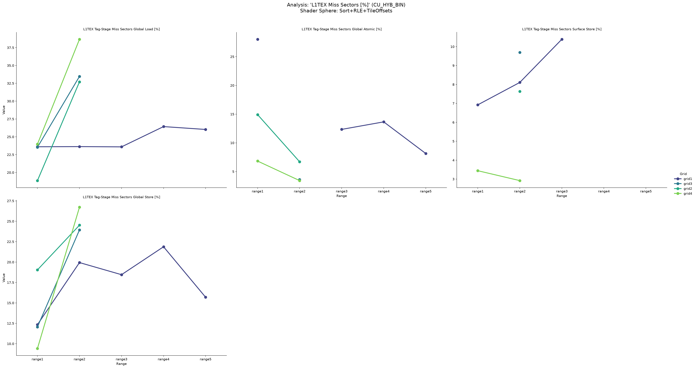

_Caption (Fig. 426): Charts showing L1 Miss Sectors for Sphere: Sort+RLE+TileOffsets across compact grid scenes grid1–grid4 The x-axis represents the camera range (distance from the scene), and the y-axis represents the value. Each chart has its own scale (mentioned in the title). Each line corresponds to a different grid (grid1, grid2, …)._

In [Fig. 426](#fig-426) in this stage, L1TEX Tag-Stage Miss Sectors Surface Store [%] shows almost null values, which is expected since this stage doesn't write to the framebuffer. L1TEX Tag-Stage Miss Sectors Global Atomic [%] shows values between 0-20%, which may be expected since it is most probable that operations like Radix Sort and RLE from the CUB library are implemented with a lot of atomic operations to global memory in a sophisticated way to maximize memory and cache performance. L1TEX Tag-Stage Miss Sectors Global Store [%] shows values between 15-28%, which may be because of the writing needed for the sorting and encoding of the entities (yet still good percentages). Last is L1TEX Tag-Stage Miss Sectors Global Load [%] with higher values, between 25-45%, which may be because of the tile-entity buffer accesses, which are global memory accesses with low spatial locality and may completely change from one frame to another, so cache may not be very effective.

##### Sphere: Expand WorkGroups

**Fig. 427**
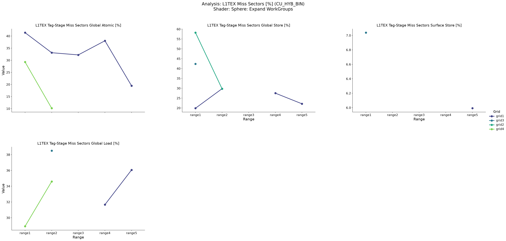

_Caption (Fig. 427): Charts showing L1 Miss Sectors for Sphere: Expand WorkGroups across compact grid scenes grid1–grid4 The x-axis represents the camera range (distance from the scene), and the y-axis represents the value. Each chart has its own scale (mentioned in the title). Each line corresponds to a different grid (grid1, grid2, …)._

From [Fig. 427](#fig-427) not enough information can be extracted.

##### Sphere: Tiled Raster WG

**Fig. 428**
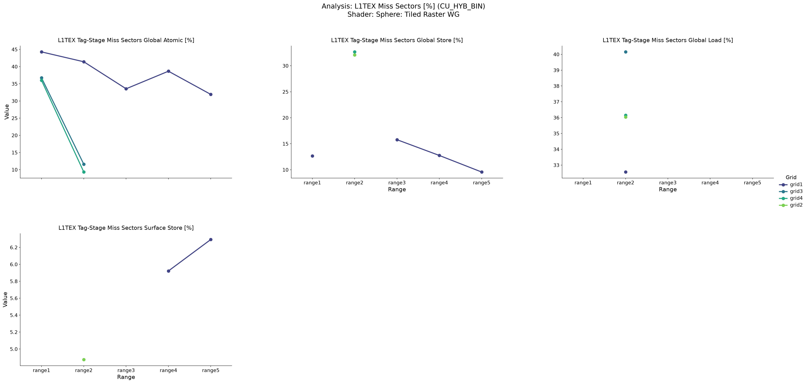

_Caption (Fig. 428): Charts showing L1 Miss Sectors for Sphere: Tiled Raster WG across compact grid scenes grid1–grid4 The x-axis represents the camera range (distance from the scene), and the y-axis represents the value. Each chart has its own scale (mentioned in the title). Each line corresponds to a different grid (grid1, grid2, …)._

From [Fig. 428](#fig-428) not enough information can be extracted.

##### Sphere: Small Raster

**Fig. 429**
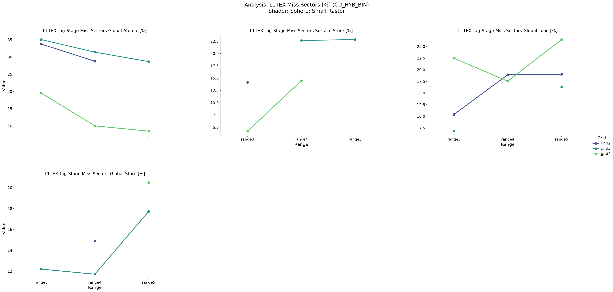

_Caption (Fig. 429): Charts showing L1 Miss Sectors for Sphere: Small Raster across compact grid scenes grid1–grid4 The x-axis represents the camera range (distance from the scene), and the y-axis represents the value. Each chart has its own scale (mentioned in the title). Each line corresponds to a different grid (grid1, grid2, …)._

In [Fig. 429](#fig-429) L1TEX Tag-Stage Miss Sectors Global Atomic [%] shows surprisingly low values for most grids (lower than 40%). L1TEX Tag-Stage Miss Sectors Global Load [%] may be showing that misses diminish with bigger grids, and that could be because it means more coalesced loading data of the spheres buffer so better cache performance.

##### Cylinder: Classify

**Fig. 430**
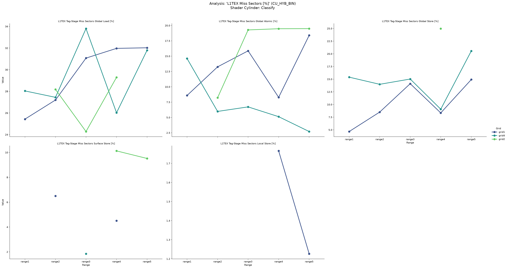

_Caption (Fig. 430): Charts showing L1 Miss Sectors for Cylinder: Classify across compact grid scenes grid1–grid4 The x-axis represents the camera range (distance from the scene), and the y-axis represents the value. Each chart has its own scale (mentioned in the title). Each line corresponds to a different grid (grid1, grid2, …)._

In [Fig. 430](#fig-430) L1TEX Tag-Stage Miss Sectors Global Store [%] (grid1 around 5-15% and grid4 around 10-20%) and L1TEX Tag-Stage Miss Sectors Global Load [%] (grid1 around 24-32%, grid2 around 24-40% and grid4 around 26-34%) show similar behaviour, but with small variations so no patterns across ranges. For Global Store grid1 and grid4 have some constant variation, with percentages within 5-20%. Even less misses were expected since for small entities memory accesses are more ordered.

##### Cylinder: Sort+RLE+TileOffsets

**Fig. 431**
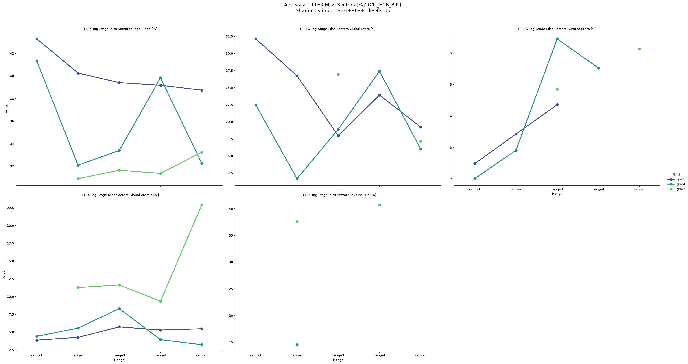

_Caption (Fig. 431): Charts showing L1 Miss Sectors for Cylinder: Sort+RLE+TileOffsets across compact grid scenes grid1–grid4 The x-axis represents the camera range (distance from the scene), and the y-axis represents the value. Each chart has its own scale (mentioned in the title). Each line corresponds to a different grid (grid1, grid2, …)._

In [Fig. 431](#fig-431) L1TEX Tag-Stage Miss Sectors Global Store [%] shows no clear pattern, with values fluctuating between 13-32% in general, so there are no alarming values. L1TEX Tag-Stage Miss Sectors Global Load [%] shows highest values for grid1 in every range, and for grid4 only in range1 and range4, but in most cases misses go over 30%. This could be due to the need of multiple reads in different memory spaces but few reads per space. Global Atomic [%] has steady values per grid, but they are low.

##### Cylinder: Expand WorkGroups

**Fig. 432**
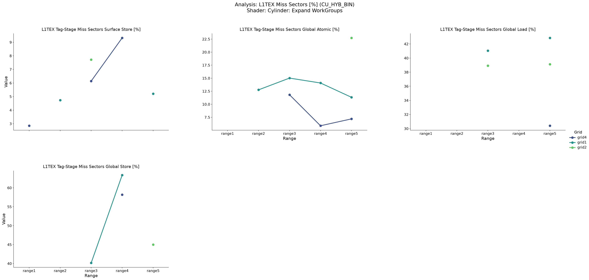

_Caption (Fig. 432): Charts showing L1 Miss Sectors for Cylinder: Expand WorkGroups across compact grid scenes grid1–grid4 The x-axis represents the camera range (distance from the scene), and the y-axis represents the value. Each chart has its own scale (mentioned in the title). Each line corresponds to a different grid (grid1, grid2, …)._

[Fig. 432](#fig-432) doesn't have enough data in any case for any metric.

##### Cylinder: Tiled Raster WG

**Fig. 433**
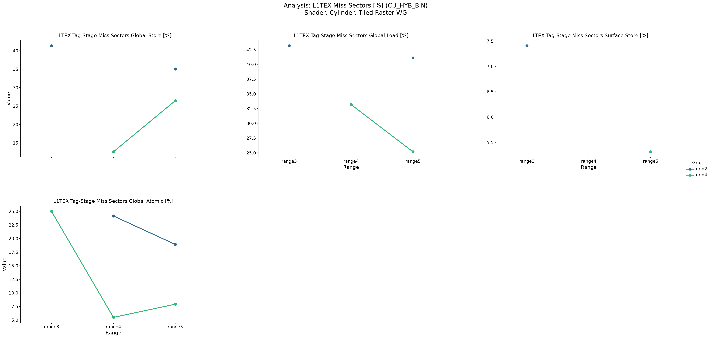

_Caption (Fig. 433): Charts showing L1 Miss Sectors for Cylinder: Tiled Raster WG across compact grid scenes grid1–grid4 The x-axis represents the camera range (distance from the scene), and the y-axis represents the value. Each chart has its own scale (mentioned in the title). Each line corresponds to a different grid (grid1, grid2, …)._

[Fig. 433](#fig-433) is same as the previous stage.

##### L1TEX Sectors [\%]

##### Sphere: Classify

**Fig. 434**
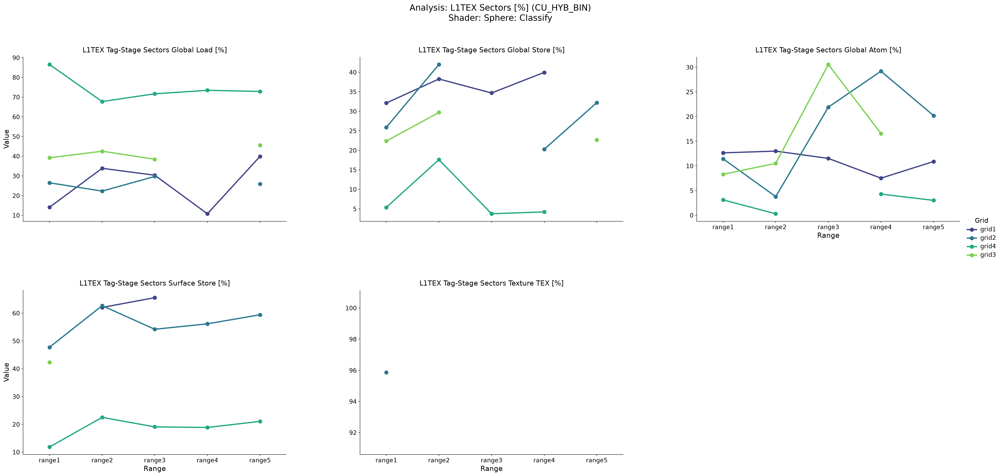

_Caption (Fig. 434): Charts showing L1TEX Sectors (%) for Sphere: Classify across compact grid scenes grid1–grid4 The x-axis represents the camera range (distance from the scene), and the y-axis represents the value. Each chart has its own scale (mentioned in the title). Each line corresponds to a different grid (grid1, grid2, …)._

In [Fig. 434](#fig-434) L1TEX Tag-Stage Sectors Global Load [%] seems to be constant across ranges, but percentages are bigger for larger scenes. It reaches great percentages for grid4, over 60%, meaning that most cache usage comes from global buffer. The rest of the grids also have some values in L1TEX Tag-Stage Sectors Global Store [%], where it is also more or less constant across ranges. L1TEX Tag-Stage Sectors Global Atomic [%] seems to have higher values for farther ranges. It was expected that Global Store would have more or less the same values than GLobal Load, at least for farther ranges, since more writing in global buffers is made.

##### Sphere: Sort+RLE+TileOffsets

**Fig. 435**
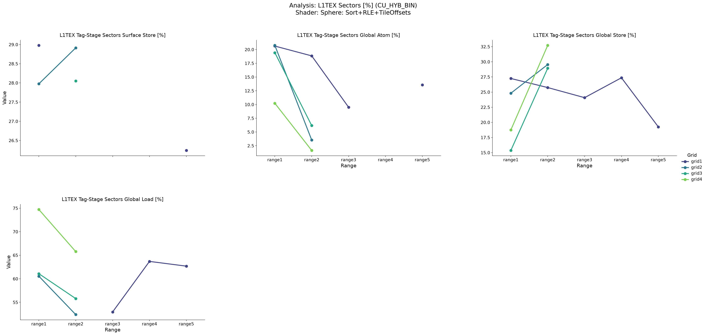

_Caption (Fig. 435): Charts showing L1TEX Sectors (%) for Sphere: Sort+RLE+TileOffsets across compact grid scenes grid1–grid4 The x-axis represents the camera range (distance from the scene), and the y-axis represents the value. Each chart has its own scale (mentioned in the title). Each line corresponds to a different grid (grid1, grid2, …)._

In [Fig. 435](#fig-435) there is no clear pattern, yet by looking at the values of each Figure it can be seen that Global Load predominates on the use of the cache over all metrics and dropping with range, followed by Global Store that rises with range and then by Global Atomic (that also seem to drop with range).

##### Sphere: Expand WorkGroups

**Fig. 436**
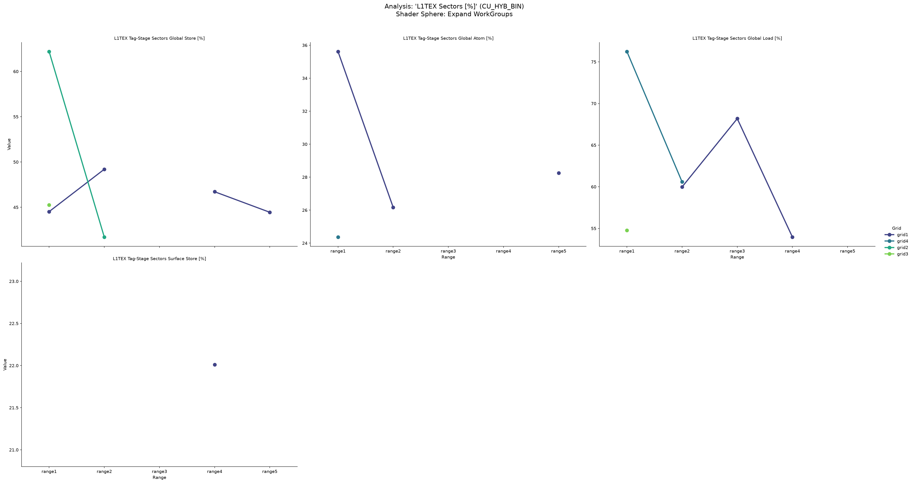

_Caption (Fig. 436): Charts showing L1TEX Sectors (%) for Sphere: Expand WorkGroups across compact grid scenes grid1–grid4 The x-axis represents the camera range (distance from the scene), and the y-axis represents the value. Each chart has its own scale (mentioned in the title). Each line corresponds to a different grid (grid1, grid2, …)._

[Fig. 436](#fig-436) has not enough results.

##### Sphere: Tiled Raster WG

**Fig. 437**
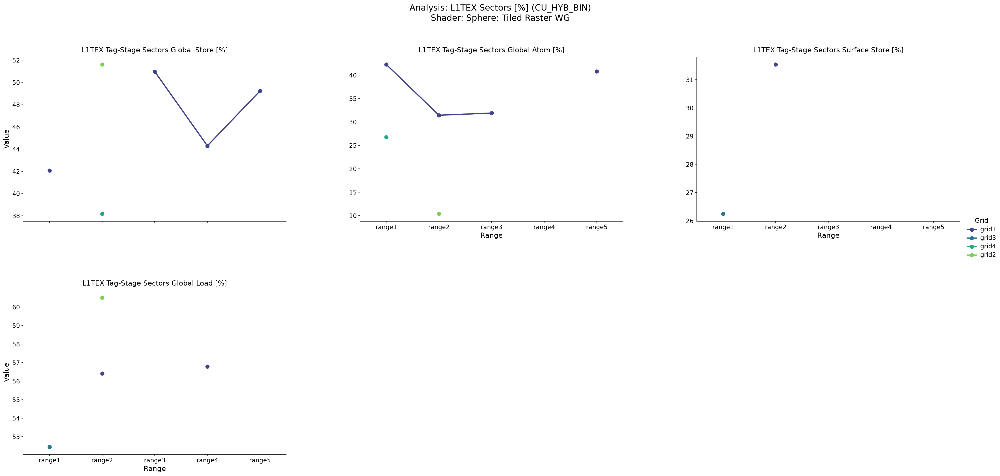

_Caption (Fig. 437): Charts showing L1TEX Sectors (%) for Sphere: Tiled Raster WG across compact grid scenes grid1–grid4 The x-axis represents the camera range (distance from the scene), and the y-axis represents the value. Each chart has its own scale (mentioned in the title). Each line corresponds to a different grid (grid1, grid2, …)._

[Fig. 437](#fig-437) has not enough results.

##### Sphere: Small Raster

**Fig. 438**
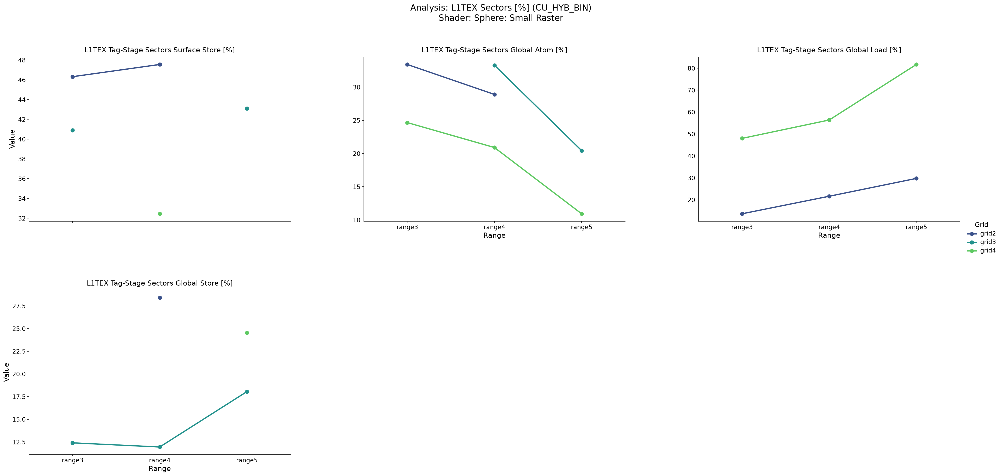

_Caption (Fig. 438): Charts showing L1TEX Sectors (%) for Sphere: Small Raster across compact grid scenes grid1–grid4 The x-axis represents the camera range (distance from the scene), and the y-axis represents the value. Each chart has its own scale (mentioned in the title). Each line corresponds to a different grid (grid1, grid2, …)._

In [Fig. 438](#fig-438) there is not much to see: Global Atomic [%] shows dropping from range3 at around 25-30% to 10% in range5. Global Load rises from around 50% in range3 and 80% at range5.

##### Cylinder: Classify

**Fig. 439**
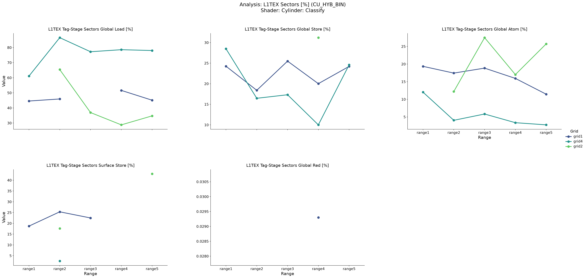

_Caption (Fig. 439): Charts showing L1TEX Sectors (%) for Cylinder: Classify across compact grid scenes grid1–grid4 The x-axis represents the camera range (distance from the scene), and the y-axis represents the value. Each chart has its own scale (mentioned in the title). Each line corresponds to a different grid (grid1, grid2, …)._

In [Fig. 439](#fig-439) results are similar to those of spheres.

##### Cylinder: Sort+RLE+TileOffsets

**Fig. 440**
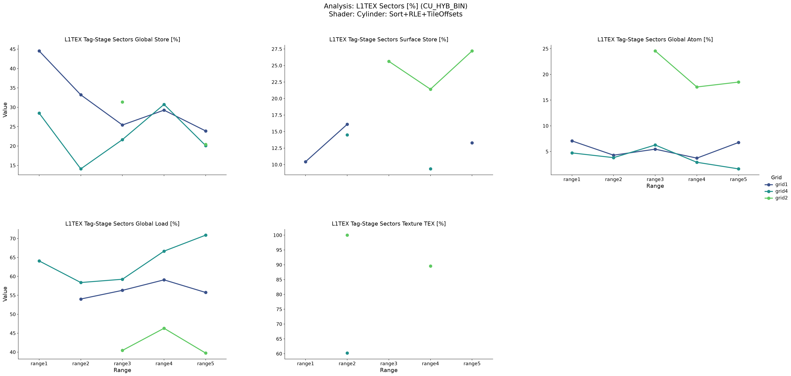

_Caption (Fig. 440): Charts showing L1TEX Sectors (%) for Cylinder: Sort+RLE+TileOffsets across compact grid scenes grid1–grid4 The x-axis represents the camera range (distance from the scene), and the y-axis represents the value. Each chart has its own scale (mentioned in the title). Each line corresponds to a different grid (grid1, grid2, …)._

In [Fig. 440](#fig-440) L1TEX Tag-Stage Sectors Global Store [%] starts with high percentages, but they lower with range, contrary to the Global Load [%].

##### Cylinder: Expand WorkGroups

**Fig. 441**
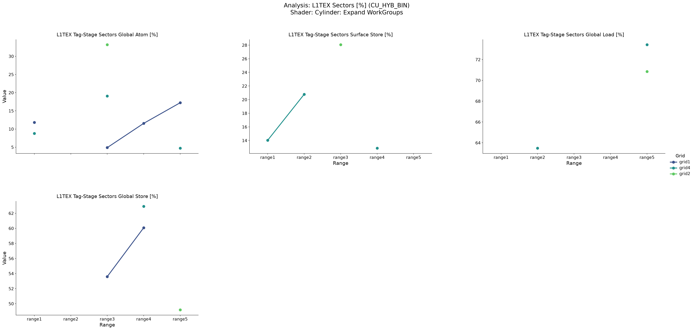

_Caption (Fig. 441): Charts showing L1TEX Sectors (%) for Cylinder: Expand WorkGroups across compact grid scenes grid1–grid4 The x-axis represents the camera range (distance from the scene), and the y-axis represents the value. Each chart has its own scale (mentioned in the title). Each line corresponds to a different grid (grid1, grid2, …)._

In [Fig. 441](#fig-441) there is not enough data to be extracted.

##### Cylinder: Tiled Raster WG

**Fig. 442**
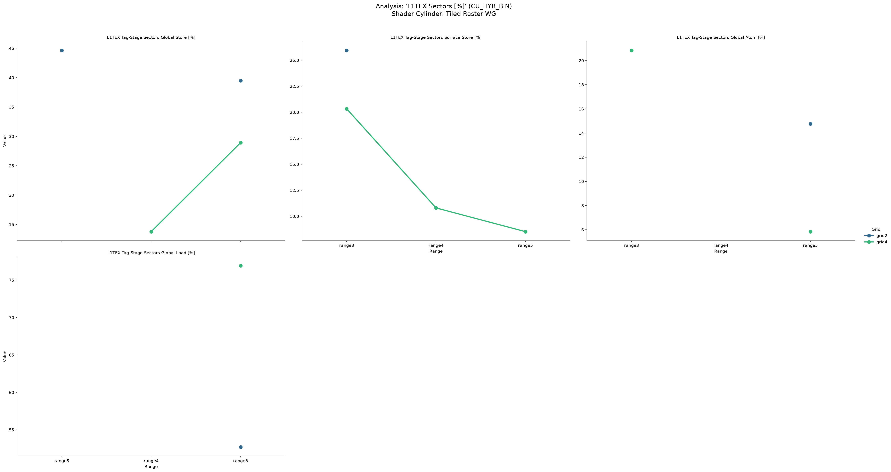

_Caption (Fig. 442): Charts showing L1TEX Sectors (%) for Cylinder: Tiled Raster WG across compact grid scenes grid1–grid4 The x-axis represents the camera range (distance from the scene), and the y-axis represents the value. Each chart has its own scale (mentioned in the title). Each line corresponds to a different grid (grid1, grid2, …)._

In [Fig. 442](#fig-442) not enough data can be extracted..

##### Unit Throughputs

##### Sphere: Classify

**Fig. 443**
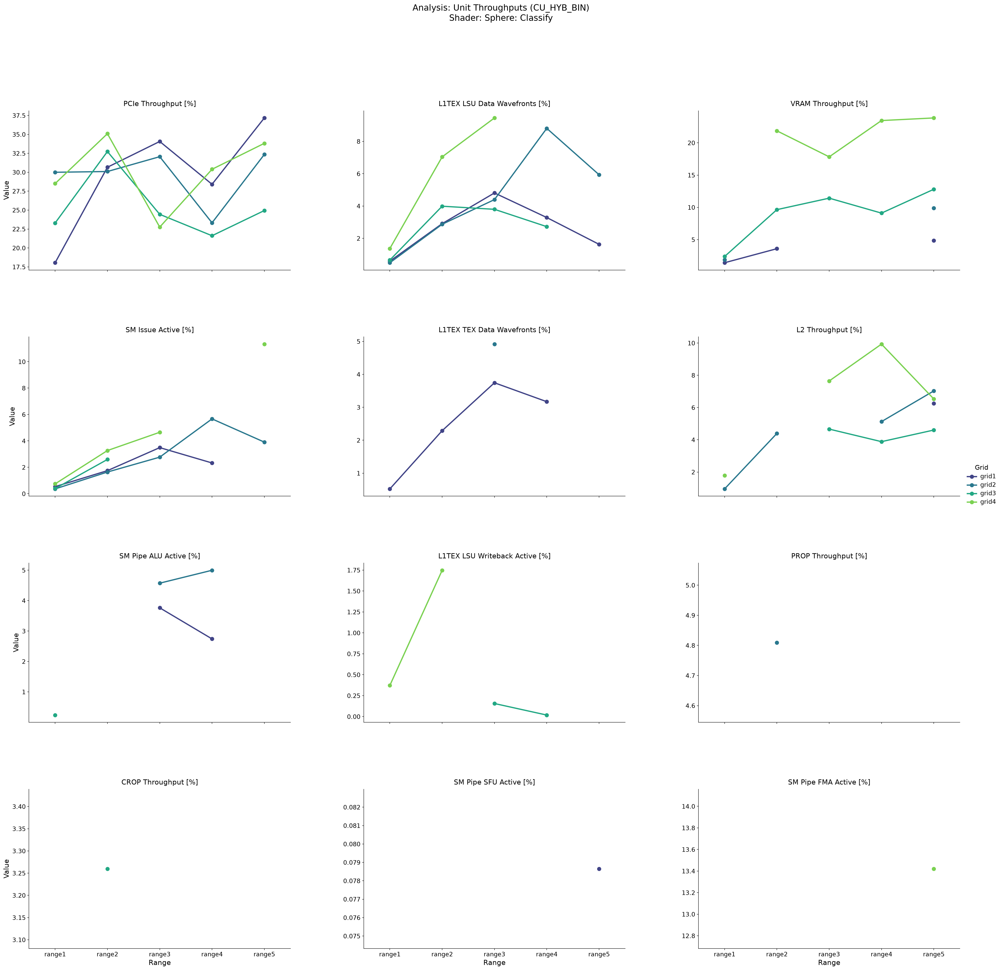

_Caption (Fig. 443): Charts showing Unit Throughputs (%) for Sphere: Classify across compact grid scenes grid1–grid4 The x-axis represents the camera range (distance from the scene), and the y-axis represents the value. Each chart has its own scale (mentioned in the title). Each line corresponds to a different grid (grid1, grid2, …)._

In [Fig. 443](#fig-443) PCIe Throughput [%] shows the same behaviour for every grid, but it is an erratic one. Values may fluctuate between 18% and 38%. This could be due to pending data movements from last frame, moving resources for the new frame. The rest of the charts don't have much results.

##### Sphere: Sort+RLE+TileOffsets

**Fig. 444**
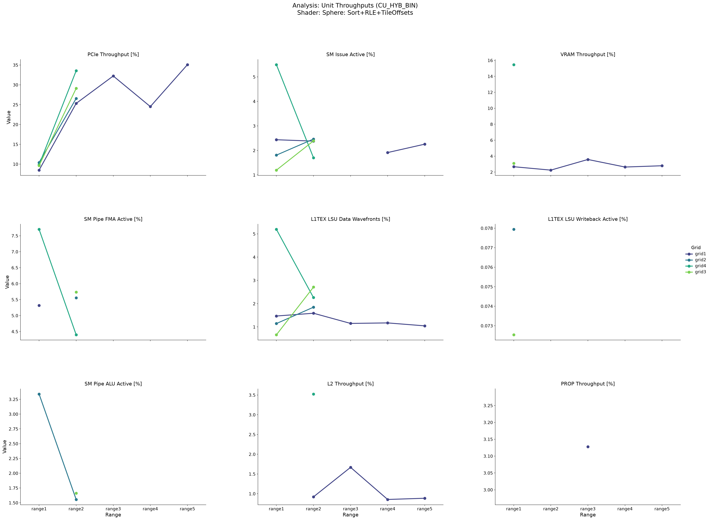

_Caption (Fig. 444): Charts showing Unit Throughputs (%) for Sphere: Sort+RLE+TileOffsets across compact grid scenes grid1–grid4 The x-axis represents the camera range (distance from the scene), and the y-axis represents the value. Each chart has its own scale (mentioned in the title). Each line corresponds to a different grid (grid1, grid2, …)._

In [Fig. 444](#fig-444) happens the same as the last stage. Maybe asynchronous data movement are manifesitng in this stage.

##### Sphere: Expand WorkGroups

**Fig. 445**
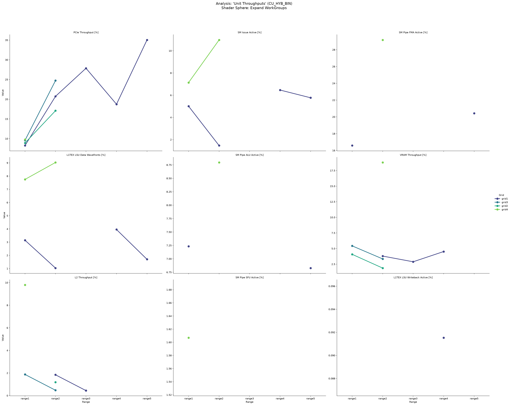

_Caption (Fig. 445): Charts showing Unit Throughputs (%) for Sphere: Expand WorkGroups across compact grid scenes grid1–grid4 The x-axis represents the camera range (distance from the scene), and the y-axis represents the value. Each chart has its own scale (mentioned in the title). Each line corresponds to a different grid (grid1, grid2, …)._

In [Fig. 445](#fig-445) there are not enough results, only PCIe Throughput may be showing something as in the last two stages.

##### Sphere: Tiled Raster WG

**Fig. 446**
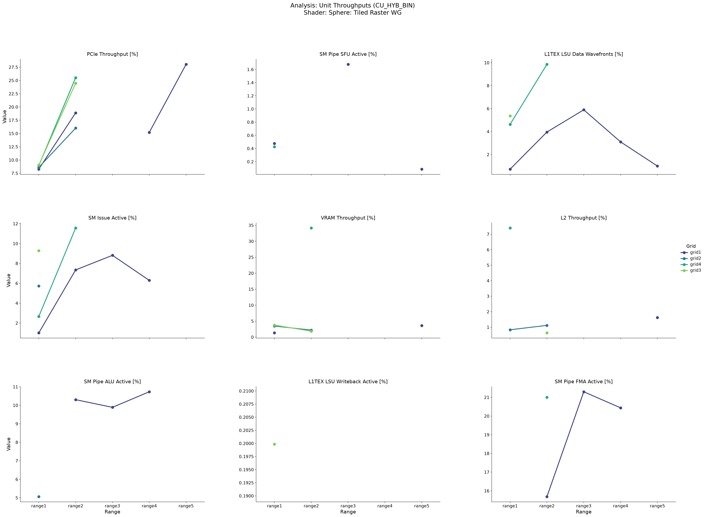

_Caption (Fig. 446): Charts showing Unit Throughputs (%) for Sphere: Tiled Raster WG across compact grid scenes grid1–grid4 The x-axis represents the camera range (distance from the scene), and the y-axis represents the value. Each chart has its own scale (mentioned in the title). Each line corresponds to a different grid (grid1, grid2, …)._

In [Fig. 446](#fig-446) there are not enough results, only PCIe Throughput may be showing something as in the last two stages..

##### Sphere: Small Raster

**Fig. 447**
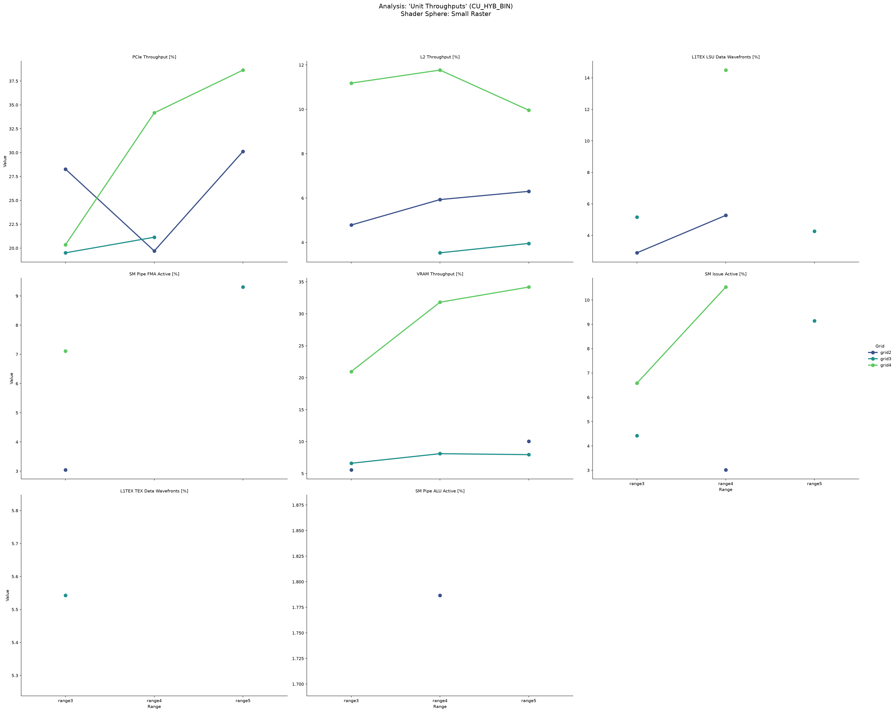

_Caption (Fig. 447): Charts showing Unit Throughputs (%) for Sphere: Small Raster across compact grid scenes grid1–grid4 The x-axis represents the camera range (distance from the scene), and the y-axis represents the value. Each chart has its own scale (mentioned in the title). Each line corresponds to a different grid (grid1, grid2, …)._

In [Fig. 447](#fig-447) grid4 has results. PCIe Throughput [%] showed increasing values, just as VRAM Throughput [%], SM Issue Active [%] and L2 Throughput. This could mean that this pipeline has yet to be saturated.

##### Cylinder: Classify

**Fig. 448**
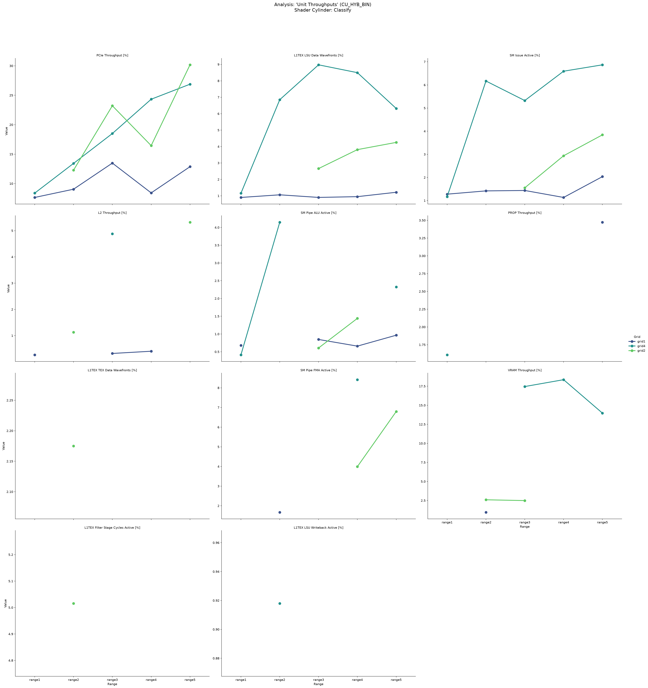

_Caption (Fig. 448): Charts showing Unit Throughputs (%) for Cylinder: Classify across compact grid scenes grid1–grid4 The x-axis represents the camera range (distance from the scene), and the y-axis represents the value. Each chart has its own scale (mentioned in the title). Each line corresponds to a different grid (grid1, grid2, …)._

In [Fig. 448](#fig-448) there are not enough results, only PCIe Throughput may be showing something as in the sphere Classify stage.

##### Cylinder: Sort+RLE+TileOffsets

**Fig. 449**
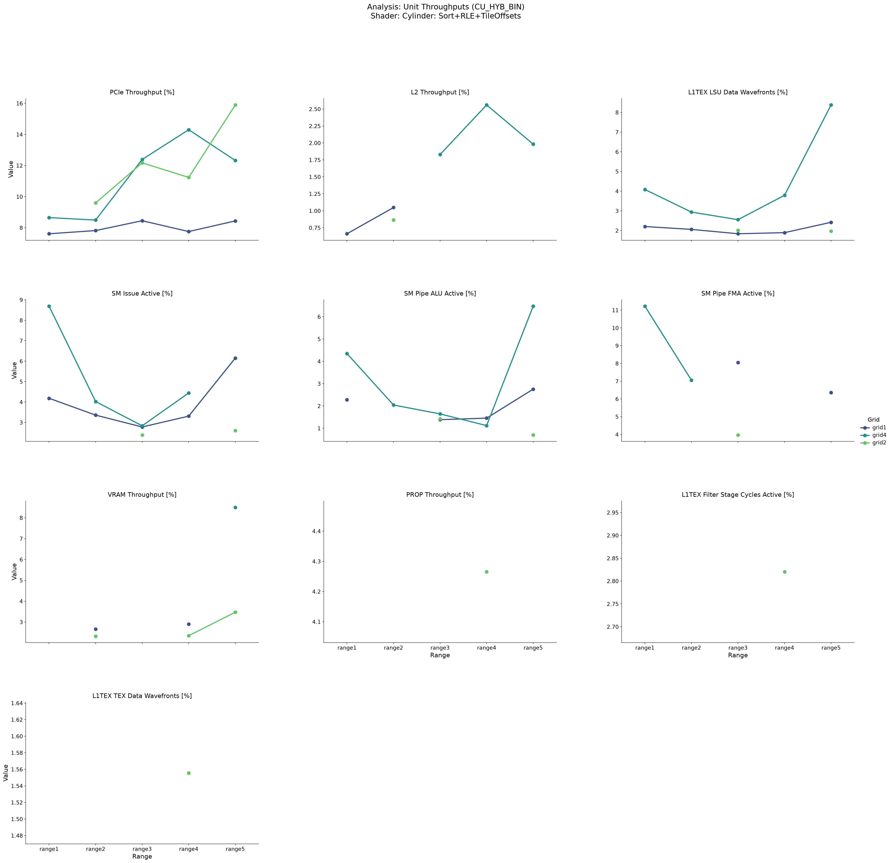

_Caption (Fig. 449): Charts showing Unit Throughputs (%) for Cylinder: Sort+RLE+TileOffsets across compact grid scenes grid1–grid4 The x-axis represents the camera range (distance from the scene), and the y-axis represents the value. Each chart has its own scale (mentioned in the title). Each line corresponds to a different grid (grid1, grid2, …)._

In [Fig. 449](#fig-449) there are not enough results, only PCIe Throughput may be showing something as in the last stage.

##### Cylinder: Expand WorkGroups

**Fig. 450**
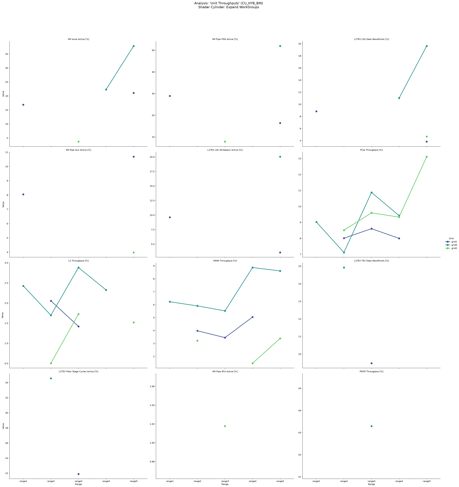

_Caption (Fig. 450): Charts showing Unit Throughputs (%) for Cylinder: Expand WorkGroups across compact grid scenes grid1–grid4 The x-axis represents the camera range (distance from the scene), and the y-axis represents the value. Each chart has its own scale (mentioned in the title). Each line corresponds to a different grid (grid1, grid2, …)._

In [Fig. 450](#fig-450) there are not enough results, only PCIe Throughput may be showing something as in the last two stages.

##### Cylinder: Tiled Raster WG

**Fig. 451**
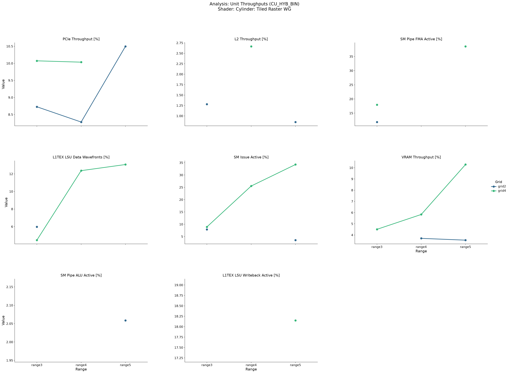

_Caption (Fig. 451): Charts showing Unit Throughputs (%) for Cylinder: Tiled Raster WG across compact grid scenes grid1–grid4 The x-axis represents the camera range (distance from the scene), and the y-axis represents the value. Each chart has its own scale (mentioned in the title). Each line corresponds to a different grid (grid1, grid2, …)._

In [Fig. 451](#fig-451) there are not enough results.

##### SM Warp Occupancy [Warps Per Cycle] \& [\%]

##### Sphere: Classify

**Fig. 452**
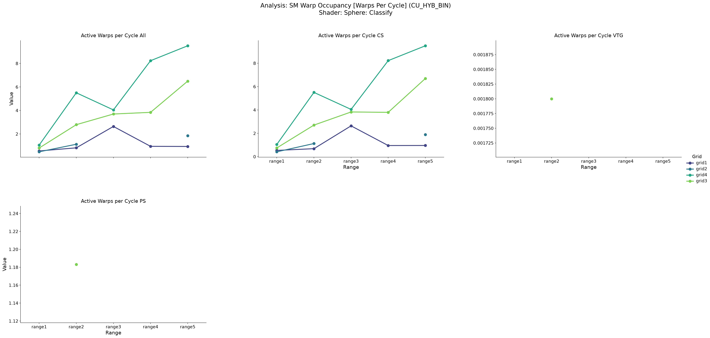

_Caption (Fig. 452): Charts showing SM Warp Occupancy (Warps Per Cycle) for Sphere: Classify across compact grid scenes grid1–grid4 The x-axis represents the camera range (distance from the scene), and the y-axis represents the value. Each chart has its own scale (mentioned in the title). Each line corresponds to a different grid (grid1, grid2, …)._

In [Fig. 452](#fig-452) is seent that all warps are destine to compute shaders, and warps increase across ranges, yet only a low amount is used, with a max of 9 warps.

**Fig. 453**
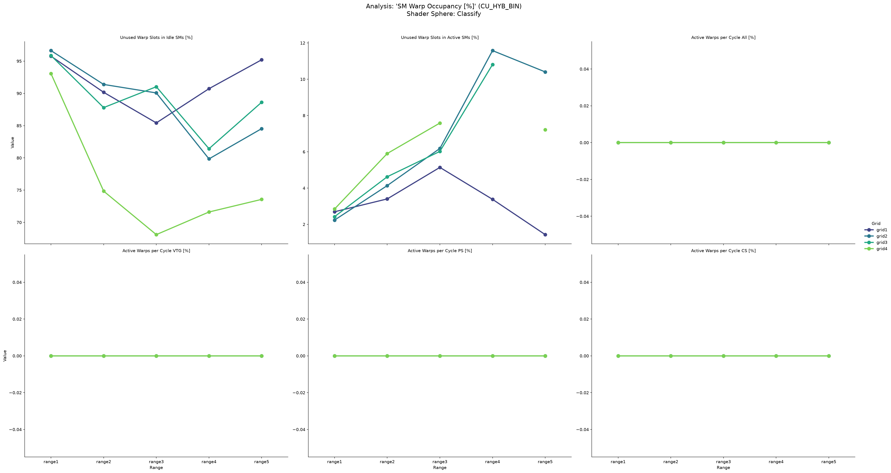

_Caption (Fig. 453): Charts showing SM Warp Occupancy (%) for Sphere: Classify across compact grid scenes grid1–grid4 The x-axis represents the camera range (distance from the scene), and the y-axis represents the value. Each chart has its own scale (mentioned in the title). Each line corresponds to a different grid (grid1, grid2, …)._

In [Fig. 453](#fig-453) it is demonstrated that this kernel is an efficient and well built, since Unused Warp Slots in Idle SMs [%] has great values, diminishing with range, and Unused Warp Slots in Active SMs [%] rise with range but only to a low percentage (12% maximum).

##### Sphere: Sort+RLE+TileOffsets

**Fig. 454**
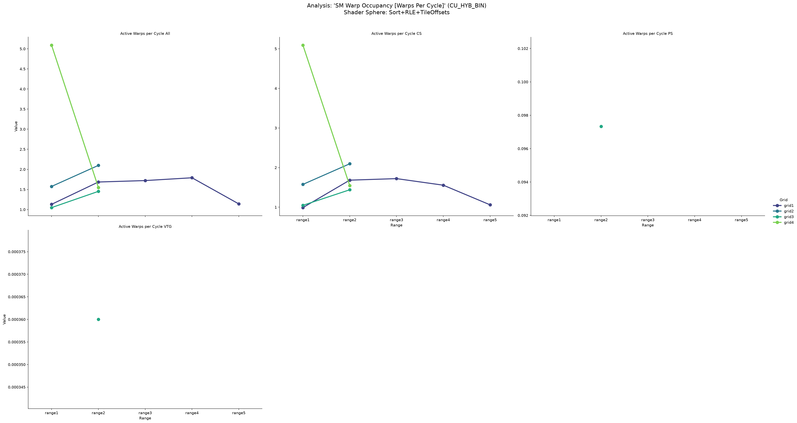

_Caption (Fig. 454): Charts showing SM Warp Occupancy (Warps Per Cycle) for Sphere: Sort+RLE+TileOffsets across compact grid scenes grid1–grid4 The x-axis represents the camera range (distance from the scene), and the y-axis represents the value. Each chart has its own scale (mentioned in the title). Each line corresponds to a different grid (grid1, grid2, …)._

In [Fig. 454](#fig-454) it shows that this shader also doesn't use many warps for this stage.

**Fig. 455**
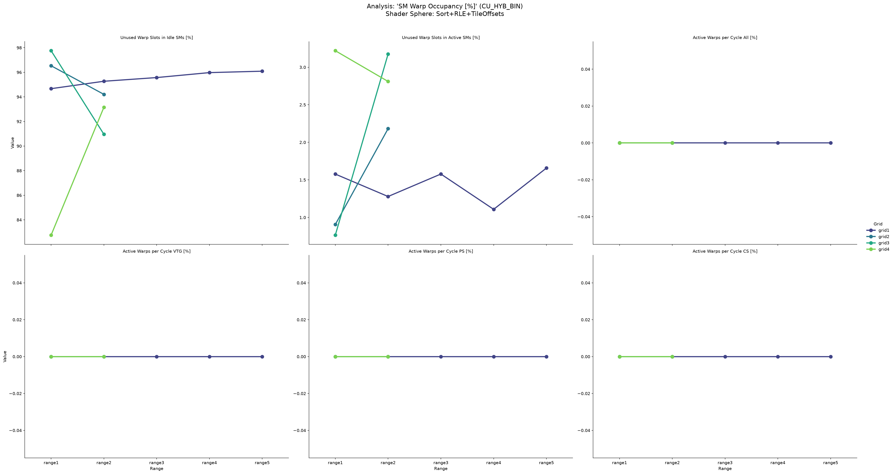

_Caption (Fig. 455): Charts showing SM Warp Occupancy (%) for Sphere: Sort+RLE+TileOffsets across compact grid scenes grid1–grid4 The x-axis represents the camera range (distance from the scene), and the y-axis represents the value. Each chart has its own scale (mentioned in the title). Each line corresponds to a different grid (grid1, grid2, …)._

In [Fig. 455](#fig-455) it can be seen that Unused Warp Slots in Idle SMs [%] is high in all cases, but Unused Warp Slots in Active SMs [%] is low, which means that the GPU is not fully occupied but the warps that are active are doing useful work and resources are efficiently utilized.

##### Sphere: Expand WorkGroups

**Fig. 456**
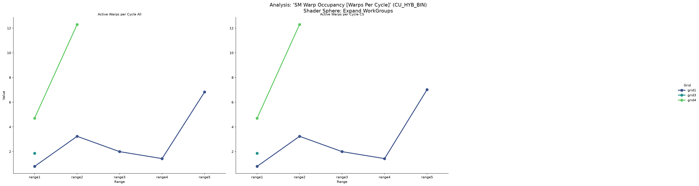

_Caption (Fig. 456): Charts showing SM Warp Occupancy (Warps Per Cycle) for Sphere: Expand WorkGroups across compact grid scenes grid1–grid4 The x-axis represents the camera range (distance from the scene), and the y-axis represents the value. Each chart has its own scale (mentioned in the title). Each line corresponds to a different grid (grid1, grid2, …)._

In [Fig. 456](#fig-456) few warps are used in every case (12 max).

**Fig. 457**
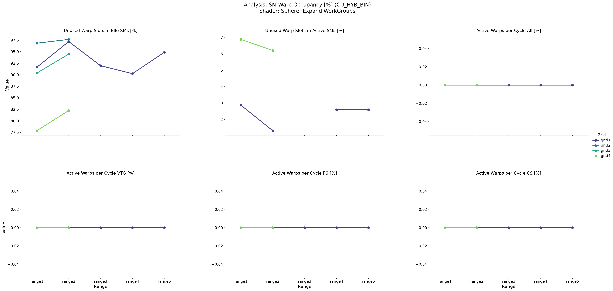

_Caption (Fig. 457): Charts showing SM Warp Occupancy (%) for Sphere: Expand WorkGroups across compact grid scenes grid1–grid4 The x-axis represents the camera range (distance from the scene), and the y-axis represents the value. Each chart has its own scale (mentioned in the title). Each line corresponds to a different grid (grid1, grid2, …)._

In [Fig. 457](#fig-457) it can be seen that Unused Warp Slots in Idle SMs [%] is high in all cases, but Unused Warp Slots in Active SMs [%] is low, which means that the GPU is not fully occupied but the warps that are active are doing useful work and resources are efficiently utilized.

##### Sphere: Tiled Raster WG

**Fig. 458**
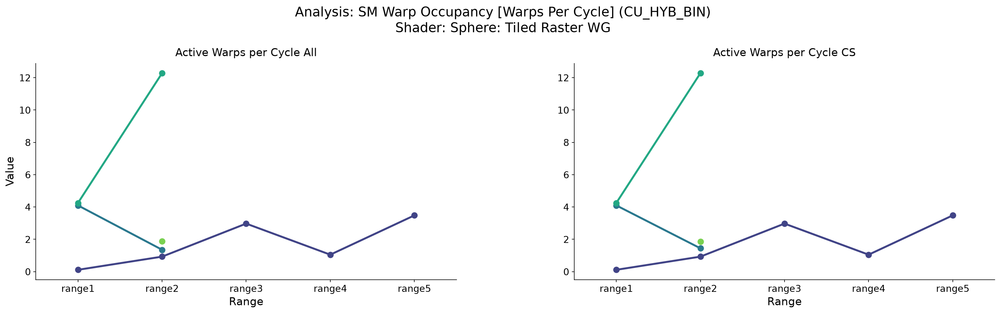

_Caption (Fig. 458): Charts showing SM Warp Occupancy (Warps Per Cycle) for Sphere: Tiled Raster WG across compact grid scenes grid1–grid4 The x-axis represents the camera range (distance from the scene), and the y-axis represents the value. Each chart has its own scale (mentioned in the title). Each line corresponds to a different grid (grid1, grid2, …)._

In [Fig. 458](#fig-458) few warps are used in every case (12 max).

**Fig. 459**
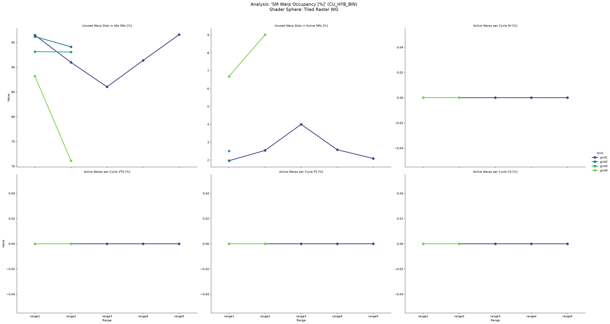

_Caption (Fig. 459): Charts showing SM Warp Occupancy (%) for Sphere: Tiled Raster WG across compact grid scenes grid1–grid4 The x-axis represents the camera range (distance from the scene), and the y-axis represents the value. Each chart has its own scale (mentioned in the title). Each line corresponds to a different grid (grid1, grid2, …)._

In [Fig. 459](#fig-459) it can be seen that Unused Warp Slots in Idle SMs [%] is high in all cases, but Unused Warp Slots in Active SMs [%] is low, which means that the GPU is not fully occupied but the warps that are active are doing useful work and resources are efficiently utilized.

##### Sphere: Small Raster

**Fig. 460**
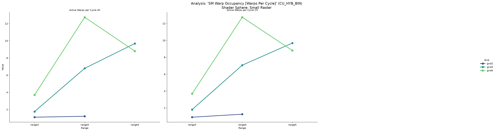

_Caption (Fig. 460): Charts showing SM Warp Occupancy (Warps Per Cycle) for Sphere: Small Raster across compact grid scenes grid1–grid4 The x-axis represents the camera range (distance from the scene), and the y-axis represents the value. Each chart has its own scale (mentioned in the title). Each line corresponds to a different grid (grid1, grid2, …)._

In [Fig. 460](#fig-460) few warps are used in every case (12 max).

**Fig. 461**
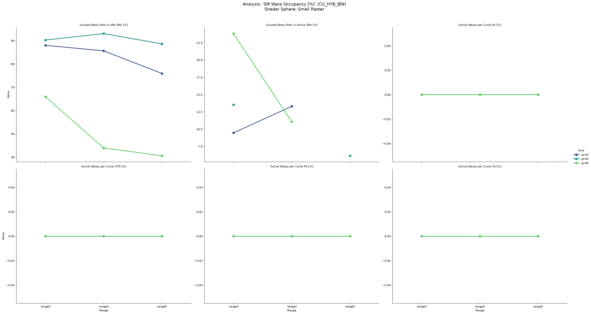

_Caption (Fig. 461): Charts showing SM Warp Occupancy (%) for Sphere: Small Raster across compact grid scenes grid1–grid4 The x-axis represents the camera range (distance from the scene), and the y-axis represents the value. Each chart has its own scale (mentioned in the title). Each line corresponds to a different grid (grid1, grid2, …)._

In [Fig. 461](#fig-461) it can be seen that Unused Warp Slots in Idle SMs [%] is high in all cases except for grid4 that drops from around 65% in range3 to 40% in range5, but Unused Warp Slots in Active SMs [%] is low in almost every case, which means that the GPU is not fully occupied but the warps that are active are doing useful work and resources are efficiently utilized, and that bigger grids are succesfully using more resources.

##### Cylinder: Classify

**Fig. 462**
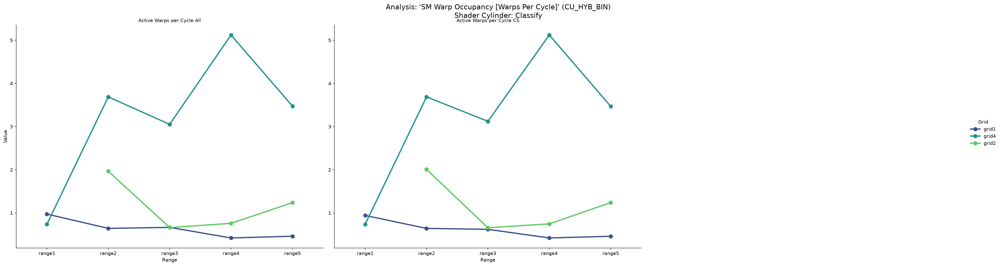

_Caption (Fig. 462): Charts showing SM Warp Occupancy (Warps Per Cycle) for Cylinder: Classify across compact grid scenes grid1–grid4 The x-axis represents the camera range (distance from the scene), and the y-axis represents the value. Each chart has its own scale (mentioned in the title). Each line corresponds to a different grid (grid1, grid2, …)._

In [Fig. 462](#fig-462) few warps are used in every case (5 max).

**Fig. 463**
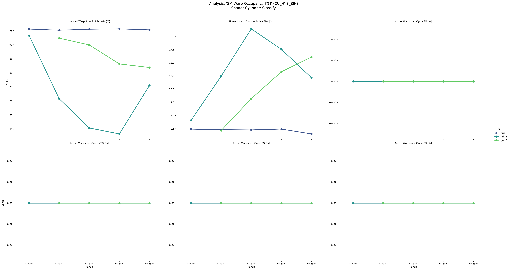

_Caption (Fig. 463): Charts showing SM Warp Occupancy (%) for Cylinder: Classify across compact grid scenes grid1–grid4 The x-axis represents the camera range (distance from the scene), and the y-axis represents the value. Each chart has its own scale (mentioned in the title). Each line corresponds to a different grid (grid1, grid2, …)._

In [Fig. 463](#fig-463) it can be seen that Unused Warp Slots in Idle SMs [%] is high in all cases, but Unused Warp Slots in Active SMs [%] is low, which means that the GPU is not fully occupied but the warps that are active are doing useful work and resources are efficiently utilized.

##### Cylinder: Sort+RLE+TileOffsets

**Fig. 464**
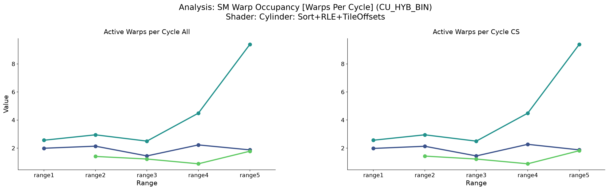

_Caption (Fig. 464): Charts showing SM Warp Occupancy (Warps Per Cycle) for Cylinder: Sort+RLE+TileOffsets across compact grid scenes grid1–grid4 The x-axis represents the camera range (distance from the scene), and the y-axis represents the value. Each chart has its own scale (mentioned in the title). Each line corresponds to a different grid (grid1, grid2, …)._

In [Fig. 464](#fig-464) few warps are used in every case (9 max).

**Fig. 465**
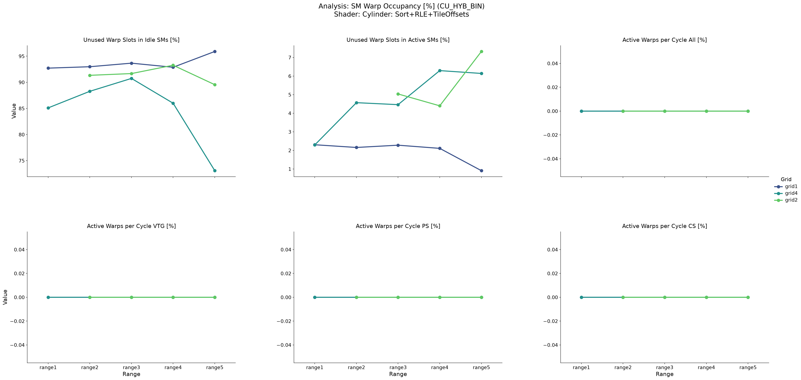

_Caption (Fig. 465): Charts showing SM Warp Occupancy (%) for Cylinder: Sort+RLE+TileOffsets across compact grid scenes grid1–grid4 The x-axis represents the camera range (distance from the scene), and the y-axis represents the value. Each chart has its own scale (mentioned in the title). Each line corresponds to a different grid (grid1, grid2, …)._

In [Fig. 465](#fig-465) it can be seen that Unused Warp Slots in Idle SMs [%] is high in all cases, but Unused Warp Slots in Active SMs [%] is low, which means that the GPU is not fully occupied but the warps that are active are doing useful work and resources are efficiently utilized.

##### Cylinder: Expand WorkGroups

**Fig. 466**
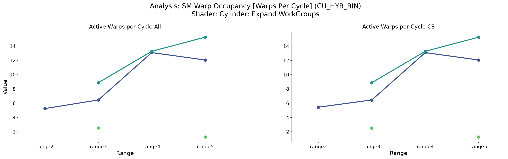

_Caption (Fig. 466): Charts showing SM Warp Occupancy (Warps Per Cycle) for Cylinder: Expand WorkGroups across compact grid scenes grid1–grid4 The x-axis represents the camera range (distance from the scene), and the y-axis represents the value. Each chart has its own scale (mentioned in the title). Each line corresponds to a different grid (grid1, grid2, …)._

In [Fig. 466](#fig-466) more warps are used than in past stages, which is surprising since it is a light kernel, but it still is a low amount (14 maximum).

**Fig. 467**
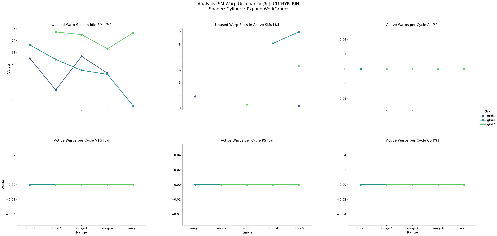

_Caption (Fig. 467): Charts showing SM Warp Occupancy (%) for Cylinder: Expand WorkGroups across compact grid scenes grid1–grid4 The x-axis represents the camera range (distance from the scene), and the y-axis represents the value. Each chart has its own scale (mentioned in the title). Each line corresponds to a different grid (grid1, grid2, …)._

In [Fig. 467](#fig-467) it can be seen that Unused Warp Slots in Idle SMs [%] is high in all cases, but Unused Warp Slots in Active SMs [%] is low, which means that the GPU is not fully occupied but the warps that are active are doing useful work and resources are efficiently utilized.

##### Cylinder: Tiled Raster WG

**Fig. 468**
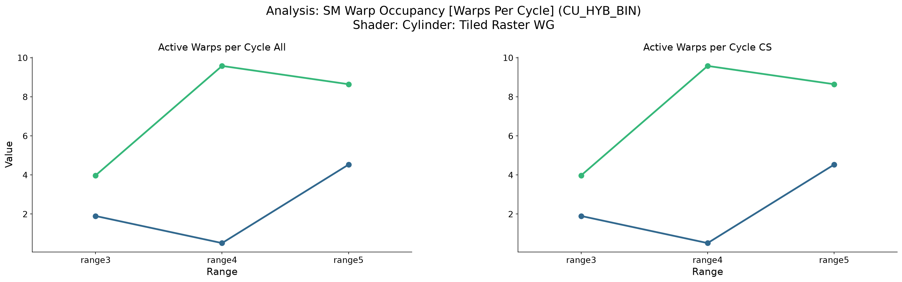

_Caption (Fig. 468): Charts showing SM Warp Occupancy (Warps Per Cycle) for Cylinder: Tiled Raster WG across compact grid scenes grid1–grid4 The x-axis represents the camera range (distance from the scene), and the y-axis represents the value. Each chart has its own scale (mentioned in the title). Each line corresponds to a different grid (grid1, grid2, …)._

In [Fig. 468](#fig-468) few warps are used in every case (10 max).

**Fig. 469**
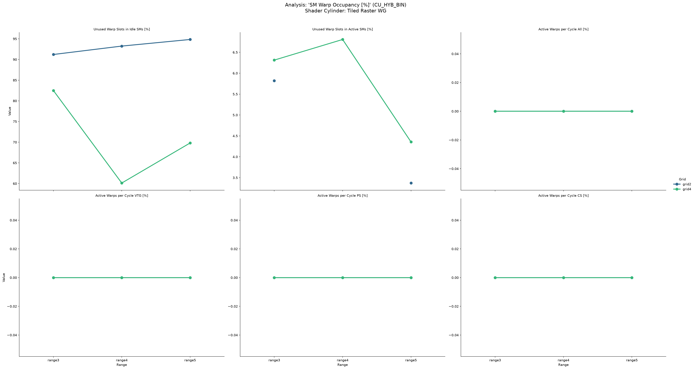

_Caption (Fig. 469): Charts showing SM Warp Occupancy (%) for Cylinder: Tiled Raster WG across compact grid scenes grid1–grid4 The x-axis represents the camera range (distance from the scene), and the y-axis represents the value. Each chart has its own scale (mentioned in the title). Each line corresponds to a different grid (grid1, grid2, …)._

In [Fig. 469](#fig-469) not enough data to analyze but it can be seen that Unused Warp Slots in Idle SMs [%] is high in all cases, but Unused Warp Slots in Active SMs [%] is low, which could mean that the GPU is not fully occupied but the warps that are active are doing useful work and resources are efficiently utilized.

##### Cumulative Warp Latencies [\%] \& [Cycles]

##### Sphere: Classify

**Fig. 470**
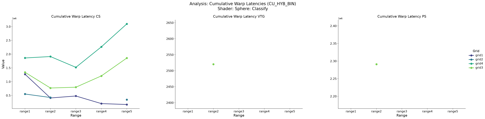

_Caption (Fig. 470): Charts showing Cumulative Warp Latencies (Cycles) for Sphere: Classify across compact grid scenes grid1–grid4 The x-axis represents the camera range (distance from the scene), and the y-axis represents the value. Each chart has its own scale (mentioned in the title). Each line corresponds to a different grid (grid1, grid2, …)._

In [Fig. 470](#fig-470) cycles don't say much by themselves: they all belong to compute shaders results.

**Fig. 471**
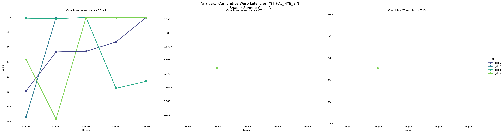

_Caption (Fig. 471): Charts showing Cumulative Warp Latencies (%) for Sphere: Classify across compact grid scenes grid1–grid4 The x-axis represents the camera range (distance from the scene), and the y-axis represents the value. Each chart has its own scale (mentioned in the title). Each line corresponds to a different grid (grid1, grid2, …)._

In [Fig. 471](#fig-471) percentages don't say much: they all belong to compute shaders results.

##### Sphere: Sort+RLE+TileOffsets

**Fig. 472**
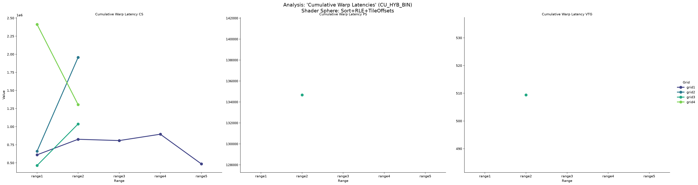

_Caption (Fig. 472): Charts showing Cumulative Warp Latencies (Cycles) for Sphere: Sort+RLE+TileOffsets across compact grid scenes grid1–grid4 The x-axis represents the camera range (distance from the scene), and the y-axis represents the value. Each chart has its own scale (mentioned in the title). Each line corresponds to a different grid (grid1, grid2, …)._

In [Fig. 472](#fig-472) cycles don't say much by themselves: they all belong to compute shaders results.

**Fig. 473**
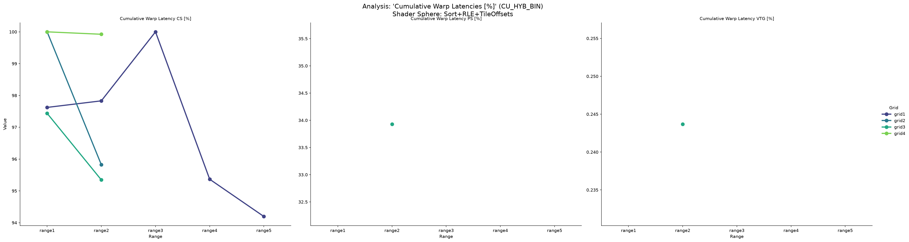

_Caption (Fig. 473): Charts showing Cumulative Warp Latencies (%) for Sphere: Sort+RLE+TileOffsets across compact grid scenes grid1–grid4 The x-axis represents the camera range (distance from the scene), and the y-axis represents the value. Each chart has its own scale (mentioned in the title). Each line corresponds to a different grid (grid1, grid2, …)._

In [Fig. 473](#fig-473) percentages don't say much: they all belong to compute shaders results.

##### Sphere: Expand WorkGroups

**Fig. 474**
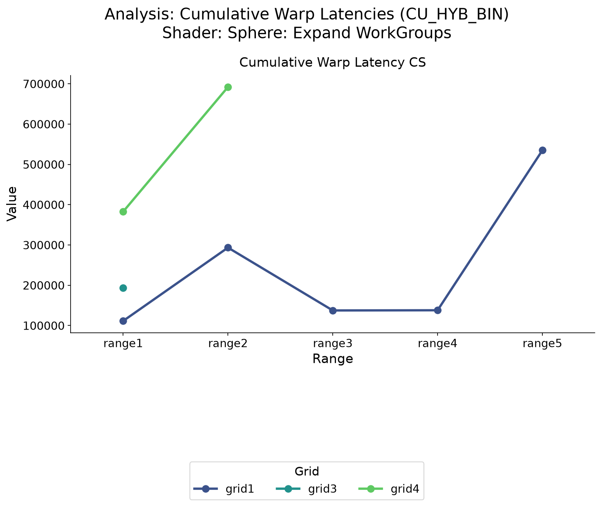

_Caption (Fig. 474): Charts showing Cumulative Warp Latencies (Cycles) for Sphere: Expand WorkGroups across compact grid scenes grid1–grid4 The x-axis represents the camera range (distance from the scene), and the y-axis represents the value. Each chart has its own scale (mentioned in the title). Each line corresponds to a different grid (grid1, grid2, …)._

In [Fig. 474](#fig-474) all cycles belong to compute shaders results, but it can be seen a lower amount of cycles compared to previous stages, confirming that this is a lighter step of the pipeline.

**Fig. 475**
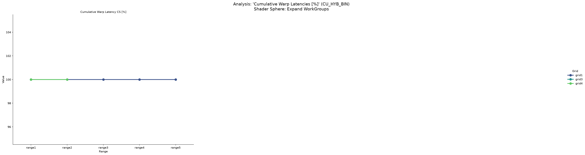

_Caption (Fig. 475): Charts showing Cumulative Warp Latencies (%) for Sphere: Expand WorkGroups across compact grid scenes grid1–grid4 The x-axis represents the camera range (distance from the scene), and the y-axis represents the value. Each chart has its own scale (mentioned in the title). Each line corresponds to a different grid (grid1, grid2, …)._

In [Fig. 475](#fig-475) percentages don't say much: they all belong to compute shaders results.

##### Sphere: Tiled Raster WG

**Fig. 476**
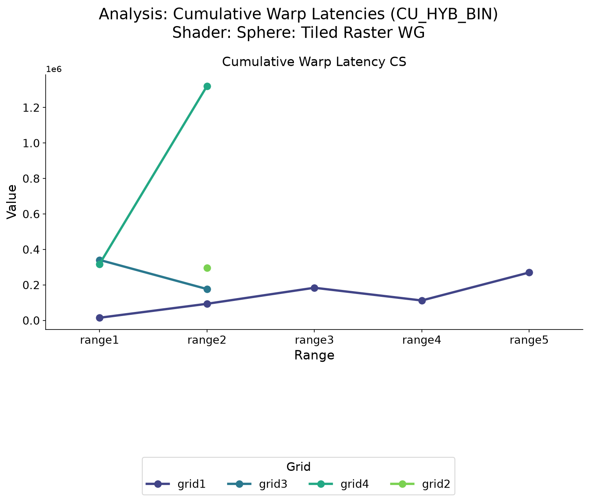

_Caption (Fig. 476): Charts showing Cumulative Warp Latencies (Cycles) for Sphere: Tiled Raster WG across compact grid scenes grid1–grid4 The x-axis represents the camera range (distance from the scene), and the y-axis represents the value. Each chart has its own scale (mentioned in the title). Each line corresponds to a different grid (grid1, grid2, …)._

In [Fig. 476](#fig-476) cycles don't say much by themselves: they all belong to compute shaders results.

**Fig. 477**
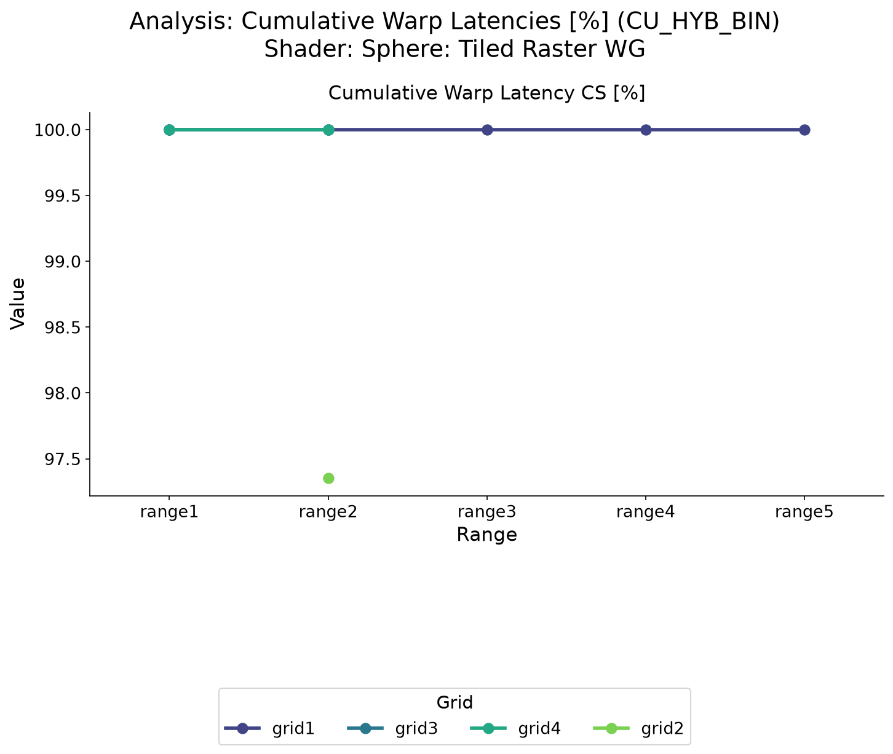

_Caption (Fig. 477): Charts showing Cumulative Warp Latencies (%) for Sphere: Tiled Raster WG across compact grid scenes grid1–grid4 The x-axis represents the camera range (distance from the scene), and the y-axis represents the value. Each chart has its own scale (mentioned in the title). Each line corresponds to a different grid (grid1, grid2, …)._

In [Fig. 477](#fig-477) percentages don't say much: they all belong to compute shaders results.

##### Sphere: Small Raster

**Fig. 478**
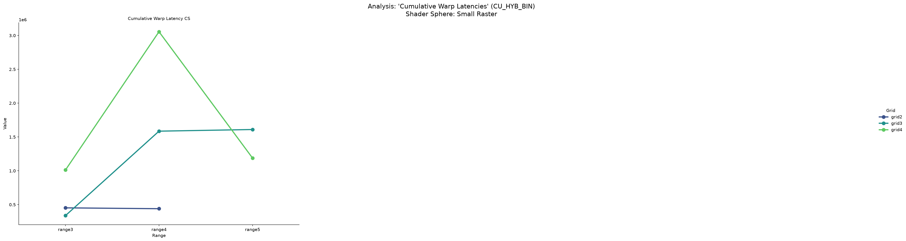

_Caption (Fig. 478): Charts showing Cumulative Warp Latencies (Cycles) for Sphere: Small Raster across compact grid scenes grid1–grid4 The x-axis represents the camera range (distance from the scene), and the y-axis represents the value. Each chart has its own scale (mentioned in the title). Each line corresponds to a different grid (grid1, grid2, …)._

In [Fig. 478](#fig-478) cycles don't say much by themselves: they all belong to compute shaders results.

**Fig. 479**
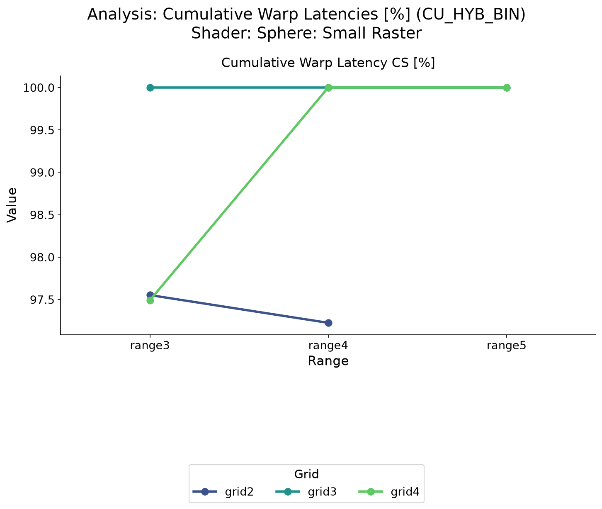

_Caption (Fig. 479): Charts showing Cumulative Warp Latencies (%) for Sphere: Small Raster across compact grid scenes grid1–grid4 The x-axis represents the camera range (distance from the scene), and the y-axis represents the value. Each chart has its own scale (mentioned in the title). Each line corresponds to a different grid (grid1, grid2, …)._

In [Fig. 479](#fig-479) percentages don't say much: they all belong to compute shaders results.

##### Cylinder: Classify

**Fig. 480**
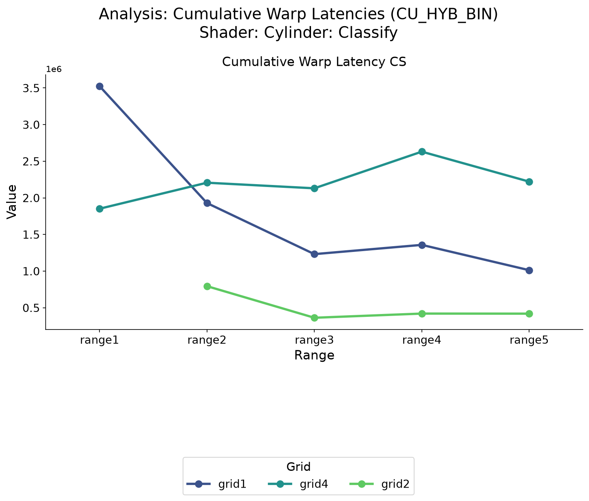

_Caption (Fig. 480): Charts showing Cumulative Warp Latencies (Cycles) for Cylinder: Classify across compact grid scenes grid1–grid4 The x-axis represents the camera range (distance from the scene), and the y-axis represents the value. Each chart has its own scale (mentioned in the title). Each line corresponds to a different grid (grid1, grid2, …)._

In [Fig. 480](#fig-480) all cycles belong to compute shaders results.

**Fig. 481**
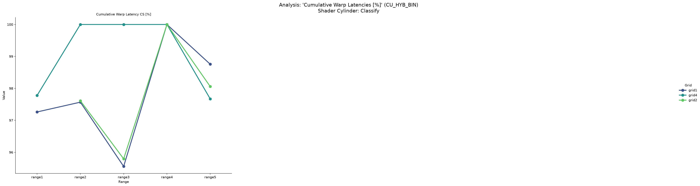

_Caption (Fig. 481): Charts showing Cumulative Warp Latencies (%) for Cylinder: Classify across compact grid scenes grid1–grid4 The x-axis represents the camera range (distance from the scene), and the y-axis represents the value. Each chart has its own scale (mentioned in the title). Each line corresponds to a different grid (grid1, grid2, …)._

In [Fig. 481](#fig-481) percentages don't say much: they all belong to compute shaders results.

##### Cylinder: Sort+RLE+TileOffsets

**Fig. 482**
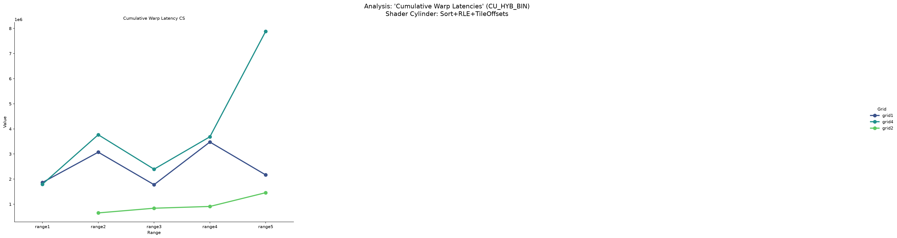

_Caption (Fig. 482): Charts showing Cumulative Warp Latencies (Cycles) for Cylinder: Sort+RLE+TileOffsets across compact grid scenes grid1–grid4 The x-axis represents the camera range (distance from the scene), and the y-axis represents the value. Each chart has its own scale (mentioned in the title). Each line corresponds to a different grid (grid1, grid2, …)._

In [Fig. 482](#fig-482) all cycles belong to compute shaders results.

**Fig. 483**
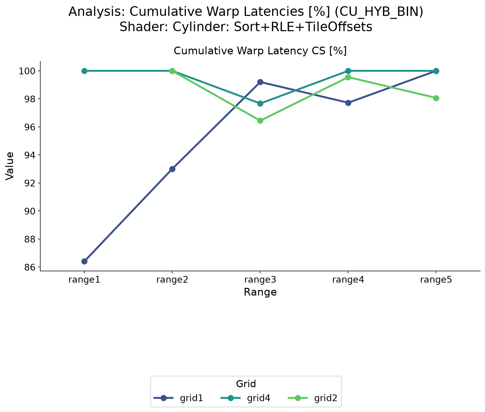

_Caption (Fig. 483): Charts showing Cumulative Warp Latencies (%) for Cylinder: Sort+RLE+TileOffsets across compact grid scenes grid1–grid4 The x-axis represents the camera range (distance from the scene), and the y-axis represents the value. Each chart has its own scale (mentioned in the title). Each line corresponds to a different grid (grid1, grid2, …)._

In [Fig. 483](#fig-483) the 100% of warp latency comes from compute shaders/kernels.

##### Cylinder: Expand WorkGroups

**Fig. 484**
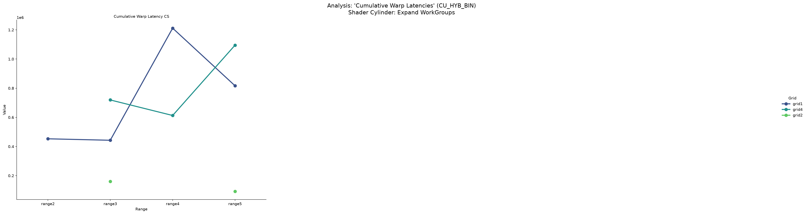

_Caption (Fig. 484): Charts showing Cumulative Warp Latencies (Cycles) for Cylinder: Expand WorkGroups across compact grid scenes grid1–grid4 The x-axis represents the camera range (distance from the scene), and the y-axis represents the value. Each chart has its own scale (mentioned in the title). Each line corresponds to a different grid (grid1, grid2, …)._

In [Fig. 484](#fig-484) all cycles belong to compute shaders results.

**Fig. 485**
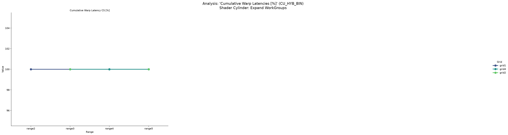

_Caption (Fig. 485): Charts showing Cumulative Warp Latencies (%) for Cylinder: Expand WorkGroups across compact grid scenes grid1–grid4 The x-axis represents the camera range (distance from the scene), and the y-axis represents the value. Each chart has its own scale (mentioned in the title). Each line corresponds to a different grid (grid1, grid2, …)._

In [Fig. 485](#fig-485) the 100% of warp latency comes from compute shaders/kernels.

##### Cylinder: Tiled Raster WG

**Fig. 486**
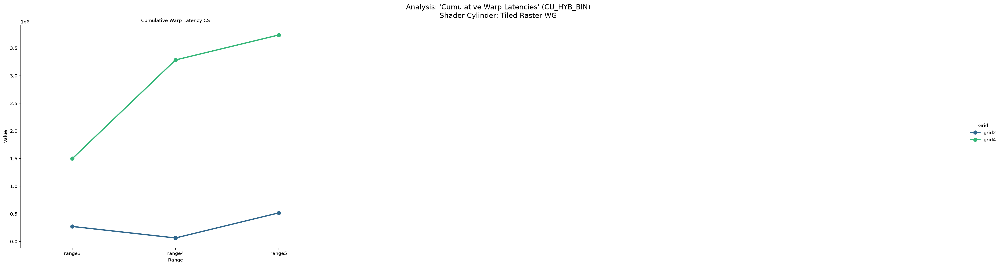

_Caption (Fig. 486): Charts showing Cumulative Warp Latencies (Cycles) for Cylinder: Tiled Raster WG across compact grid scenes grid1–grid4 The x-axis represents the camera range (distance from the scene), and the y-axis represents the value. Each chart has its own scale (mentioned in the title). Each line corresponds to a different grid (grid1, grid2, …)._

In [Fig. 486](#fig-486) all cycles belong to compute shaders results.

**Fig. 487**
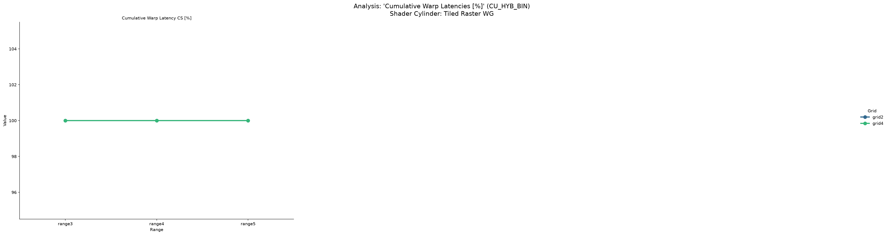

_Caption (Fig. 487): Charts showing Cumulative Warp Latencies (%) for Cylinder: Tiled Raster WG across compact grid scenes grid1–grid4 The x-axis represents the camera range (distance from the scene), and the y-axis represents the value. Each chart has its own scale (mentioned in the title). Each line corresponds to a different grid (grid1, grid2, …)._

In [Fig. 487](#fig-487) the 100% of warp latency comes from compute shaders/kernels.

##### Active Threads Per Warp

##### Sphere: Classify

**Fig. 488**
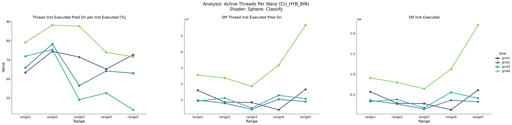

_Caption (Fig. 488): Charts showing Active Threads per Warp for Sphere: Classify across compact grid scenes grid1–grid4 The x-axis represents the camera range (distance from the scene), and the y-axis represents the value. Each chart has its own scale (mentioned in the title). Each line corresponds to a different grid (grid1, grid2, …)._

In [Fig. 488](#fig-488) it can be seen in [Fig. 488](#fig-488) that for Thread Inst Executed Pred On per Inst Executed [%] the values would decrease across grids but grid4 is on top of percentages, yet almost every case has over 50%, which means that more than half of the threads are executing an instruction at a time, which indicates low divergence and good performance. It can be said that this stage has a good balance of work. SM Inst Executed shows values that grow with grids, and for really knowing if it has a heavy workload, it should be compared with other versiones and analyzed together with the duration of the stage. The SM Thread Inst Executed Pred On, even if it should be analyazed with the duration and in comparison to other versions, it is worth mentioning that it has high values, meaning that there are many threads executing instructions at a time, which is good for performance..

##### Sphere: Sort+RLE+TileOffsets

**Fig. 489**
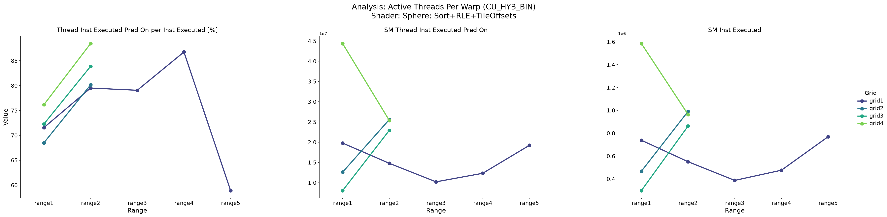

_Caption (Fig. 489): Charts showing Active Threads per Warp for Sphere: Sort+RLE+TileOffsets across compact grid scenes grid1–grid4 The x-axis represents the camera range (distance from the scene), and the y-axis represents the value. Each chart has its own scale (mentioned in the title). Each line corresponds to a different grid (grid1, grid2, …)._

In [Fig. 489](#fig-489) not all results are available, but every grid starts with high Thread Inst Executed Pred On per Inst Executed [%]. SM Thread Inst Executed Pred On has a similar behaviour as SM Inst Executed, meaning that even if work loads rises divergence don't.

##### Sphere: Expand WorkGroups

**Fig. 490**
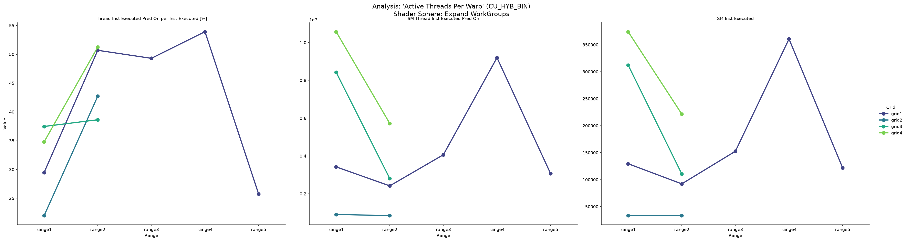

_Caption (Fig. 490): Charts showing Active Threads per Warp for Sphere: Expand WorkGroups across compact grid scenes grid1–grid4 The x-axis represents the camera range (distance from the scene), and the y-axis represents the value. Each chart has its own scale (mentioned in the title). Each line corresponds to a different grid (grid1, grid2, …)._

In [Fig. 490](#fig-490) are similar results as last stage but with lower percentages of Thread Inst Executed Pred On per Inst Executed [%]. This could be lower divergence, but is negligible for the duration of the kernel and the sake of the pipeline.

##### Sphere: Tiled Raster WG

**Fig. 491**
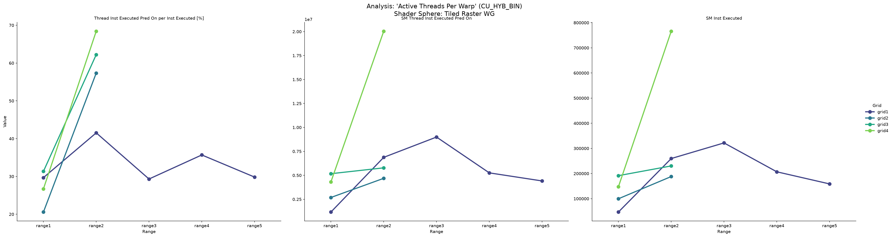

_Caption (Fig. 491): Charts showing Active Threads per Warp for Sphere: Tiled Raster WG across compact grid scenes grid1–grid4 The x-axis represents the camera range (distance from the scene), and the y-axis represents the value. Each chart has its own scale (mentioned in the title). Each line corresponds to a different grid (grid1, grid2, …)._

In [Fig. 491](#fig-491) Thread Inst Executed Pred On per Inst Executed [%] shows fluctuating values for grid1, and values only for range1 and range2 for the rest of the grids so it isn't clear, but if they also have fluctuating values that would be unexpected since this kernel was inspired in the Intersection Shaders of the second GPGPU version which had great results (really low divergence).

##### Sphere: Small Raster

**Fig. 492**
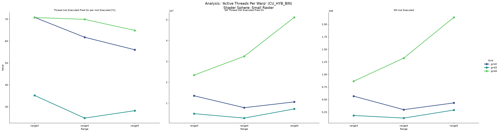

_Caption (Fig. 492): Charts showing Active Threads per Warp for Sphere: Small Raster across compact grid scenes grid1–grid4 The x-axis represents the camera range (distance from the scene), and the y-axis represents the value. Each chart has its own scale (mentioned in the title). Each line corresponds to a different grid (grid1, grid2, …)._

In [Fig. 492](#fig-492) Thread Inst Executed Pred On per Inst Executed [%] seems to show that percentages decrease across ranges, yet it is not possible to tell if bigger grids have lower or higher values. Still grid2 and grid4 show high percentages and low divergence.

##### Cylinder: Classify

**Fig. 493**
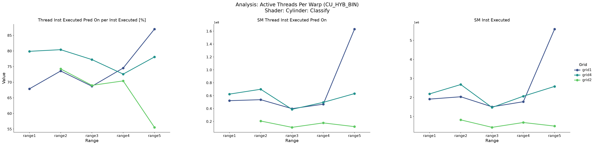

_Caption (Fig. 493): Charts showing Active Threads per Warp for Cylinder: Classify across compact grid scenes grid1–grid4 The x-axis represents the camera range (distance from the scene), and the y-axis represents the value. Each chart has its own scale (mentioned in the title). Each line corresponds to a different grid (grid1, grid2, …)._

In [Fig. 493](#fig-493) all grids have high percentages, but there is no regular patter. All of them may very a bit between 55-87%.

##### Cylinder: Sort+RLE+TileOffsets

**Fig. 494**
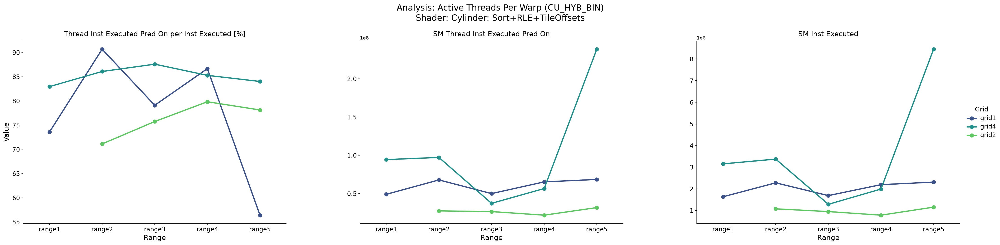

_Caption (Fig. 494): Charts showing Active Threads per Warp for Cylinder: Sort+RLE+TileOffsets across compact grid scenes grid1–grid4 The x-axis represents the camera range (distance from the scene), and the y-axis represents the value. Each chart has its own scale (mentioned in the title). Each line corresponds to a different grid (grid1, grid2, …)._

In [Fig. 494](#fig-494) results are similar to the las stage, with values even higher.

##### Cylinder: Expand WorkGroups

**Fig. 495**
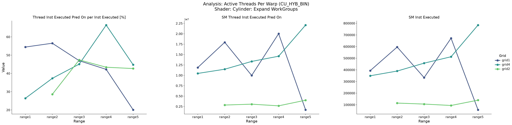

_Caption (Fig. 495): Charts showing Active Threads per Warp for Cylinder: Expand WorkGroups across compact grid scenes grid1–grid4 The x-axis represents the camera range (distance from the scene), and the y-axis represents the value. Each chart has its own scale (mentioned in the title). Each line corresponds to a different grid (grid1, grid2, …)._

In [Fig. 495](#fig-495) Thread Inst Executed Pred On per Inst Executed [%] there is also no defined pattern and values are lower: all grids are between 20-65%.

##### Cylinder: Tiled Raster WG

**Fig. 496**
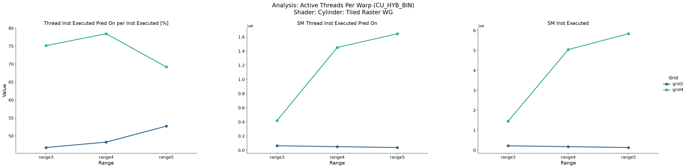

_Caption (Fig. 496): Charts showing Active Threads per Warp for Cylinder: Tiled Raster WG across compact grid scenes grid1–grid4 The x-axis represents the camera range (distance from the scene), and the y-axis represents the value. Each chart has its own scale (mentioned in the title). Each line corresponds to a different grid (grid1, grid2, …)._

In [Fig. 496](#fig-496) only two grids have results, but it could be that bigger scenes have higher percentages. It could be expected since this stage is based in the second GPGPU version, which had really low divergence. Across ranges they take more or less constant values.

##### Warp Launch Stalled by Reasons [\%]

##### Sphere: Classify

**Fig. 497**
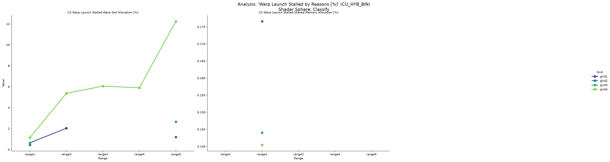

_Caption (Fig. 497): Charts showing Warp Launch Stalled by Reasons (%) for Sphere: Classify across compact grid scenes grid1–grid4 The x-axis represents the camera range (distance from the scene), and the y-axis represents the value. Each chart has its own scale (mentioned in the title). Each line corresponds to a different grid (grid1, grid2, …)._

In [Fig. 497](#fig-497) only CS Warp Launch Stalled Warp Slot Allocation [%] has some values, only for grid4 which increase across ranges reaching a maximum of 12%, meaning that there was no stalling.

##### Sphere: Sort+RLE+TileOffsets

**Fig. 498**
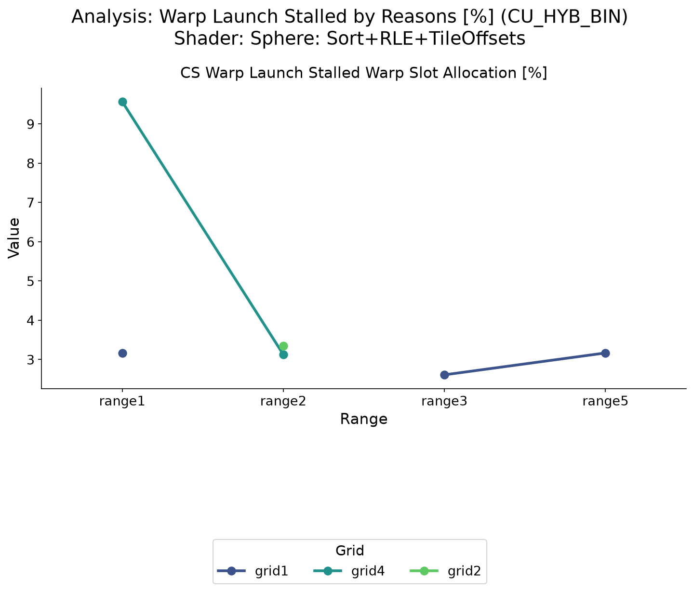

_Caption (Fig. 498): Charts showing Warp Launch Stalled by Reasons (%) for Sphere: Sort+RLE+TileOffsets across compact grid scenes grid1–grid4 The x-axis represents the camera range (distance from the scene), and the y-axis represents the value. Each chart has its own scale (mentioned in the title). Each line corresponds to a different grid (grid1, grid2, …)._

In [Fig. 498](#fig-498) there are not enough results, so no stalls can be detected.

##### Sphere: Expand WorkGroups

**Fig. 499**
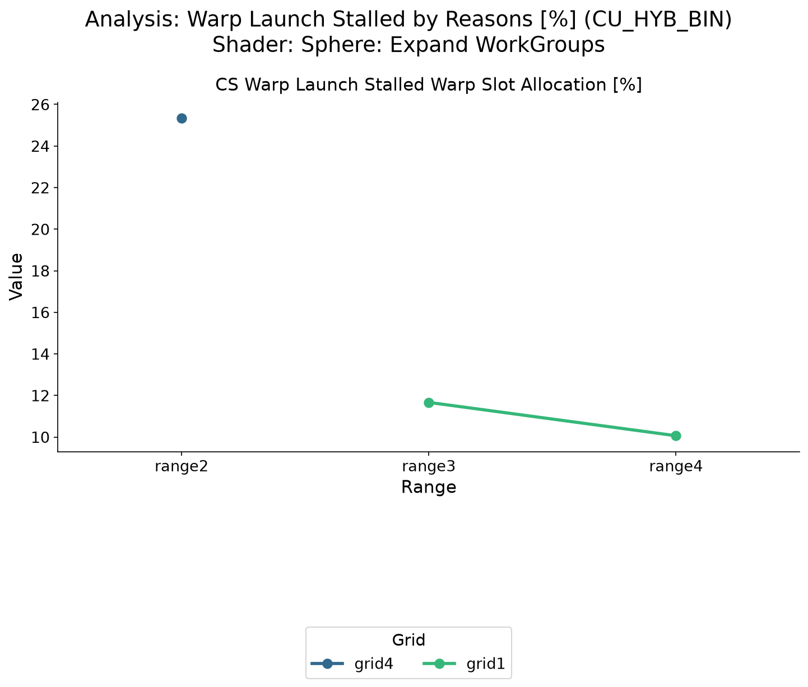

_Caption (Fig. 499): Charts showing Warp Launch Stalled by Reasons (%) for Sphere: Expand WorkGroups across compact grid scenes grid1–grid4 The x-axis represents the camera range (distance from the scene), and the y-axis represents the value. Each chart has its own scale (mentioned in the title). Each line corresponds to a different grid (grid1, grid2, …)._

In [Fig. 499](#fig-499) there are not enough results, so no stalls can be detected.

##### Sphere: Tiled Raster WG

**Fig. 500**
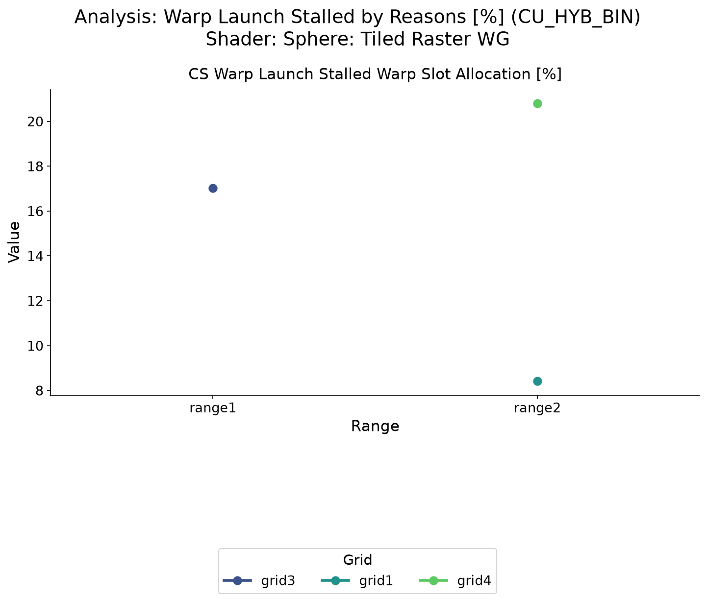

_Caption (Fig. 500): Charts showing Warp Launch Stalled by Reasons (%) for Sphere: Tiled Raster WG across compact grid scenes grid1–grid4 The x-axis represents the camera range (distance from the scene), and the y-axis represents the value. Each chart has its own scale (mentioned in the title). Each line corresponds to a different grid (grid1, grid2, …)._

In [Fig. 500](#fig-500) there are not enough results, so no stalls can be detected.

##### Sphere: Small Raster

**Fig. 501**
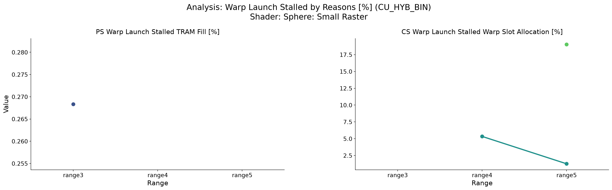

_Caption (Fig. 501): Charts showing Warp Launch Stalled by Reasons (%) for Sphere: Small Raster across compact grid scenes grid1–grid4 The x-axis represents the camera range (distance from the scene), and the y-axis represents the value. Each chart has its own scale (mentioned in the title). Each line corresponds to a different grid (grid1, grid2, …)._

In [Fig. 501](#fig-501) there are not enough results, so no stalls can be detected.

##### Cylinder: Classify

**Fig. 502**
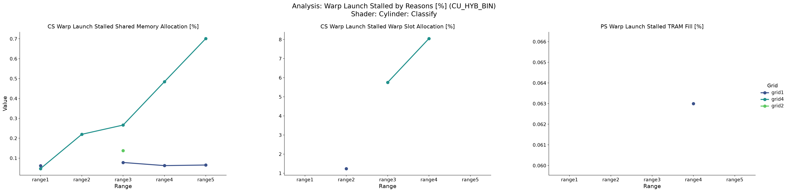

_Caption (Fig. 502): Charts showing Warp Launch Stalled by Reasons (%) for Cylinder: Classify across compact grid scenes grid1–grid4 The x-axis represents the camera range (distance from the scene), and the y-axis represents the value. Each chart has its own scale (mentioned in the title). Each line corresponds to a different grid (grid1, grid2, …)._

In [Fig. 502](#fig-502) CS Warp Launch Stalled Shared Memory Allocation [%] only has values for grid4. Its values rise with range, reaching 0.7% as a maximum, so no stalls.

##### Cylinder: Sort+RLE+TileOffsets

**Fig. 503**
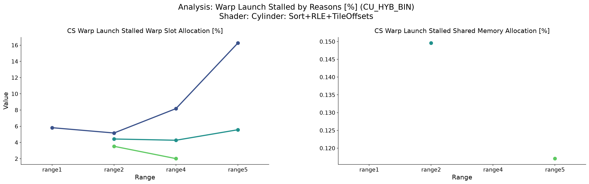

_Caption (Fig. 503): Charts showing Warp Launch Stalled by Reasons (%) for Cylinder: Sort+RLE+TileOffsets across compact grid scenes grid1–grid4 The x-axis represents the camera range (distance from the scene), and the y-axis represents the value. Each chart has its own scale (mentioned in the title). Each line corresponds to a different grid (grid1, grid2, …)._

In [Fig. 503](#fig-503) not clear pattern to conclude anything based on CS Warp Launch Stalled Warp Slot Allocation, which has some low values even for the maximum achieved.

##### Cylinder: Expand WorkGroups

**Fig. 504**
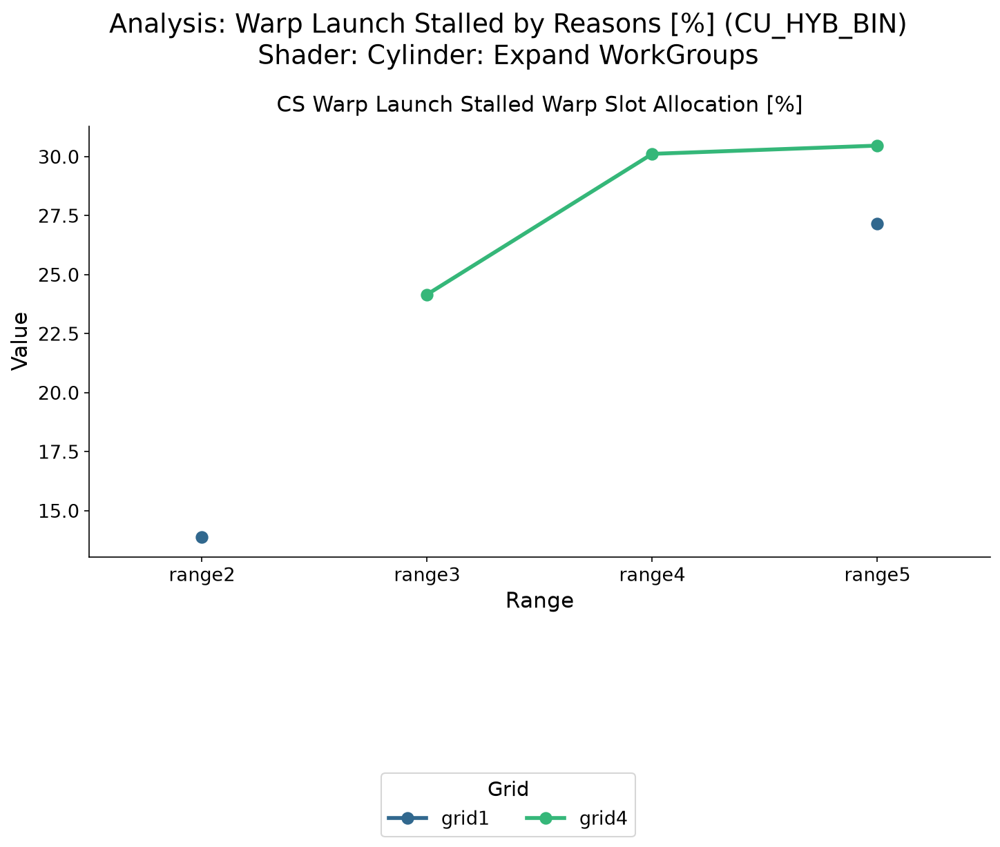

_Caption (Fig. 504): Charts showing Warp Launch Stalled by Reasons (%) for Cylinder: Expand WorkGroups across compact grid scenes grid1–grid4 The x-axis represents the camera range (distance from the scene), and the y-axis represents the value. Each chart has its own scale (mentioned in the title). Each line corresponds to a different grid (grid1, grid2, …)._

In [Fig. 504](#fig-504) there are not enough results, so no stalls can be detected.

##### Cylinder: Tiled Raster WG

**Fig. 505**
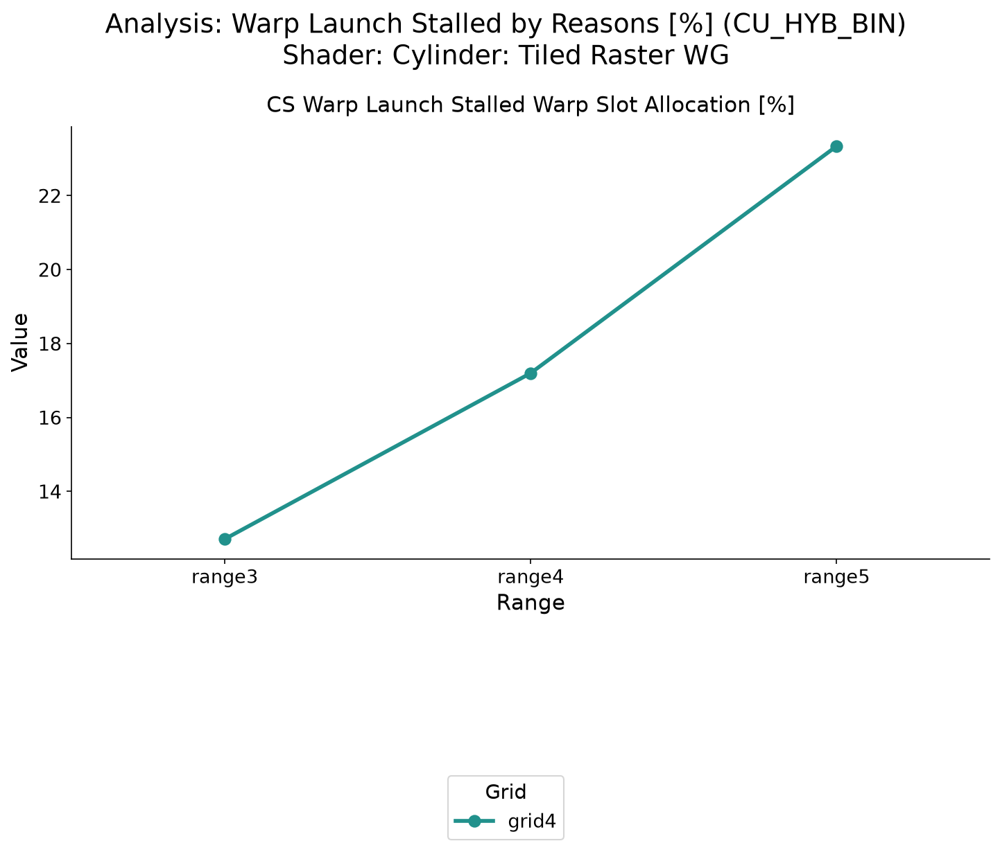

_Caption (Fig. 505): Charts showing Warp Launch Stalled by Reasons (%) for Cylinder: Tiled Raster WG across compact grid scenes grid1–grid4 The x-axis represents the camera range (distance from the scene), and the y-axis represents the value. Each chart has its own scale (mentioned in the title). Each line corresponds to a different grid (grid1, grid2, …)._

In [Fig. 505](#fig-505) only grid4 could be showing minimal stall due to Warp Slot Allocation [%], going from 12% in range3 to 24% for range5.

##### SM Throughputs

##### Sphere: Classify

**Fig. 506**
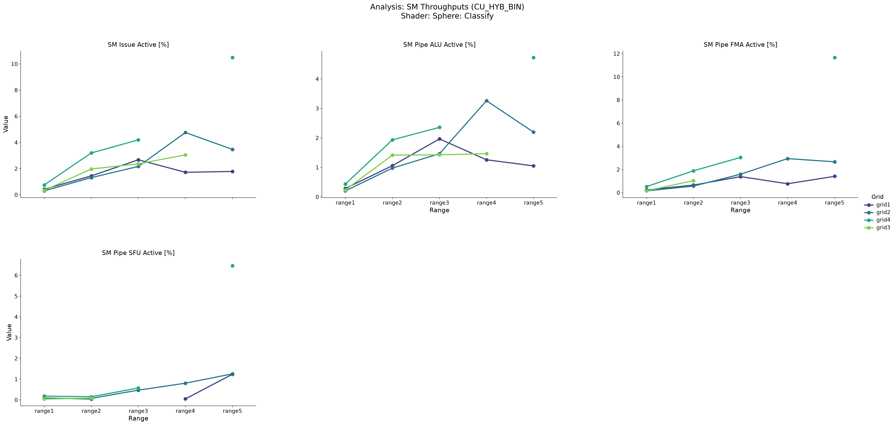

_Caption (Fig. 506): Charts showing SM Throughputs (%) for Sphere: Classify across compact grid scenes grid1–grid4 The x-axis represents the camera range (distance from the scene), and the y-axis represents the value. Each chart has its own scale (mentioned in the title). Each line corresponds to a different grid (grid1, grid2, …)._

In [Fig. 506](#fig-506) every chart presents the same pattern, with percentages growing across ranges and with grid size. In all cases the values are low, discarding a possible bottleneck in the SMs and signaling that this stage is light and well optimized. The charts presented are SM Issue Active [%], SM Pipe ALU Active [%], SM Pipe FMA Active [%] and SM Pipe SFU Active [%].

##### Sphere: Sort+RLE+TileOffsets

**Fig. 507**
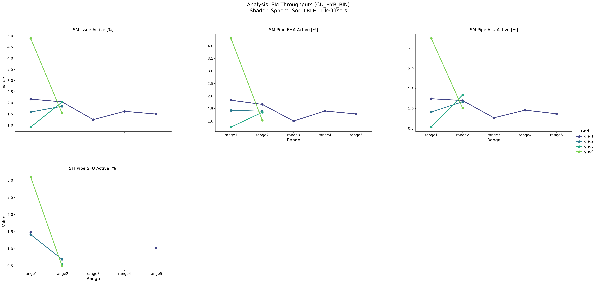

_Caption (Fig. 507): Charts showing SM Throughputs (%) for Sphere: Sort+RLE+TileOffsets across compact grid scenes grid1–grid4 The x-axis represents the camera range (distance from the scene), and the y-axis represents the value. Each chart has its own scale (mentioned in the title). Each line corresponds to a different grid (grid1, grid2, …)._

In [Fig. 507](#fig-507) all charts in [Fig. 507](#fig-507) show a similar pattern among themselves, but it is an erratic behaviour. All values are really low. Charts shown are SM Issue Active [%], SM Pipe ALU Active [%], SM Pipe FMA Active [%] and SM Pipe SFU Active [%].

##### Sphere: Expand WorkGroups

**Fig. 508**
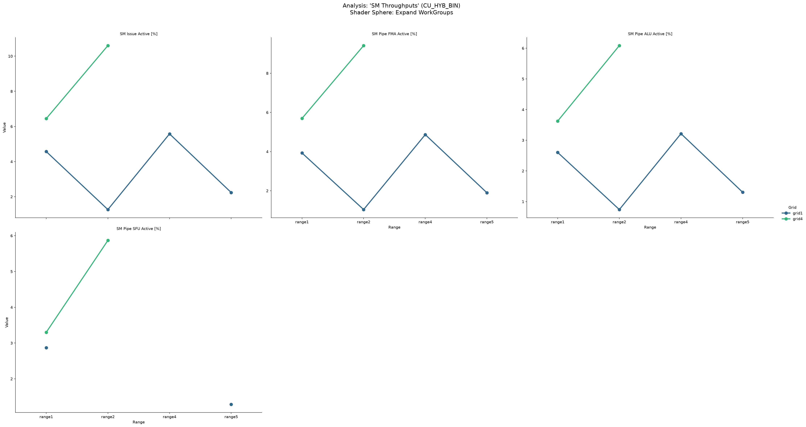

_Caption (Fig. 508): Charts showing SM Throughputs (%) for Sphere: Expand WorkGroups across compact grid scenes grid1–grid4 The x-axis represents the camera range (distance from the scene), and the y-axis represents the value. Each chart has its own scale (mentioned in the title). Each line corresponds to a different grid (grid1, grid2, …)._

In [Fig. 508](#fig-508) no pattern is still detected even when all charts show similar shapes. All values are still really low, in SM Issue Active [%], SM Pipe ALU Active [%], SM Pipe FMA Active [%] and SM Pipe SFU Active [%].

##### Sphere: Tiled Raster WG

**Fig. 509**
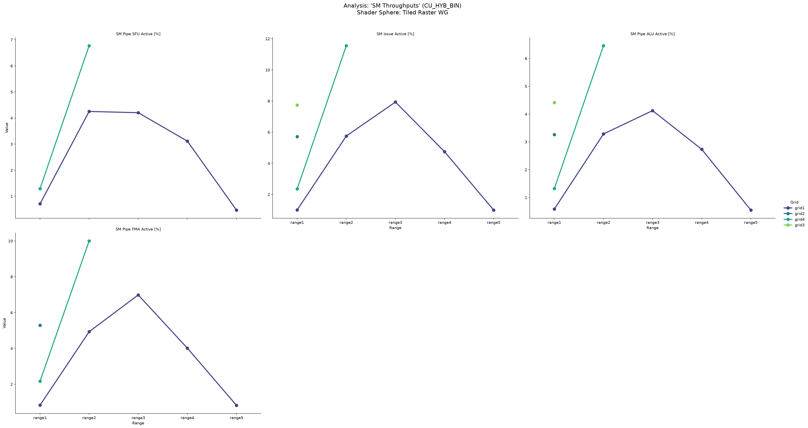

_Caption (Fig. 509): Charts showing SM Throughputs (%) for Sphere: Tiled Raster WG across compact grid scenes grid1–grid4 The x-axis represents the camera range (distance from the scene), and the y-axis represents the value. Each chart has its own scale (mentioned in the title). Each line corresponds to a different grid (grid1, grid2, …)._

In [Fig. 509](#fig-509) similar to previous stage,.

##### Sphere: Small Raster

**Fig. 510**
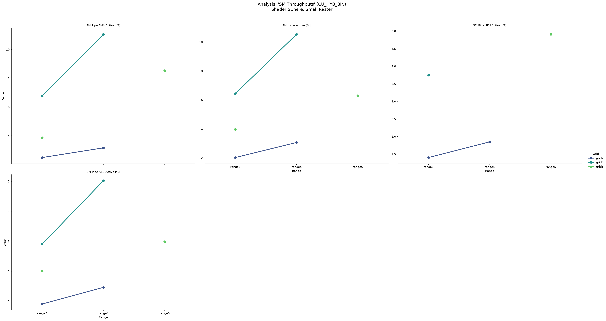

_Caption (Fig. 510): Charts showing SM Throughputs (%) for Sphere: Small Raster across compact grid scenes grid1–grid4 The x-axis represents the camera range (distance from the scene), and the y-axis represents the value. Each chart has its own scale (mentioned in the title). Each line corresponds to a different grid (grid1, grid2, …)._

In [Fig. 510](#fig-510) not enough results to analyze, but all of them are low (less than 12%).

##### Cylinder: Classify

**Fig. 511**
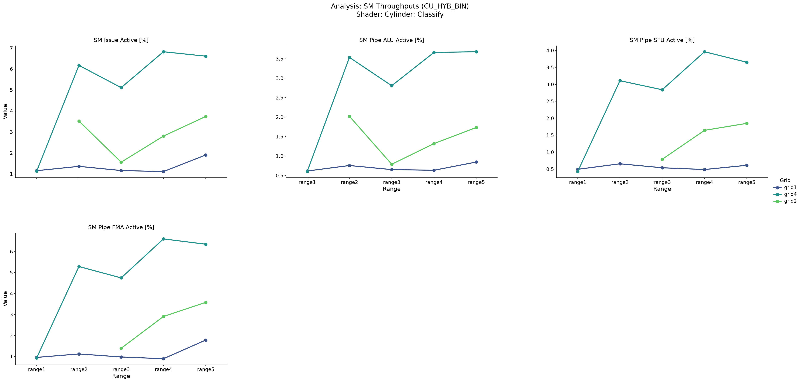

_Caption (Fig. 511): Charts showing SM Throughputs (%) for Cylinder: Classify across compact grid scenes grid1–grid4 The x-axis represents the camera range (distance from the scene), and the y-axis represents the value. Each chart has its own scale (mentioned in the title). Each line corresponds to a different grid (grid1, grid2, …)._

In [Fig. 511](#fig-511) similar to the Sphere Classify stage.

##### Cylinder: Sort+RLE+TileOffsets

**Fig. 512**
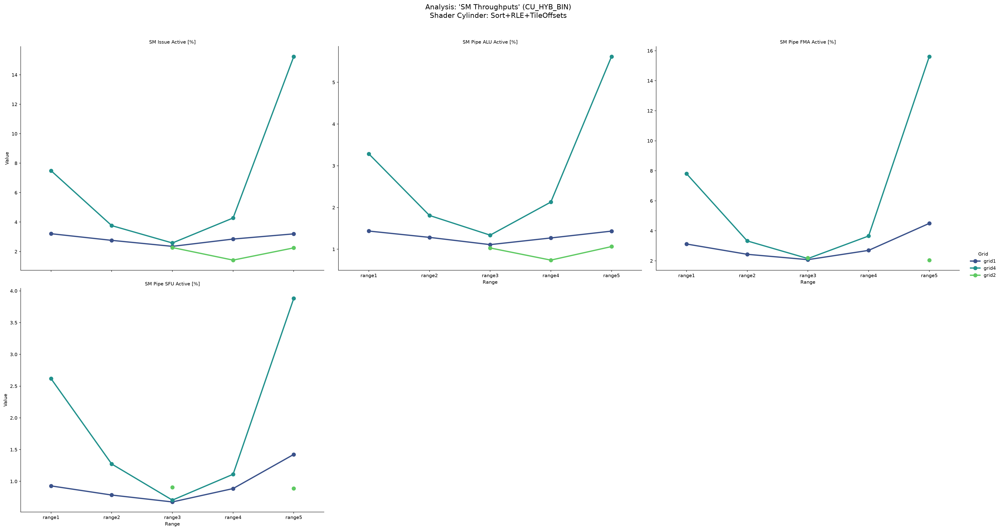

_Caption (Fig. 512): Charts showing SM Throughputs (%) for Cylinder: Sort+RLE+TileOffsets across compact grid scenes grid1–grid4 The x-axis represents the camera range (distance from the scene), and the y-axis represents the value. Each chart has its own scale (mentioned in the title). Each line corresponds to a different grid (grid1, grid2, …)._

In [Fig. 512](#fig-512) could be similar to Sphere Sort+RLE+TileOffsets stage, but with a more complex pattern (or no pattern at all) and with higher values. SM Issue Active and SM Pipe FMA Active show higher maximums (14 and 16%, respectively), but still low.

##### Cylinder: Expand WorkGroups

**Fig. 513**
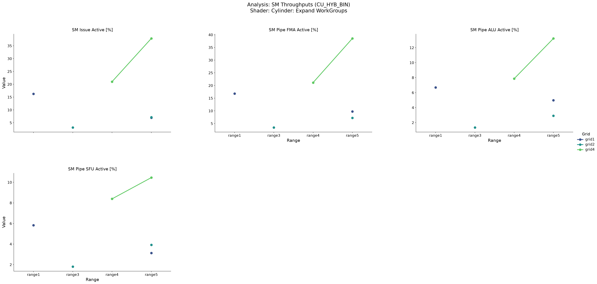

_Caption (Fig. 513): Charts showing SM Throughputs (%) for Cylinder: Expand WorkGroups across compact grid scenes grid1–grid4 The x-axis represents the camera range (distance from the scene), and the y-axis represents the value. Each chart has its own scale (mentioned in the title). Each line corresponds to a different grid (grid1, grid2, …)._

In [Fig. 513](#fig-513) not enough results to analyze, but all of them are low.

##### Cylinder: Tiled Raster WG

**Fig. 514**
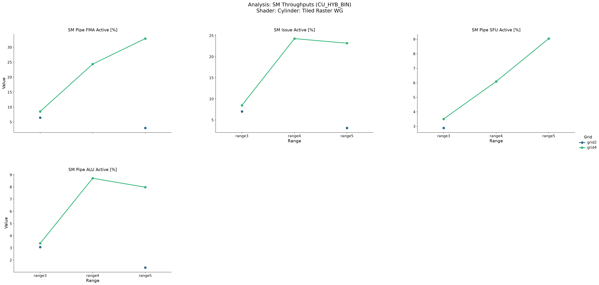

_Caption (Fig. 514): Charts showing SM Throughputs (%) for Cylinder: Tiled Raster WG across compact grid scenes grid1–grid4 The x-axis represents the camera range (distance from the scene), and the y-axis represents the value. Each chart has its own scale (mentioned in the title). Each line corresponds to a different grid (grid1, grid2, …)._

In [Fig. 514](#fig-514) are only results for grid4, showing low values except in SM Pipe FMA Active [%] and SM Issue Active [%], where values increase across ranges. The first one goes from 10 to 31%, and the second one from 10 to 25%. It was expected since cylinders have a much heavier rasterization algorithm.

##### Performance Per Marked Range

**Fig. 515**
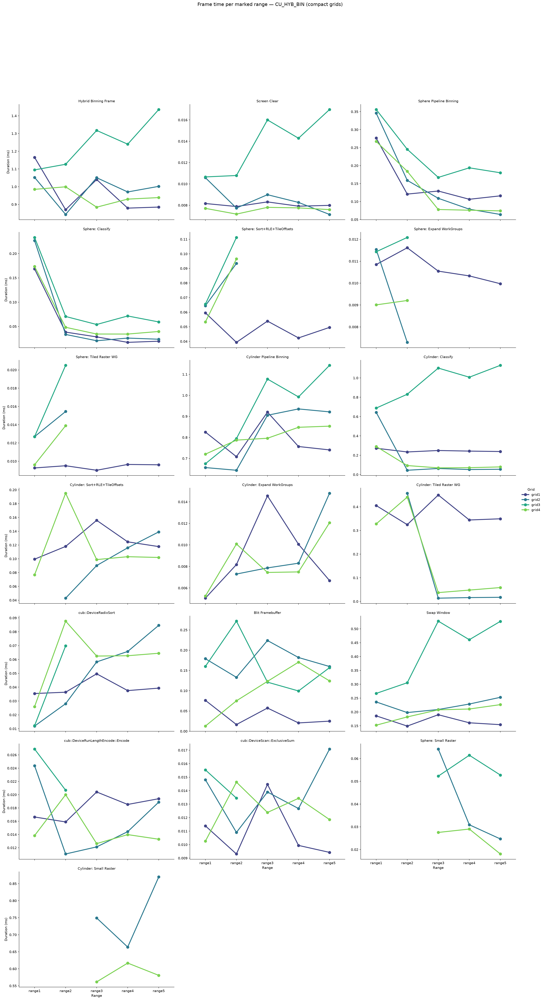

_Caption (Fig. 515): Charts showing frame time per marked range for the CUDA hybrid binning pipeline across compact grid scenes grid1–grid4 The x-axis represents the camera range (distance from the scene), and the y-axis represents the value. Each chart has its own scale (mentioned in the title). Each line corresponds to a different grid (grid1, grid2, …)._

In [Fig. 515](#fig-515) the chart shows the performance of every marked stage of the pipeline, all of them presenting really low values, the most costly could be the one related to cylinders, some of them costing more than one ms (Cylinder: Classify, then Cylinder: Small Raster). It must be remembered that during the rasterization of cylinders there was the interruption due to the change of context. Overall, every stage had really good performance, but there may be too many stages.

#### 3.1.5 Cross-version performance comparison

In this section, only performance is analyzed and compared between versios, without going into the details of the metrics. In [Fig. 516](#fig-516) four charts are displayed, showing the average frame time for each range on each molecule. Each version is shown with an unique name for identification: CS_1st as the first GPGPU version (1st Compute Shader version, therefore CS), CS_2nd as the second GPGPU version, CS_std as the standard pipeline (CS since it occupies Compute Shaders for culling) and CU_HYB_BIN as the hybrid binning CUDA version.

**Fig. 516**
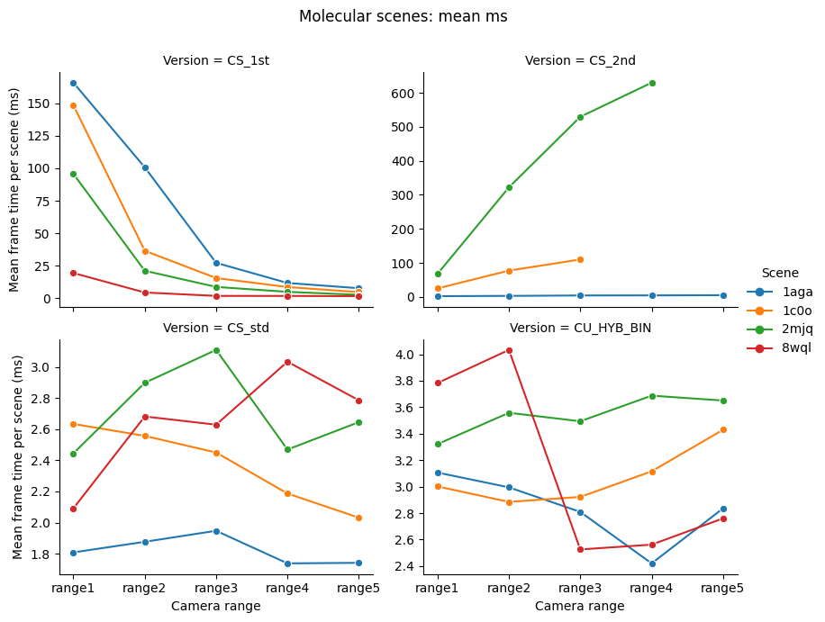

_Caption (Fig. 516): Figure shows four line charts, one for each version, displaying average frame time (ms) for each range on each molecule (represented by a line of a specific color)._

CS\*1st shows, as explained in the previous work, an excelent performance for medium/far ranges, but a very bad performance for close ranges. CS_2nd shows a much better performance for close ranges and in small molecules. CS_std shows excelent performance in any case, same as CU_HYB_BIN but this last one doesn't have as good performance as the standard pipeline in close ranges, but in some cases shows better performance for far ranges. [Fig. 517](#fig-517) shows the same charts but with average frame time in frames per second (FPS) instead of milliseconds, which is a more intuitive metric for performance. The patterns are the same as in the previous figure, but it is easier to see the differences between versions and how they perform in different ranges and molecules.

**Fig. 517**
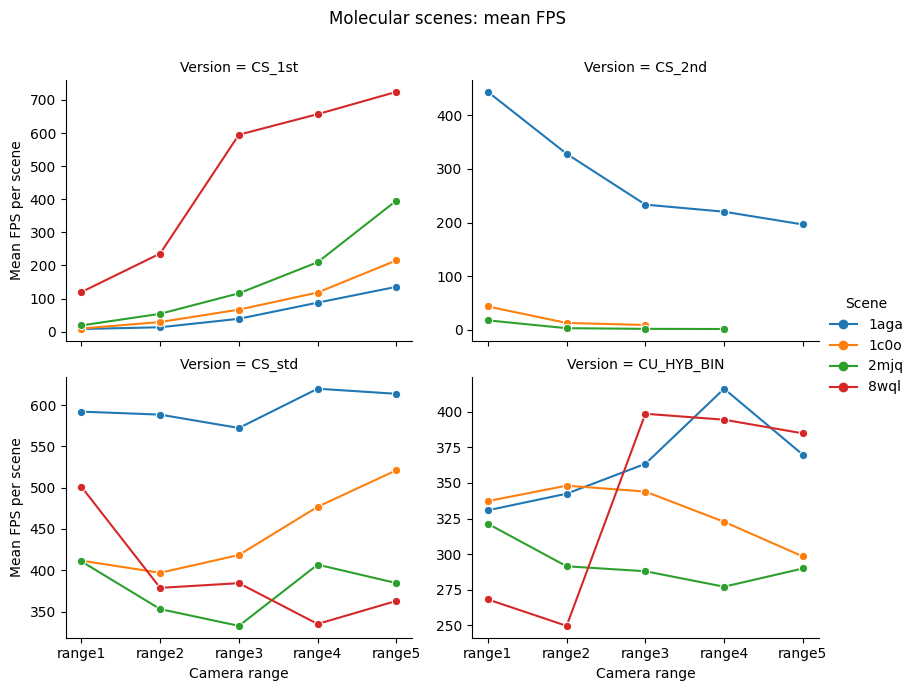

_Caption (Fig. 517): Figure shows four line charts, one for each version, displaying average FPS count for each range on each molecule (represented by a line of a specific color)._

##### Performance Comparison: Standard Pipeline vs Hybrid Binning CUDA

In this part, the performance of the standard pipeline version (CS_std) is compared with the hybrid binning CUDA version (CU_HYB_BIN). The next four Figures show a slight difference in performance,
having the standard pipeline version with better performance most of the times, yet both versions
show persistent patterns across all molecules, except for 8WQL, where for the last ranges they
had similar performance.

**Fig. 518**
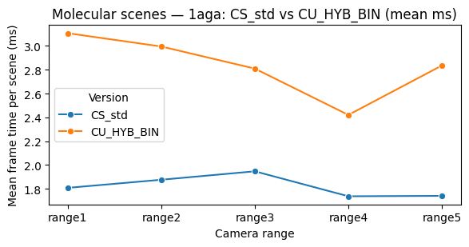

_Caption (Fig. 518): Standard Pipeline vs Hybrid Binning CUDA for 1AGA molecule._

**Fig. 519**
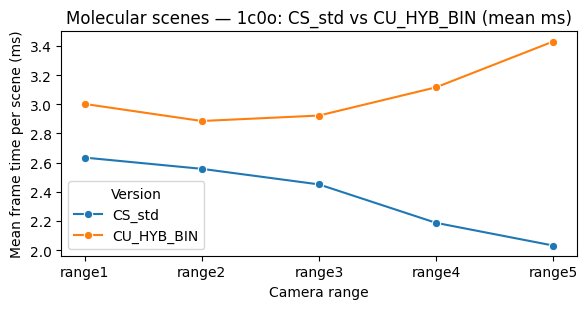

_Caption (Fig. 519): Standard Pipeline vs Hybrid Binning CUDA for 1C0O molecule._

**Fig. 520**
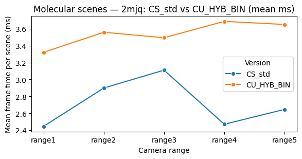

_Caption (Fig. 520): Standard Pipeline vs Hybrid Binning CUDA for 2MJQ molecule._

**Fig. 521**
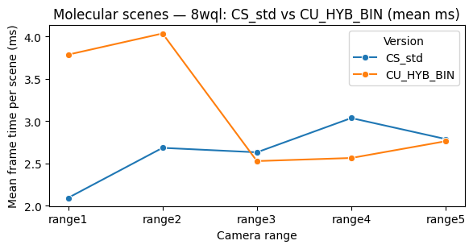

_Caption (Fig. 521): Standard Pipeline vs Hybrid Binning CUDA for 8WQL molecule._

### 3.2 Out-of-core (CU_OOC)

This subsection presents a standalone characterisation of the CUDA out-of-core implementation (`CU_OOC`), aligned with the experimentation protocol in Section _Experimentation of Out-of-Core Version_ and the testing goals in Section _About Testing the Out of Core Version_. Five scenes were profiled: the molecular baseline **8WQL** and the synthetic PACKAGE grids **G10M**, **G50M**, **G100M**, and **G500M** (10--500 million atoms). For each scene, Nsight Graphics YAML captures were taken at five camera rings with three positional replicas per ring; these traces were joined with batch CSV logs (`numVisible` as blocks surviving frustum culling, `numFiltered` as blocks filtered by occlusion culling, `numRequests` as the number of block requested that are not resident in the VRAM pool, `activeCount` as the number of active atoms ready to rasterize, frame time) and preprocess snapshots. The analysis is _not_ ranked against the hybrid pipelines (`CS_1st`, `CS_2nd`, `CS_std`, `CU_HYB_BIN`); it isolates streaming, culling, active-list construction, and OOC rasterization behaviour. Representative figures are shown below; the complete per-scene figure set is provided in Appendix _Out-of-Core Results Figures_. Pipeline-stage attribution uses eight NVTX ranges. Relative frame fractions were renormalised over the remaining stages so that shares sum to unity per capture. **8WQL** is discussed separately where scale differs from the regular PACKAGE grids.

#### Pipeline Stage Attribution (Nsight)

The eight NVTX ranges retained for attribution correspond to the core out-of-core loop described in Section _About Testing the Out of Core Version_. They are listed below in frame order; CPU-side streaming (block read from disk and batched upload) runs between `Request Generation` and `Build Active Atom List` but is not wrapped in a separate NVTX range in the YAML exports analysed here.

- **Octree BFS Frustum Culling:** breadth-first traversal of the reduced octree on the GPU, level by level. Nodes whose AABB lies outside the view frustum are discarded; leaf blocks that survive are appended to the visible-block list (`numVisible`).

- **Compute Block Depth+Area:** for each visible block, computes screen-space depth and projected area/density (`OocBlockDepthInfo`) used by the subsequent occlusion tests.

- **Thrust Sort (Depth):** front-to-back sort of visible blocks by depth on the GPU (Thrust), required for cumulative probabilistic occlusion along the view ray.

- **Occlusion Culling:** rejects blocks occluded by the hierarchical Z-buffer from the previous frame and/or by the probabilistic visibility margin (`hiz_probabilistic` in the test configuration); output is the filtered block list (`numFiltered`).

- **Request Generation:** GPU pass over filtered blocks that are not resident in the pool (`blockSlotMap[blockId] < 0`); emits block IDs into a capped request buffer (`numRequests`), followed by GPU sort and de-duplication of requests.

- **Build Active Atom List:** gathers atoms from resident pool slots for filtered blocks into a contiguous `activeAtoms[]` buffer and sets `activeCount` for raster dispatch.

- **Sphere Raster OOC:** CUDA sphere rasterisation (ray--sphere intersection, atomic depth test, surface write), using the same shading model as the first GPGPU version but fed from the active atom list rather than a full in-core array.

- **HiZ Downsample:** builds or updates the hierarchical depth pyramid from the current frame depth buffer so that the next frame can run HiZ occlusion culling.

##### Relative duration and bottlenecks

Across PACKAGE grids, `Build Active Atom List` and `Sphere Raster OOC` dominate at medium scales, while `Occlusion Culling` grows at G500M. On **8WQL**, `HiZ Downsample` is comparatively large because the molecular working set is small and depth-pyramid maintenance is not amortised by massive streaming. On G10M, [Fig. 669](#fig-669) shows at short ranges a large dominance of `Sphere Raster OOC` ( 90% of the frame), but across ranges the share of `Build Active Atom List` grows to overtake this dominance with around 60% of the frame leaving sphere raster around 20% and `HiZ Downsample` near 9% (third greatest value, a stage of constant cost). The companion heatmap in [Fig. 674](#fig-674) confirms that ring distance modulates raster share more than culling share at this scale. In [Fig. 670](#fig-670) it can be observed that `Build Active Atom List` exceeds 60% of the analysed frame, while `Sphere Raster OOC` falls below 20%; [Fig. 675](#fig-675) shows the same shift as a dark band on the active-list row across all rings. At G100M the pattern intensifies ([Fig. 671](#fig-671) and [Fig. 676](#fig-676)), with active-list construction above 65% and raster below 13%. At G500M ([Fig. 672](#fig-672) and [Fig. 677](#fig-677)) `Occlusion Culling` reaches roughly one quarter of the core pipeline, indicating that hierarchical-Z rejection and block-level visibility tests dominate before rasterization on the largest grid.

**Fig. 522**
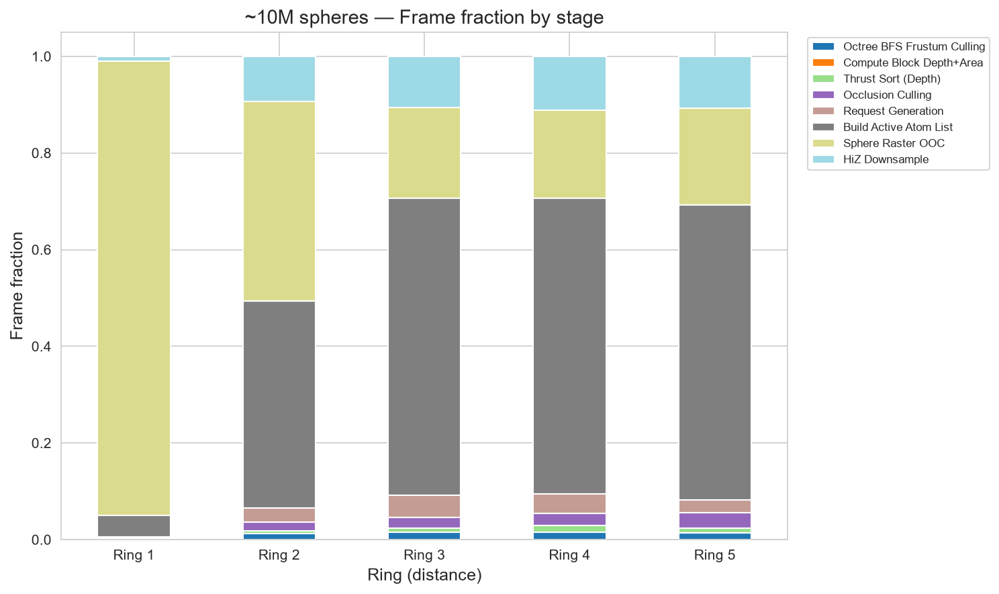

_Caption (Fig. 522): Renormalised pipeline-stage fractions for G10M (\sim10M atoms) by camera ring. The x-axis is camera distance (ring 1--5); stacked bars show mean share per analysed stage._

**Fig. 523**
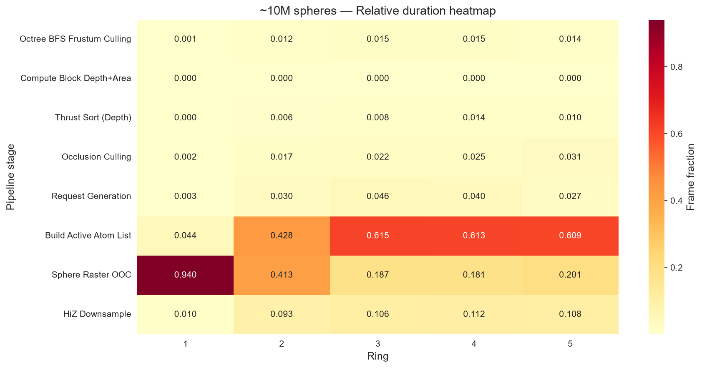

_Caption (Fig. 523): Heatmap of renormalised stage fractions for G10M across rings and stages._

**Fig. 524**
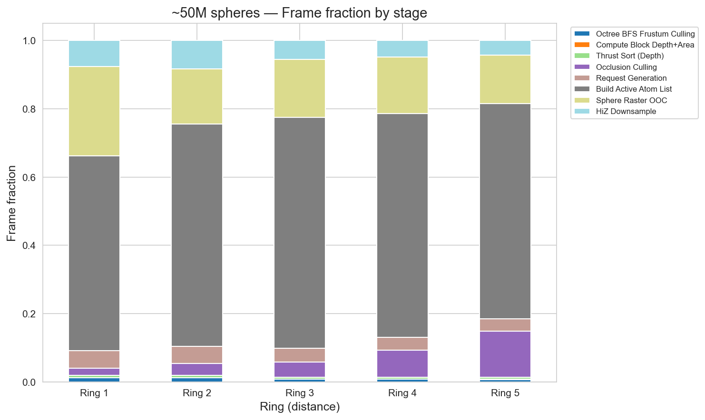

_Caption (Fig. 524): Renormalised pipeline-stage fractions for G50M by camera ring._

**Fig. 525**
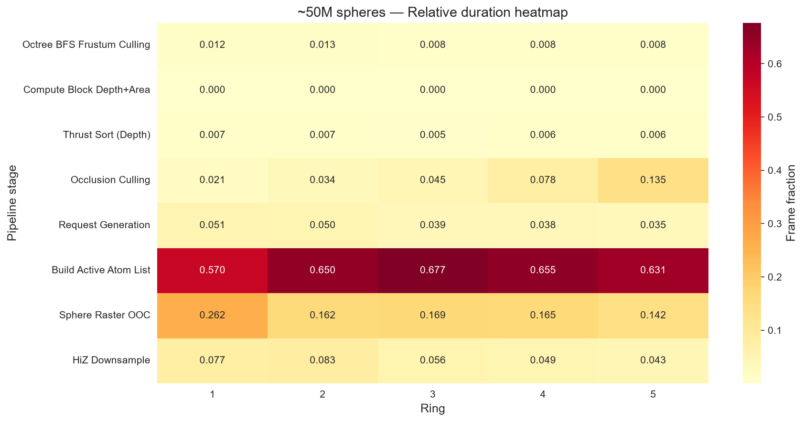

_Caption (Fig. 525): Stage-fraction heatmap for G50M._

**Fig. 526**
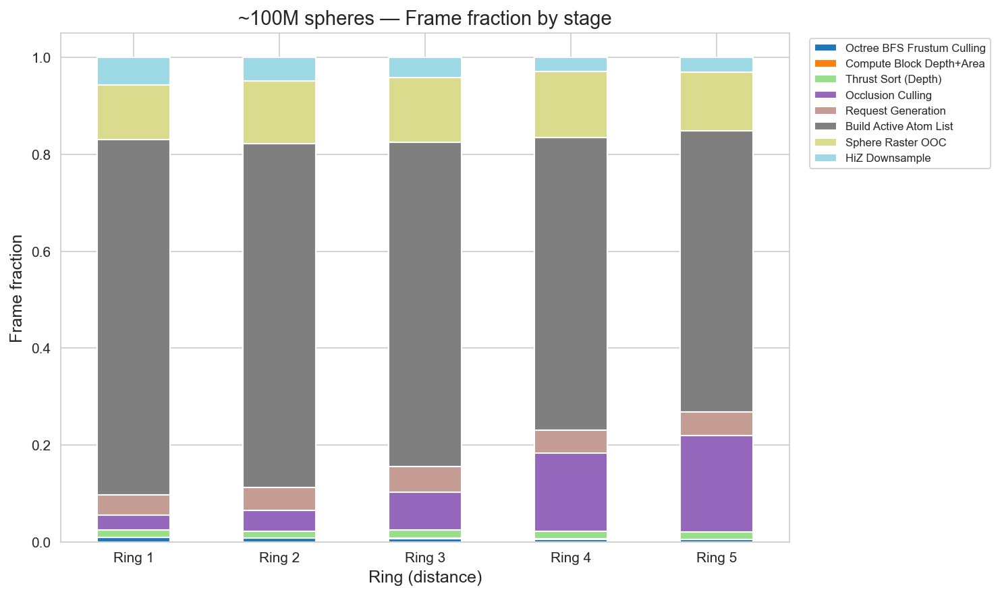

_Caption (Fig. 526): Renormalised pipeline-stage fractions for G100M by camera ring._

**Fig. 527**
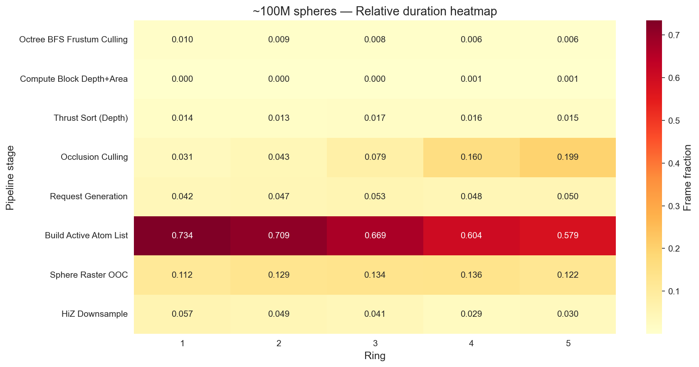

_Caption (Fig. 527): Stage-fraction heatmap for G100M._

**Fig. 528**
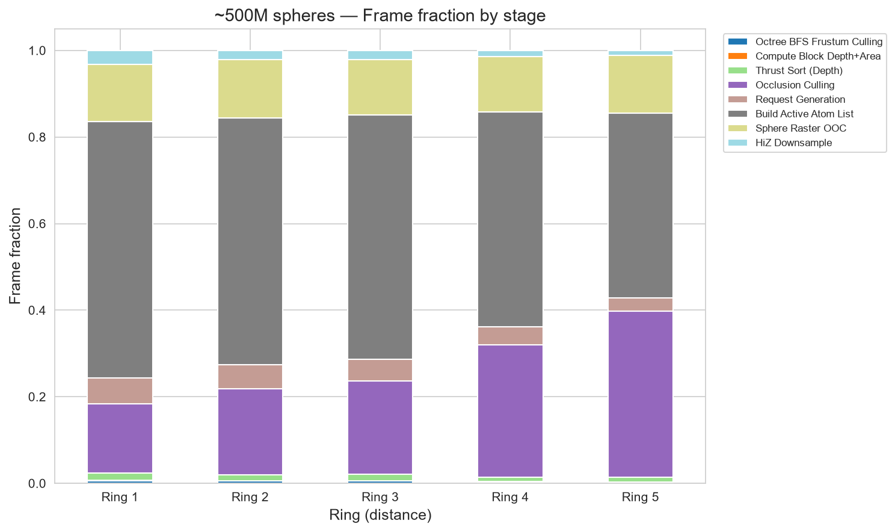

_Caption (Fig. 528): Renormalised pipeline-stage fractions for G500M by camera ring._

**Fig. 529**
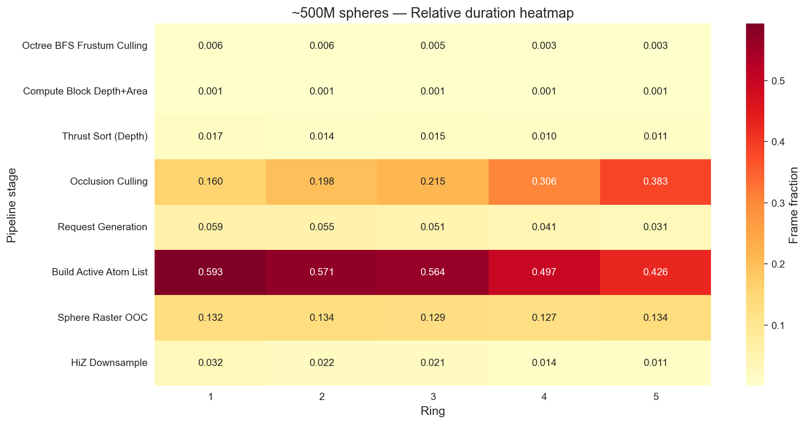

_Caption (Fig. 529): Stage-fraction heatmap for G500M._

For the molecular baseline, [Fig. 673](#fig-673) shows that no single stage exceeds 30% of the analysed frame: `Sphere Raster OOC` (\sim26%), `Build Active Atom List` (\sim23%), and `HiZ Downsample` (\sim23%) share the budget more evenly than on PACKAGE scenes. [Fig. 678](#fig-678) illustrates that frustum culling and depth-prep stages remain minor contributors, which is consistent with a small octree and limited streaming pressure.

**Fig. 530**
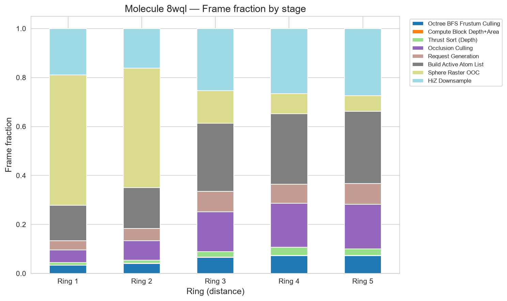

_Caption (Fig. 530): Renormalised pipeline-stage fractions for 8WQL by camera ring._

**Fig. 531**
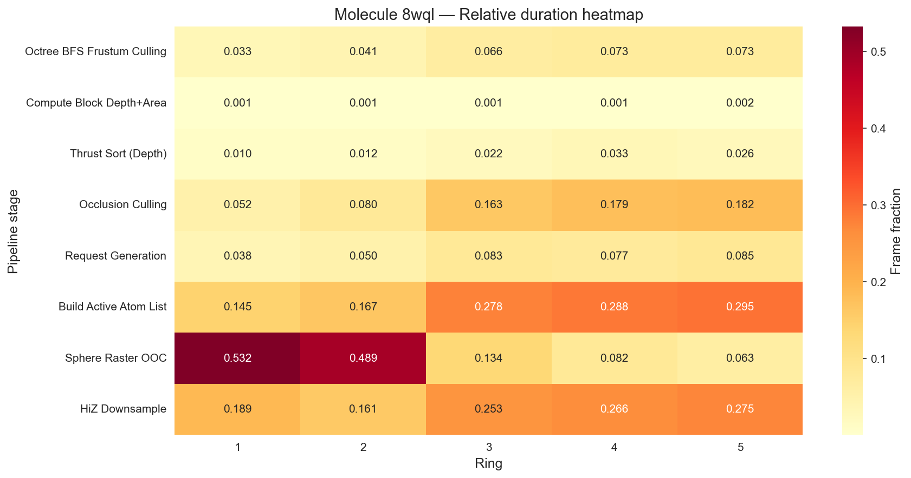

_Caption (Fig. 531): Stage-fraction heatmap for 8WQL._

#### GPU Engines, Caches, and Stalls

##### Graphics engine utilisation and memory hierarchy

`Octree BFS Frustum Culling` and `Compute Block Depth+Area` frequently show high GR idle percentages (>50%) on large grids, which suggests that these passes are latency-bound or launch sparse work relative to the frame budget, but it could also be that their work becomes light since they depend on the efficiency of tree traversal. `Request Generation` exhibits the lowest L1TEX hit rates on PACKAGE scenes, consistent with streaming-induced working-set churn and/or the random access pattern it has to create the ID buffer for requests. On G500M as a representative large grid, [Fig. 660](#fig-660) stacks GR active (top) and GR idle (bottom) by stage and ring: culling and depth-prep stages sit at high idle, while raster and request generation stay more active. [Fig. 661](#fig-661) shows the same scene from the memory side---L1TEX hit rate (top) drops on `Request Generation`, while PCIe throughput (bottom) rises on rings with heavier residency turnover.

**Fig. 532**
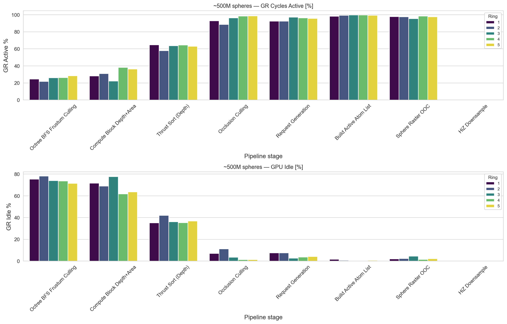

_Caption (Fig. 532): GR active (top) and GR idle (bottom) percentages by pipeline stage and camera ring for G500M._

**Fig. 533**
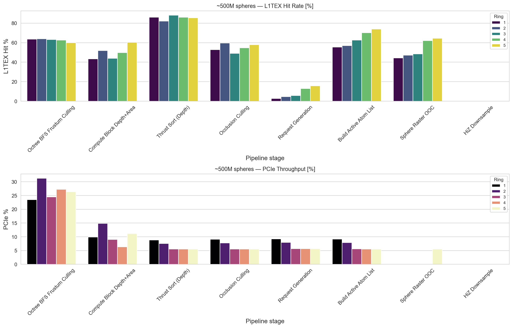

_Caption (Fig. 533): L1TEX hit rate (top) and PCIe throughput (bottom) by pipeline stage and camera ring for G500M._

[Fig. 707](#fig-707) adds warp occupancy, where raster and active-list stages maintain higher occupancy than frustum traversal. Occlusion culling shows low occupancy even if it is heavy work because it doesn't launch many threads.

**Fig. 534**
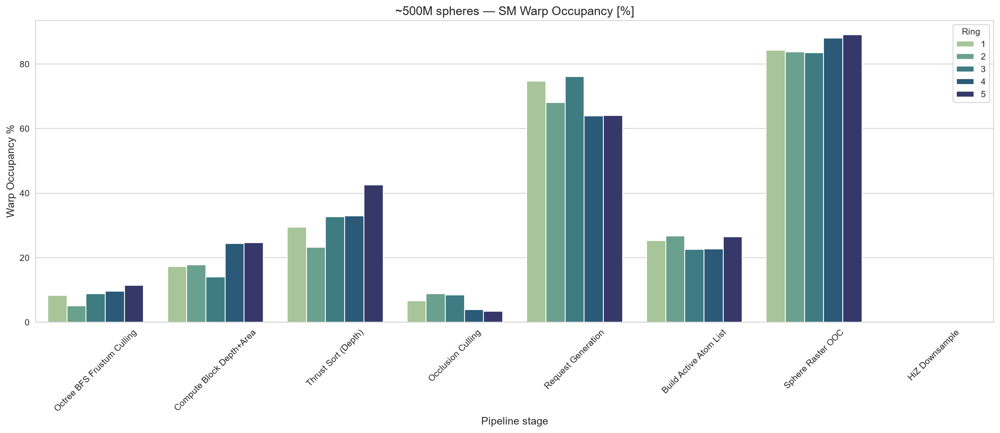

_Caption (Fig. 534): Warp occupancy by analysed stage and camera ring for G500M._

The cross-scene summaries in [Fig. 577](#fig-577)--[Fig. 580](#fig-580) highlight how idle time and texture hit rates diverge between **8WQL** and the million-atom grids as scale increases. In [Fig. 577](#fig-577), PACKAGE scenes cluster at lower mean GR active on culling stages; [Fig. 578](#fig-578) shows the complementary idle rise. [Fig. 579](#fig-579) confirms lower L1TEX hits on large grids, and [Fig. 580](#fig-580) shows PCIe becoming more relevant from G50M upward. The corresponding GR, cache, PCIe, and warp-occupancy plots for G10M, G50M, G100M, and 8WQL are provided in Appendix _Out-of-Core Results Figures_.

**Fig. 535**
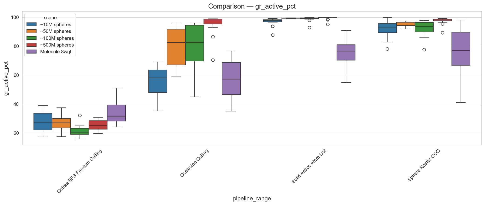

_Caption (Fig. 535): Cross-scene comparison of mean GR active percentage by camera ring._

**Fig. 536**
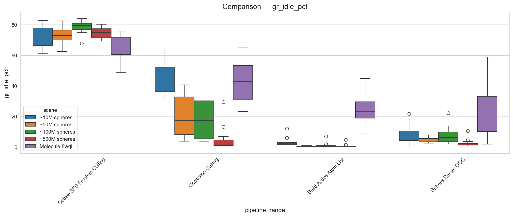

_Caption (Fig. 536): Cross-scene comparison of mean GR idle percentage by camera ring._

**Fig. 537**
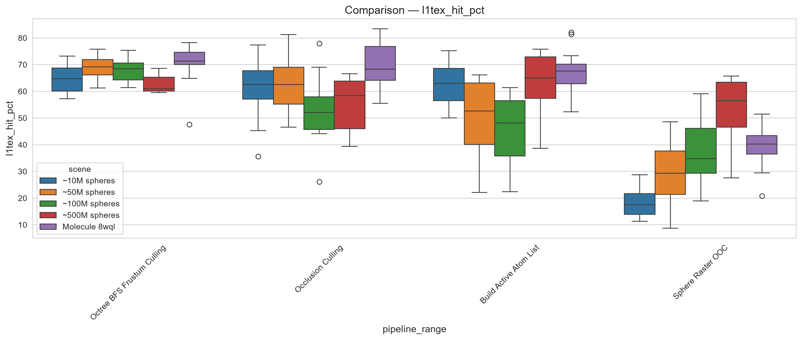

_Caption (Fig. 537): Cross-scene comparison of mean L1TEX hit rate by camera ring._

**Fig. 538**
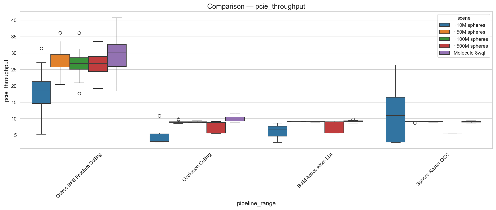

_Caption (Fig. 538): Cross-scene comparison of PCIe throughput by camera ring._

##### Warp stall breakdown

Stall stacks vary with ring because frustum- and occlusion-culled atom counts change. On G100M, [Fig. 659](#fig-659) shows that memory and execution dependency stalls grow on rings where more blocks remain visible after culling (rings 1--2 versus 4--5), even if values are low in every case. Per-scene stall breakdowns for the remaining PACKAGE grids and 8WQL, and all per-ring stall plots are listed in Appendix _Out-of-Core Results Figures_.

**Fig. 539**
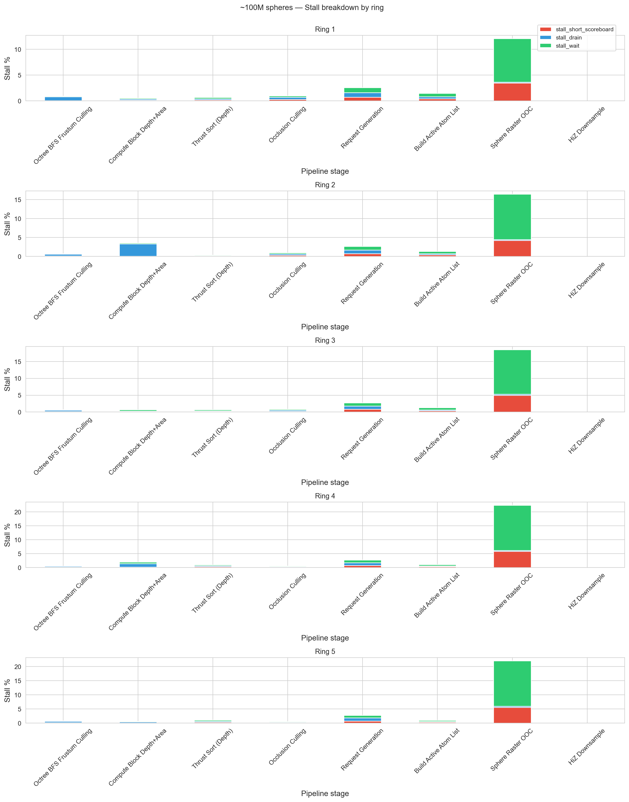

_Caption (Fig. 539): Warp-stall breakdown for G100M: camera rings 1--5 (top to bottom), focus pipeline stages on the horizontal axis._

#### Metric Trends and Correlations

##### Stage-level correlations

Heatmaps relate normalised stage duration to GPU counters for the focus passes (frustum culling, occlusion, request generation, raster). On G10M, [Fig. 657](#fig-657) shows that longer `Sphere Raster OOC` shares align with lower L1TEX hit rates, whereas `Build Active Atom List` correlates with SM issue activity when streaming keeps the active pool large; the occlusion and frustum panels highlight weaker but visible coupling between stage duration and idle stalls. The remaining per-scene metric-trend and correlation plots (G50M, G100M, 8WQL, and individual heatmaps) are provided in Appendix _Out-of-Core Results Figures_.

**Fig. 540**
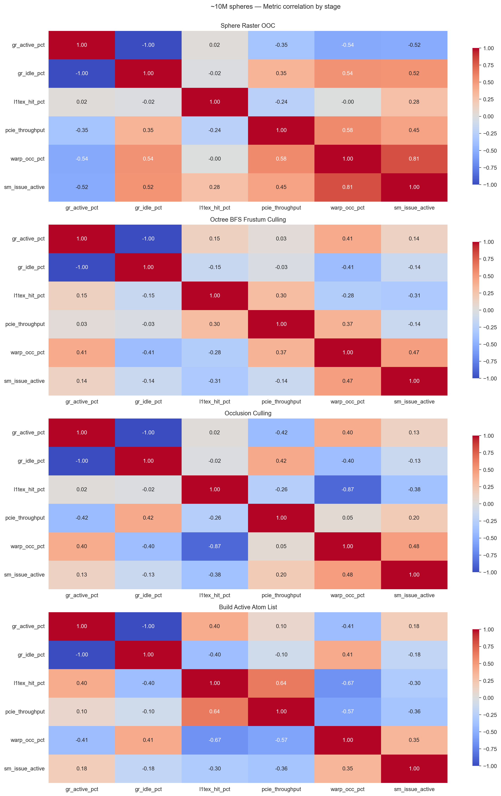

_Caption (Fig. 540): Metric correlation heatmaps for four focus pipeline stages on G10M (stacked top to bottom)._

#### Memory vs Compute Characterisation

The scatter plots partition captures into latency-bound, compute-bound, and memory-bound regions using PCIe throughput versus SM issue activity. Even so, on G500M, [Fig. 625](#fig-625) shows memory transfer throughput not related to SM issue activity, neither on **8WQL**, as [Fig. 626](#fig-626) shows. Memory/compute scatter plots for G10M, G50M, and G100M appear in Appendix _Out-of-Core Results Figures_.

**Fig. 541**
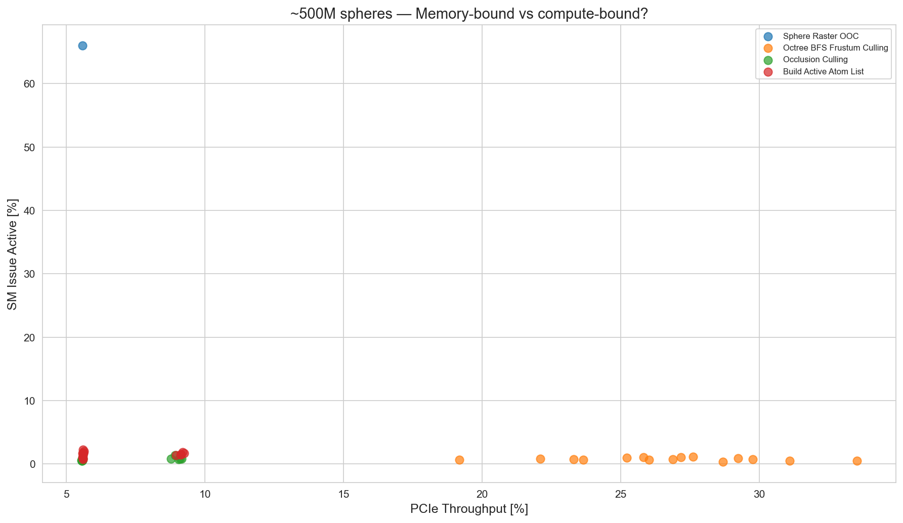

_Caption (Fig. 541): PCIe throughput versus SM issue activity for G500M (memory/compute characterisation)._

**Fig. 542**
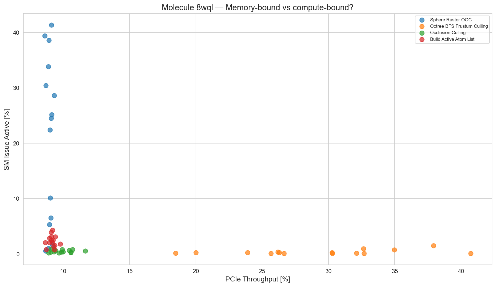

_Caption (Fig. 542): Memory/compute characterisation scatter for 8WQL._

#### Runtime Batch Behaviour

Batch CSV logs complement the GPU trace: they report logical pressure (`numVisible`, `numFiltered`, `numRequests`, `activeCount`) that Nsight cannot attribute directly. Absolute frame times come from the Nsight capture. [Fig. 606](#fig-606) compares mean frame time across rings for all scenes; [Fig. 601](#fig-601)--[Fig. 605](#fig-605) show the same metric scene by scene.

##### Frame time vs camera ring (Nsight captures)

On **G10M** ([Fig. 601](#fig-601)), ring 1 averages \sim236 ms because the first YAML capture in ring 1 is the closest distance in all molecules, showing the performance of rasterizing with the small spheres method (bad for big entities), whereas rings 2--5 settle near 18--22 ms. On **G50M**, **G100M**, and **G500M**, frame time rises monotonically with ring distance ([Fig. 602](#fig-602), [Fig. 603](#fig-603), and [Fig. 604](#fig-604)): farther rings keep more blocks visible after frustum and occlusion tests, increasing active-list and raster work---on G500M from \sim65 ms at ring 1 to \sim159 ms at ring 5. The cross-scene summary in [Fig. 606](#fig-606) highlights the scale gap between PACKAGE grids and **8WQL**, where all rings remain below \sim15 ms ([Fig. 605](#fig-605)) despite ring-to-ring variation in positional replicas.

**Fig. 543**
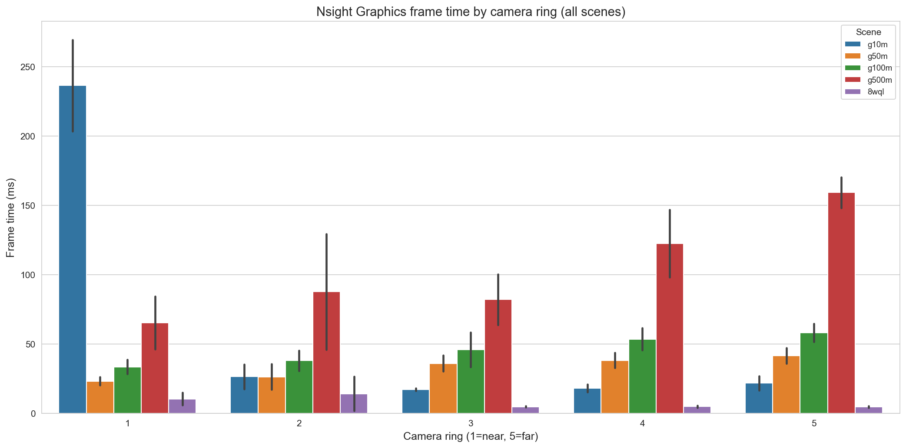

_Caption (Fig. 543): Mean Nsight Graphics frame time by camera ring; grouped bars compare all OOC scenes (error bars: standard deviation over frames and positional replicas)._

**Fig. 544**
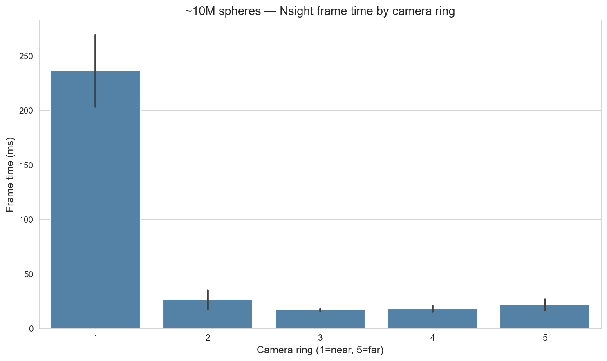

_Caption (Fig. 544): Mean Nsight frame time by camera ring for G10M._

**Fig. 545**
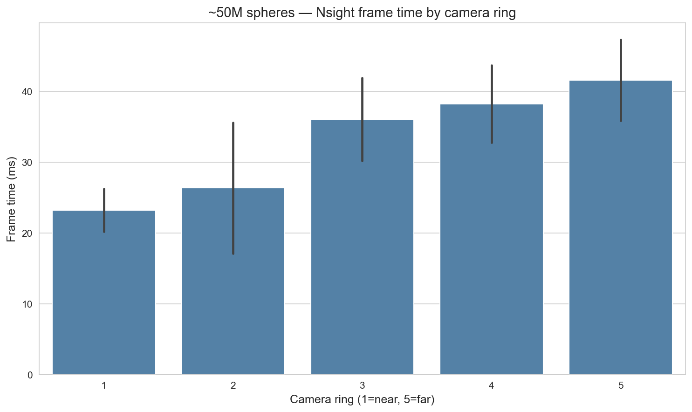

_Caption (Fig. 545): Mean Nsight frame time by camera ring for G50M._

**Fig. 546**
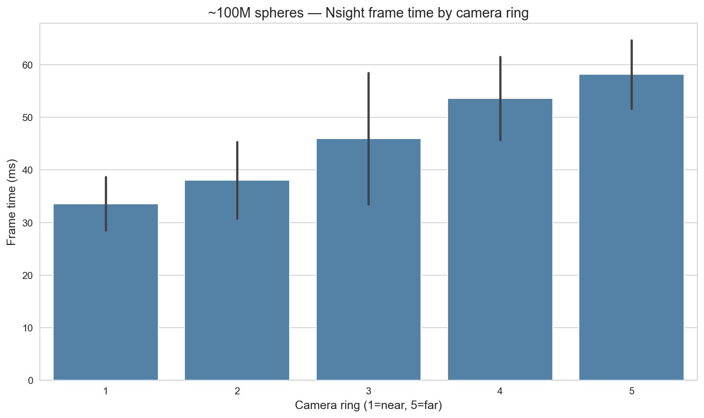

_Caption (Fig. 546): Mean Nsight frame time by camera ring for G100M._

**Fig. 547**
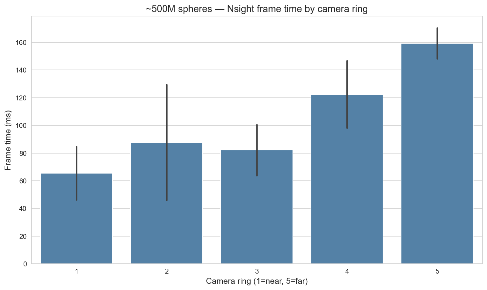

_Caption (Fig. 547): Mean Nsight frame time by camera ring for G500M._

**Fig. 548**
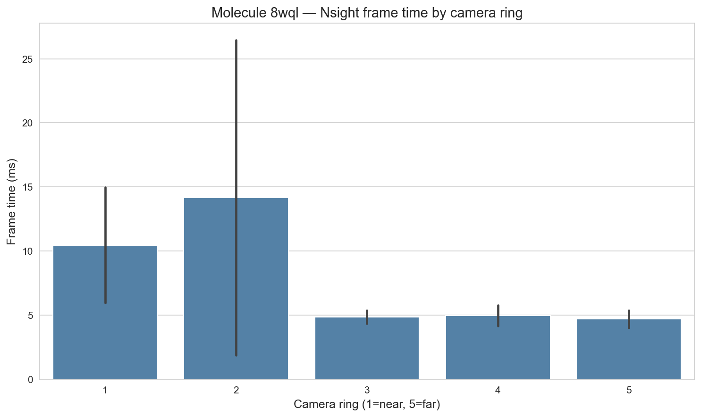

_Caption (Fig. 548): Mean Nsight frame time by camera ring for 8WQL._

#### Streaming Convergence and Culling Efficiency

The out-of-core profiler emits one log row per _batch_: a contiguous window of roughly fifteen rendered frames. Each row summarizes how many spatial blocks were frustum-visible, how many survived hierarchical-Z occlusion, how many block loads the streaming pool requested, and how many atoms were actually rasterized. These series therefore mix two effects: camera motion (which changes visible volume) and temporal warm-up of the block pool (which lowers peak load requests once resident data covers the view).

##### Peak streaming load vs.\ batch_index

Each figure plots the _peak_ number of block requests recorded inside every batch window against `batch_index` (the temporal order of batch rows along the benchmark path). Spikes mark batches where the streaming pool had to load many blocks in a single window; valleys indicate intervals where resident data already covered the view. Figures for G10M--G100M appear in Appendix _Out-of-Core Results Figures_. On **G500M** ([Fig. 570](#fig-570)), peak requests vary strongly with camera position along the rings: distant segments raise the curve, while returns toward the origin often sit near zero once the pool is warm. On **8WQL** ([Fig. 571](#fig-571)), the series stays close to the bottom of the scale, confirming that the molecular working set seldom triggers large block uploads at the tested resolutions.

**Fig. 549**

_Caption (Fig. 549): G500M: peak block requests per batch vs.\ `batch_index`._

**Fig. 550**

_Caption (Fig. 550): 8WQL: peak block requests per batch vs.\ `batch_index`._

##### Occlusion ratio at fixed camera views

The occlusion _efficiency ratio_ is the mean number of blocks that pass hierarchical-Z culling divided by the mean number of frustum-visible blocks in the same batch window. Values near one mean almost every visible block is processed; lower values mean aggressive rejection before rasterization. Curves use `batch_index` as the temporal step along the longest continuous capture segment for each grouped level; on G500M the ten most repeated levels of _mean post-occlusion block count_ are shown (finer grouping than visibility alone), whereas on 8WQL five levels grouped by mean visible block count suffice because the working set is small. On G500M ([Fig. 565](#fig-565)), it is easy to see low variation between groups, with values around 20% or lower, which means that only 20% of the visible blocks are really drawn and occlusion culling is effective. Ratios spread more widely across the ten post-occlusion levels than across visibility alone: batches with similar filtered-block counts can still differ in how many blocks were visible upstream, so the ratio separates `how hard HiZ worked'' from `how large the frustum footprint was.''. Short plateaus along a level indicate stretches where the camera was effectively stable and HiZ behavior repeated batch to batch. On 8WQL ([Fig. 566](#fig-566)), ratios remain in a tighter band: with fewer total blocks, occlusion neither collapses the working set to a handful of survivors nor drives ratios to the near-zero tail seen on the largest grids.

**Fig. 551**

_Caption (Fig. 551): G500M: occlusion efficiency ratio vs `batch_index` for the ten most repeated mean post-occlusion block levels (longest run per level)._

**Fig. 552**

_Caption (Fig. 552): 8WQL: occlusion efficiency ratio vs `batch_index` for five mean visible-block levels._

[Fig. 560](#fig-560) tracks pool residency and the fraction of atoms actually rasterized from the active pool---coverage metrics, not GPU VRAM (VRAM is reported separately in preprocess logs, Section below).

**Fig. 553**
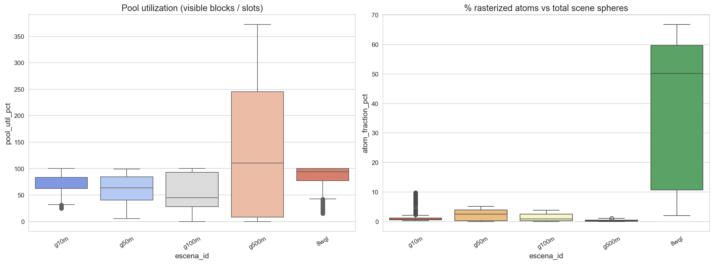

_Caption (Fig. 553): Active-pool and atom-fraction metrics across scenes (pool coverage, not VRAM)._

#### Preprocess and Working-Set Build

Offline preprocess timings (Morton ordering, block-file creation, octree build) scale super-linearly with atom count on PACKAGE grids. After GPU init, per-component device allocations (bytes used in pipeline buffers, bytes used for streaming pool, depth buffer size, HiZ buffer size and framebuffer size) are recorded and summed, plus `cudaMemGetInfo` free/total. [Fig. 711](#fig-711) breaks down phase timings, throughput (atoms/ms), stacked VRAM components (not proportional to total sphere count on disk), and on-disk/host sizes from G10M to G500M. [Fig. 712](#fig-712) shows block count, octree node count, and block-file size growing predictably with sphere count, explaining the rising cost of both preprocess and per-frame culling as the spatial index deepens.

**Fig. 554**

_Caption (Fig. 554): Preprocess time breakdown, throughput, stacked GPU buffer allocations at init (MB from `cudaMalloc` sums), `cudaMemGetInfo` usage, and on-disk/host sizes versus entity count._

**Fig. 555**
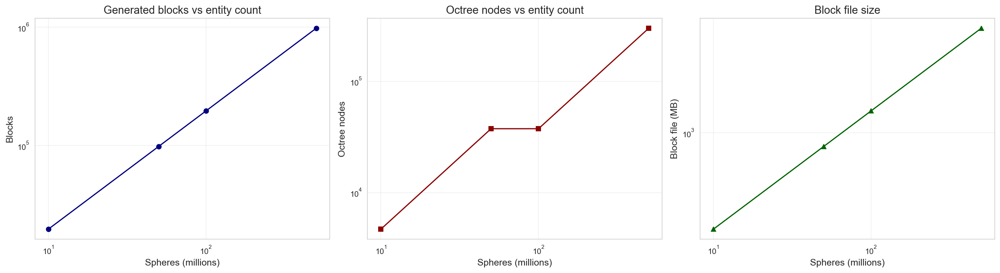

_Caption (Fig. 555): Block count, octree node count, and block-file size versus sphere count._

#### Scale Across PACKAGE Scenes

Joining Nsight stage fractions with batch frame times separates GPU-bound rasterization from CPU-visible streaming stalls. [Fig. 710](#fig-710) shows how the renormalised `Sphere Raster OOC` share drops from G10M to G500M as culling and active-list work absorb the frame. [Fig. 709](#fig-709)frame*ms* compares YAML-derived stage composition (right) with mean batch frame time from the profiler CSV (left: average of \texttt{avg*frame_ms` over all batch rows per scene, \sim15 frames per batch). That left panel is \_not* the per-ring millisecond series from Nsight files (see frame-time-by-ring figures above).

**Fig. 556**
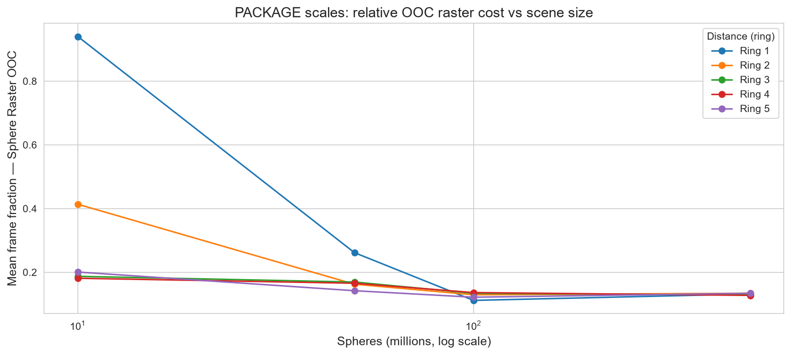

_Caption (Fig. 556): Raster-stage fraction versus PACKAGE scale (G10M--G500M)._

**Fig. 557**

_Caption (Fig. 557): Left: mean batch `avg_frame_ms` from profiler CSV (not Nsight per-frame files). Right: mean Nsight fraction of *Build Active Atom List* vs mean batch `activeCount`._

Overall, the out-of-core results indicate that (i) active-list construction and occlusion dominate large regular grids ([Fig. 671](#fig-671)--[Fig. 672](#fig-672), and [Fig. 710](#fig-710)) with an obvious higher cost on building the active atoms list as scale increases, while rasterisation becomes a smaller fraction of the frame, (ii) molecular 8WQL remains raster- and HiZ-weighted at the tested scales ([Fig. 673](#fig-673) and [Fig. 626](#fig-626)) since atoms are more scattered and there are a lot less atoms, so occlusion culling is not that effective, and (iii) batch metrics in [Fig. 570](#fig-570)–[Fig. 560](#fig-560) tie peak block loads to visibility-changing batch steps on large grids while 8WQL stays near idle streaming, expected since it is easier for bigger scenes to need more extensive streaming. These findings support the design emphasis documented in Section _About Testing the Out of Core Version_ on streaming and residency rather than direct comparison with the hybrid binning pipeline.

---

### 3.3 Out-of-core: extended figures

Complete per-scene and per-metric breakdowns referenced from §3.2. Each figure includes the caption from the original appendix.

#### Batch runtime summaries

**Fig. 558**
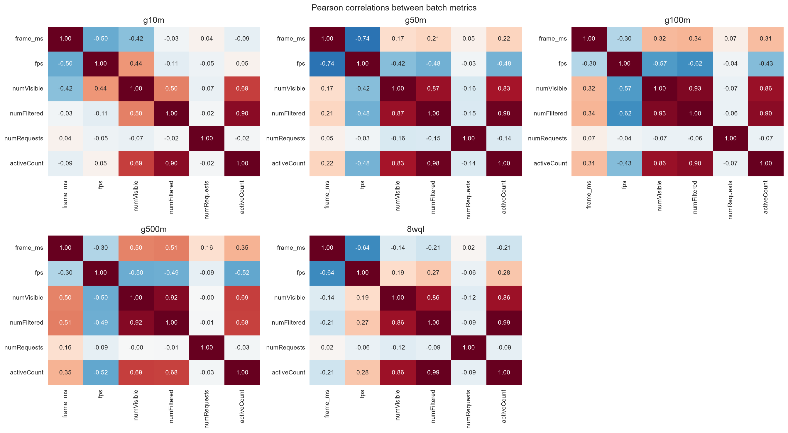

_Caption (Fig. 558): Batch metric correlation grid across scenes._

**Fig. 559**
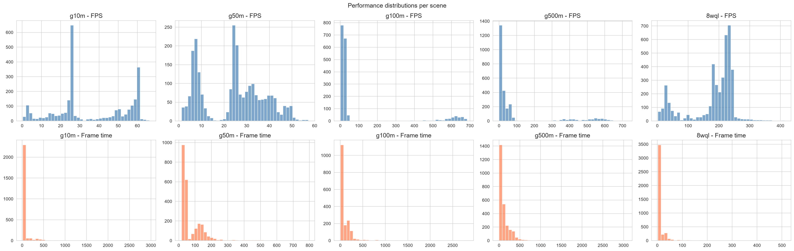

_Caption (Fig. 559): Batch performance distributions across scenes._

**Fig. 560**

_Caption (Fig. 560): Pool residency and atom-fraction metrics (coverage, not VRAM)._

**Fig. 561**
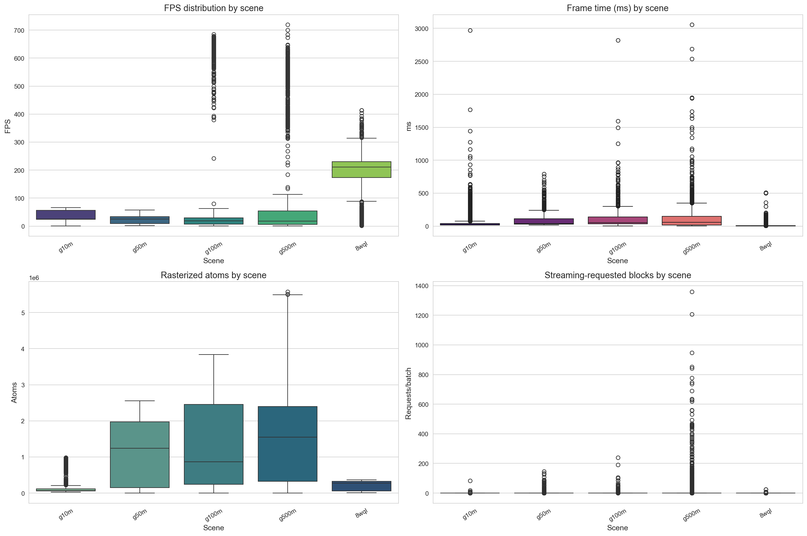

_Caption (Fig. 561): Batch summary boxplots across scenes._

#### Occlusion ratio at fixed views (by avg_numVisible)

**Fig. 562**
![Occlusion efficiency ratio vs batch_index for top visible-block levels [G10M].](img/chapter3/results/ooc/batch/occlusion_by_visibility/g10m.png)

_Caption (Fig. 562): Occlusion efficiency ratio vs batch_index for top visible-block levels [G10M]._

**Fig. 563**
![Occlusion efficiency ratio vs batch_index for top visible-block levels [G50M].](img/chapter3/results/ooc/batch/occlusion_by_visibility/g50m.png)

_Caption (Fig. 563): Occlusion efficiency ratio vs batch_index for top visible-block levels [G50M]._

**Fig. 564**
![Occlusion efficiency ratio vs batch_index for top visible-block levels [G100M].](img/chapter3/results/ooc/batch/occlusion_by_visibility/g100m.png)

_Caption (Fig. 564): Occlusion efficiency ratio vs batch_index for top visible-block levels [G100M]._

**Fig. 565**
![Occlusion efficiency ratio vs batch_index for top post-occlusion block levels [G500M] (10 groups).](img/chapter3/results/ooc/batch/occlusion_by_visibility/g500m.png)

_Caption (Fig. 565): Occlusion efficiency ratio vs batch_index for top post-occlusion block levels [G500M] (10 groups)._

**Fig. 566**
![Occlusion efficiency ratio vs batch_index for top visible-block levels [8WQL].](img/chapter3/results/ooc/batch/occlusion_by_visibility/8wql.png)

_Caption (Fig. 566): Occlusion efficiency ratio vs batch_index for top visible-block levels [8WQL]._

#### Peak block requests vs batch_index

**Fig. 567**
![Peak block requests per batch vs. batch_index [G10M].](img/chapter3/results/ooc/batch/streaming_by_visibility/g10m.png)

_Caption (Fig. 567): Peak block requests per batch vs. batch_index [G10M]._

**Fig. 568**
![Peak block requests per batch vs. batch_index [G50M].](img/chapter3/results/ooc/batch/streaming_by_visibility/g50m.png)

_Caption (Fig. 568): Peak block requests per batch vs. batch_index [G50M]._

**Fig. 569**
![Peak block requests per batch vs. batch_index [G100M].](img/chapter3/results/ooc/batch/streaming_by_visibility/g100m.png)

_Caption (Fig. 569): Peak block requests per batch vs. batch_index [G100M]._

**Fig. 570**
![Peak block requests per batch vs. batch_index [G500M].](img/chapter3/results/ooc/batch/streaming_by_visibility/g500m.png)

_Caption (Fig. 570): Peak block requests per batch vs. batch_index [G500M]._

**Fig. 571**
![Peak block requests per batch vs. batch_index [8WQL].](img/chapter3/results/ooc/batch/streaming_by_visibility/8wql.png)

_Caption (Fig. 571): Peak block requests per batch vs. batch_index [8WQL]._

#### Batch timeseries

**Fig. 572**
![Batch timeseries [G10M]: FPS, frame time, and logical counters.](img/chapter3/results/ooc/batch/timeseries/g10m.png)

_Caption (Fig. 572): Batch timeseries [G10M]: FPS, frame time, and logical counters._

**Fig. 573**
![Batch timeseries [G50M]: FPS, frame time, and logical counters.](img/chapter3/results/ooc/batch/timeseries/g50m.png)

_Caption (Fig. 573): Batch timeseries [G50M]: FPS, frame time, and logical counters._

**Fig. 574**
![Batch timeseries [G100M]: FPS, frame time, and logical counters.](img/chapter3/results/ooc/batch/timeseries/g100m.png)

_Caption (Fig. 574): Batch timeseries [G100M]: FPS, frame time, and logical counters._

**Fig. 575**
![Batch timeseries [G500M]: FPS, frame time, and logical counters.](img/chapter3/results/ooc/batch/timeseries/g500m.png)

_Caption (Fig. 575): Batch timeseries [G500M]: FPS, frame time, and logical counters._

**Fig. 576**
![Batch timeseries [8WQL]: FPS, frame time, and logical counters.](img/chapter3/results/ooc/batch/timeseries/8wql.png)

_Caption (Fig. 576): Batch timeseries [8WQL]: FPS, frame time, and logical counters._

#### Cross-scene metric comparisons

**Fig. 577**

_Caption (Fig. 577): Cross-scene comparison: gr active pct comparison._

**Fig. 578**

_Caption (Fig. 578): Cross-scene comparison: gr idle pct comparison._

**Fig. 579**

_Caption (Fig. 579): Cross-scene comparison: l1tex hit pct comparison._

**Fig. 580**

_Caption (Fig. 580): Cross-scene comparison: pcie throughput comparison._

#### Metric correlation by pipeline stage

**Fig. 581**
![Metric correlation [G10M] for stage build active atom list.](img/chapter3/results/ooc/nsight/correlation/g10m_build_active_atom_list.png)

_Caption (Fig. 581): Metric correlation [G10M] for stage build active atom list._

**Fig. 582**
![Metric correlation [G10M] for stage occlusion culling.](img/chapter3/results/ooc/nsight/correlation/g10m_occlusion_culling.png)

_Caption (Fig. 582): Metric correlation [G10M] for stage occlusion culling._

**Fig. 583**
![Metric correlation [G10M] for stage octree bfs frustum culling.](img/chapter3/results/ooc/nsight/correlation/g10m_octree_bfs_frustum_culling.png)

_Caption (Fig. 583): Metric correlation [G10M] for stage octree bfs frustum culling._

**Fig. 584**
![Metric correlation [G10M] for stage sphere raster ooc.](img/chapter3/results/ooc/nsight/correlation/g10m_sphere_raster_ooc.png)

_Caption (Fig. 584): Metric correlation [G10M] for stage sphere raster ooc._

**Fig. 585**
![Metric correlation [G50M] for stage build active atom list.](img/chapter3/results/ooc/nsight/correlation/g50m_build_active_atom_list.png)

_Caption (Fig. 585): Metric correlation [G50M] for stage build active atom list._

**Fig. 586**
![Metric correlation [G50M] for stage occlusion culling.](img/chapter3/results/ooc/nsight/correlation/g50m_occlusion_culling.png)

_Caption (Fig. 586): Metric correlation [G50M] for stage occlusion culling._

**Fig. 587**
![Metric correlation [G50M] for stage octree bfs frustum culling.](img/chapter3/results/ooc/nsight/correlation/g50m_octree_bfs_frustum_culling.png)

_Caption (Fig. 587): Metric correlation [G50M] for stage octree bfs frustum culling._

**Fig. 588**
![Metric correlation [G50M] for stage sphere raster ooc.](img/chapter3/results/ooc/nsight/correlation/g50m_sphere_raster_ooc.png)

_Caption (Fig. 588): Metric correlation [G50M] for stage sphere raster ooc._

**Fig. 589**
![Metric correlation [G100M] for stage build active atom list.](img/chapter3/results/ooc/nsight/correlation/g100m_build_active_atom_list.png)

_Caption (Fig. 589): Metric correlation [G100M] for stage build active atom list._

**Fig. 590**
![Metric correlation [G100M] for stage occlusion culling.](img/chapter3/results/ooc/nsight/correlation/g100m_occlusion_culling.png)

_Caption (Fig. 590): Metric correlation [G100M] for stage occlusion culling._

**Fig. 591**
![Metric correlation [G100M] for stage octree bfs frustum culling.](img/chapter3/results/ooc/nsight/correlation/g100m_octree_bfs_frustum_culling.png)

_Caption (Fig. 591): Metric correlation [G100M] for stage octree bfs frustum culling._

**Fig. 592**
![Metric correlation [G100M] for stage sphere raster ooc.](img/chapter3/results/ooc/nsight/correlation/g100m_sphere_raster_ooc.png)

_Caption (Fig. 592): Metric correlation [G100M] for stage sphere raster ooc._

**Fig. 593**
![Metric correlation [G500M] for stage build active atom list.](img/chapter3/results/ooc/nsight/correlation/g500m_build_active_atom_list.png)

_Caption (Fig. 593): Metric correlation [G500M] for stage build active atom list._

**Fig. 594**
![Metric correlation [G500M] for stage occlusion culling.](img/chapter3/results/ooc/nsight/correlation/g500m_occlusion_culling.png)

_Caption (Fig. 594): Metric correlation [G500M] for stage occlusion culling._

**Fig. 595**
![Metric correlation [G500M] for stage octree bfs frustum culling.](img/chapter3/results/ooc/nsight/correlation/g500m_octree_bfs_frustum_culling.png)

_Caption (Fig. 595): Metric correlation [G500M] for stage octree bfs frustum culling._

**Fig. 596**
![Metric correlation [G500M] for stage sphere raster ooc.](img/chapter3/results/ooc/nsight/correlation/g500m_sphere_raster_ooc.png)

_Caption (Fig. 596): Metric correlation [G500M] for stage sphere raster ooc._

**Fig. 597**
![Metric correlation [8WQL] for stage build active atom list.](img/chapter3/results/ooc/nsight/correlation/8wql_build_active_atom_list.png)

_Caption (Fig. 597): Metric correlation [8WQL] for stage build active atom list._

**Fig. 598**
![Metric correlation [8WQL] for stage occlusion culling.](img/chapter3/results/ooc/nsight/correlation/8wql_occlusion_culling.png)

_Caption (Fig. 598): Metric correlation [8WQL] for stage occlusion culling._

**Fig. 599**
![Metric correlation [8WQL] for stage octree bfs frustum culling.](img/chapter3/results/ooc/nsight/correlation/8wql_octree_bfs_frustum_culling.png)

_Caption (Fig. 599): Metric correlation [8WQL] for stage octree bfs frustum culling._

**Fig. 600**
![Metric correlation [8WQL] for stage sphere raster ooc.](img/chapter3/results/ooc/nsight/correlation/8wql_sphere_raster_ooc.png)

_Caption (Fig. 600): Metric correlation [8WQL] for stage sphere raster ooc._

#### Nsight frame time by camera ring

**Fig. 601**
![Mean Nsight Graphics frame time by camera ring [G10M] (error bars: std over frames and positional replicas).](img/chapter3/results/ooc/nsight/frame_ms_by_ring/g10m.png)

_Caption (Fig. 601): Mean Nsight Graphics frame time by camera ring [G10M] (error bars: std over frames and positional replicas)._

**Fig. 602**
![Mean Nsight Graphics frame time by camera ring [G50M] (error bars: std over frames and positional replicas).](img/chapter3/results/ooc/nsight/frame_ms_by_ring/g50m.png)

_Caption (Fig. 602): Mean Nsight Graphics frame time by camera ring [G50M] (error bars: std over frames and positional replicas)._

**Fig. 603**
![Mean Nsight Graphics frame time by camera ring [G100M] (error bars: std over frames and positional replicas).](img/chapter3/results/ooc/nsight/frame_ms_by_ring/g100m.png)

_Caption (Fig. 603): Mean Nsight Graphics frame time by camera ring [G100M] (error bars: std over frames and positional replicas)._

**Fig. 604**
![Mean Nsight Graphics frame time by camera ring [G500M] (error bars: std over frames and positional replicas).](img/chapter3/results/ooc/nsight/frame_ms_by_ring/g500m.png)

_Caption (Fig. 604): Mean Nsight Graphics frame time by camera ring [G500M] (error bars: std over frames and positional replicas)._

**Fig. 605**
![Mean Nsight Graphics frame time by camera ring [8WQL] (error bars: std over frames and positional replicas).](img/chapter3/results/ooc/nsight/frame_ms_by_ring/8wql.png)

_Caption (Fig. 605): Mean Nsight Graphics frame time by camera ring [8WQL] (error bars: std over frames and positional replicas)._

**Fig. 606**

_Caption (Fig. 606): Mean Nsight Graphics frame time by camera ring; grouped bars compare all scenes (error bars: std over frames and positional replicas)._

#### GR cycles active by stage and ring

**Fig. 607**
![GR cycles active [G10M] by pipeline stage and camera ring.](img/chapter3/results/ooc/nsight/gr_active/g10m.png)

_Caption (Fig. 607): GR cycles active [G10M] by pipeline stage and camera ring._

**Fig. 608**
![GR cycles active [G50M] by pipeline stage and camera ring.](img/chapter3/results/ooc/nsight/gr_active/g50m.png)

_Caption (Fig. 608): GR cycles active [G50M] by pipeline stage and camera ring._

**Fig. 609**
![GR cycles active [G100M] by pipeline stage and camera ring.](img/chapter3/results/ooc/nsight/gr_active/g100m.png)

_Caption (Fig. 609): GR cycles active [G100M] by pipeline stage and camera ring._

**Fig. 610**
![GR cycles active [G500M] by pipeline stage and camera ring.](img/chapter3/results/ooc/nsight/gr_active/g500m.png)

_Caption (Fig. 610): GR cycles active [G500M] by pipeline stage and camera ring._

**Fig. 611**
![GR cycles active [8WQL] by pipeline stage and camera ring.](img/chapter3/results/ooc/nsight/gr_active/8wql.png)

_Caption (Fig. 611): GR cycles active [8WQL] by pipeline stage and camera ring._

#### GPU idle by stage and ring

**Fig. 612**
![GPU idle [G10M] by pipeline stage and camera ring.](img/chapter3/results/ooc/nsight/gr_idle/g10m.png)

_Caption (Fig. 612): GPU idle [G10M] by pipeline stage and camera ring._

**Fig. 613**
![GPU idle [G50M] by pipeline stage and camera ring.](img/chapter3/results/ooc/nsight/gr_idle/g50m.png)

_Caption (Fig. 613): GPU idle [G50M] by pipeline stage and camera ring._

**Fig. 614**
![GPU idle [G100M] by pipeline stage and camera ring.](img/chapter3/results/ooc/nsight/gr_idle/g100m.png)

_Caption (Fig. 614): GPU idle [G100M] by pipeline stage and camera ring._

**Fig. 615**
![GPU idle [G500M] by pipeline stage and camera ring.](img/chapter3/results/ooc/nsight/gr_idle/g500m.png)

_Caption (Fig. 615): GPU idle [G500M] by pipeline stage and camera ring._

**Fig. 616**
![GPU idle [8WQL] by pipeline stage and camera ring.](img/chapter3/results/ooc/nsight/gr_idle/8wql.png)

_Caption (Fig. 616): GPU idle [8WQL] by pipeline stage and camera ring._

#### L1TEX hit rate by stage and ring

**Fig. 617**
![L1TEX hit rate [G10M] by pipeline stage and camera ring.](img/chapter3/results/ooc/nsight/l1tex_hit/g10m.png)

_Caption (Fig. 617): L1TEX hit rate [G10M] by pipeline stage and camera ring._

**Fig. 618**
![L1TEX hit rate [G50M] by pipeline stage and camera ring.](img/chapter3/results/ooc/nsight/l1tex_hit/g50m.png)

_Caption (Fig. 618): L1TEX hit rate [G50M] by pipeline stage and camera ring._

**Fig. 619**
![L1TEX hit rate [G100M] by pipeline stage and camera ring.](img/chapter3/results/ooc/nsight/l1tex_hit/g100m.png)

_Caption (Fig. 619): L1TEX hit rate [G100M] by pipeline stage and camera ring._

**Fig. 620**
![L1TEX hit rate [G500M] by pipeline stage and camera ring.](img/chapter3/results/ooc/nsight/l1tex_hit/g500m.png)

_Caption (Fig. 620): L1TEX hit rate [G500M] by pipeline stage and camera ring._

**Fig. 621**
![L1TEX hit rate [8WQL] by pipeline stage and camera ring.](img/chapter3/results/ooc/nsight/l1tex_hit/8wql.png)

_Caption (Fig. 621): L1TEX hit rate [8WQL] by pipeline stage and camera ring._

#### Memory-bound vs compute-bound scatter

**Fig. 622**
![PCIe throughput vs SM issue active [G10M].](img/chapter3/results/ooc/nsight/memory_bound/g10m.png)

_Caption (Fig. 622): PCIe throughput vs SM issue active [G10M]._

**Fig. 623**
![PCIe throughput vs SM issue active [G50M].](img/chapter3/results/ooc/nsight/memory_bound/g50m.png)

_Caption (Fig. 623): PCIe throughput vs SM issue active [G50M]._

**Fig. 624**
![PCIe throughput vs SM issue active [G100M].](img/chapter3/results/ooc/nsight/memory_bound/g100m.png)

_Caption (Fig. 624): PCIe throughput vs SM issue active [G100M]._

**Fig. 625**
![PCIe throughput vs SM issue active [G500M].](img/chapter3/results/ooc/nsight/memory_bound/g500m.png)

_Caption (Fig. 625): PCIe throughput vs SM issue active [G500M]._

**Fig. 626**
![PCIe throughput vs SM issue active [8WQL].](img/chapter3/results/ooc/nsight/memory_bound/8wql.png)

_Caption (Fig. 626): PCIe throughput vs SM issue active [8WQL]._

#### GPU metrics vs camera ring

**Fig. 627**
![Metric trend vs camera ring [G10M]: gr active pct.](img/chapter3/results/ooc/nsight/metrics_vs_ring/g10m_gr_active_pct.png)

_Caption (Fig. 627): Metric trend vs camera ring [G10M]: gr active pct._

**Fig. 628**
![Metric trend vs camera ring [G10M]: gr idle pct.](img/chapter3/results/ooc/nsight/metrics_vs_ring/g10m_gr_idle_pct.png)

_Caption (Fig. 628): Metric trend vs camera ring [G10M]: gr idle pct._

**Fig. 629**
![Metric trend vs camera ring [G10M]: l1tex hit pct.](img/chapter3/results/ooc/nsight/metrics_vs_ring/g10m_l1tex_hit_pct.png)

_Caption (Fig. 629): Metric trend vs camera ring [G10M]: l1tex hit pct._

**Fig. 630**
![Metric trend vs camera ring [G10M]: pcie throughput.](img/chapter3/results/ooc/nsight/metrics_vs_ring/g10m_pcie_throughput.png)

_Caption (Fig. 630): Metric trend vs camera ring [G10M]: pcie throughput._

**Fig. 631**
![Metric trend vs camera ring [G10M]: sm issue active.](img/chapter3/results/ooc/nsight/metrics_vs_ring/g10m_sm_issue_active.png)

_Caption (Fig. 631): Metric trend vs camera ring [G10M]: sm issue active._

**Fig. 632**
![Metric trend vs camera ring [G10M]: warp occ pct.](img/chapter3/results/ooc/nsight/metrics_vs_ring/g10m_warp_occ_pct.png)

_Caption (Fig. 632): Metric trend vs camera ring [G10M]: warp occ pct._

**Fig. 633**
![Metric trend vs camera ring [G50M]: gr active pct.](img/chapter3/results/ooc/nsight/metrics_vs_ring/g50m_gr_active_pct.png)

_Caption (Fig. 633): Metric trend vs camera ring [G50M]: gr active pct._

**Fig. 634**
![Metric trend vs camera ring [G50M]: gr idle pct.](img/chapter3/results/ooc/nsight/metrics_vs_ring/g50m_gr_idle_pct.png)

_Caption (Fig. 634): Metric trend vs camera ring [G50M]: gr idle pct._

**Fig. 635**
![Metric trend vs camera ring [G50M]: l1tex hit pct.](img/chapter3/results/ooc/nsight/metrics_vs_ring/g50m_l1tex_hit_pct.png)

_Caption (Fig. 635): Metric trend vs camera ring [G50M]: l1tex hit pct._

**Fig. 636**
![Metric trend vs camera ring [G50M]: pcie throughput.](img/chapter3/results/ooc/nsight/metrics_vs_ring/g50m_pcie_throughput.png)

_Caption (Fig. 636): Metric trend vs camera ring [G50M]: pcie throughput._

**Fig. 637**
![Metric trend vs camera ring [G50M]: sm issue active.](img/chapter3/results/ooc/nsight/metrics_vs_ring/g50m_sm_issue_active.png)

_Caption (Fig. 637): Metric trend vs camera ring [G50M]: sm issue active._

**Fig. 638**
![Metric trend vs camera ring [G50M]: warp occ pct.](img/chapter3/results/ooc/nsight/metrics_vs_ring/g50m_warp_occ_pct.png)

_Caption (Fig. 638): Metric trend vs camera ring [G50M]: warp occ pct._

**Fig. 639**
![Metric trend vs camera ring [G100M]: gr active pct.](img/chapter3/results/ooc/nsight/metrics_vs_ring/g100m_gr_active_pct.png)

_Caption (Fig. 639): Metric trend vs camera ring [G100M]: gr active pct._

**Fig. 640**
![Metric trend vs camera ring [G100M]: gr idle pct.](img/chapter3/results/ooc/nsight/metrics_vs_ring/g100m_gr_idle_pct.png)

_Caption (Fig. 640): Metric trend vs camera ring [G100M]: gr idle pct._

**Fig. 641**
![Metric trend vs camera ring [G100M]: l1tex hit pct.](img/chapter3/results/ooc/nsight/metrics_vs_ring/g100m_l1tex_hit_pct.png)

_Caption (Fig. 641): Metric trend vs camera ring [G100M]: l1tex hit pct._

**Fig. 642**
![Metric trend vs camera ring [G100M]: pcie throughput.](img/chapter3/results/ooc/nsight/metrics_vs_ring/g100m_pcie_throughput.png)

_Caption (Fig. 642): Metric trend vs camera ring [G100M]: pcie throughput._

**Fig. 643**
![Metric trend vs camera ring [G100M]: sm issue active.](img/chapter3/results/ooc/nsight/metrics_vs_ring/g100m_sm_issue_active.png)

_Caption (Fig. 643): Metric trend vs camera ring [G100M]: sm issue active._

**Fig. 644**
![Metric trend vs camera ring [G100M]: warp occ pct.](img/chapter3/results/ooc/nsight/metrics_vs_ring/g100m_warp_occ_pct.png)

_Caption (Fig. 644): Metric trend vs camera ring [G100M]: warp occ pct._

**Fig. 645**
![Metric trend vs camera ring [G500M]: gr active pct.](img/chapter3/results/ooc/nsight/metrics_vs_ring/g500m_gr_active_pct.png)

_Caption (Fig. 645): Metric trend vs camera ring [G500M]: gr active pct._

**Fig. 646**
![Metric trend vs camera ring [G500M]: gr idle pct.](img/chapter3/results/ooc/nsight/metrics_vs_ring/g500m_gr_idle_pct.png)

_Caption (Fig. 646): Metric trend vs camera ring [G500M]: gr idle pct._

**Fig. 647**
![Metric trend vs camera ring [G500M]: l1tex hit pct.](img/chapter3/results/ooc/nsight/metrics_vs_ring/g500m_l1tex_hit_pct.png)

_Caption (Fig. 647): Metric trend vs camera ring [G500M]: l1tex hit pct._

**Fig. 648**
![Metric trend vs camera ring [G500M]: pcie throughput.](img/chapter3/results/ooc/nsight/metrics_vs_ring/g500m_pcie_throughput.png)

_Caption (Fig. 648): Metric trend vs camera ring [G500M]: pcie throughput._

**Fig. 649**
![Metric trend vs camera ring [G500M]: sm issue active.](img/chapter3/results/ooc/nsight/metrics_vs_ring/g500m_sm_issue_active.png)

_Caption (Fig. 649): Metric trend vs camera ring [G500M]: sm issue active._

**Fig. 650**
![Metric trend vs camera ring [G500M]: warp occ pct.](img/chapter3/results/ooc/nsight/metrics_vs_ring/g500m_warp_occ_pct.png)

_Caption (Fig. 650): Metric trend vs camera ring [G500M]: warp occ pct._

**Fig. 651**
![Metric trend vs camera ring [8WQL]: gr active pct.](img/chapter3/results/ooc/nsight/metrics_vs_ring/8wql_gr_active_pct.png)

_Caption (Fig. 651): Metric trend vs camera ring [8WQL]: gr active pct._

**Fig. 652**
![Metric trend vs camera ring [8WQL]: gr idle pct.](img/chapter3/results/ooc/nsight/metrics_vs_ring/8wql_gr_idle_pct.png)

_Caption (Fig. 652): Metric trend vs camera ring [8WQL]: gr idle pct._

**Fig. 653**
![Metric trend vs camera ring [8WQL]: l1tex hit pct.](img/chapter3/results/ooc/nsight/metrics_vs_ring/8wql_l1tex_hit_pct.png)

_Caption (Fig. 653): Metric trend vs camera ring [8WQL]: l1tex hit pct._

**Fig. 654**
![Metric trend vs camera ring [8WQL]: pcie throughput.](img/chapter3/results/ooc/nsight/metrics_vs_ring/8wql_pcie_throughput.png)

_Caption (Fig. 654): Metric trend vs camera ring [8WQL]: pcie throughput._

**Fig. 655**
![Metric trend vs camera ring [8WQL]: sm issue active.](img/chapter3/results/ooc/nsight/metrics_vs_ring/8wql_sm_issue_active.png)

_Caption (Fig. 655): Metric trend vs camera ring [8WQL]: sm issue active._

**Fig. 656**
![Metric trend vs camera ring [8WQL]: warp occ pct.](img/chapter3/results/ooc/nsight/metrics_vs_ring/8wql_warp_occ_pct.png)

_Caption (Fig. 656): Metric trend vs camera ring [8WQL]: warp occ pct._

#### Composite vertical panels

**Fig. 657**
![Composite vertical panel [correlation g10m].](img/chapter3/results/ooc/nsight/panels/correlation_g10m.png)

_Caption (Fig. 657): Composite vertical panel [correlation g10m]._

**Fig. 658**
![Composite vertical panel [metrics vs ring g10m].](img/chapter3/results/ooc/nsight/panels/metrics_vs_ring_g10m.png)

_Caption (Fig. 658): Composite vertical panel [metrics vs ring g10m]._

**Fig. 659**
![Composite vertical panel [stall rings g100m].](img/chapter3/results/ooc/nsight/panels/stall_rings_g100m.png)

_Caption (Fig. 659): Composite vertical panel [stall rings g100m]._

**Fig. 660**
![Composite vertical panel [gr active idle g500m].](img/chapter3/results/ooc/nsight/panels/gr_active_idle_g500m.png)

_Caption (Fig. 660): Composite vertical panel [gr active idle g500m]._

**Fig. 661**
![Composite vertical panel [l1tex pcie g500m].](img/chapter3/results/ooc/nsight/panels/l1tex_pcie_g500m.png)

_Caption (Fig. 661): Composite vertical panel [l1tex pcie g500m]._

**Fig. 662**
![Composite vertical panel [metrics vs ring g500m].](img/chapter3/results/ooc/nsight/panels/metrics_vs_ring_g500m.png)

_Caption (Fig. 662): Composite vertical panel [metrics vs ring g500m]._

**Fig. 663**
![Composite vertical panel [stall rings 8wql].](img/chapter3/results/ooc/nsight/panels/stall_rings_8wql.png)

_Caption (Fig. 663): Composite vertical panel [stall rings 8wql]._

#### PCIe throughput by stage and ring

**Fig. 664**
![PCIe throughput [G10M] by pipeline stage and camera ring.](img/chapter3/results/ooc/nsight/pcie/g10m.png)

_Caption (Fig. 664): PCIe throughput [G10M] by pipeline stage and camera ring._

**Fig. 665**
![PCIe throughput [G50M] by pipeline stage and camera ring.](img/chapter3/results/ooc/nsight/pcie/g50m.png)

_Caption (Fig. 665): PCIe throughput [G50M] by pipeline stage and camera ring._

**Fig. 666**
![PCIe throughput [G100M] by pipeline stage and camera ring.](img/chapter3/results/ooc/nsight/pcie/g100m.png)

_Caption (Fig. 666): PCIe throughput [G100M] by pipeline stage and camera ring._

**Fig. 667**
![PCIe throughput [G500M] by pipeline stage and camera ring.](img/chapter3/results/ooc/nsight/pcie/g500m.png)

_Caption (Fig. 667): PCIe throughput [G500M] by pipeline stage and camera ring._

**Fig. 668**
![PCIe throughput [8WQL] by pipeline stage and camera ring.](img/chapter3/results/ooc/nsight/pcie/8wql.png)

_Caption (Fig. 668): PCIe throughput [8WQL] by pipeline stage and camera ring._

#### Pipeline stage fractions

**Fig. 669**

_Caption (Fig. 669): Renormalised pipeline-stage fractions for G10M by camera ring._

**Fig. 670**

_Caption (Fig. 670): Renormalised pipeline-stage fractions for G50M by camera ring._

**Fig. 671**

_Caption (Fig. 671): Renormalised pipeline-stage fractions for G100M by camera ring._

**Fig. 672**

_Caption (Fig. 672): Renormalised pipeline-stage fractions for G500M by camera ring._

**Fig. 673**

_Caption (Fig. 673): Renormalised pipeline-stage fractions for 8WQL by camera ring._

#### Pipeline stage heatmaps

**Fig. 674**

_Caption (Fig. 674): Stage-fraction heatmap for G10M._

**Fig. 675**

_Caption (Fig. 675): Stage-fraction heatmap for G50M._

**Fig. 676**

_Caption (Fig. 676): Stage-fraction heatmap for G100M._

**Fig. 677**

_Caption (Fig. 677): Stage-fraction heatmap for G500M._

**Fig. 678**

_Caption (Fig. 678): Stage-fraction heatmap for 8WQL._

#### Warp stall breakdown by ring

**Fig. 679**
![Warp stall breakdown [G10M], camera ring 1.](img/chapter3/results/ooc/nsight/stall_breakdown/g10m_ring1.png)

_Caption (Fig. 679): Warp stall breakdown [G10M], camera ring 1._

**Fig. 680**
![Warp stall breakdown [G10M], camera ring 2.](img/chapter3/results/ooc/nsight/stall_breakdown/g10m_ring2.png)

_Caption (Fig. 680): Warp stall breakdown [G10M], camera ring 2._

**Fig. 681**
![Warp stall breakdown [G10M], camera ring 3.](img/chapter3/results/ooc/nsight/stall_breakdown/g10m_ring3.png)

_Caption (Fig. 681): Warp stall breakdown [G10M], camera ring 3._

**Fig. 682**
![Warp stall breakdown [G10M], camera ring 4.](img/chapter3/results/ooc/nsight/stall_breakdown/g10m_ring4.png)

_Caption (Fig. 682): Warp stall breakdown [G10M], camera ring 4._

**Fig. 683**
![Warp stall breakdown [G10M], camera ring 5.](img/chapter3/results/ooc/nsight/stall_breakdown/g10m_ring5.png)

_Caption (Fig. 683): Warp stall breakdown [G10M], camera ring 5._

**Fig. 684**
![Warp stall breakdown [G50M], camera ring 1.](img/chapter3/results/ooc/nsight/stall_breakdown/g50m_ring1.png)

_Caption (Fig. 684): Warp stall breakdown [G50M], camera ring 1._

**Fig. 685**
![Warp stall breakdown [G50M], camera ring 2.](img/chapter3/results/ooc/nsight/stall_breakdown/g50m_ring2.png)

_Caption (Fig. 685): Warp stall breakdown [G50M], camera ring 2._

**Fig. 686**
![Warp stall breakdown [G50M], camera ring 3.](img/chapter3/results/ooc/nsight/stall_breakdown/g50m_ring3.png)

_Caption (Fig. 686): Warp stall breakdown [G50M], camera ring 3._

**Fig. 687**
![Warp stall breakdown [G50M], camera ring 4.](img/chapter3/results/ooc/nsight/stall_breakdown/g50m_ring4.png)

_Caption (Fig. 687): Warp stall breakdown [G50M], camera ring 4._

**Fig. 688**
![Warp stall breakdown [G50M], camera ring 5.](img/chapter3/results/ooc/nsight/stall_breakdown/g50m_ring5.png)

_Caption (Fig. 688): Warp stall breakdown [G50M], camera ring 5._

**Fig. 689**
![Warp stall breakdown [G100M], camera ring 1.](img/chapter3/results/ooc/nsight/stall_breakdown/g100m_ring1.png)

_Caption (Fig. 689): Warp stall breakdown [G100M], camera ring 1._

**Fig. 690**
![Warp stall breakdown [G100M], camera ring 2.](img/chapter3/results/ooc/nsight/stall_breakdown/g100m_ring2.png)

_Caption (Fig. 690): Warp stall breakdown [G100M], camera ring 2._

**Fig. 691**
![Warp stall breakdown [G100M], camera ring 3.](img/chapter3/results/ooc/nsight/stall_breakdown/g100m_ring3.png)

_Caption (Fig. 691): Warp stall breakdown [G100M], camera ring 3._

**Fig. 692**
![Warp stall breakdown [G100M], camera ring 4.](img/chapter3/results/ooc/nsight/stall_breakdown/g100m_ring4.png)

_Caption (Fig. 692): Warp stall breakdown [G100M], camera ring 4._

**Fig. 693**
![Warp stall breakdown [G100M], camera ring 5.](img/chapter3/results/ooc/nsight/stall_breakdown/g100m_ring5.png)

_Caption (Fig. 693): Warp stall breakdown [G100M], camera ring 5._

**Fig. 694**
![Warp stall breakdown [G500M], camera ring 1.](img/chapter3/results/ooc/nsight/stall_breakdown/g500m_ring1.png)

_Caption (Fig. 694): Warp stall breakdown [G500M], camera ring 1._

**Fig. 695**
![Warp stall breakdown [G500M], camera ring 2.](img/chapter3/results/ooc/nsight/stall_breakdown/g500m_ring2.png)

_Caption (Fig. 695): Warp stall breakdown [G500M], camera ring 2._

**Fig. 696**
![Warp stall breakdown [G500M], camera ring 3.](img/chapter3/results/ooc/nsight/stall_breakdown/g500m_ring3.png)

_Caption (Fig. 696): Warp stall breakdown [G500M], camera ring 3._

**Fig. 697**
![Warp stall breakdown [G500M], camera ring 4.](img/chapter3/results/ooc/nsight/stall_breakdown/g500m_ring4.png)

_Caption (Fig. 697): Warp stall breakdown [G500M], camera ring 4._

**Fig. 698**
![Warp stall breakdown [G500M], camera ring 5.](img/chapter3/results/ooc/nsight/stall_breakdown/g500m_ring5.png)

_Caption (Fig. 698): Warp stall breakdown [G500M], camera ring 5._

**Fig. 699**
![Warp stall breakdown [8WQL], camera ring 1.](img/chapter3/results/ooc/nsight/stall_breakdown/8wql_ring1.png)

_Caption (Fig. 699): Warp stall breakdown [8WQL], camera ring 1._

**Fig. 700**
![Warp stall breakdown [8WQL], camera ring 2.](img/chapter3/results/ooc/nsight/stall_breakdown/8wql_ring2.png)

_Caption (Fig. 700): Warp stall breakdown [8WQL], camera ring 2._

**Fig. 701**
![Warp stall breakdown [8WQL], camera ring 3.](img/chapter3/results/ooc/nsight/stall_breakdown/8wql_ring3.png)

_Caption (Fig. 701): Warp stall breakdown [8WQL], camera ring 3._

**Fig. 702**
![Warp stall breakdown [8WQL], camera ring 4.](img/chapter3/results/ooc/nsight/stall_breakdown/8wql_ring4.png)

_Caption (Fig. 702): Warp stall breakdown [8WQL], camera ring 4._

**Fig. 703**
![Warp stall breakdown [8WQL], camera ring 5.](img/chapter3/results/ooc/nsight/stall_breakdown/8wql_ring5.png)

_Caption (Fig. 703): Warp stall breakdown [8WQL], camera ring 5._

#### Warp occupancy by stage and ring

**Fig. 704**
![Warp occupancy [G10M] by pipeline stage and camera ring.](img/chapter3/results/ooc/nsight/warp_occupancy/g10m.png)

_Caption (Fig. 704): Warp occupancy [G10M] by pipeline stage and camera ring._

**Fig. 705**
![Warp occupancy [G50M] by pipeline stage and camera ring.](img/chapter3/results/ooc/nsight/warp_occupancy/g50m.png)

_Caption (Fig. 705): Warp occupancy [G50M] by pipeline stage and camera ring._

**Fig. 706**
![Warp occupancy [G100M] by pipeline stage and camera ring.](img/chapter3/results/ooc/nsight/warp_occupancy/g100m.png)

_Caption (Fig. 706): Warp occupancy [G100M] by pipeline stage and camera ring._

**Fig. 707**
![Warp occupancy [G500M] by pipeline stage and camera ring.](img/chapter3/results/ooc/nsight/warp_occupancy/g500m.png)

_Caption (Fig. 707): Warp occupancy [G500M] by pipeline stage and camera ring._

**Fig. 708**
![Warp occupancy [8WQL] by pipeline stage and camera ring.](img/chapter3/results/ooc/nsight/warp_occupancy/8wql.png)

_Caption (Fig. 708): Warp occupancy [8WQL] by pipeline stage and camera ring._

#### PACKAGE scale analysis

**Fig. 709**
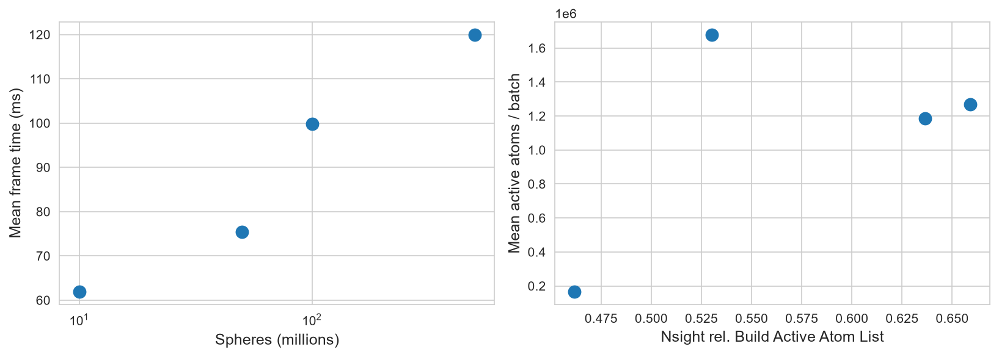

_Caption (Fig. 709): Left: mean batch avg_frame_ms from profiler CSV (not Nsight range_\_frames.txt). Right: Nsight Build Active Atom List fraction vs mean activeCount.\_

**Fig. 710**

_Caption (Fig. 710): Raster stage fraction vs PACKAGE scale._

#### Preprocess metrics

**Fig. 711**
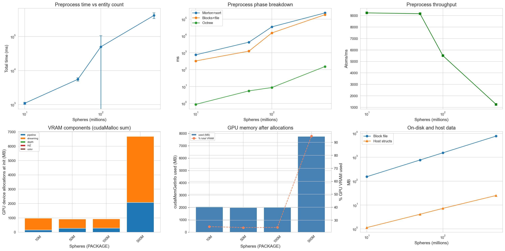

_Caption (Fig. 711): Preprocess phase timings, throughput, stacked GPU buffer allocations at init (pipeline, streaming, depth, HiZ, color), and cudaMemGetInfo usage._

**Fig. 712**

_Caption (Fig. 712): Block count, octree node count, and block-file size vs scale._
